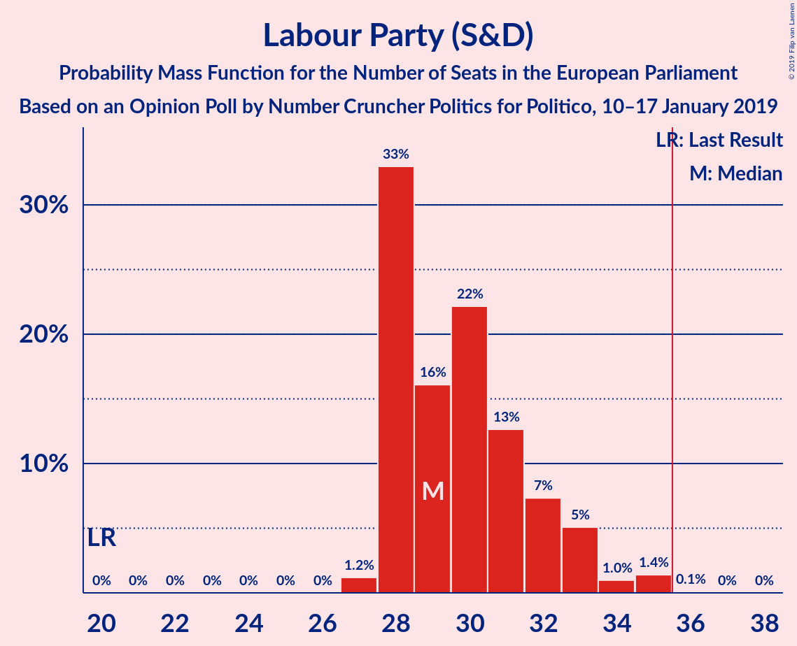
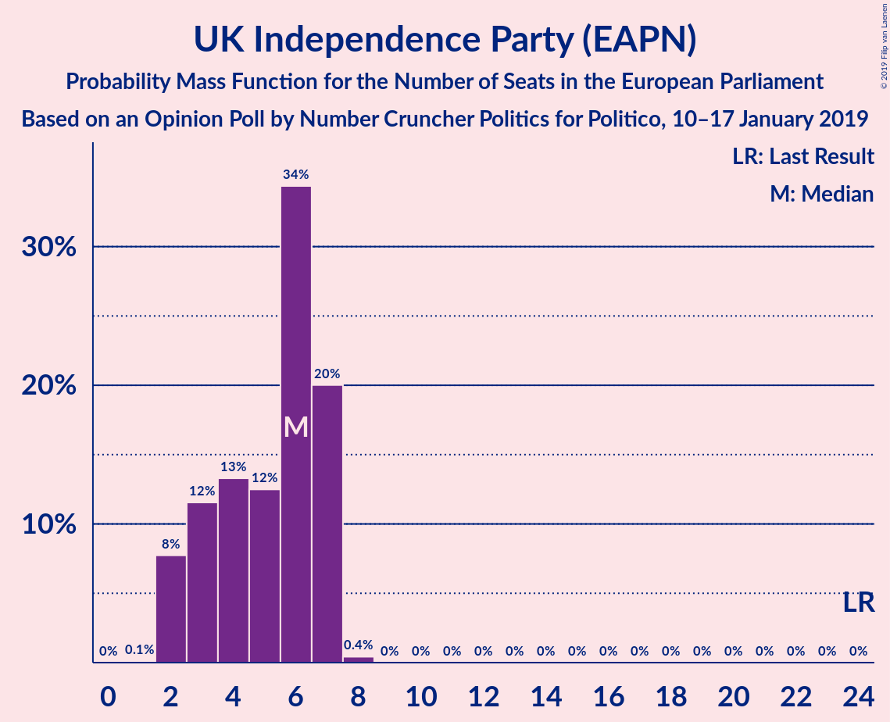
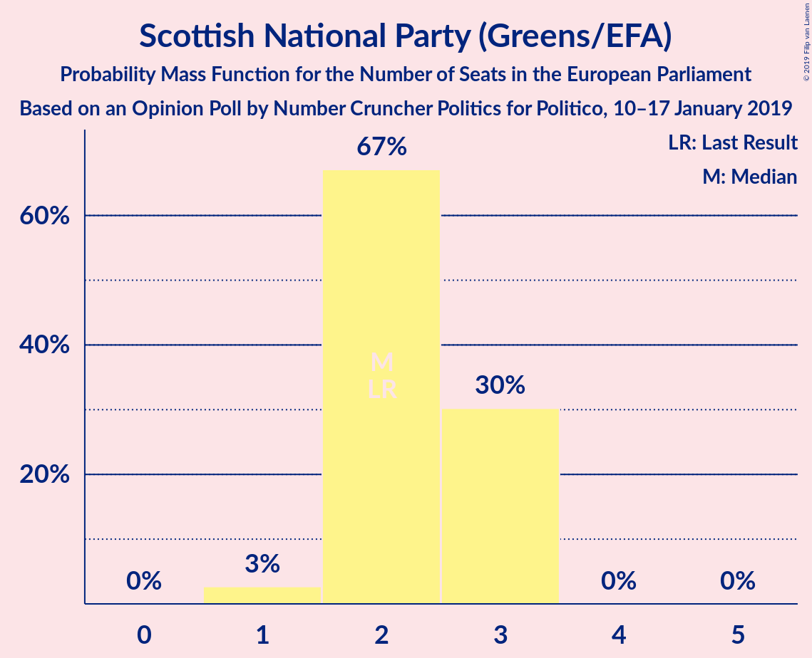
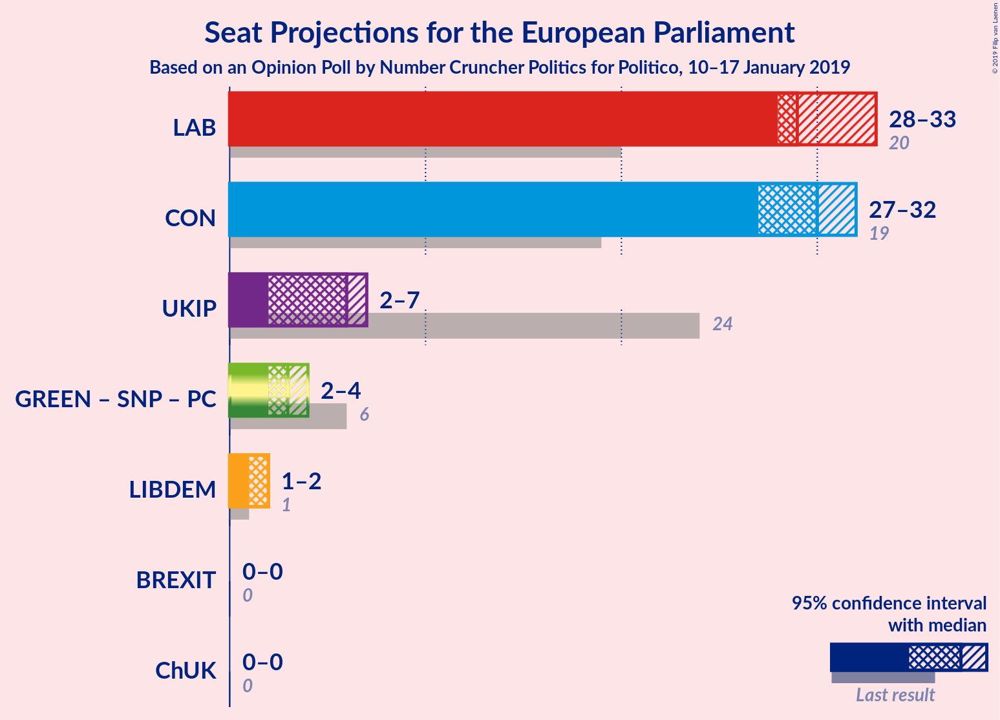
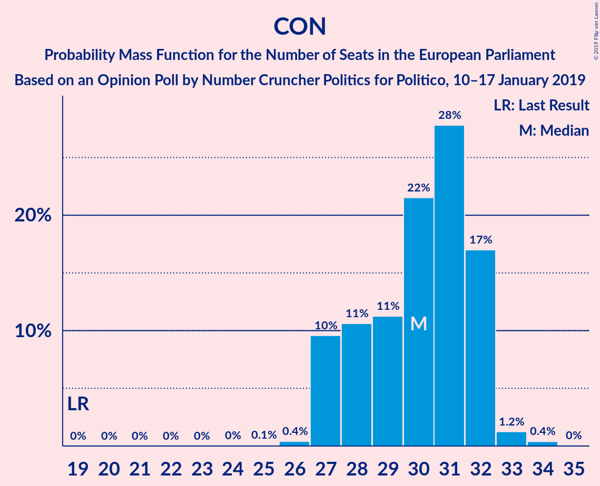
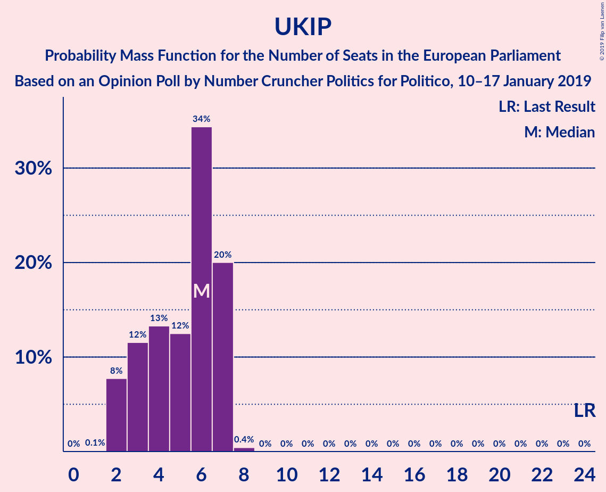
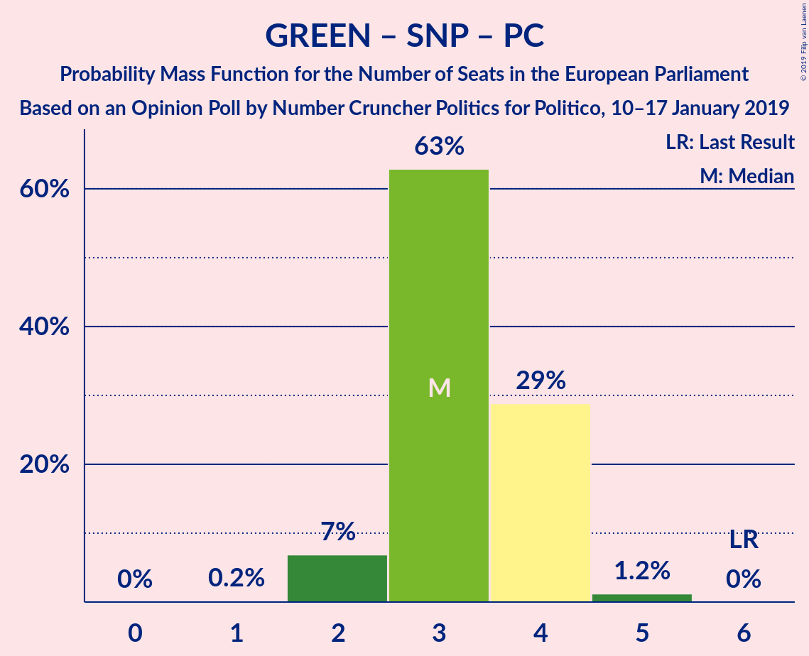

# Opinion Poll by Number Cruncher Politics for Politico, 10–17 January 2019

<a href="#voting-intentions">Voting Intentions</a> | <a href="#seats">Seats</a> | <a href="#coalitions">Coalitions</a> | <a href="#technical-information">Technical Information</a>

## Voting Intentions

### Confidence Intervals

| Party | Last Result | Poll Result | 80% Confidence Interval | 90% Confidence Interval | 95% Confidence Interval | 99% Confidence Interval |
|:-----:|:-----------:|:-----------:|:-----------------------:|:-----------------------:|:-----------------------:|:-----------------------:|
| Labour Party (S&D) | 24.4% | 36.9% | 35.0–38.9% |34.5–39.4% |34.0–39.9% |33.1–40.8% |
| Conservative Party (ECR) | 23.1% | 35.9% | 34.0–37.9% |33.5–38.4% |33.0–38.9% |32.1–39.9% |
| UK Independence Party (EAPN) | 26.6% | 10.0% | 8.9–11.3% |8.6–11.7% |8.3–12.0% |7.8–12.6% |
| Liberal Democrats (ALDE) | 6.6% | 8.0% | 7.0–9.1% |6.7–9.5% |6.5–9.8% |6.0–10.4% |
| Green Party (Greens/EFA) | 6.9% | 5.0% | 4.2–5.9% |4.0–6.2% |3.8–6.5% |3.4–7.0% |
| Scottish National Party (Greens/EFA) | 2.4% | 3.0% | 2.4–3.8% |2.3–4.0% |2.1–4.3% |1.9–4.7% |
| Plaid Cymru (Greens/EFA) | 0.7% | 1.0% | 0.7–1.5% |0.6–1.6% |0.5–1.8% |0.4–2.1% |

*Note:* The poll result column reflects the actual value used in the calculations. Published results may vary slightly, and in addition be rounded to fewer digits.

## Seats

### Confidence Intervals

| Party | Last Result | Median | 80% Confidence Interval | 90% Confidence Interval | 95% Confidence Interval | 99% Confidence Interval |
|:-----:|:-----------:|:------:|:-----------------------:|:-----------------------:|:-----------------------:|:-----------------------:|
| <a href="#labour-party-(s&d)">Labour Party (S&D)</a> | 20 | 29 | 28–32 |28–33 |28–33 |27–35 |
| <a href="#conservative-party-(ecr)">Conservative Party (ECR)</a> | 19 | 30 | 27–32 |27–32 |27–32 |26–33 |
| <a href="#uk-independence-party-(eapn)">UK Independence Party (EAPN)</a> | 24 | 6 | 3–7 |2–7 |2–7 |2–7 |
| <a href="#liberal-democrats-(alde)">Liberal Democrats (ALDE)</a> | 1 | 2 | 1–2 |1–2 |1–2 |0–3 |
| <a href="#green-party-(greens/efa)">Green Party (Greens/EFA)</a> | 3 | 0 | 0 |0 |0 |0–1 |
| <a href="#scottish-national-party-(greens/efa)">Scottish National Party (Greens/EFA)</a> | 2 | 2 | 2–3 |2–3 |1–3 |1–3 |
| <a href="#plaid-cymru-(greens/efa)">Plaid Cymru (Greens/EFA)</a> | 1 | 1 | 1 |0–1 |0–1 |0–2 |

### Labour Party (S&D)

*For a full overview of the results for this party, see the [Labour Party (S&D)](party-labourpartysd.html) page.*

| Number of Seats | Probability | Accumulated | Special Marks |
|:---------------:|:-----------:|:-----------:|:-------------:|
| 20 | 0% | 100% | Last Result |
| 21 | 0% | 100% |  |
| 22 | 0% | 100% |  |
| 23 | 0% | 100% |  |
| 24 | 0% | 100% |  |
| 25 | 0% | 100% |  |
| 26 | 0% | 100% |  |
| 27 | 1.2% | 100% |  |
| 28 | 33% | 98.8% |  |
| 29 | 16% | 66% | Median |
| 30 | 22% | 50% |  |
| 31 | 13% | 28% |  |
| 32 | 7% | 15% |  |
| 33 | 5% | 8% |  |
| 34 | 1.0% | 2% |  |
| 35 | 1.4% | 2% |  |
| 36 | 0.1% | 0.1% | Majority |
| 37 | 0% | 0% |  |

### Conservative Party (ECR)

*For a full overview of the results for this party, see the [Conservative Party (ECR)](party-conservativepartyecr.html) page.*

| Number of Seats | Probability | Accumulated | Special Marks |
|:---------------:|:-----------:|:-----------:|:-------------:|
| 19 | 0% | 100% | Last Result |
| 20 | 0% | 100% |  |
| 21 | 0% | 100% |  |
| 22 | 0% | 100% |  |
| 23 | 0% | 100% |  |
| 24 | 0% | 100% |  |
| 25 | 0.1% | 100% |  |
| 26 | 0.4% | 99.9% |  |
| 27 | 10% | 99.5% |  |
| 28 | 11% | 90% |  |
| 29 | 11% | 79% |  |
| 30 | 22% | 68% | Median |
| 31 | 28% | 46% |  |
| 32 | 17% | 19% |  |
| 33 | 1.2% | 2% |  |
| 34 | 0.4% | 0.4% |  |
| 35 | 0% | 0% |  |

### UK Independence Party (EAPN)

*For a full overview of the results for this party, see the [UK Independence Party (EAPN)](party-ukindependencepartyeapn.html) page.*

| Number of Seats | Probability | Accumulated | Special Marks |
|:---------------:|:-----------:|:-----------:|:-------------:|
| 1 | 0.1% | 100% |  |
| 2 | 8% | 99.9% |  |
| 3 | 12% | 92% |  |
| 4 | 13% | 81% |  |
| 5 | 12% | 67% |  |
| 6 | 34% | 55% | Median |
| 7 | 20% | 20% |  |
| 8 | 0.4% | 0.4% |  |
| 9 | 0% | 0% |  |
| 10 | 0% | 0% |  |
| 11 | 0% | 0% |  |
| 12 | 0% | 0% |  |
| 13 | 0% | 0% |  |
| 14 | 0% | 0% |  |
| 15 | 0% | 0% |  |
| 16 | 0% | 0% |  |
| 17 | 0% | 0% |  |
| 18 | 0% | 0% |  |
| 19 | 0% | 0% |  |
| 20 | 0% | 0% |  |
| 21 | 0% | 0% |  |
| 22 | 0% | 0% |  |
| 23 | 0% | 0% |  |
| 24 | 0% | 0% | Last Result |

### Liberal Democrats (ALDE)

*For a full overview of the results for this party, see the [Liberal Democrats (ALDE)](party-liberaldemocratsalde.html) page.*

| Number of Seats | Probability | Accumulated | Special Marks |
|:---------------:|:-----------:|:-----------:|:-------------:|
| 0 | 1.1% | 100% |  |
| 1 | 12% | 98.9% | Last Result |
| 2 | 86% | 87% | Median |
| 3 | 1.2% | 1.4% |  |
| 4 | 0.1% | 0.2% |  |
| 5 | 0.1% | 0.1% |  |
| 6 | 0% | 0% |  |

### Green Party (Greens/EFA)

*For a full overview of the results for this party, see the [Green Party (Greens/EFA)](party-greenpartygreensefa.html) page.*

| Number of Seats | Probability | Accumulated | Special Marks |
|:---------------:|:-----------:|:-----------:|:-------------:|
| 0 | 98% | 100% | Median |
| 1 | 2% | 2% |  |
| 2 | 0% | 0% |  |
| 3 | 0% | 0% | Last Result |

### Scottish National Party (Greens/EFA)

*For a full overview of the results for this party, see the [Scottish National Party (Greens/EFA)](party-scottishnationalpartygreensefa.html) page.*

| Number of Seats | Probability | Accumulated | Special Marks |
|:---------------:|:-----------:|:-----------:|:-------------:|
| 1 | 3% | 100% |  |
| 2 | 67% | 97% | Last Result, Median |
| 3 | 30% | 30% |  |
| 4 | 0% | 0% |  |

### Plaid Cymru (Greens/EFA)

*For a full overview of the results for this party, see the [Plaid Cymru (Greens/EFA)](party-plaidcymrugreensefa.html) page.*

| Number of Seats | Probability | Accumulated | Special Marks |
|:---------------:|:-----------:|:-----------:|:-------------:|
| 0 | 7% | 100% |  |
| 1 | 92% | 93% | Last Result, Median |
| 2 | 2% | 2% |  |
| 3 | 0% | 0% |  |

## Coalitions

### Confidence Intervals

| Coalition | Last Result | Median | Majority? | 80% Confidence Interval | 90% Confidence Interval | 95% Confidence Interval | 99% Confidence Interval |
|:---------:|:-----------:|:------:|:---------:|:-----------------------:|:-----------------------:|:-----------------------:|:-----------------------:|
| Labour Party (S&D) | 20 | 29 | 0.1% | 28–32 | 28–33 | 28–33 | 27–35 |
| Conservative Party (ECR) | 19 | 30 | 0% | 27–32 | 27–32 | 27–32 | 26–33 |
| UK Independence Party (EAPN) | 24 | 6 | 0% | 3–7 | 2–7 | 2–7 | 2–7 |
| Green Party (Greens/EFA) – Scottish National Party (Greens/EFA) – Plaid Cymru (Greens/EFA) | 6 | 3 | 0% | 3–4 | 2–4 | 2–4 | 2–5 |
| Liberal Democrats (ALDE) | 1 | 2 | 0% | 1–2 | 1–2 | 1–2 | 0–3 |

### Labour Party (S&D)

| Number of Seats | Probability | Accumulated | Special Marks |
|:---------------:|:-----------:|:-----------:|:-------------:|
| 20 | 0% | 100% | Last Result |
| 21 | 0% | 100% |  |
| 22 | 0% | 100% |  |
| 23 | 0% | 100% |  |
| 24 | 0% | 100% |  |
| 25 | 0% | 100% |  |
| 26 | 0% | 100% |  |
| 27 | 1.2% | 100% |  |
| 28 | 33% | 98.8% |  |
| 29 | 16% | 66% | Median |
| 30 | 22% | 50% |  |
| 31 | 13% | 28% |  |
| 32 | 7% | 15% |  |
| 33 | 5% | 8% |  |
| 34 | 1.0% | 2% |  |
| 35 | 1.4% | 2% |  |
| 36 | 0.1% | 0.1% | Majority |
| 37 | 0% | 0% |  |

### Conservative Party (ECR)

| Number of Seats | Probability | Accumulated | Special Marks |
|:---------------:|:-----------:|:-----------:|:-------------:|
| 19 | 0% | 100% | Last Result |
| 20 | 0% | 100% |  |
| 21 | 0% | 100% |  |
| 22 | 0% | 100% |  |
| 23 | 0% | 100% |  |
| 24 | 0% | 100% |  |
| 25 | 0.1% | 100% |  |
| 26 | 0.4% | 99.9% |  |
| 27 | 10% | 99.5% |  |
| 28 | 11% | 90% |  |
| 29 | 11% | 79% |  |
| 30 | 22% | 68% | Median |
| 31 | 28% | 46% |  |
| 32 | 17% | 19% |  |
| 33 | 1.2% | 2% |  |
| 34 | 0.4% | 0.4% |  |
| 35 | 0% | 0% |  |

### UK Independence Party (EAPN)

| Number of Seats | Probability | Accumulated | Special Marks |
|:---------------:|:-----------:|:-----------:|:-------------:|
| 1 | 0.1% | 100% |  |
| 2 | 8% | 99.9% |  |
| 3 | 12% | 92% |  |
| 4 | 13% | 81% |  |
| 5 | 12% | 67% |  |
| 6 | 34% | 55% | Median |
| 7 | 20% | 20% |  |
| 8 | 0.4% | 0.4% |  |
| 9 | 0% | 0% |  |
| 10 | 0% | 0% |  |
| 11 | 0% | 0% |  |
| 12 | 0% | 0% |  |
| 13 | 0% | 0% |  |
| 14 | 0% | 0% |  |
| 15 | 0% | 0% |  |
| 16 | 0% | 0% |  |
| 17 | 0% | 0% |  |
| 18 | 0% | 0% |  |
| 19 | 0% | 0% |  |
| 20 | 0% | 0% |  |
| 21 | 0% | 0% |  |
| 22 | 0% | 0% |  |
| 23 | 0% | 0% |  |
| 24 | 0% | 0% | Last Result |

### Green Party (Greens/EFA) – Scottish National Party (Greens/EFA) – Plaid Cymru (Greens/EFA)

| Number of Seats | Probability | Accumulated | Special Marks |
|:---------------:|:-----------:|:-----------:|:-------------:|
| 1 | 0.2% | 100% |  |
| 2 | 7% | 99.8% |  |
| 3 | 63% | 93% | Median |
| 4 | 29% | 30% |  |
| 5 | 1.2% | 1.2% |  |
| 6 | 0% | 0% | Last Result |

### Liberal Democrats (ALDE)

| Number of Seats | Probability | Accumulated | Special Marks |
|:---------------:|:-----------:|:-----------:|:-------------:|
| 0 | 1.1% | 100% |  |
| 1 | 12% | 98.9% | Last Result |
| 2 | 86% | 87% | Median |
| 3 | 1.2% | 1.4% |  |
| 4 | 0.1% | 0.2% |  |
| 5 | 0.1% | 0.1% |  |
| 6 | 0% | 0% |  |

## Technical Information

### Opinion Poll

+ **Polling firm:** Number Cruncher Politics
+ **Commissioner(s):** Politico
+ **Fieldwork period:** 10–17 January 2019

### Calculations

+ **Sample size:** 1030
+ **Simulations done:** 1,048,576
+ **Error estimate:** 1.33%

