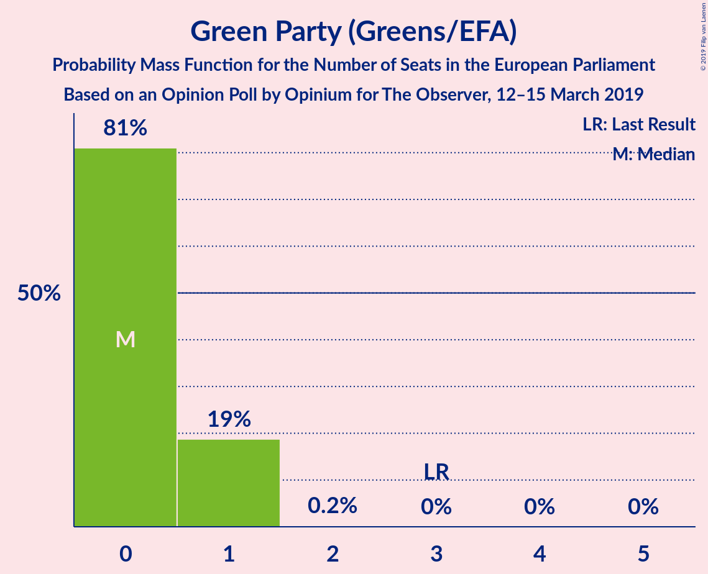
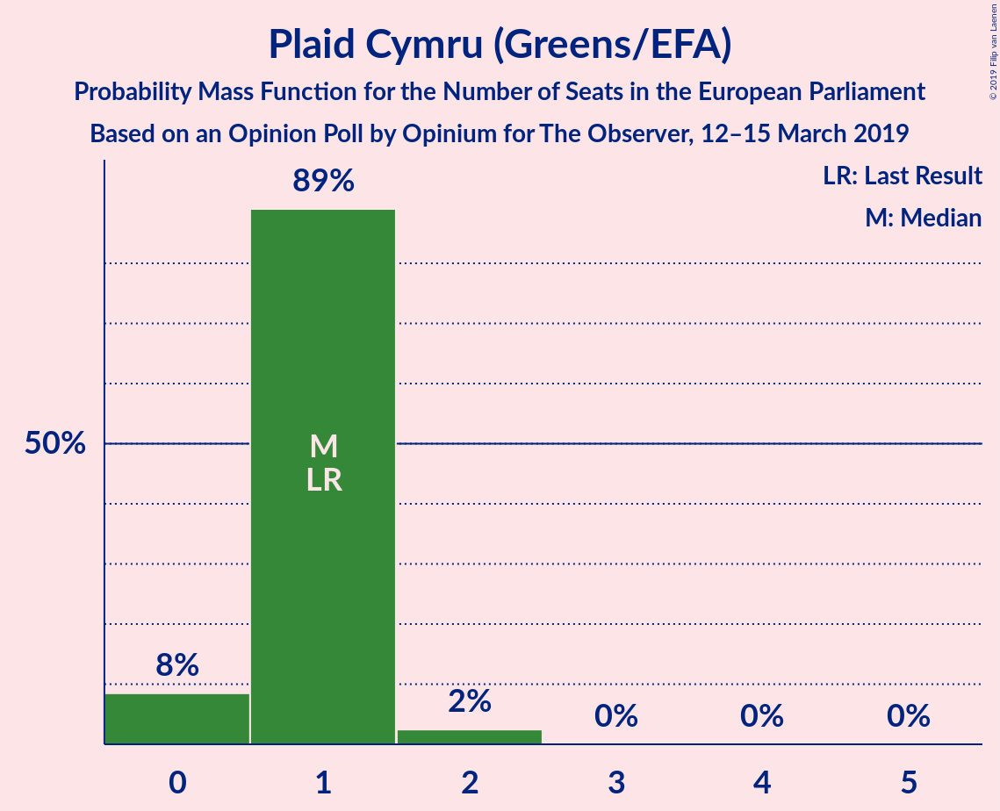
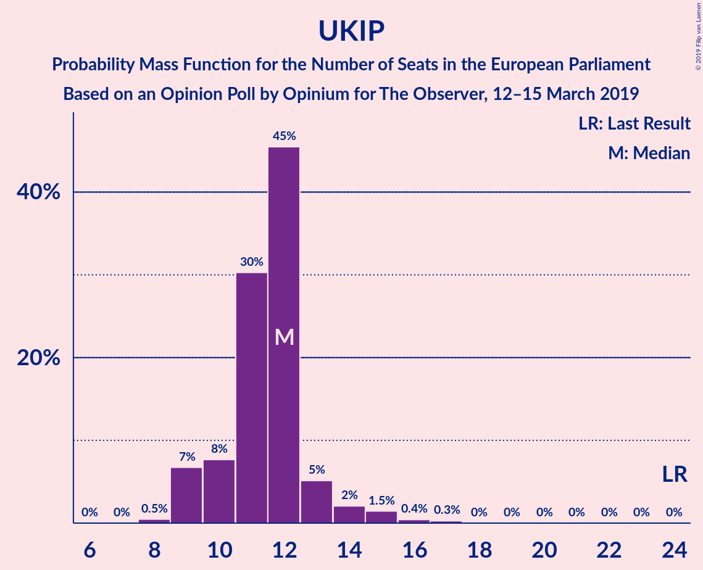

# Opinion Poll by Opinium for The Observer, 12–15 March 2019

<a href="#voting-intentions">Voting Intentions</a> | <a href="#seats">Seats</a> | <a href="#coalitions">Coalitions</a> | <a href="#technical-information">Technical Information</a>

## Voting Intentions

### Confidence Intervals

| Party | Last Result | Poll Result | 80% Confidence Interval | 90% Confidence Interval | 95% Confidence Interval | 99% Confidence Interval |
|:-----:|:-----------:|:-----------:|:-----------------------:|:-----------------------:|:-----------------------:|:-----------------------:|
| Labour Party (S&D) | 24.4% | 28.7% | 27.5–30.1% |27.1–30.4% |26.8–30.8% |26.2–31.4% |
| Conservative Party (ECR) | 23.1% | 27.7% | 26.5–29.1% |26.1–29.4% |25.8–29.8% |25.2–30.4% |
| UK Independence Party (EAPN) | 26.6% | 16.8% | 15.8–18.0% |15.5–18.3% |15.3–18.5% |14.8–19.1% |
| Liberal Democrats (ALDE) | 6.6% | 10.9% | 10.1–11.9% |9.8–12.1% |9.6–12.4% |9.2–12.8% |
| Green Party (Greens/EFA) | 6.9% | 5.9% | 5.3–6.7% |5.1–6.9% |5.0–7.1% |4.7–7.4% |
| Scottish National Party (Greens/EFA) | 2.4% | 4.0% | 3.5–4.6% |3.3–4.8% |3.2–4.9% |3.0–5.3% |
| Plaid Cymru (Greens/EFA) | 0.7% | 1.0% | 0.8–1.4% |0.7–1.4% |0.6–1.5% |0.5–1.7% |

*Note:* The poll result column reflects the actual value used in the calculations. Published results may vary slightly, and in addition be rounded to fewer digits.

## Seats

### Confidence Intervals

| Party | Last Result | Median | 80% Confidence Interval | 90% Confidence Interval | 95% Confidence Interval | 99% Confidence Interval |
|:-----:|:-----------:|:------:|:-----------------------:|:-----------------------:|:-----------------------:|:-----------------------:|
| <a href="#labour-party-(s&d)">Labour Party (S&D)</a> | 20 | 25 | 24–27 |23–27 |23–27 |21–27 |
| <a href="#conservative-party-(ecr)">Conservative Party (ECR)</a> | 19 | 24 | 23–25 |22–25 |21–25 |20–26 |
| <a href="#uk-independence-party-(eapn)">UK Independence Party (EAPN)</a> | 24 | 12 | 10–12 |9–13 |9–14 |9–16 |
| <a href="#liberal-democrats-(alde)">Liberal Democrats (ALDE)</a> | 1 | 5 | 5–7 |4–7 |3–8 |3–8 |
| <a href="#green-party-(greens/efa)">Green Party (Greens/EFA)</a> | 3 | 0 | 0–1 |0–1 |0–1 |0–1 |
| <a href="#scottish-national-party-(greens/efa)">Scottish National Party (Greens/EFA)</a> | 2 | 3 | 3 |3 |3 |2–4 |
| <a href="#plaid-cymru-(greens/efa)">Plaid Cymru (Greens/EFA)</a> | 1 | 1 | 1 |0–1 |0–1 |0–2 |

### Labour Party (S&D)

*For a full overview of the results for this party, see the [Labour Party (S&D)](party-labourpartysd.html) page.*

| Number of Seats | Probability | Accumulated | Special Marks |
|:---------------:|:-----------:|:-----------:|:-------------:|
| 20 | 0.1% | 100% | Last Result |
| 21 | 0.6% | 99.9% |  |
| 22 | 0.5% | 99.3% |  |
| 23 | 5% | 98.8% |  |
| 24 | 10% | 93% |  |
| 25 | 56% | 83% | Median |
| 26 | 16% | 27% |  |
| 27 | 10% | 10% |  |
| 28 | 0.1% | 0.1% |  |
| 29 | 0% | 0% |  |

### Conservative Party (ECR)

*For a full overview of the results for this party, see the [Conservative Party (ECR)](party-conservativepartyecr.html) page.*

| Number of Seats | Probability | Accumulated | Special Marks |
|:---------------:|:-----------:|:-----------:|:-------------:|
| 19 | 0.3% | 100% | Last Result |
| 20 | 0.9% | 99.7% |  |
| 21 | 1.4% | 98.9% |  |
| 22 | 6% | 97% |  |
| 23 | 16% | 92% |  |
| 24 | 39% | 75% | Median |
| 25 | 35% | 37% |  |
| 26 | 1.0% | 1.0% |  |
| 27 | 0.1% | 0.1% |  |
| 28 | 0% | 0% |  |

### UK Independence Party (EAPN)

*For a full overview of the results for this party, see the [UK Independence Party (EAPN)](party-ukindependencepartyeapn.html) page.*

| Number of Seats | Probability | Accumulated | Special Marks |
|:---------------:|:-----------:|:-----------:|:-------------:|
| 8 | 0.5% | 100% |  |
| 9 | 7% | 99.5% |  |
| 10 | 8% | 93% |  |
| 11 | 30% | 85% |  |
| 12 | 45% | 55% | Median |
| 13 | 5% | 9% |  |
| 14 | 2% | 4% |  |
| 15 | 1.5% | 2% |  |
| 16 | 0.4% | 0.7% |  |
| 17 | 0.3% | 0.3% |  |
| 18 | 0% | 0% |  |
| 19 | 0% | 0% |  |
| 20 | 0% | 0% |  |
| 21 | 0% | 0% |  |
| 22 | 0% | 0% |  |
| 23 | 0% | 0% |  |
| 24 | 0% | 0% | Last Result |

### Liberal Democrats (ALDE)

*For a full overview of the results for this party, see the [Liberal Democrats (ALDE)](party-liberaldemocratsalde.html) page.*

| Number of Seats | Probability | Accumulated | Special Marks |
|:---------------:|:-----------:|:-----------:|:-------------:|
| 1 | 0% | 100% | Last Result |
| 2 | 0.2% | 100% |  |
| 3 | 3% | 99.8% |  |
| 4 | 5% | 97% |  |
| 5 | 73% | 92% | Median |
| 6 | 8% | 20% |  |
| 7 | 7% | 11% |  |
| 8 | 4% | 4% |  |
| 9 | 0.4% | 0.4% |  |
| 10 | 0% | 0% |  |

### Green Party (Greens/EFA)

*For a full overview of the results for this party, see the [Green Party (Greens/EFA)](party-greenpartygreensefa.html) page.*

| Number of Seats | Probability | Accumulated | Special Marks |
|:---------------:|:-----------:|:-----------:|:-------------:|
| 0 | 81% | 100% | Median |
| 1 | 19% | 19% |  |
| 2 | 0.2% | 0.2% |  |
| 3 | 0% | 0% | Last Result |

### Scottish National Party (Greens/EFA)

*For a full overview of the results for this party, see the [Scottish National Party (Greens/EFA)](party-scottishnationalpartygreensefa.html) page.*

| Number of Seats | Probability | Accumulated | Special Marks |
|:---------------:|:-----------:|:-----------:|:-------------:|
| 2 | 1.1% | 100% | Last Result |
| 3 | 97% | 98.9% | Median |
| 4 | 2% | 2% |  |
| 5 | 0% | 0% |  |

### Plaid Cymru (Greens/EFA)

*For a full overview of the results for this party, see the [Plaid Cymru (Greens/EFA)](party-plaidcymrugreensefa.html) page.*

| Number of Seats | Probability | Accumulated | Special Marks |
|:---------------:|:-----------:|:-----------:|:-------------:|
| 0 | 8% | 100% |  |
| 1 | 89% | 92% | Last Result, Median |
| 2 | 2% | 2% |  |
| 3 | 0% | 0% |  |

## Coalitions

### Confidence Intervals

| Coalition | Last Result | Median | Majority? | 80% Confidence Interval | 90% Confidence Interval | 95% Confidence Interval | 99% Confidence Interval |
|:---------:|:-----------:|:------:|:---------:|:-----------------------:|:-----------------------:|:-----------------------:|:-----------------------:|
| Labour Party (S&D) | 20 | 25 | 0% | 24–27 | 23–27 | 23–27 | 21–27 |
| Conservative Party (ECR) | 19 | 24 | 0% | 23–25 | 22–25 | 21–25 | 20–26 |
| UK Independence Party (EAPN) | 24 | 12 | 0% | 10–12 | 9–13 | 9–14 | 9–16 |
| Liberal Democrats (ALDE) | 1 | 5 | 0% | 5–7 | 4–7 | 3–8 | 3–8 |
| Green Party (Greens/EFA) – Scottish National Party (Greens/EFA) – Plaid Cymru (Greens/EFA) | 6 | 4 | 0% | 4–5 | 3–5 | 3–5 | 3–6 |

### Labour Party (S&D)

| Number of Seats | Probability | Accumulated | Special Marks |
|:---------------:|:-----------:|:-----------:|:-------------:|
| 20 | 0.1% | 100% | Last Result |
| 21 | 0.6% | 99.9% |  |
| 22 | 0.5% | 99.3% |  |
| 23 | 5% | 98.8% |  |
| 24 | 10% | 93% |  |
| 25 | 56% | 83% | Median |
| 26 | 16% | 27% |  |
| 27 | 10% | 10% |  |
| 28 | 0.1% | 0.1% |  |
| 29 | 0% | 0% |  |

### Conservative Party (ECR)

| Number of Seats | Probability | Accumulated | Special Marks |
|:---------------:|:-----------:|:-----------:|:-------------:|
| 19 | 0.3% | 100% | Last Result |
| 20 | 0.9% | 99.7% |  |
| 21 | 1.4% | 98.9% |  |
| 22 | 6% | 97% |  |
| 23 | 16% | 92% |  |
| 24 | 39% | 75% | Median |
| 25 | 35% | 37% |  |
| 26 | 1.0% | 1.0% |  |
| 27 | 0.1% | 0.1% |  |
| 28 | 0% | 0% |  |

### UK Independence Party (EAPN)

| Number of Seats | Probability | Accumulated | Special Marks |
|:---------------:|:-----------:|:-----------:|:-------------:|
| 8 | 0.5% | 100% |  |
| 9 | 7% | 99.5% |  |
| 10 | 8% | 93% |  |
| 11 | 30% | 85% |  |
| 12 | 45% | 55% | Median |
| 13 | 5% | 9% |  |
| 14 | 2% | 4% |  |
| 15 | 1.5% | 2% |  |
| 16 | 0.4% | 0.7% |  |
| 17 | 0.3% | 0.3% |  |
| 18 | 0% | 0% |  |
| 19 | 0% | 0% |  |
| 20 | 0% | 0% |  |
| 21 | 0% | 0% |  |
| 22 | 0% | 0% |  |
| 23 | 0% | 0% |  |
| 24 | 0% | 0% | Last Result |

### Liberal Democrats (ALDE)

| Number of Seats | Probability | Accumulated | Special Marks |
|:---------------:|:-----------:|:-----------:|:-------------:|
| 1 | 0% | 100% | Last Result |
| 2 | 0.2% | 100% |  |
| 3 | 3% | 99.8% |  |
| 4 | 5% | 97% |  |
| 5 | 73% | 92% | Median |
| 6 | 8% | 20% |  |
| 7 | 7% | 11% |  |
| 8 | 4% | 4% |  |
| 9 | 0.4% | 0.4% |  |
| 10 | 0% | 0% |  |

### Green Party (Greens/EFA) – Scottish National Party (Greens/EFA) – Plaid Cymru (Greens/EFA)

| Number of Seats | Probability | Accumulated | Special Marks |
|:---------------:|:-----------:|:-----------:|:-------------:|
| 2 | 0.1% | 100% |  |
| 3 | 7% | 99.9% |  |
| 4 | 73% | 92% | Median |
| 5 | 18% | 20% |  |
| 6 | 2% | 2% | Last Result |
| 7 | 0% | 0% |  |

## Technical Information

### Opinion Poll

+ **Polling firm:** Opinium
+ **Commissioner(s):** The Observer
+ **Fieldwork period:** 12–15 March 2019

### Calculations

+ **Sample size:** 2008
+ **Simulations done:** 131,072
+ **Error estimate:** 0.59%

