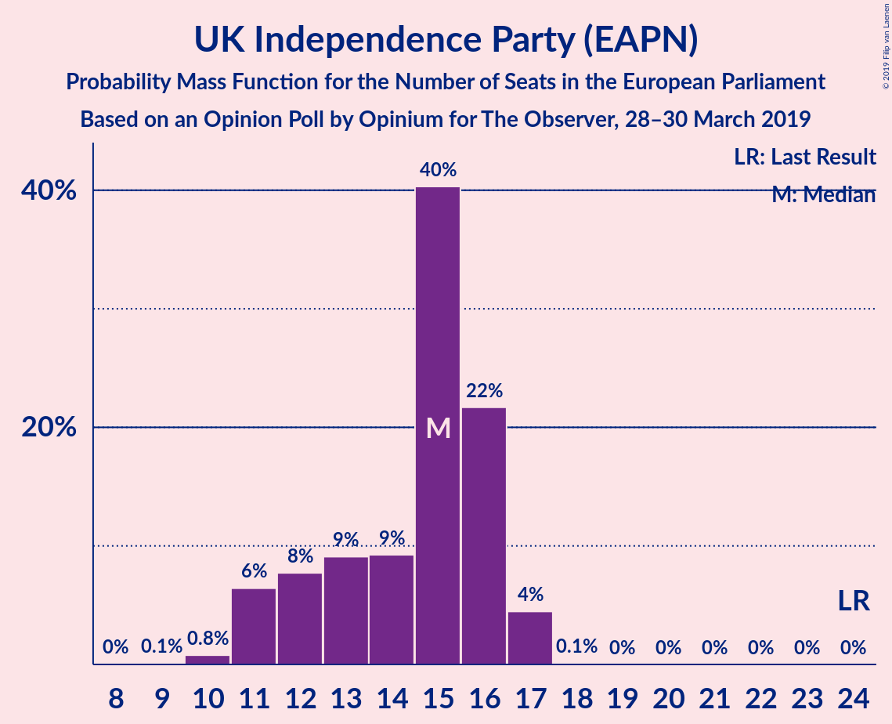

# Opinion Poll by Opinium for The Observer, 28–30 March 2019

<a href="#voting-intentions">Voting Intentions</a> | <a href="#seats">Seats</a> | <a href="#coalitions">Coalitions</a> | <a href="#technical-information">Technical Information</a>

## Voting Intentions

### Confidence Intervals

| Party | Last Result | Poll Result | 80% Confidence Interval | 90% Confidence Interval | 95% Confidence Interval | 99% Confidence Interval |
|:-----:|:-----------:|:-----------:|:-----------------------:|:-----------------------:|:-----------------------:|:-----------------------:|
| Labour Party (S&D) | 24.4% | 30.0% | 28.7–31.3% |28.3–31.7% |28.0–32.0% |27.4–32.7% |
| Conservative Party (ECR) | 23.1% | 24.0% | 22.8–25.3% |22.5–25.6% |22.2–25.9% |21.6–26.5% |
| UK Independence Party (EAPN) | 26.6% | 18.0% | 16.9–19.1% |16.6–19.4% |16.4–19.7% |15.9–20.3% |
| Liberal Democrats (ALDE) | 6.6% | 10.0% | 9.2–10.9% |9.0–11.2% |8.8–11.4% |8.4–11.9% |
| Green Party (Greens/EFA) | 6.9% | 8.0% | 7.3–8.9% |7.1–9.1% |6.9–9.3% |6.6–9.7% |
| Scottish National Party (Greens/EFA) | 2.4% | 4.0% | 3.5–4.6% |3.3–4.8% |3.2–4.9% |3.0–5.3% |
| Plaid Cymru (Greens/EFA) | 0.7% | 1.0% | 0.8–1.4% |0.7–1.4% |0.6–1.5% |0.5–1.7% |

*Note:* The poll result column reflects the actual value used in the calculations. Published results may vary slightly, and in addition be rounded to fewer digits.

## Seats

### Confidence Intervals

| Party | Last Result | Median | 80% Confidence Interval | 90% Confidence Interval | 95% Confidence Interval | 99% Confidence Interval |
|:-----:|:-----------:|:------:|:-----------------------:|:-----------------------:|:-----------------------:|:-----------------------:|
| <a href="#labour-party-(s&d)">Labour Party (S&D)</a> | 20 | 26 | 25–27 |25–27 |25–27 |24–28 |
| <a href="#conservative-party-(ecr)">Conservative Party (ECR)</a> | 19 | 19 | 18–21 |18–22 |17–22 |16–23 |
| <a href="#uk-independence-party-(eapn)">UK Independence Party (EAPN)</a> | 24 | 15 | 12–16 |11–16 |11–17 |10–17 |
| <a href="#liberal-democrats-(alde)">Liberal Democrats (ALDE)</a> | 1 | 4 | 2–5 |2–6 |2–6 |2–7 |
| <a href="#green-party-(greens/efa)">Green Party (Greens/EFA)</a> | 3 | 2 | 1–3 |1–4 |1–4 |1–4 |
| <a href="#scottish-national-party-(greens/efa)">Scottish National Party (Greens/EFA)</a> | 2 | 3 | 3 |3 |3 |3–4 |
| <a href="#plaid-cymru-(greens/efa)">Plaid Cymru (Greens/EFA)</a> | 1 | 1 | 1 |0–1 |0–1 |0–2 |

### Labour Party (S&D)

*For a full overview of the results for this party, see the [Labour Party (S&D)](party-labourpartysd.html) page.*

| Number of Seats | Probability | Accumulated | Special Marks |
|:---------------:|:-----------:|:-----------:|:-------------:|
| 20 | 0% | 100% | Last Result |
| 21 | 0% | 100% |  |
| 22 | 0% | 100% |  |
| 23 | 0.2% | 100% |  |
| 24 | 2% | 99.8% |  |
| 25 | 9% | 98% |  |
| 26 | 55% | 89% | Median |
| 27 | 32% | 34% |  |
| 28 | 1.3% | 2% |  |
| 29 | 0.4% | 0.4% |  |
| 30 | 0% | 0% |  |

### Conservative Party (ECR)

*For a full overview of the results for this party, see the [Conservative Party (ECR)](party-conservativepartyecr.html) page.*

| Number of Seats | Probability | Accumulated | Special Marks |
|:---------------:|:-----------:|:-----------:|:-------------:|
| 15 | 0.1% | 100% |  |
| 16 | 1.1% | 99.9% |  |
| 17 | 3% | 98.8% |  |
| 18 | 20% | 96% |  |
| 19 | 35% | 76% | Last Result, Median |
| 20 | 23% | 41% |  |
| 21 | 9% | 17% |  |
| 22 | 7% | 8% |  |
| 23 | 1.1% | 1.1% |  |
| 24 | 0% | 0% |  |

### UK Independence Party (EAPN)

*For a full overview of the results for this party, see the [UK Independence Party (EAPN)](party-ukindependencepartyeapn.html) page.*

| Number of Seats | Probability | Accumulated | Special Marks |
|:---------------:|:-----------:|:-----------:|:-------------:|
| 9 | 0.1% | 100% |  |
| 10 | 0.8% | 99.9% |  |
| 11 | 6% | 99.1% |  |
| 12 | 8% | 93% |  |
| 13 | 9% | 85% |  |
| 14 | 9% | 76% |  |
| 15 | 40% | 67% | Median |
| 16 | 22% | 26% |  |
| 17 | 4% | 5% |  |
| 18 | 0.1% | 0.1% |  |
| 19 | 0% | 0% |  |
| 20 | 0% | 0% |  |
| 21 | 0% | 0% |  |
| 22 | 0% | 0% |  |
| 23 | 0% | 0% |  |
| 24 | 0% | 0% | Last Result |

### Liberal Democrats (ALDE)

*For a full overview of the results for this party, see the [Liberal Democrats (ALDE)](party-liberaldemocratsalde.html) page.*

| Number of Seats | Probability | Accumulated | Special Marks |
|:---------------:|:-----------:|:-----------:|:-------------:|
| 1 | 0% | 100% | Last Result |
| 2 | 21% | 100% |  |
| 3 | 15% | 79% |  |
| 4 | 36% | 65% | Median |
| 5 | 21% | 29% |  |
| 6 | 7% | 7% |  |
| 7 | 0.6% | 0.6% |  |
| 8 | 0% | 0% |  |

### Green Party (Greens/EFA)

*For a full overview of the results for this party, see the [Green Party (Greens/EFA)](party-greenpartygreensefa.html) page.*

| Number of Seats | Probability | Accumulated | Special Marks |
|:---------------:|:-----------:|:-----------:|:-------------:|
| 0 | 0.1% | 100% |  |
| 1 | 23% | 99.9% |  |
| 2 | 47% | 77% | Median |
| 3 | 22% | 30% | Last Result |
| 4 | 8% | 8% |  |
| 5 | 0.1% | 0.3% |  |
| 6 | 0.2% | 0.2% |  |
| 7 | 0% | 0% |  |

### Scottish National Party (Greens/EFA)

*For a full overview of the results for this party, see the [Scottish National Party (Greens/EFA)](party-scottishnationalpartygreensefa.html) page.*

| Number of Seats | Probability | Accumulated | Special Marks |
|:---------------:|:-----------:|:-----------:|:-------------:|
| 2 | 0.1% | 100% | Last Result |
| 3 | 98% | 99.9% | Median |
| 4 | 2% | 2% |  |
| 5 | 0% | 0% |  |

### Plaid Cymru (Greens/EFA)

*For a full overview of the results for this party, see the [Plaid Cymru (Greens/EFA)](party-plaidcymrugreensefa.html) page.*

| Number of Seats | Probability | Accumulated | Special Marks |
|:---------------:|:-----------:|:-----------:|:-------------:|
| 0 | 10% | 100% |  |
| 1 | 89% | 90% | Last Result, Median |
| 2 | 2% | 2% |  |
| 3 | 0% | 0% |  |

## Coalitions

### Confidence Intervals

| Coalition | Last Result | Median | Majority? | 80% Confidence Interval | 90% Confidence Interval | 95% Confidence Interval | 99% Confidence Interval |
|:---------:|:-----------:|:------:|:---------:|:-----------------------:|:-----------------------:|:-----------------------:|:-----------------------:|
| Labour Party (S&D) | 20 | 26 | 0% | 25–27 | 25–27 | 25–27 | 24–28 |
| Conservative Party (ECR) | 19 | 19 | 0% | 18–21 | 18–22 | 17–22 | 16–23 |
| UK Independence Party (EAPN) | 24 | 15 | 0% | 12–16 | 11–16 | 11–17 | 10–17 |
| Green Party (Greens/EFA) – Scottish National Party (Greens/EFA) – Plaid Cymru (Greens/EFA) | 6 | 6 | 0% | 5–7 | 5–8 | 5–8 | 4–8 |
| Liberal Democrats (ALDE) | 1 | 4 | 0% | 2–5 | 2–6 | 2–6 | 2–7 |

### Labour Party (S&D)

| Number of Seats | Probability | Accumulated | Special Marks |
|:---------------:|:-----------:|:-----------:|:-------------:|
| 20 | 0% | 100% | Last Result |
| 21 | 0% | 100% |  |
| 22 | 0% | 100% |  |
| 23 | 0.2% | 100% |  |
| 24 | 2% | 99.8% |  |
| 25 | 9% | 98% |  |
| 26 | 55% | 89% | Median |
| 27 | 32% | 34% |  |
| 28 | 1.3% | 2% |  |
| 29 | 0.4% | 0.4% |  |
| 30 | 0% | 0% |  |

### Conservative Party (ECR)

| Number of Seats | Probability | Accumulated | Special Marks |
|:---------------:|:-----------:|:-----------:|:-------------:|
| 15 | 0.1% | 100% |  |
| 16 | 1.1% | 99.9% |  |
| 17 | 3% | 98.8% |  |
| 18 | 20% | 96% |  |
| 19 | 35% | 76% | Last Result, Median |
| 20 | 23% | 41% |  |
| 21 | 9% | 17% |  |
| 22 | 7% | 8% |  |
| 23 | 1.1% | 1.1% |  |
| 24 | 0% | 0% |  |

### UK Independence Party (EAPN)

| Number of Seats | Probability | Accumulated | Special Marks |
|:---------------:|:-----------:|:-----------:|:-------------:|
| 9 | 0.1% | 100% |  |
| 10 | 0.8% | 99.9% |  |
| 11 | 6% | 99.1% |  |
| 12 | 8% | 93% |  |
| 13 | 9% | 85% |  |
| 14 | 9% | 76% |  |
| 15 | 40% | 67% | Median |
| 16 | 22% | 26% |  |
| 17 | 4% | 5% |  |
| 18 | 0.1% | 0.1% |  |
| 19 | 0% | 0% |  |
| 20 | 0% | 0% |  |
| 21 | 0% | 0% |  |
| 22 | 0% | 0% |  |
| 23 | 0% | 0% |  |
| 24 | 0% | 0% | Last Result |

### Green Party (Greens/EFA) – Scottish National Party (Greens/EFA) – Plaid Cymru (Greens/EFA)

| Number of Seats | Probability | Accumulated | Special Marks |
|:---------------:|:-----------:|:-----------:|:-------------:|
| 4 | 2% | 100% |  |
| 5 | 26% | 98% |  |
| 6 | 43% | 72% | Last Result, Median |
| 7 | 21% | 29% |  |
| 8 | 8% | 8% |  |
| 9 | 0.3% | 0.5% |  |
| 10 | 0.2% | 0.2% |  |
| 11 | 0% | 0% |  |

### Liberal Democrats (ALDE)

| Number of Seats | Probability | Accumulated | Special Marks |
|:---------------:|:-----------:|:-----------:|:-------------:|
| 1 | 0% | 100% | Last Result |
| 2 | 21% | 100% |  |
| 3 | 15% | 79% |  |
| 4 | 36% | 65% | Median |
| 5 | 21% | 29% |  |
| 6 | 7% | 7% |  |
| 7 | 0.6% | 0.6% |  |
| 8 | 0% | 0% |  |

## Technical Information

### Opinion Poll

+ **Polling firm:** Opinium
+ **Commissioner(s):** The Observer
+ **Fieldwork period:** 28–30 March 2019

### Calculations

+ **Sample size:** 2008
+ **Simulations done:** 262,144
+ **Error estimate:** 1.07%

