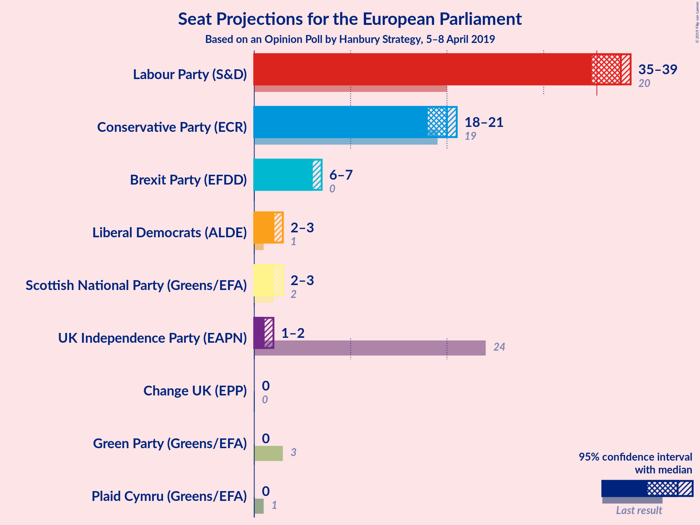
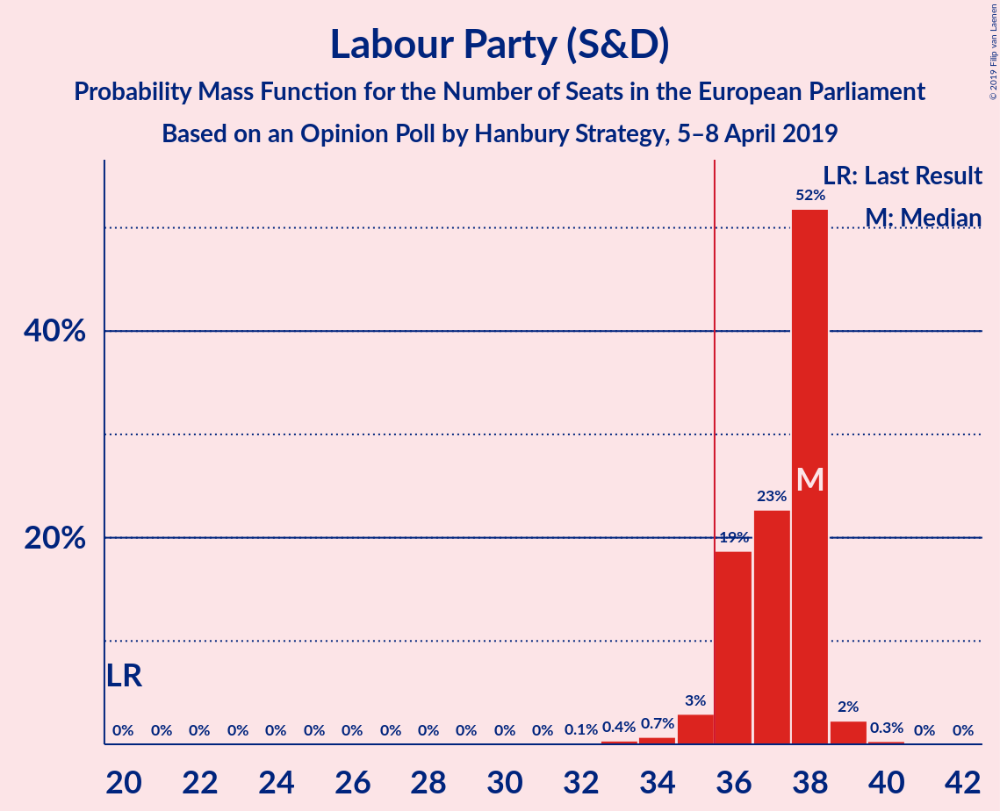
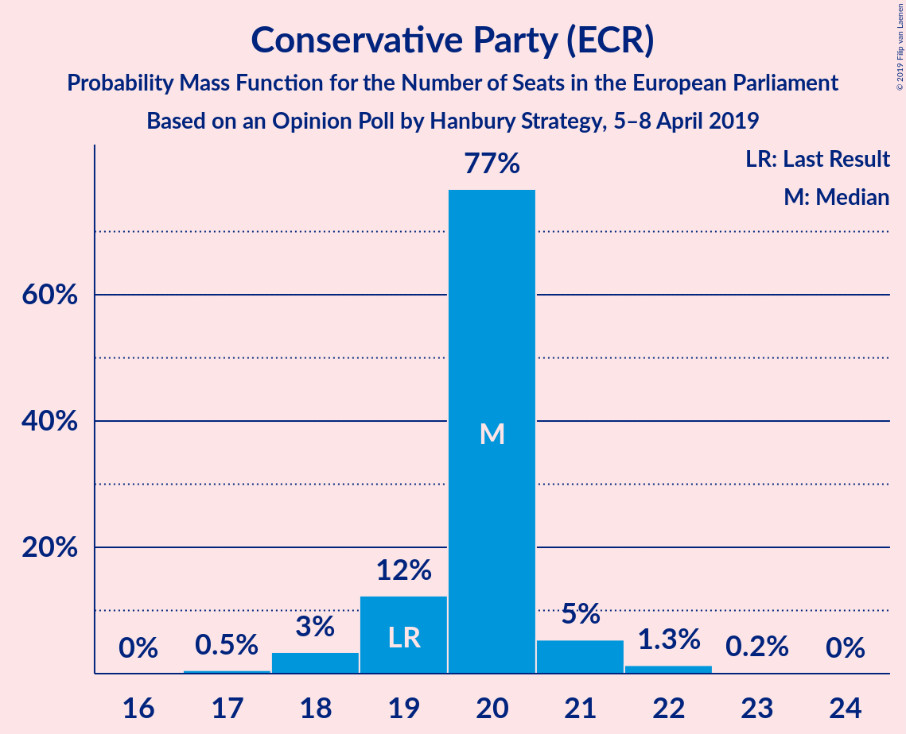
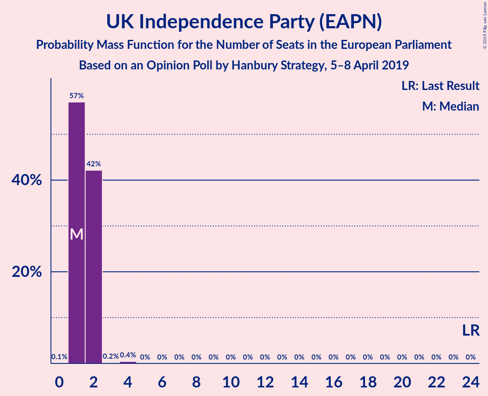
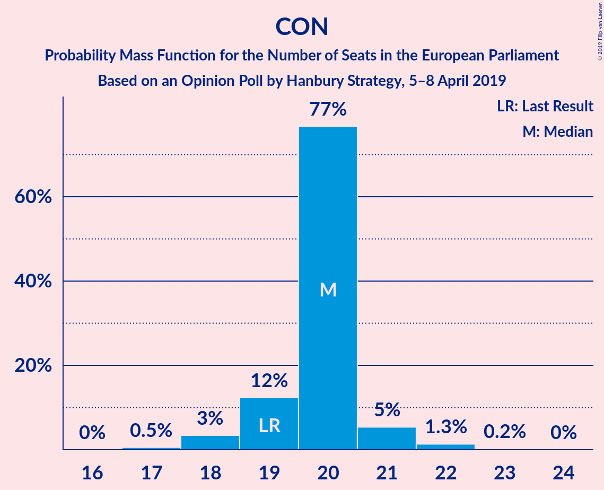
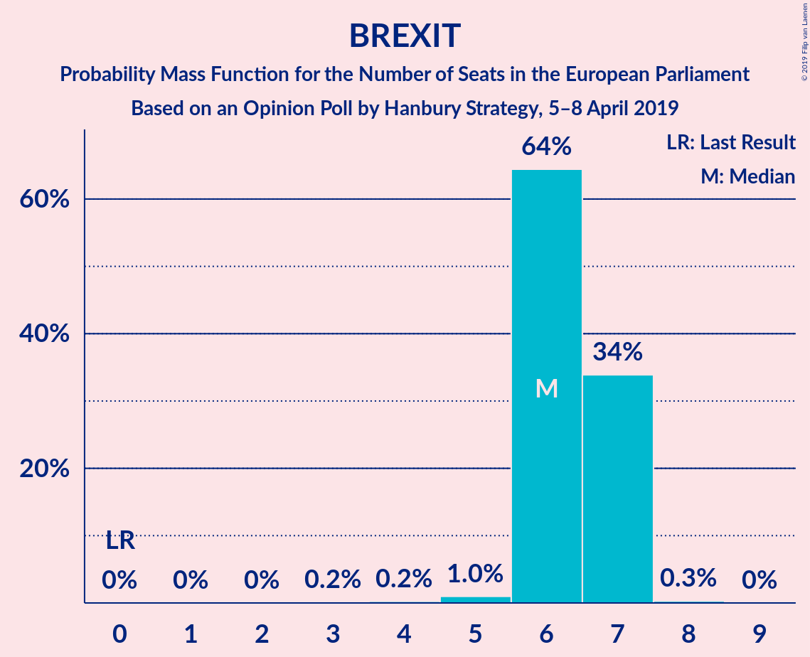
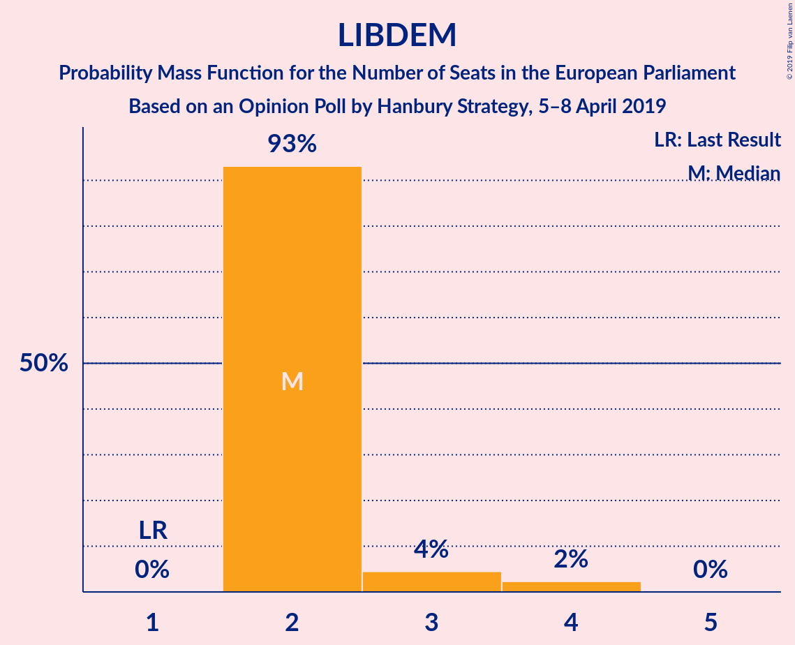
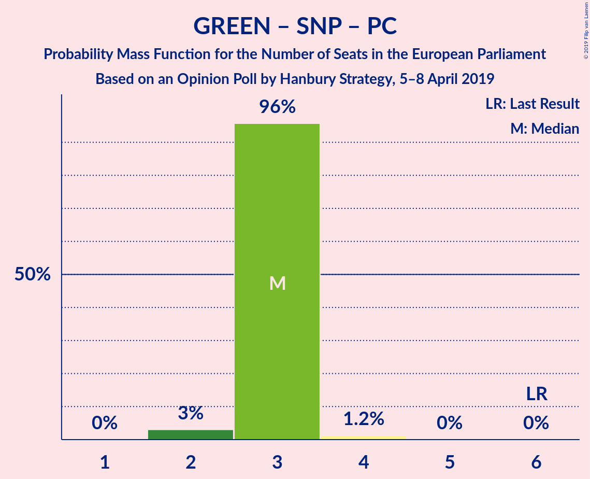

# Opinion Poll by Hanbury Strategy, 5–8 April 2019

<a href="#voting-intentions">Voting Intentions</a> | <a href="#seats">Seats</a> | <a href="#coalitions">Coalitions</a> | <a href="#technical-information">Technical Information</a>

## Voting Intentions

### Confidence Intervals

| Party | Last Result | Poll Result | 80% Confidence Interval | 90% Confidence Interval | 95% Confidence Interval | 99% Confidence Interval |
|:-----:|:-----------:|:-----------:|:-----------------------:|:-----------------------:|:-----------------------:|:-----------------------:|
| Labour Party (S&D) | 24.4% | 38.3% | 36.9–39.7% |36.5–40.1% |36.2–40.5% |35.5–41.1% |
| Conservative Party (ECR) | 23.1% | 23.2% | 22.0–24.4% |21.6–24.8% |21.4–25.1% |20.8–25.7% |
| Brexit Party (EFDD) | 0.0% | 10.1% | 9.3–11.0% |9.1–11.3% |8.9–11.5% |8.5–12.0% |
| Liberal Democrats (ALDE) | 6.6% | 8.0% | 7.3–8.9% |7.1–9.1% |6.9–9.3% |6.6–9.7% |
| UK Independence Party (EAPN) | 26.6% | 7.0% | 6.4–7.8% |6.2–8.1% |6.0–8.3% |5.7–8.7% |
| Scottish National Party (Greens/EFA) | 2.4% | 4.0% | 3.5–4.7% |3.4–4.9% |3.3–5.0% |3.0–5.3% |
| Green Party (Greens/EFA) | 6.9% | 4.0% | 3.5–4.7% |3.4–4.9% |3.3–5.0% |3.0–5.3% |
| Change UK (EPP) | 0.0% | 4.0% | 3.5–4.7% |3.4–4.9% |3.3–5.0% |3.0–5.3% |
| Plaid Cymru (Greens/EFA) | 0.7% | 0.2% | 0.2–0.5% |0.1–0.5% |0.1–0.6% |0.1–0.7% |

*Note:* The poll result column reflects the actual value used in the calculations. Published results may vary slightly, and in addition be rounded to fewer digits.

## Seats

### Confidence Intervals

| Party | Last Result | Median | 80% Confidence Interval | 90% Confidence Interval | 95% Confidence Interval | 99% Confidence Interval |
|:-----:|:-----------:|:------:|:-----------------------:|:-----------------------:|:-----------------------:|:-----------------------:|
| <a href="#labour-party-(s&d)">Labour Party (S&D)</a> | 20 | 37 | 36–38 |35–38 |34–39 |32–39 |
| <a href="#conservative-party-(ecr)">Conservative Party (ECR)</a> | 19 | 20 | 19–20 |18–21 |18–22 |18–22 |
| <a href="#brexit-party-(efdd)">Brexit Party (EFDD)</a> | 0 | 6 | 6–7 |6–7 |5–7 |4–7 |
| <a href="#liberal-democrats-(alde)">Liberal Democrats (ALDE)</a> | 1 | 2 | 2–3 |2–3 |2–4 |2–4 |
| <a href="#uk-independence-party-(eapn)">UK Independence Party (EAPN)</a> | 24 | 2 | 1–2 |1–2 |1–2 |1–4 |
| <a href="#scottish-national-party-(greens/efa)">Scottish National Party (Greens/EFA)</a> | 2 | 3 | 3 |3 |2–3 |2–3 |
| <a href="#green-party-(greens/efa)">Green Party (Greens/EFA)</a> | 3 | 0 | 0 |0 |0 |0 |
| <a href="#change-uk-(epp)">Change UK (EPP)</a> | 0 | 0 | 0 |0 |0 |0 |
| <a href="#plaid-cymru-(greens/efa)">Plaid Cymru (Greens/EFA)</a> | 1 | 0 | 0 |0 |0 |0–1 |

### Labour Party (S&D)

*For a full overview of the results for this party, see the [Labour Party (S&D)](party-labourpartysd.html) page.*

| Number of Seats | Probability | Accumulated | Special Marks |
|:---------------:|:-----------:|:-----------:|:-------------:|
| 20 | 0% | 100% | Last Result |
| 21 | 0% | 100% |  |
| 22 | 0% | 100% |  |
| 23 | 0% | 100% |  |
| 24 | 0% | 100% |  |
| 25 | 0% | 100% |  |
| 26 | 0% | 100% |  |
| 27 | 0% | 100% |  |
| 28 | 0% | 100% |  |
| 29 | 0% | 100% |  |
| 30 | 0% | 100% |  |
| 31 | 0% | 100% |  |
| 32 | 0.5% | 100% |  |
| 33 | 1.2% | 99.5% |  |
| 34 | 0.8% | 98% |  |
| 35 | 3% | 97% |  |
| 36 | 26% | 94% | Majority |
| 37 | 27% | 68% | Median |
| 38 | 37% | 41% |  |
| 39 | 3% | 4% |  |
| 40 | 0.2% | 0.3% |  |
| 41 | 0% | 0% |  |

### Conservative Party (ECR)

*For a full overview of the results for this party, see the [Conservative Party (ECR)](party-conservativepartyecr.html) page.*

| Number of Seats | Probability | Accumulated | Special Marks |
|:---------------:|:-----------:|:-----------:|:-------------:|
| 16 | 0.1% | 100% |  |
| 17 | 0.4% | 99.9% |  |
| 18 | 7% | 99.6% |  |
| 19 | 18% | 92% | Last Result |
| 20 | 67% | 74% | Median |
| 21 | 4% | 6% |  |
| 22 | 2% | 3% |  |
| 23 | 0.4% | 0.4% |  |
| 24 | 0% | 0% |  |

### Brexit Party (EFDD)

*For a full overview of the results for this party, see the [Brexit Party (EFDD)](party-brexitpartyefdd.html) page.*

| Number of Seats | Probability | Accumulated | Special Marks |
|:---------------:|:-----------:|:-----------:|:-------------:|
| 0 | 0% | 100% | Last Result |
| 1 | 0% | 100% |  |
| 2 | 0% | 100% |  |
| 3 | 0.4% | 100% |  |
| 4 | 0.1% | 99.6% |  |
| 5 | 3% | 99.4% |  |
| 6 | 48% | 96% | Median |
| 7 | 47% | 48% |  |
| 8 | 0.4% | 0.4% |  |
| 9 | 0% | 0% |  |

### Liberal Democrats (ALDE)

*For a full overview of the results for this party, see the [Liberal Democrats (ALDE)](party-liberaldemocratsalde.html) page.*

| Number of Seats | Probability | Accumulated | Special Marks |
|:---------------:|:-----------:|:-----------:|:-------------:|
| 1 | 0.1% | 100% | Last Result |
| 2 | 86% | 99.9% | Median |
| 3 | 11% | 14% |  |
| 4 | 3% | 3% |  |
| 5 | 0% | 0% |  |

### UK Independence Party (EAPN)

*For a full overview of the results for this party, see the [UK Independence Party (EAPN)](party-ukindependencepartyeapn.html) page.*

| Number of Seats | Probability | Accumulated | Special Marks |
|:---------------:|:-----------:|:-----------:|:-------------:|
| 0 | 0.3% | 100% |  |
| 1 | 38% | 99.7% |  |
| 2 | 61% | 62% | Median |
| 3 | 0.4% | 2% |  |
| 4 | 1.1% | 1.2% |  |
| 5 | 0% | 0.1% |  |
| 6 | 0% | 0% |  |
| 7 | 0% | 0% |  |
| 8 | 0% | 0% |  |
| 9 | 0% | 0% |  |
| 10 | 0% | 0% |  |
| 11 | 0% | 0% |  |
| 12 | 0% | 0% |  |
| 13 | 0% | 0% |  |
| 14 | 0% | 0% |  |
| 15 | 0% | 0% |  |
| 16 | 0% | 0% |  |
| 17 | 0% | 0% |  |
| 18 | 0% | 0% |  |
| 19 | 0% | 0% |  |
| 20 | 0% | 0% |  |
| 21 | 0% | 0% |  |
| 22 | 0% | 0% |  |
| 23 | 0% | 0% |  |
| 24 | 0% | 0% | Last Result |

### Scottish National Party (Greens/EFA)

*For a full overview of the results for this party, see the [Scottish National Party (Greens/EFA)](party-scottishnationalpartygreensefa.html) page.*

| Number of Seats | Probability | Accumulated | Special Marks |
|:---------------:|:-----------:|:-----------:|:-------------:|
| 2 | 5% | 100% | Last Result |
| 3 | 95% | 95% | Median |
| 4 | 0.2% | 0.2% |  |
| 5 | 0% | 0% |  |

### Green Party (Greens/EFA)

*For a full overview of the results for this party, see the [Green Party (Greens/EFA)](party-greenpartygreensefa.html) page.*

| Number of Seats | Probability | Accumulated | Special Marks |
|:---------------:|:-----------:|:-----------:|:-------------:|
| 0 | 100% | 100% | Median |
| 1 | 0% | 0% |  |
| 2 | 0% | 0% |  |
| 3 | 0% | 0% | Last Result |

### Change UK (EPP)

*For a full overview of the results for this party, see the [Change UK (EPP)](party-changeukepp.html) page.*

| Number of Seats | Probability | Accumulated | Special Marks |
|:---------------:|:-----------:|:-----------:|:-------------:|
| 0 | 100% | 100% | Last Result, Median |

### Plaid Cymru (Greens/EFA)

*For a full overview of the results for this party, see the [Plaid Cymru (Greens/EFA)](party-plaidcymrugreensefa.html) page.*

| Number of Seats | Probability | Accumulated | Special Marks |
|:---------------:|:-----------:|:-----------:|:-------------:|
| 0 | 98.6% | 100% | Median |
| 1 | 1.4% | 1.4% | Last Result |
| 2 | 0% | 0% |  |

## Coalitions

### Confidence Intervals

| Coalition | Last Result | Median | Majority? | 80% Confidence Interval | 90% Confidence Interval | 95% Confidence Interval | 99% Confidence Interval |
|:---------:|:-----------:|:------:|:---------:|:-----------------------:|:-----------------------:|:-----------------------:|:-----------------------:|
| Labour Party (S&D) | 20 | 37 | 94% | 36–38 | 35–38 | 34–39 | 32–39 |
| Conservative Party (ECR) | 19 | 20 | 0% | 19–20 | 18–21 | 18–22 | 18–22 |
| Brexit Party (EFDD) | 0 | 6 | 0% | 6–7 | 6–7 | 5–7 | 4–7 |
| Liberal Democrats (ALDE) | 1 | 2 | 0% | 2–3 | 2–3 | 2–4 | 2–4 |
| Green Party (Greens/EFA) – Scottish National Party (Greens/EFA) – Plaid Cymru (Greens/EFA) | 6 | 3 | 0% | 3 | 3 | 2–3 | 2–4 |
| UK Independence Party (EAPN) | 24 | 2 | 0% | 1–2 | 1–2 | 1–2 | 1–4 |
| Change UK (EPP) | 0 | 0 | 0% | 0 | 0 | 0 | 0 |

### Labour Party (S&D)

| Number of Seats | Probability | Accumulated | Special Marks |
|:---------------:|:-----------:|:-----------:|:-------------:|
| 20 | 0% | 100% | Last Result |
| 21 | 0% | 100% |  |
| 22 | 0% | 100% |  |
| 23 | 0% | 100% |  |
| 24 | 0% | 100% |  |
| 25 | 0% | 100% |  |
| 26 | 0% | 100% |  |
| 27 | 0% | 100% |  |
| 28 | 0% | 100% |  |
| 29 | 0% | 100% |  |
| 30 | 0% | 100% |  |
| 31 | 0% | 100% |  |
| 32 | 0.5% | 100% |  |
| 33 | 1.2% | 99.5% |  |
| 34 | 0.8% | 98% |  |
| 35 | 3% | 97% |  |
| 36 | 26% | 94% | Majority |
| 37 | 27% | 68% | Median |
| 38 | 37% | 41% |  |
| 39 | 3% | 4% |  |
| 40 | 0.2% | 0.3% |  |
| 41 | 0% | 0% |  |

### Conservative Party (ECR)

| Number of Seats | Probability | Accumulated | Special Marks |
|:---------------:|:-----------:|:-----------:|:-------------:|
| 16 | 0.1% | 100% |  |
| 17 | 0.4% | 99.9% |  |
| 18 | 7% | 99.6% |  |
| 19 | 18% | 92% | Last Result |
| 20 | 67% | 74% | Median |
| 21 | 4% | 6% |  |
| 22 | 2% | 3% |  |
| 23 | 0.4% | 0.4% |  |
| 24 | 0% | 0% |  |

### Brexit Party (EFDD)

| Number of Seats | Probability | Accumulated | Special Marks |
|:---------------:|:-----------:|:-----------:|:-------------:|
| 0 | 0% | 100% | Last Result |
| 1 | 0% | 100% |  |
| 2 | 0% | 100% |  |
| 3 | 0.4% | 100% |  |
| 4 | 0.1% | 99.6% |  |
| 5 | 3% | 99.4% |  |
| 6 | 48% | 96% | Median |
| 7 | 47% | 48% |  |
| 8 | 0.4% | 0.4% |  |
| 9 | 0% | 0% |  |

### Liberal Democrats (ALDE)

| Number of Seats | Probability | Accumulated | Special Marks |
|:---------------:|:-----------:|:-----------:|:-------------:|
| 1 | 0.1% | 100% | Last Result |
| 2 | 86% | 99.9% | Median |
| 3 | 11% | 14% |  |
| 4 | 3% | 3% |  |
| 5 | 0% | 0% |  |

### Green Party (Greens/EFA) – Scottish National Party (Greens/EFA) – Plaid Cymru (Greens/EFA)

| Number of Seats | Probability | Accumulated | Special Marks |
|:---------------:|:-----------:|:-----------:|:-------------:|
| 2 | 5% | 100% |  |
| 3 | 94% | 95% | Median |
| 4 | 2% | 2% |  |
| 5 | 0% | 0% |  |
| 6 | 0% | 0% | Last Result |

### UK Independence Party (EAPN)

| Number of Seats | Probability | Accumulated | Special Marks |
|:---------------:|:-----------:|:-----------:|:-------------:|
| 0 | 0.3% | 100% |  |
| 1 | 38% | 99.7% |  |
| 2 | 61% | 62% | Median |
| 3 | 0.4% | 2% |  |
| 4 | 1.1% | 1.2% |  |
| 5 | 0% | 0.1% |  |
| 6 | 0% | 0% |  |
| 7 | 0% | 0% |  |
| 8 | 0% | 0% |  |
| 9 | 0% | 0% |  |
| 10 | 0% | 0% |  |
| 11 | 0% | 0% |  |
| 12 | 0% | 0% |  |
| 13 | 0% | 0% |  |
| 14 | 0% | 0% |  |
| 15 | 0% | 0% |  |
| 16 | 0% | 0% |  |
| 17 | 0% | 0% |  |
| 18 | 0% | 0% |  |
| 19 | 0% | 0% |  |
| 20 | 0% | 0% |  |
| 21 | 0% | 0% |  |
| 22 | 0% | 0% |  |
| 23 | 0% | 0% |  |
| 24 | 0% | 0% | Last Result |

### Change UK (EPP)

| Number of Seats | Probability | Accumulated | Special Marks |
|:---------------:|:-----------:|:-----------:|:-------------:|
| 0 | 100% | 100% | Last Result, Median |

## Technical Information

### Opinion Poll

+ **Polling firm:** Hanbury Strategy
+ **Commissioner(s):** —
+ **Fieldwork period:** 5–8 April 2019

### Calculations

+ **Sample size:** 2000
+ **Simulations done:** 262,144
+ **Error estimate:** 2.01%

