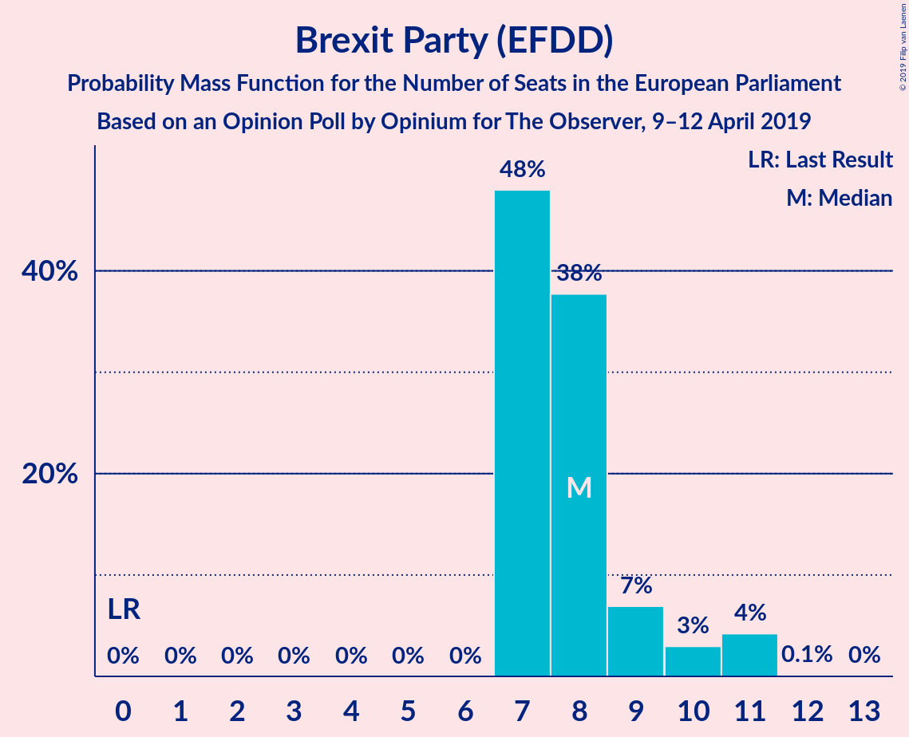
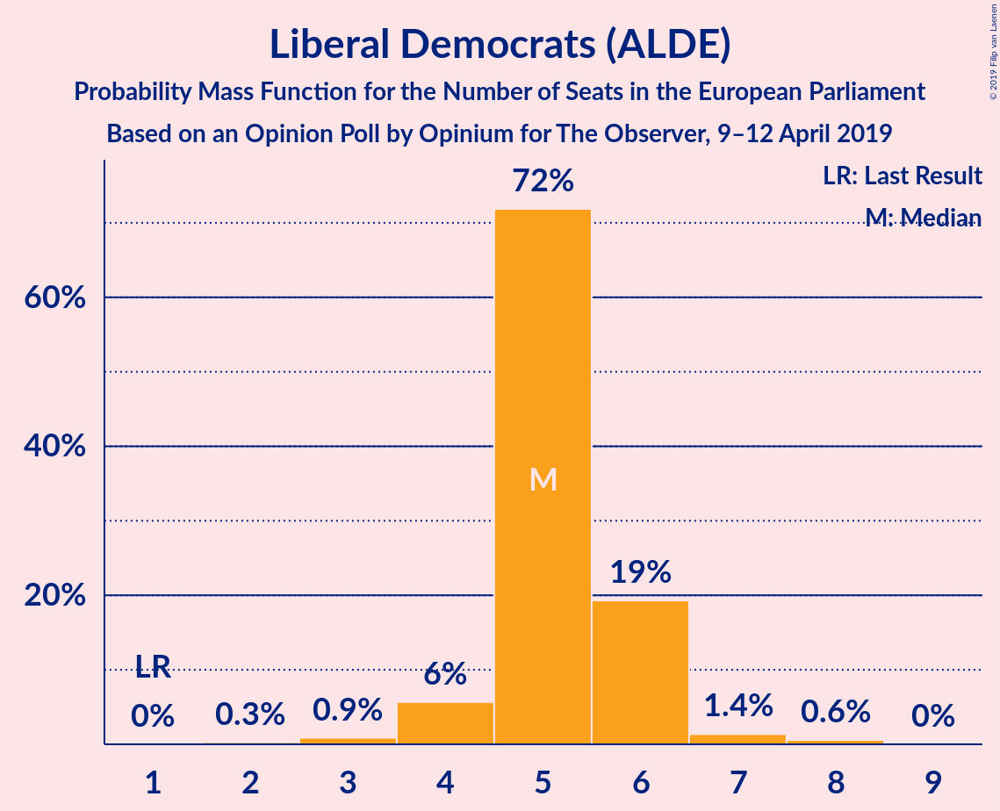
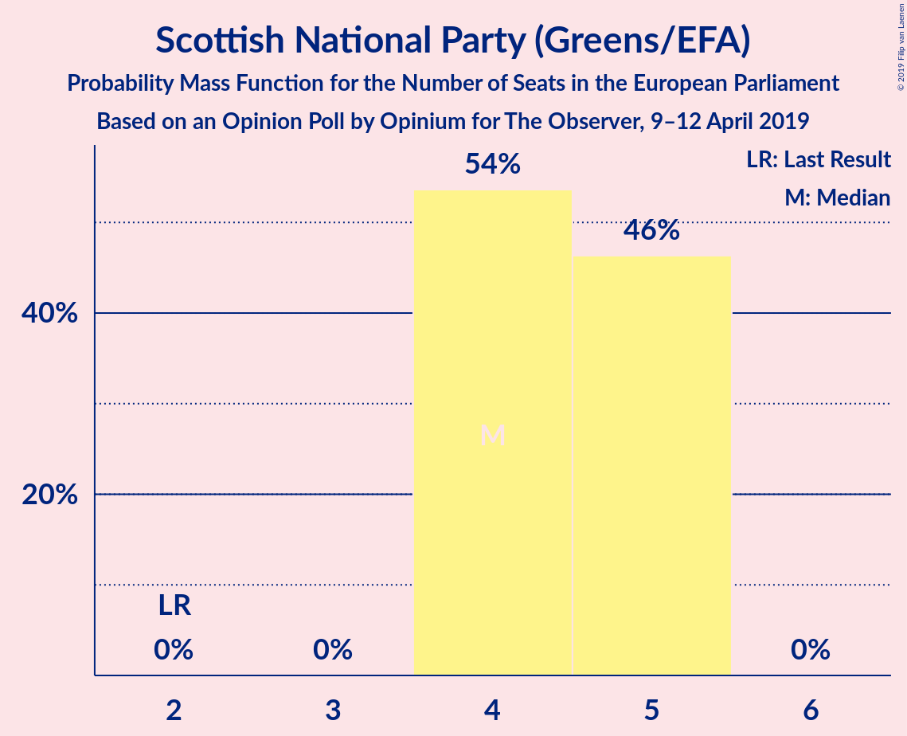
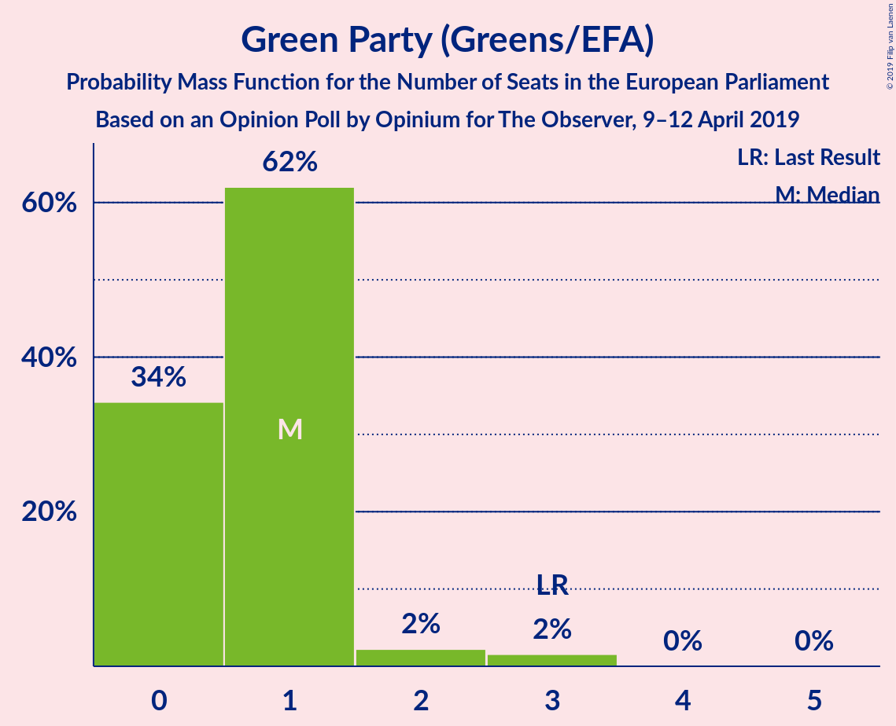
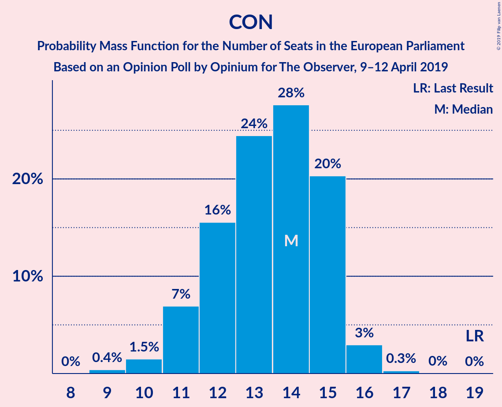
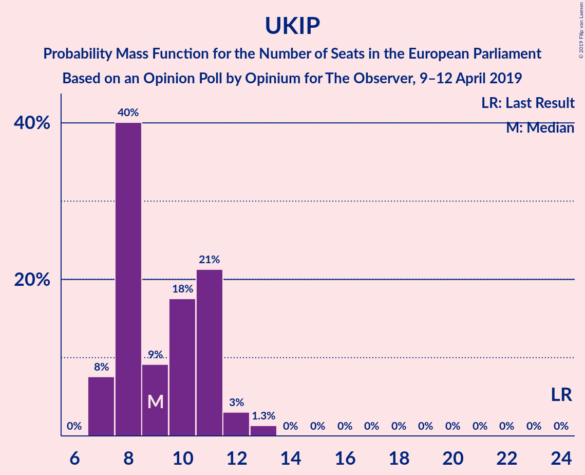
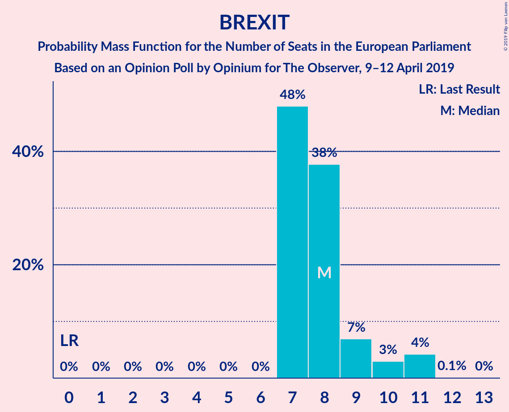
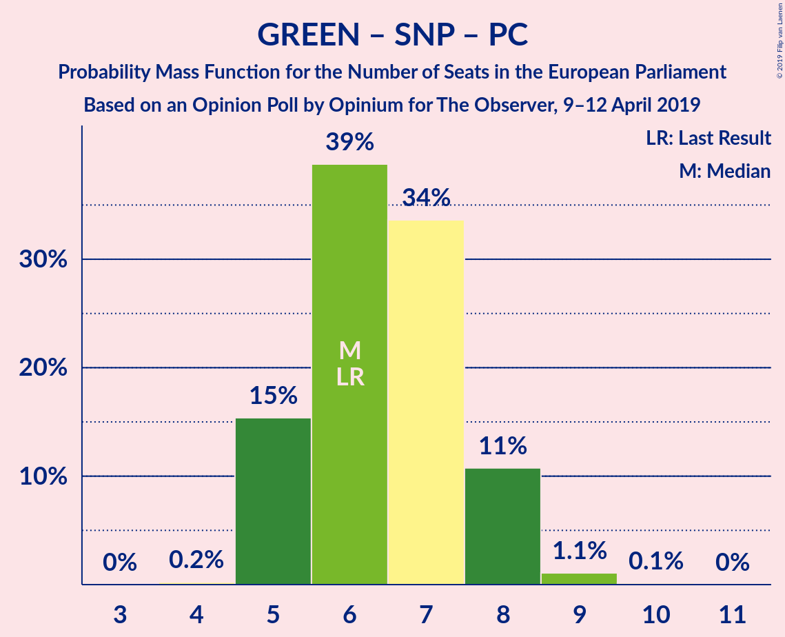
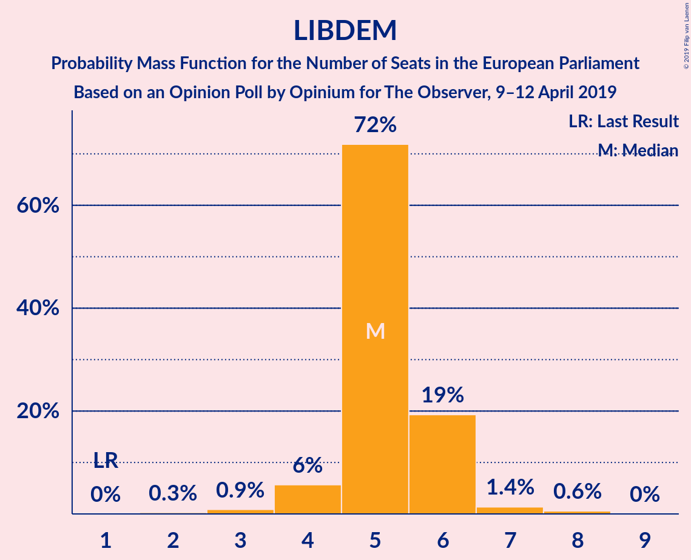
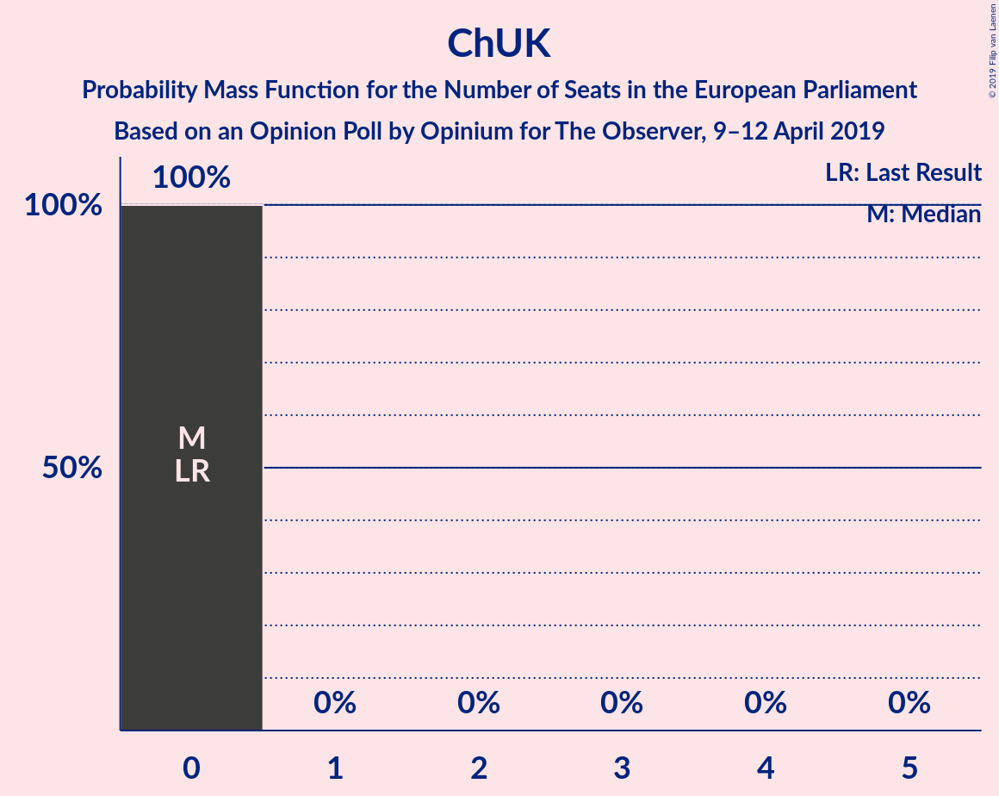

# Opinion Poll by Opinium for The Observer, 9–12 April 2019

<a href="#voting-intentions">Voting Intentions</a> | <a href="#seats">Seats</a> | <a href="#coalitions">Coalitions</a> | <a href="#technical-information">Technical Information</a>

## Voting Intentions

### Confidence Intervals

| Party | Last Result | Poll Result | 80% Confidence Interval | 90% Confidence Interval | 95% Confidence Interval | 99% Confidence Interval |
|:-----:|:-----------:|:-----------:|:-----------------------:|:-----------------------:|:-----------------------:|:-----------------------:|
| Labour Party (S&D) | 24.4% | 29.0% | 27.7–30.3% |27.4–30.7% |27.1–31.0% |26.4–31.7% |
| Conservative Party (ECR) | 23.1% | 17.0% | 15.9–18.1% |15.7–18.4% |15.4–18.7% |14.9–19.3% |
| UK Independence Party (EAPN) | 26.6% | 13.0% | 12.1–14.0% |11.8–14.3% |11.6–14.6% |11.2–15.1% |
| Brexit Party (EFDD) | 0.0% | 12.0% | 11.1–13.0% |10.9–13.3% |10.7–13.5% |10.2–14.0% |
| Liberal Democrats (ALDE) | 6.6% | 10.0% | 9.2–10.9% |9.0–11.2% |8.8–11.4% |8.4–11.9% |
| Scottish National Party (Greens/EFA) | 2.4% | 6.0% | 5.3–6.7% |5.2–6.9% |5.0–7.1% |4.7–7.5% |
| Green Party (Greens/EFA) | 6.9% | 6.0% | 5.3–6.7% |5.2–6.9% |5.0–7.1% |4.7–7.5% |
| Change UK (EPP) | 0.0% | 4.0% | 3.5–4.6% |3.3–4.8% |3.2–4.9% |3.0–5.3% |
| Plaid Cymru (Greens/EFA) | 0.7% | 1.0% | 0.8–1.4% |0.7–1.4% |0.6–1.5% |0.5–1.7% |

*Note:* The poll result column reflects the actual value used in the calculations. Published results may vary slightly, and in addition be rounded to fewer digits.

## Seats

### Confidence Intervals

| Party | Last Result | Median | 80% Confidence Interval | 90% Confidence Interval | 95% Confidence Interval | 99% Confidence Interval |
|:-----:|:-----------:|:------:|:-----------------------:|:-----------------------:|:-----------------------:|:-----------------------:|
| <a href="#labour-party-(s&d)">Labour Party (S&D)</a> | 20 | 28 | 27–29 |26–30 |26–30 |25–30 |
| <a href="#conservative-party-(ecr)">Conservative Party (ECR)</a> | 19 | 14 | 12–15 |11–15 |11–16 |10–16 |
| <a href="#uk-independence-party-(eapn)">UK Independence Party (EAPN)</a> | 24 | 9 | 8–11 |7–11 |7–12 |7–13 |
| <a href="#brexit-party-(efdd)">Brexit Party (EFDD)</a> | 0 | 8 | 7–9 |7–10 |7–11 |7–11 |
| <a href="#liberal-democrats-(alde)">Liberal Democrats (ALDE)</a> | 1 | 5 | 5–6 |4–6 |4–6 |3–8 |
| <a href="#scottish-national-party-(greens/efa)">Scottish National Party (Greens/EFA)</a> | 2 | 4 | 4–5 |4–5 |4–5 |4–5 |
| <a href="#green-party-(greens/efa)">Green Party (Greens/EFA)</a> | 3 | 1 | 0–1 |0–1 |0–2 |0–3 |
| <a href="#change-uk-(epp)">Change UK (EPP)</a> | 0 | 0 | 0 |0 |0 |0 |
| <a href="#plaid-cymru-(greens/efa)">Plaid Cymru (Greens/EFA)</a> | 1 | 1 | 1–2 |1–2 |1–2 |0–2 |

### Labour Party (S&D)

*For a full overview of the results for this party, see the [Labour Party (S&D)](party-labourpartysd.html) page.*

| Number of Seats | Probability | Accumulated | Special Marks |
|:---------------:|:-----------:|:-----------:|:-------------:|
| 20 | 0% | 100% | Last Result |
| 21 | 0% | 100% |  |
| 22 | 0% | 100% |  |
| 23 | 0% | 100% |  |
| 24 | 0% | 100% |  |
| 25 | 0.9% | 100% |  |
| 26 | 6% | 99.1% |  |
| 27 | 24% | 93% |  |
| 28 | 35% | 69% | Median |
| 29 | 28% | 34% |  |
| 30 | 5% | 6% |  |
| 31 | 0.3% | 0.4% |  |
| 32 | 0% | 0% |  |

### Conservative Party (ECR)

*For a full overview of the results for this party, see the [Conservative Party (ECR)](party-conservativepartyecr.html) page.*

| Number of Seats | Probability | Accumulated | Special Marks |
|:---------------:|:-----------:|:-----------:|:-------------:|
| 9 | 0.4% | 100% |  |
| 10 | 1.5% | 99.6% |  |
| 11 | 7% | 98% |  |
| 12 | 16% | 91% |  |
| 13 | 24% | 76% |  |
| 14 | 28% | 51% | Median |
| 15 | 20% | 24% |  |
| 16 | 3% | 3% |  |
| 17 | 0.3% | 0.3% |  |
| 18 | 0% | 0% |  |
| 19 | 0% | 0% | Last Result |

### UK Independence Party (EAPN)

*For a full overview of the results for this party, see the [UK Independence Party (EAPN)](party-ukindependencepartyeapn.html) page.*

| Number of Seats | Probability | Accumulated | Special Marks |
|:---------------:|:-----------:|:-----------:|:-------------:|
| 7 | 8% | 100% |  |
| 8 | 40% | 92% |  |
| 9 | 9% | 52% | Median |
| 10 | 18% | 43% |  |
| 11 | 21% | 26% |  |
| 12 | 3% | 4% |  |
| 13 | 1.3% | 1.3% |  |
| 14 | 0% | 0% |  |
| 15 | 0% | 0% |  |
| 16 | 0% | 0% |  |
| 17 | 0% | 0% |  |
| 18 | 0% | 0% |  |
| 19 | 0% | 0% |  |
| 20 | 0% | 0% |  |
| 21 | 0% | 0% |  |
| 22 | 0% | 0% |  |
| 23 | 0% | 0% |  |
| 24 | 0% | 0% | Last Result |

### Brexit Party (EFDD)

*For a full overview of the results for this party, see the [Brexit Party (EFDD)](party-brexitpartyefdd.html) page.*

| Number of Seats | Probability | Accumulated | Special Marks |
|:---------------:|:-----------:|:-----------:|:-------------:|
| 0 | 0% | 100% | Last Result |
| 1 | 0% | 100% |  |
| 2 | 0% | 100% |  |
| 3 | 0% | 100% |  |
| 4 | 0% | 100% |  |
| 5 | 0% | 100% |  |
| 6 | 0% | 100% |  |
| 7 | 48% | 100% |  |
| 8 | 38% | 52% | Median |
| 9 | 7% | 14% |  |
| 10 | 3% | 7% |  |
| 11 | 4% | 4% |  |
| 12 | 0.1% | 0.2% |  |
| 13 | 0% | 0% |  |

### Liberal Democrats (ALDE)

*For a full overview of the results for this party, see the [Liberal Democrats (ALDE)](party-liberaldemocratsalde.html) page.*

| Number of Seats | Probability | Accumulated | Special Marks |
|:---------------:|:-----------:|:-----------:|:-------------:|
| 1 | 0% | 100% | Last Result |
| 2 | 0.3% | 100% |  |
| 3 | 0.9% | 99.7% |  |
| 4 | 6% | 98.8% |  |
| 5 | 72% | 93% | Median |
| 6 | 19% | 21% |  |
| 7 | 1.4% | 2% |  |
| 8 | 0.6% | 0.6% |  |
| 9 | 0% | 0% |  |

### Scottish National Party (Greens/EFA)

*For a full overview of the results for this party, see the [Scottish National Party (Greens/EFA)](party-scottishnationalpartygreensefa.html) page.*

| Number of Seats | Probability | Accumulated | Special Marks |
|:---------------:|:-----------:|:-----------:|:-------------:|
| 2 | 0% | 100% | Last Result |
| 3 | 0% | 100% |  |
| 4 | 54% | 100% | Median |
| 5 | 46% | 46% |  |
| 6 | 0% | 0% |  |

### Green Party (Greens/EFA)

*For a full overview of the results for this party, see the [Green Party (Greens/EFA)](party-greenpartygreensefa.html) page.*

| Number of Seats | Probability | Accumulated | Special Marks |
|:---------------:|:-----------:|:-----------:|:-------------:|
| 0 | 34% | 100% |  |
| 1 | 62% | 66% | Median |
| 2 | 2% | 4% |  |
| 3 | 2% | 2% | Last Result |
| 4 | 0% | 0% |  |

### Change UK (EPP)

*For a full overview of the results for this party, see the [Change UK (EPP)](party-changeukepp.html) page.*

| Number of Seats | Probability | Accumulated | Special Marks |
|:---------------:|:-----------:|:-----------:|:-------------:|
| 0 | 100% | 100% | Last Result, Median |

### Plaid Cymru (Greens/EFA)

*For a full overview of the results for this party, see the [Plaid Cymru (Greens/EFA)](party-plaidcymrugreensefa.html) page.*

| Number of Seats | Probability | Accumulated | Special Marks |
|:---------------:|:-----------:|:-----------:|:-------------:|
| 0 | 0.7% | 100% |  |
| 1 | 73% | 99.3% | Last Result, Median |
| 2 | 26% | 26% |  |
| 3 | 0% | 0% |  |

## Coalitions

### Confidence Intervals

| Coalition | Last Result | Median | Majority? | 80% Confidence Interval | 90% Confidence Interval | 95% Confidence Interval | 99% Confidence Interval |
|:---------:|:-----------:|:------:|:---------:|:-----------------------:|:-----------------------:|:-----------------------:|:-----------------------:|
| Labour Party (S&D) | 20 | 28 | 0% | 27–29 | 26–30 | 26–30 | 25–30 |
| Conservative Party (ECR) | 19 | 14 | 0% | 12–15 | 11–15 | 11–16 | 10–16 |
| UK Independence Party (EAPN) | 24 | 9 | 0% | 8–11 | 7–11 | 7–12 | 7–13 |
| Brexit Party (EFDD) | 0 | 8 | 0% | 7–9 | 7–10 | 7–11 | 7–11 |
| Green Party (Greens/EFA) – Scottish National Party (Greens/EFA) – Plaid Cymru (Greens/EFA) | 6 | 6 | 0% | 5–8 | 5–8 | 5–8 | 5–9 |
| Liberal Democrats (ALDE) | 1 | 5 | 0% | 5–6 | 4–6 | 4–6 | 3–8 |
| Change UK (EPP) | 0 | 0 | 0% | 0 | 0 | 0 | 0 |

### Labour Party (S&D)

| Number of Seats | Probability | Accumulated | Special Marks |
|:---------------:|:-----------:|:-----------:|:-------------:|
| 20 | 0% | 100% | Last Result |
| 21 | 0% | 100% |  |
| 22 | 0% | 100% |  |
| 23 | 0% | 100% |  |
| 24 | 0% | 100% |  |
| 25 | 0.9% | 100% |  |
| 26 | 6% | 99.1% |  |
| 27 | 24% | 93% |  |
| 28 | 35% | 69% | Median |
| 29 | 28% | 34% |  |
| 30 | 5% | 6% |  |
| 31 | 0.3% | 0.4% |  |
| 32 | 0% | 0% |  |

### Conservative Party (ECR)

| Number of Seats | Probability | Accumulated | Special Marks |
|:---------------:|:-----------:|:-----------:|:-------------:|
| 9 | 0.4% | 100% |  |
| 10 | 1.5% | 99.6% |  |
| 11 | 7% | 98% |  |
| 12 | 16% | 91% |  |
| 13 | 24% | 76% |  |
| 14 | 28% | 51% | Median |
| 15 | 20% | 24% |  |
| 16 | 3% | 3% |  |
| 17 | 0.3% | 0.3% |  |
| 18 | 0% | 0% |  |
| 19 | 0% | 0% | Last Result |

### UK Independence Party (EAPN)

| Number of Seats | Probability | Accumulated | Special Marks |
|:---------------:|:-----------:|:-----------:|:-------------:|
| 7 | 8% | 100% |  |
| 8 | 40% | 92% |  |
| 9 | 9% | 52% | Median |
| 10 | 18% | 43% |  |
| 11 | 21% | 26% |  |
| 12 | 3% | 4% |  |
| 13 | 1.3% | 1.3% |  |
| 14 | 0% | 0% |  |
| 15 | 0% | 0% |  |
| 16 | 0% | 0% |  |
| 17 | 0% | 0% |  |
| 18 | 0% | 0% |  |
| 19 | 0% | 0% |  |
| 20 | 0% | 0% |  |
| 21 | 0% | 0% |  |
| 22 | 0% | 0% |  |
| 23 | 0% | 0% |  |
| 24 | 0% | 0% | Last Result |

### Brexit Party (EFDD)

| Number of Seats | Probability | Accumulated | Special Marks |
|:---------------:|:-----------:|:-----------:|:-------------:|
| 0 | 0% | 100% | Last Result |
| 1 | 0% | 100% |  |
| 2 | 0% | 100% |  |
| 3 | 0% | 100% |  |
| 4 | 0% | 100% |  |
| 5 | 0% | 100% |  |
| 6 | 0% | 100% |  |
| 7 | 48% | 100% |  |
| 8 | 38% | 52% | Median |
| 9 | 7% | 14% |  |
| 10 | 3% | 7% |  |
| 11 | 4% | 4% |  |
| 12 | 0.1% | 0.2% |  |
| 13 | 0% | 0% |  |

### Green Party (Greens/EFA) – Scottish National Party (Greens/EFA) – Plaid Cymru (Greens/EFA)

| Number of Seats | Probability | Accumulated | Special Marks |
|:---------------:|:-----------:|:-----------:|:-------------:|
| 4 | 0.2% | 100% |  |
| 5 | 15% | 99.8% |  |
| 6 | 39% | 84% | Last Result, Median |
| 7 | 34% | 46% |  |
| 8 | 11% | 12% |  |
| 9 | 1.1% | 1.2% |  |
| 10 | 0.1% | 0.1% |  |
| 11 | 0% | 0% |  |

### Liberal Democrats (ALDE)

| Number of Seats | Probability | Accumulated | Special Marks |
|:---------------:|:-----------:|:-----------:|:-------------:|
| 1 | 0% | 100% | Last Result |
| 2 | 0.3% | 100% |  |
| 3 | 0.9% | 99.7% |  |
| 4 | 6% | 98.8% |  |
| 5 | 72% | 93% | Median |
| 6 | 19% | 21% |  |
| 7 | 1.4% | 2% |  |
| 8 | 0.6% | 0.6% |  |
| 9 | 0% | 0% |  |

### Change UK (EPP)

| Number of Seats | Probability | Accumulated | Special Marks |
|:---------------:|:-----------:|:-----------:|:-------------:|
| 0 | 100% | 100% | Last Result, Median |

## Technical Information

### Opinion Poll

+ **Polling firm:** Opinium
+ **Commissioner(s):** The Observer
+ **Fieldwork period:** 9–12 April 2019

### Calculations

+ **Sample size:** 2007
+ **Simulations done:** 1,048,576
+ **Error estimate:** 0.94%

