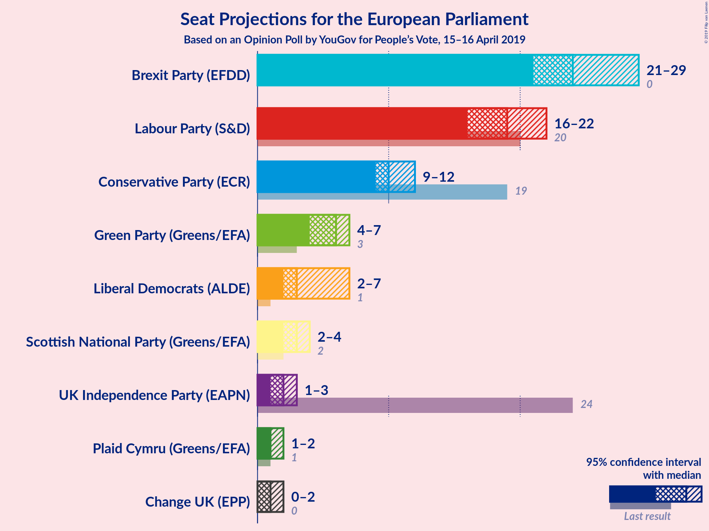
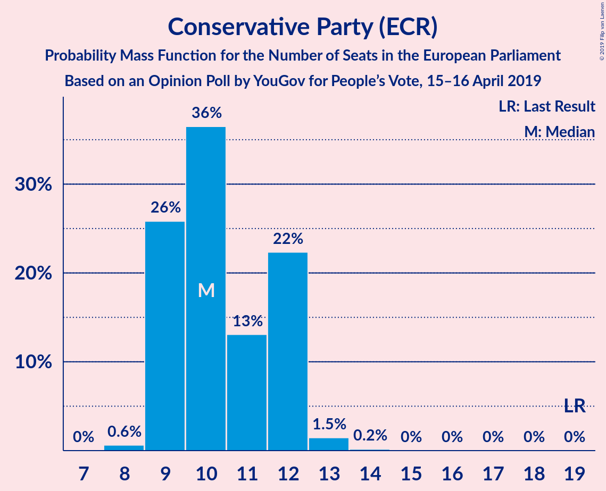
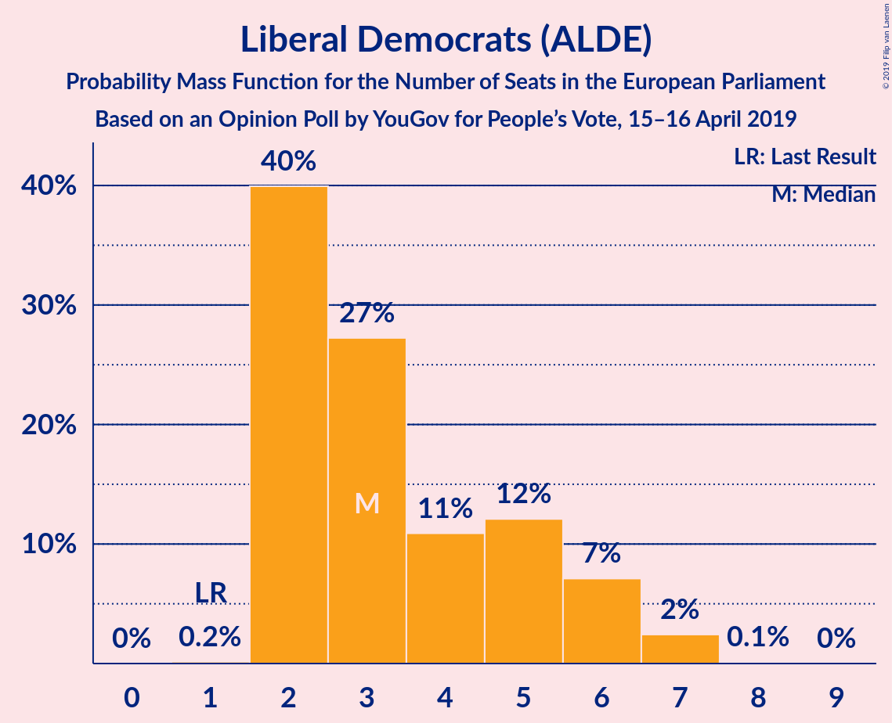
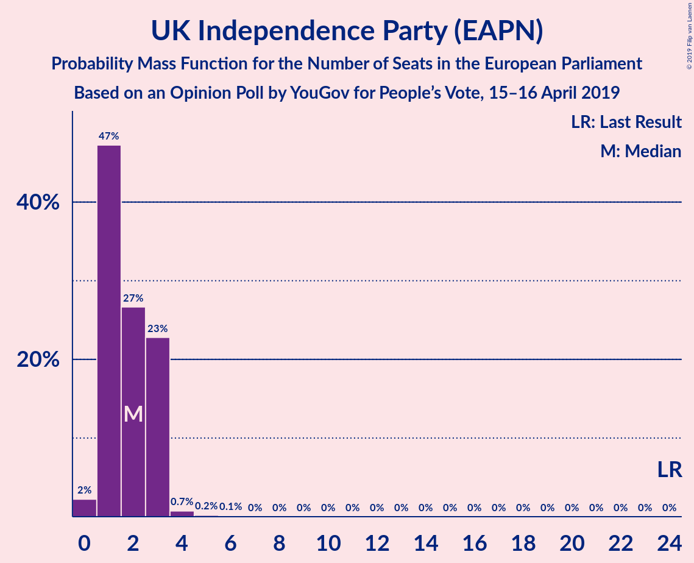
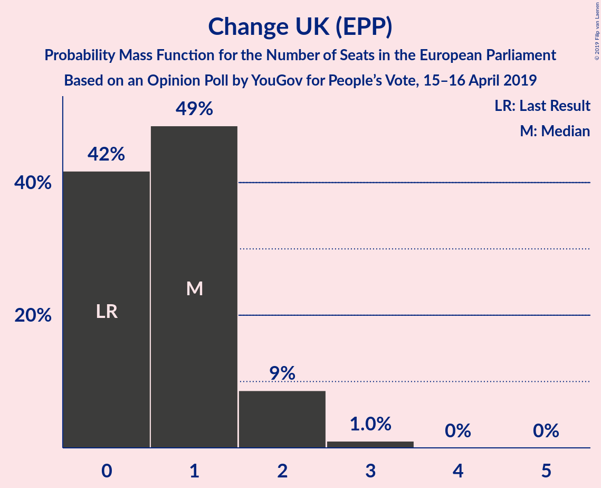
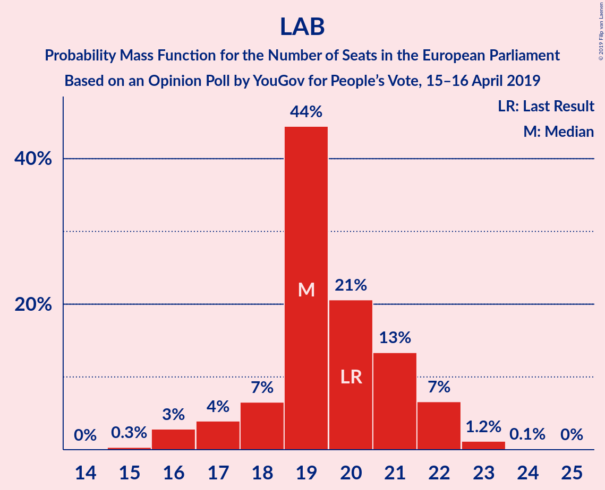
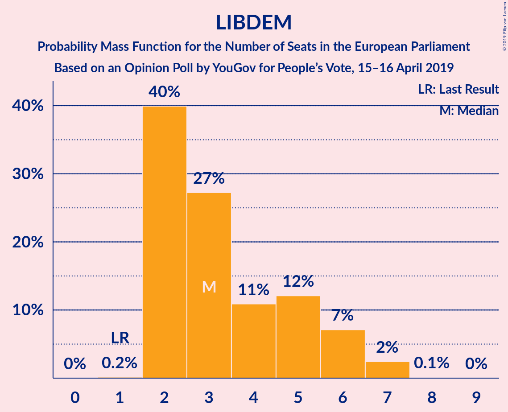

# Opinion Poll by YouGov for People’s Vote, 15–16 April 2019

<a href="#voting-intentions">Voting Intentions</a> | <a href="#seats">Seats</a> | <a href="#coalitions">Coalitions</a> | <a href="#technical-information">Technical Information</a>

## Voting Intentions

### Confidence Intervals

| Party | Last Result | Poll Result | 80% Confidence Interval | 90% Confidence Interval | 95% Confidence Interval | 99% Confidence Interval |
|:-----:|:-----------:|:-----------:|:-----------------------:|:-----------------------:|:-----------------------:|:-----------------------:|
| Brexit Party (EFDD) | 0.0% | 26.7% | 25.4–28.1% |25.1–28.5% |24.8–28.8% |24.2–29.5% |
| Labour Party (S&D) | 24.4% | 21.8% | 20.6–23.0% |20.2–23.4% |20.0–23.7% |19.4–24.3% |
| Conservative Party (ECR) | 23.1% | 14.8% | 13.8–15.9% |13.5–16.2% |13.3–16.5% |12.8–17.1% |
| Green Party (Greens/EFA) | 6.9% | 9.9% | 9.1–10.9% |8.8–11.1% |8.6–11.4% |8.2–11.8% |
| Liberal Democrats (ALDE) | 6.6% | 8.9% | 8.1–9.8% |7.9–10.1% |7.7–10.3% |7.3–10.7% |
| UK Independence Party (EAPN) | 26.6% | 7.0% | 6.2–7.8% |6.1–8.0% |5.9–8.2% |5.6–8.6% |
| Change UK (EPP) | 0.0% | 5.9% | 5.3–6.7% |5.1–6.9% |4.9–7.1% |4.6–7.5% |
| Scottish National Party (Greens/EFA) | 2.4% | 3.0% | 2.5–3.5% |2.4–3.7% |2.3–3.8% |2.1–4.1% |
| Plaid Cymru (Greens/EFA) | 0.7% | 1.0% | 0.7–1.3% |0.7–1.4% |0.6–1.5% |0.5–1.7% |

*Note:* The poll result column reflects the actual value used in the calculations. Published results may vary slightly, and in addition be rounded to fewer digits.

## Seats

### Confidence Intervals

| Party | Last Result | Median | 80% Confidence Interval | 90% Confidence Interval | 95% Confidence Interval | 99% Confidence Interval |
|:-----:|:-----------:|:------:|:-----------------------:|:-----------------------:|:-----------------------:|:-----------------------:|
| <a href="#brexit-party-(efdd)">Brexit Party (EFDD)</a> | 0 | 25 | 24–25 |23–26 |22–27 |21–29 |
| <a href="#labour-party-(s&d)">Labour Party (S&D)</a> | 20 | 19 | 19–20 |18–21 |18–21 |16–23 |
| <a href="#conservative-party-(ecr)">Conservative Party (ECR)</a> | 19 | 12 | 10–12 |9–12 |9–12 |9–13 |
| <a href="#green-party-(greens/efa)">Green Party (Greens/EFA)</a> | 3 | 6 | 5–7 |4–7 |4–7 |4–7 |
| <a href="#liberal-democrats-(alde)">Liberal Democrats (ALDE)</a> | 1 | 2 | 2–3 |2–5 |2–6 |2–7 |
| <a href="#uk-independence-party-(eapn)">UK Independence Party (EAPN)</a> | 24 | 1 | 1–3 |1–3 |1–3 |0–3 |
| <a href="#change-uk-(epp)">Change UK (EPP)</a> | 0 | 1 | 0–1 |0–2 |0–2 |0–2 |
| <a href="#scottish-national-party-(greens/efa)">Scottish National Party (Greens/EFA)</a> | 2 | 3 | 3 |2–3 |2–3 |2–4 |
| <a href="#plaid-cymru-(greens/efa)">Plaid Cymru (Greens/EFA)</a> | 1 | 1 | 1–2 |1–2 |1–2 |1–2 |

### Brexit Party (EFDD)

*For a full overview of the results for this party, see the [Brexit Party (EFDD)](party-brexitpartyefdd.html) page.*

| Number of Seats | Probability | Accumulated | Special Marks |
|:---------------:|:-----------:|:-----------:|:-------------:|
| 0 | 0% | 100% | Last Result |
| 1 | 0% | 100% |  |
| 2 | 0% | 100% |  |
| 3 | 0% | 100% |  |
| 4 | 0% | 100% |  |
| 5 | 0% | 100% |  |
| 6 | 0% | 100% |  |
| 7 | 0% | 100% |  |
| 8 | 0% | 100% |  |
| 9 | 0% | 100% |  |
| 10 | 0% | 100% |  |
| 11 | 0% | 100% |  |
| 12 | 0% | 100% |  |
| 13 | 0% | 100% |  |
| 14 | 0% | 100% |  |
| 15 | 0% | 100% |  |
| 16 | 0% | 100% |  |
| 17 | 0% | 100% |  |
| 18 | 0% | 100% |  |
| 19 | 0% | 100% |  |
| 20 | 0% | 100% |  |
| 21 | 2% | 100% |  |
| 22 | 1.3% | 98% |  |
| 23 | 4% | 97% |  |
| 24 | 18% | 92% |  |
| 25 | 65% | 74% | Median |
| 26 | 7% | 9% |  |
| 27 | 2% | 3% |  |
| 28 | 0.3% | 1.2% |  |
| 29 | 0.5% | 0.9% |  |
| 30 | 0.3% | 0.4% |  |
| 31 | 0.1% | 0.1% |  |
| 32 | 0% | 0% |  |

### Labour Party (S&D)

*For a full overview of the results for this party, see the [Labour Party (S&D)](party-labourpartysd.html) page.*

| Number of Seats | Probability | Accumulated | Special Marks |
|:---------------:|:-----------:|:-----------:|:-------------:|
| 15 | 0.4% | 100% |  |
| 16 | 0.6% | 99.6% |  |
| 17 | 0.3% | 99.0% |  |
| 18 | 4% | 98.7% |  |
| 19 | 73% | 95% | Median |
| 20 | 16% | 21% | Last Result |
| 21 | 3% | 6% |  |
| 22 | 2% | 2% |  |
| 23 | 0.4% | 0.6% |  |
| 24 | 0.2% | 0.2% |  |
| 25 | 0% | 0% |  |

### Conservative Party (ECR)

*For a full overview of the results for this party, see the [Conservative Party (ECR)](party-conservativepartyecr.html) page.*

| Number of Seats | Probability | Accumulated | Special Marks |
|:---------------:|:-----------:|:-----------:|:-------------:|
| 8 | 0.2% | 100% |  |
| 9 | 5% | 99.8% |  |
| 10 | 25% | 95% |  |
| 11 | 6% | 70% |  |
| 12 | 63% | 63% | Median |
| 13 | 0.6% | 0.7% |  |
| 14 | 0% | 0% |  |
| 15 | 0% | 0% |  |
| 16 | 0% | 0% |  |
| 17 | 0% | 0% |  |
| 18 | 0% | 0% |  |
| 19 | 0% | 0% | Last Result |

### Green Party (Greens/EFA)

*For a full overview of the results for this party, see the [Green Party (Greens/EFA)](party-greenpartygreensefa.html) page.*

| Number of Seats | Probability | Accumulated | Special Marks |
|:---------------:|:-----------:|:-----------:|:-------------:|
| 3 | 0.4% | 100% | Last Result |
| 4 | 8% | 99.6% |  |
| 5 | 14% | 92% |  |
| 6 | 64% | 78% | Median |
| 7 | 14% | 14% |  |
| 8 | 0.1% | 0.2% |  |
| 9 | 0.1% | 0.1% |  |
| 10 | 0% | 0% |  |

### Liberal Democrats (ALDE)

*For a full overview of the results for this party, see the [Liberal Democrats (ALDE)](party-liberaldemocratsalde.html) page.*

| Number of Seats | Probability | Accumulated | Special Marks |
|:---------------:|:-----------:|:-----------:|:-------------:|
| 1 | 0.2% | 100% | Last Result |
| 2 | 73% | 99.8% | Median |
| 3 | 19% | 27% |  |
| 4 | 1.3% | 8% |  |
| 5 | 2% | 7% |  |
| 6 | 3% | 4% |  |
| 7 | 0.8% | 1.0% |  |
| 8 | 0.2% | 0.2% |  |
| 9 | 0% | 0% |  |

### UK Independence Party (EAPN)

*For a full overview of the results for this party, see the [UK Independence Party (EAPN)](party-ukindependencepartyeapn.html) page.*

| Number of Seats | Probability | Accumulated | Special Marks |
|:---------------:|:-----------:|:-----------:|:-------------:|
| 0 | 0.9% | 100% |  |
| 1 | 72% | 99.1% | Median |
| 2 | 12% | 27% |  |
| 3 | 15% | 15% |  |
| 4 | 0.3% | 0.4% |  |
| 5 | 0% | 0% |  |
| 6 | 0% | 0% |  |
| 7 | 0% | 0% |  |
| 8 | 0% | 0% |  |
| 9 | 0% | 0% |  |
| 10 | 0% | 0% |  |
| 11 | 0% | 0% |  |
| 12 | 0% | 0% |  |
| 13 | 0% | 0% |  |
| 14 | 0% | 0% |  |
| 15 | 0% | 0% |  |
| 16 | 0% | 0% |  |
| 17 | 0% | 0% |  |
| 18 | 0% | 0% |  |
| 19 | 0% | 0% |  |
| 20 | 0% | 0% |  |
| 21 | 0% | 0% |  |
| 22 | 0% | 0% |  |
| 23 | 0% | 0% |  |
| 24 | 0% | 0% | Last Result |

### Change UK (EPP)

*For a full overview of the results for this party, see the [Change UK (EPP)](party-changeukepp.html) page.*

| Number of Seats | Probability | Accumulated | Special Marks |
|:---------------:|:-----------:|:-----------:|:-------------:|
| 0 | 15% | 100% | Last Result |
| 1 | 80% | 85% | Median |
| 2 | 5% | 5% |  |
| 3 | 0.1% | 0.1% |  |
| 4 | 0% | 0% |  |

### Scottish National Party (Greens/EFA)

*For a full overview of the results for this party, see the [Scottish National Party (Greens/EFA)](party-scottishnationalpartygreensefa.html) page.*

| Number of Seats | Probability | Accumulated | Special Marks |
|:---------------:|:-----------:|:-----------:|:-------------:|
| 2 | 5% | 100% | Last Result |
| 3 | 93% | 95% | Median |
| 4 | 2% | 2% |  |
| 5 | 0% | 0% |  |

### Plaid Cymru (Greens/EFA)

*For a full overview of the results for this party, see the [Plaid Cymru (Greens/EFA)](party-plaidcymrugreensefa.html) page.*

| Number of Seats | Probability | Accumulated | Special Marks |
|:---------------:|:-----------:|:-----------:|:-------------:|
| 0 | 0.3% | 100% |  |
| 1 | 85% | 99.7% | Last Result, Median |
| 2 | 15% | 15% |  |
| 3 | 0% | 0% |  |

## Coalitions

### Confidence Intervals

| Coalition | Last Result | Median | Majority? | 80% Confidence Interval | 90% Confidence Interval | 95% Confidence Interval | 99% Confidence Interval |
|:---------:|:-----------:|:------:|:---------:|:-----------------------:|:-----------------------:|:-----------------------:|:-----------------------:|
| Brexit Party (EFDD) | 0 | 25 | 0% | 24–25 | 23–26 | 22–27 | 21–29 |
| Labour Party (S&D) | 20 | 19 | 0% | 19–20 | 18–21 | 18–21 | 16–23 |
| Conservative Party (ECR) | 19 | 12 | 0% | 10–12 | 9–12 | 9–12 | 9–13 |
| Green Party (Greens/EFA) – Scottish National Party (Greens/EFA) – Plaid Cymru (Greens/EFA) | 6 | 10 | 0% | 9–11 | 8–11 | 8–11 | 8–12 |
| Liberal Democrats (ALDE) | 1 | 2 | 0% | 2–3 | 2–5 | 2–6 | 2–7 |
| UK Independence Party (EAPN) | 24 | 1 | 0% | 1–3 | 1–3 | 1–3 | 0–3 |
| Change UK (EPP) | 0 | 1 | 0% | 0–1 | 0–2 | 0–2 | 0–2 |

### Brexit Party (EFDD)

| Number of Seats | Probability | Accumulated | Special Marks |
|:---------------:|:-----------:|:-----------:|:-------------:|
| 0 | 0% | 100% | Last Result |
| 1 | 0% | 100% |  |
| 2 | 0% | 100% |  |
| 3 | 0% | 100% |  |
| 4 | 0% | 100% |  |
| 5 | 0% | 100% |  |
| 6 | 0% | 100% |  |
| 7 | 0% | 100% |  |
| 8 | 0% | 100% |  |
| 9 | 0% | 100% |  |
| 10 | 0% | 100% |  |
| 11 | 0% | 100% |  |
| 12 | 0% | 100% |  |
| 13 | 0% | 100% |  |
| 14 | 0% | 100% |  |
| 15 | 0% | 100% |  |
| 16 | 0% | 100% |  |
| 17 | 0% | 100% |  |
| 18 | 0% | 100% |  |
| 19 | 0% | 100% |  |
| 20 | 0% | 100% |  |
| 21 | 2% | 100% |  |
| 22 | 1.3% | 98% |  |
| 23 | 4% | 97% |  |
| 24 | 18% | 92% |  |
| 25 | 65% | 74% | Median |
| 26 | 7% | 9% |  |
| 27 | 2% | 3% |  |
| 28 | 0.3% | 1.2% |  |
| 29 | 0.5% | 0.9% |  |
| 30 | 0.3% | 0.4% |  |
| 31 | 0.1% | 0.1% |  |
| 32 | 0% | 0% |  |

### Labour Party (S&D)

| Number of Seats | Probability | Accumulated | Special Marks |
|:---------------:|:-----------:|:-----------:|:-------------:|
| 15 | 0.4% | 100% |  |
| 16 | 0.6% | 99.6% |  |
| 17 | 0.3% | 99.0% |  |
| 18 | 4% | 98.7% |  |
| 19 | 73% | 95% | Median |
| 20 | 16% | 21% | Last Result |
| 21 | 3% | 6% |  |
| 22 | 2% | 2% |  |
| 23 | 0.4% | 0.6% |  |
| 24 | 0.2% | 0.2% |  |
| 25 | 0% | 0% |  |

### Conservative Party (ECR)

| Number of Seats | Probability | Accumulated | Special Marks |
|:---------------:|:-----------:|:-----------:|:-------------:|
| 8 | 0.2% | 100% |  |
| 9 | 5% | 99.8% |  |
| 10 | 25% | 95% |  |
| 11 | 6% | 70% |  |
| 12 | 63% | 63% | Median |
| 13 | 0.6% | 0.7% |  |
| 14 | 0% | 0% |  |
| 15 | 0% | 0% |  |
| 16 | 0% | 0% |  |
| 17 | 0% | 0% |  |
| 18 | 0% | 0% |  |
| 19 | 0% | 0% | Last Result |

### Green Party (Greens/EFA) – Scottish National Party (Greens/EFA) – Plaid Cymru (Greens/EFA)

| Number of Seats | Probability | Accumulated | Special Marks |
|:---------------:|:-----------:|:-----------:|:-------------:|
| 6 | 0.1% | 100% | Last Result |
| 7 | 0.3% | 99.9% |  |
| 8 | 9% | 99.6% |  |
| 9 | 2% | 91% |  |
| 10 | 75% | 89% | Median |
| 11 | 12% | 14% |  |
| 12 | 1.1% | 1.4% |  |
| 13 | 0.3% | 0.3% |  |
| 14 | 0% | 0% |  |

### Liberal Democrats (ALDE)

| Number of Seats | Probability | Accumulated | Special Marks |
|:---------------:|:-----------:|:-----------:|:-------------:|
| 1 | 0.2% | 100% | Last Result |
| 2 | 73% | 99.8% | Median |
| 3 | 19% | 27% |  |
| 4 | 1.3% | 8% |  |
| 5 | 2% | 7% |  |
| 6 | 3% | 4% |  |
| 7 | 0.8% | 1.0% |  |
| 8 | 0.2% | 0.2% |  |
| 9 | 0% | 0% |  |

### UK Independence Party (EAPN)

| Number of Seats | Probability | Accumulated | Special Marks |
|:---------------:|:-----------:|:-----------:|:-------------:|
| 0 | 0.9% | 100% |  |
| 1 | 72% | 99.1% | Median |
| 2 | 12% | 27% |  |
| 3 | 15% | 15% |  |
| 4 | 0.3% | 0.4% |  |
| 5 | 0% | 0% |  |
| 6 | 0% | 0% |  |
| 7 | 0% | 0% |  |
| 8 | 0% | 0% |  |
| 9 | 0% | 0% |  |
| 10 | 0% | 0% |  |
| 11 | 0% | 0% |  |
| 12 | 0% | 0% |  |
| 13 | 0% | 0% |  |
| 14 | 0% | 0% |  |
| 15 | 0% | 0% |  |
| 16 | 0% | 0% |  |
| 17 | 0% | 0% |  |
| 18 | 0% | 0% |  |
| 19 | 0% | 0% |  |
| 20 | 0% | 0% |  |
| 21 | 0% | 0% |  |
| 22 | 0% | 0% |  |
| 23 | 0% | 0% |  |
| 24 | 0% | 0% | Last Result |

### Change UK (EPP)

| Number of Seats | Probability | Accumulated | Special Marks |
|:---------------:|:-----------:|:-----------:|:-------------:|
| 0 | 15% | 100% | Last Result |
| 1 | 80% | 85% | Median |
| 2 | 5% | 5% |  |
| 3 | 0.1% | 0.1% |  |
| 4 | 0% | 0% |  |

## Technical Information

### Opinion Poll

+ **Polling firm:** YouGov
+ **Commissioner(s):** People’s Vote
+ **Fieldwork period:** 15–16 April 2019

### Calculations

+ **Sample size:** 1855
+ **Simulations done:** 131,072
+ **Error estimate:** 0.62%

