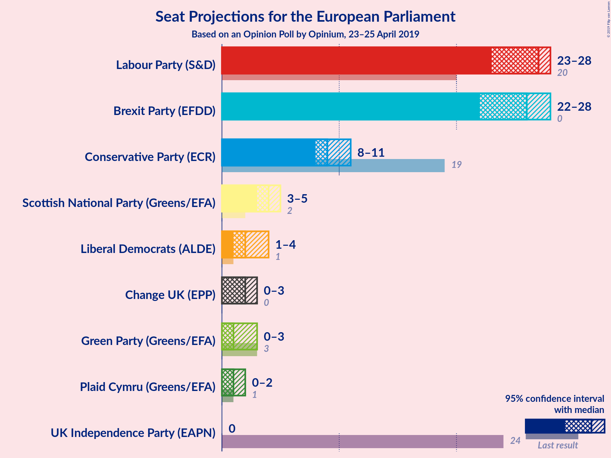
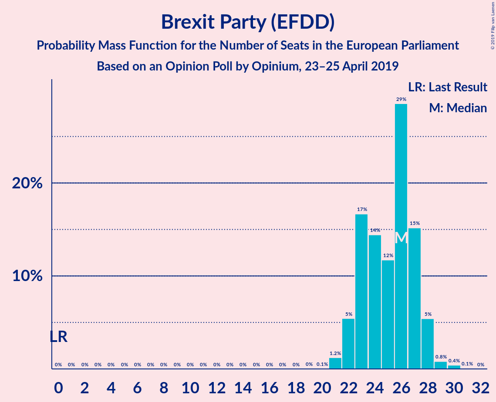
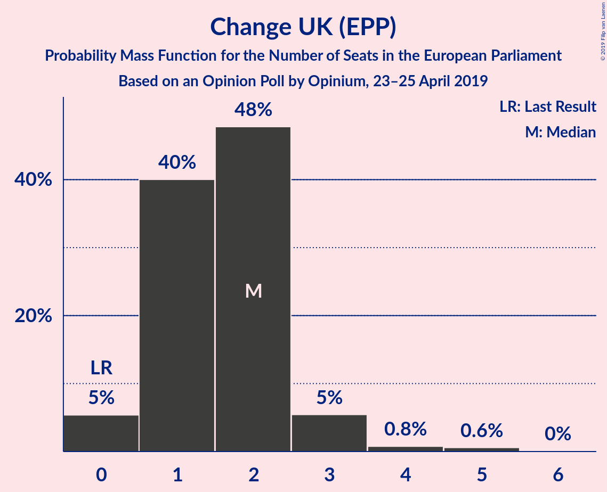
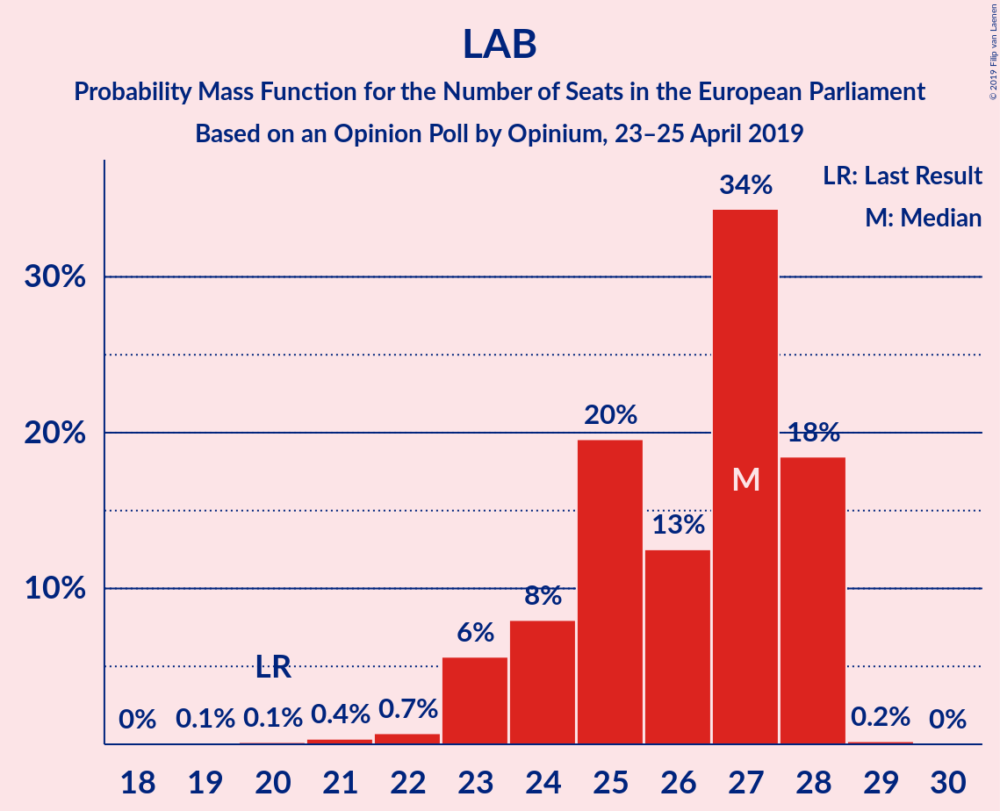
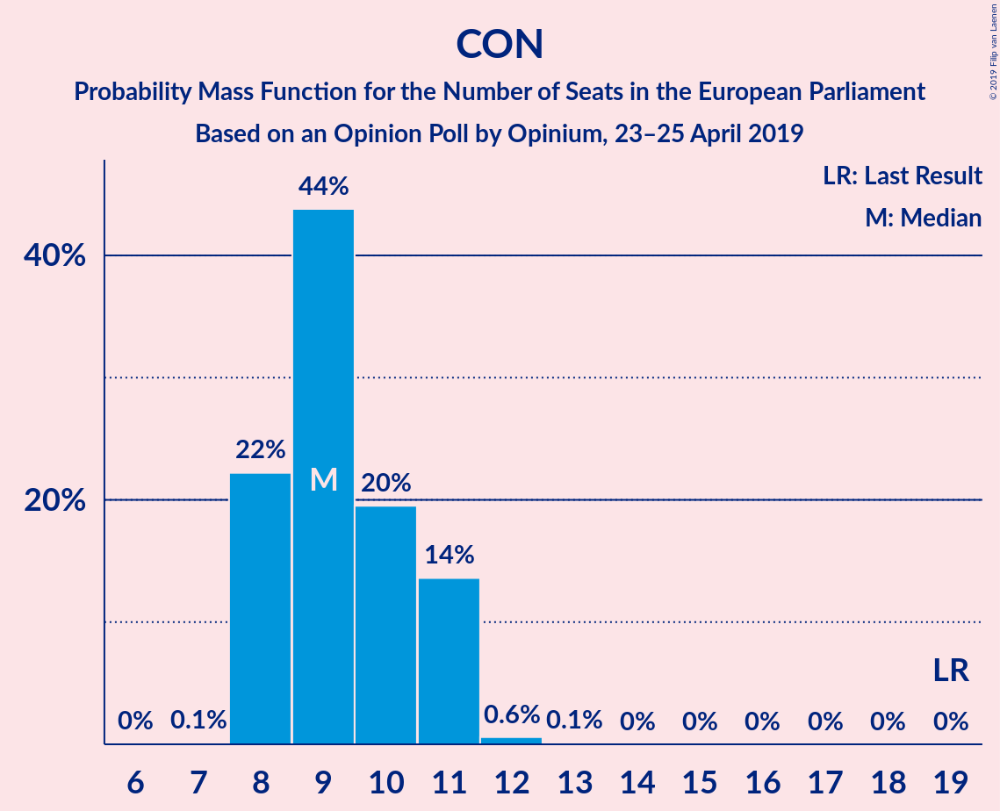
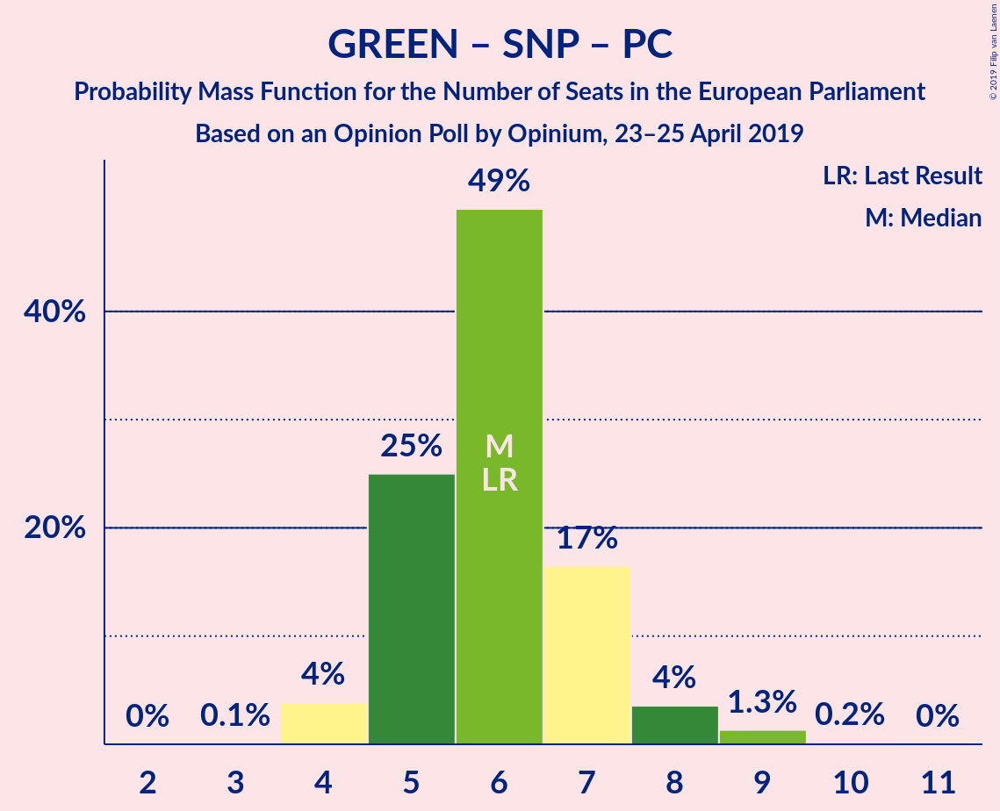
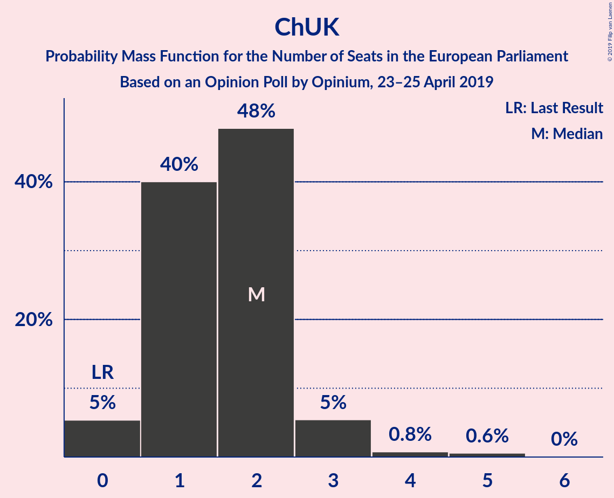

# Opinion Poll by Opinium, 23–25 April 2019

<a href="#voting-intentions">Voting Intentions</a> | <a href="#seats">Seats</a> | <a href="#coalitions">Coalitions</a> | <a href="#technical-information">Technical Information</a>

## Voting Intentions

### Confidence Intervals

| Party | Last Result | Poll Result | 80% Confidence Interval | 90% Confidence Interval | 95% Confidence Interval | 99% Confidence Interval |
|:-----:|:-----------:|:-----------:|:-----------------------:|:-----------------------:|:-----------------------:|:-----------------------:|
| Labour Party (S&D) | 24.4% | 28.0% | 26.3–29.9% |25.8–30.4% |25.4–30.9% |24.5–31.8% |
| Brexit Party (EFDD) | 0.0% | 28.0% | 26.3–29.9% |25.8–30.4% |25.4–30.9% |24.5–31.8% |
| Conservative Party (ECR) | 23.1% | 14.0% | 12.7–15.4% |12.3–15.9% |12.0–16.2% |11.4–17.0% |
| Liberal Democrats (ALDE) | 6.6% | 7.0% | 6.1–8.2% |5.8–8.5% |5.6–8.8% |5.2–9.3% |
| Change UK (EPP) | 0.0% | 7.0% | 6.1–8.2% |5.8–8.5% |5.6–8.8% |5.2–9.3% |
| Green Party (Greens/EFA) | 6.9% | 6.0% | 5.1–7.0% |4.9–7.3% |4.7–7.6% |4.3–8.1% |
| Scottish National Party (Greens/EFA) | 2.4% | 5.0% | 4.2–6.0% |4.0–6.2% |3.8–6.5% |3.5–7.0% |
| UK Independence Party (EAPN) | 26.6% | 3.0% | 2.4–3.8% |2.3–4.1% |2.1–4.3% |1.9–4.7% |
| Plaid Cymru (Greens/EFA) | 0.7% | 1.0% | 0.7–1.5% |0.6–1.7% |0.5–1.8% |0.4–2.1% |

*Note:* The poll result column reflects the actual value used in the calculations. Published results may vary slightly, and in addition be rounded to fewer digits.

## Seats

### Confidence Intervals

| Party | Last Result | Median | 80% Confidence Interval | 90% Confidence Interval | 95% Confidence Interval | 99% Confidence Interval |
|:-----:|:-----------:|:------:|:-----------------------:|:-----------------------:|:-----------------------:|:-----------------------:|
| <a href="#labour-party-(s&d)">Labour Party (S&D)</a> | 20 | 27 | 24–28 |23–28 |23–28 |21–28 |
| <a href="#brexit-party-(efdd)">Brexit Party (EFDD)</a> | 0 | 26 | 23–27 |22–28 |22–28 |21–29 |
| <a href="#conservative-party-(ecr)">Conservative Party (ECR)</a> | 19 | 9 | 8–11 |8–11 |8–11 |8–12 |
| <a href="#liberal-democrats-(alde)">Liberal Democrats (ALDE)</a> | 1 | 2 | 1–2 |1–2 |1–4 |0–4 |
| <a href="#change-uk-(epp)">Change UK (EPP)</a> | 0 | 2 | 1–2 |0–3 |0–3 |0–5 |
| <a href="#green-party-(greens/efa)">Green Party (Greens/EFA)</a> | 3 | 1 | 0–1 |0–2 |0–3 |0–4 |
| <a href="#scottish-national-party-(greens/efa)">Scottish National Party (Greens/EFA)</a> | 2 | 4 | 4 |4–5 |3–5 |3–5 |
| <a href="#uk-independence-party-(eapn)">UK Independence Party (EAPN)</a> | 24 | 0 | 0 |0 |0 |0 |
| <a href="#plaid-cymru-(greens/efa)">Plaid Cymru (Greens/EFA)</a> | 1 | 1 | 1–2 |0–2 |0–2 |0–2 |

### Labour Party (S&D)

*For a full overview of the results for this party, see the [Labour Party (S&D)](party-labourpartysd.html) page.*

| Number of Seats | Probability | Accumulated | Special Marks |
|:---------------:|:-----------:|:-----------:|:-------------:|
| 19 | 0.1% | 100% |  |
| 20 | 0.1% | 99.9% | Last Result |
| 21 | 0.4% | 99.8% |  |
| 22 | 0.7% | 99.4% |  |
| 23 | 6% | 98.7% |  |
| 24 | 8% | 93% |  |
| 25 | 20% | 85% |  |
| 26 | 13% | 66% |  |
| 27 | 34% | 53% | Median |
| 28 | 18% | 19% |  |
| 29 | 0.2% | 0.2% |  |
| 30 | 0% | 0% |  |

### Brexit Party (EFDD)

*For a full overview of the results for this party, see the [Brexit Party (EFDD)](party-brexitpartyefdd.html) page.*

| Number of Seats | Probability | Accumulated | Special Marks |
|:---------------:|:-----------:|:-----------:|:-------------:|
| 0 | 0% | 100% | Last Result |
| 1 | 0% | 100% |  |
| 2 | 0% | 100% |  |
| 3 | 0% | 100% |  |
| 4 | 0% | 100% |  |
| 5 | 0% | 100% |  |
| 6 | 0% | 100% |  |
| 7 | 0% | 100% |  |
| 8 | 0% | 100% |  |
| 9 | 0% | 100% |  |
| 10 | 0% | 100% |  |
| 11 | 0% | 100% |  |
| 12 | 0% | 100% |  |
| 13 | 0% | 100% |  |
| 14 | 0% | 100% |  |
| 15 | 0% | 100% |  |
| 16 | 0% | 100% |  |
| 17 | 0% | 100% |  |
| 18 | 0% | 100% |  |
| 19 | 0% | 100% |  |
| 20 | 0.1% | 100% |  |
| 21 | 1.2% | 99.9% |  |
| 22 | 5% | 98.7% |  |
| 23 | 17% | 93% |  |
| 24 | 14% | 77% |  |
| 25 | 12% | 62% |  |
| 26 | 29% | 50% | Median |
| 27 | 15% | 22% |  |
| 28 | 5% | 7% |  |
| 29 | 0.8% | 1.3% |  |
| 30 | 0.4% | 0.5% |  |
| 31 | 0.1% | 0.1% |  |
| 32 | 0% | 0% |  |

### Conservative Party (ECR)

*For a full overview of the results for this party, see the [Conservative Party (ECR)](party-conservativepartyecr.html) page.*

| Number of Seats | Probability | Accumulated | Special Marks |
|:---------------:|:-----------:|:-----------:|:-------------:|
| 7 | 0.1% | 100% |  |
| 8 | 22% | 99.9% |  |
| 9 | 44% | 78% | Median |
| 10 | 20% | 34% |  |
| 11 | 14% | 14% |  |
| 12 | 0.6% | 0.7% |  |
| 13 | 0.1% | 0.1% |  |
| 14 | 0% | 0% |  |
| 15 | 0% | 0% |  |
| 16 | 0% | 0% |  |
| 17 | 0% | 0% |  |
| 18 | 0% | 0% |  |
| 19 | 0% | 0% | Last Result |

### Liberal Democrats (ALDE)

*For a full overview of the results for this party, see the [Liberal Democrats (ALDE)](party-liberaldemocratsalde.html) page.*

| Number of Seats | Probability | Accumulated | Special Marks |
|:---------------:|:-----------:|:-----------:|:-------------:|
| 0 | 2% | 100% |  |
| 1 | 8% | 98% | Last Result |
| 2 | 85% | 90% | Median |
| 3 | 2% | 4% |  |
| 4 | 3% | 3% |  |
| 5 | 0% | 0% |  |

### Change UK (EPP)

*For a full overview of the results for this party, see the [Change UK (EPP)](party-changeukepp.html) page.*

| Number of Seats | Probability | Accumulated | Special Marks |
|:---------------:|:-----------:|:-----------:|:-------------:|
| 0 | 5% | 100% | Last Result |
| 1 | 40% | 95% |  |
| 2 | 48% | 55% | Median |
| 3 | 5% | 7% |  |
| 4 | 0.8% | 1.4% |  |
| 5 | 0.6% | 0.6% |  |
| 6 | 0% | 0% |  |

### Green Party (Greens/EFA)

*For a full overview of the results for this party, see the [Green Party (Greens/EFA)](party-greenpartygreensefa.html) page.*

| Number of Seats | Probability | Accumulated | Special Marks |
|:---------------:|:-----------:|:-----------:|:-------------:|
| 0 | 32% | 100% |  |
| 1 | 60% | 68% | Median |
| 2 | 5% | 9% |  |
| 3 | 3% | 3% | Last Result |
| 4 | 0.7% | 0.7% |  |
| 5 | 0% | 0% |  |

### Scottish National Party (Greens/EFA)

*For a full overview of the results for this party, see the [Scottish National Party (Greens/EFA)](party-scottishnationalpartygreensefa.html) page.*

| Number of Seats | Probability | Accumulated | Special Marks |
|:---------------:|:-----------:|:-----------:|:-------------:|
| 2 | 0% | 100% | Last Result |
| 3 | 3% | 100% |  |
| 4 | 88% | 97% | Median |
| 5 | 9% | 9% |  |
| 6 | 0% | 0% |  |

### UK Independence Party (EAPN)

*For a full overview of the results for this party, see the [UK Independence Party (EAPN)](party-ukindependencepartyeapn.html) page.*

| Number of Seats | Probability | Accumulated | Special Marks |
|:---------------:|:-----------:|:-----------:|:-------------:|
| 0 | 100% | 100% | Median |
| 1 | 0% | 0% |  |
| 2 | 0% | 0% |  |
| 3 | 0% | 0% |  |
| 4 | 0% | 0% |  |
| 5 | 0% | 0% |  |
| 6 | 0% | 0% |  |
| 7 | 0% | 0% |  |
| 8 | 0% | 0% |  |
| 9 | 0% | 0% |  |
| 10 | 0% | 0% |  |
| 11 | 0% | 0% |  |
| 12 | 0% | 0% |  |
| 13 | 0% | 0% |  |
| 14 | 0% | 0% |  |
| 15 | 0% | 0% |  |
| 16 | 0% | 0% |  |
| 17 | 0% | 0% |  |
| 18 | 0% | 0% |  |
| 19 | 0% | 0% |  |
| 20 | 0% | 0% |  |
| 21 | 0% | 0% |  |
| 22 | 0% | 0% |  |
| 23 | 0% | 0% |  |
| 24 | 0% | 0% | Last Result |

### Plaid Cymru (Greens/EFA)

*For a full overview of the results for this party, see the [Plaid Cymru (Greens/EFA)](party-plaidcymrugreensefa.html) page.*

| Number of Seats | Probability | Accumulated | Special Marks |
|:---------------:|:-----------:|:-----------:|:-------------:|
| 0 | 6% | 100% |  |
| 1 | 79% | 94% | Last Result, Median |
| 2 | 14% | 14% |  |
| 3 | 0% | 0% |  |

## Coalitions

### Confidence Intervals

| Coalition | Last Result | Median | Majority? | 80% Confidence Interval | 90% Confidence Interval | 95% Confidence Interval | 99% Confidence Interval |
|:---------:|:-----------:|:------:|:---------:|:-----------------------:|:-----------------------:|:-----------------------:|:-----------------------:|
| Labour Party (S&D) | 20 | 27 | 0% | 24–28 | 23–28 | 23–28 | 21–28 |
| Brexit Party (EFDD) | 0 | 26 | 0% | 23–27 | 22–28 | 22–28 | 21–29 |
| Conservative Party (ECR) | 19 | 9 | 0% | 8–11 | 8–11 | 8–11 | 8–12 |
| Green Party (Greens/EFA) – Scottish National Party (Greens/EFA) – Plaid Cymru (Greens/EFA) | 6 | 6 | 0% | 5–7 | 5–8 | 4–8 | 4–9 |
| Liberal Democrats (ALDE) | 1 | 2 | 0% | 1–2 | 1–2 | 1–4 | 0–4 |
| Change UK (EPP) | 0 | 2 | 0% | 1–2 | 0–3 | 0–3 | 0–5 |
| UK Independence Party (EAPN) | 24 | 0 | 0% | 0 | 0 | 0 | 0 |

### Labour Party (S&D)

| Number of Seats | Probability | Accumulated | Special Marks |
|:---------------:|:-----------:|:-----------:|:-------------:|
| 19 | 0.1% | 100% |  |
| 20 | 0.1% | 99.9% | Last Result |
| 21 | 0.4% | 99.8% |  |
| 22 | 0.7% | 99.4% |  |
| 23 | 6% | 98.7% |  |
| 24 | 8% | 93% |  |
| 25 | 20% | 85% |  |
| 26 | 13% | 66% |  |
| 27 | 34% | 53% | Median |
| 28 | 18% | 19% |  |
| 29 | 0.2% | 0.2% |  |
| 30 | 0% | 0% |  |

### Brexit Party (EFDD)

| Number of Seats | Probability | Accumulated | Special Marks |
|:---------------:|:-----------:|:-----------:|:-------------:|
| 0 | 0% | 100% | Last Result |
| 1 | 0% | 100% |  |
| 2 | 0% | 100% |  |
| 3 | 0% | 100% |  |
| 4 | 0% | 100% |  |
| 5 | 0% | 100% |  |
| 6 | 0% | 100% |  |
| 7 | 0% | 100% |  |
| 8 | 0% | 100% |  |
| 9 | 0% | 100% |  |
| 10 | 0% | 100% |  |
| 11 | 0% | 100% |  |
| 12 | 0% | 100% |  |
| 13 | 0% | 100% |  |
| 14 | 0% | 100% |  |
| 15 | 0% | 100% |  |
| 16 | 0% | 100% |  |
| 17 | 0% | 100% |  |
| 18 | 0% | 100% |  |
| 19 | 0% | 100% |  |
| 20 | 0.1% | 100% |  |
| 21 | 1.2% | 99.9% |  |
| 22 | 5% | 98.7% |  |
| 23 | 17% | 93% |  |
| 24 | 14% | 77% |  |
| 25 | 12% | 62% |  |
| 26 | 29% | 50% | Median |
| 27 | 15% | 22% |  |
| 28 | 5% | 7% |  |
| 29 | 0.8% | 1.3% |  |
| 30 | 0.4% | 0.5% |  |
| 31 | 0.1% | 0.1% |  |
| 32 | 0% | 0% |  |

### Conservative Party (ECR)

| Number of Seats | Probability | Accumulated | Special Marks |
|:---------------:|:-----------:|:-----------:|:-------------:|
| 7 | 0.1% | 100% |  |
| 8 | 22% | 99.9% |  |
| 9 | 44% | 78% | Median |
| 10 | 20% | 34% |  |
| 11 | 14% | 14% |  |
| 12 | 0.6% | 0.7% |  |
| 13 | 0.1% | 0.1% |  |
| 14 | 0% | 0% |  |
| 15 | 0% | 0% |  |
| 16 | 0% | 0% |  |
| 17 | 0% | 0% |  |
| 18 | 0% | 0% |  |
| 19 | 0% | 0% | Last Result |

### Green Party (Greens/EFA) – Scottish National Party (Greens/EFA) – Plaid Cymru (Greens/EFA)

| Number of Seats | Probability | Accumulated | Special Marks |
|:---------------:|:-----------:|:-----------:|:-------------:|
| 3 | 0.1% | 100% |  |
| 4 | 4% | 99.9% |  |
| 5 | 25% | 96% |  |
| 6 | 49% | 71% | Last Result, Median |
| 7 | 17% | 22% |  |
| 8 | 4% | 5% |  |
| 9 | 1.3% | 2% |  |
| 10 | 0.2% | 0.2% |  |
| 11 | 0% | 0% |  |

### Liberal Democrats (ALDE)

| Number of Seats | Probability | Accumulated | Special Marks |
|:---------------:|:-----------:|:-----------:|:-------------:|
| 0 | 2% | 100% |  |
| 1 | 8% | 98% | Last Result |
| 2 | 85% | 90% | Median |
| 3 | 2% | 4% |  |
| 4 | 3% | 3% |  |
| 5 | 0% | 0% |  |

### Change UK (EPP)

| Number of Seats | Probability | Accumulated | Special Marks |
|:---------------:|:-----------:|:-----------:|:-------------:|
| 0 | 5% | 100% | Last Result |
| 1 | 40% | 95% |  |
| 2 | 48% | 55% | Median |
| 3 | 5% | 7% |  |
| 4 | 0.8% | 1.4% |  |
| 5 | 0.6% | 0.6% |  |
| 6 | 0% | 0% |  |

### UK Independence Party (EAPN)

| Number of Seats | Probability | Accumulated | Special Marks |
|:---------------:|:-----------:|:-----------:|:-------------:|
| 0 | 100% | 100% | Median |
| 1 | 0% | 0% |  |
| 2 | 0% | 0% |  |
| 3 | 0% | 0% |  |
| 4 | 0% | 0% |  |
| 5 | 0% | 0% |  |
| 6 | 0% | 0% |  |
| 7 | 0% | 0% |  |
| 8 | 0% | 0% |  |
| 9 | 0% | 0% |  |
| 10 | 0% | 0% |  |
| 11 | 0% | 0% |  |
| 12 | 0% | 0% |  |
| 13 | 0% | 0% |  |
| 14 | 0% | 0% |  |
| 15 | 0% | 0% |  |
| 16 | 0% | 0% |  |
| 17 | 0% | 0% |  |
| 18 | 0% | 0% |  |
| 19 | 0% | 0% |  |
| 20 | 0% | 0% |  |
| 21 | 0% | 0% |  |
| 22 | 0% | 0% |  |
| 23 | 0% | 0% |  |
| 24 | 0% | 0% | Last Result |

## Technical Information

### Opinion Poll

+ **Polling firm:** Opinium
+ **Commissioner(s):** —
+ **Fieldwork period:** 23–25 April 2019

### Calculations

+ **Sample size:** 1024
+ **Simulations done:** 1,048,576
+ **Error estimate:** 1.77%

