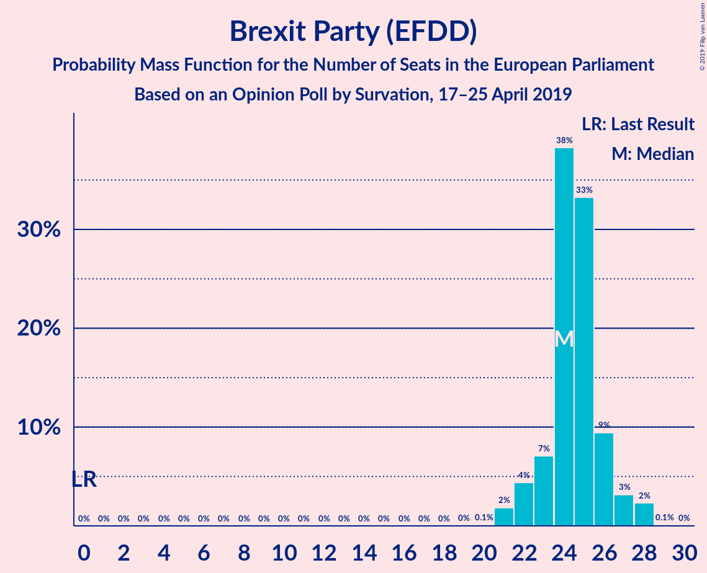
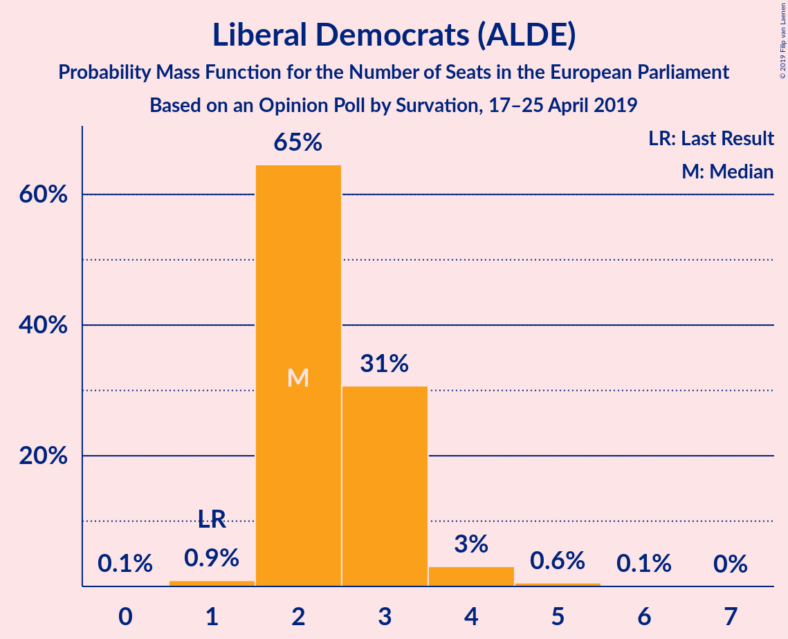
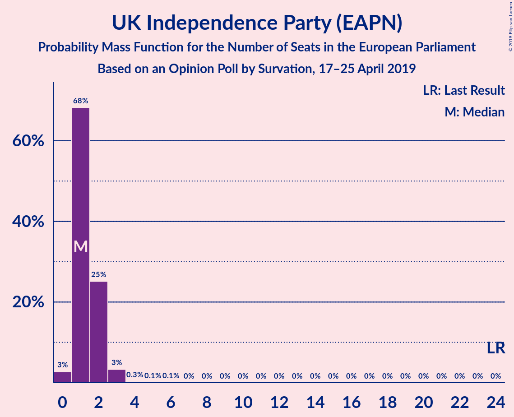
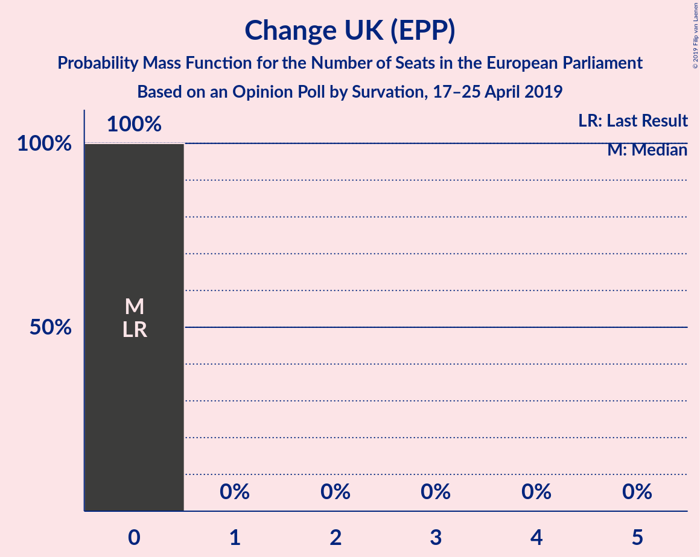
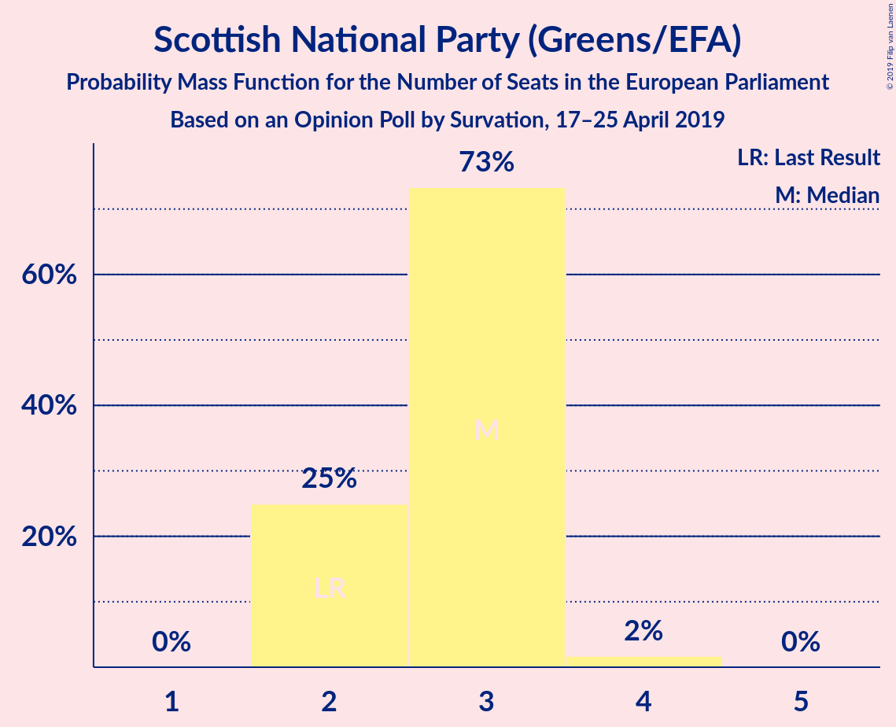
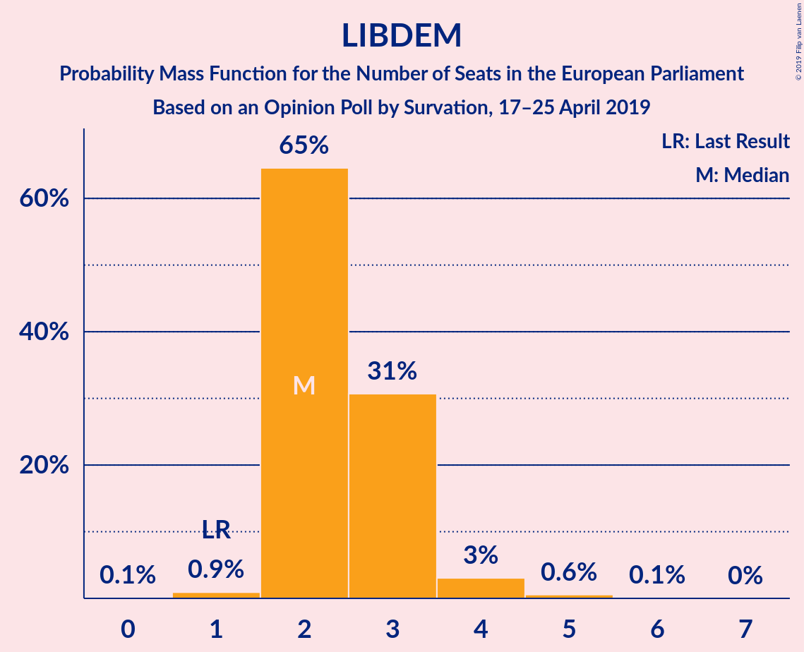
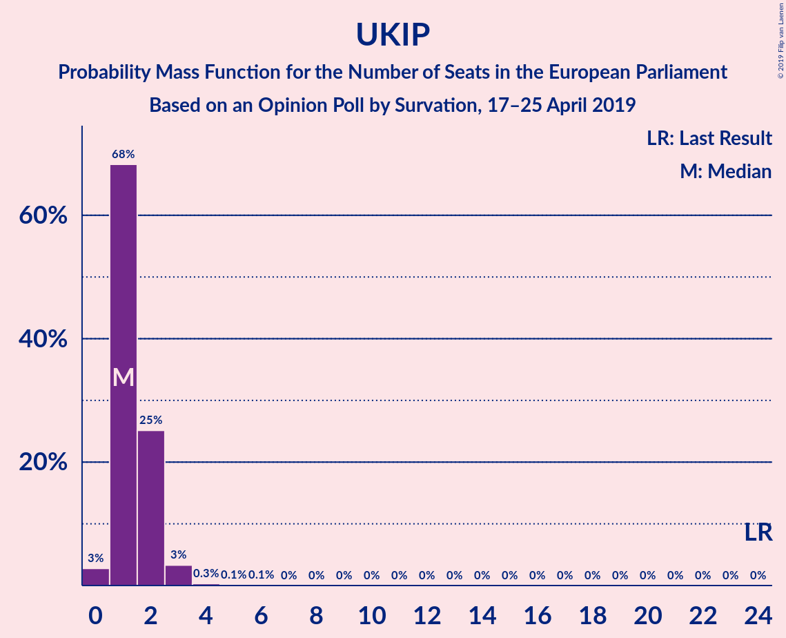

# Opinion Poll by Survation, 17–25 April 2019

<a href="#voting-intentions">Voting Intentions</a> | <a href="#seats">Seats</a> | <a href="#coalitions">Coalitions</a> | <a href="#technical-information">Technical Information</a>

## Voting Intentions

### Confidence Intervals

| Party | Last Result | Poll Result | 80% Confidence Interval | 90% Confidence Interval | 95% Confidence Interval | 99% Confidence Interval |
|:-----:|:-----------:|:-----------:|:-----------------------:|:-----------------------:|:-----------------------:|:-----------------------:|
| Labour Party (S&D) | 24.4% | 26.7% | 25.5–28.0% |25.1–28.4% |24.8–28.7% |24.2–29.3% |
| Brexit Party (EFDD) | 0.0% | 26.7% | 25.5–28.0% |25.1–28.4% |24.8–28.7% |24.2–29.3% |
| Conservative Party (ECR) | 23.1% | 15.9% | 14.8–16.9% |14.6–17.3% |14.3–17.5% |13.8–18.1% |
| Liberal Democrats (ALDE) | 6.6% | 7.9% | 7.2–8.7% |7.0–9.0% |6.8–9.2% |6.5–9.6% |
| UK Independence Party (EAPN) | 26.6% | 7.0% | 6.3–7.7% |6.1–8.0% |5.9–8.2% |5.6–8.6% |
| Green Party (Greens/EFA) | 6.9% | 4.0% | 3.4–4.6% |3.3–4.8% |3.2–4.9% |3.0–5.2% |
| Change UK (EPP) | 0.0% | 4.0% | 3.4–4.6% |3.3–4.8% |3.2–4.9% |3.0–5.2% |
| Scottish National Party (Greens/EFA) | 2.4% | 3.0% | 2.5–3.5% |2.4–3.7% |2.3–3.8% |2.1–4.1% |
| Plaid Cymru (Greens/EFA) | 0.7% | 1.0% | 0.8–1.4% |0.7–1.5% |0.6–1.6% |0.5–1.7% |

*Note:* The poll result column reflects the actual value used in the calculations. Published results may vary slightly, and in addition be rounded to fewer digits.

## Seats

### Confidence Intervals

| Party | Last Result | Median | 80% Confidence Interval | 90% Confidence Interval | 95% Confidence Interval | 99% Confidence Interval |
|:-----:|:-----------:|:------:|:-----------------------:|:-----------------------:|:-----------------------:|:-----------------------:|
| <a href="#labour-party-(s&d)">Labour Party (S&D)</a> | 20 | 27 | 24–28 |24–28 |23–28 |22–29 |
| <a href="#brexit-party-(efdd)">Brexit Party (EFDD)</a> | 0 | 24 | 23–26 |22–27 |21–27 |21–28 |
| <a href="#conservative-party-(ecr)">Conservative Party (ECR)</a> | 19 | 11 | 10–13 |10–14 |9–14 |9–15 |
| <a href="#liberal-democrats-(alde)">Liberal Democrats (ALDE)</a> | 1 | 2 | 2–3 |2–4 |2–4 |1–5 |
| <a href="#uk-independence-party-(eapn)">UK Independence Party (EAPN)</a> | 24 | 1 | 1–2 |1–3 |0–3 |0–5 |
| <a href="#green-party-(greens/efa)">Green Party (Greens/EFA)</a> | 3 | 0 | 0 |0 |0 |0 |
| <a href="#change-uk-(epp)">Change UK (EPP)</a> | 0 | 0 | 0 |0 |0 |0 |
| <a href="#scottish-national-party-(greens/efa)">Scottish National Party (Greens/EFA)</a> | 2 | 3 | 2–3 |2–3 |2–3 |2–4 |
| <a href="#plaid-cymru-(greens/efa)">Plaid Cymru (Greens/EFA)</a> | 1 | 1 | 1–2 |1–2 |1–2 |0–2 |

### Labour Party (S&D)

*For a full overview of the results for this party, see the [Labour Party (S&D)](party-labourpartysd.html) page.*

| Number of Seats | Probability | Accumulated | Special Marks |
|:---------------:|:-----------:|:-----------:|:-------------:|
| 20 | 0% | 100% | Last Result |
| 21 | 0.1% | 100% |  |
| 22 | 0.5% | 99.9% |  |
| 23 | 2% | 99.4% |  |
| 24 | 9% | 97% |  |
| 25 | 10% | 88% |  |
| 26 | 9% | 78% |  |
| 27 | 33% | 69% | Median |
| 28 | 36% | 36% |  |
| 29 | 0.6% | 0.6% |  |
| 30 | 0% | 0% |  |

### Brexit Party (EFDD)

*For a full overview of the results for this party, see the [Brexit Party (EFDD)](party-brexitpartyefdd.html) page.*

| Number of Seats | Probability | Accumulated | Special Marks |
|:---------------:|:-----------:|:-----------:|:-------------:|
| 0 | 0% | 100% | Last Result |
| 1 | 0% | 100% |  |
| 2 | 0% | 100% |  |
| 3 | 0% | 100% |  |
| 4 | 0% | 100% |  |
| 5 | 0% | 100% |  |
| 6 | 0% | 100% |  |
| 7 | 0% | 100% |  |
| 8 | 0% | 100% |  |
| 9 | 0% | 100% |  |
| 10 | 0% | 100% |  |
| 11 | 0% | 100% |  |
| 12 | 0% | 100% |  |
| 13 | 0% | 100% |  |
| 14 | 0% | 100% |  |
| 15 | 0% | 100% |  |
| 16 | 0% | 100% |  |
| 17 | 0% | 100% |  |
| 18 | 0% | 100% |  |
| 19 | 0% | 100% |  |
| 20 | 0.2% | 100% |  |
| 21 | 3% | 99.8% |  |
| 22 | 3% | 97% |  |
| 23 | 10% | 94% |  |
| 24 | 43% | 84% | Median |
| 25 | 29% | 41% |  |
| 26 | 5% | 11% |  |
| 27 | 5% | 6% |  |
| 28 | 1.1% | 1.3% |  |
| 29 | 0.2% | 0.2% |  |
| 30 | 0% | 0% |  |

### Conservative Party (ECR)

*For a full overview of the results for this party, see the [Conservative Party (ECR)](party-conservativepartyecr.html) page.*

| Number of Seats | Probability | Accumulated | Special Marks |
|:---------------:|:-----------:|:-----------:|:-------------:|
| 9 | 5% | 100% |  |
| 10 | 16% | 95% |  |
| 11 | 61% | 79% | Median |
| 12 | 7% | 18% |  |
| 13 | 6% | 12% |  |
| 14 | 4% | 5% |  |
| 15 | 0.9% | 0.9% |  |
| 16 | 0% | 0% |  |
| 17 | 0% | 0% |  |
| 18 | 0% | 0% |  |
| 19 | 0% | 0% | Last Result |

### Liberal Democrats (ALDE)

*For a full overview of the results for this party, see the [Liberal Democrats (ALDE)](party-liberaldemocratsalde.html) page.*

| Number of Seats | Probability | Accumulated | Special Marks |
|:---------------:|:-----------:|:-----------:|:-------------:|
| 0 | 0.1% | 100% |  |
| 1 | 0.5% | 99.9% | Last Result |
| 2 | 58% | 99.4% | Median |
| 3 | 35% | 41% |  |
| 4 | 6% | 7% |  |
| 5 | 0.7% | 0.9% |  |
| 6 | 0.2% | 0.2% |  |
| 7 | 0% | 0% |  |

### UK Independence Party (EAPN)

*For a full overview of the results for this party, see the [UK Independence Party (EAPN)](party-ukindependencepartyeapn.html) page.*

| Number of Seats | Probability | Accumulated | Special Marks |
|:---------------:|:-----------:|:-----------:|:-------------:|
| 0 | 4% | 100% |  |
| 1 | 59% | 96% | Median |
| 2 | 31% | 36% |  |
| 3 | 4% | 5% |  |
| 4 | 0.3% | 0.8% |  |
| 5 | 0.1% | 0.5% |  |
| 6 | 0.4% | 0.4% |  |
| 7 | 0% | 0% |  |
| 8 | 0% | 0% |  |
| 9 | 0% | 0% |  |
| 10 | 0% | 0% |  |
| 11 | 0% | 0% |  |
| 12 | 0% | 0% |  |
| 13 | 0% | 0% |  |
| 14 | 0% | 0% |  |
| 15 | 0% | 0% |  |
| 16 | 0% | 0% |  |
| 17 | 0% | 0% |  |
| 18 | 0% | 0% |  |
| 19 | 0% | 0% |  |
| 20 | 0% | 0% |  |
| 21 | 0% | 0% |  |
| 22 | 0% | 0% |  |
| 23 | 0% | 0% |  |
| 24 | 0% | 0% | Last Result |

### Green Party (Greens/EFA)

*For a full overview of the results for this party, see the [Green Party (Greens/EFA)](party-greenpartygreensefa.html) page.*

| Number of Seats | Probability | Accumulated | Special Marks |
|:---------------:|:-----------:|:-----------:|:-------------:|
| 0 | 100% | 100% | Median |
| 1 | 0% | 0% |  |
| 2 | 0% | 0% |  |
| 3 | 0% | 0% | Last Result |

### Change UK (EPP)

*For a full overview of the results for this party, see the [Change UK (EPP)](party-changeukepp.html) page.*

| Number of Seats | Probability | Accumulated | Special Marks |
|:---------------:|:-----------:|:-----------:|:-------------:|
| 0 | 100% | 100% | Last Result, Median |

### Scottish National Party (Greens/EFA)

*For a full overview of the results for this party, see the [Scottish National Party (Greens/EFA)](party-scottishnationalpartygreensefa.html) page.*

| Number of Seats | Probability | Accumulated | Special Marks |
|:---------------:|:-----------:|:-----------:|:-------------:|
| 2 | 12% | 100% | Last Result |
| 3 | 85% | 88% | Median |
| 4 | 2% | 2% |  |
| 5 | 0% | 0% |  |

### Plaid Cymru (Greens/EFA)

*For a full overview of the results for this party, see the [Plaid Cymru (Greens/EFA)](party-plaidcymrugreensefa.html) page.*

| Number of Seats | Probability | Accumulated | Special Marks |
|:---------------:|:-----------:|:-----------:|:-------------:|
| 0 | 2% | 100% |  |
| 1 | 88% | 98% | Last Result, Median |
| 2 | 10% | 10% |  |
| 3 | 0% | 0% |  |

## Coalitions

### Confidence Intervals

| Coalition | Last Result | Median | Majority? | 80% Confidence Interval | 90% Confidence Interval | 95% Confidence Interval | 99% Confidence Interval |
|:---------:|:-----------:|:------:|:---------:|:-----------------------:|:-----------------------:|:-----------------------:|:-----------------------:|
| Labour Party (S&D) | 20 | 27 | 0% | 24–28 | 24–28 | 23–28 | 22–29 |
| Brexit Party (EFDD) | 0 | 24 | 0% | 23–26 | 22–27 | 21–27 | 21–28 |
| Conservative Party (ECR) | 19 | 11 | 0% | 10–13 | 10–14 | 9–14 | 9–15 |
| Green Party (Greens/EFA) – Scottish National Party (Greens/EFA) – Plaid Cymru (Greens/EFA) | 6 | 4 | 0% | 3–5 | 3–5 | 3–5 | 2–5 |
| Liberal Democrats (ALDE) | 1 | 2 | 0% | 2–3 | 2–4 | 2–4 | 1–5 |
| UK Independence Party (EAPN) | 24 | 1 | 0% | 1–2 | 1–3 | 0–3 | 0–5 |
| Change UK (EPP) | 0 | 0 | 0% | 0 | 0 | 0 | 0 |

### Labour Party (S&D)

| Number of Seats | Probability | Accumulated | Special Marks |
|:---------------:|:-----------:|:-----------:|:-------------:|
| 20 | 0% | 100% | Last Result |
| 21 | 0.1% | 100% |  |
| 22 | 0.5% | 99.9% |  |
| 23 | 2% | 99.4% |  |
| 24 | 9% | 97% |  |
| 25 | 10% | 88% |  |
| 26 | 9% | 78% |  |
| 27 | 33% | 69% | Median |
| 28 | 36% | 36% |  |
| 29 | 0.6% | 0.6% |  |
| 30 | 0% | 0% |  |

### Brexit Party (EFDD)

| Number of Seats | Probability | Accumulated | Special Marks |
|:---------------:|:-----------:|:-----------:|:-------------:|
| 0 | 0% | 100% | Last Result |
| 1 | 0% | 100% |  |
| 2 | 0% | 100% |  |
| 3 | 0% | 100% |  |
| 4 | 0% | 100% |  |
| 5 | 0% | 100% |  |
| 6 | 0% | 100% |  |
| 7 | 0% | 100% |  |
| 8 | 0% | 100% |  |
| 9 | 0% | 100% |  |
| 10 | 0% | 100% |  |
| 11 | 0% | 100% |  |
| 12 | 0% | 100% |  |
| 13 | 0% | 100% |  |
| 14 | 0% | 100% |  |
| 15 | 0% | 100% |  |
| 16 | 0% | 100% |  |
| 17 | 0% | 100% |  |
| 18 | 0% | 100% |  |
| 19 | 0% | 100% |  |
| 20 | 0.2% | 100% |  |
| 21 | 3% | 99.8% |  |
| 22 | 3% | 97% |  |
| 23 | 10% | 94% |  |
| 24 | 43% | 84% | Median |
| 25 | 29% | 41% |  |
| 26 | 5% | 11% |  |
| 27 | 5% | 6% |  |
| 28 | 1.1% | 1.3% |  |
| 29 | 0.2% | 0.2% |  |
| 30 | 0% | 0% |  |

### Conservative Party (ECR)

| Number of Seats | Probability | Accumulated | Special Marks |
|:---------------:|:-----------:|:-----------:|:-------------:|
| 9 | 5% | 100% |  |
| 10 | 16% | 95% |  |
| 11 | 61% | 79% | Median |
| 12 | 7% | 18% |  |
| 13 | 6% | 12% |  |
| 14 | 4% | 5% |  |
| 15 | 0.9% | 0.9% |  |
| 16 | 0% | 0% |  |
| 17 | 0% | 0% |  |
| 18 | 0% | 0% |  |
| 19 | 0% | 0% | Last Result |

### Green Party (Greens/EFA) – Scottish National Party (Greens/EFA) – Plaid Cymru (Greens/EFA)

| Number of Seats | Probability | Accumulated | Special Marks |
|:---------------:|:-----------:|:-----------:|:-------------:|
| 2 | 0.7% | 100% |  |
| 3 | 11% | 99.3% |  |
| 4 | 78% | 88% | Median |
| 5 | 10% | 11% |  |
| 6 | 0.3% | 0.3% | Last Result |
| 7 | 0% | 0% |  |

### Liberal Democrats (ALDE)

| Number of Seats | Probability | Accumulated | Special Marks |
|:---------------:|:-----------:|:-----------:|:-------------:|
| 0 | 0.1% | 100% |  |
| 1 | 0.5% | 99.9% | Last Result |
| 2 | 58% | 99.4% | Median |
| 3 | 35% | 41% |  |
| 4 | 6% | 7% |  |
| 5 | 0.7% | 0.9% |  |
| 6 | 0.2% | 0.2% |  |
| 7 | 0% | 0% |  |

### UK Independence Party (EAPN)

| Number of Seats | Probability | Accumulated | Special Marks |
|:---------------:|:-----------:|:-----------:|:-------------:|
| 0 | 4% | 100% |  |
| 1 | 59% | 96% | Median |
| 2 | 31% | 36% |  |
| 3 | 4% | 5% |  |
| 4 | 0.3% | 0.8% |  |
| 5 | 0.1% | 0.5% |  |
| 6 | 0.4% | 0.4% |  |
| 7 | 0% | 0% |  |
| 8 | 0% | 0% |  |
| 9 | 0% | 0% |  |
| 10 | 0% | 0% |  |
| 11 | 0% | 0% |  |
| 12 | 0% | 0% |  |
| 13 | 0% | 0% |  |
| 14 | 0% | 0% |  |
| 15 | 0% | 0% |  |
| 16 | 0% | 0% |  |
| 17 | 0% | 0% |  |
| 18 | 0% | 0% |  |
| 19 | 0% | 0% |  |
| 20 | 0% | 0% |  |
| 21 | 0% | 0% |  |
| 22 | 0% | 0% |  |
| 23 | 0% | 0% |  |
| 24 | 0% | 0% | Last Result |

### Change UK (EPP)

| Number of Seats | Probability | Accumulated | Special Marks |
|:---------------:|:-----------:|:-----------:|:-------------:|
| 0 | 100% | 100% | Last Result, Median |

## Technical Information

### Opinion Poll

+ **Polling firm:** Survation
+ **Commissioner(s):** —
+ **Fieldwork period:** 17–25 April 2019

### Calculations

+ **Sample size:** 1999
+ **Simulations done:** 131,072
+ **Error estimate:** 1.75%

