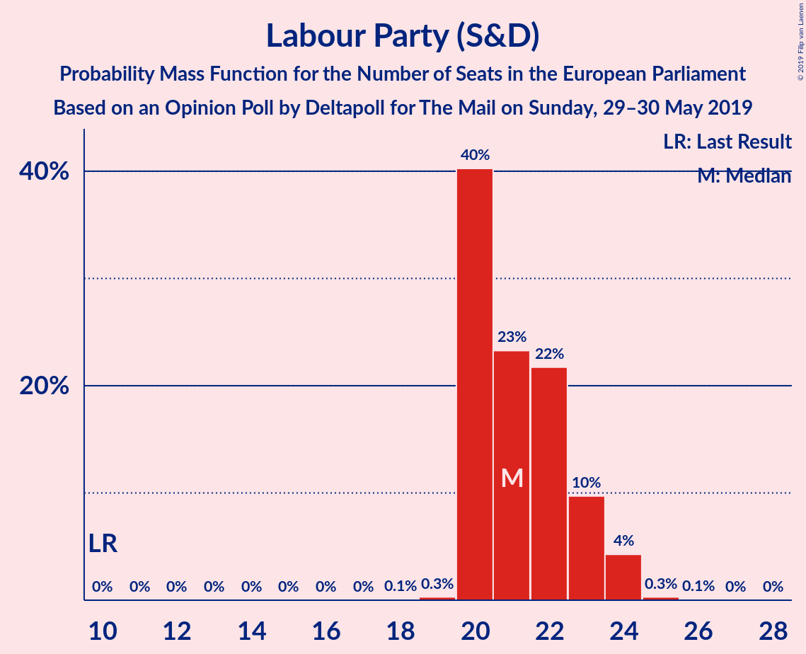
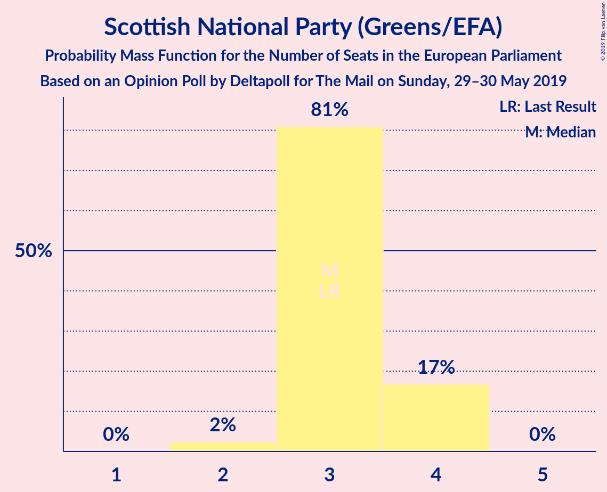
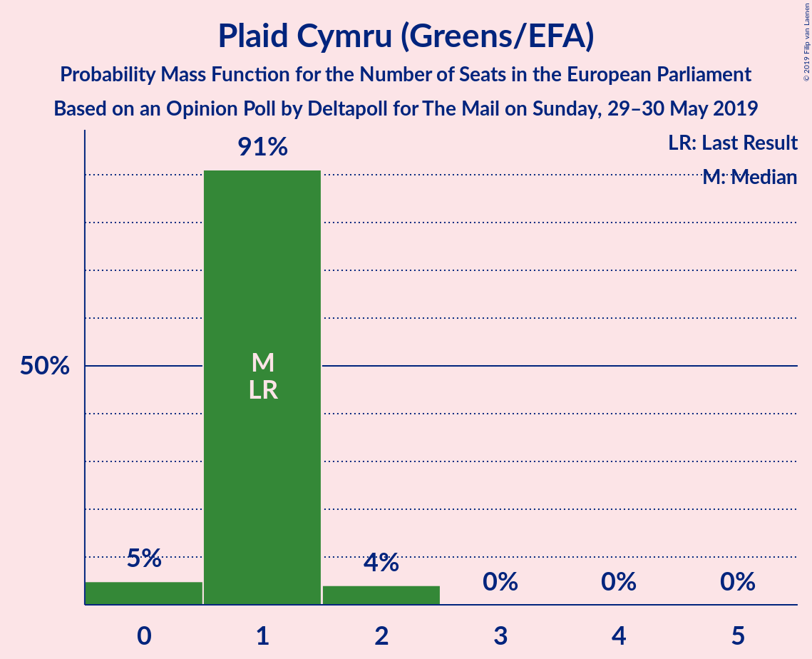
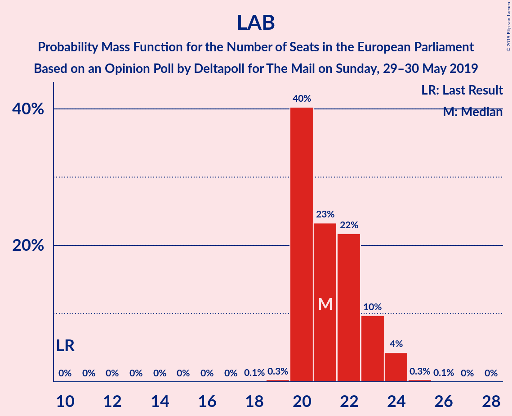
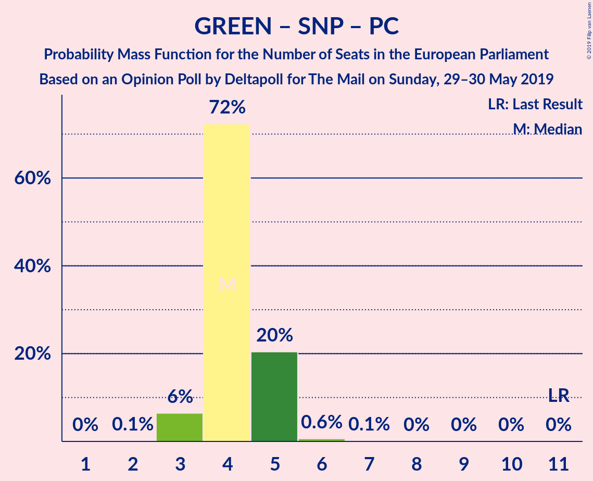

# Opinion Poll by Deltapoll for The Mail on Sunday, 29–30 May 2019

<a href="#voting-intentions">Voting Intentions</a> | <a href="#seats">Seats</a> | <a href="#coalitions">Coalitions</a> | <a href="#technical-information">Technical Information</a>

## Voting Intentions

### Confidence Intervals

| Party | Last Result | Poll Result | 80% Confidence Interval | 90% Confidence Interval | 95% Confidence Interval | 99% Confidence Interval |
|:-----:|:-----------:|:-----------:|:-----------------------:|:-----------------------:|:-----------------------:|:-----------------------:|
| Labour Party (S&D) | 13.7% | 25.5% | 24.4–26.6% |24.1–27.0% |23.8–27.3% |23.3–27.8% |
| Brexit Party (NI) | 30.5% | 23.5% | 22.4–24.6% |22.1–25.0% |21.9–25.3% |21.4–25.8% |
| Conservative Party (ECR) | 8.8% | 19.6% | 18.6–20.7% |18.3–21.0% |18.1–21.2% |17.6–21.7% |
| Liberal Democrats (RE) | 19.6% | 15.7% | 14.8–16.7% |14.5–16.9% |14.3–17.2% |13.9–17.7% |
| Green Party (Greens/EFA) | 11.8% | 4.9% | 4.4–5.5% |4.2–5.7% |4.1–5.8% |3.9–6.1% |
| Scottish National Party (Greens/EFA) | 3.5% | 3.9% | 3.5–4.5% |3.3–4.6% |3.2–4.8% |3.0–5.0% |
| Change UK (RE) | 3.3% | 3.9% | 3.5–4.5% |3.3–4.6% |3.2–4.8% |3.0–5.0% |
| Plaid Cymru (Greens/EFA) | 1.0% | 1.0% | 0.8–1.3% |0.7–1.4% |0.7–1.5% |0.6–1.6% |
| UK Independence Party (ID) | 3.2% | 1.0% | 0.8–1.3% |0.7–1.4% |0.7–1.5% |0.6–1.6% |

*Note:* The poll result column reflects the actual value used in the calculations. Published results may vary slightly, and in addition be rounded to fewer digits.

## Seats

### Confidence Intervals

| Party | Last Result | Median | 80% Confidence Interval | 90% Confidence Interval | 95% Confidence Interval | 99% Confidence Interval |
|:-----:|:-----------:|:------:|:-----------------------:|:-----------------------:|:-----------------------:|:-----------------------:|
| <a href="#labour-party-(s&d)">Labour Party (S&D)</a> | 10 | 20 | 20–22 |20–22 |20–24 |19–24 |
| <a href="#brexit-party-(ni)">Brexit Party (NI)</a> | 29 | 20 | 19–21 |19–21 |18–21 |18–23 |
| <a href="#conservative-party-(ecr)">Conservative Party (ECR)</a> | 4 | 15 | 14–16 |12–16 |12–16 |11–16 |
| <a href="#liberal-democrats-(re)">Liberal Democrats (RE)</a> | 16 | 10 | 9–11 |9–12 |9–12 |9–13 |
| <a href="#green-party-(greens/efa)">Green Party (Greens/EFA)</a> | 7 | 0 | 0 |0 |0 |0–1 |
| <a href="#scottish-national-party-(greens/efa)">Scottish National Party (Greens/EFA)</a> | 3 | 3 | 3 |3–4 |3–4 |2–4 |
| <a href="#change-uk-(re)">Change UK (RE)</a> | 0 | 0 | 0 |0 |0 |0 |
| <a href="#plaid-cymru-(greens/efa)">Plaid Cymru (Greens/EFA)</a> | 1 | 1 | 1 |1 |1 |0–2 |
| <a href="#uk-independence-party-(id)">UK Independence Party (ID)</a> | 0 | 0 | 0 |0 |0 |0 |

### Labour Party (S&D)

*For a full overview of the results for this party, see the [Labour Party (S&D)](party-labourpartysd.html) page.*

| Number of Seats | Probability | Accumulated | Special Marks |
|:---------------:|:-----------:|:-----------:|:-------------:|
| 10 | 0% | 100% | Last Result |
| 11 | 0% | 100% |  |
| 12 | 0% | 100% |  |
| 13 | 0% | 100% |  |
| 14 | 0% | 100% |  |
| 15 | 0% | 100% |  |
| 16 | 0% | 100% |  |
| 17 | 0% | 100% |  |
| 18 | 0% | 100% |  |
| 19 | 0.5% | 100% |  |
| 20 | 52% | 99.4% | Median |
| 21 | 28% | 47% |  |
| 22 | 14% | 19% |  |
| 23 | 2% | 5% |  |
| 24 | 3% | 3% |  |
| 25 | 0.1% | 0.1% |  |
| 26 | 0% | 0.1% |  |
| 27 | 0% | 0% |  |

### Brexit Party (NI)

*For a full overview of the results for this party, see the [Brexit Party (NI)](party-brexitpartyni.html) page.*

| Number of Seats | Probability | Accumulated | Special Marks |
|:---------------:|:-----------:|:-----------:|:-------------:|
| 17 | 0.4% | 100% |  |
| 18 | 4% | 99.6% |  |
| 19 | 22% | 95% |  |
| 20 | 38% | 73% | Median |
| 21 | 33% | 35% |  |
| 22 | 2% | 2% |  |
| 23 | 0.4% | 0.5% |  |
| 24 | 0% | 0.1% |  |
| 25 | 0% | 0% |  |
| 26 | 0% | 0% |  |
| 27 | 0% | 0% |  |
| 28 | 0% | 0% |  |
| 29 | 0% | 0% | Last Result |

### Conservative Party (ECR)

*For a full overview of the results for this party, see the [Conservative Party (ECR)](party-conservativepartyecr.html) page.*

| Number of Seats | Probability | Accumulated | Special Marks |
|:---------------:|:-----------:|:-----------:|:-------------:|
| 4 | 0% | 100% | Last Result |
| 5 | 0% | 100% |  |
| 6 | 0% | 100% |  |
| 7 | 0% | 100% |  |
| 8 | 0% | 100% |  |
| 9 | 0% | 100% |  |
| 10 | 0% | 100% |  |
| 11 | 0.8% | 100% |  |
| 12 | 5% | 99.2% |  |
| 13 | 3% | 94% |  |
| 14 | 4% | 91% |  |
| 15 | 46% | 88% | Median |
| 16 | 41% | 41% |  |
| 17 | 0.1% | 0.2% |  |
| 18 | 0.1% | 0.1% |  |
| 19 | 0% | 0% |  |

### Liberal Democrats (RE)

*For a full overview of the results for this party, see the [Liberal Democrats (RE)](party-liberaldemocratsre.html) page.*

| Number of Seats | Probability | Accumulated | Special Marks |
|:---------------:|:-----------:|:-----------:|:-------------:|
| 7 | 0.1% | 100% |  |
| 8 | 0% | 99.9% |  |
| 9 | 26% | 99.9% |  |
| 10 | 60% | 74% | Median |
| 11 | 5% | 14% |  |
| 12 | 7% | 10% |  |
| 13 | 2% | 2% |  |
| 14 | 0.4% | 0.4% |  |
| 15 | 0% | 0% |  |
| 16 | 0% | 0% | Last Result |

### Green Party (Greens/EFA)

*For a full overview of the results for this party, see the [Green Party (Greens/EFA)](party-greenpartygreensefa.html) page.*

| Number of Seats | Probability | Accumulated | Special Marks |
|:---------------:|:-----------:|:-----------:|:-------------:|
| 0 | 98.7% | 100% | Median |
| 1 | 1.1% | 1.3% |  |
| 2 | 0.2% | 0.2% |  |
| 3 | 0% | 0% |  |
| 4 | 0% | 0% |  |
| 5 | 0% | 0% |  |
| 6 | 0% | 0% |  |
| 7 | 0% | 0% | Last Result |

### Scottish National Party (Greens/EFA)

*For a full overview of the results for this party, see the [Scottish National Party (Greens/EFA)](party-scottishnationalpartygreensefa.html) page.*

| Number of Seats | Probability | Accumulated | Special Marks |
|:---------------:|:-----------:|:-----------:|:-------------:|
| 2 | 1.0% | 100% |  |
| 3 | 94% | 99.0% | Last Result, Median |
| 4 | 6% | 6% |  |
| 5 | 0% | 0% |  |

### Change UK (RE)

*For a full overview of the results for this party, see the [Change UK (RE)](party-changeukre.html) page.*

| Number of Seats | Probability | Accumulated | Special Marks |
|:---------------:|:-----------:|:-----------:|:-------------:|
| 0 | 100% | 100% | Last Result, Median |

### Plaid Cymru (Greens/EFA)

*For a full overview of the results for this party, see the [Plaid Cymru (Greens/EFA)](party-plaidcymrugreensefa.html) page.*

| Number of Seats | Probability | Accumulated | Special Marks |
|:---------------:|:-----------:|:-----------:|:-------------:|
| 0 | 2% | 100% |  |
| 1 | 97% | 98% | Last Result, Median |
| 2 | 1.1% | 1.1% |  |
| 3 | 0% | 0% |  |

### UK Independence Party (ID)

*For a full overview of the results for this party, see the [UK Independence Party (ID)](party-ukindependencepartyid.html) page.*

| Number of Seats | Probability | Accumulated | Special Marks |
|:---------------:|:-----------:|:-----------:|:-------------:|
| 0 | 100% | 100% | Last Result, Median |

## Coalitions

### Confidence Intervals

| Coalition | Last Result | Median | Majority? | 80% Confidence Interval | 90% Confidence Interval | 95% Confidence Interval | 99% Confidence Interval |
|:---------:|:-----------:|:------:|:---------:|:-----------------------:|:-----------------------:|:-----------------------:|:-----------------------:|
| Labour Party (S&D) | 10 | 20 | 0% | 20–22 | 20–22 | 20–24 | 19–24 |
| Brexit Party (NI) | 29 | 20 | 0% | 19–21 | 19–21 | 18–21 | 18–23 |
| Conservative Party (ECR) | 4 | 15 | 0% | 14–16 | 12–16 | 12–16 | 11–16 |
| Liberal Democrats (RE) – Change UK (RE) | 16 | 10 | 0% | 9–11 | 9–12 | 9–12 | 9–13 |
| Green Party (Greens/EFA) – Scottish National Party (Greens/EFA) – Plaid Cymru (Greens/EFA) | 11 | 4 | 0% | 4 | 4–5 | 4–5 | 3–5 |
| UK Independence Party (ID) | 0 | 0 | 0% | 0 | 0 | 0 | 0 |

### Labour Party (S&D)

| Number of Seats | Probability | Accumulated | Special Marks |
|:---------------:|:-----------:|:-----------:|:-------------:|
| 10 | 0% | 100% | Last Result |
| 11 | 0% | 100% |  |
| 12 | 0% | 100% |  |
| 13 | 0% | 100% |  |
| 14 | 0% | 100% |  |
| 15 | 0% | 100% |  |
| 16 | 0% | 100% |  |
| 17 | 0% | 100% |  |
| 18 | 0% | 100% |  |
| 19 | 0.5% | 100% |  |
| 20 | 52% | 99.4% | Median |
| 21 | 28% | 47% |  |
| 22 | 14% | 19% |  |
| 23 | 2% | 5% |  |
| 24 | 3% | 3% |  |
| 25 | 0.1% | 0.1% |  |
| 26 | 0% | 0.1% |  |
| 27 | 0% | 0% |  |

### Brexit Party (NI)

| Number of Seats | Probability | Accumulated | Special Marks |
|:---------------:|:-----------:|:-----------:|:-------------:|
| 17 | 0.4% | 100% |  |
| 18 | 4% | 99.6% |  |
| 19 | 22% | 95% |  |
| 20 | 38% | 73% | Median |
| 21 | 33% | 35% |  |
| 22 | 2% | 2% |  |
| 23 | 0.4% | 0.5% |  |
| 24 | 0% | 0.1% |  |
| 25 | 0% | 0% |  |
| 26 | 0% | 0% |  |
| 27 | 0% | 0% |  |
| 28 | 0% | 0% |  |
| 29 | 0% | 0% | Last Result |

### Conservative Party (ECR)

| Number of Seats | Probability | Accumulated | Special Marks |
|:---------------:|:-----------:|:-----------:|:-------------:|
| 4 | 0% | 100% | Last Result |
| 5 | 0% | 100% |  |
| 6 | 0% | 100% |  |
| 7 | 0% | 100% |  |
| 8 | 0% | 100% |  |
| 9 | 0% | 100% |  |
| 10 | 0% | 100% |  |
| 11 | 0.8% | 100% |  |
| 12 | 5% | 99.2% |  |
| 13 | 3% | 94% |  |
| 14 | 4% | 91% |  |
| 15 | 46% | 88% | Median |
| 16 | 41% | 41% |  |
| 17 | 0.1% | 0.2% |  |
| 18 | 0.1% | 0.1% |  |
| 19 | 0% | 0% |  |

### Liberal Democrats (RE) – Change UK (RE)

| Number of Seats | Probability | Accumulated | Special Marks |
|:---------------:|:-----------:|:-----------:|:-------------:|
| 7 | 0.1% | 100% |  |
| 8 | 0% | 99.9% |  |
| 9 | 26% | 99.9% |  |
| 10 | 60% | 74% | Median |
| 11 | 5% | 14% |  |
| 12 | 7% | 10% |  |
| 13 | 2% | 2% |  |
| 14 | 0.4% | 0.4% |  |
| 15 | 0% | 0% |  |
| 16 | 0% | 0% | Last Result |

### Green Party (Greens/EFA) – Scottish National Party (Greens/EFA) – Plaid Cymru (Greens/EFA)

| Number of Seats | Probability | Accumulated | Special Marks |
|:---------------:|:-----------:|:-----------:|:-------------:|
| 3 | 2% | 100% |  |
| 4 | 90% | 98% | Median |
| 5 | 7% | 7% |  |
| 6 | 0.1% | 0.2% |  |
| 7 | 0.1% | 0.1% |  |
| 8 | 0% | 0% |  |
| 9 | 0% | 0% |  |
| 10 | 0% | 0% |  |
| 11 | 0% | 0% | Last Result |

### UK Independence Party (ID)

| Number of Seats | Probability | Accumulated | Special Marks |
|:---------------:|:-----------:|:-----------:|:-------------:|
| 0 | 100% | 100% | Last Result, Median |

## Technical Information

### Opinion Poll

+ **Polling firm:** Deltapoll
+ **Commissioner(s):** The Mail on Sunday
+ **Fieldwork period:** 29–30 May 2019

### Calculations

+ **Sample size:** 2449
+ **Simulations done:** 131,072
+ **Error estimate:** 0.94%

