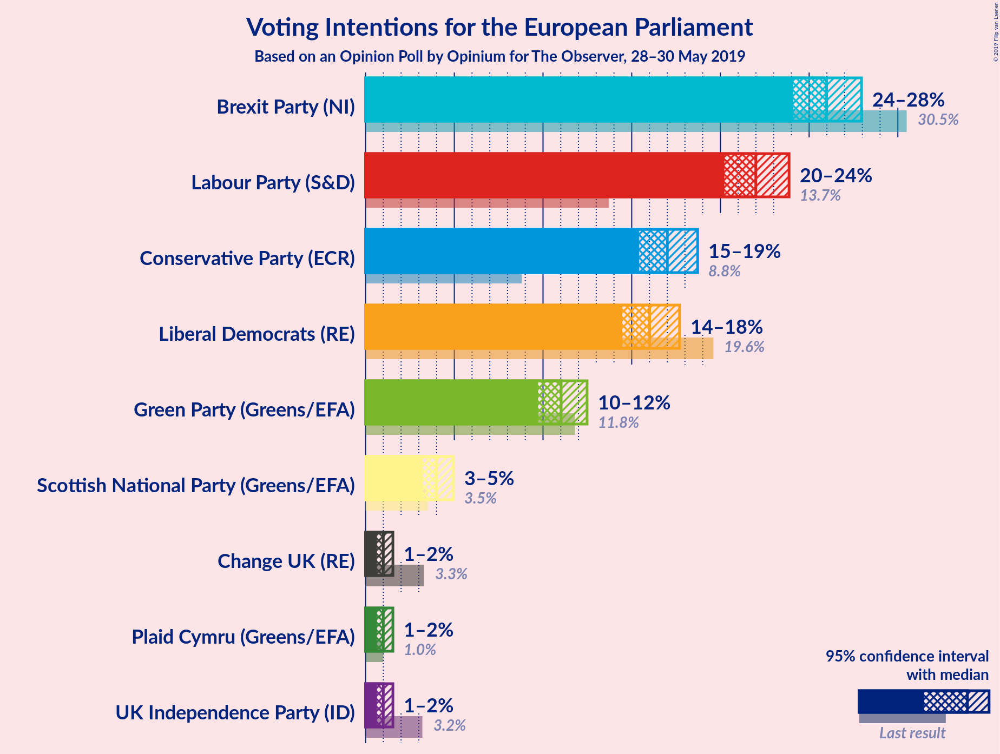
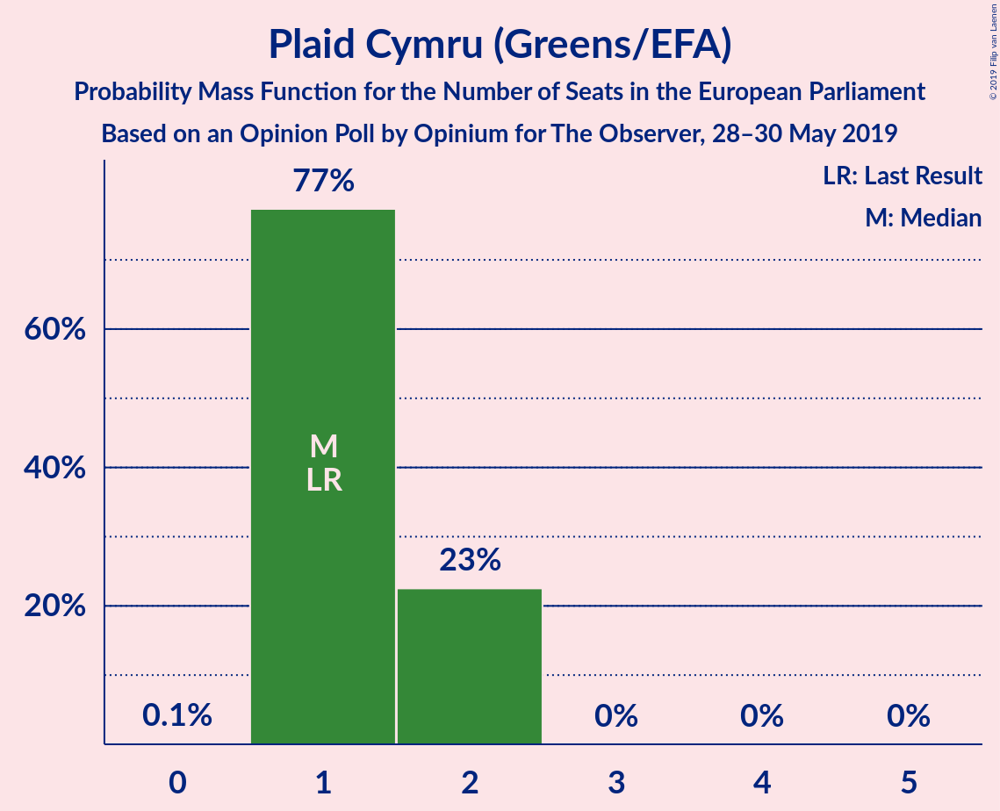
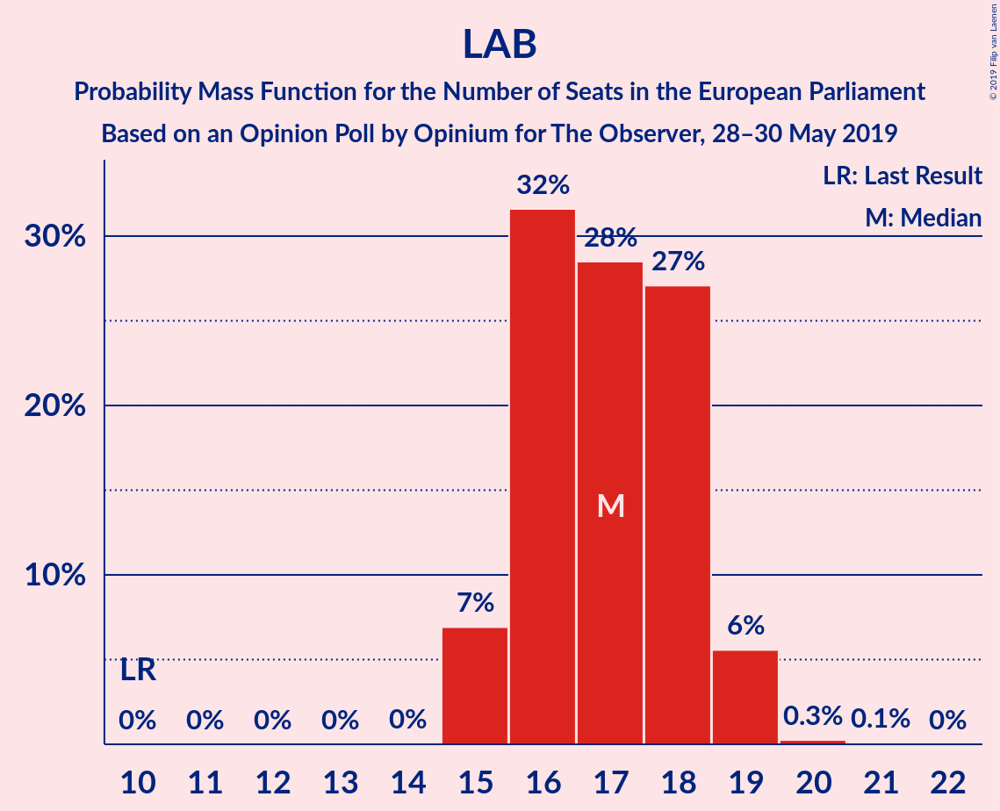

# Opinion Poll by Opinium for The Observer, 28–30 May 2019

<a href="#voting-intentions">Voting Intentions</a> | <a href="#seats">Seats</a> | <a href="#coalitions">Coalitions</a> | <a href="#technical-information">Technical Information</a>

## Voting Intentions

### Confidence Intervals

| Party | Last Result | Poll Result | 80% Confidence Interval | 90% Confidence Interval | 95% Confidence Interval | 99% Confidence Interval |
|:-----:|:-----------:|:-----------:|:-----------------------:|:-----------------------:|:-----------------------:|:-----------------------:|
| Brexit Party (NI) | 30.5% | 26.0% | 24.8–27.3% |24.4–27.6% |24.1–28.0% |23.5–28.6% |
| Labour Party (S&D) | 13.7% | 22.0% | 20.8–23.2% |20.5–23.6% |20.2–23.9% |19.7–24.5% |
| Conservative Party (ECR) | 8.8% | 17.0% | 16.0–18.1% |15.7–18.4% |15.4–18.7% |14.9–19.3% |
| Liberal Democrats (RE) | 19.6% | 16.0% | 15.0–17.1% |14.7–17.4% |14.5–17.7% |14.0–18.2% |
| Green Party (Greens/EFA) | 11.8% | 11.0% | 10.2–12.0% |9.9–12.2% |9.7–12.5% |9.3–12.9% |
| Scottish National Party (Greens/EFA) | 3.5% | 4.0% | 3.5–4.6% |3.3–4.8% |3.2–5.0% |3.0–5.3% |
| Plaid Cymru (Greens/EFA) | 1.0% | 1.0% | 0.8–1.4% |0.7–1.4% |0.6–1.5% |0.5–1.7% |
| UK Independence Party (ID) | 3.2% | 1.0% | 0.8–1.4% |0.7–1.4% |0.6–1.5% |0.5–1.7% |
| Change UK (RE) | 3.3% | 1.0% | 0.8–1.4% |0.7–1.4% |0.6–1.5% |0.5–1.7% |

*Note:* The poll result column reflects the actual value used in the calculations. Published results may vary slightly, and in addition be rounded to fewer digits.

## Seats

### Confidence Intervals

| Party | Last Result | Median | 80% Confidence Interval | 90% Confidence Interval | 95% Confidence Interval | 99% Confidence Interval |
|:-----:|:-----------:|:------:|:-----------------------:|:-----------------------:|:-----------------------:|:-----------------------:|
| <a href="#brexit-party-(ni)">Brexit Party (NI)</a> | 29 | 23 | 22–25 |20–25 |19–25 |18–25 |
| <a href="#labour-party-(s&d)">Labour Party (S&D)</a> | 10 | 17 | 16–17 |15–18 |15–18 |15–20 |
| <a href="#conservative-party-(ecr)">Conservative Party (ECR)</a> | 4 | 10 | 10–13 |10–14 |10–14 |10–14 |
| <a href="#liberal-democrats-(re)">Liberal Democrats (RE)</a> | 16 | 10 | 9–10 |9–11 |9–12 |8–13 |
| <a href="#green-party-(greens/efa)">Green Party (Greens/EFA)</a> | 7 | 5 | 5–6 |5–7 |4–7 |3–7 |
| <a href="#scottish-national-party-(greens/efa)">Scottish National Party (Greens/EFA)</a> | 3 | 3 | 3 |2–3 |2–4 |2–4 |
| <a href="#plaid-cymru-(greens/efa)">Plaid Cymru (Greens/EFA)</a> | 1 | 2 | 1–2 |1–2 |1–2 |1–2 |
| <a href="#uk-independence-party-(id)">UK Independence Party (ID)</a> | 0 | 0 | 0 |0 |0 |0 |
| <a href="#change-uk-(re)">Change UK (RE)</a> | 0 | 0 | 0 |0 |0 |0 |

### Brexit Party (NI)

*For a full overview of the results for this party, see the [Brexit Party (NI)](party-brexitpartyni.html) page.*

| Number of Seats | Probability | Accumulated | Special Marks |
|:---------------:|:-----------:|:-----------:|:-------------:|
| 18 | 2% | 100% |  |
| 19 | 2% | 98% |  |
| 20 | 4% | 96% |  |
| 21 | 0.8% | 92% |  |
| 22 | 30% | 91% |  |
| 23 | 15% | 62% | Median |
| 24 | 34% | 47% |  |
| 25 | 13% | 13% |  |
| 26 | 0% | 0% |  |
| 27 | 0% | 0% |  |
| 28 | 0% | 0% |  |
| 29 | 0% | 0% | Last Result |

### Labour Party (S&D)

*For a full overview of the results for this party, see the [Labour Party (S&D)](party-labourpartysd.html) page.*

| Number of Seats | Probability | Accumulated | Special Marks |
|:---------------:|:-----------:|:-----------:|:-------------:|
| 10 | 0% | 100% | Last Result |
| 11 | 0% | 100% |  |
| 12 | 0% | 100% |  |
| 13 | 0% | 100% |  |
| 14 | 0% | 100% |  |
| 15 | 6% | 100% |  |
| 16 | 35% | 94% |  |
| 17 | 51% | 59% | Median |
| 18 | 6% | 8% |  |
| 19 | 1.0% | 2% |  |
| 20 | 0.3% | 0.6% |  |
| 21 | 0.3% | 0.3% |  |
| 22 | 0% | 0% |  |

### Conservative Party (ECR)

*For a full overview of the results for this party, see the [Conservative Party (ECR)](party-conservativepartyecr.html) page.*

| Number of Seats | Probability | Accumulated | Special Marks |
|:---------------:|:-----------:|:-----------:|:-------------:|
| 4 | 0% | 100% | Last Result |
| 5 | 0% | 100% |  |
| 6 | 0% | 100% |  |
| 7 | 0% | 100% |  |
| 8 | 0% | 100% |  |
| 9 | 0.3% | 100% |  |
| 10 | 86% | 99.7% | Median |
| 11 | 2% | 14% |  |
| 12 | 0.4% | 12% |  |
| 13 | 2% | 11% |  |
| 14 | 9% | 9% |  |
| 15 | 0.2% | 0.3% |  |
| 16 | 0% | 0% |  |

### Liberal Democrats (RE)

*For a full overview of the results for this party, see the [Liberal Democrats (RE)](party-liberaldemocratsre.html) page.*

| Number of Seats | Probability | Accumulated | Special Marks |
|:---------------:|:-----------:|:-----------:|:-------------:|
| 8 | 1.5% | 100% |  |
| 9 | 19% | 98% |  |
| 10 | 71% | 80% | Median |
| 11 | 5% | 9% |  |
| 12 | 2% | 4% |  |
| 13 | 2% | 2% |  |
| 14 | 0.1% | 0.2% |  |
| 15 | 0% | 0% |  |
| 16 | 0% | 0% | Last Result |

### Green Party (Greens/EFA)

*For a full overview of the results for this party, see the [Green Party (Greens/EFA)](party-greenpartygreensefa.html) page.*

| Number of Seats | Probability | Accumulated | Special Marks |
|:---------------:|:-----------:|:-----------:|:-------------:|
| 3 | 0.7% | 100% |  |
| 4 | 4% | 99.2% |  |
| 5 | 46% | 95% | Median |
| 6 | 42% | 49% |  |
| 7 | 7% | 7% | Last Result |
| 8 | 0% | 0.1% |  |
| 9 | 0% | 0% |  |

### Scottish National Party (Greens/EFA)

*For a full overview of the results for this party, see the [Scottish National Party (Greens/EFA)](party-scottishnationalpartygreensefa.html) page.*

| Number of Seats | Probability | Accumulated | Special Marks |
|:---------------:|:-----------:|:-----------:|:-------------:|
| 2 | 7% | 100% |  |
| 3 | 90% | 93% | Last Result, Median |
| 4 | 3% | 3% |  |
| 5 | 0% | 0% |  |

### Plaid Cymru (Greens/EFA)

*For a full overview of the results for this party, see the [Plaid Cymru (Greens/EFA)](party-plaidcymrugreensefa.html) page.*

| Number of Seats | Probability | Accumulated | Special Marks |
|:---------------:|:-----------:|:-----------:|:-------------:|
| 0 | 0.2% | 100% |  |
| 1 | 49% | 99.8% | Last Result |
| 2 | 51% | 51% | Median |
| 3 | 0% | 0% |  |

### UK Independence Party (ID)

*For a full overview of the results for this party, see the [UK Independence Party (ID)](party-ukindependencepartyid.html) page.*

| Number of Seats | Probability | Accumulated | Special Marks |
|:---------------:|:-----------:|:-----------:|:-------------:|
| 0 | 100% | 100% | Last Result, Median |

### Change UK (RE)

*For a full overview of the results for this party, see the [Change UK (RE)](party-changeukre.html) page.*

| Number of Seats | Probability | Accumulated | Special Marks |
|:---------------:|:-----------:|:-----------:|:-------------:|
| 0 | 100% | 100% | Last Result, Median |

## Coalitions

### Confidence Intervals

| Coalition | Last Result | Median | Majority? | 80% Confidence Interval | 90% Confidence Interval | 95% Confidence Interval | 99% Confidence Interval |
|:---------:|:-----------:|:------:|:---------:|:-----------------------:|:-----------------------:|:-----------------------:|:-----------------------:|
| Brexit Party (NI) | 29 | 23 | 0% | 22–25 | 20–25 | 19–25 | 18–25 |
| Labour Party (S&D) | 10 | 17 | 0% | 16–17 | 15–18 | 15–18 | 15–20 |
| Conservative Party (ECR) | 4 | 10 | 0% | 10–13 | 10–14 | 10–14 | 10–14 |
| Liberal Democrats (RE) – Change UK (RE) | 16 | 10 | 0% | 9–10 | 9–11 | 9–12 | 8–13 |
| Green Party (Greens/EFA) – Scottish National Party (Greens/EFA) – Plaid Cymru (Greens/EFA) | 11 | 10 | 0% | 8–11 | 8–11 | 8–12 | 8–12 |
| UK Independence Party (ID) | 0 | 0 | 0% | 0 | 0 | 0 | 0 |

### Brexit Party (NI)

| Number of Seats | Probability | Accumulated | Special Marks |
|:---------------:|:-----------:|:-----------:|:-------------:|
| 18 | 2% | 100% |  |
| 19 | 2% | 98% |  |
| 20 | 4% | 96% |  |
| 21 | 0.8% | 92% |  |
| 22 | 30% | 91% |  |
| 23 | 15% | 62% | Median |
| 24 | 34% | 47% |  |
| 25 | 13% | 13% |  |
| 26 | 0% | 0% |  |
| 27 | 0% | 0% |  |
| 28 | 0% | 0% |  |
| 29 | 0% | 0% | Last Result |

### Labour Party (S&D)

| Number of Seats | Probability | Accumulated | Special Marks |
|:---------------:|:-----------:|:-----------:|:-------------:|
| 10 | 0% | 100% | Last Result |
| 11 | 0% | 100% |  |
| 12 | 0% | 100% |  |
| 13 | 0% | 100% |  |
| 14 | 0% | 100% |  |
| 15 | 6% | 100% |  |
| 16 | 35% | 94% |  |
| 17 | 51% | 59% | Median |
| 18 | 6% | 8% |  |
| 19 | 1.0% | 2% |  |
| 20 | 0.3% | 0.6% |  |
| 21 | 0.3% | 0.3% |  |
| 22 | 0% | 0% |  |

### Conservative Party (ECR)

| Number of Seats | Probability | Accumulated | Special Marks |
|:---------------:|:-----------:|:-----------:|:-------------:|
| 4 | 0% | 100% | Last Result |
| 5 | 0% | 100% |  |
| 6 | 0% | 100% |  |
| 7 | 0% | 100% |  |
| 8 | 0% | 100% |  |
| 9 | 0.3% | 100% |  |
| 10 | 86% | 99.7% | Median |
| 11 | 2% | 14% |  |
| 12 | 0.4% | 12% |  |
| 13 | 2% | 11% |  |
| 14 | 9% | 9% |  |
| 15 | 0.2% | 0.3% |  |
| 16 | 0% | 0% |  |

### Liberal Democrats (RE) – Change UK (RE)

| Number of Seats | Probability | Accumulated | Special Marks |
|:---------------:|:-----------:|:-----------:|:-------------:|
| 8 | 1.5% | 100% |  |
| 9 | 19% | 98% |  |
| 10 | 71% | 80% | Median |
| 11 | 5% | 9% |  |
| 12 | 2% | 4% |  |
| 13 | 2% | 2% |  |
| 14 | 0.1% | 0.2% |  |
| 15 | 0% | 0% |  |
| 16 | 0% | 0% | Last Result |

### Green Party (Greens/EFA) – Scottish National Party (Greens/EFA) – Plaid Cymru (Greens/EFA)

| Number of Seats | Probability | Accumulated | Special Marks |
|:---------------:|:-----------:|:-----------:|:-------------:|
| 6 | 0.1% | 100% |  |
| 7 | 0.2% | 99.9% |  |
| 8 | 10% | 99.8% |  |
| 9 | 15% | 90% |  |
| 10 | 45% | 75% | Median |
| 11 | 26% | 30% | Last Result |
| 12 | 4% | 4% |  |
| 13 | 0.1% | 0.1% |  |
| 14 | 0% | 0% |  |

### UK Independence Party (ID)

| Number of Seats | Probability | Accumulated | Special Marks |
|:---------------:|:-----------:|:-----------:|:-------------:|
| 0 | 100% | 100% | Last Result, Median |

## Technical Information

### Opinion Poll

+ **Polling firm:** Opinium
+ **Commissioner(s):** The Observer
+ **Fieldwork period:** 28–30 May 2019

### Calculations

+ **Sample size:** 2005
+ **Simulations done:** 65,536
+ **Error estimate:** 1.27%

