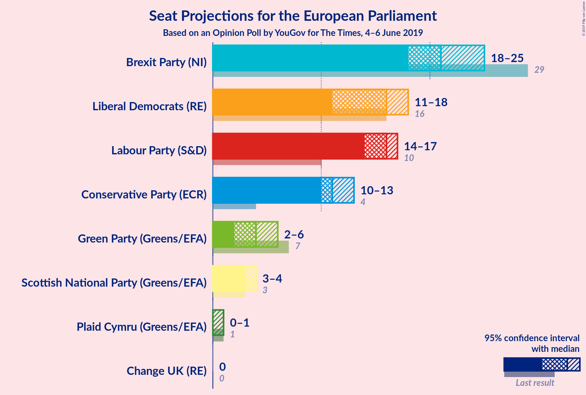
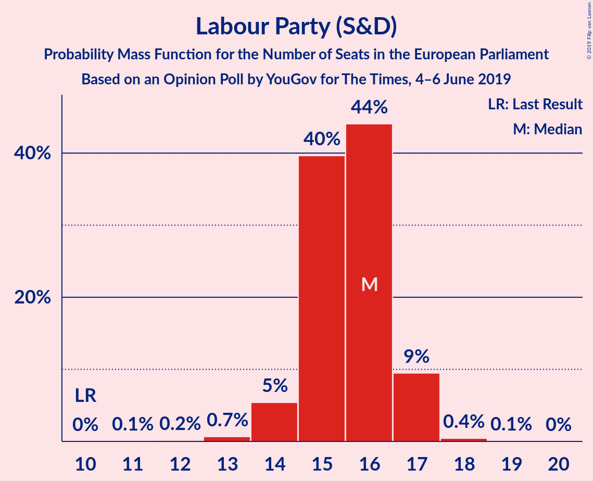

# Opinion Poll by YouGov for The Times, 4–6 June 2019

<a href="#voting-intentions">Voting Intentions</a> | <a href="#seats">Seats</a> | <a href="#coalitions">Coalitions</a> | <a href="#technical-information">Technical Information</a>

## Voting Intentions

### Confidence Intervals

| Party | Last Result | Poll Result | 80% Confidence Interval | 90% Confidence Interval | 95% Confidence Interval | 99% Confidence Interval |
|:-----:|:-----------:|:-----------:|:-----------------------:|:-----------------------:|:-----------------------:|:-----------------------:|
| Brexit Party (NI) | 30.5% | 25.9% | 24.5–27.3% |24.1–27.8% |23.8–28.1% |23.2–28.8% |
| Labour Party (S&D) | 13.7% | 19.9% | 18.6–21.2% |18.3–21.6% |18.0–21.9% |17.4–22.6% |
| Liberal Democrats (RE) | 19.6% | 19.9% | 18.6–21.2% |18.3–21.6% |18.0–21.9% |17.4–22.6% |
| Conservative Party (ECR) | 8.8% | 17.9% | 16.7–19.2% |16.4–19.6% |16.1–19.9% |15.6–20.5% |
| Green Party (Greens/EFA) | 11.8% | 9.0% | 8.1–10.0% |7.9–10.2% |7.7–10.5% |7.3–11.0% |
| Scottish National Party (Greens/EFA) | 3.5% | 5.0% | 4.3–5.7% |4.1–5.9% |4.0–6.1% |3.7–6.5% |
| Plaid Cymru (Greens/EFA) | 1.0% | 0.3% | 0.2–0.5% |0.1–0.6% |0.1–0.7% |0.1–0.8% |
| Change UK (RE) | 3.3% | 0.3% | 0.2–0.5% |0.1–0.6% |0.1–0.7% |0.1–0.8% |

*Note:* The poll result column reflects the actual value used in the calculations. Published results may vary slightly, and in addition be rounded to fewer digits.

## Seats

### Confidence Intervals

| Party | Last Result | Median | 80% Confidence Interval | 90% Confidence Interval | 95% Confidence Interval | 99% Confidence Interval |
|:-----:|:-----------:|:------:|:-----------------------:|:-----------------------:|:-----------------------:|:-----------------------:|
| <a href="#brexit-party-(ni)">Brexit Party (NI)</a> | 29 | 21 | 18–24 |18–25 |18–26 |18–26 |
| <a href="#labour-party-(s&d)">Labour Party (S&D)</a> | 10 | 16 | 15–16 |14–17 |14–17 |13–18 |
| <a href="#liberal-democrats-(re)">Liberal Democrats (RE)</a> | 16 | 16 | 11–18 |11–18 |10–18 |10–18 |
| <a href="#conservative-party-(ecr)">Conservative Party (ECR)</a> | 4 | 10 | 10–13 |10–13 |10–14 |10–14 |
| <a href="#green-party-(greens/efa)">Green Party (Greens/EFA)</a> | 7 | 3 | 2–5 |2–5 |2–5 |2–6 |
| <a href="#scottish-national-party-(greens/efa)">Scottish National Party (Greens/EFA)</a> | 3 | 4 | 3–4 |3–4 |3–4 |3–5 |
| <a href="#plaid-cymru-(greens/efa)">Plaid Cymru (Greens/EFA)</a> | 1 | 0 | 0 |0 |0–1 |0–1 |
| <a href="#change-uk-(re)">Change UK (RE)</a> | 0 | 0 | 0 |0 |0 |0 |

### Brexit Party (NI)

*For a full overview of the results for this party, see the [Brexit Party (NI)](party-brexitpartyni.html) page.*

| Number of Seats | Probability | Accumulated | Special Marks |
|:---------------:|:-----------:|:-----------:|:-------------:|
| 18 | 18% | 100% |  |
| 19 | 1.5% | 82% |  |
| 20 | 10% | 80% |  |
| 21 | 33% | 70% | Median |
| 22 | 9% | 36% |  |
| 23 | 5% | 28% |  |
| 24 | 14% | 22% |  |
| 25 | 6% | 9% |  |
| 26 | 3% | 3% |  |
| 27 | 0.2% | 0.3% |  |
| 28 | 0% | 0% |  |
| 29 | 0% | 0% | Last Result |

### Labour Party (S&D)

*For a full overview of the results for this party, see the [Labour Party (S&D)](party-labourpartysd.html) page.*

| Number of Seats | Probability | Accumulated | Special Marks |
|:---------------:|:-----------:|:-----------:|:-------------:|
| 10 | 0% | 100% | Last Result |
| 11 | 0% | 100% |  |
| 12 | 0.1% | 100% |  |
| 13 | 0.5% | 99.9% |  |
| 14 | 9% | 99.4% |  |
| 15 | 35% | 90% |  |
| 16 | 50% | 56% | Median |
| 17 | 5% | 6% |  |
| 18 | 0.8% | 1.1% |  |
| 19 | 0.2% | 0.3% |  |
| 20 | 0% | 0% |  |

### Liberal Democrats (RE)

*For a full overview of the results for this party, see the [Liberal Democrats (RE)](party-liberaldemocratsre.html) page.*

| Number of Seats | Probability | Accumulated | Special Marks |
|:---------------:|:-----------:|:-----------:|:-------------:|
| 10 | 3% | 100% |  |
| 11 | 15% | 97% |  |
| 12 | 2% | 82% |  |
| 13 | 6% | 80% |  |
| 14 | 4% | 74% |  |
| 15 | 18% | 70% |  |
| 16 | 26% | 53% | Last Result, Median |
| 17 | 13% | 26% |  |
| 18 | 14% | 14% |  |
| 19 | 0% | 0% |  |

### Conservative Party (ECR)

*For a full overview of the results for this party, see the [Conservative Party (ECR)](party-conservativepartyecr.html) page.*

| Number of Seats | Probability | Accumulated | Special Marks |
|:---------------:|:-----------:|:-----------:|:-------------:|
| 4 | 0% | 100% | Last Result |
| 5 | 0% | 100% |  |
| 6 | 0% | 100% |  |
| 7 | 0% | 100% |  |
| 8 | 0% | 100% |  |
| 9 | 0% | 100% |  |
| 10 | 53% | 100% | Median |
| 11 | 10% | 47% |  |
| 12 | 14% | 38% |  |
| 13 | 18% | 23% |  |
| 14 | 4% | 5% |  |
| 15 | 0.2% | 0.4% |  |
| 16 | 0.2% | 0.3% |  |
| 17 | 0% | 0% |  |

### Green Party (Greens/EFA)

*For a full overview of the results for this party, see the [Green Party (Greens/EFA)](party-greenpartygreensefa.html) page.*

| Number of Seats | Probability | Accumulated | Special Marks |
|:---------------:|:-----------:|:-----------:|:-------------:|
| 0 | 0.1% | 100% |  |
| 1 | 0% | 99.9% |  |
| 2 | 24% | 99.9% |  |
| 3 | 30% | 76% | Median |
| 4 | 27% | 46% |  |
| 5 | 16% | 19% |  |
| 6 | 2% | 2% |  |
| 7 | 0.1% | 0.1% | Last Result |
| 8 | 0% | 0% |  |

### Scottish National Party (Greens/EFA)

*For a full overview of the results for this party, see the [Scottish National Party (Greens/EFA)](party-scottishnationalpartygreensefa.html) page.*

| Number of Seats | Probability | Accumulated | Special Marks |
|:---------------:|:-----------:|:-----------:|:-------------:|
| 2 | 0.1% | 100% |  |
| 3 | 41% | 99.9% | Last Result |
| 4 | 58% | 59% | Median |
| 5 | 1.0% | 1.0% |  |
| 6 | 0% | 0% |  |

### Plaid Cymru (Greens/EFA)

*For a full overview of the results for this party, see the [Plaid Cymru (Greens/EFA)](party-plaidcymrugreensefa.html) page.*

| Number of Seats | Probability | Accumulated | Special Marks |
|:---------------:|:-----------:|:-----------:|:-------------:|
| 0 | 96% | 100% | Median |
| 1 | 4% | 4% | Last Result |
| 2 | 0% | 0% |  |

### Change UK (RE)

*For a full overview of the results for this party, see the [Change UK (RE)](party-changeukre.html) page.*

| Number of Seats | Probability | Accumulated | Special Marks |
|:---------------:|:-----------:|:-----------:|:-------------:|
| 0 | 100% | 100% | Last Result, Median |

## Coalitions

### Confidence Intervals

| Coalition | Last Result | Median | Majority? | 80% Confidence Interval | 90% Confidence Interval | 95% Confidence Interval | 99% Confidence Interval |
|:---------:|:-----------:|:------:|:---------:|:-----------------------:|:-----------------------:|:-----------------------:|:-----------------------:|
| Brexit Party (NI) | 29 | 21 | 0% | 18–24 | 18–25 | 18–26 | 18–26 |
| Liberal Democrats (RE) – Change UK (RE) | 16 | 16 | 0% | 11–18 | 11–18 | 10–18 | 10–18 |
| Labour Party (S&D) | 10 | 16 | 0% | 15–16 | 14–17 | 14–17 | 13–18 |
| Conservative Party (ECR) | 4 | 10 | 0% | 10–13 | 10–13 | 10–14 | 10–14 |
| Green Party (Greens/EFA) – Scottish National Party (Greens/EFA) – Plaid Cymru (Greens/EFA) | 11 | 7 | 0% | 5–9 | 5–9 | 5–9 | 5–10 |

### Brexit Party (NI)

| Number of Seats | Probability | Accumulated | Special Marks |
|:---------------:|:-----------:|:-----------:|:-------------:|
| 18 | 18% | 100% |  |
| 19 | 1.5% | 82% |  |
| 20 | 10% | 80% |  |
| 21 | 33% | 70% | Median |
| 22 | 9% | 36% |  |
| 23 | 5% | 28% |  |
| 24 | 14% | 22% |  |
| 25 | 6% | 9% |  |
| 26 | 3% | 3% |  |
| 27 | 0.2% | 0.3% |  |
| 28 | 0% | 0% |  |
| 29 | 0% | 0% | Last Result |

### Liberal Democrats (RE) – Change UK (RE)

| Number of Seats | Probability | Accumulated | Special Marks |
|:---------------:|:-----------:|:-----------:|:-------------:|
| 10 | 3% | 100% |  |
| 11 | 15% | 97% |  |
| 12 | 2% | 82% |  |
| 13 | 6% | 80% |  |
| 14 | 4% | 74% |  |
| 15 | 18% | 70% |  |
| 16 | 26% | 53% | Last Result, Median |
| 17 | 13% | 26% |  |
| 18 | 14% | 14% |  |
| 19 | 0% | 0% |  |

### Labour Party (S&D)

| Number of Seats | Probability | Accumulated | Special Marks |
|:---------------:|:-----------:|:-----------:|:-------------:|
| 10 | 0% | 100% | Last Result |
| 11 | 0% | 100% |  |
| 12 | 0.1% | 100% |  |
| 13 | 0.5% | 99.9% |  |
| 14 | 9% | 99.4% |  |
| 15 | 35% | 90% |  |
| 16 | 50% | 56% | Median |
| 17 | 5% | 6% |  |
| 18 | 0.8% | 1.1% |  |
| 19 | 0.2% | 0.3% |  |
| 20 | 0% | 0% |  |

### Conservative Party (ECR)

| Number of Seats | Probability | Accumulated | Special Marks |
|:---------------:|:-----------:|:-----------:|:-------------:|
| 4 | 0% | 100% | Last Result |
| 5 | 0% | 100% |  |
| 6 | 0% | 100% |  |
| 7 | 0% | 100% |  |
| 8 | 0% | 100% |  |
| 9 | 0% | 100% |  |
| 10 | 53% | 100% | Median |
| 11 | 10% | 47% |  |
| 12 | 14% | 38% |  |
| 13 | 18% | 23% |  |
| 14 | 4% | 5% |  |
| 15 | 0.2% | 0.4% |  |
| 16 | 0.2% | 0.3% |  |
| 17 | 0% | 0% |  |

### Green Party (Greens/EFA) – Scottish National Party (Greens/EFA) – Plaid Cymru (Greens/EFA)

| Number of Seats | Probability | Accumulated | Special Marks |
|:---------------:|:-----------:|:-----------:|:-------------:|
| 4 | 0.2% | 100% |  |
| 5 | 12% | 99.8% |  |
| 6 | 20% | 88% |  |
| 7 | 34% | 68% | Median |
| 8 | 19% | 34% |  |
| 9 | 13% | 15% |  |
| 10 | 2% | 2% |  |
| 11 | 0.1% | 0.1% | Last Result |
| 12 | 0% | 0% |  |

## Technical Information

### Opinion Poll

+ **Polling firm:** YouGov
+ **Commissioner(s):** The Times
+ **Fieldwork period:** 4–6 June 2019

### Calculations

+ **Sample size:** 1595
+ **Simulations done:** 131,072
+ **Error estimate:** 2.58%

