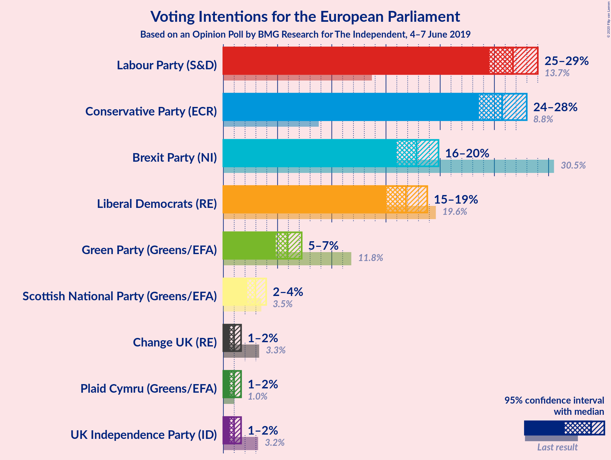
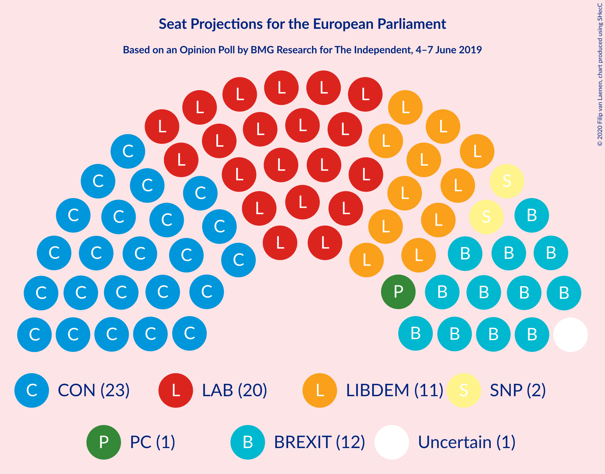
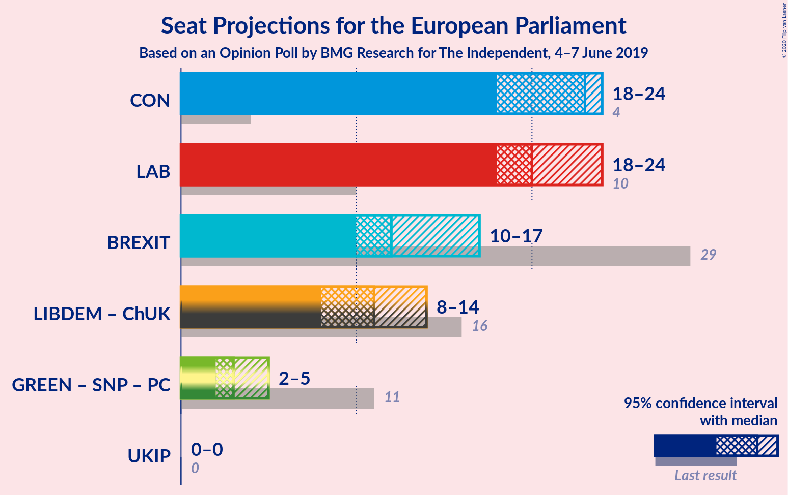
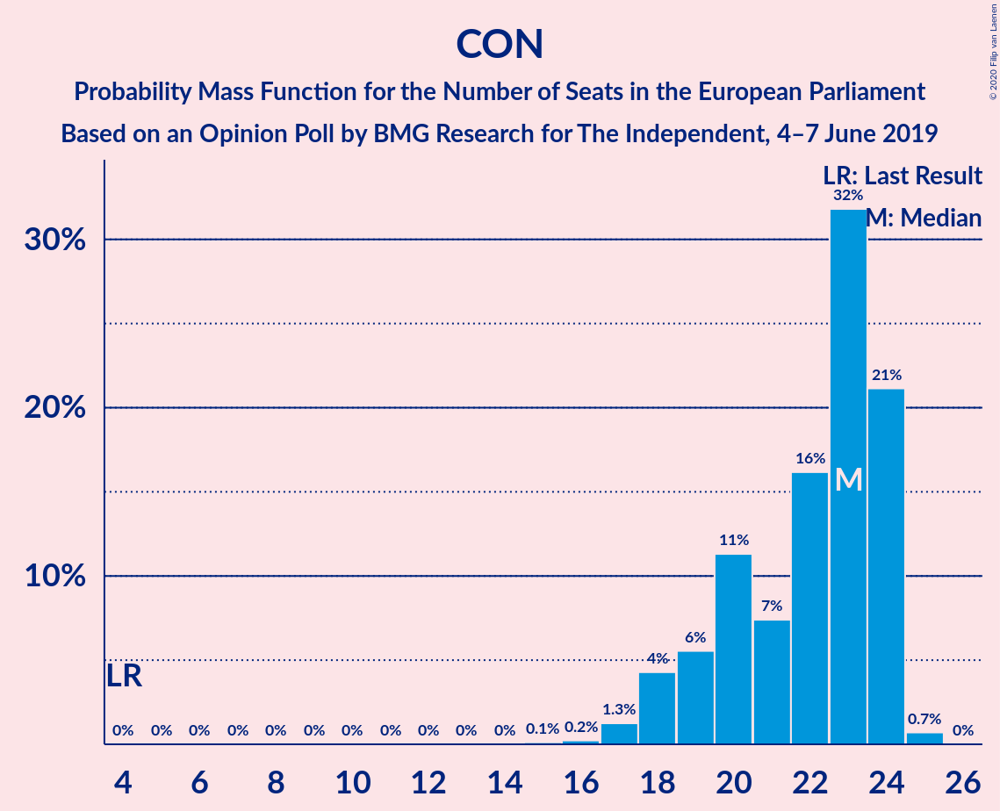
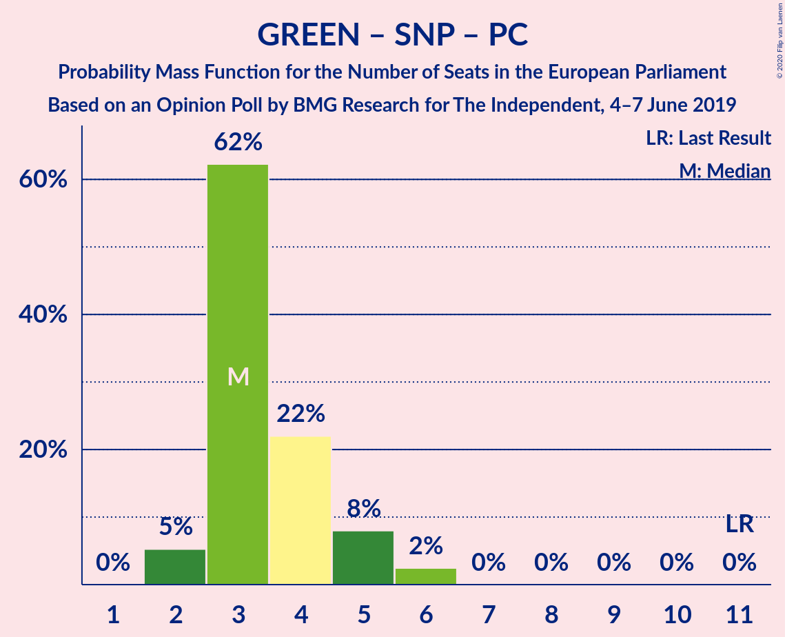

# Opinion Poll by BMG Research for The Independent, 4–7 June 2019

<a href="#voting-intentions">Voting Intentions</a> | <a href="#seats">Seats</a> | <a href="#coalitions">Coalitions</a> | <a href="#technical-information">Technical Information</a>

## Voting Intentions

### Confidence Intervals

| Party | Last Result | Poll Result | 80% Confidence Interval | 90% Confidence Interval | 95% Confidence Interval | 99% Confidence Interval |
|:-----:|:-----------:|:-----------:|:-----------------------:|:-----------------------:|:-----------------------:|:-----------------------:|
| Labour Party (S&D) | 13.7% | 26.7% | 25.3–28.2% |24.9–28.6% |24.5–29.0% |23.9–29.7% |
| Conservative Party (ECR) | 8.8% | 25.7% | 24.3–27.2% |23.9–27.6% |23.6–28.0% |22.9–28.7% |
| Brexit Party (NI) | 30.5% | 17.8% | 16.6–19.1% |16.3–19.5% |16.0–19.8% |15.4–20.5% |
| Liberal Democrats (RE) | 19.6% | 16.8% | 15.7–18.1% |15.3–18.5% |15.0–18.8% |14.5–19.4% |
| Green Party (Greens/EFA) | 11.8% | 5.9% | 5.2–6.8% |5.0–7.0% |4.8–7.2% |4.5–7.7% |
| Scottish National Party (Greens/EFA) | 3.5% | 3.0% | 2.5–3.6% |2.3–3.8% |2.2–3.9% |2.0–4.3% |
| Plaid Cymru (Greens/EFA) | 1.0% | 1.0% | 0.7–1.4% |0.7–1.5% |0.6–1.6% |0.5–1.8% |
| UK Independence Party (ID) | 3.2% | 1.0% | 0.7–1.4% |0.7–1.5% |0.6–1.6% |0.5–1.8% |
| Change UK (RE) | 3.3% | 1.0% | 0.7–1.4% |0.7–1.5% |0.6–1.6% |0.5–1.8% |

*Note:* The poll result column reflects the actual value used in the calculations. Published results may vary slightly, and in addition be rounded to fewer digits.

## Seats

### Confidence Intervals

| Party | Last Result | Median | 80% Confidence Interval | 90% Confidence Interval | 95% Confidence Interval | 99% Confidence Interval |
|:-----:|:-----------:|:------:|:-----------------------:|:-----------------------:|:-----------------------:|:-----------------------:|
| <a href="#labour-party-(s&d)">Labour Party (S&D)</a> | 10 | 19 | 19–23 |19–24 |19–24 |18–25 |
| <a href="#conservative-party-(ecr)">Conservative Party (ECR)</a> | 4 | 23 | 20–23 |19–24 |18–24 |18–25 |
| <a href="#brexit-party-(ni)">Brexit Party (NI)</a> | 29 | 13 | 11–16 |11–16 |11–16 |10–17 |
| <a href="#liberal-democrats-(re)">Liberal Democrats (RE)</a> | 16 | 12 | 9–13 |9–14 |9–14 |8–14 |
| <a href="#green-party-(greens/efa)">Green Party (Greens/EFA)</a> | 7 | 0 | 0–2 |0–2 |0–2 |0–2 |
| <a href="#scottish-national-party-(greens/efa)">Scottish National Party (Greens/EFA)</a> | 3 | 2 | 2–3 |2–3 |2–3 |2–3 |
| <a href="#plaid-cymru-(greens/efa)">Plaid Cymru (Greens/EFA)</a> | 1 | 1 | 1 |0–1 |0–1 |0–2 |
| <a href="#uk-independence-party-(id)">UK Independence Party (ID)</a> | 0 | 0 | 0 |0 |0 |0 |
| <a href="#change-uk-(re)">Change UK (RE)</a> | 0 | 0 | 0 |0 |0 |0 |

### Labour Party (S&D)

*For a full overview of the results for this party, see the [Labour Party (S&D)](party-labourpartysd.html) page.*

| Number of Seats | Probability | Accumulated | Special Marks |
|:---------------:|:-----------:|:-----------:|:-------------:|
| 10 | 0% | 100% | Last Result |
| 11 | 0% | 100% |  |
| 12 | 0% | 100% |  |
| 13 | 0% | 100% |  |
| 14 | 0% | 100% |  |
| 15 | 0% | 100% |  |
| 16 | 0% | 100% |  |
| 17 | 0.3% | 100% |  |
| 18 | 0.4% | 99.7% |  |
| 19 | 59% | 99.3% | Median |
| 20 | 20% | 40% |  |
| 21 | 6% | 20% |  |
| 22 | 4% | 14% |  |
| 23 | 5% | 10% |  |
| 24 | 5% | 6% |  |
| 25 | 0.4% | 0.6% |  |
| 26 | 0.1% | 0.1% |  |
| 27 | 0% | 0% |  |

### Conservative Party (ECR)

*For a full overview of the results for this party, see the [Conservative Party (ECR)](party-conservativepartyecr.html) page.*

| Number of Seats | Probability | Accumulated | Special Marks |
|:---------------:|:-----------:|:-----------:|:-------------:|
| 4 | 0% | 100% | Last Result |
| 5 | 0% | 100% |  |
| 6 | 0% | 100% |  |
| 7 | 0% | 100% |  |
| 8 | 0% | 100% |  |
| 9 | 0% | 100% |  |
| 10 | 0% | 100% |  |
| 11 | 0% | 100% |  |
| 12 | 0% | 100% |  |
| 13 | 0% | 100% |  |
| 14 | 0% | 100% |  |
| 15 | 0% | 100% |  |
| 16 | 0.3% | 100% |  |
| 17 | 0.1% | 99.7% |  |
| 18 | 4% | 99.6% |  |
| 19 | 5% | 95% |  |
| 20 | 7% | 90% |  |
| 21 | 5% | 83% |  |
| 22 | 12% | 78% |  |
| 23 | 58% | 66% | Median |
| 24 | 7% | 8% |  |
| 25 | 1.1% | 1.1% |  |
| 26 | 0% | 0% |  |

### Brexit Party (NI)

*For a full overview of the results for this party, see the [Brexit Party (NI)](party-brexitpartyni.html) page.*

| Number of Seats | Probability | Accumulated | Special Marks |
|:---------------:|:-----------:|:-----------:|:-------------:|
| 9 | 0.2% | 100% |  |
| 10 | 2% | 99.8% |  |
| 11 | 17% | 98% |  |
| 12 | 14% | 80% |  |
| 13 | 25% | 66% | Median |
| 14 | 5% | 41% |  |
| 15 | 26% | 36% |  |
| 16 | 10% | 10% |  |
| 17 | 0.9% | 0.9% |  |
| 18 | 0% | 0% |  |
| 19 | 0% | 0% |  |
| 20 | 0% | 0% |  |
| 21 | 0% | 0% |  |
| 22 | 0% | 0% |  |
| 23 | 0% | 0% |  |
| 24 | 0% | 0% |  |
| 25 | 0% | 0% |  |
| 26 | 0% | 0% |  |
| 27 | 0% | 0% |  |
| 28 | 0% | 0% |  |
| 29 | 0% | 0% | Last Result |

### Liberal Democrats (RE)

*For a full overview of the results for this party, see the [Liberal Democrats (RE)](party-liberaldemocratsre.html) page.*

| Number of Seats | Probability | Accumulated | Special Marks |
|:---------------:|:-----------:|:-----------:|:-------------:|
| 8 | 2% | 100% |  |
| 9 | 11% | 98% |  |
| 10 | 29% | 87% |  |
| 11 | 8% | 58% |  |
| 12 | 32% | 50% | Median |
| 13 | 11% | 18% |  |
| 14 | 7% | 7% |  |
| 15 | 0% | 0% |  |
| 16 | 0% | 0% | Last Result |

### Green Party (Greens/EFA)

*For a full overview of the results for this party, see the [Green Party (Greens/EFA)](party-greenpartygreensefa.html) page.*

| Number of Seats | Probability | Accumulated | Special Marks |
|:---------------:|:-----------:|:-----------:|:-------------:|
| 0 | 81% | 100% | Median |
| 1 | 9% | 19% |  |
| 2 | 10% | 10% |  |
| 3 | 0% | 0% |  |
| 4 | 0% | 0% |  |
| 5 | 0% | 0% |  |
| 6 | 0% | 0% |  |
| 7 | 0% | 0% | Last Result |

### Scottish National Party (Greens/EFA)

*For a full overview of the results for this party, see the [Scottish National Party (Greens/EFA)](party-scottishnationalpartygreensefa.html) page.*

| Number of Seats | Probability | Accumulated | Special Marks |
|:---------------:|:-----------:|:-----------:|:-------------:|
| 1 | 0.3% | 100% |  |
| 2 | 83% | 99.7% | Median |
| 3 | 16% | 16% | Last Result |
| 4 | 0% | 0% |  |

### Plaid Cymru (Greens/EFA)

*For a full overview of the results for this party, see the [Plaid Cymru (Greens/EFA)](party-plaidcymrugreensefa.html) page.*

| Number of Seats | Probability | Accumulated | Special Marks |
|:---------------:|:-----------:|:-----------:|:-------------:|
| 0 | 6% | 100% |  |
| 1 | 93% | 94% | Last Result, Median |
| 2 | 0.9% | 0.9% |  |
| 3 | 0% | 0% |  |

### UK Independence Party (ID)

*For a full overview of the results for this party, see the [UK Independence Party (ID)](party-ukindependencepartyid.html) page.*

| Number of Seats | Probability | Accumulated | Special Marks |
|:---------------:|:-----------:|:-----------:|:-------------:|
| 0 | 100% | 100% | Last Result, Median |

### Change UK (RE)

*For a full overview of the results for this party, see the [Change UK (RE)](party-changeukre.html) page.*

| Number of Seats | Probability | Accumulated | Special Marks |
|:---------------:|:-----------:|:-----------:|:-------------:|
| 0 | 100% | 100% | Last Result, Median |

## Coalitions

### Confidence Intervals

| Coalition | Last Result | Median | Majority? | 80% Confidence Interval | 90% Confidence Interval | 95% Confidence Interval | 99% Confidence Interval |
|:---------:|:-----------:|:------:|:---------:|:-----------------------:|:-----------------------:|:-----------------------:|:-----------------------:|
| Labour Party (S&D) | 10 | 19 | 0% | 19–23 | 19–24 | 19–24 | 18–25 |
| Conservative Party (ECR) | 4 | 23 | 0% | 20–23 | 19–24 | 18–24 | 18–25 |
| Brexit Party (NI) | 29 | 13 | 0% | 11–16 | 11–16 | 11–16 | 10–17 |
| Liberal Democrats (RE) – Change UK (RE) | 16 | 12 | 0% | 9–13 | 9–14 | 9–14 | 8–14 |
| Green Party (Greens/EFA) – Scottish National Party (Greens/EFA) – Plaid Cymru (Greens/EFA) | 11 | 3 | 0% | 3–5 | 3–5 | 2–6 | 2–6 |
| UK Independence Party (ID) | 0 | 0 | 0% | 0 | 0 | 0 | 0 |

### Labour Party (S&D)

| Number of Seats | Probability | Accumulated | Special Marks |
|:---------------:|:-----------:|:-----------:|:-------------:|
| 10 | 0% | 100% | Last Result |
| 11 | 0% | 100% |  |
| 12 | 0% | 100% |  |
| 13 | 0% | 100% |  |
| 14 | 0% | 100% |  |
| 15 | 0% | 100% |  |
| 16 | 0% | 100% |  |
| 17 | 0.3% | 100% |  |
| 18 | 0.4% | 99.7% |  |
| 19 | 59% | 99.3% | Median |
| 20 | 20% | 40% |  |
| 21 | 6% | 20% |  |
| 22 | 4% | 14% |  |
| 23 | 5% | 10% |  |
| 24 | 5% | 6% |  |
| 25 | 0.4% | 0.6% |  |
| 26 | 0.1% | 0.1% |  |
| 27 | 0% | 0% |  |

### Conservative Party (ECR)

| Number of Seats | Probability | Accumulated | Special Marks |
|:---------------:|:-----------:|:-----------:|:-------------:|
| 4 | 0% | 100% | Last Result |
| 5 | 0% | 100% |  |
| 6 | 0% | 100% |  |
| 7 | 0% | 100% |  |
| 8 | 0% | 100% |  |
| 9 | 0% | 100% |  |
| 10 | 0% | 100% |  |
| 11 | 0% | 100% |  |
| 12 | 0% | 100% |  |
| 13 | 0% | 100% |  |
| 14 | 0% | 100% |  |
| 15 | 0% | 100% |  |
| 16 | 0.3% | 100% |  |
| 17 | 0.1% | 99.7% |  |
| 18 | 4% | 99.6% |  |
| 19 | 5% | 95% |  |
| 20 | 7% | 90% |  |
| 21 | 5% | 83% |  |
| 22 | 12% | 78% |  |
| 23 | 58% | 66% | Median |
| 24 | 7% | 8% |  |
| 25 | 1.1% | 1.1% |  |
| 26 | 0% | 0% |  |

### Brexit Party (NI)

| Number of Seats | Probability | Accumulated | Special Marks |
|:---------------:|:-----------:|:-----------:|:-------------:|
| 9 | 0.2% | 100% |  |
| 10 | 2% | 99.8% |  |
| 11 | 17% | 98% |  |
| 12 | 14% | 80% |  |
| 13 | 25% | 66% | Median |
| 14 | 5% | 41% |  |
| 15 | 26% | 36% |  |
| 16 | 10% | 10% |  |
| 17 | 0.9% | 0.9% |  |
| 18 | 0% | 0% |  |
| 19 | 0% | 0% |  |
| 20 | 0% | 0% |  |
| 21 | 0% | 0% |  |
| 22 | 0% | 0% |  |
| 23 | 0% | 0% |  |
| 24 | 0% | 0% |  |
| 25 | 0% | 0% |  |
| 26 | 0% | 0% |  |
| 27 | 0% | 0% |  |
| 28 | 0% | 0% |  |
| 29 | 0% | 0% | Last Result |

### Liberal Democrats (RE) – Change UK (RE)

| Number of Seats | Probability | Accumulated | Special Marks |
|:---------------:|:-----------:|:-----------:|:-------------:|
| 8 | 2% | 100% |  |
| 9 | 11% | 98% |  |
| 10 | 29% | 87% |  |
| 11 | 8% | 58% |  |
| 12 | 32% | 50% | Median |
| 13 | 11% | 18% |  |
| 14 | 7% | 7% |  |
| 15 | 0% | 0% |  |
| 16 | 0% | 0% | Last Result |

### Green Party (Greens/EFA) – Scottish National Party (Greens/EFA) – Plaid Cymru (Greens/EFA)

| Number of Seats | Probability | Accumulated | Special Marks |
|:---------------:|:-----------:|:-----------:|:-------------:|
| 2 | 3% | 100% |  |
| 3 | 70% | 97% | Median |
| 4 | 16% | 27% |  |
| 5 | 8% | 11% |  |
| 6 | 4% | 4% |  |
| 7 | 0% | 0% |  |
| 8 | 0% | 0% |  |
| 9 | 0% | 0% |  |
| 10 | 0% | 0% |  |
| 11 | 0% | 0% | Last Result |

### UK Independence Party (ID)

| Number of Seats | Probability | Accumulated | Special Marks |
|:---------------:|:-----------:|:-----------:|:-------------:|
| 0 | 100% | 100% | Last Result, Median |

## Technical Information

### Opinion Poll

+ **Polling firm:** BMG Research
+ **Commissioner(s):** The Independent
+ **Fieldwork period:** 4–7 June 2019

### Calculations

+ **Sample size:** 1520
+ **Simulations done:** 131,072
+ **Error estimate:** 1.65%

