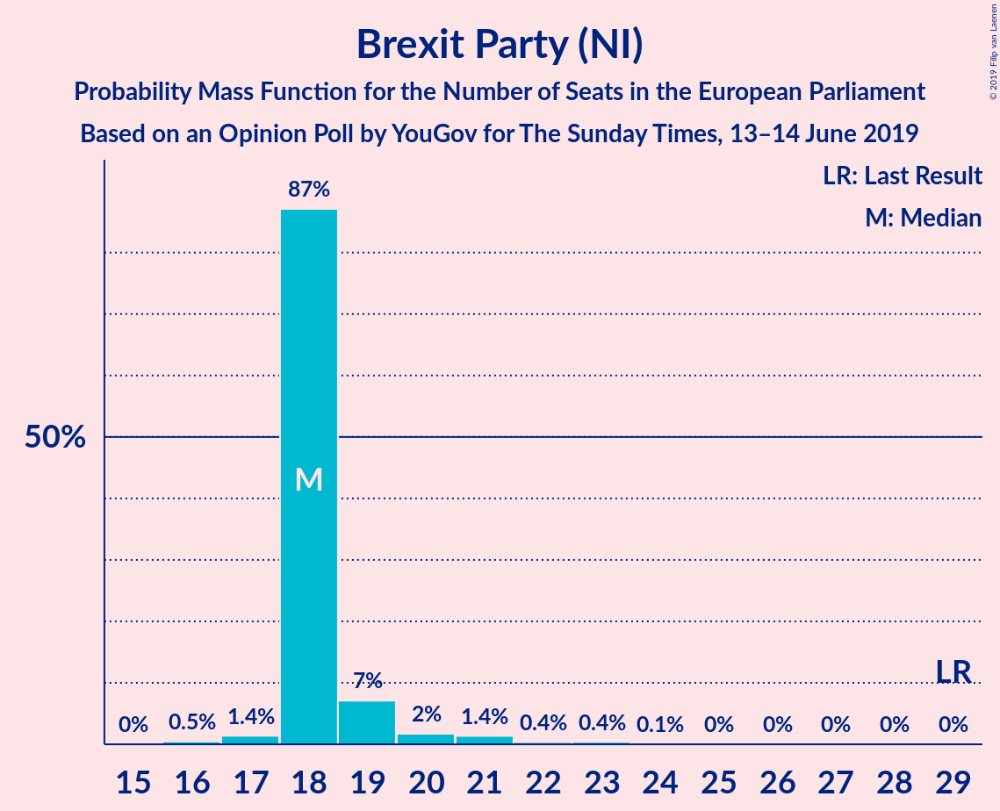
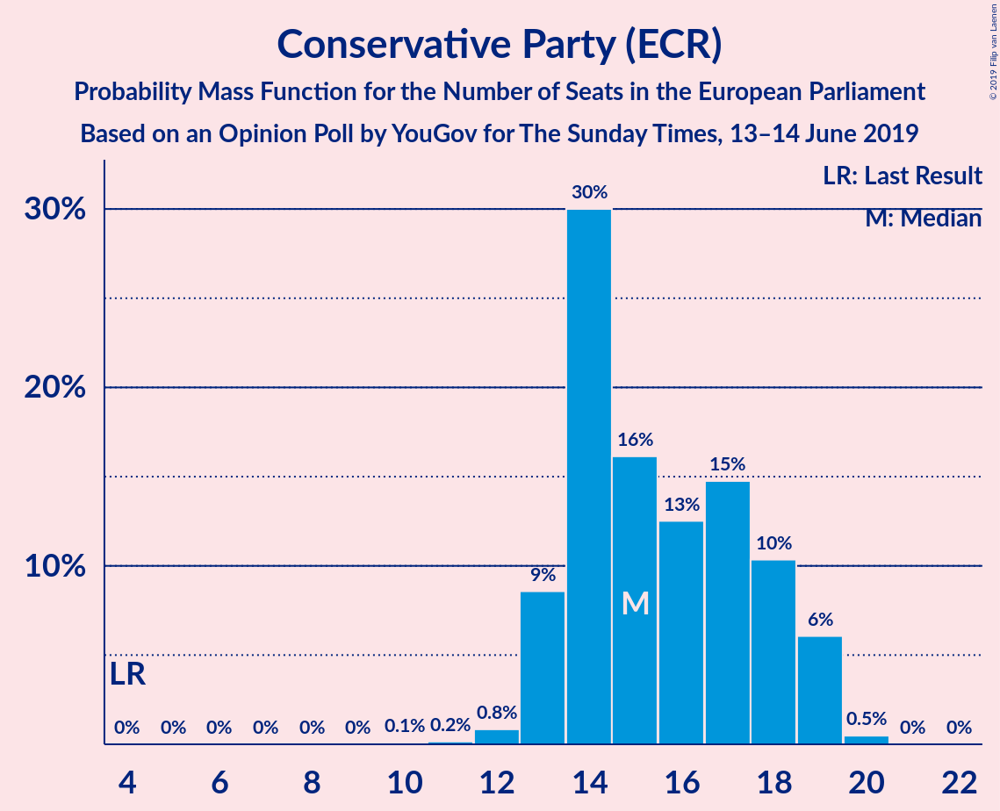
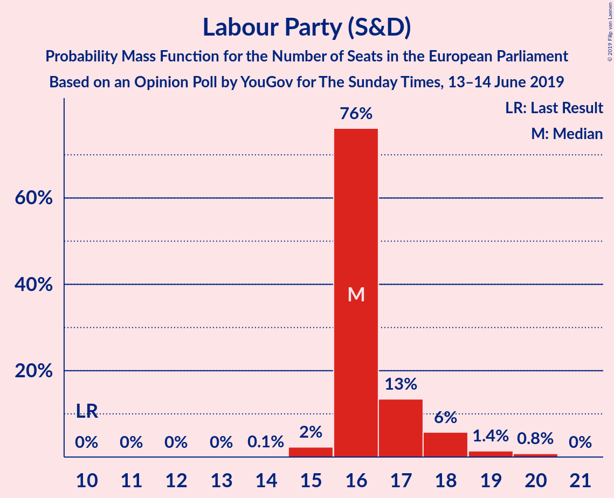
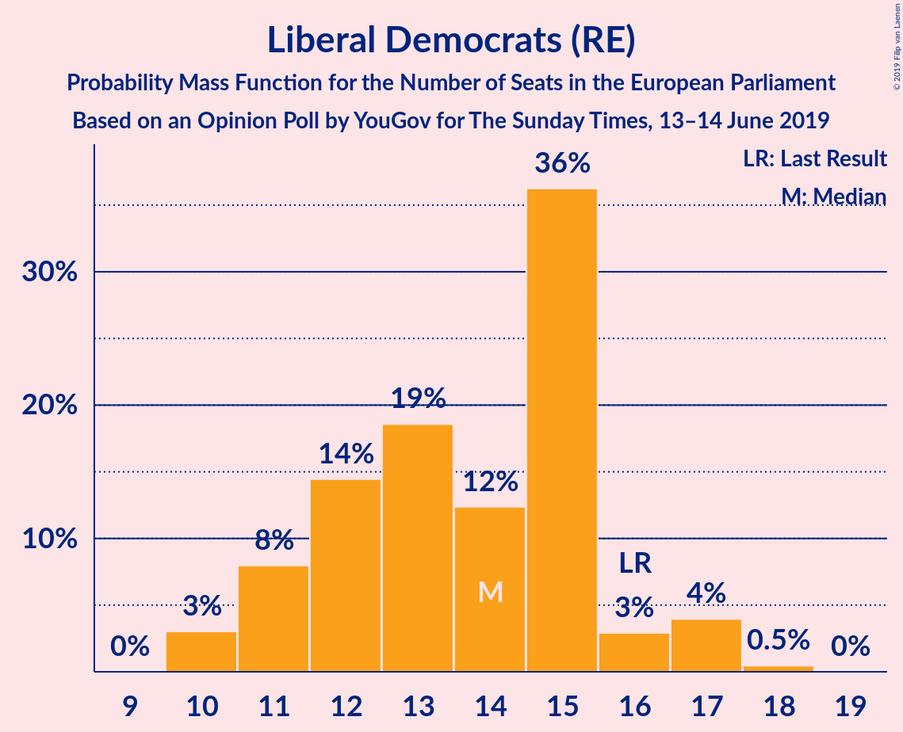
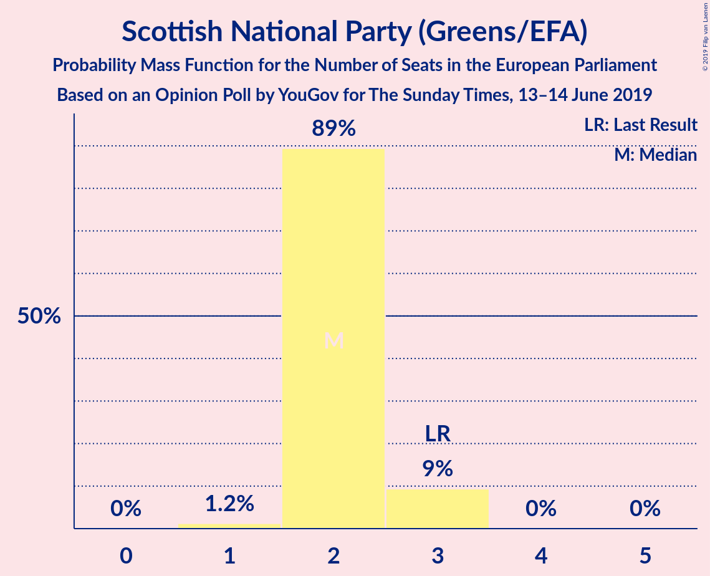
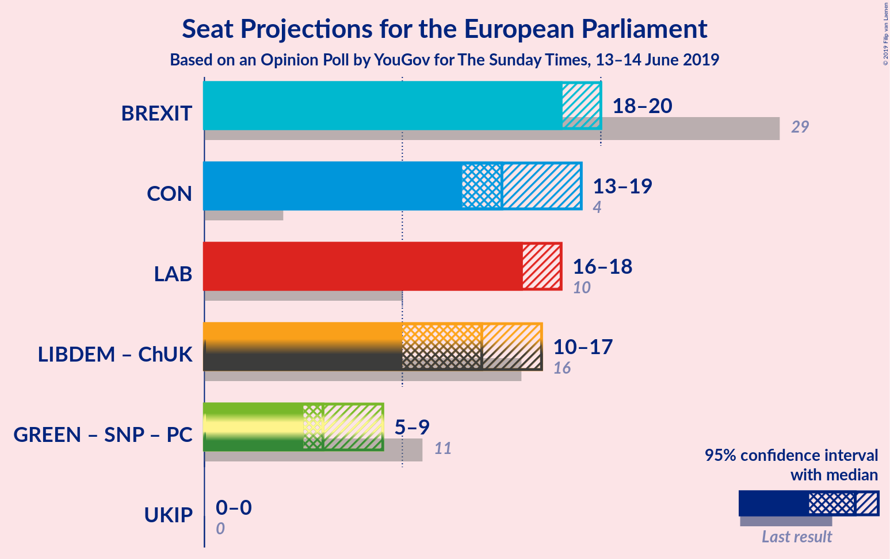
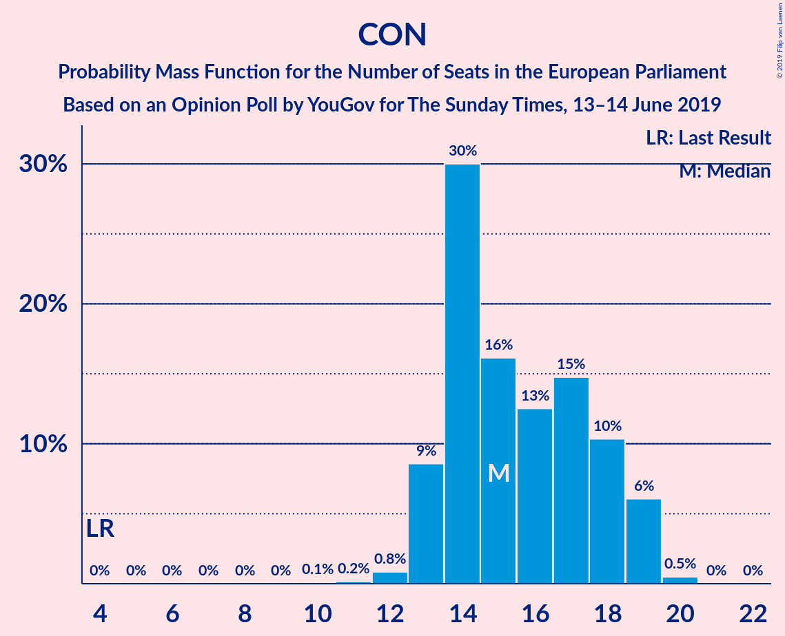
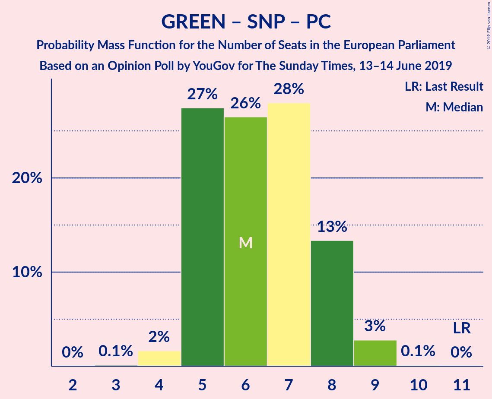

# Opinion Poll by YouGov for The Sunday Times, 13–14 June 2019

<a href="#voting-intentions">Voting Intentions</a> | <a href="#seats">Seats</a> | <a href="#coalitions">Coalitions</a> | <a href="#technical-information">Technical Information</a>

## Voting Intentions

### Confidence Intervals

| Party | Last Result | Poll Result | 80% Confidence Interval | 90% Confidence Interval | 95% Confidence Interval | 99% Confidence Interval |
|:-----:|:-----------:|:-----------:|:-----------------------:|:-----------------------:|:-----------------------:|:-----------------------:|
| Brexit Party (NI) | 30.5% | 24.1% | 22.8–25.5% |22.4–25.9% |22.1–26.2% |21.5–26.9% |
| Conservative Party (ECR) | 8.8% | 21.1% | 19.9–22.4% |19.5–22.8% |19.2–23.1% |18.6–23.8% |
| Labour Party (S&D) | 13.7% | 21.1% | 19.9–22.4% |19.5–22.8% |19.2–23.1% |18.6–23.8% |
| Liberal Democrats (RE) | 19.6% | 19.1% | 17.9–20.4% |17.5–20.7% |17.3–21.0% |16.7–21.7% |
| Green Party (Greens/EFA) | 11.8% | 9.0% | 8.2–10.0% |7.9–10.3% |7.7–10.5% |7.4–11.0% |
| Scottish National Party (Greens/EFA) | 3.5% | 3.0% | 2.5–3.6% |2.4–3.8% |2.3–3.9% |2.1–4.2% |
| Plaid Cymru (Greens/EFA) | 1.0% | 1.0% | 0.8–1.4% |0.7–1.5% |0.6–1.6% |0.5–1.8% |
| UK Independence Party (ID) | 3.2% | 0.2% | 0.1–0.5% |0.1–0.5% |0.1–0.6% |0.1–0.8% |
| Change UK (RE) | 3.3% | 0.2% | 0.1–0.5% |0.1–0.5% |0.1–0.6% |0.1–0.8% |

*Note:* The poll result column reflects the actual value used in the calculations. Published results may vary slightly, and in addition be rounded to fewer digits.

## Seats

### Confidence Intervals

| Party | Last Result | Median | 80% Confidence Interval | 90% Confidence Interval | 95% Confidence Interval | 99% Confidence Interval |
|:-----:|:-----------:|:------:|:-----------------------:|:-----------------------:|:-----------------------:|:-----------------------:|
| <a href="#brexit-party-(ni)">Brexit Party (NI)</a> | 29 | 18 | 18–19 |18–19 |18–20 |17–22 |
| <a href="#conservative-party-(ecr)">Conservative Party (ECR)</a> | 4 | 15 | 14–18 |13–19 |13–19 |12–19 |
| <a href="#labour-party-(s&d)">Labour Party (S&D)</a> | 10 | 16 | 16–17 |16–18 |16–18 |15–20 |
| <a href="#liberal-democrats-(re)">Liberal Democrats (RE)</a> | 16 | 14 | 11–15 |11–16 |10–17 |10–17 |
| <a href="#green-party-(greens/efa)">Green Party (Greens/EFA)</a> | 7 | 3 | 2–4 |2–5 |2–5 |1–6 |
| <a href="#scottish-national-party-(greens/efa)">Scottish National Party (Greens/EFA)</a> | 3 | 2 | 2 |2–3 |2–3 |1–3 |
| <a href="#plaid-cymru-(greens/efa)">Plaid Cymru (Greens/EFA)</a> | 1 | 1 | 1 |1–2 |0–2 |0–2 |
| <a href="#uk-independence-party-(id)">UK Independence Party (ID)</a> | 0 | 0 | 0 |0 |0 |0 |
| <a href="#change-uk-(re)">Change UK (RE)</a> | 0 | 0 | 0 |0 |0 |0 |

### Brexit Party (NI)

*For a full overview of the results for this party, see the [Brexit Party (NI)](party-brexitpartyni.html) page.*

| Number of Seats | Probability | Accumulated | Special Marks |
|:---------------:|:-----------:|:-----------:|:-------------:|
| 16 | 0.5% | 100% |  |
| 17 | 1.4% | 99.5% |  |
| 18 | 87% | 98% | Median |
| 19 | 7% | 11% |  |
| 20 | 2% | 4% |  |
| 21 | 1.4% | 2% |  |
| 22 | 0.4% | 0.9% |  |
| 23 | 0.4% | 0.5% |  |
| 24 | 0.1% | 0.1% |  |
| 25 | 0% | 0% |  |
| 26 | 0% | 0% |  |
| 27 | 0% | 0% |  |
| 28 | 0% | 0% |  |
| 29 | 0% | 0% | Last Result |

### Conservative Party (ECR)

*For a full overview of the results for this party, see the [Conservative Party (ECR)](party-conservativepartyecr.html) page.*

| Number of Seats | Probability | Accumulated | Special Marks |
|:---------------:|:-----------:|:-----------:|:-------------:|
| 4 | 0% | 100% | Last Result |
| 5 | 0% | 100% |  |
| 6 | 0% | 100% |  |
| 7 | 0% | 100% |  |
| 8 | 0% | 100% |  |
| 9 | 0% | 100% |  |
| 10 | 0.1% | 100% |  |
| 11 | 0.2% | 99.9% |  |
| 12 | 0.8% | 99.8% |  |
| 13 | 9% | 98.9% |  |
| 14 | 30% | 90% |  |
| 15 | 16% | 60% | Median |
| 16 | 13% | 44% |  |
| 17 | 15% | 32% |  |
| 18 | 10% | 17% |  |
| 19 | 6% | 7% |  |
| 20 | 0.5% | 0.5% |  |
| 21 | 0% | 0% |  |

### Labour Party (S&D)

*For a full overview of the results for this party, see the [Labour Party (S&D)](party-labourpartysd.html) page.*

| Number of Seats | Probability | Accumulated | Special Marks |
|:---------------:|:-----------:|:-----------:|:-------------:|
| 10 | 0% | 100% | Last Result |
| 11 | 0% | 100% |  |
| 12 | 0% | 100% |  |
| 13 | 0% | 100% |  |
| 14 | 0.1% | 100% |  |
| 15 | 2% | 99.9% |  |
| 16 | 76% | 98% | Median |
| 17 | 13% | 21% |  |
| 18 | 6% | 8% |  |
| 19 | 1.4% | 2% |  |
| 20 | 0.8% | 0.8% |  |
| 21 | 0% | 0% |  |

### Liberal Democrats (RE)

*For a full overview of the results for this party, see the [Liberal Democrats (RE)](party-liberaldemocratsre.html) page.*

| Number of Seats | Probability | Accumulated | Special Marks |
|:---------------:|:-----------:|:-----------:|:-------------:|
| 10 | 3% | 100% |  |
| 11 | 8% | 97% |  |
| 12 | 14% | 89% |  |
| 13 | 19% | 75% |  |
| 14 | 12% | 56% | Median |
| 15 | 36% | 44% |  |
| 16 | 3% | 7% | Last Result |
| 17 | 4% | 4% |  |
| 18 | 0.5% | 0.5% |  |
| 19 | 0% | 0% |  |

### Green Party (Greens/EFA)

*For a full overview of the results for this party, see the [Green Party (Greens/EFA)](party-greenpartygreensefa.html) page.*

| Number of Seats | Probability | Accumulated | Special Marks |
|:---------------:|:-----------:|:-----------:|:-------------:|
| 0 | 0.1% | 100% |  |
| 1 | 0.5% | 99.9% |  |
| 2 | 31% | 99.4% |  |
| 3 | 25% | 68% | Median |
| 4 | 34% | 43% |  |
| 5 | 8% | 9% |  |
| 6 | 0.6% | 0.6% |  |
| 7 | 0% | 0% | Last Result |

### Scottish National Party (Greens/EFA)

*For a full overview of the results for this party, see the [Scottish National Party (Greens/EFA)](party-scottishnationalpartygreensefa.html) page.*

| Number of Seats | Probability | Accumulated | Special Marks |
|:---------------:|:-----------:|:-----------:|:-------------:|
| 1 | 1.2% | 100% |  |
| 2 | 89% | 98.8% | Median |
| 3 | 9% | 9% | Last Result |
| 4 | 0% | 0% |  |

### Plaid Cymru (Greens/EFA)

*For a full overview of the results for this party, see the [Plaid Cymru (Greens/EFA)](party-plaidcymrugreensefa.html) page.*

| Number of Seats | Probability | Accumulated | Special Marks |
|:---------------:|:-----------:|:-----------:|:-------------:|
| 0 | 4% | 100% |  |
| 1 | 88% | 96% | Last Result, Median |
| 2 | 8% | 8% |  |
| 3 | 0% | 0% |  |

### UK Independence Party (ID)

*For a full overview of the results for this party, see the [UK Independence Party (ID)](party-ukindependencepartyid.html) page.*

| Number of Seats | Probability | Accumulated | Special Marks |
|:---------------:|:-----------:|:-----------:|:-------------:|
| 0 | 100% | 100% | Last Result, Median |

### Change UK (RE)

*For a full overview of the results for this party, see the [Change UK (RE)](party-changeukre.html) page.*

| Number of Seats | Probability | Accumulated | Special Marks |
|:---------------:|:-----------:|:-----------:|:-------------:|
| 0 | 100% | 100% | Last Result, Median |

## Coalitions

### Confidence Intervals

| Coalition | Last Result | Median | Majority? | 80% Confidence Interval | 90% Confidence Interval | 95% Confidence Interval | 99% Confidence Interval |
|:---------:|:-----------:|:------:|:---------:|:-----------------------:|:-----------------------:|:-----------------------:|:-----------------------:|
| Brexit Party (NI) | 29 | 18 | 0% | 18–19 | 18–19 | 18–20 | 17–22 |
| Conservative Party (ECR) | 4 | 15 | 0% | 14–18 | 13–19 | 13–19 | 12–19 |
| Labour Party (S&D) | 10 | 16 | 0% | 16–17 | 16–18 | 16–18 | 15–20 |
| Liberal Democrats (RE) – Change UK (RE) | 16 | 14 | 0% | 11–15 | 11–16 | 10–17 | 10–17 |
| Green Party (Greens/EFA) – Scottish National Party (Greens/EFA) – Plaid Cymru (Greens/EFA) | 11 | 6 | 0% | 5–8 | 5–8 | 5–9 | 4–9 |
| UK Independence Party (ID) | 0 | 0 | 0% | 0 | 0 | 0 | 0 |

### Brexit Party (NI)

| Number of Seats | Probability | Accumulated | Special Marks |
|:---------------:|:-----------:|:-----------:|:-------------:|
| 16 | 0.5% | 100% |  |
| 17 | 1.4% | 99.5% |  |
| 18 | 87% | 98% | Median |
| 19 | 7% | 11% |  |
| 20 | 2% | 4% |  |
| 21 | 1.4% | 2% |  |
| 22 | 0.4% | 0.9% |  |
| 23 | 0.4% | 0.5% |  |
| 24 | 0.1% | 0.1% |  |
| 25 | 0% | 0% |  |
| 26 | 0% | 0% |  |
| 27 | 0% | 0% |  |
| 28 | 0% | 0% |  |
| 29 | 0% | 0% | Last Result |

### Conservative Party (ECR)

| Number of Seats | Probability | Accumulated | Special Marks |
|:---------------:|:-----------:|:-----------:|:-------------:|
| 4 | 0% | 100% | Last Result |
| 5 | 0% | 100% |  |
| 6 | 0% | 100% |  |
| 7 | 0% | 100% |  |
| 8 | 0% | 100% |  |
| 9 | 0% | 100% |  |
| 10 | 0.1% | 100% |  |
| 11 | 0.2% | 99.9% |  |
| 12 | 0.8% | 99.8% |  |
| 13 | 9% | 98.9% |  |
| 14 | 30% | 90% |  |
| 15 | 16% | 60% | Median |
| 16 | 13% | 44% |  |
| 17 | 15% | 32% |  |
| 18 | 10% | 17% |  |
| 19 | 6% | 7% |  |
| 20 | 0.5% | 0.5% |  |
| 21 | 0% | 0% |  |

### Labour Party (S&D)

| Number of Seats | Probability | Accumulated | Special Marks |
|:---------------:|:-----------:|:-----------:|:-------------:|
| 10 | 0% | 100% | Last Result |
| 11 | 0% | 100% |  |
| 12 | 0% | 100% |  |
| 13 | 0% | 100% |  |
| 14 | 0.1% | 100% |  |
| 15 | 2% | 99.9% |  |
| 16 | 76% | 98% | Median |
| 17 | 13% | 21% |  |
| 18 | 6% | 8% |  |
| 19 | 1.4% | 2% |  |
| 20 | 0.8% | 0.8% |  |
| 21 | 0% | 0% |  |

### Liberal Democrats (RE) – Change UK (RE)

| Number of Seats | Probability | Accumulated | Special Marks |
|:---------------:|:-----------:|:-----------:|:-------------:|
| 10 | 3% | 100% |  |
| 11 | 8% | 97% |  |
| 12 | 14% | 89% |  |
| 13 | 19% | 75% |  |
| 14 | 12% | 56% | Median |
| 15 | 36% | 44% |  |
| 16 | 3% | 7% | Last Result |
| 17 | 4% | 4% |  |
| 18 | 0.5% | 0.5% |  |
| 19 | 0% | 0% |  |

### Green Party (Greens/EFA) – Scottish National Party (Greens/EFA) – Plaid Cymru (Greens/EFA)

| Number of Seats | Probability | Accumulated | Special Marks |
|:---------------:|:-----------:|:-----------:|:-------------:|
| 3 | 0.1% | 100% |  |
| 4 | 2% | 99.9% |  |
| 5 | 27% | 98% |  |
| 6 | 26% | 71% | Median |
| 7 | 28% | 44% |  |
| 8 | 13% | 16% |  |
| 9 | 3% | 3% |  |
| 10 | 0.1% | 0.1% |  |
| 11 | 0% | 0% | Last Result |

### UK Independence Party (ID)

| Number of Seats | Probability | Accumulated | Special Marks |
|:---------------:|:-----------:|:-----------:|:-------------:|
| 0 | 100% | 100% | Last Result, Median |

## Technical Information

### Opinion Poll

+ **Polling firm:** YouGov
+ **Commissioner(s):** The Sunday Times
+ **Fieldwork period:** 13–14 June 2019

### Calculations

+ **Sample size:** 1672
+ **Simulations done:** 1,048,576
+ **Error estimate:** 0.70%

