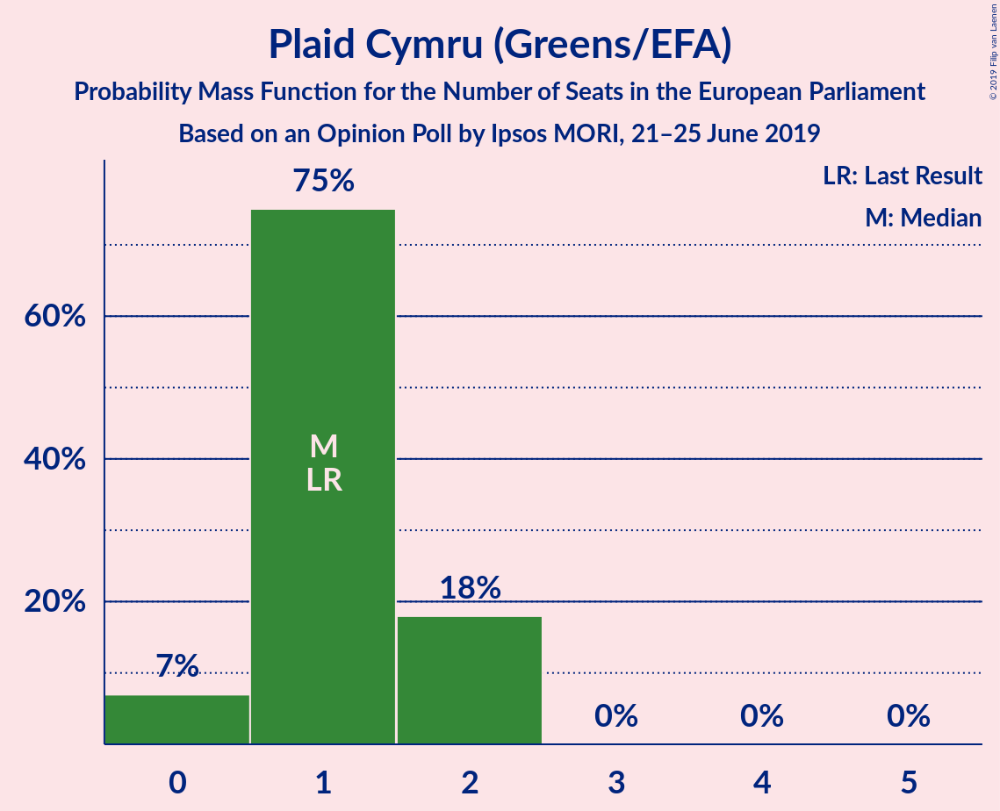

# Opinion Poll by Ipsos MORI, 21–25 June 2019

<a href="#voting-intentions">Voting Intentions</a> | <a href="#seats">Seats</a> | <a href="#coalitions">Coalitions</a> | <a href="#technical-information">Technical Information</a>

## Voting Intentions

### Confidence Intervals

| Party | Last Result | Poll Result | 80% Confidence Interval | 90% Confidence Interval | 95% Confidence Interval | 99% Confidence Interval |
|:-----:|:-----------:|:-----------:|:-----------------------:|:-----------------------:|:-----------------------:|:-----------------------:|
| Conservative Party (ECR) | 23.1% | 26.4% | 24.7–28.2% |24.2–28.7% |23.8–29.1% |23.0–30.0% |
| Labour Party (S&D) | 24.4% | 24.4% | 22.7–26.1% |22.2–26.6% |21.8–27.1% |21.1–27.9% |
| Liberal Democrats (RE) | 6.6% | 22.3% | 20.7–24.1% |20.3–24.6% |19.9–25.0% |19.2–25.8% |
| Brexit Party (NI) | 0.0% | 12.2% | 11.0–13.6% |10.6–14.0% |10.3–14.3% |9.8–15.0% |
| Green Party (Greens/EFA) | 6.9% | 8.1% | 7.1–9.3% |6.9–9.7% |6.6–10.0% |6.2–10.6% |
| Scottish National Party (Greens/EFA) | 2.4% | 4.0% | 3.3–4.9% |3.2–5.2% |3.0–5.4% |2.7–5.9% |
| Plaid Cymru (Greens/EFA) | 0.7% | 1.1% | 0.7–1.6% |0.7–1.8% |0.6–1.9% |0.5–2.2% |
| UK Independence Party (ID) | 26.6% | 1.1% | 0.7–1.6% |0.7–1.8% |0.6–1.9% |0.5–2.2% |
| Change UK (RE) | 0.0% | 0.3% | 0.2–0.6% |0.1–0.7% |0.1–0.8% |0.1–1.1% |

*Note:* The poll result column reflects the actual value used in the calculations. Published results may vary slightly, and in addition be rounded to fewer digits.

## Seats

### Confidence Intervals

| Party | Last Result | Median | 80% Confidence Interval | 90% Confidence Interval | 95% Confidence Interval | 99% Confidence Interval |
|:-----:|:-----------:|:------:|:-----------------------:|:-----------------------:|:-----------------------:|:-----------------------:|
| <a href="#conservative-party-(ecr)">Conservative Party (ECR)</a> | 19 | 23 | 20–24 |19–24 |19–24 |16–24 |
| <a href="#labour-party-(s&d)">Labour Party (S&D)</a> | 20 | 18 | 16–21 |15–22 |15–23 |15–24 |
| <a href="#liberal-democrats-(re)">Liberal Democrats (RE)</a> | 1 | 17 | 14–19 |13–20 |12–22 |12–22 |
| <a href="#brexit-party-(ni)">Brexit Party (NI)</a> | 0 | 7 | 7–8 |6–9 |6–10 |4–11 |
| <a href="#green-party-(greens/efa)">Green Party (Greens/EFA)</a> | 3 | 2 | 1–4 |1–5 |0–6 |0–7 |
| <a href="#scottish-national-party-(greens/efa)">Scottish National Party (Greens/EFA)</a> | 2 | 2 | 2–3 |2–3 |2–3 |2–4 |
| <a href="#plaid-cymru-(greens/efa)">Plaid Cymru (Greens/EFA)</a> | 1 | 1 | 1–2 |0–2 |0–2 |0–2 |
| <a href="#uk-independence-party-(id)">UK Independence Party (ID)</a> | 24 | 0 | 0 |0 |0 |0 |
| <a href="#change-uk-(re)">Change UK (RE)</a> | 0 | 0 | 0 |0 |0 |0 |

### Conservative Party (ECR)

*For a full overview of the results for this party, see the [Conservative Party (ECR)](party-conservativepartyecr.html) page.*

| Number of Seats | Probability | Accumulated | Special Marks |
|:---------------:|:-----------:|:-----------:|:-------------:|
| 15 | 0% | 100% |  |
| 16 | 1.2% | 99.9% |  |
| 17 | 0.9% | 98.8% |  |
| 18 | 0.3% | 98% |  |
| 19 | 5% | 98% | Last Result |
| 20 | 11% | 92% |  |
| 21 | 6% | 81% |  |
| 22 | 24% | 75% |  |
| 23 | 27% | 51% | Median |
| 24 | 25% | 25% |  |
| 25 | 0% | 0.1% |  |
| 26 | 0% | 0% |  |

### Labour Party (S&D)

*For a full overview of the results for this party, see the [Labour Party (S&D)](party-labourpartysd.html) page.*

| Number of Seats | Probability | Accumulated | Special Marks |
|:---------------:|:-----------:|:-----------:|:-------------:|
| 15 | 8% | 100% |  |
| 16 | 18% | 92% |  |
| 17 | 22% | 75% |  |
| 18 | 18% | 53% | Median |
| 19 | 15% | 35% |  |
| 20 | 3% | 19% | Last Result |
| 21 | 10% | 16% |  |
| 22 | 3% | 6% |  |
| 23 | 2% | 4% |  |
| 24 | 2% | 2% |  |
| 25 | 0.2% | 0.2% |  |
| 26 | 0.1% | 0.1% |  |
| 27 | 0% | 0% |  |

### Liberal Democrats (RE)

*For a full overview of the results for this party, see the [Liberal Democrats (RE)](party-liberaldemocratsre.html) page.*

| Number of Seats | Probability | Accumulated | Special Marks |
|:---------------:|:-----------:|:-----------:|:-------------:|
| 1 | 0% | 100% | Last Result |
| 2 | 0% | 100% |  |
| 3 | 0% | 100% |  |
| 4 | 0% | 100% |  |
| 5 | 0% | 100% |  |
| 6 | 0% | 100% |  |
| 7 | 0% | 100% |  |
| 8 | 0% | 100% |  |
| 9 | 0% | 100% |  |
| 10 | 0% | 100% |  |
| 11 | 0% | 100% |  |
| 12 | 3% | 100% |  |
| 13 | 5% | 97% |  |
| 14 | 14% | 92% |  |
| 15 | 22% | 78% |  |
| 16 | 4% | 56% |  |
| 17 | 17% | 52% | Median |
| 18 | 22% | 35% |  |
| 19 | 6% | 13% |  |
| 20 | 2% | 7% |  |
| 21 | 0.6% | 5% |  |
| 22 | 4% | 4% |  |
| 23 | 0% | 0% |  |

### Brexit Party (NI)

*For a full overview of the results for this party, see the [Brexit Party (NI)](party-brexitpartyni.html) page.*

| Number of Seats | Probability | Accumulated | Special Marks |
|:---------------:|:-----------:|:-----------:|:-------------:|
| 0 | 0% | 100% | Last Result |
| 1 | 0% | 100% |  |
| 2 | 0% | 100% |  |
| 3 | 0% | 100% |  |
| 4 | 0.6% | 99.9% |  |
| 5 | 2% | 99.3% |  |
| 6 | 3% | 98% |  |
| 7 | 48% | 94% | Median |
| 8 | 37% | 46% |  |
| 9 | 4% | 9% |  |
| 10 | 4% | 5% |  |
| 11 | 0.7% | 0.7% |  |
| 12 | 0% | 0% |  |

### Green Party (Greens/EFA)

*For a full overview of the results for this party, see the [Green Party (Greens/EFA)](party-greenpartygreensefa.html) page.*

| Number of Seats | Probability | Accumulated | Special Marks |
|:---------------:|:-----------:|:-----------:|:-------------:|
| 0 | 3% | 100% |  |
| 1 | 22% | 97% |  |
| 2 | 49% | 75% | Median |
| 3 | 15% | 26% | Last Result |
| 4 | 2% | 11% |  |
| 5 | 6% | 9% |  |
| 6 | 2% | 3% |  |
| 7 | 1.0% | 1.0% |  |
| 8 | 0% | 0% |  |

### Scottish National Party (Greens/EFA)

*For a full overview of the results for this party, see the [Scottish National Party (Greens/EFA)](party-scottishnationalpartygreensefa.html) page.*

| Number of Seats | Probability | Accumulated | Special Marks |
|:---------------:|:-----------:|:-----------:|:-------------:|
| 2 | 65% | 100% | Last Result, Median |
| 3 | 34% | 35% |  |
| 4 | 0.5% | 0.5% |  |
| 5 | 0% | 0% |  |

### Plaid Cymru (Greens/EFA)

*For a full overview of the results for this party, see the [Plaid Cymru (Greens/EFA)](party-plaidcymrugreensefa.html) page.*

| Number of Seats | Probability | Accumulated | Special Marks |
|:---------------:|:-----------:|:-----------:|:-------------:|
| 0 | 8% | 100% |  |
| 1 | 54% | 92% | Last Result, Median |
| 2 | 39% | 39% |  |
| 3 | 0.1% | 0.1% |  |
| 4 | 0% | 0% |  |

### UK Independence Party (ID)

*For a full overview of the results for this party, see the [UK Independence Party (ID)](party-ukindependencepartyid.html) page.*

| Number of Seats | Probability | Accumulated | Special Marks |
|:---------------:|:-----------:|:-----------:|:-------------:|
| 0 | 100% | 100% | Median |
| 1 | 0% | 0% |  |
| 2 | 0% | 0% |  |
| 3 | 0% | 0% |  |
| 4 | 0% | 0% |  |
| 5 | 0% | 0% |  |
| 6 | 0% | 0% |  |
| 7 | 0% | 0% |  |
| 8 | 0% | 0% |  |
| 9 | 0% | 0% |  |
| 10 | 0% | 0% |  |
| 11 | 0% | 0% |  |
| 12 | 0% | 0% |  |
| 13 | 0% | 0% |  |
| 14 | 0% | 0% |  |
| 15 | 0% | 0% |  |
| 16 | 0% | 0% |  |
| 17 | 0% | 0% |  |
| 18 | 0% | 0% |  |
| 19 | 0% | 0% |  |
| 20 | 0% | 0% |  |
| 21 | 0% | 0% |  |
| 22 | 0% | 0% |  |
| 23 | 0% | 0% |  |
| 24 | 0% | 0% | Last Result |

### Change UK (RE)

*For a full overview of the results for this party, see the [Change UK (RE)](party-changeukre.html) page.*

| Number of Seats | Probability | Accumulated | Special Marks |
|:---------------:|:-----------:|:-----------:|:-------------:|
| 0 | 100% | 100% | Last Result, Median |

## Coalitions

### Confidence Intervals

| Coalition | Last Result | Median | Majority? | 80% Confidence Interval | 90% Confidence Interval | 95% Confidence Interval | 99% Confidence Interval |
|:---------:|:-----------:|:------:|:---------:|:-----------------------:|:-----------------------:|:-----------------------:|:-----------------------:|
| Conservative Party (ECR) | 19 | 23 | 0% | 20–24 | 19–24 | 19–24 | 16–24 |
| Labour Party (S&D) | 20 | 18 | 0% | 16–21 | 15–22 | 15–23 | 15–24 |
| Liberal Democrats (RE) – Change UK (RE) | 1 | 17 | 0% | 14–19 | 13–20 | 12–22 | 12–22 |
| Brexit Party (NI) | 0 | 7 | 0% | 7–8 | 6–9 | 6–10 | 4–11 |
| Green Party (Greens/EFA) – Scottish National Party (Greens/EFA) – Plaid Cymru (Greens/EFA) | 6 | 6 | 0% | 4–8 | 4–9 | 4–9 | 3–10 |
| UK Independence Party (ID) | 24 | 0 | 0% | 0 | 0 | 0 | 0 |

### Conservative Party (ECR)

| Number of Seats | Probability | Accumulated | Special Marks |
|:---------------:|:-----------:|:-----------:|:-------------:|
| 15 | 0% | 100% |  |
| 16 | 1.2% | 99.9% |  |
| 17 | 0.9% | 98.8% |  |
| 18 | 0.3% | 98% |  |
| 19 | 5% | 98% | Last Result |
| 20 | 11% | 92% |  |
| 21 | 6% | 81% |  |
| 22 | 24% | 75% |  |
| 23 | 27% | 51% | Median |
| 24 | 25% | 25% |  |
| 25 | 0% | 0.1% |  |
| 26 | 0% | 0% |  |

### Labour Party (S&D)

| Number of Seats | Probability | Accumulated | Special Marks |
|:---------------:|:-----------:|:-----------:|:-------------:|
| 15 | 8% | 100% |  |
| 16 | 18% | 92% |  |
| 17 | 22% | 75% |  |
| 18 | 18% | 53% | Median |
| 19 | 15% | 35% |  |
| 20 | 3% | 19% | Last Result |
| 21 | 10% | 16% |  |
| 22 | 3% | 6% |  |
| 23 | 2% | 4% |  |
| 24 | 2% | 2% |  |
| 25 | 0.2% | 0.2% |  |
| 26 | 0.1% | 0.1% |  |
| 27 | 0% | 0% |  |

### Liberal Democrats (RE) – Change UK (RE)

| Number of Seats | Probability | Accumulated | Special Marks |
|:---------------:|:-----------:|:-----------:|:-------------:|
| 1 | 0% | 100% | Last Result |
| 2 | 0% | 100% |  |
| 3 | 0% | 100% |  |
| 4 | 0% | 100% |  |
| 5 | 0% | 100% |  |
| 6 | 0% | 100% |  |
| 7 | 0% | 100% |  |
| 8 | 0% | 100% |  |
| 9 | 0% | 100% |  |
| 10 | 0% | 100% |  |
| 11 | 0% | 100% |  |
| 12 | 3% | 100% |  |
| 13 | 5% | 97% |  |
| 14 | 14% | 92% |  |
| 15 | 22% | 78% |  |
| 16 | 4% | 56% |  |
| 17 | 17% | 52% | Median |
| 18 | 22% | 35% |  |
| 19 | 6% | 13% |  |
| 20 | 2% | 7% |  |
| 21 | 0.6% | 5% |  |
| 22 | 4% | 4% |  |
| 23 | 0% | 0% |  |

### Brexit Party (NI)

| Number of Seats | Probability | Accumulated | Special Marks |
|:---------------:|:-----------:|:-----------:|:-------------:|
| 0 | 0% | 100% | Last Result |
| 1 | 0% | 100% |  |
| 2 | 0% | 100% |  |
| 3 | 0% | 100% |  |
| 4 | 0.6% | 99.9% |  |
| 5 | 2% | 99.3% |  |
| 6 | 3% | 98% |  |
| 7 | 48% | 94% | Median |
| 8 | 37% | 46% |  |
| 9 | 4% | 9% |  |
| 10 | 4% | 5% |  |
| 11 | 0.7% | 0.7% |  |
| 12 | 0% | 0% |  |

### Green Party (Greens/EFA) – Scottish National Party (Greens/EFA) – Plaid Cymru (Greens/EFA)

| Number of Seats | Probability | Accumulated | Special Marks |
|:---------------:|:-----------:|:-----------:|:-------------:|
| 2 | 0.2% | 100% |  |
| 3 | 0.8% | 99.8% |  |
| 4 | 23% | 99.0% |  |
| 5 | 22% | 76% | Median |
| 6 | 16% | 54% | Last Result |
| 7 | 27% | 38% |  |
| 8 | 2% | 11% |  |
| 9 | 7% | 8% |  |
| 10 | 2% | 2% |  |
| 11 | 0.1% | 0.1% |  |
| 12 | 0% | 0% |  |

### UK Independence Party (ID)

| Number of Seats | Probability | Accumulated | Special Marks |
|:---------------:|:-----------:|:-----------:|:-------------:|
| 0 | 100% | 100% | Median |
| 1 | 0% | 0% |  |
| 2 | 0% | 0% |  |
| 3 | 0% | 0% |  |
| 4 | 0% | 0% |  |
| 5 | 0% | 0% |  |
| 6 | 0% | 0% |  |
| 7 | 0% | 0% |  |
| 8 | 0% | 0% |  |
| 9 | 0% | 0% |  |
| 10 | 0% | 0% |  |
| 11 | 0% | 0% |  |
| 12 | 0% | 0% |  |
| 13 | 0% | 0% |  |
| 14 | 0% | 0% |  |
| 15 | 0% | 0% |  |
| 16 | 0% | 0% |  |
| 17 | 0% | 0% |  |
| 18 | 0% | 0% |  |
| 19 | 0% | 0% |  |
| 20 | 0% | 0% |  |
| 21 | 0% | 0% |  |
| 22 | 0% | 0% |  |
| 23 | 0% | 0% |  |
| 24 | 0% | 0% | Last Result |

## Technical Information

### Opinion Poll

+ **Polling firm:** Ipsos MORI
+ **Commissioner(s):** —
+ **Fieldwork period:** 21–25 June 2019

### Calculations

+ **Sample size:** 1043
+ **Simulations done:** 131,072
+ **Error estimate:** 2.19%

