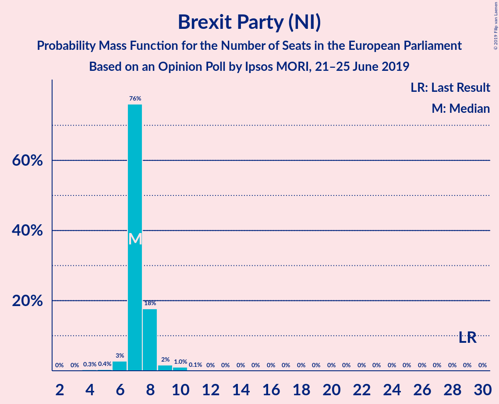
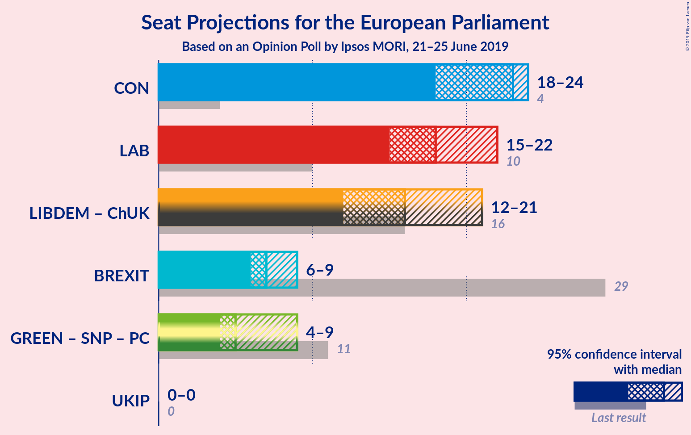
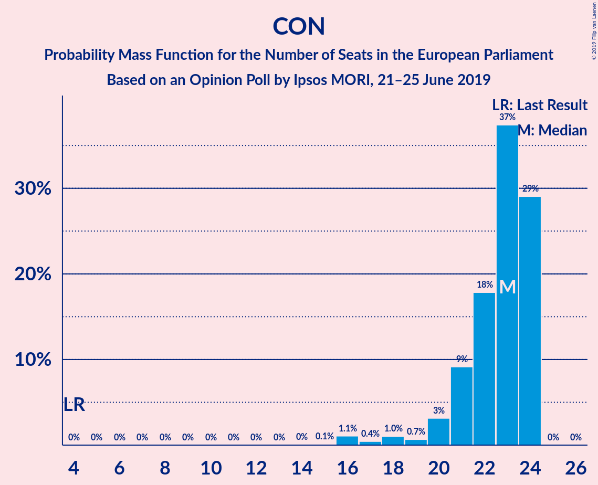
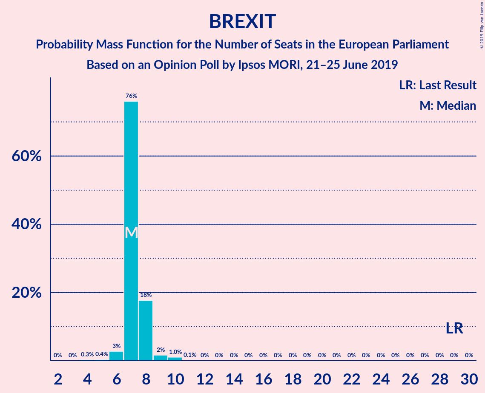
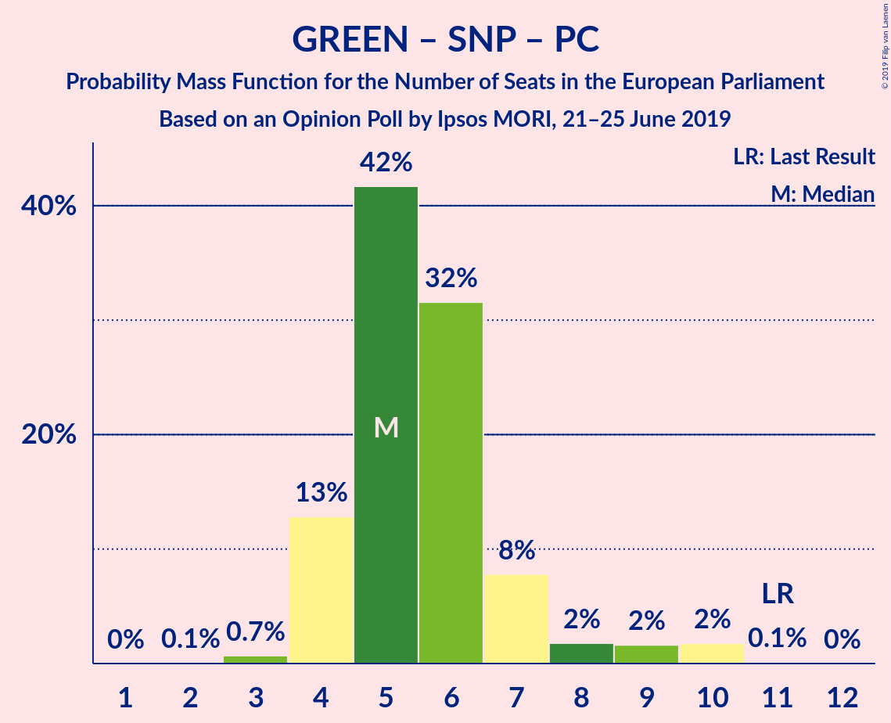

# Opinion Poll by Ipsos MORI, 21–25 June 2019

<a href="#voting-intentions">Voting Intentions</a> | <a href="#seats">Seats</a> | <a href="#coalitions">Coalitions</a> | <a href="#technical-information">Technical Information</a>

## Voting Intentions

### Confidence Intervals

| Party | Last Result | Poll Result | 80% Confidence Interval | 90% Confidence Interval | 95% Confidence Interval | 99% Confidence Interval |
|:-----:|:-----------:|:-----------:|:-----------------------:|:-----------------------:|:-----------------------:|:-----------------------:|
| Conservative Party (ECR) | 8.8% | 26.4% | 24.7–28.2% |24.2–28.7% |23.8–29.1% |23.0–30.0% |
| Labour Party (S&D) | 13.7% | 24.4% | 22.7–26.1% |22.2–26.6% |21.8–27.1% |21.1–27.9% |
| Liberal Democrats (RE) | 19.6% | 22.3% | 20.7–24.1% |20.3–24.6% |19.9–25.0% |19.2–25.8% |
| Brexit Party (NI) | 30.5% | 12.2% | 11.0–13.6% |10.6–14.0% |10.3–14.3% |9.8–15.0% |
| Green Party (Greens/EFA) | 11.8% | 8.1% | 7.1–9.3% |6.9–9.7% |6.6–10.0% |6.2–10.6% |
| Scottish National Party (Greens/EFA) | 3.5% | 4.0% | 3.3–4.9% |3.2–5.2% |3.0–5.4% |2.7–5.9% |
| Plaid Cymru (Greens/EFA) | 1.0% | 1.1% | 0.7–1.6% |0.7–1.8% |0.6–1.9% |0.5–2.2% |
| UK Independence Party (ID) | 3.2% | 1.1% | 0.7–1.6% |0.7–1.8% |0.6–1.9% |0.5–2.2% |
| Change UK (RE) | 3.3% | 0.3% | 0.2–0.6% |0.1–0.7% |0.1–0.8% |0.1–1.1% |

*Note:* The poll result column reflects the actual value used in the calculations. Published results may vary slightly, and in addition be rounded to fewer digits.

## Seats

### Confidence Intervals

| Party | Last Result | Median | 80% Confidence Interval | 90% Confidence Interval | 95% Confidence Interval | 99% Confidence Interval |
|:-----:|:-----------:|:------:|:-----------------------:|:-----------------------:|:-----------------------:|:-----------------------:|
| <a href="#conservative-party-(ecr)">Conservative Party (ECR)</a> | 4 | 23 | 21–24 |20–24 |20–24 |17–24 |
| <a href="#labour-party-(s&d)">Labour Party (S&D)</a> | 10 | 19 | 16–21 |16–22 |16–22 |15–24 |
| <a href="#liberal-democrats-(re)">Liberal Democrats (RE)</a> | 16 | 16 | 14–18 |12–20 |12–21 |12–21 |
| <a href="#brexit-party-(ni)">Brexit Party (NI)</a> | 29 | 7 | 7–8 |7–8 |7–8 |6–10 |
| <a href="#green-party-(greens/efa)">Green Party (Greens/EFA)</a> | 7 | 2 | 1–2 |1–3 |1–4 |0–6 |
| <a href="#scottish-national-party-(greens/efa)">Scottish National Party (Greens/EFA)</a> | 3 | 2 | 2–3 |2–3 |2–3 |2–3 |
| <a href="#plaid-cymru-(greens/efa)">Plaid Cymru (Greens/EFA)</a> | 1 | 1 | 1–2 |0–2 |0–2 |0–2 |
| <a href="#uk-independence-party-(id)">UK Independence Party (ID)</a> | 0 | 0 | 0 |0 |0 |0 |
| <a href="#change-uk-(re)">Change UK (RE)</a> | 0 | 0 | 0 |0 |0 |0 |

### Conservative Party (ECR)

*For a full overview of the results for this party, see the [Conservative Party (ECR)](party-conservativepartyecr.html) page.*

| Number of Seats | Probability | Accumulated | Special Marks |
|:---------------:|:-----------:|:-----------:|:-------------:|
| 4 | 0% | 100% | Last Result |
| 5 | 0% | 100% |  |
| 6 | 0% | 100% |  |
| 7 | 0% | 100% |  |
| 8 | 0% | 100% |  |
| 9 | 0% | 100% |  |
| 10 | 0% | 100% |  |
| 11 | 0% | 100% |  |
| 12 | 0% | 100% |  |
| 13 | 0% | 100% |  |
| 14 | 0% | 100% |  |
| 15 | 0.1% | 100% |  |
| 16 | 0.4% | 99.9% |  |
| 17 | 0.4% | 99.5% |  |
| 18 | 0.7% | 99.2% |  |
| 19 | 0.7% | 98% |  |
| 20 | 3% | 98% |  |
| 21 | 7% | 95% |  |
| 22 | 9% | 88% |  |
| 23 | 38% | 79% | Median |
| 24 | 40% | 40% |  |
| 25 | 0% | 0% |  |

### Labour Party (S&D)

*For a full overview of the results for this party, see the [Labour Party (S&D)](party-labourpartysd.html) page.*

| Number of Seats | Probability | Accumulated | Special Marks |
|:---------------:|:-----------:|:-----------:|:-------------:|
| 10 | 0% | 100% | Last Result |
| 11 | 0% | 100% |  |
| 12 | 0% | 100% |  |
| 13 | 0% | 100% |  |
| 14 | 0% | 100% |  |
| 15 | 2% | 100% |  |
| 16 | 23% | 98% |  |
| 17 | 14% | 75% |  |
| 18 | 10% | 60% |  |
| 19 | 33% | 50% | Median |
| 20 | 5% | 17% |  |
| 21 | 7% | 12% |  |
| 22 | 4% | 6% |  |
| 23 | 0.8% | 1.4% |  |
| 24 | 0.5% | 0.6% |  |
| 25 | 0.1% | 0.1% |  |
| 26 | 0% | 0% |  |

### Liberal Democrats (RE)

*For a full overview of the results for this party, see the [Liberal Democrats (RE)](party-liberaldemocratsre.html) page.*

| Number of Seats | Probability | Accumulated | Special Marks |
|:---------------:|:-----------:|:-----------:|:-------------:|
| 12 | 6% | 100% |  |
| 13 | 1.2% | 94% |  |
| 14 | 5% | 93% |  |
| 15 | 13% | 88% |  |
| 16 | 33% | 75% | Last Result, Median |
| 17 | 12% | 42% |  |
| 18 | 20% | 30% |  |
| 19 | 2% | 10% |  |
| 20 | 4% | 8% |  |
| 21 | 3% | 4% |  |
| 22 | 0.5% | 0.5% |  |
| 23 | 0% | 0% |  |

### Brexit Party (NI)

*For a full overview of the results for this party, see the [Brexit Party (NI)](party-brexitpartyni.html) page.*

| Number of Seats | Probability | Accumulated | Special Marks |
|:---------------:|:-----------:|:-----------:|:-------------:|
| 4 | 0.2% | 100% |  |
| 5 | 0.3% | 99.8% |  |
| 6 | 1.0% | 99.5% |  |
| 7 | 84% | 98% | Median |
| 8 | 12% | 14% |  |
| 9 | 2% | 2% |  |
| 10 | 0.5% | 0.6% |  |
| 11 | 0.1% | 0.1% |  |
| 12 | 0% | 0% |  |
| 13 | 0% | 0% |  |
| 14 | 0% | 0% |  |
| 15 | 0% | 0% |  |
| 16 | 0% | 0% |  |
| 17 | 0% | 0% |  |
| 18 | 0% | 0% |  |
| 19 | 0% | 0% |  |
| 20 | 0% | 0% |  |
| 21 | 0% | 0% |  |
| 22 | 0% | 0% |  |
| 23 | 0% | 0% |  |
| 24 | 0% | 0% |  |
| 25 | 0% | 0% |  |
| 26 | 0% | 0% |  |
| 27 | 0% | 0% |  |
| 28 | 0% | 0% |  |
| 29 | 0% | 0% | Last Result |

### Green Party (Greens/EFA)

*For a full overview of the results for this party, see the [Green Party (Greens/EFA)](party-greenpartygreensefa.html) page.*

| Number of Seats | Probability | Accumulated | Special Marks |
|:---------------:|:-----------:|:-----------:|:-------------:|
| 0 | 2% | 100% |  |
| 1 | 33% | 98% |  |
| 2 | 60% | 65% | Median |
| 3 | 2% | 6% |  |
| 4 | 0.8% | 3% |  |
| 5 | 2% | 2% |  |
| 6 | 0.4% | 0.6% |  |
| 7 | 0.2% | 0.2% | Last Result |
| 8 | 0% | 0% |  |

### Scottish National Party (Greens/EFA)

*For a full overview of the results for this party, see the [Scottish National Party (Greens/EFA)](party-scottishnationalpartygreensefa.html) page.*

| Number of Seats | Probability | Accumulated | Special Marks |
|:---------------:|:-----------:|:-----------:|:-------------:|
| 2 | 58% | 100% | Median |
| 3 | 41% | 42% | Last Result |
| 4 | 0.3% | 0.3% |  |
| 5 | 0% | 0% |  |

### Plaid Cymru (Greens/EFA)

*For a full overview of the results for this party, see the [Plaid Cymru (Greens/EFA)](party-plaidcymrugreensefa.html) page.*

| Number of Seats | Probability | Accumulated | Special Marks |
|:---------------:|:-----------:|:-----------:|:-------------:|
| 0 | 9% | 100% |  |
| 1 | 74% | 91% | Last Result, Median |
| 2 | 17% | 17% |  |
| 3 | 0% | 0% |  |

### UK Independence Party (ID)

*For a full overview of the results for this party, see the [UK Independence Party (ID)](party-ukindependencepartyid.html) page.*

| Number of Seats | Probability | Accumulated | Special Marks |
|:---------------:|:-----------:|:-----------:|:-------------:|
| 0 | 100% | 100% | Last Result, Median |

### Change UK (RE)

*For a full overview of the results for this party, see the [Change UK (RE)](party-changeukre.html) page.*

| Number of Seats | Probability | Accumulated | Special Marks |
|:---------------:|:-----------:|:-----------:|:-------------:|
| 0 | 100% | 100% | Last Result, Median |

## Coalitions

### Confidence Intervals

| Coalition | Last Result | Median | Majority? | 80% Confidence Interval | 90% Confidence Interval | 95% Confidence Interval | 99% Confidence Interval |
|:---------:|:-----------:|:------:|:---------:|:-----------------------:|:-----------------------:|:-----------------------:|:-----------------------:|
| Conservative Party (ECR) | 4 | 23 | 0% | 21–24 | 20–24 | 20–24 | 17–24 |
| Labour Party (S&D) | 10 | 19 | 0% | 16–21 | 16–22 | 16–22 | 15–24 |
| Liberal Democrats (RE) – Change UK (RE) | 16 | 16 | 0% | 14–18 | 12–20 | 12–21 | 12–21 |
| Brexit Party (NI) | 29 | 7 | 0% | 7–8 | 7–8 | 7–8 | 6–10 |
| Green Party (Greens/EFA) – Scottish National Party (Greens/EFA) – Plaid Cymru (Greens/EFA) | 11 | 5 | 0% | 4–6 | 4–7 | 4–8 | 4–9 |
| UK Independence Party (ID) | 0 | 0 | 0% | 0 | 0 | 0 | 0 |

### Conservative Party (ECR)

| Number of Seats | Probability | Accumulated | Special Marks |
|:---------------:|:-----------:|:-----------:|:-------------:|
| 4 | 0% | 100% | Last Result |
| 5 | 0% | 100% |  |
| 6 | 0% | 100% |  |
| 7 | 0% | 100% |  |
| 8 | 0% | 100% |  |
| 9 | 0% | 100% |  |
| 10 | 0% | 100% |  |
| 11 | 0% | 100% |  |
| 12 | 0% | 100% |  |
| 13 | 0% | 100% |  |
| 14 | 0% | 100% |  |
| 15 | 0.1% | 100% |  |
| 16 | 0.4% | 99.9% |  |
| 17 | 0.4% | 99.5% |  |
| 18 | 0.7% | 99.2% |  |
| 19 | 0.7% | 98% |  |
| 20 | 3% | 98% |  |
| 21 | 7% | 95% |  |
| 22 | 9% | 88% |  |
| 23 | 38% | 79% | Median |
| 24 | 40% | 40% |  |
| 25 | 0% | 0% |  |

### Labour Party (S&D)

| Number of Seats | Probability | Accumulated | Special Marks |
|:---------------:|:-----------:|:-----------:|:-------------:|
| 10 | 0% | 100% | Last Result |
| 11 | 0% | 100% |  |
| 12 | 0% | 100% |  |
| 13 | 0% | 100% |  |
| 14 | 0% | 100% |  |
| 15 | 2% | 100% |  |
| 16 | 23% | 98% |  |
| 17 | 14% | 75% |  |
| 18 | 10% | 60% |  |
| 19 | 33% | 50% | Median |
| 20 | 5% | 17% |  |
| 21 | 7% | 12% |  |
| 22 | 4% | 6% |  |
| 23 | 0.8% | 1.4% |  |
| 24 | 0.5% | 0.6% |  |
| 25 | 0.1% | 0.1% |  |
| 26 | 0% | 0% |  |

### Liberal Democrats (RE) – Change UK (RE)

| Number of Seats | Probability | Accumulated | Special Marks |
|:---------------:|:-----------:|:-----------:|:-------------:|
| 12 | 6% | 100% |  |
| 13 | 1.2% | 94% |  |
| 14 | 5% | 93% |  |
| 15 | 13% | 88% |  |
| 16 | 33% | 75% | Last Result, Median |
| 17 | 12% | 42% |  |
| 18 | 20% | 30% |  |
| 19 | 2% | 10% |  |
| 20 | 4% | 8% |  |
| 21 | 3% | 4% |  |
| 22 | 0.5% | 0.5% |  |
| 23 | 0% | 0% |  |

### Brexit Party (NI)

| Number of Seats | Probability | Accumulated | Special Marks |
|:---------------:|:-----------:|:-----------:|:-------------:|
| 4 | 0.2% | 100% |  |
| 5 | 0.3% | 99.8% |  |
| 6 | 1.0% | 99.5% |  |
| 7 | 84% | 98% | Median |
| 8 | 12% | 14% |  |
| 9 | 2% | 2% |  |
| 10 | 0.5% | 0.6% |  |
| 11 | 0.1% | 0.1% |  |
| 12 | 0% | 0% |  |
| 13 | 0% | 0% |  |
| 14 | 0% | 0% |  |
| 15 | 0% | 0% |  |
| 16 | 0% | 0% |  |
| 17 | 0% | 0% |  |
| 18 | 0% | 0% |  |
| 19 | 0% | 0% |  |
| 20 | 0% | 0% |  |
| 21 | 0% | 0% |  |
| 22 | 0% | 0% |  |
| 23 | 0% | 0% |  |
| 24 | 0% | 0% |  |
| 25 | 0% | 0% |  |
| 26 | 0% | 0% |  |
| 27 | 0% | 0% |  |
| 28 | 0% | 0% |  |
| 29 | 0% | 0% | Last Result |

### Green Party (Greens/EFA) – Scottish National Party (Greens/EFA) – Plaid Cymru (Greens/EFA)

| Number of Seats | Probability | Accumulated | Special Marks |
|:---------------:|:-----------:|:-----------:|:-------------:|
| 2 | 0.1% | 100% |  |
| 3 | 0.4% | 99.9% |  |
| 4 | 20% | 99.6% |  |
| 5 | 48% | 80% | Median |
| 6 | 23% | 32% |  |
| 7 | 6% | 9% |  |
| 8 | 2% | 3% |  |
| 9 | 1.0% | 1.4% |  |
| 10 | 0.3% | 0.4% |  |
| 11 | 0.1% | 0.1% | Last Result |
| 12 | 0% | 0% |  |

### UK Independence Party (ID)

| Number of Seats | Probability | Accumulated | Special Marks |
|:---------------:|:-----------:|:-----------:|:-------------:|
| 0 | 100% | 100% | Last Result, Median |

## Technical Information

### Opinion Poll

+ **Polling firm:** Ipsos MORI
+ **Commissioner(s):** —
+ **Fieldwork period:** 21–25 June 2019

### Calculations

+ **Sample size:** 1043
+ **Simulations done:** 524,288
+ **Error estimate:** 2.87%

