# Opinion Poll by YouGov for The Times, 24–25 June 2019

<a href="#voting-intentions">Voting Intentions</a> | <a href="#seats">Seats</a> | <a href="#coalitions">Coalitions</a> | <a href="#technical-information">Technical Information</a>

## Voting Intentions

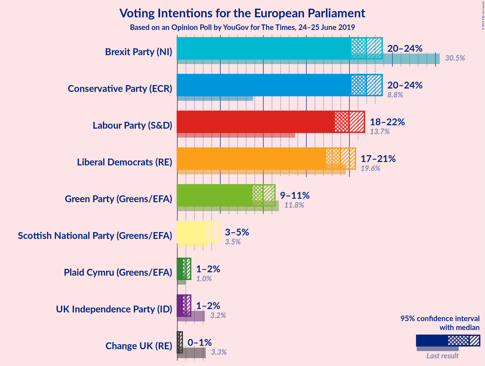

### Confidence Intervals

| Party | Last Result | Poll Result | 80% Confidence Interval | 90% Confidence Interval | 95% Confidence Interval | 99% Confidence Interval |
|:-----:|:-----------:|:-----------:|:-----------------------:|:-----------------------:|:-----------------------:|:-----------------------:|
| Conservative Party (ECR) | 8.8% | 22.0% | 20.8–23.2% |20.5–23.5% |20.2–23.8% |19.7–24.4% |
| Brexit Party (NI) | 30.5% | 22.0% | 20.8–23.2% |20.5–23.5% |20.2–23.8% |19.7–24.4% |
| Labour Party (S&D) | 13.7% | 20.0% | 18.9–21.1% |18.5–21.5% |18.3–21.7% |17.8–22.3% |
| Liberal Democrats (RE) | 19.6% | 18.9% | 17.9–20.1% |17.6–20.4% |17.3–20.7% |16.8–21.3% |
| Green Party (Greens/EFA) | 11.8% | 10.0% | 9.1–10.9% |8.9–11.1% |8.7–11.3% |8.4–11.8% |
| Scottish National Party (Greens/EFA) | 3.5% | 4.0% | 3.5–4.6% |3.3–4.8% |3.2–4.9% |3.0–5.2% |
| Plaid Cymru (Greens/EFA) | 1.0% | 1.0% | 0.8–1.4% |0.7–1.5% |0.7–1.6% |0.6–1.8% |
| UK Independence Party (ID) | 3.2% | 1.0% | 0.8–1.4% |0.7–1.5% |0.7–1.6% |0.6–1.8% |
| Change UK (RE) | 3.3% | 0.2% | 0.2–0.5% |0.1–0.5% |0.1–0.6% |0.1–0.7% |

*Note:* The poll result column reflects the actual value used in the calculations. Published results may vary slightly, and in addition be rounded to fewer digits.

## Seats

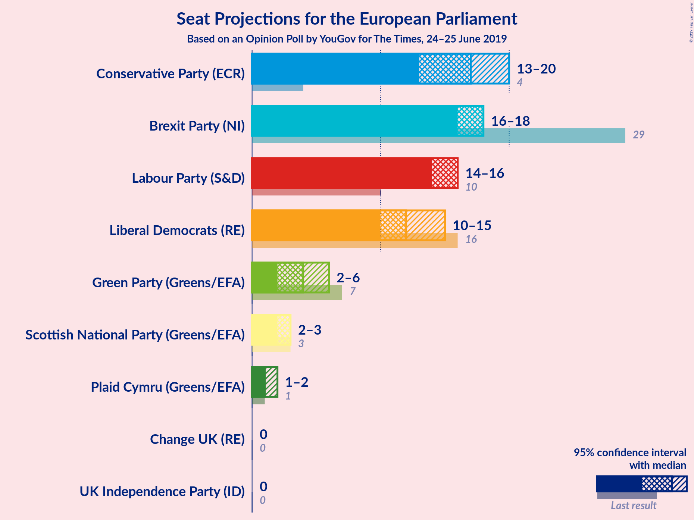

### Confidence Intervals

| Party | Last Result | Median | 80% Confidence Interval | 90% Confidence Interval | 95% Confidence Interval | 99% Confidence Interval |
|:-----:|:-----------:|:------:|:-----------------------:|:-----------------------:|:-----------------------:|:-----------------------:|
| <a href="#conservative-party-(ecr)">Conservative Party (ECR)</a> | 4 | 17 | 14–19 |14–19 |13–20 |12–20 |
| <a href="#brexit-party-(ni)">Brexit Party (NI)</a> | 29 | 18 | 16–18 |16–18 |16–18 |15–18 |
| <a href="#labour-party-(s&d)">Labour Party (S&D)</a> | 10 | 16 | 15–16 |14–16 |14–16 |12–17 |
| <a href="#liberal-democrats-(re)">Liberal Democrats (RE)</a> | 16 | 12 | 10–15 |10–15 |10–15 |10–16 |
| <a href="#green-party-(greens/efa)">Green Party (Greens/EFA)</a> | 7 | 4 | 3–6 |2–6 |2–6 |2–6 |
| <a href="#scottish-national-party-(greens/efa)">Scottish National Party (Greens/EFA)</a> | 3 | 3 | 2–3 |2–3 |2–3 |2–4 |
| <a href="#plaid-cymru-(greens/efa)">Plaid Cymru (Greens/EFA)</a> | 1 | 1 | 1 |1 |1–2 |0–2 |
| <a href="#uk-independence-party-(id)">UK Independence Party (ID)</a> | 0 | 0 | 0 |0 |0 |0 |
| <a href="#change-uk-(re)">Change UK (RE)</a> | 0 | 0 | 0 |0 |0 |0 |

### Conservative Party (ECR)

*For a full overview of the results for this party, see the [Conservative Party (ECR)](party-conservativepartyecr.html) page.*

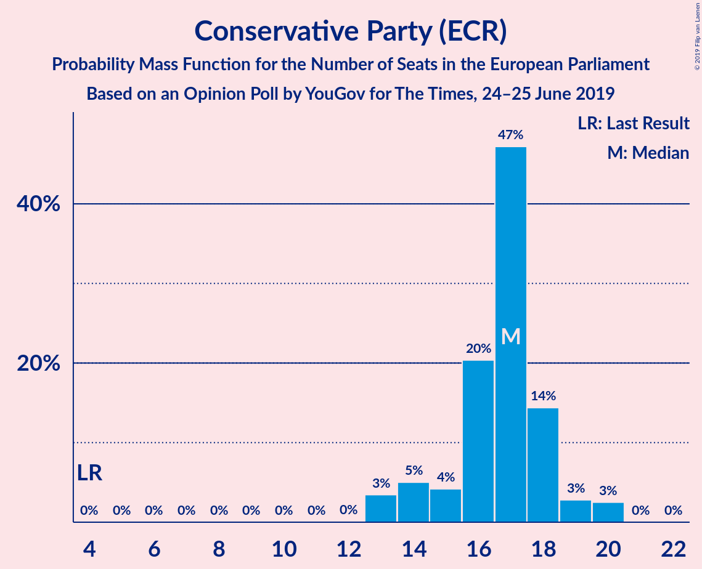

| Number of Seats | Probability | Accumulated | Special Marks |
|:---------------:|:-----------:|:-----------:|:-------------:|
| 4 | 0% | 100% | Last Result |
| 5 | 0% | 100% |  |
| 6 | 0% | 100% |  |
| 7 | 0% | 100% |  |
| 8 | 0% | 100% |  |
| 9 | 0% | 100% |  |
| 10 | 0% | 100% |  |
| 11 | 0% | 100% |  |
| 12 | 0.6% | 100% |  |
| 13 | 3% | 99.4% |  |
| 14 | 12% | 96% |  |
| 15 | 7% | 85% |  |
| 16 | 18% | 78% |  |
| 17 | 34% | 59% | Median |
| 18 | 12% | 26% |  |
| 19 | 11% | 14% |  |
| 20 | 3% | 3% |  |
| 21 | 0% | 0% |  |

### Brexit Party (NI)

*For a full overview of the results for this party, see the [Brexit Party (NI)](party-brexitpartyni.html) page.*

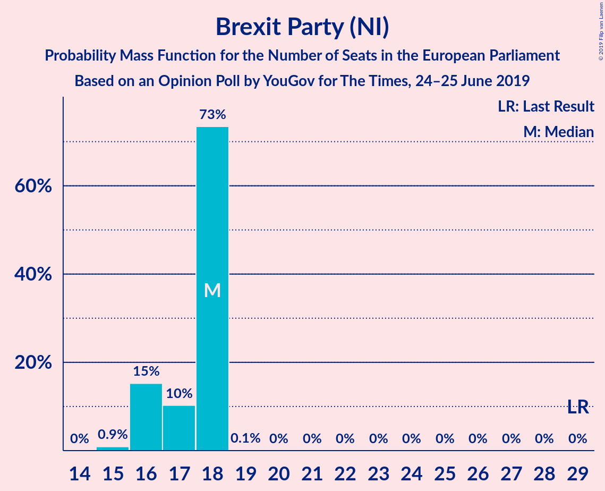

| Number of Seats | Probability | Accumulated | Special Marks |
|:---------------:|:-----------:|:-----------:|:-------------:|
| 14 | 0% | 100% |  |
| 15 | 1.1% | 99.9% |  |
| 16 | 25% | 98.9% |  |
| 17 | 18% | 74% |  |
| 18 | 56% | 56% | Median |
| 19 | 0.1% | 0.1% |  |
| 20 | 0% | 0% |  |
| 21 | 0% | 0% |  |
| 22 | 0% | 0% |  |
| 23 | 0% | 0% |  |
| 24 | 0% | 0% |  |
| 25 | 0% | 0% |  |
| 26 | 0% | 0% |  |
| 27 | 0% | 0% |  |
| 28 | 0% | 0% |  |
| 29 | 0% | 0% | Last Result |

### Labour Party (S&D)

*For a full overview of the results for this party, see the [Labour Party (S&D)](party-labourpartysd.html) page.*

| Number of Seats | Probability | Accumulated | Special Marks |
|:---------------:|:-----------:|:-----------:|:-------------:|
| 10 | 0% | 100% | Last Result |
| 11 | 0.1% | 100% |  |
| 12 | 0.5% | 99.9% |  |
| 13 | 1.1% | 99.4% |  |
| 14 | 8% | 98% |  |
| 15 | 36% | 90% |  |
| 16 | 54% | 54% | Median |
| 17 | 0.4% | 0.5% |  |
| 18 | 0.1% | 0.1% |  |
| 19 | 0% | 0% |  |

### Liberal Democrats (RE)

*For a full overview of the results for this party, see the [Liberal Democrats (RE)](party-liberaldemocratsre.html) page.*

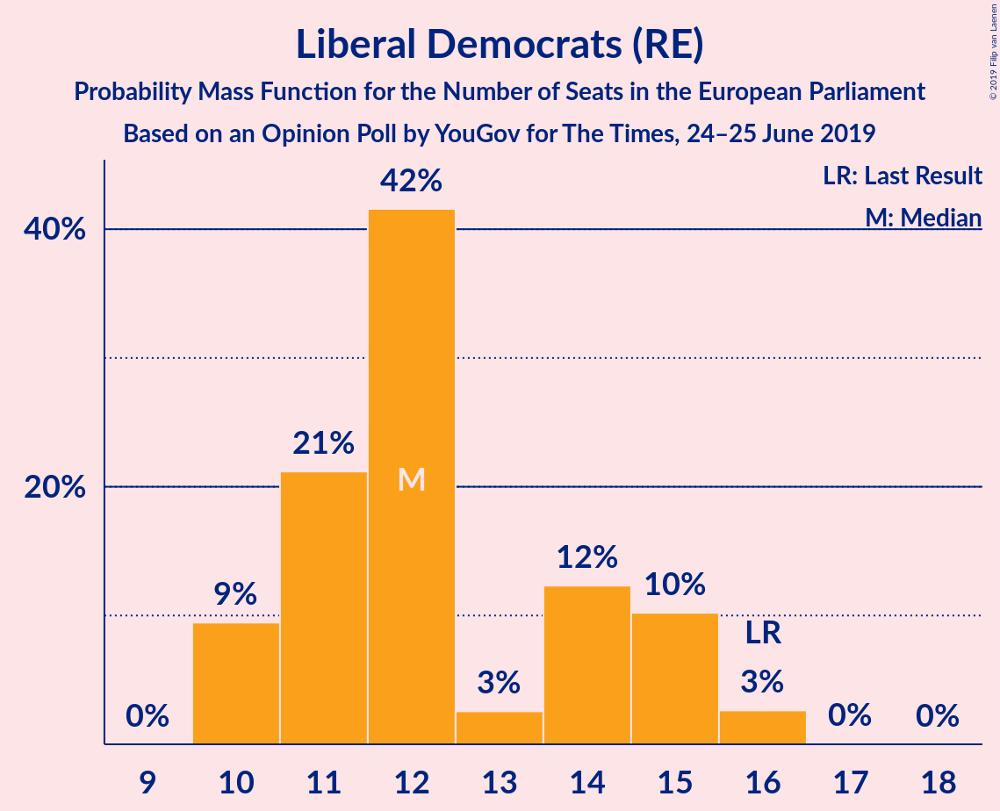

| Number of Seats | Probability | Accumulated | Special Marks |
|:---------------:|:-----------:|:-----------:|:-------------:|
| 10 | 13% | 100% |  |
| 11 | 17% | 87% |  |
| 12 | 23% | 71% | Median |
| 13 | 9% | 48% |  |
| 14 | 22% | 38% |  |
| 15 | 16% | 17% |  |
| 16 | 0.8% | 0.9% | Last Result |
| 17 | 0.1% | 0.1% |  |
| 18 | 0% | 0% |  |

### Green Party (Greens/EFA)

*For a full overview of the results for this party, see the [Green Party (Greens/EFA)](party-greenpartygreensefa.html) page.*

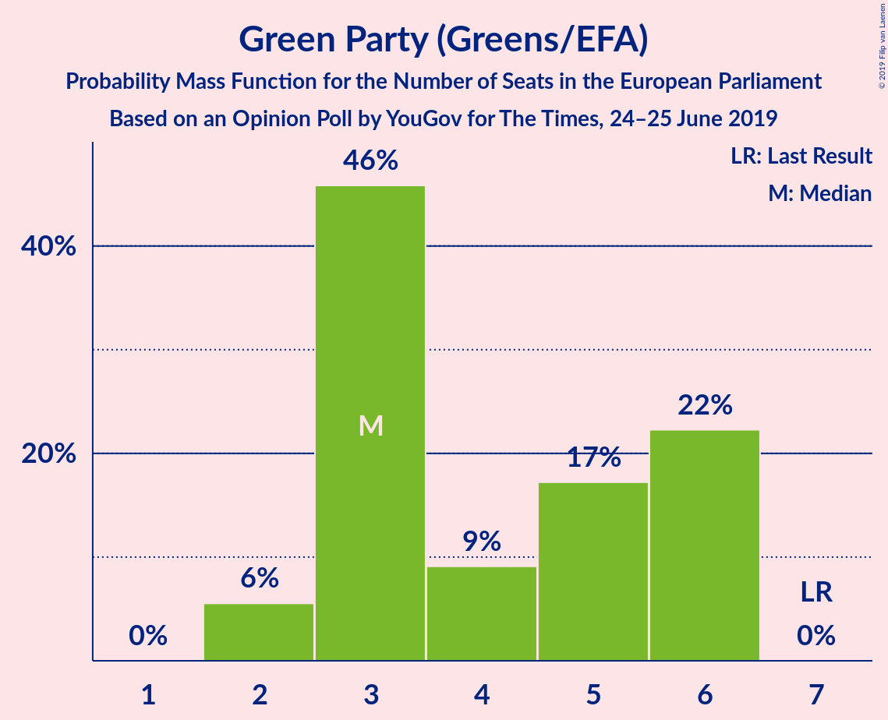

| Number of Seats | Probability | Accumulated | Special Marks |
|:---------------:|:-----------:|:-----------:|:-------------:|
| 2 | 9% | 100% |  |
| 3 | 18% | 91% |  |
| 4 | 34% | 73% | Median |
| 5 | 21% | 39% |  |
| 6 | 18% | 18% |  |
| 7 | 0% | 0% | Last Result |

### Scottish National Party (Greens/EFA)

*For a full overview of the results for this party, see the [Scottish National Party (Greens/EFA)](party-scottishnationalpartygreensefa.html) page.*

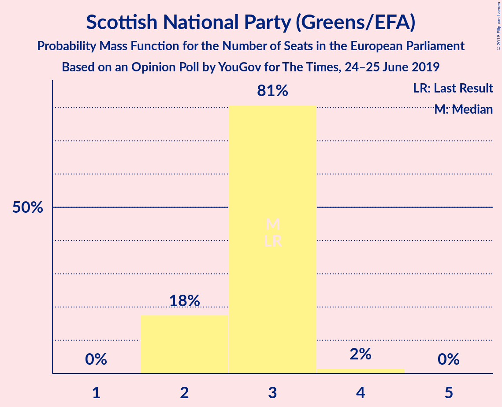

| Number of Seats | Probability | Accumulated | Special Marks |
|:---------------:|:-----------:|:-----------:|:-------------:|
| 2 | 18% | 100% |  |
| 3 | 81% | 82% | Last Result, Median |
| 4 | 2% | 2% |  |
| 5 | 0% | 0% |  |

### Plaid Cymru (Greens/EFA)

*For a full overview of the results for this party, see the [Plaid Cymru (Greens/EFA)](party-plaidcymrugreensefa.html) page.*

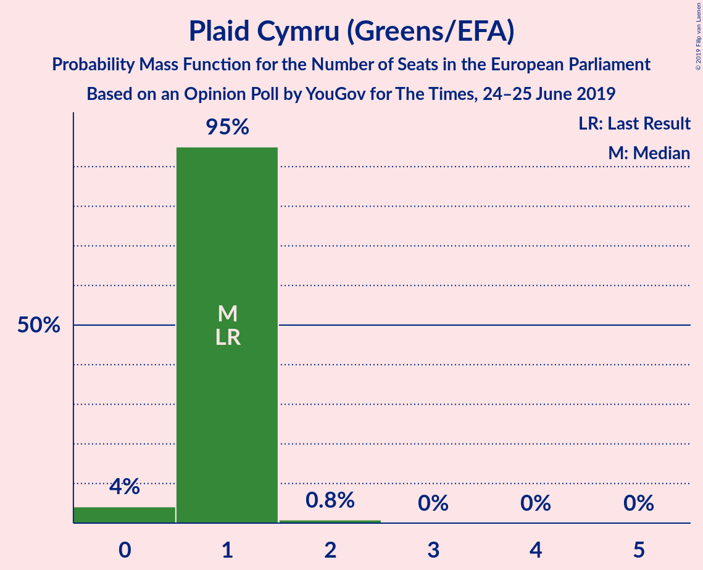

| Number of Seats | Probability | Accumulated | Special Marks |
|:---------------:|:-----------:|:-----------:|:-------------:|
| 0 | 2% | 100% |  |
| 1 | 94% | 98% | Last Result, Median |
| 2 | 3% | 3% |  |
| 3 | 0% | 0% |  |

### UK Independence Party (ID)

*For a full overview of the results for this party, see the [UK Independence Party (ID)](party-ukindependencepartyid.html) page.*

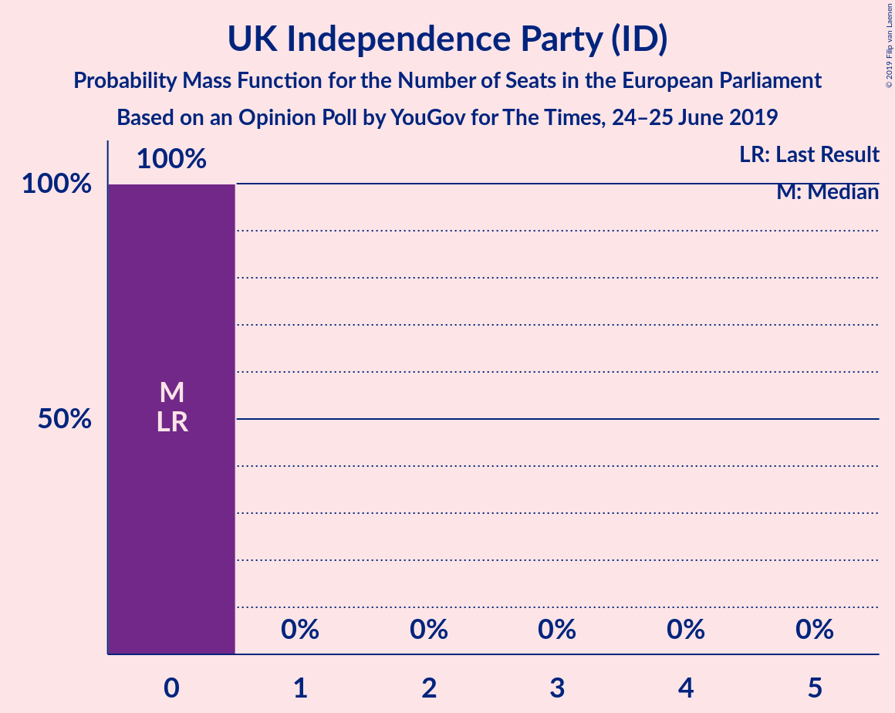

| Number of Seats | Probability | Accumulated | Special Marks |
|:---------------:|:-----------:|:-----------:|:-------------:|
| 0 | 100% | 100% | Last Result, Median |

### Change UK (RE)

*For a full overview of the results for this party, see the [Change UK (RE)](party-changeukre.html) page.*

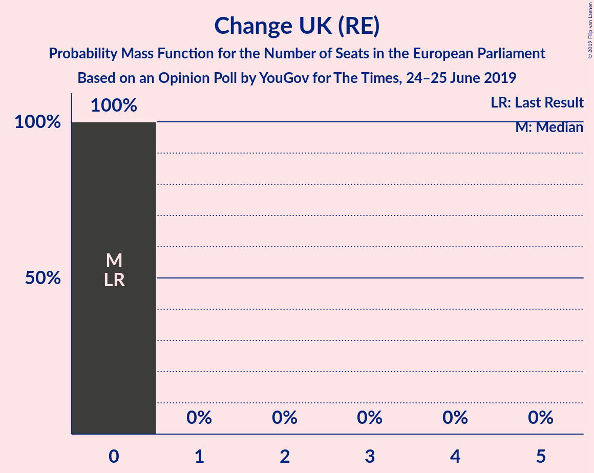

| Number of Seats | Probability | Accumulated | Special Marks |
|:---------------:|:-----------:|:-----------:|:-------------:|
| 0 | 100% | 100% | Last Result, Median |

## Coalitions

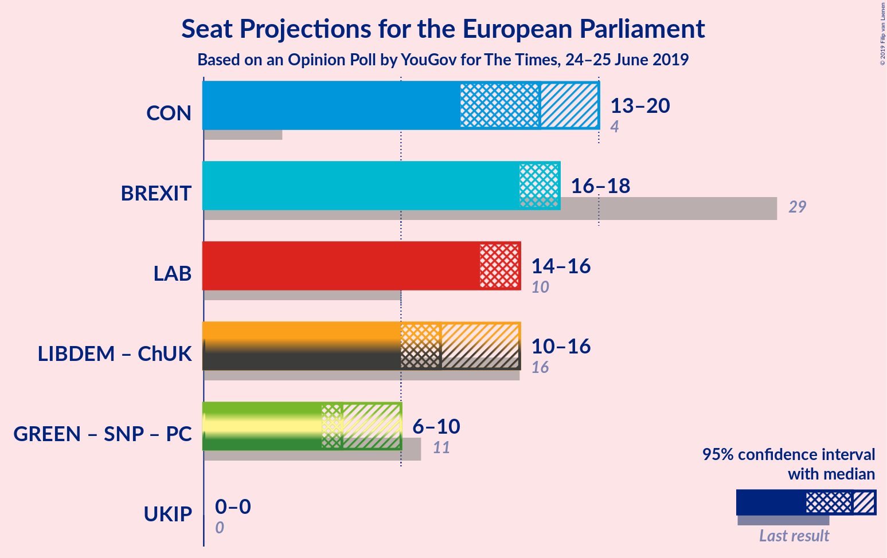

### Confidence Intervals

| Coalition | Last Result | Median | Majority? | 80% Confidence Interval | 90% Confidence Interval | 95% Confidence Interval | 99% Confidence Interval |
|:---------:|:-----------:|:------:|:---------:|:-----------------------:|:-----------------------:|:-----------------------:|:-----------------------:|
| Conservative Party (ECR) | 4 | 17 | 0% | 14–19 | 14–19 | 13–20 | 12–20 |
| Brexit Party (NI) | 29 | 18 | 0% | 16–18 | 16–18 | 16–18 | 15–18 |
| Labour Party (S&D) | 10 | 16 | 0% | 15–16 | 14–16 | 14–16 | 12–17 |
| Liberal Democrats (RE) – Change UK (RE) | 16 | 12 | 0% | 10–15 | 10–15 | 10–15 | 10–16 |
| Green Party (Greens/EFA) – Scottish National Party (Greens/EFA) – Plaid Cymru (Greens/EFA) | 11 | 8 | 0% | 6–10 | 6–10 | 5–10 | 4–11 |
| UK Independence Party (ID) | 0 | 0 | 0% | 0 | 0 | 0 | 0 |

### Conservative Party (ECR)

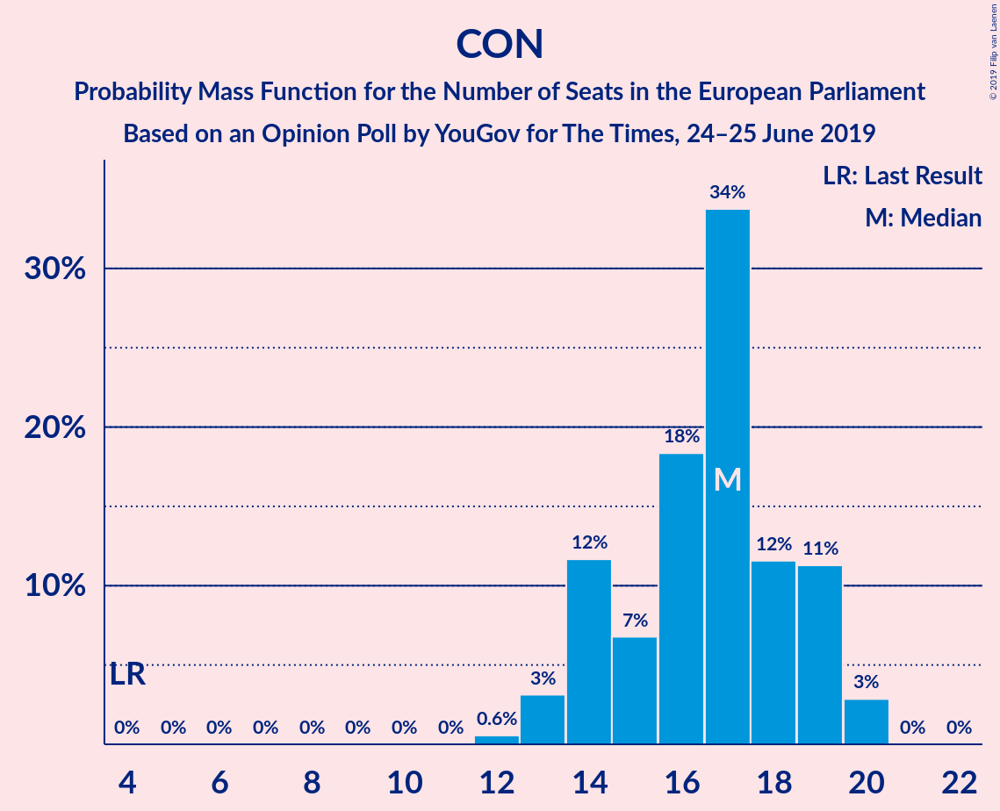

| Number of Seats | Probability | Accumulated | Special Marks |
|:---------------:|:-----------:|:-----------:|:-------------:|
| 4 | 0% | 100% | Last Result |
| 5 | 0% | 100% |  |
| 6 | 0% | 100% |  |
| 7 | 0% | 100% |  |
| 8 | 0% | 100% |  |
| 9 | 0% | 100% |  |
| 10 | 0% | 100% |  |
| 11 | 0% | 100% |  |
| 12 | 0.6% | 100% |  |
| 13 | 3% | 99.4% |  |
| 14 | 12% | 96% |  |
| 15 | 7% | 85% |  |
| 16 | 18% | 78% |  |
| 17 | 34% | 59% | Median |
| 18 | 12% | 26% |  |
| 19 | 11% | 14% |  |
| 20 | 3% | 3% |  |
| 21 | 0% | 0% |  |

### Brexit Party (NI)

| Number of Seats | Probability | Accumulated | Special Marks |
|:---------------:|:-----------:|:-----------:|:-------------:|
| 14 | 0% | 100% |  |
| 15 | 1.1% | 99.9% |  |
| 16 | 25% | 98.9% |  |
| 17 | 18% | 74% |  |
| 18 | 56% | 56% | Median |
| 19 | 0.1% | 0.1% |  |
| 20 | 0% | 0% |  |
| 21 | 0% | 0% |  |
| 22 | 0% | 0% |  |
| 23 | 0% | 0% |  |
| 24 | 0% | 0% |  |
| 25 | 0% | 0% |  |
| 26 | 0% | 0% |  |
| 27 | 0% | 0% |  |
| 28 | 0% | 0% |  |
| 29 | 0% | 0% | Last Result |

### Labour Party (S&D)

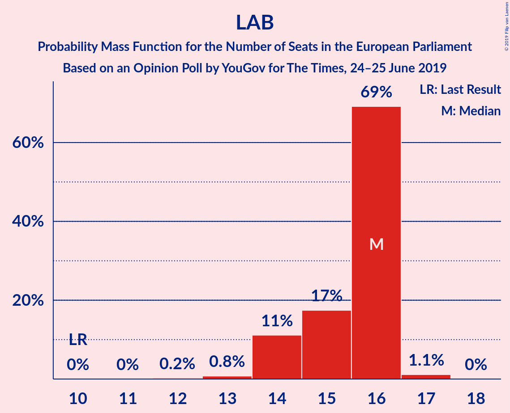

| Number of Seats | Probability | Accumulated | Special Marks |
|:---------------:|:-----------:|:-----------:|:-------------:|
| 10 | 0% | 100% | Last Result |
| 11 | 0.1% | 100% |  |
| 12 | 0.5% | 99.9% |  |
| 13 | 1.1% | 99.4% |  |
| 14 | 8% | 98% |  |
| 15 | 36% | 90% |  |
| 16 | 54% | 54% | Median |
| 17 | 0.4% | 0.5% |  |
| 18 | 0.1% | 0.1% |  |
| 19 | 0% | 0% |  |

### Liberal Democrats (RE) – Change UK (RE)

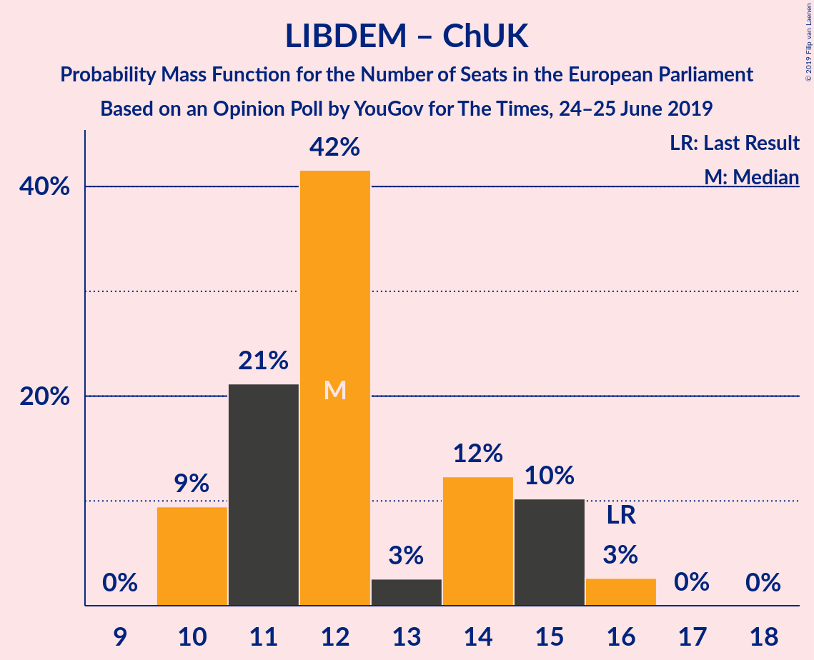

| Number of Seats | Probability | Accumulated | Special Marks |
|:---------------:|:-----------:|:-----------:|:-------------:|
| 10 | 13% | 100% |  |
| 11 | 17% | 87% |  |
| 12 | 23% | 71% | Median |
| 13 | 9% | 48% |  |
| 14 | 22% | 38% |  |
| 15 | 16% | 17% |  |
| 16 | 0.8% | 0.9% | Last Result |
| 17 | 0.1% | 0.1% |  |
| 18 | 0% | 0% |  |

### Green Party (Greens/EFA) – Scottish National Party (Greens/EFA) – Plaid Cymru (Greens/EFA)

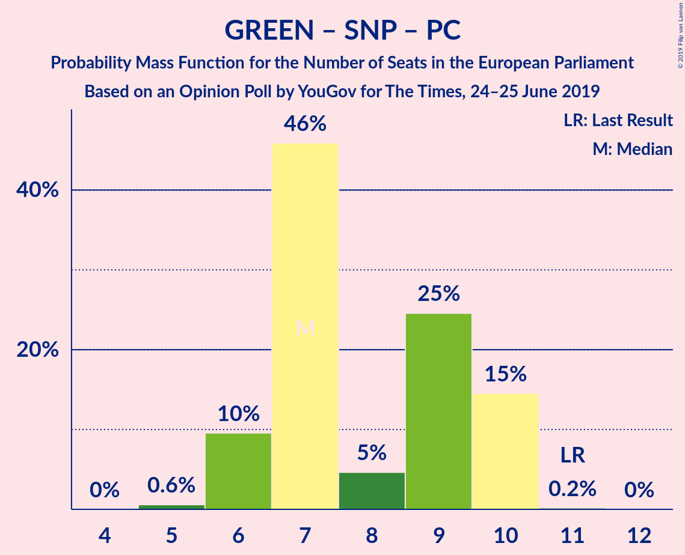

| Number of Seats | Probability | Accumulated | Special Marks |
|:---------------:|:-----------:|:-----------:|:-------------:|
| 4 | 0.7% | 100% |  |
| 5 | 2% | 99.3% |  |
| 6 | 8% | 97% |  |
| 7 | 21% | 89% |  |
| 8 | 31% | 68% | Median |
| 9 | 22% | 37% |  |
| 10 | 14% | 15% |  |
| 11 | 0.9% | 0.9% | Last Result |
| 12 | 0% | 0% |  |

### UK Independence Party (ID)

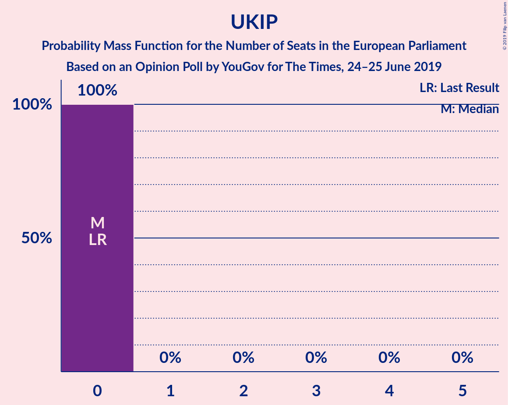

| Number of Seats | Probability | Accumulated | Special Marks |
|:---------------:|:-----------:|:-----------:|:-------------:|
| 0 | 100% | 100% | Last Result, Median |

## Technical Information

### Opinion Poll

+ **Polling firm:** YouGov
+ **Commissioner(s):** The Times
+ **Fieldwork period:** 24–25 June 2019

### Calculations

+ **Sample size:** 2059
+ **Simulations done:** 1,048,576
+ **Error estimate:** 0.91%

