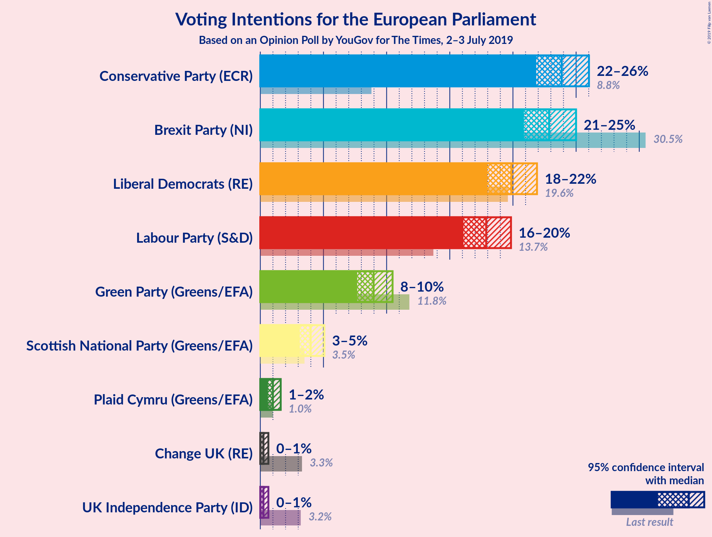
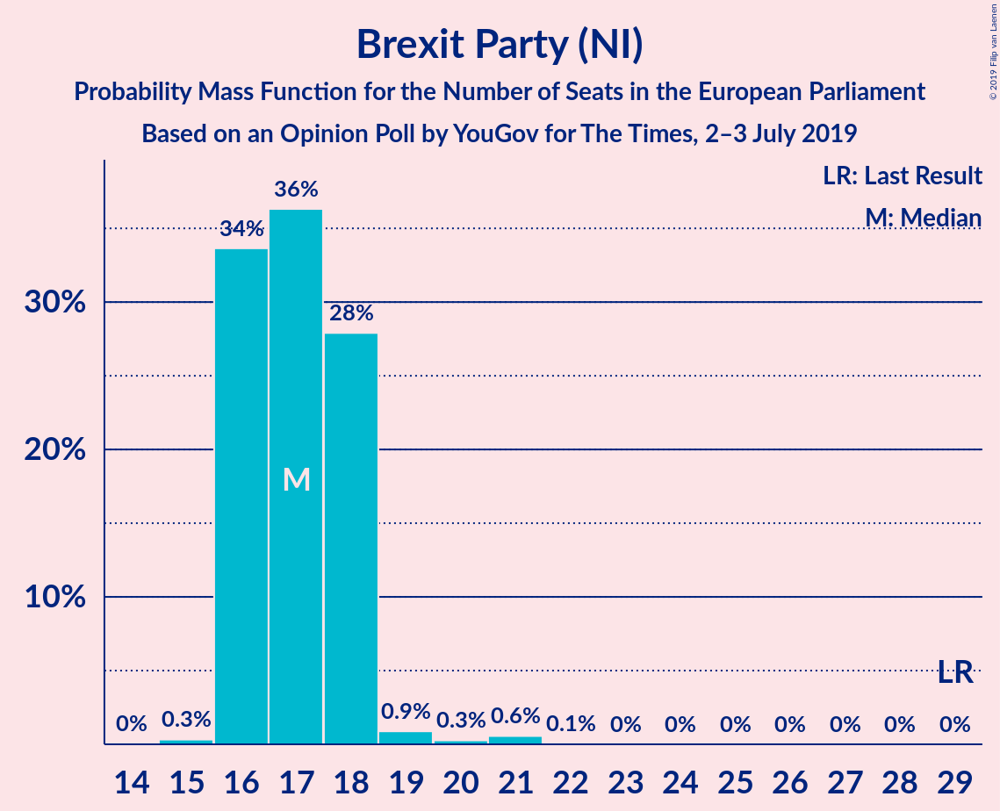
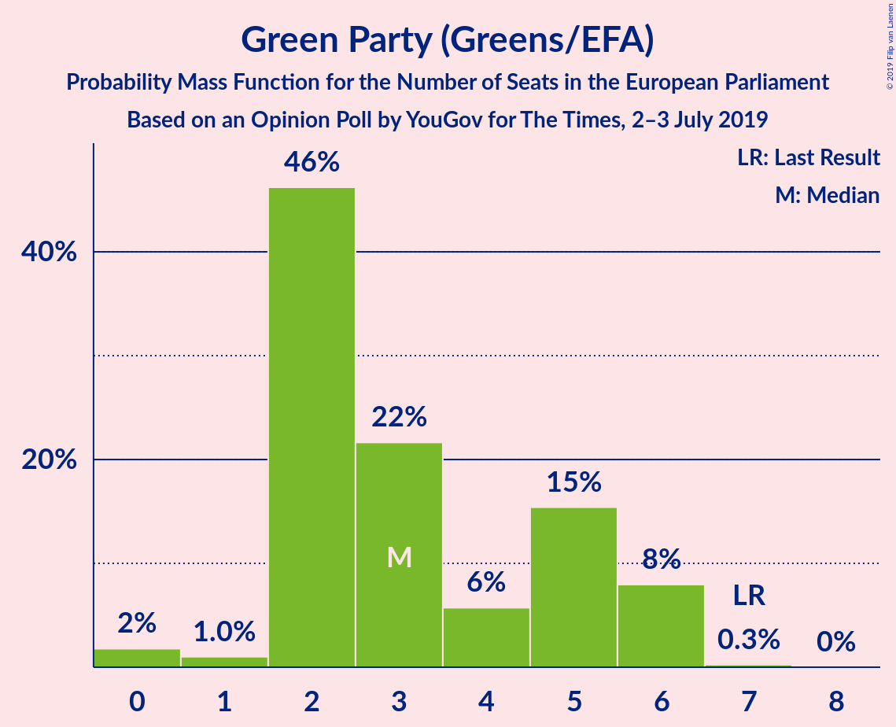
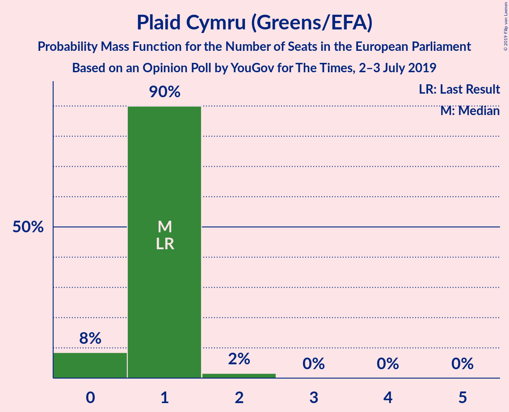
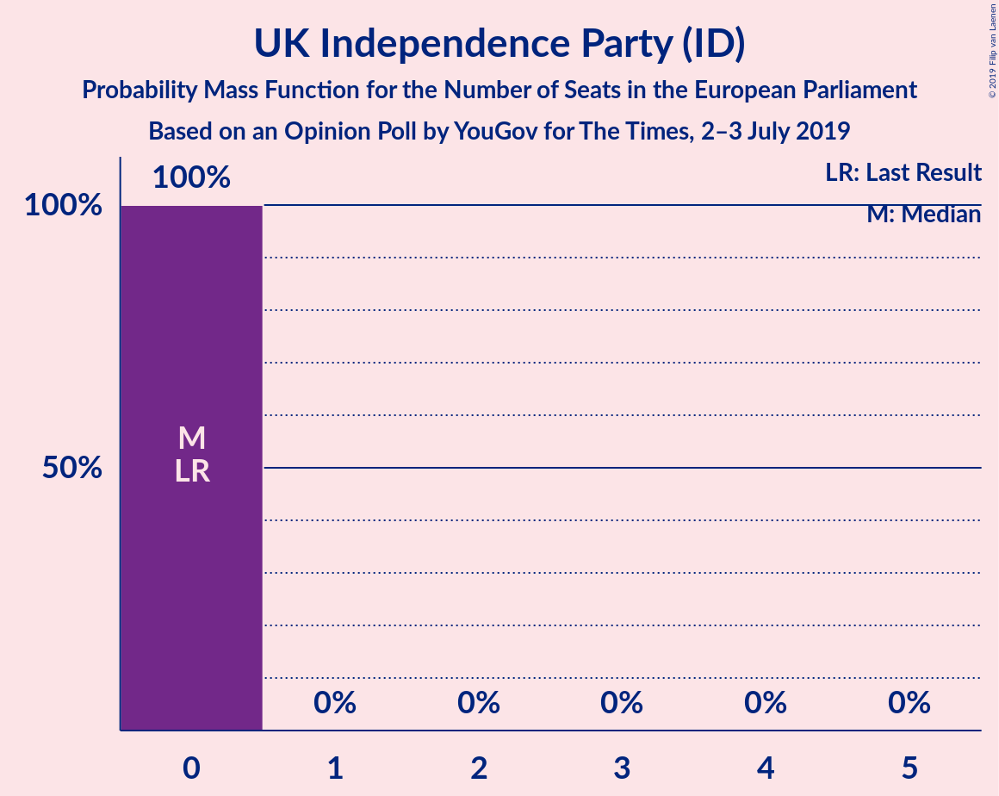

# Opinion Poll by YouGov for The Times, 2–3 July 2019

<a href="#voting-intentions">Voting Intentions</a> | <a href="#seats">Seats</a> | <a href="#coalitions">Coalitions</a> | <a href="#technical-information">Technical Information</a>

## Voting Intentions

### Confidence Intervals

| Party | Last Result | Poll Result | 80% Confidence Interval | 90% Confidence Interval | 95% Confidence Interval | 99% Confidence Interval |
|:-----:|:-----------:|:-----------:|:-----------------------:|:-----------------------:|:-----------------------:|:-----------------------:|
| Conservative Party (ECR) | 8.8% | 23.9% | 22.5–25.3% |22.2–25.7% |21.8–26.0% |21.2–26.7% |
| Brexit Party (NI) | 30.5% | 22.9% | 21.6–24.3% |21.2–24.6% |20.9–25.0% |20.3–25.7% |
| Liberal Democrats (RE) | 19.6% | 19.9% | 18.6–21.2% |18.3–21.6% |18.0–21.9% |17.4–22.6% |
| Labour Party (S&D) | 13.7% | 17.9% | 16.7–19.2% |16.4–19.5% |16.1–19.8% |15.5–20.5% |
| Green Party (Greens/EFA) | 11.8% | 9.0% | 8.1–10.0% |7.9–10.2% |7.7–10.5% |7.3–11.0% |
| Scottish National Party (Greens/EFA) | 3.5% | 4.0% | 3.4–4.7% |3.3–4.9% |3.1–5.1% |2.9–5.4% |
| Plaid Cymru (Greens/EFA) | 1.0% | 1.0% | 0.7–1.4% |0.7–1.5% |0.6–1.6% |0.5–1.8% |
| UK Independence Party (ID) | 3.2% | 0.2% | 0.1–0.5% |0.1–0.6% |0.1–0.6% |0.1–0.8% |
| Change UK (RE) | 3.3% | 0.2% | 0.1–0.5% |0.1–0.6% |0.1–0.6% |0.1–0.8% |

*Note:* The poll result column reflects the actual value used in the calculations. Published results may vary slightly, and in addition be rounded to fewer digits.

## Seats

### Confidence Intervals

| Party | Last Result | Median | 80% Confidence Interval | 90% Confidence Interval | 95% Confidence Interval | 99% Confidence Interval |
|:-----:|:-----------:|:------:|:-----------------------:|:-----------------------:|:-----------------------:|:-----------------------:|
| <a href="#conservative-party-(ecr)">Conservative Party (ECR)</a> | 4 | 19 | 18–20 |16–21 |14–21 |14–21 |
| <a href="#brexit-party-(ni)">Brexit Party (NI)</a> | 29 | 17 | 16–18 |16–18 |16–18 |16–21 |
| <a href="#liberal-democrats-(re)">Liberal Democrats (RE)</a> | 16 | 13 | 12–15 |11–15 |11–16 |10–17 |
| <a href="#labour-party-(s&d)">Labour Party (S&D)</a> | 10 | 14 | 12–16 |11–16 |10–16 |9–16 |
| <a href="#green-party-(greens/efa)">Green Party (Greens/EFA)</a> | 7 | 3 | 2–5 |2–6 |1–6 |0–6 |
| <a href="#scottish-national-party-(greens/efa)">Scottish National Party (Greens/EFA)</a> | 3 | 3 | 3 |2–3 |2–3 |2–4 |
| <a href="#plaid-cymru-(greens/efa)">Plaid Cymru (Greens/EFA)</a> | 1 | 1 | 1 |0–1 |0–1 |0–2 |
| <a href="#uk-independence-party-(id)">UK Independence Party (ID)</a> | 0 | 0 | 0 |0 |0 |0 |
| <a href="#change-uk-(re)">Change UK (RE)</a> | 0 | 0 | 0 |0 |0 |0 |

### Conservative Party (ECR)

*For a full overview of the results for this party, see the [Conservative Party (ECR)](party-conservativepartyecr.html) page.*

| Number of Seats | Probability | Accumulated | Special Marks |
|:---------------:|:-----------:|:-----------:|:-------------:|
| 4 | 0% | 100% | Last Result |
| 5 | 0% | 100% |  |
| 6 | 0% | 100% |  |
| 7 | 0% | 100% |  |
| 8 | 0% | 100% |  |
| 9 | 0% | 100% |  |
| 10 | 0% | 100% |  |
| 11 | 0% | 100% |  |
| 12 | 0% | 100% |  |
| 13 | 0.2% | 100% |  |
| 14 | 2% | 99.8% |  |
| 15 | 1.2% | 97% |  |
| 16 | 3% | 96% |  |
| 17 | 3% | 94% |  |
| 18 | 13% | 91% |  |
| 19 | 39% | 78% | Median |
| 20 | 33% | 39% |  |
| 21 | 6% | 6% |  |
| 22 | 0.1% | 0.4% |  |
| 23 | 0.2% | 0.3% |  |
| 24 | 0% | 0% |  |

### Brexit Party (NI)

*For a full overview of the results for this party, see the [Brexit Party (NI)](party-brexitpartyni.html) page.*

| Number of Seats | Probability | Accumulated | Special Marks |
|:---------------:|:-----------:|:-----------:|:-------------:|
| 15 | 0.3% | 100% |  |
| 16 | 34% | 99.7% |  |
| 17 | 36% | 66% | Median |
| 18 | 28% | 30% |  |
| 19 | 0.9% | 2% |  |
| 20 | 0.3% | 0.9% |  |
| 21 | 0.6% | 0.6% |  |
| 22 | 0.1% | 0.1% |  |
| 23 | 0% | 0% |  |
| 24 | 0% | 0% |  |
| 25 | 0% | 0% |  |
| 26 | 0% | 0% |  |
| 27 | 0% | 0% |  |
| 28 | 0% | 0% |  |
| 29 | 0% | 0% | Last Result |

### Liberal Democrats (RE)

*For a full overview of the results for this party, see the [Liberal Democrats (RE)](party-liberaldemocratsre.html) page.*

| Number of Seats | Probability | Accumulated | Special Marks |
|:---------------:|:-----------:|:-----------:|:-------------:|
| 10 | 0.7% | 100% |  |
| 11 | 8% | 99.3% |  |
| 12 | 38% | 91% |  |
| 13 | 10% | 53% | Median |
| 14 | 18% | 43% |  |
| 15 | 21% | 25% |  |
| 16 | 2% | 4% | Last Result |
| 17 | 2% | 2% |  |
| 18 | 0.2% | 0.2% |  |
| 19 | 0% | 0% |  |

### Labour Party (S&D)

*For a full overview of the results for this party, see the [Labour Party (S&D)](party-labourpartysd.html) page.*

| Number of Seats | Probability | Accumulated | Special Marks |
|:---------------:|:-----------:|:-----------:|:-------------:|
| 9 | 1.3% | 100% |  |
| 10 | 2% | 98.7% | Last Result |
| 11 | 4% | 97% |  |
| 12 | 15% | 93% |  |
| 13 | 7% | 78% |  |
| 14 | 31% | 71% | Median |
| 15 | 30% | 40% |  |
| 16 | 10% | 10% |  |
| 17 | 0% | 0% |  |

### Green Party (Greens/EFA)

*For a full overview of the results for this party, see the [Green Party (Greens/EFA)](party-greenpartygreensefa.html) page.*

| Number of Seats | Probability | Accumulated | Special Marks |
|:---------------:|:-----------:|:-----------:|:-------------:|
| 0 | 2% | 100% |  |
| 1 | 1.0% | 98% |  |
| 2 | 46% | 97% |  |
| 3 | 22% | 51% | Median |
| 4 | 6% | 29% |  |
| 5 | 15% | 24% |  |
| 6 | 8% | 8% |  |
| 7 | 0.3% | 0.3% | Last Result |
| 8 | 0% | 0% |  |

### Scottish National Party (Greens/EFA)

*For a full overview of the results for this party, see the [Scottish National Party (Greens/EFA)](party-scottishnationalpartygreensefa.html) page.*

| Number of Seats | Probability | Accumulated | Special Marks |
|:---------------:|:-----------:|:-----------:|:-------------:|
| 2 | 9% | 100% |  |
| 3 | 89% | 91% | Last Result, Median |
| 4 | 2% | 2% |  |
| 5 | 0% | 0% |  |

### Plaid Cymru (Greens/EFA)

*For a full overview of the results for this party, see the [Plaid Cymru (Greens/EFA)](party-plaidcymrugreensefa.html) page.*

| Number of Seats | Probability | Accumulated | Special Marks |
|:---------------:|:-----------:|:-----------:|:-------------:|
| 0 | 8% | 100% |  |
| 1 | 90% | 92% | Last Result, Median |
| 2 | 2% | 2% |  |
| 3 | 0% | 0% |  |

### UK Independence Party (ID)

*For a full overview of the results for this party, see the [UK Independence Party (ID)](party-ukindependencepartyid.html) page.*

| Number of Seats | Probability | Accumulated | Special Marks |
|:---------------:|:-----------:|:-----------:|:-------------:|
| 0 | 100% | 100% | Last Result, Median |

### Change UK (RE)

*For a full overview of the results for this party, see the [Change UK (RE)](party-changeukre.html) page.*

| Number of Seats | Probability | Accumulated | Special Marks |
|:---------------:|:-----------:|:-----------:|:-------------:|
| 0 | 100% | 100% | Last Result, Median |

## Coalitions

### Confidence Intervals

| Coalition | Last Result | Median | Majority? | 80% Confidence Interval | 90% Confidence Interval | 95% Confidence Interval | 99% Confidence Interval |
|:---------:|:-----------:|:------:|:---------:|:-----------------------:|:-----------------------:|:-----------------------:|:-----------------------:|
| Conservative Party (ECR) | 4 | 19 | 0% | 18–20 | 16–21 | 14–21 | 14–21 |
| Brexit Party (NI) | 29 | 17 | 0% | 16–18 | 16–18 | 16–18 | 16–21 |
| Liberal Democrats (RE) – Change UK (RE) | 16 | 13 | 0% | 12–15 | 11–15 | 11–16 | 10–17 |
| Labour Party (S&D) | 10 | 14 | 0% | 12–16 | 11–16 | 10–16 | 9–16 |
| Green Party (Greens/EFA) – Scottish National Party (Greens/EFA) – Plaid Cymru (Greens/EFA) | 11 | 6 | 0% | 5–9 | 5–10 | 5–10 | 4–11 |
| UK Independence Party (ID) | 0 | 0 | 0% | 0 | 0 | 0 | 0 |

### Conservative Party (ECR)

| Number of Seats | Probability | Accumulated | Special Marks |
|:---------------:|:-----------:|:-----------:|:-------------:|
| 4 | 0% | 100% | Last Result |
| 5 | 0% | 100% |  |
| 6 | 0% | 100% |  |
| 7 | 0% | 100% |  |
| 8 | 0% | 100% |  |
| 9 | 0% | 100% |  |
| 10 | 0% | 100% |  |
| 11 | 0% | 100% |  |
| 12 | 0% | 100% |  |
| 13 | 0.2% | 100% |  |
| 14 | 2% | 99.8% |  |
| 15 | 1.2% | 97% |  |
| 16 | 3% | 96% |  |
| 17 | 3% | 94% |  |
| 18 | 13% | 91% |  |
| 19 | 39% | 78% | Median |
| 20 | 33% | 39% |  |
| 21 | 6% | 6% |  |
| 22 | 0.1% | 0.4% |  |
| 23 | 0.2% | 0.3% |  |
| 24 | 0% | 0% |  |

### Brexit Party (NI)

| Number of Seats | Probability | Accumulated | Special Marks |
|:---------------:|:-----------:|:-----------:|:-------------:|
| 15 | 0.3% | 100% |  |
| 16 | 34% | 99.7% |  |
| 17 | 36% | 66% | Median |
| 18 | 28% | 30% |  |
| 19 | 0.9% | 2% |  |
| 20 | 0.3% | 0.9% |  |
| 21 | 0.6% | 0.6% |  |
| 22 | 0.1% | 0.1% |  |
| 23 | 0% | 0% |  |
| 24 | 0% | 0% |  |
| 25 | 0% | 0% |  |
| 26 | 0% | 0% |  |
| 27 | 0% | 0% |  |
| 28 | 0% | 0% |  |
| 29 | 0% | 0% | Last Result |

### Liberal Democrats (RE) – Change UK (RE)

| Number of Seats | Probability | Accumulated | Special Marks |
|:---------------:|:-----------:|:-----------:|:-------------:|
| 10 | 0.7% | 100% |  |
| 11 | 8% | 99.3% |  |
| 12 | 38% | 91% |  |
| 13 | 10% | 53% | Median |
| 14 | 18% | 43% |  |
| 15 | 21% | 25% |  |
| 16 | 2% | 4% | Last Result |
| 17 | 2% | 2% |  |
| 18 | 0.2% | 0.2% |  |
| 19 | 0% | 0% |  |

### Labour Party (S&D)

| Number of Seats | Probability | Accumulated | Special Marks |
|:---------------:|:-----------:|:-----------:|:-------------:|
| 9 | 1.3% | 100% |  |
| 10 | 2% | 98.7% | Last Result |
| 11 | 4% | 97% |  |
| 12 | 15% | 93% |  |
| 13 | 7% | 78% |  |
| 14 | 31% | 71% | Median |
| 15 | 30% | 40% |  |
| 16 | 10% | 10% |  |
| 17 | 0% | 0% |  |

### Green Party (Greens/EFA) – Scottish National Party (Greens/EFA) – Plaid Cymru (Greens/EFA)

| Number of Seats | Probability | Accumulated | Special Marks |
|:---------------:|:-----------:|:-----------:|:-------------:|
| 3 | 0.1% | 100% |  |
| 4 | 2% | 99.9% |  |
| 5 | 9% | 98% |  |
| 6 | 42% | 89% |  |
| 7 | 18% | 47% | Median |
| 8 | 6% | 29% |  |
| 9 | 14% | 23% |  |
| 10 | 8% | 8% |  |
| 11 | 0.6% | 0.6% | Last Result |
| 12 | 0% | 0% |  |

### UK Independence Party (ID)

| Number of Seats | Probability | Accumulated | Special Marks |
|:---------------:|:-----------:|:-----------:|:-------------:|
| 0 | 100% | 100% | Last Result, Median |

## Technical Information

### Opinion Poll

+ **Polling firm:** YouGov
+ **Commissioner(s):** The Times
+ **Fieldwork period:** 2–3 July 2019

### Calculations

+ **Sample size:** 1605
+ **Simulations done:** 1,048,576
+ **Error estimate:** 3.19%

