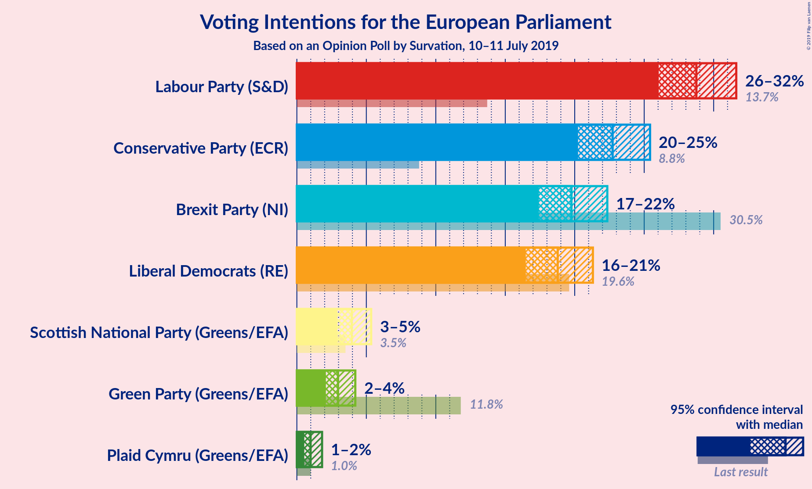
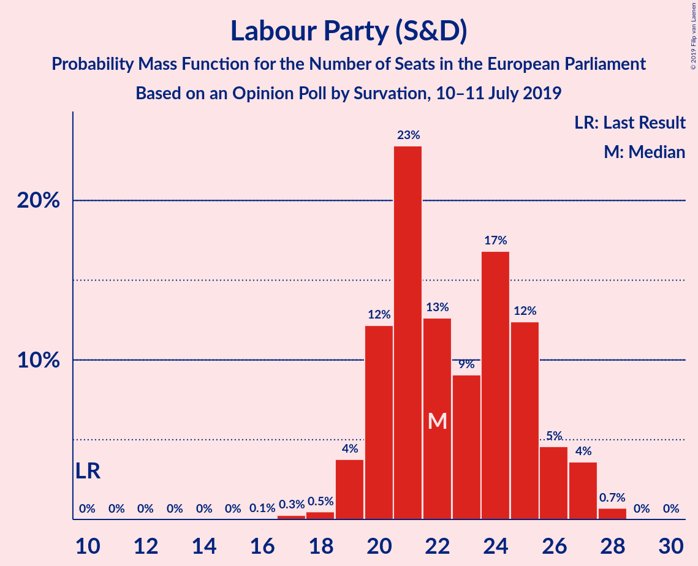
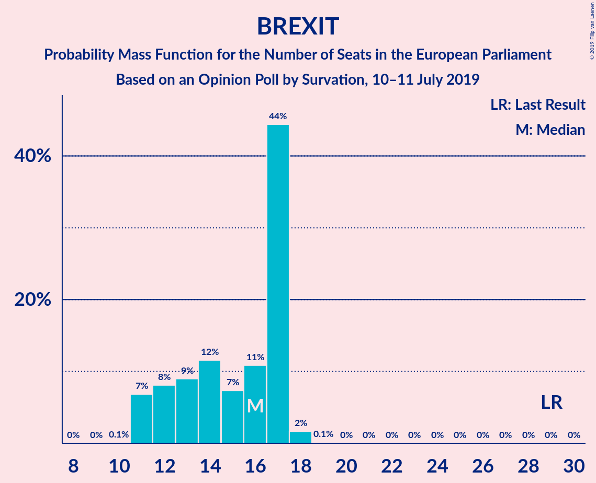
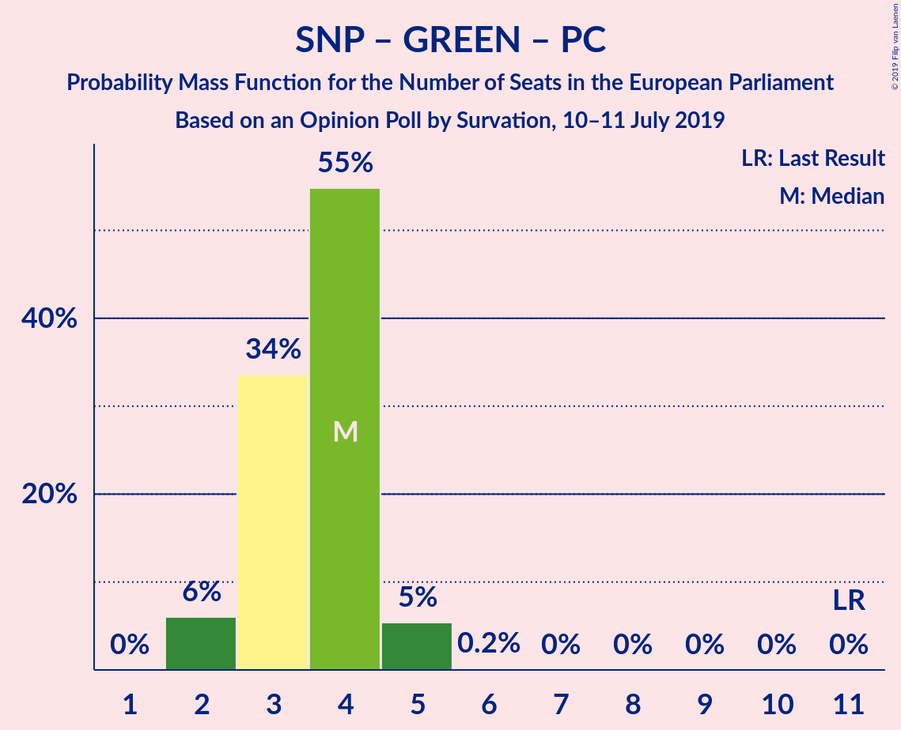

# Opinion Poll by Survation, 10–11 July 2019

<a href="#voting-intentions">Voting Intentions</a> | <a href="#seats">Seats</a> | <a href="#coalitions">Coalitions</a> | <a href="#technical-information">Technical Information</a>

## Voting Intentions

### Confidence Intervals

| Party | Last Result | Poll Result | 80% Confidence Interval | 90% Confidence Interval | 95% Confidence Interval | 99% Confidence Interval |
|:-----:|:-----------:|:-----------:|:-----------------------:|:-----------------------:|:-----------------------:|:-----------------------:|
| Labour Party (S&D) | 13.7% | 28.8% | 27.0–30.6% |26.5–31.2% |26.0–31.6% |25.2–32.5% |
| Conservative Party (ECR) | 8.8% | 22.7% | 21.1–24.5% |20.6–25.0% |20.2–25.4% |19.5–26.3% |
| Brexit Party (NI) | 30.5% | 19.8% | 18.2–21.4% |17.8–21.9% |17.4–22.3% |16.7–23.2% |
| Liberal Democrats (RE) | 19.6% | 18.8% | 17.3–20.4% |16.8–20.9% |16.5–21.3% |15.8–22.1% |
| Scottish National Party (Greens/EFA) | 3.5% | 4.0% | 3.3–4.9% |3.1–5.1% |2.9–5.3% |2.6–5.8% |
| Green Party (Greens/EFA) | 11.8% | 3.0% | 2.4–3.8% |2.2–4.0% |2.1–4.2% |1.8–4.6% |
| Plaid Cymru (Greens/EFA) | 1.0% | 1.0% | 0.7–1.5% |0.6–1.7% |0.5–1.8% |0.4–2.1% |

*Note:* The poll result column reflects the actual value used in the calculations. Published results may vary slightly, and in addition be rounded to fewer digits.

## Seats

### Confidence Intervals

| Party | Last Result | Median | 80% Confidence Interval | 90% Confidence Interval | 95% Confidence Interval | 99% Confidence Interval |
|:-----:|:-----------:|:------:|:-----------------------:|:-----------------------:|:-----------------------:|:-----------------------:|
| <a href="#labour-party-(s&d)">Labour Party (S&D)</a> | 10 | 22 | 20–25 |20–26 |19–27 |18–28 |
| <a href="#conservative-party-(ecr)">Conservative Party (ECR)</a> | 4 | 16 | 13–18 |13–19 |12–20 |11–21 |
| <a href="#brexit-party-(ni)">Brexit Party (NI)</a> | 29 | 16 | 12–17 |11–17 |11–17 |11–18 |
| <a href="#liberal-democrats-(re)">Liberal Democrats (RE)</a> | 16 | 13 | 11–14 |11–14 |10–14 |9–15 |
| <a href="#scottish-national-party-(greens/efa)">Scottish National Party (Greens/EFA)</a> | 3 | 3 | 2–3 |2–3 |2–3 |2–4 |
| <a href="#green-party-(greens/efa)">Green Party (Greens/EFA)</a> | 7 | 0 | 0 |0 |0 |0 |
| <a href="#plaid-cymru-(greens/efa)">Plaid Cymru (Greens/EFA)</a> | 1 | 1 | 0–1 |0–2 |0–2 |0–2 |

### Labour Party (S&D)

*For a full overview of the results for this party, see the [Labour Party (S&D)](party-labourpartysd.html) page.*

| Number of Seats | Probability | Accumulated | Special Marks |
|:---------------:|:-----------:|:-----------:|:-------------:|
| 10 | 0% | 100% | Last Result |
| 11 | 0% | 100% |  |
| 12 | 0% | 100% |  |
| 13 | 0% | 100% |  |
| 14 | 0% | 100% |  |
| 15 | 0% | 100% |  |
| 16 | 0.1% | 100% |  |
| 17 | 0.3% | 99.9% |  |
| 18 | 0.5% | 99.7% |  |
| 19 | 4% | 99.2% |  |
| 20 | 12% | 95% |  |
| 21 | 23% | 83% |  |
| 22 | 13% | 60% | Median |
| 23 | 9% | 47% |  |
| 24 | 17% | 38% |  |
| 25 | 12% | 21% |  |
| 26 | 5% | 9% |  |
| 27 | 4% | 4% |  |
| 28 | 0.7% | 0.7% |  |
| 29 | 0% | 0% |  |

### Conservative Party (ECR)

*For a full overview of the results for this party, see the [Conservative Party (ECR)](party-conservativepartyecr.html) page.*

| Number of Seats | Probability | Accumulated | Special Marks |
|:---------------:|:-----------:|:-----------:|:-------------:|
| 4 | 0% | 100% | Last Result |
| 5 | 0% | 100% |  |
| 6 | 0% | 100% |  |
| 7 | 0% | 100% |  |
| 8 | 0% | 100% |  |
| 9 | 0% | 100% |  |
| 10 | 0% | 100% |  |
| 11 | 0.8% | 100% |  |
| 12 | 2% | 99.2% |  |
| 13 | 8% | 97% |  |
| 14 | 9% | 89% |  |
| 15 | 25% | 80% |  |
| 16 | 19% | 54% | Median |
| 17 | 15% | 35% |  |
| 18 | 11% | 20% |  |
| 19 | 6% | 9% |  |
| 20 | 1.2% | 3% |  |
| 21 | 1.1% | 2% |  |
| 22 | 0.4% | 0.5% |  |
| 23 | 0% | 0% |  |

### Brexit Party (NI)

*For a full overview of the results for this party, see the [Brexit Party (NI)](party-brexitpartyni.html) page.*

| Number of Seats | Probability | Accumulated | Special Marks |
|:---------------:|:-----------:|:-----------:|:-------------:|
| 10 | 0.1% | 100% |  |
| 11 | 7% | 99.9% |  |
| 12 | 8% | 93% |  |
| 13 | 9% | 85% |  |
| 14 | 12% | 76% |  |
| 15 | 7% | 64% |  |
| 16 | 11% | 57% | Median |
| 17 | 44% | 46% |  |
| 18 | 2% | 2% |  |
| 19 | 0.1% | 0.1% |  |
| 20 | 0% | 0% |  |
| 21 | 0% | 0% |  |
| 22 | 0% | 0% |  |
| 23 | 0% | 0% |  |
| 24 | 0% | 0% |  |
| 25 | 0% | 0% |  |
| 26 | 0% | 0% |  |
| 27 | 0% | 0% |  |
| 28 | 0% | 0% |  |
| 29 | 0% | 0% | Last Result |

### Liberal Democrats (RE)

*For a full overview of the results for this party, see the [Liberal Democrats (RE)](party-liberaldemocratsre.html) page.*

| Number of Seats | Probability | Accumulated | Special Marks |
|:---------------:|:-----------:|:-----------:|:-------------:|
| 7 | 0% | 100% |  |
| 8 | 0.4% | 99.9% |  |
| 9 | 1.1% | 99.6% |  |
| 10 | 3% | 98.5% |  |
| 11 | 8% | 96% |  |
| 12 | 26% | 88% |  |
| 13 | 36% | 62% | Median |
| 14 | 25% | 26% |  |
| 15 | 0.6% | 0.9% |  |
| 16 | 0.2% | 0.3% | Last Result |
| 17 | 0.1% | 0.1% |  |
| 18 | 0% | 0% |  |

### Scottish National Party (Greens/EFA)

*For a full overview of the results for this party, see the [Scottish National Party (Greens/EFA)](party-scottishnationalpartygreensefa.html) page.*

| Number of Seats | Probability | Accumulated | Special Marks |
|:---------------:|:-----------:|:-----------:|:-------------:|
| 2 | 31% | 100% |  |
| 3 | 67% | 69% | Last Result, Median |
| 4 | 2% | 2% |  |
| 5 | 0% | 0% |  |

### Green Party (Greens/EFA)

*For a full overview of the results for this party, see the [Green Party (Greens/EFA)](party-greenpartygreensefa.html) page.*

| Number of Seats | Probability | Accumulated | Special Marks |
|:---------------:|:-----------:|:-----------:|:-------------:|
| 0 | 100% | 100% | Median |
| 1 | 0% | 0% |  |
| 2 | 0% | 0% |  |
| 3 | 0% | 0% |  |
| 4 | 0% | 0% |  |
| 5 | 0% | 0% |  |
| 6 | 0% | 0% |  |
| 7 | 0% | 0% | Last Result |

### Plaid Cymru (Greens/EFA)

*For a full overview of the results for this party, see the [Plaid Cymru (Greens/EFA)](party-plaidcymrugreensefa.html) page.*

| Number of Seats | Probability | Accumulated | Special Marks |
|:---------------:|:-----------:|:-----------:|:-------------:|
| 0 | 17% | 100% |  |
| 1 | 78% | 83% | Last Result, Median |
| 2 | 5% | 5% |  |
| 3 | 0% | 0% |  |

## Coalitions

### Confidence Intervals

| Coalition | Last Result | Median | Majority? | 80% Confidence Interval | 90% Confidence Interval | 95% Confidence Interval | 99% Confidence Interval |
|:---------:|:-----------:|:------:|:---------:|:-----------------------:|:-----------------------:|:-----------------------:|:-----------------------:|
| Labour Party (S&D) | 10 | 22 | 0% | 20–25 | 20–26 | 19–27 | 18–28 |
| Conservative Party (ECR) | 4 | 16 | 0% | 13–18 | 13–19 | 12–20 | 11–21 |
| Brexit Party (NI) | 29 | 16 | 0% | 12–17 | 11–17 | 11–17 | 11–18 |
| Scottish National Party (Greens/EFA) – Green Party (Greens/EFA) – Plaid Cymru (Greens/EFA) | 11 | 4 | 0% | 3–4 | 2–5 | 2–5 | 2–5 |

### Labour Party (S&D)

| Number of Seats | Probability | Accumulated | Special Marks |
|:---------------:|:-----------:|:-----------:|:-------------:|
| 10 | 0% | 100% | Last Result |
| 11 | 0% | 100% |  |
| 12 | 0% | 100% |  |
| 13 | 0% | 100% |  |
| 14 | 0% | 100% |  |
| 15 | 0% | 100% |  |
| 16 | 0.1% | 100% |  |
| 17 | 0.3% | 99.9% |  |
| 18 | 0.5% | 99.7% |  |
| 19 | 4% | 99.2% |  |
| 20 | 12% | 95% |  |
| 21 | 23% | 83% |  |
| 22 | 13% | 60% | Median |
| 23 | 9% | 47% |  |
| 24 | 17% | 38% |  |
| 25 | 12% | 21% |  |
| 26 | 5% | 9% |  |
| 27 | 4% | 4% |  |
| 28 | 0.7% | 0.7% |  |
| 29 | 0% | 0% |  |

### Conservative Party (ECR)

| Number of Seats | Probability | Accumulated | Special Marks |
|:---------------:|:-----------:|:-----------:|:-------------:|
| 4 | 0% | 100% | Last Result |
| 5 | 0% | 100% |  |
| 6 | 0% | 100% |  |
| 7 | 0% | 100% |  |
| 8 | 0% | 100% |  |
| 9 | 0% | 100% |  |
| 10 | 0% | 100% |  |
| 11 | 0.8% | 100% |  |
| 12 | 2% | 99.2% |  |
| 13 | 8% | 97% |  |
| 14 | 9% | 89% |  |
| 15 | 25% | 80% |  |
| 16 | 19% | 54% | Median |
| 17 | 15% | 35% |  |
| 18 | 11% | 20% |  |
| 19 | 6% | 9% |  |
| 20 | 1.2% | 3% |  |
| 21 | 1.1% | 2% |  |
| 22 | 0.4% | 0.5% |  |
| 23 | 0% | 0% |  |

### Brexit Party (NI)

| Number of Seats | Probability | Accumulated | Special Marks |
|:---------------:|:-----------:|:-----------:|:-------------:|
| 10 | 0.1% | 100% |  |
| 11 | 7% | 99.9% |  |
| 12 | 8% | 93% |  |
| 13 | 9% | 85% |  |
| 14 | 12% | 76% |  |
| 15 | 7% | 64% |  |
| 16 | 11% | 57% | Median |
| 17 | 44% | 46% |  |
| 18 | 2% | 2% |  |
| 19 | 0.1% | 0.1% |  |
| 20 | 0% | 0% |  |
| 21 | 0% | 0% |  |
| 22 | 0% | 0% |  |
| 23 | 0% | 0% |  |
| 24 | 0% | 0% |  |
| 25 | 0% | 0% |  |
| 26 | 0% | 0% |  |
| 27 | 0% | 0% |  |
| 28 | 0% | 0% |  |
| 29 | 0% | 0% | Last Result |

### Scottish National Party (Greens/EFA) – Green Party (Greens/EFA) – Plaid Cymru (Greens/EFA)

| Number of Seats | Probability | Accumulated | Special Marks |
|:---------------:|:-----------:|:-----------:|:-------------:|
| 2 | 6% | 100% |  |
| 3 | 34% | 94% |  |
| 4 | 55% | 60% | Median |
| 5 | 5% | 6% |  |
| 6 | 0.2% | 0.2% |  |
| 7 | 0% | 0% |  |
| 8 | 0% | 0% |  |
| 9 | 0% | 0% |  |
| 10 | 0% | 0% |  |
| 11 | 0% | 0% | Last Result |

## Technical Information

### Opinion Poll

+ **Polling firm:** Survation
+ **Commissioner(s):** —
+ **Fieldwork period:** 10–11 July 2019

### Calculations

+ **Sample size:** 1012
+ **Simulations done:** 1,048,576
+ **Error estimate:** 1.01%

