# Opinion Poll by YouGov for The Times, 23–24 July 2019

<a href="#voting-intentions">Voting Intentions</a> | <a href="#seats">Seats</a> | <a href="#coalitions">Coalitions</a> | <a href="#technical-information">Technical Information</a>

## Voting Intentions

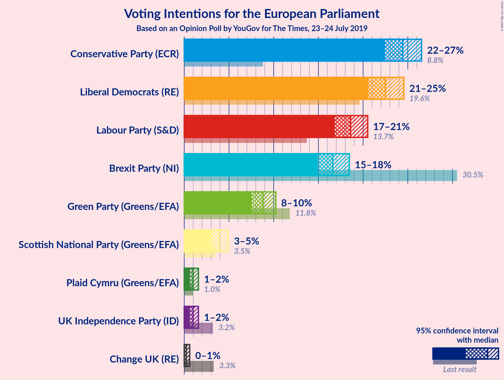

### Confidence Intervals

| Party | Last Result | Poll Result | 80% Confidence Interval | 90% Confidence Interval | 95% Confidence Interval | 99% Confidence Interval |
|:-----:|:-----------:|:-----------:|:-----------------------:|:-----------------------:|:-----------------------:|:-----------------------:|
| Conservative Party (ECR) | 8.8% | 24.4% | 23.1–25.8% |22.8–26.2% |22.5–26.5% |21.8–27.2% |
| Liberal Democrats (RE) | 19.6% | 22.5% | 21.2–23.9% |20.9–24.2% |20.6–24.6% |20.0–25.2% |
| Labour Party (S&D) | 13.7% | 18.6% | 17.4–19.9% |17.1–20.2% |16.8–20.5% |16.3–21.1% |
| Brexit Party (NI) | 30.5% | 16.6% | 15.5–17.8% |15.2–18.2% |14.9–18.5% |14.4–19.1% |
| Green Party (Greens/EFA) | 11.8% | 8.8% | 8.0–9.8% |7.7–10.0% |7.5–10.2% |7.2–10.7% |
| Scottish National Party (Greens/EFA) | 3.5% | 3.9% | 3.4–4.6% |3.2–4.8% |3.1–4.9% |2.8–5.3% |
| Plaid Cymru (Greens/EFA) | 1.0% | 1.0% | 0.7–1.4% |0.7–1.5% |0.6–1.6% |0.5–1.8% |
| UK Independence Party (ID) | 3.2% | 1.0% | 0.7–1.4% |0.7–1.5% |0.6–1.6% |0.5–1.8% |
| Change UK (RE) | 3.3% | 0.2% | 0.1–0.5% |0.1–0.5% |0.1–0.6% |0.1–0.7% |

*Note:* The poll result column reflects the actual value used in the calculations. Published results may vary slightly, and in addition be rounded to fewer digits.

## Seats

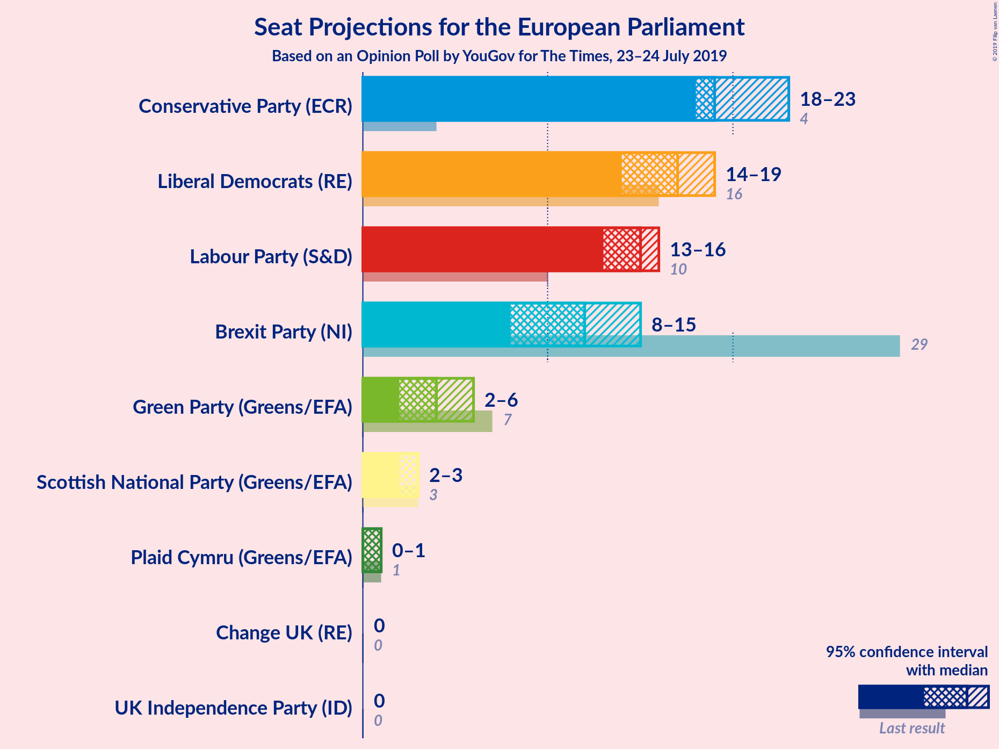

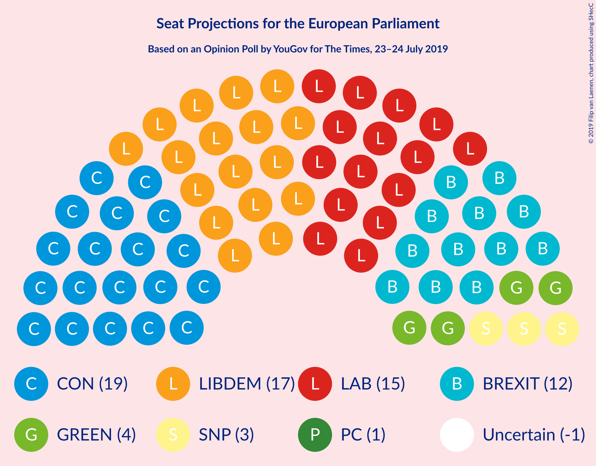

### Confidence Intervals

| Party | Last Result | Median | 80% Confidence Interval | 90% Confidence Interval | 95% Confidence Interval | 99% Confidence Interval |
|:-----:|:-----------:|:------:|:-----------------------:|:-----------------------:|:-----------------------:|:-----------------------:|
| <a href="#conservative-party-(ecr)">Conservative Party (ECR)</a> | 4 | 20 | 19–21 |18–22 |18–23 |17–23 |
| <a href="#liberal-democrats-(re)">Liberal Democrats (RE)</a> | 16 | 16 | 15–18 |14–19 |14–19 |14–20 |
| <a href="#labour-party-(s&d)">Labour Party (S&D)</a> | 10 | 15 | 14–16 |14–16 |13–16 |12–16 |
| <a href="#brexit-party-(ni)">Brexit Party (NI)</a> | 29 | 12 | 10–14 |10–14 |9–15 |8–16 |
| <a href="#green-party-(greens/efa)">Green Party (Greens/EFA)</a> | 7 | 2 | 2–6 |2–6 |2–6 |2–6 |
| <a href="#scottish-national-party-(greens/efa)">Scottish National Party (Greens/EFA)</a> | 3 | 3 | 2–3 |2–3 |2–3 |2–3 |
| <a href="#plaid-cymru-(greens/efa)">Plaid Cymru (Greens/EFA)</a> | 1 | 1 | 1 |0–1 |0–1 |0–2 |
| <a href="#uk-independence-party-(id)">UK Independence Party (ID)</a> | 0 | 0 | 0 |0 |0 |0 |
| <a href="#change-uk-(re)">Change UK (RE)</a> | 0 | 0 | 0 |0 |0 |0 |

### Conservative Party (ECR)

*For a full overview of the results for this party, see the [Conservative Party (ECR)](party-conservativepartyecr.html) page.*

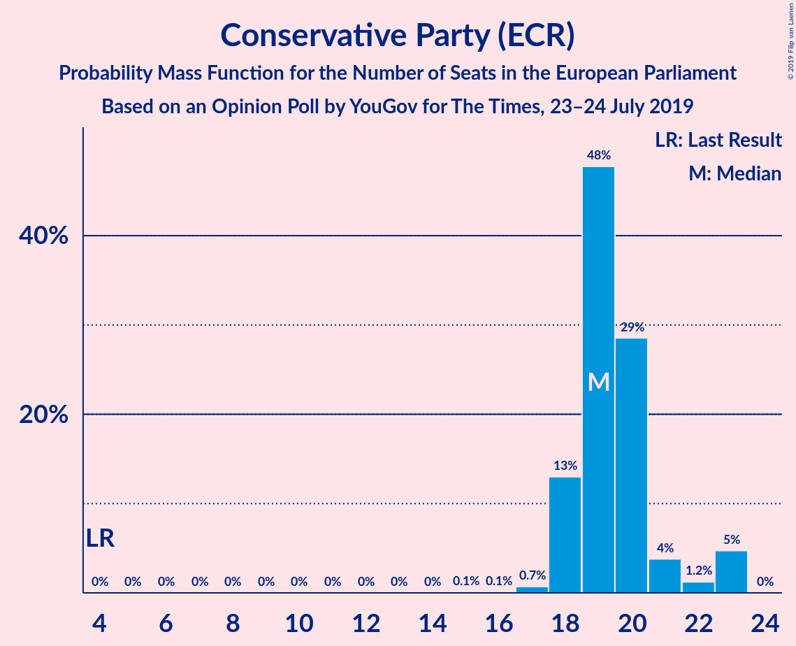

| Number of Seats | Probability | Accumulated | Special Marks |
|:---------------:|:-----------:|:-----------:|:-------------:|
| 4 | 0% | 100% | Last Result |
| 5 | 0% | 100% |  |
| 6 | 0% | 100% |  |
| 7 | 0% | 100% |  |
| 8 | 0% | 100% |  |
| 9 | 0% | 100% |  |
| 10 | 0% | 100% |  |
| 11 | 0% | 100% |  |
| 12 | 0% | 100% |  |
| 13 | 0% | 100% |  |
| 14 | 0% | 100% |  |
| 15 | 0.1% | 100% |  |
| 16 | 0.4% | 99.9% |  |
| 17 | 1.2% | 99.5% |  |
| 18 | 6% | 98% |  |
| 19 | 38% | 92% |  |
| 20 | 24% | 54% | Median |
| 21 | 23% | 30% |  |
| 22 | 2% | 7% |  |
| 23 | 5% | 5% |  |
| 24 | 0% | 0% |  |

### Liberal Democrats (RE)

*For a full overview of the results for this party, see the [Liberal Democrats (RE)](party-liberaldemocratsre.html) page.*

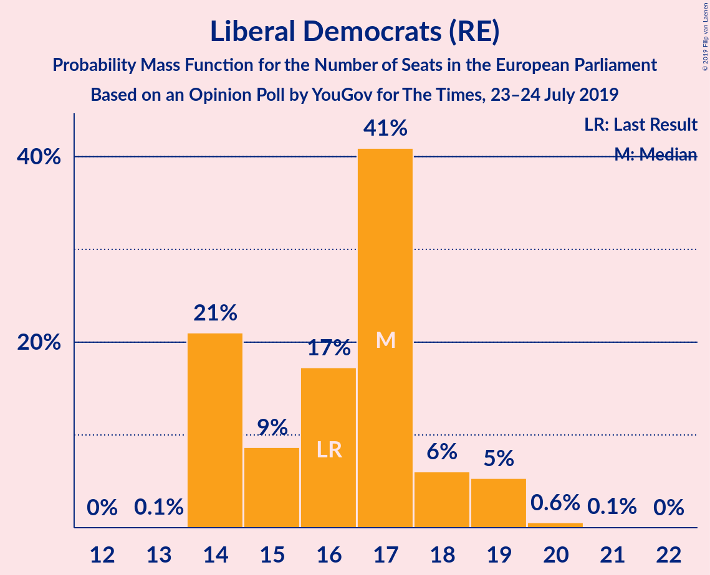

| Number of Seats | Probability | Accumulated | Special Marks |
|:---------------:|:-----------:|:-----------:|:-------------:|
| 13 | 0.1% | 100% |  |
| 14 | 9% | 99.9% |  |
| 15 | 12% | 91% |  |
| 16 | 30% | 79% | Last Result, Median |
| 17 | 36% | 49% |  |
| 18 | 7% | 13% |  |
| 19 | 5% | 6% |  |
| 20 | 0.9% | 1.0% |  |
| 21 | 0.1% | 0.1% |  |
| 22 | 0% | 0% |  |

### Labour Party (S&D)

*For a full overview of the results for this party, see the [Labour Party (S&D)](party-labourpartysd.html) page.*

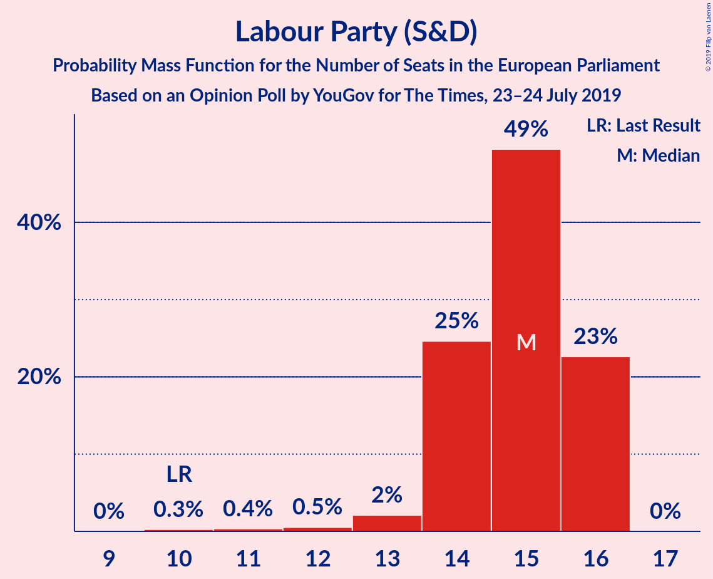

| Number of Seats | Probability | Accumulated | Special Marks |
|:---------------:|:-----------:|:-----------:|:-------------:|
| 10 | 0.1% | 100% | Last Result |
| 11 | 0.3% | 99.9% |  |
| 12 | 1.5% | 99.6% |  |
| 13 | 3% | 98% |  |
| 14 | 21% | 95% |  |
| 15 | 58% | 74% | Median |
| 16 | 16% | 16% |  |
| 17 | 0% | 0% |  |

### Brexit Party (NI)

*For a full overview of the results for this party, see the [Brexit Party (NI)](party-brexitpartyni.html) page.*

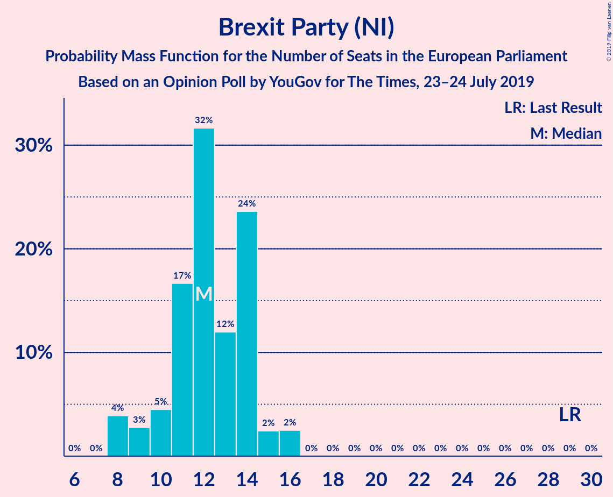

| Number of Seats | Probability | Accumulated | Special Marks |
|:---------------:|:-----------:|:-----------:|:-------------:|
| 8 | 2% | 100% |  |
| 9 | 2% | 98% |  |
| 10 | 8% | 96% |  |
| 11 | 15% | 88% |  |
| 12 | 39% | 73% | Median |
| 13 | 17% | 34% |  |
| 14 | 14% | 17% |  |
| 15 | 3% | 3% |  |
| 16 | 0.5% | 0.5% |  |
| 17 | 0% | 0% |  |
| 18 | 0% | 0% |  |
| 19 | 0% | 0% |  |
| 20 | 0% | 0% |  |
| 21 | 0% | 0% |  |
| 22 | 0% | 0% |  |
| 23 | 0% | 0% |  |
| 24 | 0% | 0% |  |
| 25 | 0% | 0% |  |
| 26 | 0% | 0% |  |
| 27 | 0% | 0% |  |
| 28 | 0% | 0% |  |
| 29 | 0% | 0% | Last Result |

### Green Party (Greens/EFA)

*For a full overview of the results for this party, see the [Green Party (Greens/EFA)](party-greenpartygreensefa.html) page.*

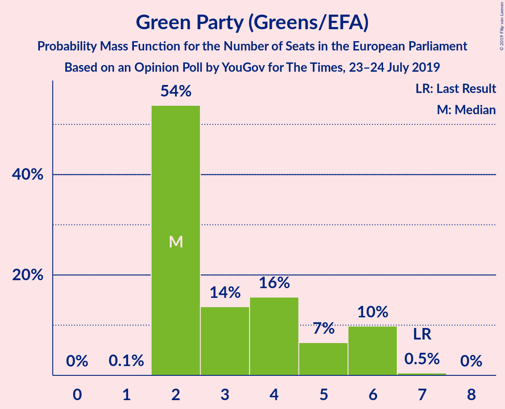

| Number of Seats | Probability | Accumulated | Special Marks |
|:---------------:|:-----------:|:-----------:|:-------------:|
| 1 | 0.1% | 100% |  |
| 2 | 54% | 99.9% | Median |
| 3 | 14% | 46% |  |
| 4 | 16% | 32% |  |
| 5 | 7% | 17% |  |
| 6 | 10% | 10% |  |
| 7 | 0.5% | 0.5% | Last Result |
| 8 | 0% | 0% |  |

### Scottish National Party (Greens/EFA)

*For a full overview of the results for this party, see the [Scottish National Party (Greens/EFA)](party-scottishnationalpartygreensefa.html) page.*

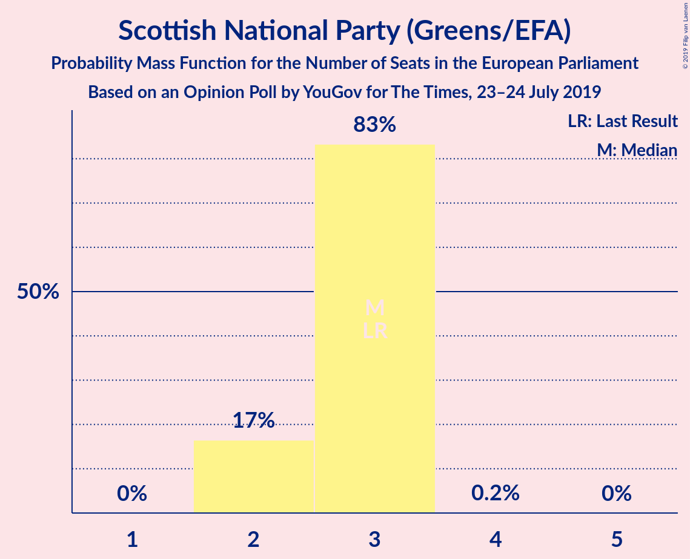

| Number of Seats | Probability | Accumulated | Special Marks |
|:---------------:|:-----------:|:-----------:|:-------------:|
| 2 | 17% | 100% |  |
| 3 | 83% | 83% | Last Result, Median |
| 4 | 0.2% | 0.2% |  |
| 5 | 0% | 0% |  |

### Plaid Cymru (Greens/EFA)

*For a full overview of the results for this party, see the [Plaid Cymru (Greens/EFA)](party-plaidcymrugreensefa.html) page.*

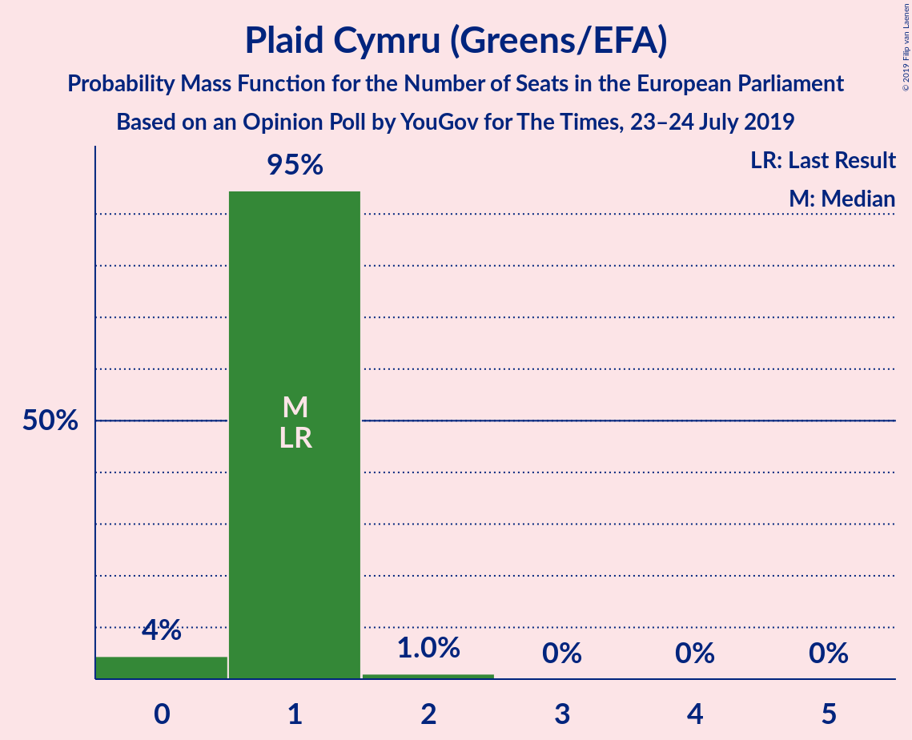

| Number of Seats | Probability | Accumulated | Special Marks |
|:---------------:|:-----------:|:-----------:|:-------------:|
| 0 | 7% | 100% |  |
| 1 | 92% | 93% | Last Result, Median |
| 2 | 1.1% | 1.1% |  |
| 3 | 0% | 0% |  |

### UK Independence Party (ID)

*For a full overview of the results for this party, see the [UK Independence Party (ID)](party-ukindependencepartyid.html) page.*

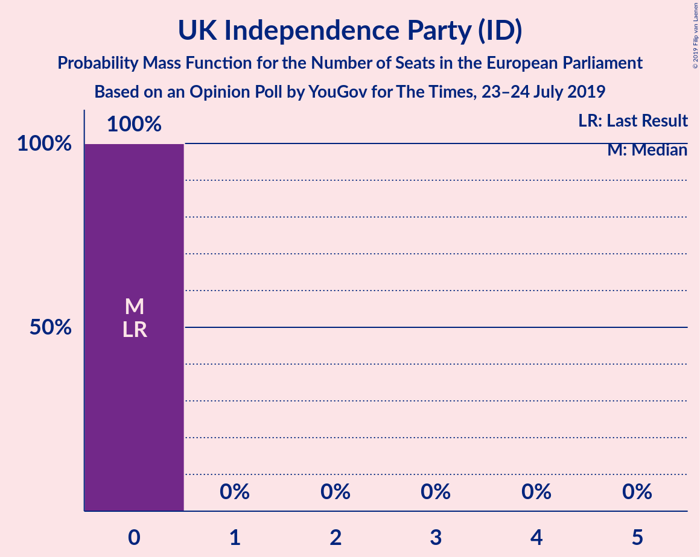

| Number of Seats | Probability | Accumulated | Special Marks |
|:---------------:|:-----------:|:-----------:|:-------------:|
| 0 | 100% | 100% | Last Result, Median |

### Change UK (RE)

*For a full overview of the results for this party, see the [Change UK (RE)](party-changeukre.html) page.*

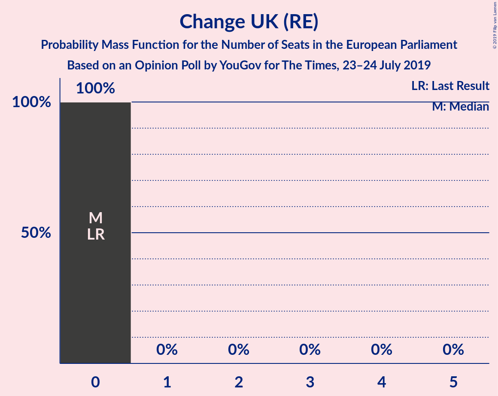

| Number of Seats | Probability | Accumulated | Special Marks |
|:---------------:|:-----------:|:-----------:|:-------------:|
| 0 | 100% | 100% | Last Result, Median |

## Coalitions

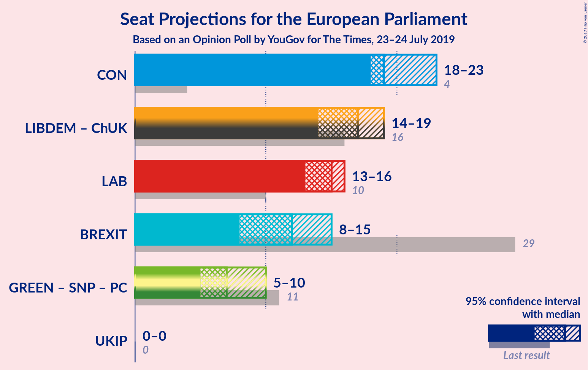

### Confidence Intervals

| Coalition | Last Result | Median | Majority? | 80% Confidence Interval | 90% Confidence Interval | 95% Confidence Interval | 99% Confidence Interval |
|:---------:|:-----------:|:------:|:---------:|:-----------------------:|:-----------------------:|:-----------------------:|:-----------------------:|
| Conservative Party (ECR) | 4 | 20 | 0% | 19–21 | 18–22 | 18–23 | 17–23 |
| Liberal Democrats (RE) – Change UK (RE) | 16 | 16 | 0% | 15–18 | 14–19 | 14–19 | 14–20 |
| Labour Party (S&D) | 10 | 15 | 0% | 14–16 | 14–16 | 13–16 | 12–16 |
| Brexit Party (NI) | 29 | 12 | 0% | 10–14 | 10–14 | 9–15 | 8–16 |
| Green Party (Greens/EFA) – Scottish National Party (Greens/EFA) – Plaid Cymru (Greens/EFA) | 11 | 6 | 0% | 5–9 | 5–10 | 5–10 | 4–10 |
| UK Independence Party (ID) | 0 | 0 | 0% | 0 | 0 | 0 | 0 |

### Conservative Party (ECR)

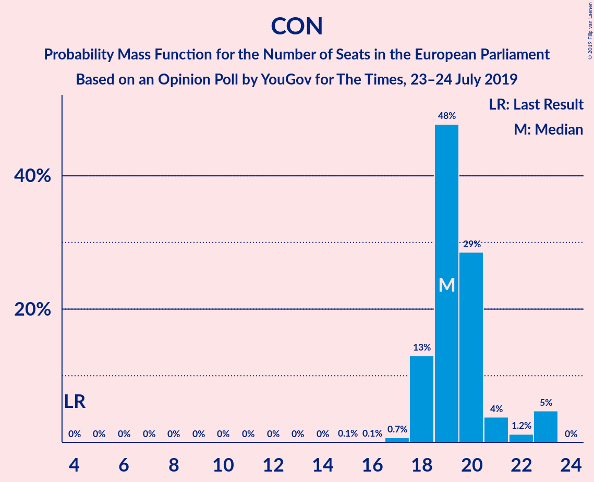

| Number of Seats | Probability | Accumulated | Special Marks |
|:---------------:|:-----------:|:-----------:|:-------------:|
| 4 | 0% | 100% | Last Result |
| 5 | 0% | 100% |  |
| 6 | 0% | 100% |  |
| 7 | 0% | 100% |  |
| 8 | 0% | 100% |  |
| 9 | 0% | 100% |  |
| 10 | 0% | 100% |  |
| 11 | 0% | 100% |  |
| 12 | 0% | 100% |  |
| 13 | 0% | 100% |  |
| 14 | 0% | 100% |  |
| 15 | 0.1% | 100% |  |
| 16 | 0.4% | 99.9% |  |
| 17 | 1.2% | 99.5% |  |
| 18 | 6% | 98% |  |
| 19 | 38% | 92% |  |
| 20 | 24% | 54% | Median |
| 21 | 23% | 30% |  |
| 22 | 2% | 7% |  |
| 23 | 5% | 5% |  |
| 24 | 0% | 0% |  |

### Liberal Democrats (RE) – Change UK (RE)

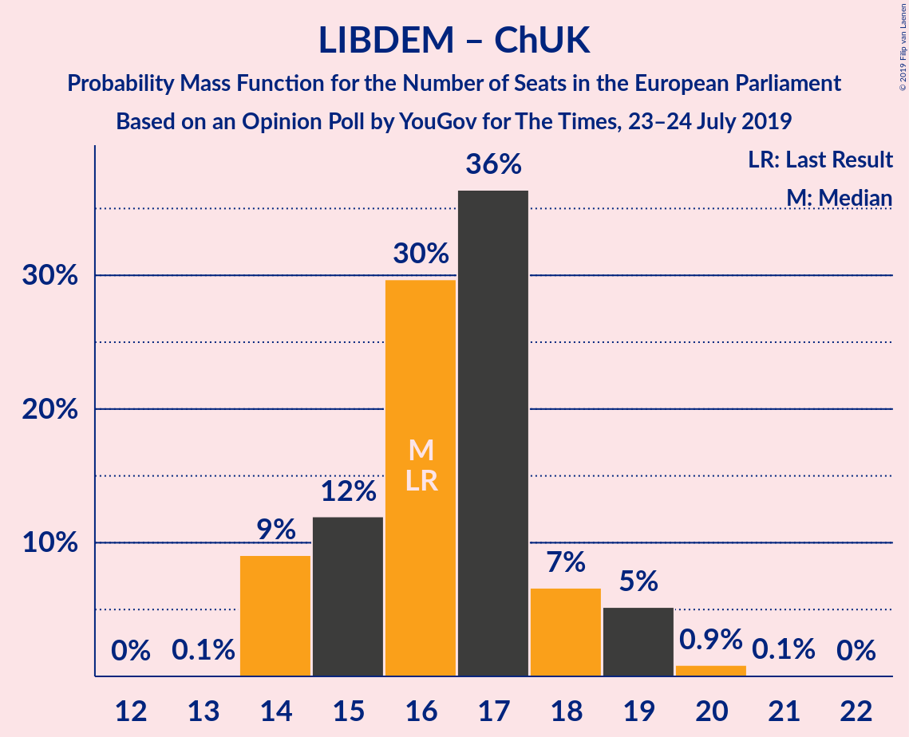

| Number of Seats | Probability | Accumulated | Special Marks |
|:---------------:|:-----------:|:-----------:|:-------------:|
| 13 | 0.1% | 100% |  |
| 14 | 9% | 99.9% |  |
| 15 | 12% | 91% |  |
| 16 | 30% | 79% | Last Result, Median |
| 17 | 36% | 49% |  |
| 18 | 7% | 13% |  |
| 19 | 5% | 6% |  |
| 20 | 0.9% | 1.0% |  |
| 21 | 0.1% | 0.1% |  |
| 22 | 0% | 0% |  |

### Labour Party (S&D)

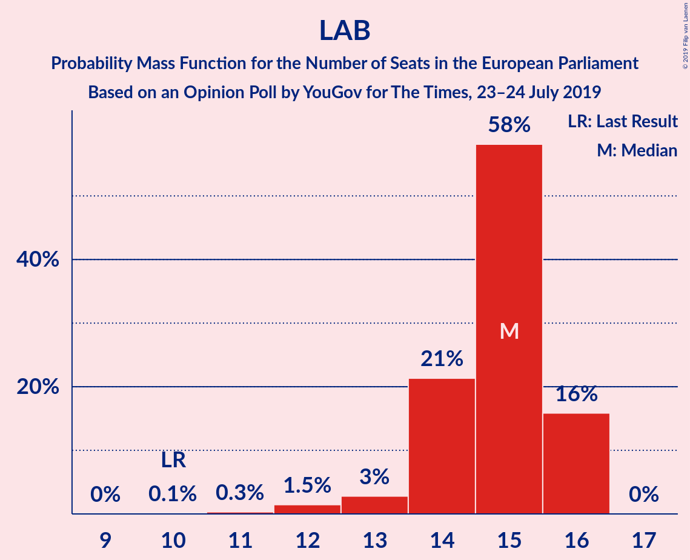

| Number of Seats | Probability | Accumulated | Special Marks |
|:---------------:|:-----------:|:-----------:|:-------------:|
| 10 | 0.1% | 100% | Last Result |
| 11 | 0.3% | 99.9% |  |
| 12 | 1.5% | 99.6% |  |
| 13 | 3% | 98% |  |
| 14 | 21% | 95% |  |
| 15 | 58% | 74% | Median |
| 16 | 16% | 16% |  |
| 17 | 0% | 0% |  |

### Brexit Party (NI)

| Number of Seats | Probability | Accumulated | Special Marks |
|:---------------:|:-----------:|:-----------:|:-------------:|
| 8 | 2% | 100% |  |
| 9 | 2% | 98% |  |
| 10 | 8% | 96% |  |
| 11 | 15% | 88% |  |
| 12 | 39% | 73% | Median |
| 13 | 17% | 34% |  |
| 14 | 14% | 17% |  |
| 15 | 3% | 3% |  |
| 16 | 0.5% | 0.5% |  |
| 17 | 0% | 0% |  |
| 18 | 0% | 0% |  |
| 19 | 0% | 0% |  |
| 20 | 0% | 0% |  |
| 21 | 0% | 0% |  |
| 22 | 0% | 0% |  |
| 23 | 0% | 0% |  |
| 24 | 0% | 0% |  |
| 25 | 0% | 0% |  |
| 26 | 0% | 0% |  |
| 27 | 0% | 0% |  |
| 28 | 0% | 0% |  |
| 29 | 0% | 0% | Last Result |

### Green Party (Greens/EFA) – Scottish National Party (Greens/EFA) – Plaid Cymru (Greens/EFA)

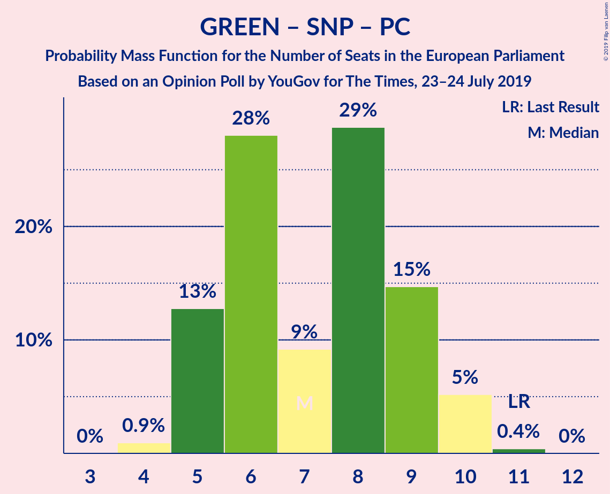

| Number of Seats | Probability | Accumulated | Special Marks |
|:---------------:|:-----------:|:-----------:|:-------------:|
| 4 | 0.9% | 100% |  |
| 5 | 11% | 99.1% |  |
| 6 | 45% | 88% | Median |
| 7 | 13% | 43% |  |
| 8 | 14% | 30% |  |
| 9 | 8% | 16% |  |
| 10 | 7% | 7% |  |
| 11 | 0.5% | 0.5% | Last Result |
| 12 | 0% | 0% |  |

### UK Independence Party (ID)

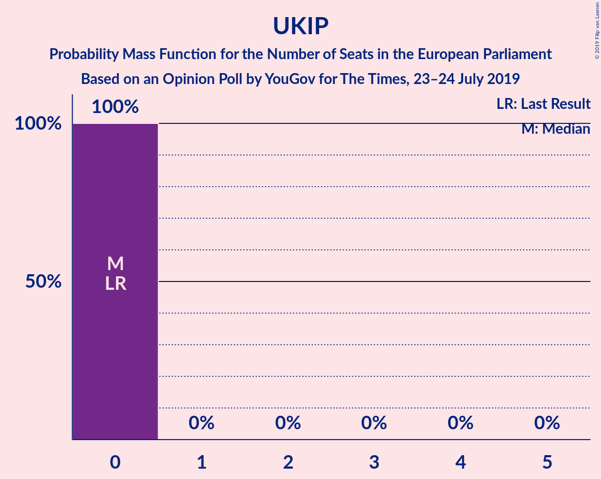

| Number of Seats | Probability | Accumulated | Special Marks |
|:---------------:|:-----------:|:-----------:|:-------------:|
| 0 | 100% | 100% | Last Result, Median |

## Technical Information

### Opinion Poll

+ **Polling firm:** YouGov
+ **Commissioner(s):** The Times
+ **Fieldwork period:** 23–24 July 2019

### Calculations

+ **Sample size:** 1715
+ **Simulations done:** 1,048,576
+ **Error estimate:** 1.84%

