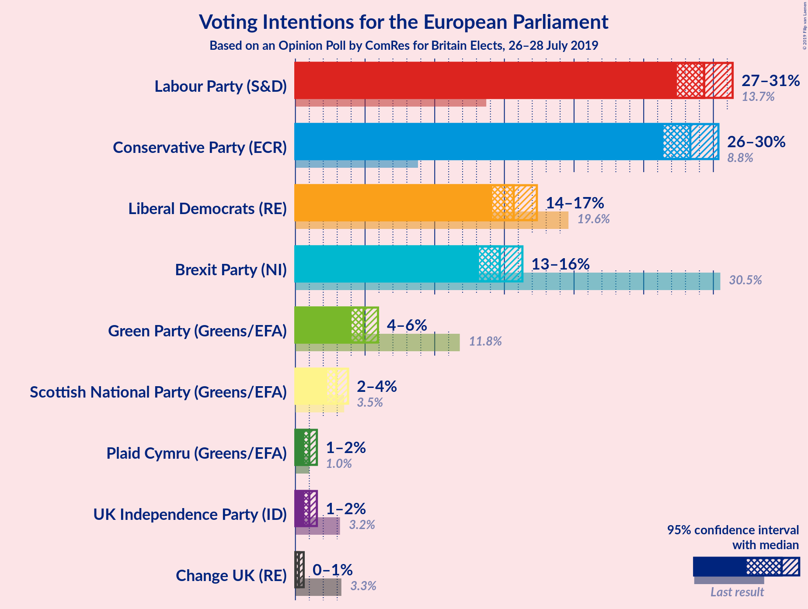
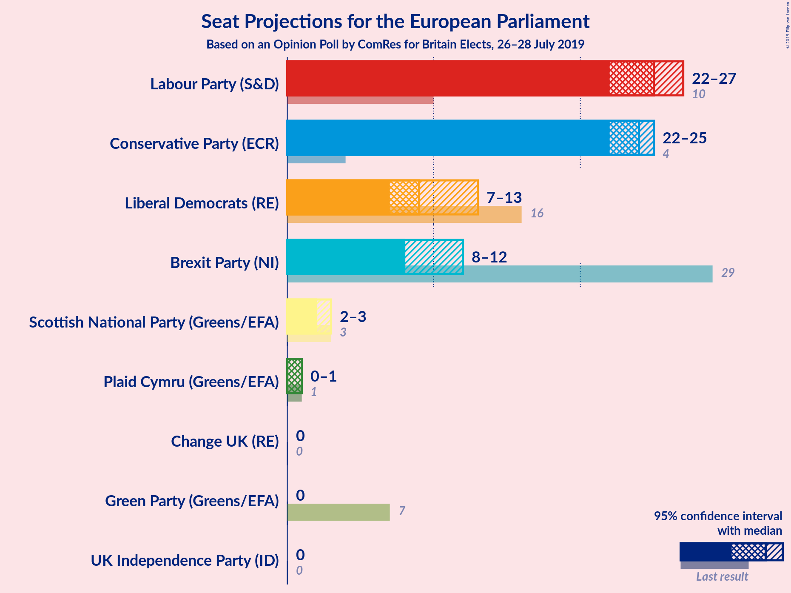
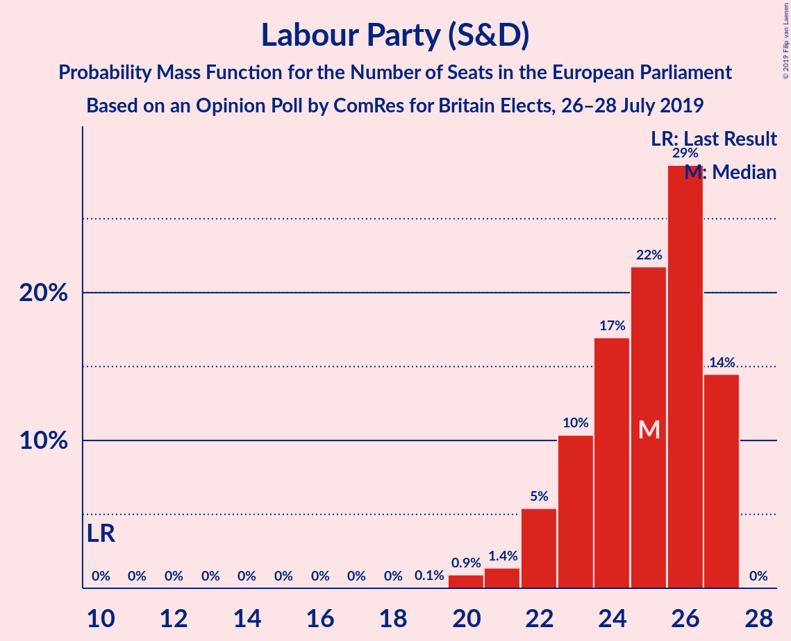
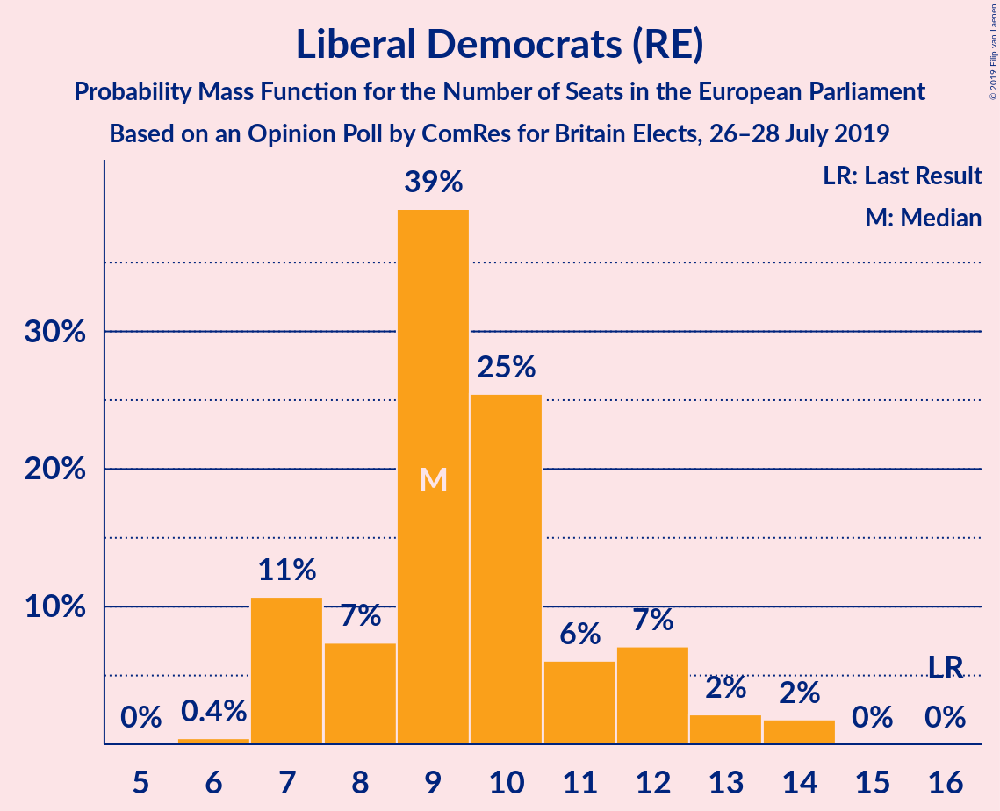
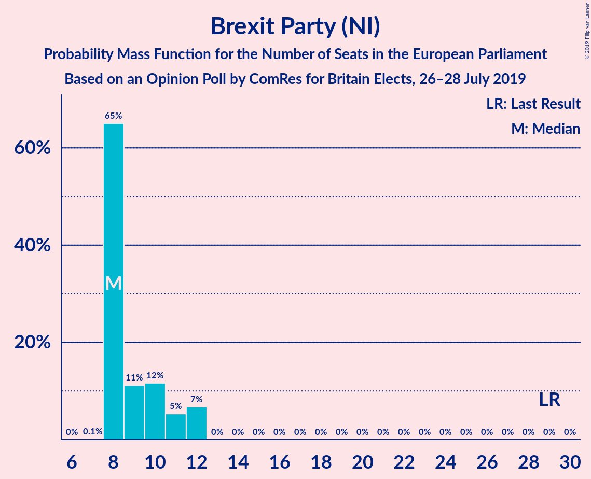
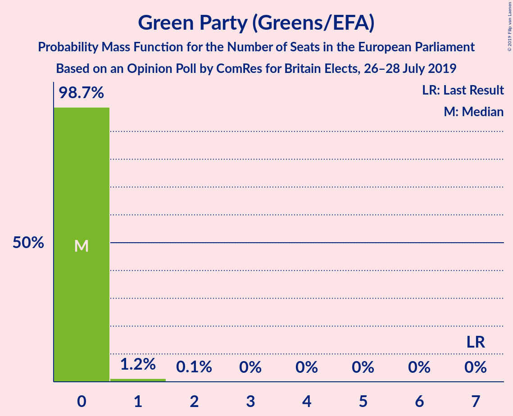
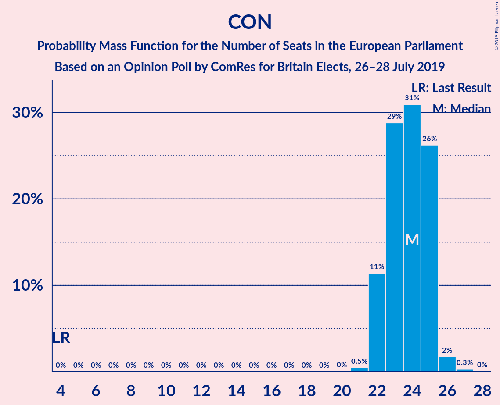
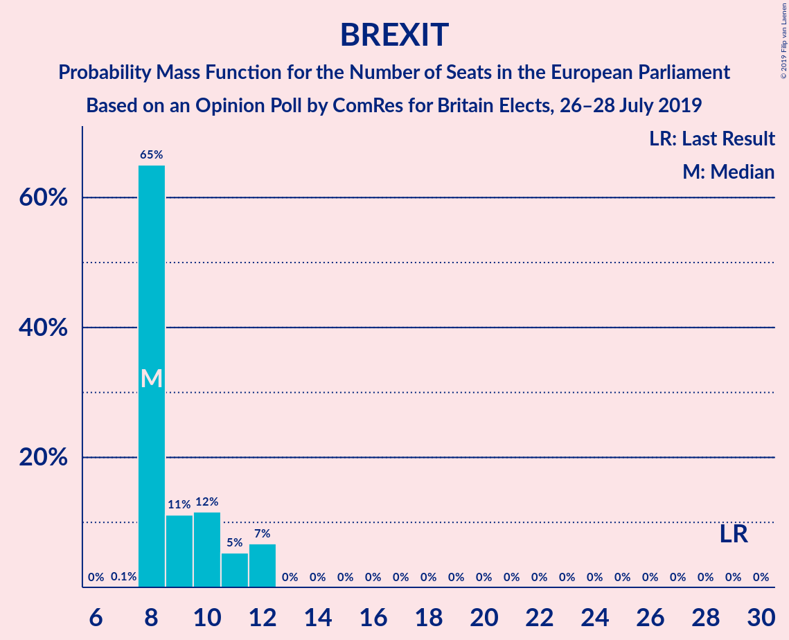

# Opinion Poll by ComRes for Britain Elects, 26–28 July 2019

<a href="#voting-intentions">Voting Intentions</a> | <a href="#seats">Seats</a> | <a href="#coalitions">Coalitions</a> | <a href="#technical-information">Technical Information</a>

## Voting Intentions

### Confidence Intervals

| Party | Last Result | Poll Result | 80% Confidence Interval | 90% Confidence Interval | 95% Confidence Interval | 99% Confidence Interval |
|:-----:|:-----------:|:-----------:|:-----------------------:|:-----------------------:|:-----------------------:|:-----------------------:|
| Labour Party (S&D) | 13.7% | 30.0% | 28.2–31.8% |27.7–32.3% |27.3–32.8% |26.5–33.7% |
| Conservative Party (ECR) | 8.8% | 29.0% | 27.3–30.9% |26.8–31.4% |26.4–31.8% |25.5–32.7% |
| Liberal Democrats (RE) | 19.6% | 16.0% | 14.6–17.6% |14.3–18.0% |13.9–18.4% |13.3–19.1% |
| Brexit Party (NI) | 30.5% | 15.0% | 13.7–16.5% |13.3–16.9% |13.0–17.3% |12.3–18.0% |
| Green Party (Greens/EFA) | 11.8% | 5.0% | 4.2–6.0% |4.0–6.2% |3.8–6.5% |3.5–7.0% |

*Note:* The poll result column reflects the actual value used in the calculations. Published results may vary slightly, and in addition be rounded to fewer digits.

## Seats

### Confidence Intervals

| Party | Last Result | Median | 80% Confidence Interval | 90% Confidence Interval | 95% Confidence Interval | 99% Confidence Interval |
|:-----:|:-----------:|:------:|:-----------------------:|:-----------------------:|:-----------------------:|:-----------------------:|
| <a href="#labour-party-(s&d)">Labour Party (S&D)</a> | 10 | 25 | 22–27 |21–27 |20–27 |19–27 |
| <a href="#conservative-party-(ecr)">Conservative Party (ECR)</a> | 4 | 23 | 22–25 |22–26 |21–26 |20–28 |
| <a href="#liberal-democrats-(re)">Liberal Democrats (RE)</a> | 16 | 9 | 7–12 |7–13 |7–13 |6–14 |
| <a href="#brexit-party-(ni)">Brexit Party (NI)</a> | 29 | 8 | 8–11 |8–12 |8–12 |7–12 |
| <a href="#green-party-(greens/efa)">Green Party (Greens/EFA)</a> | 7 | 0 | 0 |0–1 |0–1 |0–2 |

### Labour Party (S&D)

*For a full overview of the results for this party, see the [Labour Party (S&D)](party-labourpartysd.html) page.*

| Number of Seats | Probability | Accumulated | Special Marks |
|:---------------:|:-----------:|:-----------:|:-------------:|
| 10 | 0% | 100% | Last Result |
| 11 | 0% | 100% |  |
| 12 | 0% | 100% |  |
| 13 | 0% | 100% |  |
| 14 | 0% | 100% |  |
| 15 | 0% | 100% |  |
| 16 | 0% | 100% |  |
| 17 | 0% | 100% |  |
| 18 | 0% | 100% |  |
| 19 | 1.2% | 100% |  |
| 20 | 3% | 98.8% |  |
| 21 | 5% | 96% |  |
| 22 | 9% | 91% |  |
| 23 | 12% | 82% |  |
| 24 | 15% | 70% |  |
| 25 | 17% | 55% | Median |
| 26 | 17% | 38% |  |
| 27 | 21% | 21% |  |
| 28 | 0.1% | 0.1% |  |
| 29 | 0% | 0% |  |

### Conservative Party (ECR)

*For a full overview of the results for this party, see the [Conservative Party (ECR)](party-conservativepartyecr.html) page.*

| Number of Seats | Probability | Accumulated | Special Marks |
|:---------------:|:-----------:|:-----------:|:-------------:|
| 4 | 0% | 100% | Last Result |
| 5 | 0% | 100% |  |
| 6 | 0% | 100% |  |
| 7 | 0% | 100% |  |
| 8 | 0% | 100% |  |
| 9 | 0% | 100% |  |
| 10 | 0% | 100% |  |
| 11 | 0% | 100% |  |
| 12 | 0% | 100% |  |
| 13 | 0% | 100% |  |
| 14 | 0% | 100% |  |
| 15 | 0% | 100% |  |
| 16 | 0% | 100% |  |
| 17 | 0% | 100% |  |
| 18 | 0.1% | 100% |  |
| 19 | 0.3% | 99.9% |  |
| 20 | 0.5% | 99.6% |  |
| 21 | 3% | 99.2% |  |
| 22 | 32% | 96% |  |
| 23 | 25% | 64% | Median |
| 24 | 12% | 39% |  |
| 25 | 20% | 27% |  |
| 26 | 5% | 7% |  |
| 27 | 2% | 2% |  |
| 28 | 0.5% | 0.6% |  |
| 29 | 0% | 0% |  |

### Liberal Democrats (RE)

*For a full overview of the results for this party, see the [Liberal Democrats (RE)](party-liberaldemocratsre.html) page.*

| Number of Seats | Probability | Accumulated | Special Marks |
|:---------------:|:-----------:|:-----------:|:-------------:|
| 6 | 2% | 100% |  |
| 7 | 13% | 98% |  |
| 8 | 11% | 86% |  |
| 9 | 31% | 74% | Median |
| 10 | 17% | 43% |  |
| 11 | 10% | 26% |  |
| 12 | 8% | 16% |  |
| 13 | 6% | 8% |  |
| 14 | 2% | 2% |  |
| 15 | 0% | 0% |  |
| 16 | 0% | 0% | Last Result |

### Brexit Party (NI)

*For a full overview of the results for this party, see the [Brexit Party (NI)](party-brexitpartyni.html) page.*

| Number of Seats | Probability | Accumulated | Special Marks |
|:---------------:|:-----------:|:-----------:|:-------------:|
| 6 | 0.2% | 100% |  |
| 7 | 1.3% | 99.8% |  |
| 8 | 60% | 98.5% | Median |
| 9 | 11% | 38% |  |
| 10 | 10% | 27% |  |
| 11 | 9% | 17% |  |
| 12 | 7% | 8% |  |
| 13 | 0.4% | 0.5% |  |
| 14 | 0% | 0.1% |  |
| 15 | 0% | 0% |  |
| 16 | 0% | 0% |  |
| 17 | 0% | 0% |  |
| 18 | 0% | 0% |  |
| 19 | 0% | 0% |  |
| 20 | 0% | 0% |  |
| 21 | 0% | 0% |  |
| 22 | 0% | 0% |  |
| 23 | 0% | 0% |  |
| 24 | 0% | 0% |  |
| 25 | 0% | 0% |  |
| 26 | 0% | 0% |  |
| 27 | 0% | 0% |  |
| 28 | 0% | 0% |  |
| 29 | 0% | 0% | Last Result |

### Green Party (Greens/EFA)

*For a full overview of the results for this party, see the [Green Party (Greens/EFA)](party-greenpartygreensefa.html) page.*

| Number of Seats | Probability | Accumulated | Special Marks |
|:---------------:|:-----------:|:-----------:|:-------------:|
| 0 | 95% | 100% | Median |
| 1 | 4% | 5% |  |
| 2 | 1.3% | 1.3% |  |
| 3 | 0% | 0% |  |
| 4 | 0% | 0% |  |
| 5 | 0% | 0% |  |
| 6 | 0% | 0% |  |
| 7 | 0% | 0% | Last Result |

## Coalitions

### Confidence Intervals

| Coalition | Last Result | Median | Majority? | 80% Confidence Interval | 90% Confidence Interval | 95% Confidence Interval | 99% Confidence Interval |
|:---------:|:-----------:|:------:|:---------:|:-----------------------:|:-----------------------:|:-----------------------:|:-----------------------:|
| Labour Party (S&D) | 10 | 25 | 0% | 22–27 | 21–27 | 20–27 | 19–27 |
| Conservative Party (ECR) | 4 | 23 | 0% | 22–25 | 22–26 | 21–26 | 20–28 |
| Brexit Party (NI) | 29 | 8 | 0% | 8–11 | 8–12 | 8–12 | 7–12 |

### Labour Party (S&D)

| Number of Seats | Probability | Accumulated | Special Marks |
|:---------------:|:-----------:|:-----------:|:-------------:|
| 10 | 0% | 100% | Last Result |
| 11 | 0% | 100% |  |
| 12 | 0% | 100% |  |
| 13 | 0% | 100% |  |
| 14 | 0% | 100% |  |
| 15 | 0% | 100% |  |
| 16 | 0% | 100% |  |
| 17 | 0% | 100% |  |
| 18 | 0% | 100% |  |
| 19 | 1.2% | 100% |  |
| 20 | 3% | 98.8% |  |
| 21 | 5% | 96% |  |
| 22 | 9% | 91% |  |
| 23 | 12% | 82% |  |
| 24 | 15% | 70% |  |
| 25 | 17% | 55% | Median |
| 26 | 17% | 38% |  |
| 27 | 21% | 21% |  |
| 28 | 0.1% | 0.1% |  |
| 29 | 0% | 0% |  |

### Conservative Party (ECR)

| Number of Seats | Probability | Accumulated | Special Marks |
|:---------------:|:-----------:|:-----------:|:-------------:|
| 4 | 0% | 100% | Last Result |
| 5 | 0% | 100% |  |
| 6 | 0% | 100% |  |
| 7 | 0% | 100% |  |
| 8 | 0% | 100% |  |
| 9 | 0% | 100% |  |
| 10 | 0% | 100% |  |
| 11 | 0% | 100% |  |
| 12 | 0% | 100% |  |
| 13 | 0% | 100% |  |
| 14 | 0% | 100% |  |
| 15 | 0% | 100% |  |
| 16 | 0% | 100% |  |
| 17 | 0% | 100% |  |
| 18 | 0.1% | 100% |  |
| 19 | 0.3% | 99.9% |  |
| 20 | 0.5% | 99.6% |  |
| 21 | 3% | 99.2% |  |
| 22 | 32% | 96% |  |
| 23 | 25% | 64% | Median |
| 24 | 12% | 39% |  |
| 25 | 20% | 27% |  |
| 26 | 5% | 7% |  |
| 27 | 2% | 2% |  |
| 28 | 0.5% | 0.6% |  |
| 29 | 0% | 0% |  |

### Brexit Party (NI)

| Number of Seats | Probability | Accumulated | Special Marks |
|:---------------:|:-----------:|:-----------:|:-------------:|
| 6 | 0.2% | 100% |  |
| 7 | 1.3% | 99.8% |  |
| 8 | 60% | 98.5% | Median |
| 9 | 11% | 38% |  |
| 10 | 10% | 27% |  |
| 11 | 9% | 17% |  |
| 12 | 7% | 8% |  |
| 13 | 0.4% | 0.5% |  |
| 14 | 0% | 0.1% |  |
| 15 | 0% | 0% |  |
| 16 | 0% | 0% |  |
| 17 | 0% | 0% |  |
| 18 | 0% | 0% |  |
| 19 | 0% | 0% |  |
| 20 | 0% | 0% |  |
| 21 | 0% | 0% |  |
| 22 | 0% | 0% |  |
| 23 | 0% | 0% |  |
| 24 | 0% | 0% |  |
| 25 | 0% | 0% |  |
| 26 | 0% | 0% |  |
| 27 | 0% | 0% |  |
| 28 | 0% | 0% |  |
| 29 | 0% | 0% | Last Result |

## Technical Information

### Opinion Poll

+ **Polling firm:** ComRes
+ **Commissioner(s):** Britain Elects
+ **Fieldwork period:** 26–28 July 2019

### Calculations

+ **Sample size:** 1061
+ **Simulations done:** 1,048,576
+ **Error estimate:** 0.34%

