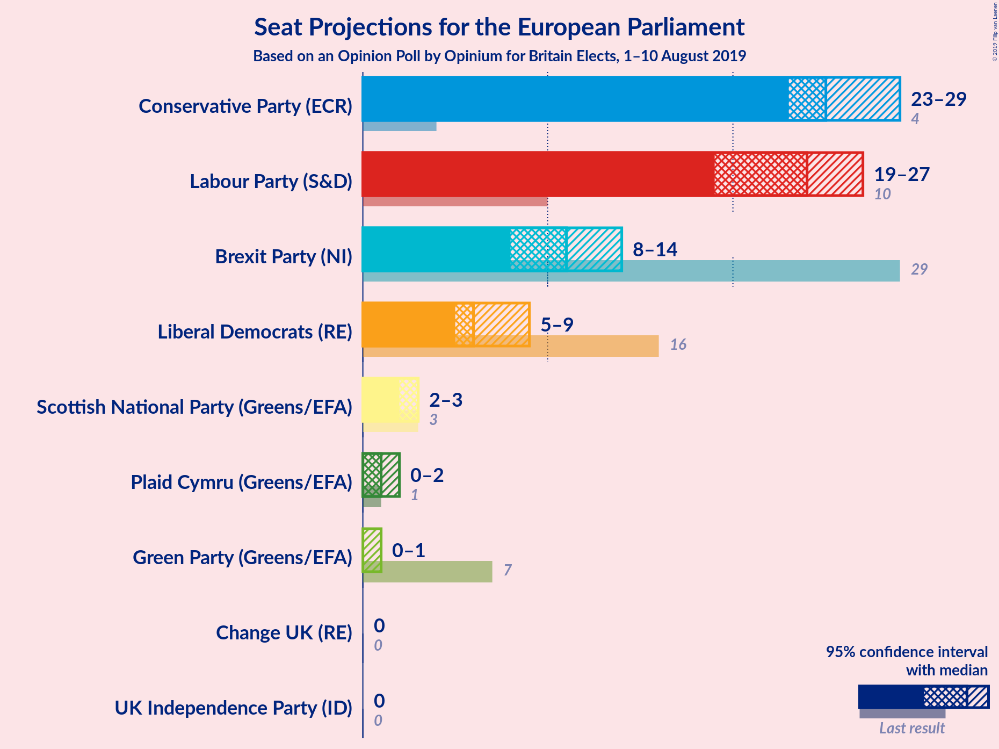
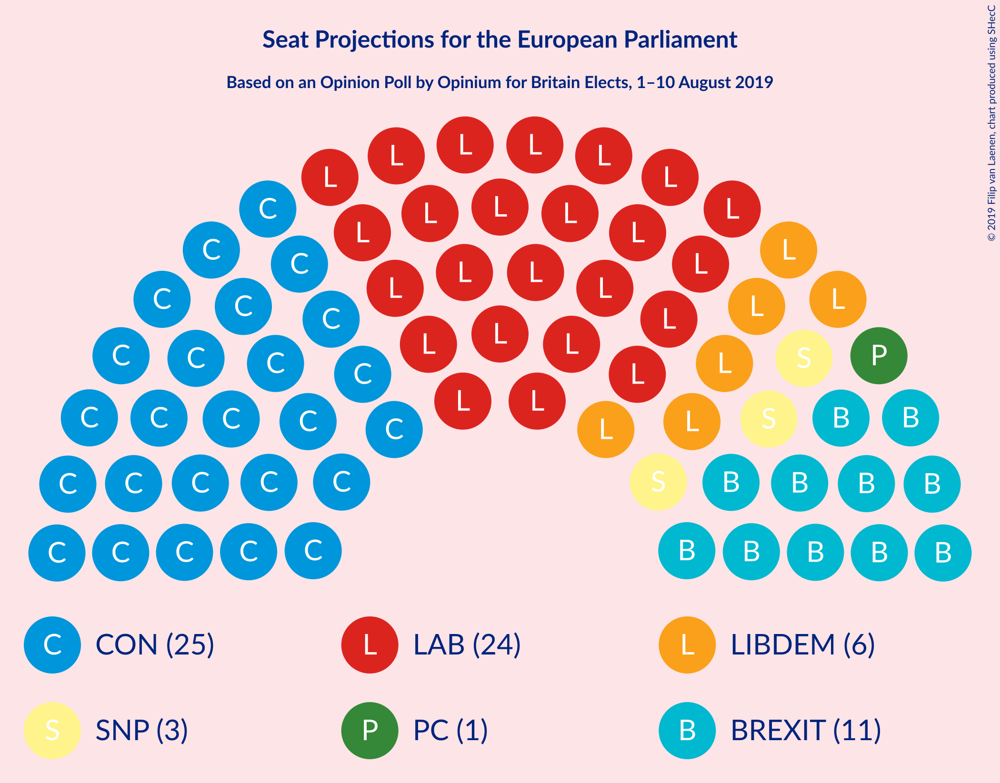
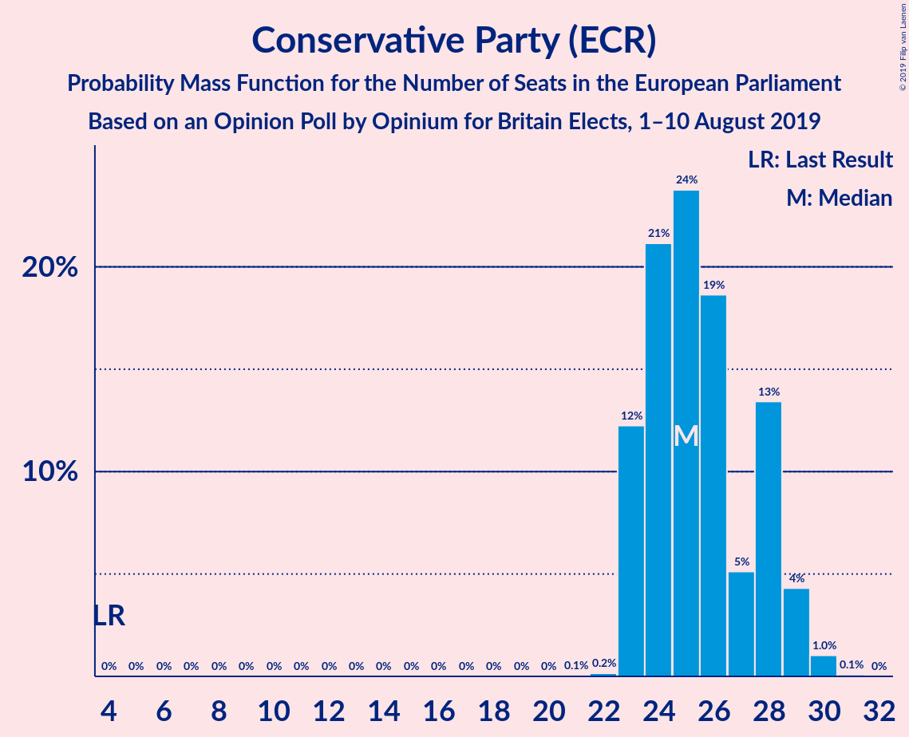
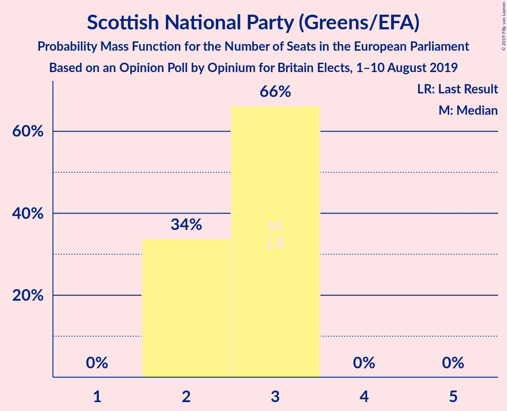
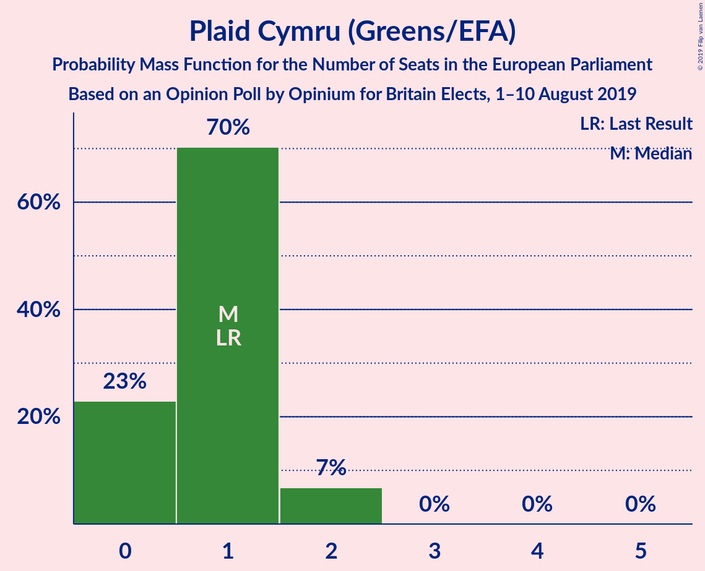
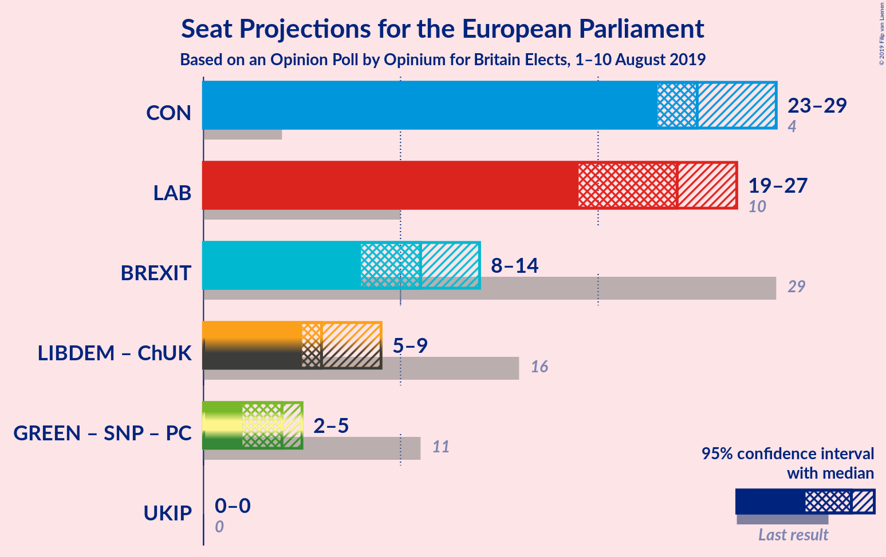
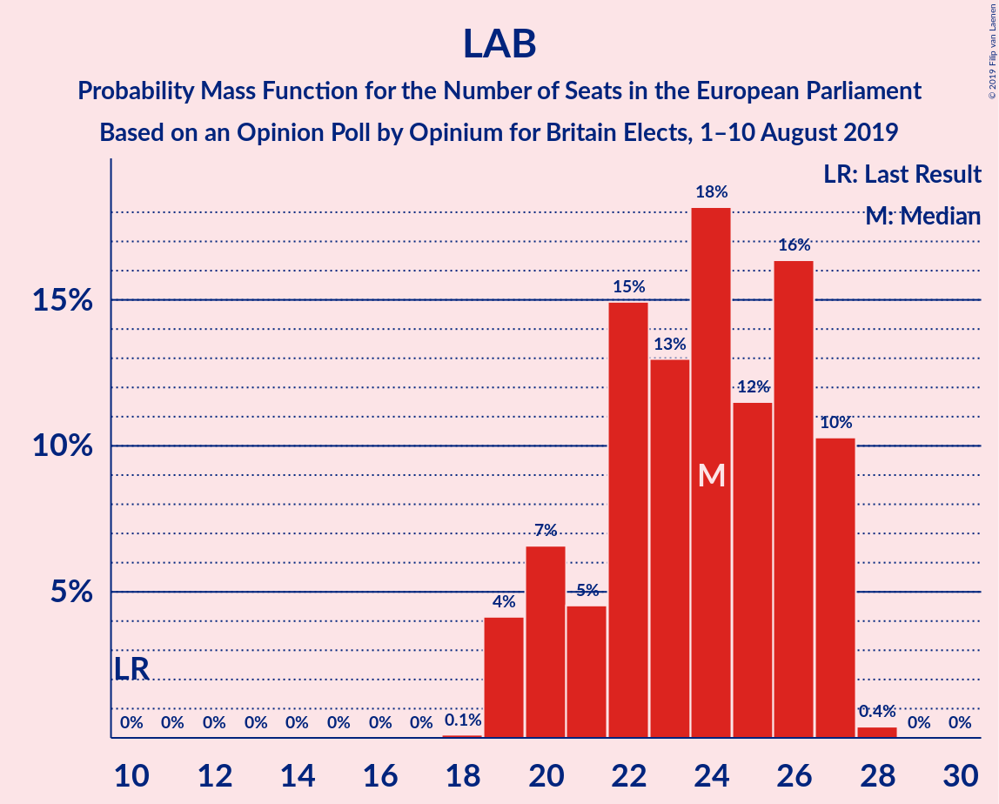
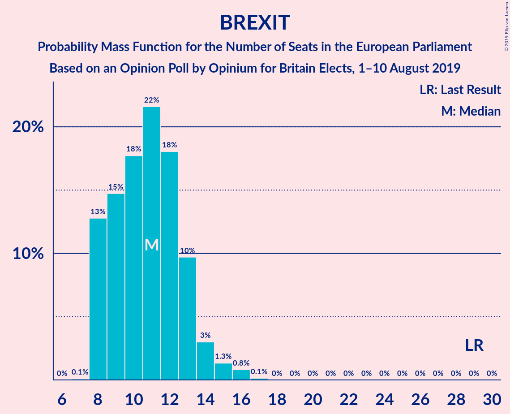

# Opinion Poll by Opinium for Britain Elects, 1–10 August 2019

<a href="#voting-intentions">Voting Intentions</a> | <a href="#seats">Seats</a> | <a href="#coalitions">Coalitions</a> | <a href="#technical-information">Technical Information</a>

## Voting Intentions

### Confidence Intervals

| Party | Last Result | Poll Result | 80% Confidence Interval | 90% Confidence Interval | 95% Confidence Interval | 99% Confidence Interval |
|:-----:|:-----------:|:-----------:|:-----------------------:|:-----------------------:|:-----------------------:|:-----------------------:|
| Conservative Party (ECR) | 8.8% | 30.9% | 29.1–32.8% |28.6–33.3% |28.2–33.8% |27.4–34.7% |
| Labour Party (S&D) | 13.7% | 27.9% | 26.2–29.7% |25.7–30.2% |25.3–30.7% |24.5–31.6% |
| Brexit Party (NI) | 30.5% | 15.9% | 14.6–17.5% |14.2–17.9% |13.8–18.3% |13.2–19.0% |
| Liberal Democrats (RE) | 19.6% | 13.0% | 11.8–14.4% |11.4–14.8% |11.1–15.2% |10.5–15.9% |
| Green Party (Greens/EFA) | 11.8% | 5.0% | 4.2–6.0% |4.0–6.2% |3.8–6.5% |3.5–7.0% |
| Scottish National Party (Greens/EFA) | 3.5% | 4.0% | 3.3–4.8% |3.1–5.1% |2.9–5.3% |2.7–5.8% |
| Plaid Cymru (Greens/EFA) | 1.0% | 1.0% | 0.7–1.6% |0.6–1.7% |0.6–1.9% |0.5–2.1% |
| UK Independence Party (ID) | 3.2% | 1.0% | 0.7–1.6% |0.6–1.7% |0.6–1.9% |0.5–2.1% |
| Change UK (RE) | 3.3% | 0.3% | 0.2–0.6% |0.1–0.7% |0.1–0.8% |0.1–1.0% |

*Note:* The poll result column reflects the actual value used in the calculations. Published results may vary slightly, and in addition be rounded to fewer digits.

## Seats

### Confidence Intervals

| Party | Last Result | Median | 80% Confidence Interval | 90% Confidence Interval | 95% Confidence Interval | 99% Confidence Interval |
|:-----:|:-----------:|:------:|:-----------------------:|:-----------------------:|:-----------------------:|:-----------------------:|
| <a href="#conservative-party-(ecr)">Conservative Party (ECR)</a> | 4 | 26 | 24–28 |24–28 |23–29 |23–30 |
| <a href="#labour-party-(s&d)">Labour Party (S&D)</a> | 10 | 23 | 21–26 |20–27 |20–27 |19–27 |
| <a href="#brexit-party-(ni)">Brexit Party (NI)</a> | 29 | 11 | 8–13 |8–14 |8–14 |8–16 |
| <a href="#liberal-democrats-(re)">Liberal Democrats (RE)</a> | 16 | 6 | 5–8 |5–8 |5–9 |4–10 |
| <a href="#green-party-(greens/efa)">Green Party (Greens/EFA)</a> | 7 | 0 | 0 |0 |0–2 |0–2 |
| <a href="#scottish-national-party-(greens/efa)">Scottish National Party (Greens/EFA)</a> | 3 | 3 | 2–3 |2–3 |2–3 |2–3 |
| <a href="#plaid-cymru-(greens/efa)">Plaid Cymru (Greens/EFA)</a> | 1 | 1 | 0–1 |0–1 |0–1 |0–2 |
| <a href="#uk-independence-party-(id)">UK Independence Party (ID)</a> | 0 | 0 | 0 |0 |0 |0 |
| <a href="#change-uk-(re)">Change UK (RE)</a> | 0 | 0 | 0 |0 |0 |0 |

### Conservative Party (ECR)

*For a full overview of the results for this party, see the [Conservative Party (ECR)](party-conservativepartyecr.html) page.*

| Number of Seats | Probability | Accumulated | Special Marks |
|:---------------:|:-----------:|:-----------:|:-------------:|
| 4 | 0% | 100% | Last Result |
| 5 | 0% | 100% |  |
| 6 | 0% | 100% |  |
| 7 | 0% | 100% |  |
| 8 | 0% | 100% |  |
| 9 | 0% | 100% |  |
| 10 | 0% | 100% |  |
| 11 | 0% | 100% |  |
| 12 | 0% | 100% |  |
| 13 | 0% | 100% |  |
| 14 | 0% | 100% |  |
| 15 | 0% | 100% |  |
| 16 | 0% | 100% |  |
| 17 | 0% | 100% |  |
| 18 | 0% | 100% |  |
| 19 | 0% | 100% |  |
| 20 | 0% | 100% |  |
| 21 | 0% | 100% |  |
| 22 | 0.1% | 100% |  |
| 23 | 4% | 99.9% |  |
| 24 | 19% | 96% |  |
| 25 | 23% | 77% |  |
| 26 | 19% | 54% | Median |
| 27 | 3% | 35% |  |
| 28 | 30% | 32% |  |
| 29 | 2% | 3% |  |
| 30 | 0.5% | 0.8% |  |
| 31 | 0.2% | 0.2% |  |
| 32 | 0% | 0% |  |

### Labour Party (S&D)

*For a full overview of the results for this party, see the [Labour Party (S&D)](party-labourpartysd.html) page.*

| Number of Seats | Probability | Accumulated | Special Marks |
|:---------------:|:-----------:|:-----------:|:-------------:|
| 10 | 0% | 100% | Last Result |
| 11 | 0% | 100% |  |
| 12 | 0% | 100% |  |
| 13 | 0% | 100% |  |
| 14 | 0% | 100% |  |
| 15 | 0% | 100% |  |
| 16 | 0% | 100% |  |
| 17 | 0% | 100% |  |
| 18 | 0.1% | 100% |  |
| 19 | 2% | 99.9% |  |
| 20 | 8% | 98% |  |
| 21 | 7% | 90% |  |
| 22 | 29% | 83% |  |
| 23 | 8% | 55% | Median |
| 24 | 15% | 46% |  |
| 25 | 3% | 32% |  |
| 26 | 19% | 29% |  |
| 27 | 10% | 10% |  |
| 28 | 0.2% | 0.2% |  |
| 29 | 0% | 0% |  |

### Brexit Party (NI)

*For a full overview of the results for this party, see the [Brexit Party (NI)](party-brexitpartyni.html) page.*

| Number of Seats | Probability | Accumulated | Special Marks |
|:---------------:|:-----------:|:-----------:|:-------------:|
| 8 | 13% | 100% |  |
| 9 | 6% | 87% |  |
| 10 | 27% | 81% |  |
| 11 | 31% | 53% | Median |
| 12 | 9% | 22% |  |
| 13 | 8% | 13% |  |
| 14 | 4% | 5% |  |
| 15 | 0.1% | 1.3% |  |
| 16 | 1.0% | 1.1% |  |
| 17 | 0.2% | 0.2% |  |
| 18 | 0% | 0% |  |
| 19 | 0% | 0% |  |
| 20 | 0% | 0% |  |
| 21 | 0% | 0% |  |
| 22 | 0% | 0% |  |
| 23 | 0% | 0% |  |
| 24 | 0% | 0% |  |
| 25 | 0% | 0% |  |
| 26 | 0% | 0% |  |
| 27 | 0% | 0% |  |
| 28 | 0% | 0% |  |
| 29 | 0% | 0% | Last Result |

### Liberal Democrats (RE)

*For a full overview of the results for this party, see the [Liberal Democrats (RE)](party-liberaldemocratsre.html) page.*

| Number of Seats | Probability | Accumulated | Special Marks |
|:---------------:|:-----------:|:-----------:|:-------------:|
| 4 | 1.0% | 100% |  |
| 5 | 10% | 99.0% |  |
| 6 | 69% | 89% | Median |
| 7 | 2% | 20% |  |
| 8 | 14% | 18% |  |
| 9 | 3% | 4% |  |
| 10 | 1.0% | 1.3% |  |
| 11 | 0.3% | 0.3% |  |
| 12 | 0% | 0% |  |
| 13 | 0% | 0% |  |
| 14 | 0% | 0% |  |
| 15 | 0% | 0% |  |
| 16 | 0% | 0% | Last Result |

### Green Party (Greens/EFA)

*For a full overview of the results for this party, see the [Green Party (Greens/EFA)](party-greenpartygreensefa.html) page.*

| Number of Seats | Probability | Accumulated | Special Marks |
|:---------------:|:-----------:|:-----------:|:-------------:|
| 0 | 96% | 100% | Median |
| 1 | 0.2% | 4% |  |
| 2 | 4% | 4% |  |
| 3 | 0% | 0% |  |
| 4 | 0% | 0% |  |
| 5 | 0% | 0% |  |
| 6 | 0% | 0% |  |
| 7 | 0% | 0% | Last Result |

### Scottish National Party (Greens/EFA)

*For a full overview of the results for this party, see the [Scottish National Party (Greens/EFA)](party-scottishnationalpartygreensefa.html) page.*

| Number of Seats | Probability | Accumulated | Special Marks |
|:---------------:|:-----------:|:-----------:|:-------------:|
| 2 | 31% | 100% |  |
| 3 | 69% | 69% | Last Result, Median |
| 4 | 0% | 0% |  |

### Plaid Cymru (Greens/EFA)

*For a full overview of the results for this party, see the [Plaid Cymru (Greens/EFA)](party-plaidcymrugreensefa.html) page.*

| Number of Seats | Probability | Accumulated | Special Marks |
|:---------------:|:-----------:|:-----------:|:-------------:|
| 0 | 14% | 100% |  |
| 1 | 84% | 86% | Last Result, Median |
| 2 | 2% | 2% |  |
| 3 | 0% | 0% |  |

### UK Independence Party (ID)

*For a full overview of the results for this party, see the [UK Independence Party (ID)](party-ukindependencepartyid.html) page.*

| Number of Seats | Probability | Accumulated | Special Marks |
|:---------------:|:-----------:|:-----------:|:-------------:|
| 0 | 100% | 100% | Last Result, Median |

### Change UK (RE)

*For a full overview of the results for this party, see the [Change UK (RE)](party-changeukre.html) page.*

| Number of Seats | Probability | Accumulated | Special Marks |
|:---------------:|:-----------:|:-----------:|:-------------:|
| 0 | 100% | 100% | Last Result, Median |

## Coalitions

### Confidence Intervals

| Coalition | Last Result | Median | Majority? | 80% Confidence Interval | 90% Confidence Interval | 95% Confidence Interval | 99% Confidence Interval |
|:---------:|:-----------:|:------:|:---------:|:-----------------------:|:-----------------------:|:-----------------------:|:-----------------------:|
| Conservative Party (ECR) | 4 | 26 | 0% | 24–28 | 24–28 | 23–29 | 23–30 |
| Labour Party (S&D) | 10 | 23 | 0% | 21–26 | 20–27 | 20–27 | 19–27 |
| Brexit Party (NI) | 29 | 11 | 0% | 8–13 | 8–14 | 8–14 | 8–16 |
| Liberal Democrats (RE) – Change UK (RE) | 16 | 6 | 0% | 5–8 | 5–8 | 5–9 | 4–10 |
| Green Party (Greens/EFA) – Scottish National Party (Greens/EFA) – Plaid Cymru (Greens/EFA) | 11 | 4 | 0% | 3–4 | 3–4 | 3–5 | 2–6 |
| UK Independence Party (ID) | 0 | 0 | 0% | 0 | 0 | 0 | 0 |

### Conservative Party (ECR)

| Number of Seats | Probability | Accumulated | Special Marks |
|:---------------:|:-----------:|:-----------:|:-------------:|
| 4 | 0% | 100% | Last Result |
| 5 | 0% | 100% |  |
| 6 | 0% | 100% |  |
| 7 | 0% | 100% |  |
| 8 | 0% | 100% |  |
| 9 | 0% | 100% |  |
| 10 | 0% | 100% |  |
| 11 | 0% | 100% |  |
| 12 | 0% | 100% |  |
| 13 | 0% | 100% |  |
| 14 | 0% | 100% |  |
| 15 | 0% | 100% |  |
| 16 | 0% | 100% |  |
| 17 | 0% | 100% |  |
| 18 | 0% | 100% |  |
| 19 | 0% | 100% |  |
| 20 | 0% | 100% |  |
| 21 | 0% | 100% |  |
| 22 | 0.1% | 100% |  |
| 23 | 4% | 99.9% |  |
| 24 | 19% | 96% |  |
| 25 | 23% | 77% |  |
| 26 | 19% | 54% | Median |
| 27 | 3% | 35% |  |
| 28 | 30% | 32% |  |
| 29 | 2% | 3% |  |
| 30 | 0.5% | 0.8% |  |
| 31 | 0.2% | 0.2% |  |
| 32 | 0% | 0% |  |

### Labour Party (S&D)

| Number of Seats | Probability | Accumulated | Special Marks |
|:---------------:|:-----------:|:-----------:|:-------------:|
| 10 | 0% | 100% | Last Result |
| 11 | 0% | 100% |  |
| 12 | 0% | 100% |  |
| 13 | 0% | 100% |  |
| 14 | 0% | 100% |  |
| 15 | 0% | 100% |  |
| 16 | 0% | 100% |  |
| 17 | 0% | 100% |  |
| 18 | 0.1% | 100% |  |
| 19 | 2% | 99.9% |  |
| 20 | 8% | 98% |  |
| 21 | 7% | 90% |  |
| 22 | 29% | 83% |  |
| 23 | 8% | 55% | Median |
| 24 | 15% | 46% |  |
| 25 | 3% | 32% |  |
| 26 | 19% | 29% |  |
| 27 | 10% | 10% |  |
| 28 | 0.2% | 0.2% |  |
| 29 | 0% | 0% |  |

### Brexit Party (NI)

| Number of Seats | Probability | Accumulated | Special Marks |
|:---------------:|:-----------:|:-----------:|:-------------:|
| 8 | 13% | 100% |  |
| 9 | 6% | 87% |  |
| 10 | 27% | 81% |  |
| 11 | 31% | 53% | Median |
| 12 | 9% | 22% |  |
| 13 | 8% | 13% |  |
| 14 | 4% | 5% |  |
| 15 | 0.1% | 1.3% |  |
| 16 | 1.0% | 1.1% |  |
| 17 | 0.2% | 0.2% |  |
| 18 | 0% | 0% |  |
| 19 | 0% | 0% |  |
| 20 | 0% | 0% |  |
| 21 | 0% | 0% |  |
| 22 | 0% | 0% |  |
| 23 | 0% | 0% |  |
| 24 | 0% | 0% |  |
| 25 | 0% | 0% |  |
| 26 | 0% | 0% |  |
| 27 | 0% | 0% |  |
| 28 | 0% | 0% |  |
| 29 | 0% | 0% | Last Result |

### Liberal Democrats (RE) – Change UK (RE)

| Number of Seats | Probability | Accumulated | Special Marks |
|:---------------:|:-----------:|:-----------:|:-------------:|
| 4 | 1.0% | 100% |  |
| 5 | 10% | 99.0% |  |
| 6 | 69% | 89% | Median |
| 7 | 2% | 20% |  |
| 8 | 14% | 18% |  |
| 9 | 3% | 4% |  |
| 10 | 1.0% | 1.3% |  |
| 11 | 0.3% | 0.3% |  |
| 12 | 0% | 0% |  |
| 13 | 0% | 0% |  |
| 14 | 0% | 0% |  |
| 15 | 0% | 0% |  |
| 16 | 0% | 0% | Last Result |

### Green Party (Greens/EFA) – Scottish National Party (Greens/EFA) – Plaid Cymru (Greens/EFA)

| Number of Seats | Probability | Accumulated | Special Marks |
|:---------------:|:-----------:|:-----------:|:-------------:|
| 2 | 0.8% | 100% |  |
| 3 | 41% | 99.2% |  |
| 4 | 54% | 58% | Median |
| 5 | 2% | 4% |  |
| 6 | 2% | 2% |  |
| 7 | 0% | 0% |  |
| 8 | 0% | 0% |  |
| 9 | 0% | 0% |  |
| 10 | 0% | 0% |  |
| 11 | 0% | 0% | Last Result |

### UK Independence Party (ID)

| Number of Seats | Probability | Accumulated | Special Marks |
|:---------------:|:-----------:|:-----------:|:-------------:|
| 0 | 100% | 100% | Last Result, Median |

## Technical Information

### Opinion Poll

+ **Polling firm:** Opinium
+ **Commissioner(s):** Britain Elects
+ **Fieldwork period:** 1–10 August 2019

### Calculations

+ **Sample size:** 1061
+ **Simulations done:** 131,072
+ **Error estimate:** 4.02%

