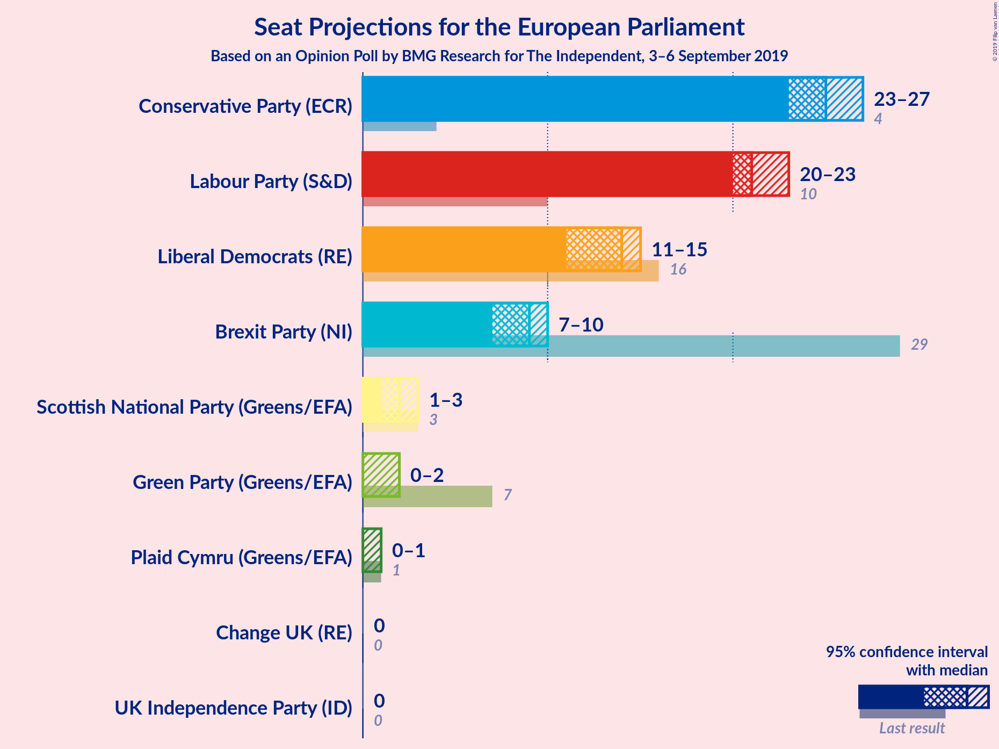
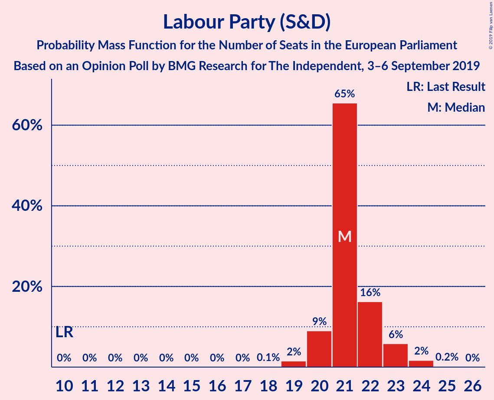
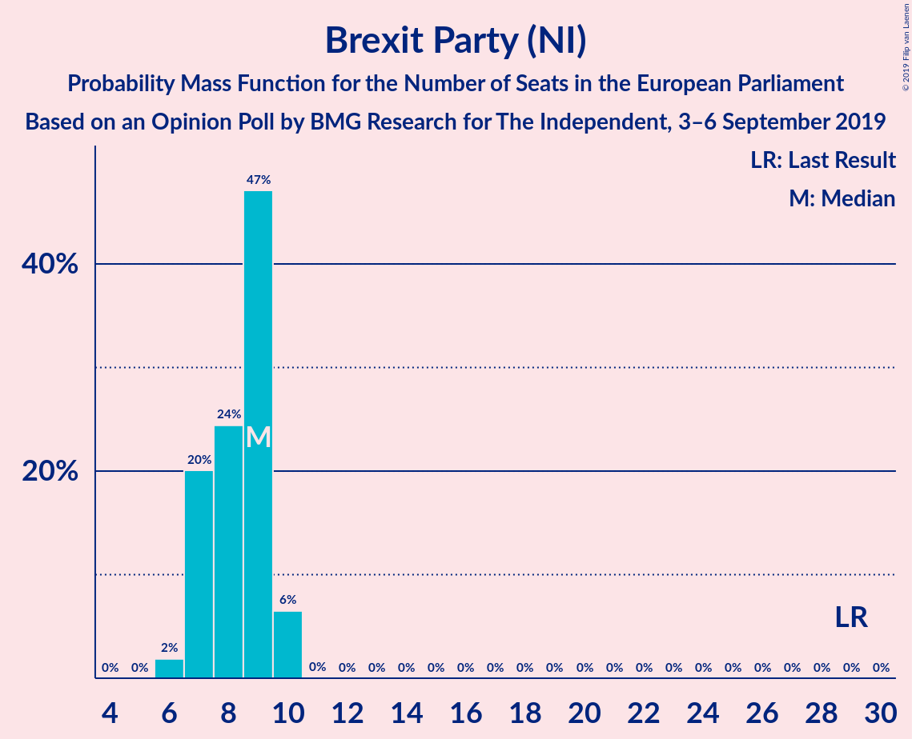

# Opinion Poll by BMG Research for The Independent, 3–6 September 2019

<a href="#voting-intentions">Voting Intentions</a> | <a href="#seats">Seats</a> | <a href="#coalitions">Coalitions</a> | <a href="#technical-information">Technical Information</a>

## Voting Intentions

### Confidence Intervals

| Party | Last Result | Poll Result | 80% Confidence Interval | 90% Confidence Interval | 95% Confidence Interval | 99% Confidence Interval |
|:-----:|:-----------:|:-----------:|:-----------------------:|:-----------------------:|:-----------------------:|:-----------------------:|
| Conservative Party (ECR) | 8.8% | 31.0% | 29.5–32.6% |29.1–33.0% |28.7–33.4% |28.0–34.1% |
| Labour Party (S&D) | 13.7% | 27.0% | 25.6–28.5% |25.1–28.9% |24.8–29.3% |24.1–30.0% |
| Liberal Democrats (RE) | 19.6% | 19.0% | 17.8–20.4% |17.4–20.8% |17.1–21.1% |16.5–21.7% |
| Brexit Party (NI) | 30.5% | 13.0% | 12.0–14.2% |11.7–14.5% |11.4–14.8% |10.9–15.4% |

*Note:* The poll result column reflects the actual value used in the calculations. Published results may vary slightly, and in addition be rounded to fewer digits.

## Seats

### Confidence Intervals

| Party | Last Result | Median | 80% Confidence Interval | 90% Confidence Interval | 95% Confidence Interval | 99% Confidence Interval |
|:-----:|:-----------:|:------:|:-----------------------:|:-----------------------:|:-----------------------:|:-----------------------:|
| <a href="#conservative-party-(ecr)">Conservative Party (ECR)</a> | 4 | 23 | 22–24 |21–25 |21–25 |20–26 |
| <a href="#labour-party-(s&d)">Labour Party (S&D)</a> | 10 | 19 | 18–20 |17–21 |17–21 |16–23 |
| <a href="#liberal-democrats-(re)">Liberal Democrats (RE)</a> | 16 | 11 | 10–13 |9–13 |9–14 |8–16 |
| <a href="#brexit-party-(ni)">Brexit Party (NI)</a> | 29 | 7 | 7–9 |7–9 |6–10 |5–10 |

### Conservative Party (ECR)

*For a full overview of the results for this party, see the [Conservative Party (ECR)](party-conservativepartyecr.html) page.*

| Number of Seats | Probability | Accumulated | Special Marks |
|:---------------:|:-----------:|:-----------:|:-------------:|
| 4 | 0% | 100% | Last Result |
| 5 | 0% | 100% |  |
| 6 | 0% | 100% |  |
| 7 | 0% | 100% |  |
| 8 | 0% | 100% |  |
| 9 | 0% | 100% |  |
| 10 | 0% | 100% |  |
| 11 | 0% | 100% |  |
| 12 | 0% | 100% |  |
| 13 | 0% | 100% |  |
| 14 | 0% | 100% |  |
| 15 | 0% | 100% |  |
| 16 | 0% | 100% |  |
| 17 | 0% | 100% |  |
| 18 | 0% | 100% |  |
| 19 | 0.1% | 100% |  |
| 20 | 0.9% | 99.9% |  |
| 21 | 5% | 99.0% |  |
| 22 | 16% | 94% |  |
| 23 | 30% | 79% | Median |
| 24 | 41% | 49% |  |
| 25 | 7% | 8% |  |
| 26 | 1.2% | 1.2% |  |
| 27 | 0% | 0% |  |

### Labour Party (S&D)

*For a full overview of the results for this party, see the [Labour Party (S&D)](party-labourpartysd.html) page.*

| Number of Seats | Probability | Accumulated | Special Marks |
|:---------------:|:-----------:|:-----------:|:-------------:|
| 10 | 0% | 100% | Last Result |
| 11 | 0% | 100% |  |
| 12 | 0% | 100% |  |
| 13 | 0% | 100% |  |
| 14 | 0% | 100% |  |
| 15 | 0% | 100% |  |
| 16 | 2% | 100% |  |
| 17 | 6% | 98% |  |
| 18 | 10% | 92% |  |
| 19 | 57% | 82% | Median |
| 20 | 18% | 25% |  |
| 21 | 4% | 6% |  |
| 22 | 1.3% | 2% |  |
| 23 | 0.5% | 0.7% |  |
| 24 | 0.1% | 0.1% |  |
| 25 | 0% | 0% |  |

### Liberal Democrats (RE)

*For a full overview of the results for this party, see the [Liberal Democrats (RE)](party-liberaldemocratsre.html) page.*

| Number of Seats | Probability | Accumulated | Special Marks |
|:---------------:|:-----------:|:-----------:|:-------------:|
| 7 | 0.1% | 100% |  |
| 8 | 0.8% | 99.9% |  |
| 9 | 5% | 99.1% |  |
| 10 | 15% | 94% |  |
| 11 | 37% | 79% | Median |
| 12 | 29% | 42% |  |
| 13 | 10% | 13% |  |
| 14 | 1.2% | 3% |  |
| 15 | 1.3% | 2% |  |
| 16 | 1.0% | 1.0% | Last Result |
| 17 | 0% | 0% |  |

### Brexit Party (NI)

*For a full overview of the results for this party, see the [Brexit Party (NI)](party-brexitpartyni.html) page.*

| Number of Seats | Probability | Accumulated | Special Marks |
|:---------------:|:-----------:|:-----------:|:-------------:|
| 4 | 0.2% | 100% |  |
| 5 | 0.8% | 99.8% |  |
| 6 | 2% | 99.0% |  |
| 7 | 71% | 97% | Median |
| 8 | 16% | 27% |  |
| 9 | 7% | 10% |  |
| 10 | 4% | 4% |  |
| 11 | 0% | 0% |  |
| 12 | 0% | 0% |  |
| 13 | 0% | 0% |  |
| 14 | 0% | 0% |  |
| 15 | 0% | 0% |  |
| 16 | 0% | 0% |  |
| 17 | 0% | 0% |  |
| 18 | 0% | 0% |  |
| 19 | 0% | 0% |  |
| 20 | 0% | 0% |  |
| 21 | 0% | 0% |  |
| 22 | 0% | 0% |  |
| 23 | 0% | 0% |  |
| 24 | 0% | 0% |  |
| 25 | 0% | 0% |  |
| 26 | 0% | 0% |  |
| 27 | 0% | 0% |  |
| 28 | 0% | 0% |  |
| 29 | 0% | 0% | Last Result |

## Coalitions

### Confidence Intervals

| Coalition | Last Result | Median | Majority? | 80% Confidence Interval | 90% Confidence Interval | 95% Confidence Interval | 99% Confidence Interval |
|:---------:|:-----------:|:------:|:---------:|:-----------------------:|:-----------------------:|:-----------------------:|:-----------------------:|
| Conservative Party (ECR) | 4 | 23 | 0% | 22–24 | 21–25 | 21–25 | 20–26 |
| Labour Party (S&D) | 10 | 19 | 0% | 18–20 | 17–21 | 17–21 | 16–23 |
| Brexit Party (NI) | 29 | 7 | 0% | 7–9 | 7–9 | 6–10 | 5–10 |

### Conservative Party (ECR)

| Number of Seats | Probability | Accumulated | Special Marks |
|:---------------:|:-----------:|:-----------:|:-------------:|
| 4 | 0% | 100% | Last Result |
| 5 | 0% | 100% |  |
| 6 | 0% | 100% |  |
| 7 | 0% | 100% |  |
| 8 | 0% | 100% |  |
| 9 | 0% | 100% |  |
| 10 | 0% | 100% |  |
| 11 | 0% | 100% |  |
| 12 | 0% | 100% |  |
| 13 | 0% | 100% |  |
| 14 | 0% | 100% |  |
| 15 | 0% | 100% |  |
| 16 | 0% | 100% |  |
| 17 | 0% | 100% |  |
| 18 | 0% | 100% |  |
| 19 | 0.1% | 100% |  |
| 20 | 0.9% | 99.9% |  |
| 21 | 5% | 99.0% |  |
| 22 | 16% | 94% |  |
| 23 | 30% | 79% | Median |
| 24 | 41% | 49% |  |
| 25 | 7% | 8% |  |
| 26 | 1.2% | 1.2% |  |
| 27 | 0% | 0% |  |

### Labour Party (S&D)

| Number of Seats | Probability | Accumulated | Special Marks |
|:---------------:|:-----------:|:-----------:|:-------------:|
| 10 | 0% | 100% | Last Result |
| 11 | 0% | 100% |  |
| 12 | 0% | 100% |  |
| 13 | 0% | 100% |  |
| 14 | 0% | 100% |  |
| 15 | 0% | 100% |  |
| 16 | 2% | 100% |  |
| 17 | 6% | 98% |  |
| 18 | 10% | 92% |  |
| 19 | 57% | 82% | Median |
| 20 | 18% | 25% |  |
| 21 | 4% | 6% |  |
| 22 | 1.3% | 2% |  |
| 23 | 0.5% | 0.7% |  |
| 24 | 0.1% | 0.1% |  |
| 25 | 0% | 0% |  |

### Brexit Party (NI)

| Number of Seats | Probability | Accumulated | Special Marks |
|:---------------:|:-----------:|:-----------:|:-------------:|
| 4 | 0.2% | 100% |  |
| 5 | 0.8% | 99.8% |  |
| 6 | 2% | 99.0% |  |
| 7 | 71% | 97% | Median |
| 8 | 16% | 27% |  |
| 9 | 7% | 10% |  |
| 10 | 4% | 4% |  |
| 11 | 0% | 0% |  |
| 12 | 0% | 0% |  |
| 13 | 0% | 0% |  |
| 14 | 0% | 0% |  |
| 15 | 0% | 0% |  |
| 16 | 0% | 0% |  |
| 17 | 0% | 0% |  |
| 18 | 0% | 0% |  |
| 19 | 0% | 0% |  |
| 20 | 0% | 0% |  |
| 21 | 0% | 0% |  |
| 22 | 0% | 0% |  |
| 23 | 0% | 0% |  |
| 24 | 0% | 0% |  |
| 25 | 0% | 0% |  |
| 26 | 0% | 0% |  |
| 27 | 0% | 0% |  |
| 28 | 0% | 0% |  |
| 29 | 0% | 0% | Last Result |

## Technical Information

### Opinion Poll

+ **Polling firm:** BMG Research
+ **Commissioner(s):** The Independent
+ **Fieldwork period:** 3–6 September 2019

### Calculations

+ **Sample size:** 1504
+ **Simulations done:** 1,048,576
+ **Error estimate:** 0.21%

