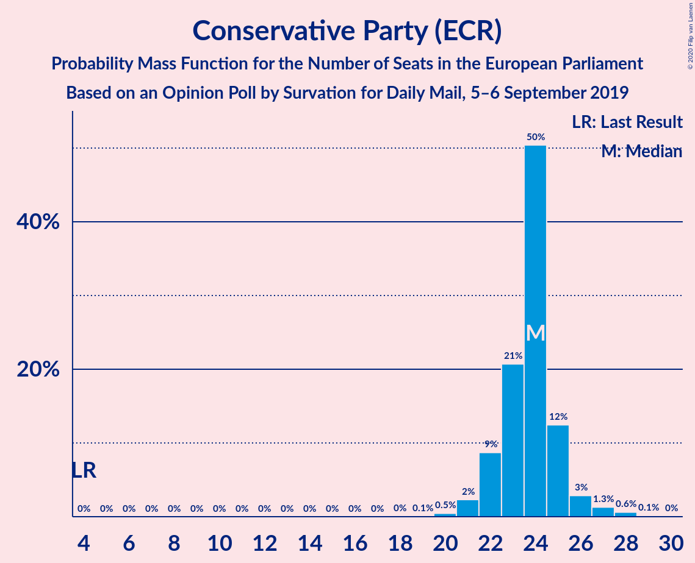
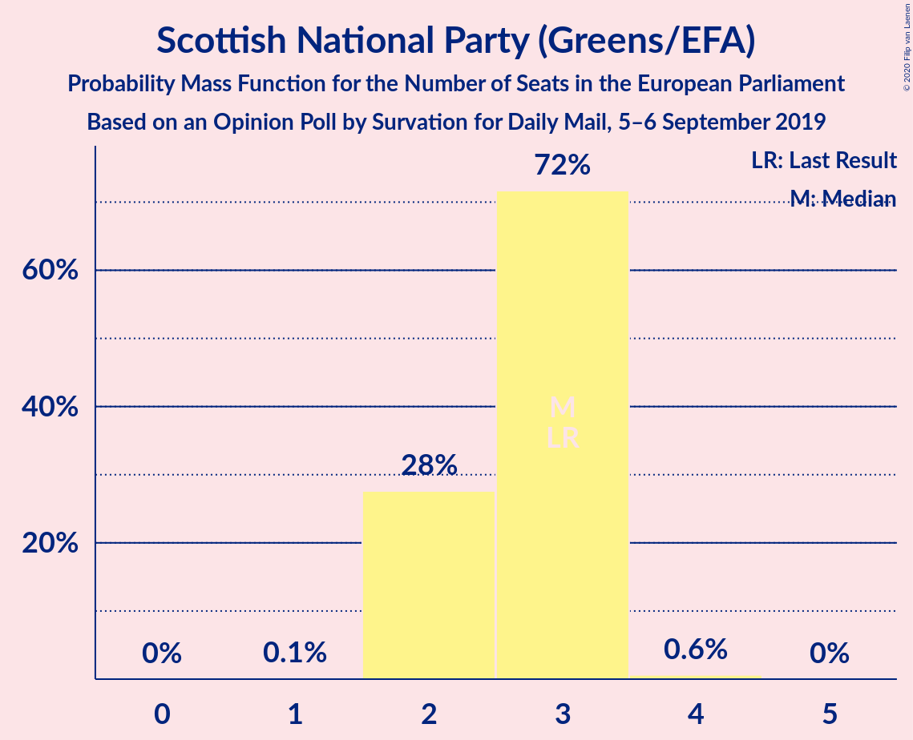
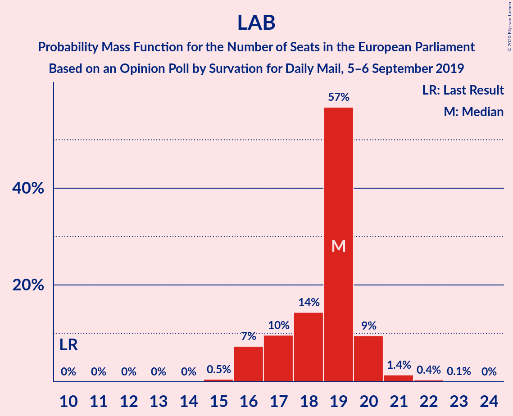
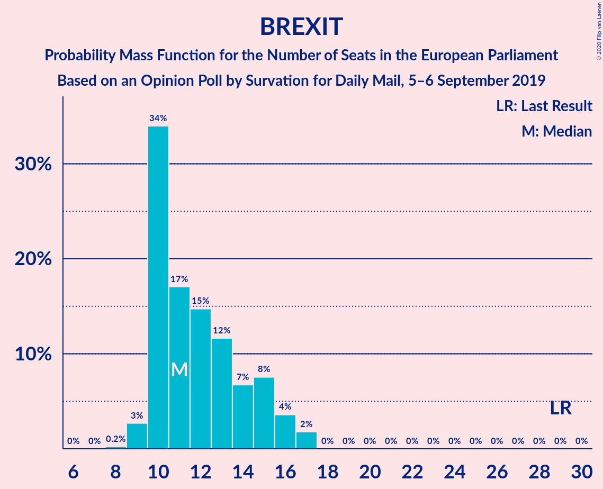

# Opinion Poll by Survation for Daily Mail, 5–6 September 2019

<a href="#voting-intentions">Voting Intentions</a> | <a href="#seats">Seats</a> | <a href="#coalitions">Coalitions</a> | <a href="#technical-information">Technical Information</a>

## Voting Intentions

### Confidence Intervals

| Party | Last Result | Poll Result | 80% Confidence Interval | 90% Confidence Interval | 95% Confidence Interval | 99% Confidence Interval |
|:-----:|:-----------:|:-----------:|:-----------------------:|:-----------------------:|:-----------------------:|:-----------------------:|
| Conservative Party (ECR) | 8.8% | 29.0% | 27.2–30.9% |26.7–31.4% |26.3–31.9% |25.5–32.8% |
| Labour Party (S&D) | 13.7% | 24.0% | 22.4–25.8% |21.9–26.3% |21.5–26.7% |20.7–27.6% |
| Liberal Democrats (RE) | 19.6% | 18.0% | 16.6–19.7% |16.2–20.1% |15.8–20.5% |15.1–21.3% |
| Brexit Party (NI) | 30.5% | 17.0% | 15.5–18.5% |15.1–19.0% |14.8–19.4% |14.1–20.2% |
| Scottish National Party (Greens/EFA) | 3.5% | 4.0% | 3.3–4.9% |3.1–5.2% |3.0–5.4% |2.7–5.9% |
| Green Party (Greens/EFA) | 11.8% | 3.0% | 2.5–3.9% |2.3–4.1% |2.1–4.3% |1.9–4.7% |

*Note:* The poll result column reflects the actual value used in the calculations. Published results may vary slightly, and in addition be rounded to fewer digits.

## Seats

### Confidence Intervals

| Party | Last Result | Median | 80% Confidence Interval | 90% Confidence Interval | 95% Confidence Interval | 99% Confidence Interval |
|:-----:|:-----------:|:------:|:-----------------------:|:-----------------------:|:-----------------------:|:-----------------------:|
| <a href="#conservative-party-(ecr)">Conservative Party (ECR)</a> | 4 | 24 | 21–24 |21–25 |21–25 |20–28 |
| <a href="#labour-party-(s&d)">Labour Party (S&D)</a> | 10 | 17 | 16–22 |16–22 |16–23 |15–24 |
| <a href="#liberal-democrats-(re)">Liberal Democrats (RE)</a> | 16 | 15 | 11–15 |10–15 |9–15 |9–18 |
| <a href="#brexit-party-(ni)">Brexit Party (NI)</a> | 29 | 10 | 9–16 |9–16 |8–16 |8–17 |
| <a href="#scottish-national-party-(greens/efa)">Scottish National Party (Greens/EFA)</a> | 3 | 3 | 2–3 |2–3 |2–3 |2–3 |
| <a href="#green-party-(greens/efa)">Green Party (Greens/EFA)</a> | 7 | 0 | 0 |0 |0 |0 |

### Conservative Party (ECR)

*For a full overview of the results for this party, see the [Conservative Party (ECR)](party-conservativepartyecr.html) page.*

| Number of Seats | Probability | Accumulated | Special Marks |
|:---------------:|:-----------:|:-----------:|:-------------:|
| 4 | 0% | 100% | Last Result |
| 5 | 0% | 100% |  |
| 6 | 0% | 100% |  |
| 7 | 0% | 100% |  |
| 8 | 0% | 100% |  |
| 9 | 0% | 100% |  |
| 10 | 0% | 100% |  |
| 11 | 0% | 100% |  |
| 12 | 0% | 100% |  |
| 13 | 0% | 100% |  |
| 14 | 0% | 100% |  |
| 15 | 0% | 100% |  |
| 16 | 0% | 100% |  |
| 17 | 0% | 100% |  |
| 18 | 0% | 100% |  |
| 19 | 0.4% | 100% |  |
| 20 | 1.0% | 99.6% |  |
| 21 | 14% | 98.5% |  |
| 22 | 9% | 84% |  |
| 23 | 3% | 75% |  |
| 24 | 65% | 72% | Median |
| 25 | 5% | 7% |  |
| 26 | 0.2% | 2% |  |
| 27 | 1.0% | 2% |  |
| 28 | 1.0% | 1.0% |  |
| 29 | 0% | 0% |  |

### Labour Party (S&D)

*For a full overview of the results for this party, see the [Labour Party (S&D)](party-labourpartysd.html) page.*

| Number of Seats | Probability | Accumulated | Special Marks |
|:---------------:|:-----------:|:-----------:|:-------------:|
| 10 | 0% | 100% | Last Result |
| 11 | 0% | 100% |  |
| 12 | 0% | 100% |  |
| 13 | 0% | 100% |  |
| 14 | 0% | 100% |  |
| 15 | 0.6% | 100% |  |
| 16 | 15% | 99.4% |  |
| 17 | 55% | 85% | Median |
| 18 | 2% | 30% |  |
| 19 | 16% | 28% |  |
| 20 | 0.1% | 12% |  |
| 21 | 0% | 12% |  |
| 22 | 9% | 12% |  |
| 23 | 0.7% | 3% |  |
| 24 | 2% | 2% |  |
| 25 | 0% | 0% |  |

### Liberal Democrats (RE)

*For a full overview of the results for this party, see the [Liberal Democrats (RE)](party-liberaldemocratsre.html) page.*

| Number of Seats | Probability | Accumulated | Special Marks |
|:---------------:|:-----------:|:-----------:|:-------------:|
| 8 | 0.1% | 100% |  |
| 9 | 3% | 99.9% |  |
| 10 | 4% | 97% |  |
| 11 | 7% | 94% |  |
| 12 | 1.0% | 86% |  |
| 13 | 18% | 85% |  |
| 14 | 16% | 67% |  |
| 15 | 51% | 51% | Median |
| 16 | 0.3% | 0.8% | Last Result |
| 17 | 0% | 0.6% |  |
| 18 | 0.6% | 0.6% |  |
| 19 | 0% | 0% |  |

### Brexit Party (NI)

*For a full overview of the results for this party, see the [Brexit Party (NI)](party-brexitpartyni.html) page.*

| Number of Seats | Probability | Accumulated | Special Marks |
|:---------------:|:-----------:|:-----------:|:-------------:|
| 7 | 0.1% | 100% |  |
| 8 | 3% | 99.9% |  |
| 9 | 9% | 97% |  |
| 10 | 61% | 88% | Median |
| 11 | 2% | 27% |  |
| 12 | 4% | 25% |  |
| 13 | 2% | 21% |  |
| 14 | 0.2% | 19% |  |
| 15 | 4% | 19% |  |
| 16 | 14% | 15% |  |
| 17 | 1.0% | 1.1% |  |
| 18 | 0.1% | 0.1% |  |
| 19 | 0% | 0% |  |
| 20 | 0% | 0% |  |
| 21 | 0% | 0% |  |
| 22 | 0% | 0% |  |
| 23 | 0% | 0% |  |
| 24 | 0% | 0% |  |
| 25 | 0% | 0% |  |
| 26 | 0% | 0% |  |
| 27 | 0% | 0% |  |
| 28 | 0% | 0% |  |
| 29 | 0% | 0% | Last Result |

### Scottish National Party (Greens/EFA)

*For a full overview of the results for this party, see the [Scottish National Party (Greens/EFA)](party-scottishnationalpartygreensefa.html) page.*

| Number of Seats | Probability | Accumulated | Special Marks |
|:---------------:|:-----------:|:-----------:|:-------------:|
| 1 | 0.1% | 100% |  |
| 2 | 20% | 99.9% |  |
| 3 | 80% | 80% | Last Result, Median |
| 4 | 0% | 0% |  |

### Green Party (Greens/EFA)

*For a full overview of the results for this party, see the [Green Party (Greens/EFA)](party-greenpartygreensefa.html) page.*

| Number of Seats | Probability | Accumulated | Special Marks |
|:---------------:|:-----------:|:-----------:|:-------------:|
| 0 | 100% | 100% | Median |
| 1 | 0% | 0% |  |
| 2 | 0% | 0% |  |
| 3 | 0% | 0% |  |
| 4 | 0% | 0% |  |
| 5 | 0% | 0% |  |
| 6 | 0% | 0% |  |
| 7 | 0% | 0% | Last Result |

## Coalitions

### Confidence Intervals

| Coalition | Last Result | Median | Majority? | 80% Confidence Interval | 90% Confidence Interval | 95% Confidence Interval | 99% Confidence Interval |
|:---------:|:-----------:|:------:|:---------:|:-----------------------:|:-----------------------:|:-----------------------:|:-----------------------:|
| Conservative Party (ECR) | 4 | 24 | 0% | 21–24 | 21–25 | 21–25 | 20–28 |
| Labour Party (S&D) | 10 | 17 | 0% | 16–22 | 16–22 | 16–23 | 15–24 |
| Brexit Party (NI) | 29 | 10 | 0% | 9–16 | 9–16 | 8–16 | 8–17 |

### Conservative Party (ECR)

| Number of Seats | Probability | Accumulated | Special Marks |
|:---------------:|:-----------:|:-----------:|:-------------:|
| 4 | 0% | 100% | Last Result |
| 5 | 0% | 100% |  |
| 6 | 0% | 100% |  |
| 7 | 0% | 100% |  |
| 8 | 0% | 100% |  |
| 9 | 0% | 100% |  |
| 10 | 0% | 100% |  |
| 11 | 0% | 100% |  |
| 12 | 0% | 100% |  |
| 13 | 0% | 100% |  |
| 14 | 0% | 100% |  |
| 15 | 0% | 100% |  |
| 16 | 0% | 100% |  |
| 17 | 0% | 100% |  |
| 18 | 0% | 100% |  |
| 19 | 0.4% | 100% |  |
| 20 | 1.0% | 99.6% |  |
| 21 | 14% | 98.5% |  |
| 22 | 9% | 84% |  |
| 23 | 3% | 75% |  |
| 24 | 65% | 72% | Median |
| 25 | 5% | 7% |  |
| 26 | 0.2% | 2% |  |
| 27 | 1.0% | 2% |  |
| 28 | 1.0% | 1.0% |  |
| 29 | 0% | 0% |  |

### Labour Party (S&D)

| Number of Seats | Probability | Accumulated | Special Marks |
|:---------------:|:-----------:|:-----------:|:-------------:|
| 10 | 0% | 100% | Last Result |
| 11 | 0% | 100% |  |
| 12 | 0% | 100% |  |
| 13 | 0% | 100% |  |
| 14 | 0% | 100% |  |
| 15 | 0.6% | 100% |  |
| 16 | 15% | 99.4% |  |
| 17 | 55% | 85% | Median |
| 18 | 2% | 30% |  |
| 19 | 16% | 28% |  |
| 20 | 0.1% | 12% |  |
| 21 | 0% | 12% |  |
| 22 | 9% | 12% |  |
| 23 | 0.7% | 3% |  |
| 24 | 2% | 2% |  |
| 25 | 0% | 0% |  |

### Brexit Party (NI)

| Number of Seats | Probability | Accumulated | Special Marks |
|:---------------:|:-----------:|:-----------:|:-------------:|
| 7 | 0.1% | 100% |  |
| 8 | 3% | 99.9% |  |
| 9 | 9% | 97% |  |
| 10 | 61% | 88% | Median |
| 11 | 2% | 27% |  |
| 12 | 4% | 25% |  |
| 13 | 2% | 21% |  |
| 14 | 0.2% | 19% |  |
| 15 | 4% | 19% |  |
| 16 | 14% | 15% |  |
| 17 | 1.0% | 1.1% |  |
| 18 | 0.1% | 0.1% |  |
| 19 | 0% | 0% |  |
| 20 | 0% | 0% |  |
| 21 | 0% | 0% |  |
| 22 | 0% | 0% |  |
| 23 | 0% | 0% |  |
| 24 | 0% | 0% |  |
| 25 | 0% | 0% |  |
| 26 | 0% | 0% |  |
| 27 | 0% | 0% |  |
| 28 | 0% | 0% |  |
| 29 | 0% | 0% | Last Result |

## Technical Information

### Opinion Poll

+ **Polling firm:** Survation
+ **Commissioner(s):** Daily Mail
+ **Fieldwork period:** 5–6 September 2019

### Calculations

+ **Sample size:** 1020
+ **Simulations done:** 1,024
+ **Error estimate:** 3.03%

