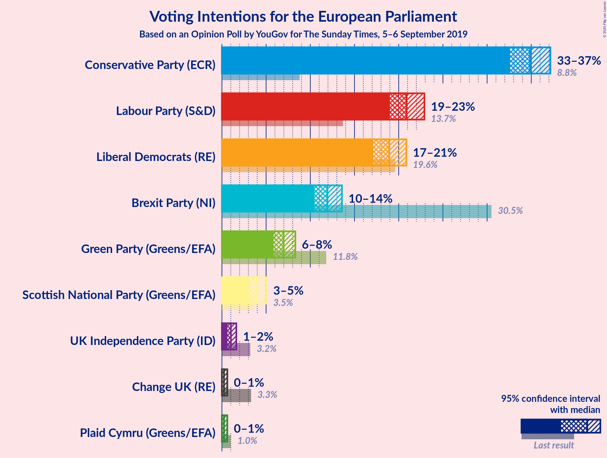
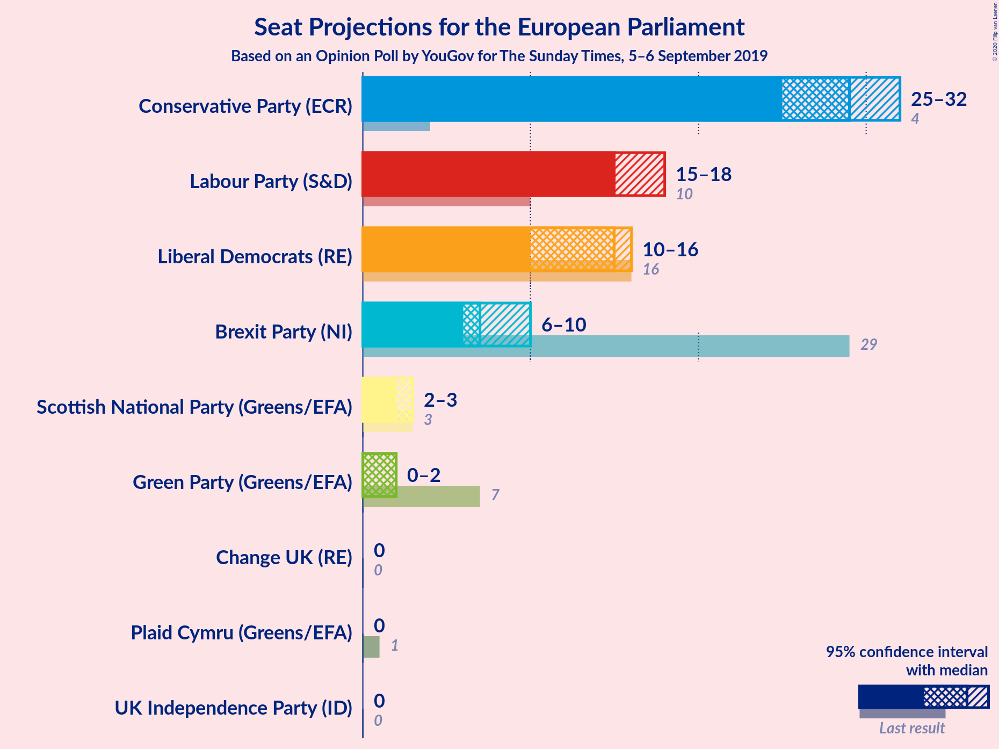
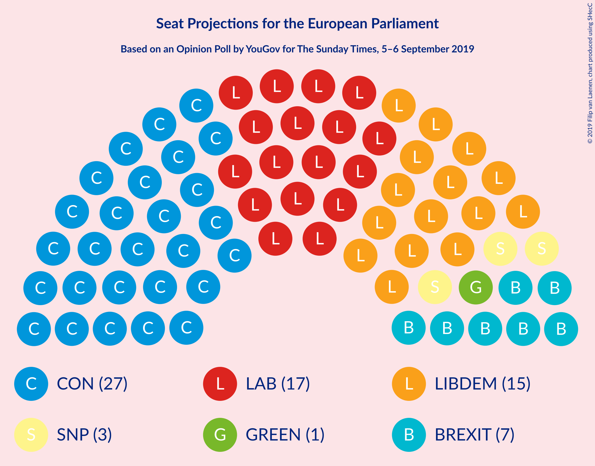
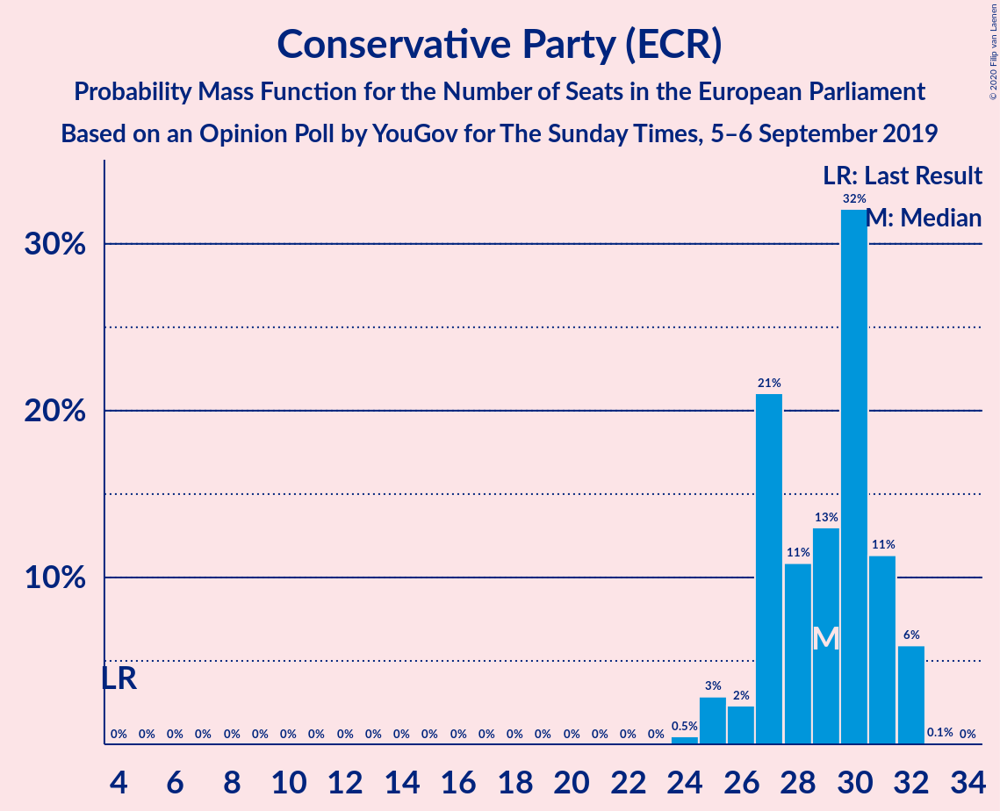
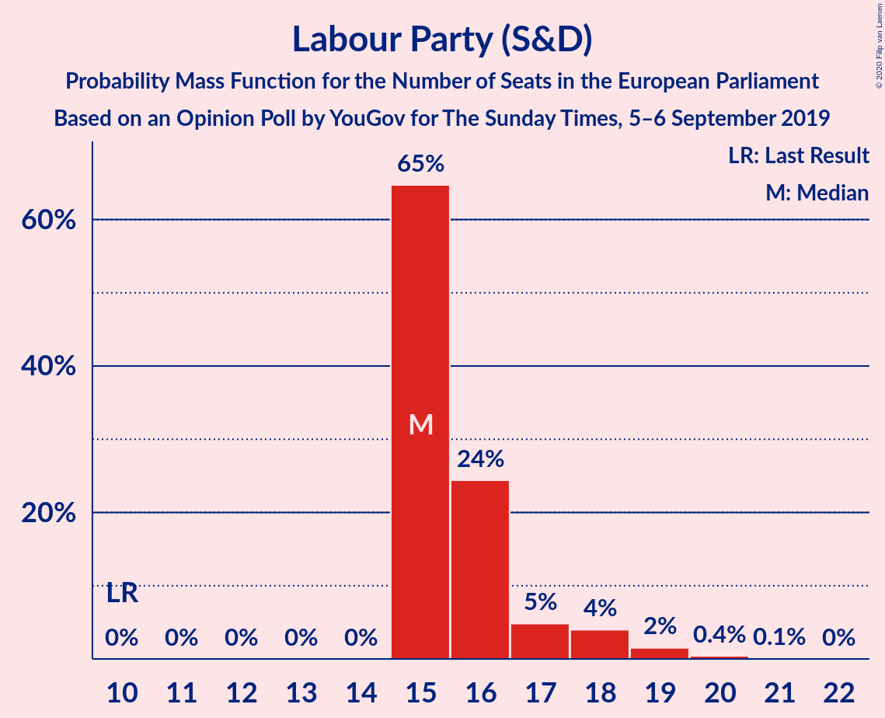
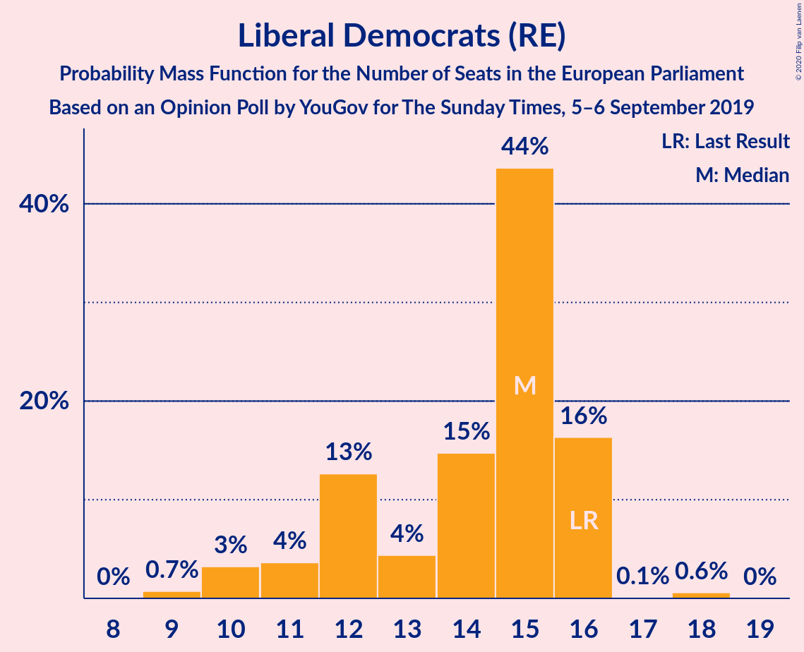
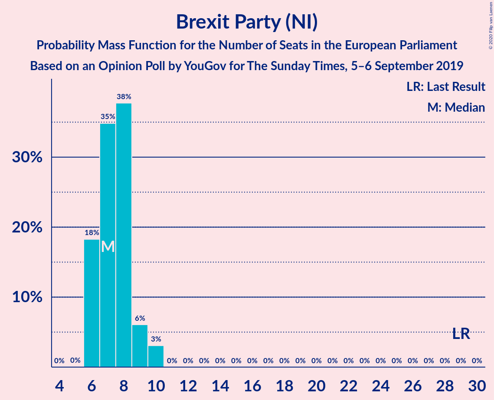
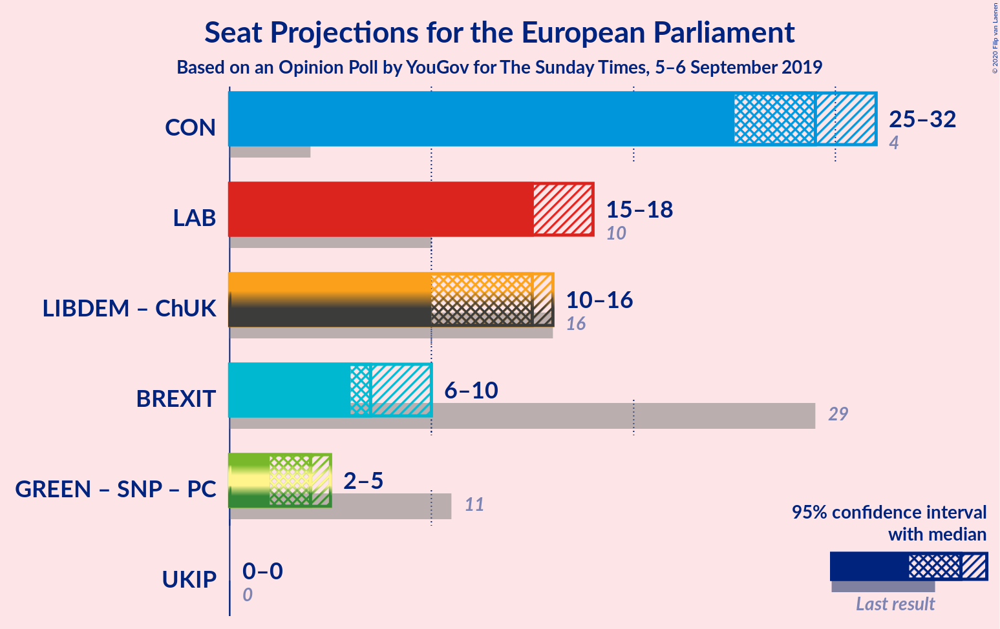
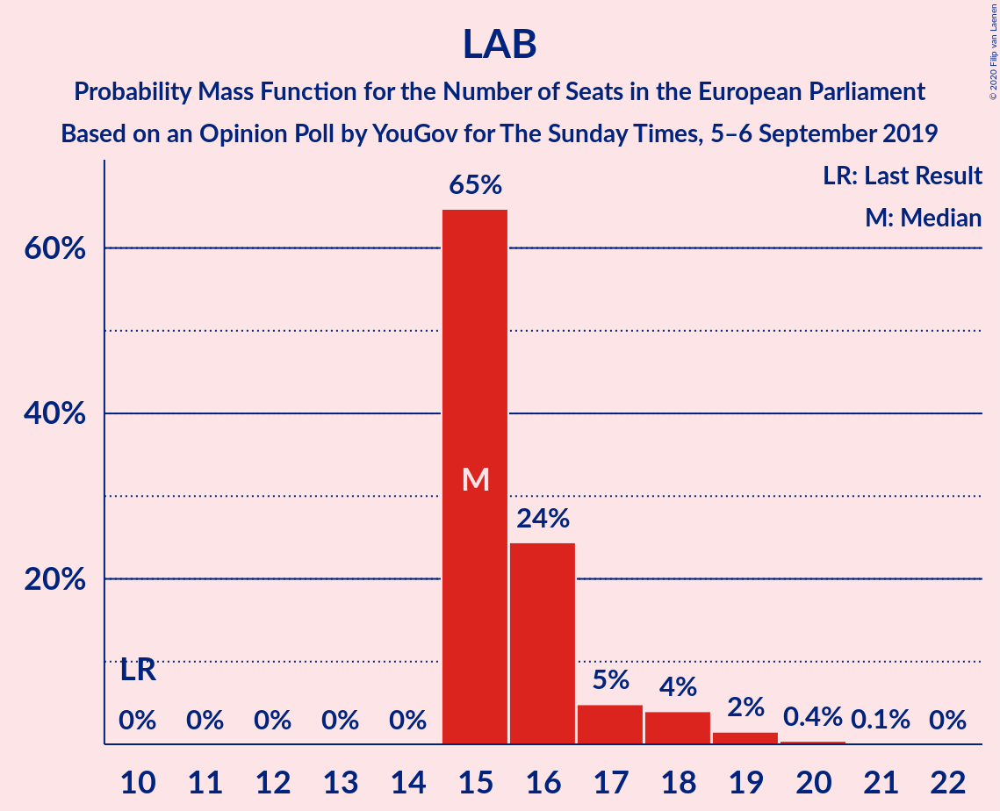
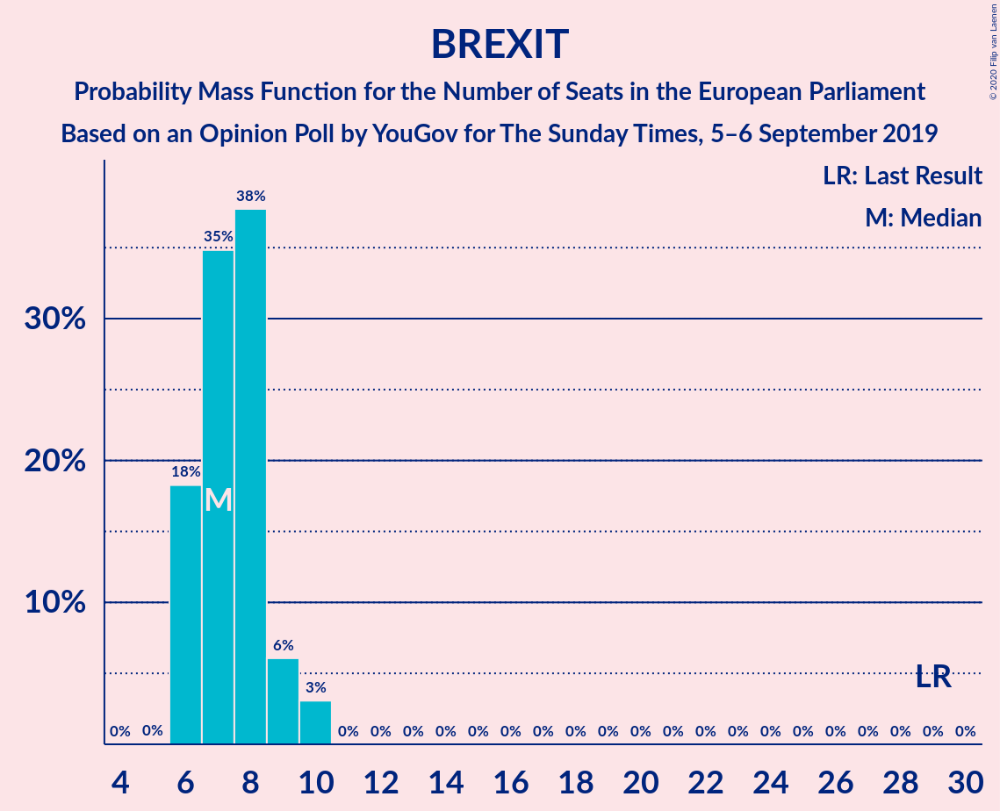

# Opinion Poll by YouGov for The Sunday Times, 5–6 September 2019

<a href="#voting-intentions">Voting Intentions</a> | <a href="#seats">Seats</a> | <a href="#coalitions">Coalitions</a> | <a href="#technical-information">Technical Information</a>

## Voting Intentions

### Confidence Intervals

| Party | Last Result | Poll Result | 80% Confidence Interval | 90% Confidence Interval | 95% Confidence Interval | 99% Confidence Interval |
|:-----:|:-----------:|:-----------:|:-----------------------:|:-----------------------:|:-----------------------:|:-----------------------:|
| Conservative Party (ECR) | 8.8% | 35.0% | 33.5–36.5% |33.0–37.0% |32.7–37.4% |32.0–38.1% |
| Labour Party (S&D) | 13.7% | 21.0% | 19.7–22.4% |19.4–22.7% |19.1–23.1% |18.5–23.7% |
| Liberal Democrats (RE) | 19.6% | 19.0% | 17.8–20.3% |17.4–20.7% |17.1–21.0% |16.6–21.6% |
| Brexit Party (NI) | 30.5% | 12.0% | 11.0–13.1% |10.7–13.4% |10.5–13.7% |10.0–14.2% |

*Note:* The poll result column reflects the actual value used in the calculations. Published results may vary slightly, and in addition be rounded to fewer digits.

## Seats

### Confidence Intervals

| Party | Last Result | Median | 80% Confidence Interval | 90% Confidence Interval | 95% Confidence Interval | 99% Confidence Interval |
|:-----:|:-----------:|:------:|:-----------------------:|:-----------------------:|:-----------------------:|:-----------------------:|
| <a href="#conservative-party-(ecr)">Conservative Party (ECR)</a> | 4 | 26 | 25–29 |25–29 |25–29 |24–31 |
| <a href="#labour-party-(s&d)">Labour Party (S&D)</a> | 10 | 15 | 14–16 |14–17 |13–17 |12–19 |
| <a href="#liberal-democrats-(re)">Liberal Democrats (RE)</a> | 16 | 12 | 10–15 |10–15 |10–15 |9–16 |
| <a href="#brexit-party-(ni)">Brexit Party (NI)</a> | 29 | 7 | 6–9 |5–9 |5–9 |4–10 |

### Conservative Party (ECR)

*For a full overview of the results for this party, see the [Conservative Party (ECR)](party-conservativepartyecr.html) page.*

| Number of Seats | Probability | Accumulated | Special Marks |
|:---------------:|:-----------:|:-----------:|:-------------:|
| 4 | 0% | 100% | Last Result |
| 5 | 0% | 100% |  |
| 6 | 0% | 100% |  |
| 7 | 0% | 100% |  |
| 8 | 0% | 100% |  |
| 9 | 0% | 100% |  |
| 10 | 0% | 100% |  |
| 11 | 0% | 100% |  |
| 12 | 0% | 100% |  |
| 13 | 0% | 100% |  |
| 14 | 0% | 100% |  |
| 15 | 0% | 100% |  |
| 16 | 0% | 100% |  |
| 17 | 0% | 100% |  |
| 18 | 0% | 100% |  |
| 19 | 0% | 100% |  |
| 20 | 0% | 100% |  |
| 21 | 0% | 100% |  |
| 22 | 0% | 100% |  |
| 23 | 0.3% | 100% |  |
| 24 | 1.4% | 99.6% |  |
| 25 | 30% | 98% |  |
| 26 | 23% | 68% | Median |
| 27 | 16% | 45% |  |
| 28 | 14% | 29% |  |
| 29 | 12% | 14% |  |
| 30 | 2% | 2% |  |
| 31 | 0.6% | 0.7% |  |
| 32 | 0% | 0% |  |

### Labour Party (S&D)

*For a full overview of the results for this party, see the [Labour Party (S&D)](party-labourpartysd.html) page.*

| Number of Seats | Probability | Accumulated | Special Marks |
|:---------------:|:-----------:|:-----------:|:-------------:|
| 10 | 0% | 100% | Last Result |
| 11 | 0.1% | 100% |  |
| 12 | 1.3% | 99.8% |  |
| 13 | 2% | 98.6% |  |
| 14 | 19% | 96% |  |
| 15 | 62% | 78% | Median |
| 16 | 10% | 15% |  |
| 17 | 4% | 6% |  |
| 18 | 0.6% | 1.3% |  |
| 19 | 0.7% | 0.7% |  |
| 20 | 0% | 0% |  |

### Liberal Democrats (RE)

*For a full overview of the results for this party, see the [Liberal Democrats (RE)](party-liberaldemocratsre.html) page.*

| Number of Seats | Probability | Accumulated | Special Marks |
|:---------------:|:-----------:|:-----------:|:-------------:|
| 8 | 0.1% | 100% |  |
| 9 | 0.6% | 99.8% |  |
| 10 | 17% | 99.2% |  |
| 11 | 26% | 82% |  |
| 12 | 8% | 56% | Median |
| 13 | 15% | 49% |  |
| 14 | 18% | 34% |  |
| 15 | 15% | 16% |  |
| 16 | 0.6% | 0.6% | Last Result |
| 17 | 0% | 0% |  |

### Brexit Party (NI)

*For a full overview of the results for this party, see the [Brexit Party (NI)](party-brexitpartyni.html) page.*

| Number of Seats | Probability | Accumulated | Special Marks |
|:---------------:|:-----------:|:-----------:|:-------------:|
| 3 | 0.1% | 100% |  |
| 4 | 0.6% | 99.9% |  |
| 5 | 5% | 99.3% |  |
| 6 | 18% | 94% |  |
| 7 | 47% | 76% | Median |
| 8 | 12% | 28% |  |
| 9 | 16% | 17% |  |
| 10 | 1.4% | 1.4% |  |
| 11 | 0% | 0% |  |
| 12 | 0% | 0% |  |
| 13 | 0% | 0% |  |
| 14 | 0% | 0% |  |
| 15 | 0% | 0% |  |
| 16 | 0% | 0% |  |
| 17 | 0% | 0% |  |
| 18 | 0% | 0% |  |
| 19 | 0% | 0% |  |
| 20 | 0% | 0% |  |
| 21 | 0% | 0% |  |
| 22 | 0% | 0% |  |
| 23 | 0% | 0% |  |
| 24 | 0% | 0% |  |
| 25 | 0% | 0% |  |
| 26 | 0% | 0% |  |
| 27 | 0% | 0% |  |
| 28 | 0% | 0% |  |
| 29 | 0% | 0% | Last Result |

## Coalitions

### Confidence Intervals

| Coalition | Last Result | Median | Majority? | 80% Confidence Interval | 90% Confidence Interval | 95% Confidence Interval | 99% Confidence Interval |
|:---------:|:-----------:|:------:|:---------:|:-----------------------:|:-----------------------:|:-----------------------:|:-----------------------:|
| Conservative Party (ECR) | 4 | 26 | 0% | 25–29 | 25–29 | 25–29 | 24–31 |
| Labour Party (S&D) | 10 | 15 | 0% | 14–16 | 14–17 | 13–17 | 12–19 |
| Brexit Party (NI) | 29 | 7 | 0% | 6–9 | 5–9 | 5–9 | 4–10 |

### Conservative Party (ECR)

| Number of Seats | Probability | Accumulated | Special Marks |
|:---------------:|:-----------:|:-----------:|:-------------:|
| 4 | 0% | 100% | Last Result |
| 5 | 0% | 100% |  |
| 6 | 0% | 100% |  |
| 7 | 0% | 100% |  |
| 8 | 0% | 100% |  |
| 9 | 0% | 100% |  |
| 10 | 0% | 100% |  |
| 11 | 0% | 100% |  |
| 12 | 0% | 100% |  |
| 13 | 0% | 100% |  |
| 14 | 0% | 100% |  |
| 15 | 0% | 100% |  |
| 16 | 0% | 100% |  |
| 17 | 0% | 100% |  |
| 18 | 0% | 100% |  |
| 19 | 0% | 100% |  |
| 20 | 0% | 100% |  |
| 21 | 0% | 100% |  |
| 22 | 0% | 100% |  |
| 23 | 0.3% | 100% |  |
| 24 | 1.4% | 99.6% |  |
| 25 | 30% | 98% |  |
| 26 | 23% | 68% | Median |
| 27 | 16% | 45% |  |
| 28 | 14% | 29% |  |
| 29 | 12% | 14% |  |
| 30 | 2% | 2% |  |
| 31 | 0.6% | 0.7% |  |
| 32 | 0% | 0% |  |

### Labour Party (S&D)

| Number of Seats | Probability | Accumulated | Special Marks |
|:---------------:|:-----------:|:-----------:|:-------------:|
| 10 | 0% | 100% | Last Result |
| 11 | 0.1% | 100% |  |
| 12 | 1.3% | 99.8% |  |
| 13 | 2% | 98.6% |  |
| 14 | 19% | 96% |  |
| 15 | 62% | 78% | Median |
| 16 | 10% | 15% |  |
| 17 | 4% | 6% |  |
| 18 | 0.6% | 1.3% |  |
| 19 | 0.7% | 0.7% |  |
| 20 | 0% | 0% |  |

### Brexit Party (NI)

| Number of Seats | Probability | Accumulated | Special Marks |
|:---------------:|:-----------:|:-----------:|:-------------:|
| 3 | 0.1% | 100% |  |
| 4 | 0.6% | 99.9% |  |
| 5 | 5% | 99.3% |  |
| 6 | 18% | 94% |  |
| 7 | 47% | 76% | Median |
| 8 | 12% | 28% |  |
| 9 | 16% | 17% |  |
| 10 | 1.4% | 1.4% |  |
| 11 | 0% | 0% |  |
| 12 | 0% | 0% |  |
| 13 | 0% | 0% |  |
| 14 | 0% | 0% |  |
| 15 | 0% | 0% |  |
| 16 | 0% | 0% |  |
| 17 | 0% | 0% |  |
| 18 | 0% | 0% |  |
| 19 | 0% | 0% |  |
| 20 | 0% | 0% |  |
| 21 | 0% | 0% |  |
| 22 | 0% | 0% |  |
| 23 | 0% | 0% |  |
| 24 | 0% | 0% |  |
| 25 | 0% | 0% |  |
| 26 | 0% | 0% |  |
| 27 | 0% | 0% |  |
| 28 | 0% | 0% |  |
| 29 | 0% | 0% | Last Result |

## Technical Information

### Opinion Poll

+ **Polling firm:** YouGov
+ **Commissioner(s):** The Sunday Times
+ **Fieldwork period:** 5–6 September 2019

### Calculations

+ **Sample size:** 1595
+ **Simulations done:** 131,072
+ **Error estimate:** 0.21%

