# Opinion Poll by YouGov, 10–11 April 2019

<a href="#voting-intentions">Voting Intentions</a> | <a href="#seats">Seats</a> | <a href="#coalitions">Coalitions</a> | <a href="#technical-information">Technical Information</a>

## Voting Intentions

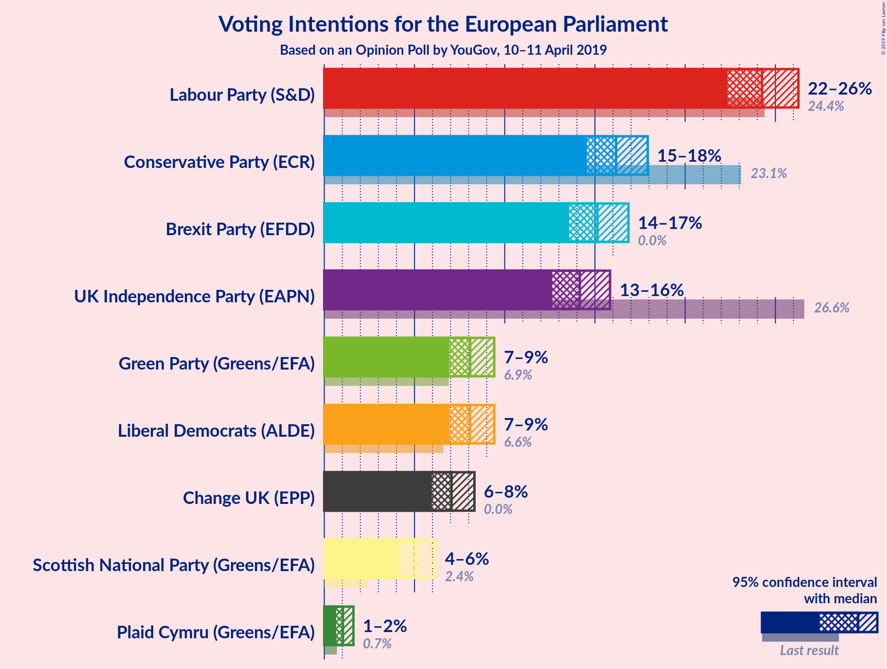

### Confidence Intervals

| Party | Last Result | Poll Result | 80% Confidence Interval | 90% Confidence Interval | 95% Confidence Interval | 99% Confidence Interval |
|:-----:|:-----------:|:-----------:|:-----------------------:|:-----------------------:|:-----------------------:|:-----------------------:|
| Labour Party (S&D) | 24.4% | 24.3% | 23.0–25.6% |22.6–25.9% |22.3–26.3% |21.8–26.9% |
| Conservative Party (ECR) | 23.1% | 16.2% | 15.1–17.3% |14.8–17.6% |14.6–17.9% |14.1–18.5% |
| Brexit Party (EFDD) | 0.0% | 15.1% | 14.1–16.3% |13.8–16.6% |13.6–16.9% |13.1–17.4% |
| UK Independence Party (EAPN) | 26.6% | 14.2% | 13.2–15.3% |12.9–15.6% |12.6–15.8% |12.2–16.4% |
| Liberal Democrats (ALDE) | 6.6% | 8.1% | 7.3–9.0% |7.1–9.2% |6.9–9.4% |6.6–9.9% |
| Green Party (Greens/EFA) | 6.9% | 8.1% | 7.3–9.0% |7.1–9.2% |6.9–9.4% |6.6–9.9% |
| Change UK (EPP) | 0.0% | 7.1% | 6.3–7.9% |6.1–8.1% |6.0–8.3% |5.6–8.7% |
| Scottish National Party (Greens/EFA) | 2.4% | 5.0% | 4.4–5.8% |4.3–6.0% |4.1–6.2% |3.9–6.5% |
| Plaid Cymru (Greens/EFA) | 0.7% | 1.0% | 0.8–1.4% |0.7–1.5% |0.7–1.6% |0.5–1.8% |

*Note:* The poll result column reflects the actual value used in the calculations. Published results may vary slightly, and in addition be rounded to fewer digits.

## Seats

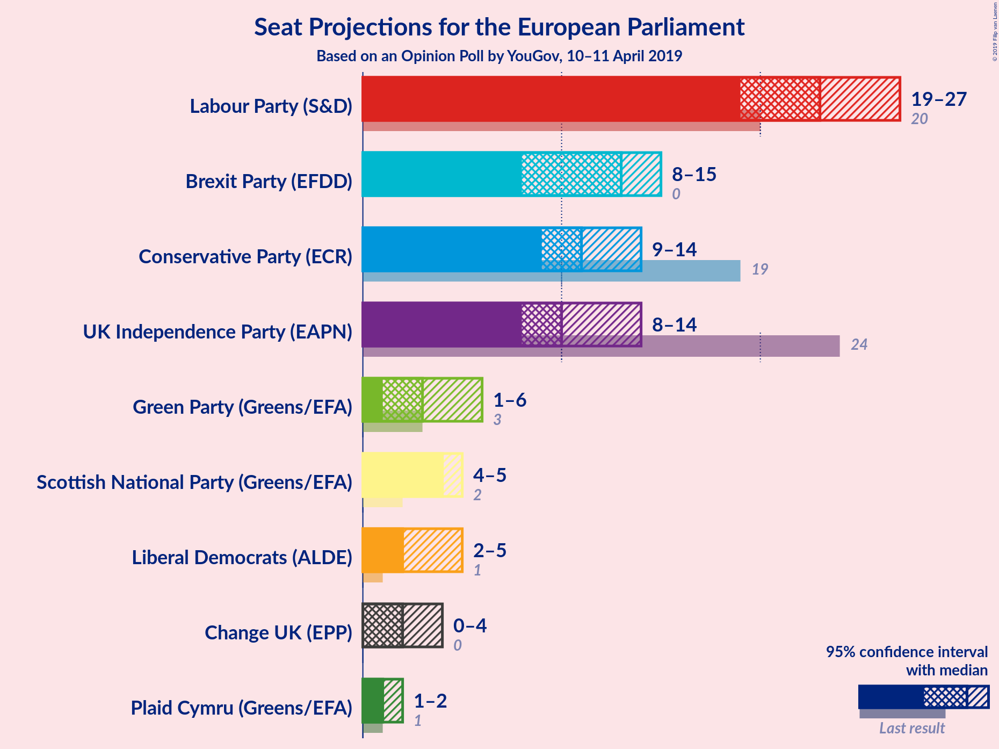

### Confidence Intervals

| Party | Last Result | Median | 80% Confidence Interval | 90% Confidence Interval | 95% Confidence Interval | 99% Confidence Interval |
|:-----:|:-----------:|:------:|:-----------------------:|:-----------------------:|:-----------------------:|:-----------------------:|
| <a href="#labour-party-(s&d)">Labour Party (S&D)</a> | 20 | 23 | 19–26 |19–26 |19–27 |18–27 |
| <a href="#conservative-party-(ecr)">Conservative Party (ECR)</a> | 19 | 11 | 10–13 |9–14 |9–14 |9–16 |
| <a href="#brexit-party-(efdd)">Brexit Party (EFDD)</a> | 0 | 13 | 9–15 |9–15 |8–15 |8–16 |
| <a href="#uk-independence-party-(eapn)">UK Independence Party (EAPN)</a> | 24 | 10 | 8–13 |8–13 |8–14 |8–15 |
| <a href="#liberal-democrats-(alde)">Liberal Democrats (ALDE)</a> | 1 | 2 | 2–4 |2–5 |2–5 |2–6 |
| <a href="#green-party-(greens/efa)">Green Party (Greens/EFA)</a> | 3 | 3 | 2–4 |1–5 |1–6 |1–6 |
| <a href="#change-uk-(epp)">Change UK (EPP)</a> | 0 | 2 | 1–3 |0–4 |0–4 |0–4 |
| <a href="#scottish-national-party-(greens/efa)">Scottish National Party (Greens/EFA)</a> | 2 | 4 | 4–5 |4–5 |4–5 |3–5 |
| <a href="#plaid-cymru-(greens/efa)">Plaid Cymru (Greens/EFA)</a> | 1 | 1 | 1–2 |1–2 |1–2 |0–2 |

### Labour Party (S&D)

*For a full overview of the results for this party, see the [Labour Party (S&D)](party-labourpartysd.html) page.*

| Number of Seats | Probability | Accumulated | Special Marks |
|:---------------:|:-----------:|:-----------:|:-------------:|
| 18 | 0.7% | 100% |  |
| 19 | 12% | 99.3% |  |
| 20 | 7% | 87% | Last Result |
| 21 | 7% | 80% |  |
| 22 | 16% | 73% |  |
| 23 | 12% | 57% | Median |
| 24 | 19% | 45% |  |
| 25 | 11% | 26% |  |
| 26 | 10% | 15% |  |
| 27 | 5% | 5% |  |
| 28 | 0% | 0% |  |

### Conservative Party (ECR)

*For a full overview of the results for this party, see the [Conservative Party (ECR)](party-conservativepartyecr.html) page.*

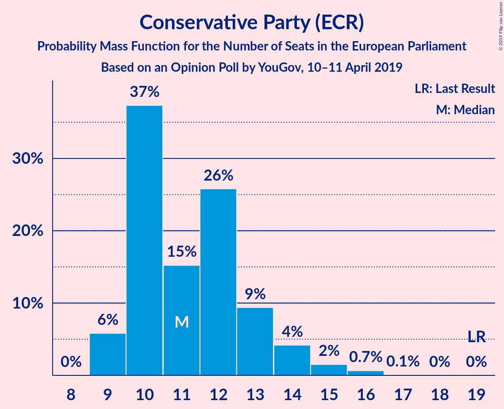

| Number of Seats | Probability | Accumulated | Special Marks |
|:---------------:|:-----------:|:-----------:|:-------------:|
| 9 | 6% | 100% |  |
| 10 | 37% | 94% |  |
| 11 | 15% | 57% | Median |
| 12 | 26% | 42% |  |
| 13 | 9% | 16% |  |
| 14 | 4% | 6% |  |
| 15 | 2% | 2% |  |
| 16 | 0.7% | 0.7% |  |
| 17 | 0.1% | 0.1% |  |
| 18 | 0% | 0% |  |
| 19 | 0% | 0% | Last Result |

### Brexit Party (EFDD)

*For a full overview of the results for this party, see the [Brexit Party (EFDD)](party-brexitpartyefdd.html) page.*

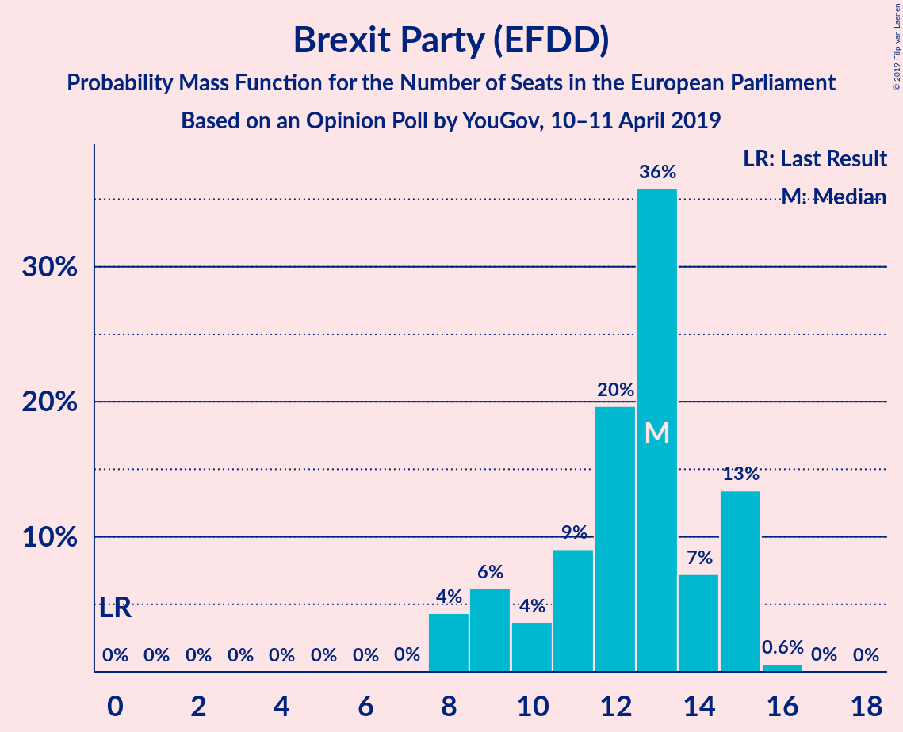

| Number of Seats | Probability | Accumulated | Special Marks |
|:---------------:|:-----------:|:-----------:|:-------------:|
| 0 | 0% | 100% | Last Result |
| 1 | 0% | 100% |  |
| 2 | 0% | 100% |  |
| 3 | 0% | 100% |  |
| 4 | 0% | 100% |  |
| 5 | 0% | 100% |  |
| 6 | 0% | 100% |  |
| 7 | 0% | 100% |  |
| 8 | 4% | 100% |  |
| 9 | 6% | 96% |  |
| 10 | 4% | 89% |  |
| 11 | 9% | 86% |  |
| 12 | 20% | 77% |  |
| 13 | 36% | 57% | Median |
| 14 | 7% | 21% |  |
| 15 | 13% | 14% |  |
| 16 | 0.6% | 0.6% |  |
| 17 | 0% | 0% |  |

### UK Independence Party (EAPN)

*For a full overview of the results for this party, see the [UK Independence Party (EAPN)](party-ukindependencepartyeapn.html) page.*

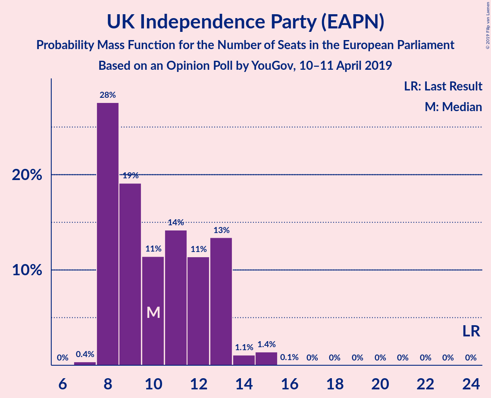

| Number of Seats | Probability | Accumulated | Special Marks |
|:---------------:|:-----------:|:-----------:|:-------------:|
| 7 | 0.4% | 100% |  |
| 8 | 28% | 99.6% |  |
| 9 | 19% | 72% |  |
| 10 | 11% | 53% | Median |
| 11 | 14% | 42% |  |
| 12 | 11% | 27% |  |
| 13 | 13% | 16% |  |
| 14 | 1.1% | 3% |  |
| 15 | 1.4% | 1.5% |  |
| 16 | 0.1% | 0.1% |  |
| 17 | 0% | 0% |  |
| 18 | 0% | 0% |  |
| 19 | 0% | 0% |  |
| 20 | 0% | 0% |  |
| 21 | 0% | 0% |  |
| 22 | 0% | 0% |  |
| 23 | 0% | 0% |  |
| 24 | 0% | 0% | Last Result |

### Liberal Democrats (ALDE)

*For a full overview of the results for this party, see the [Liberal Democrats (ALDE)](party-liberaldemocratsalde.html) page.*

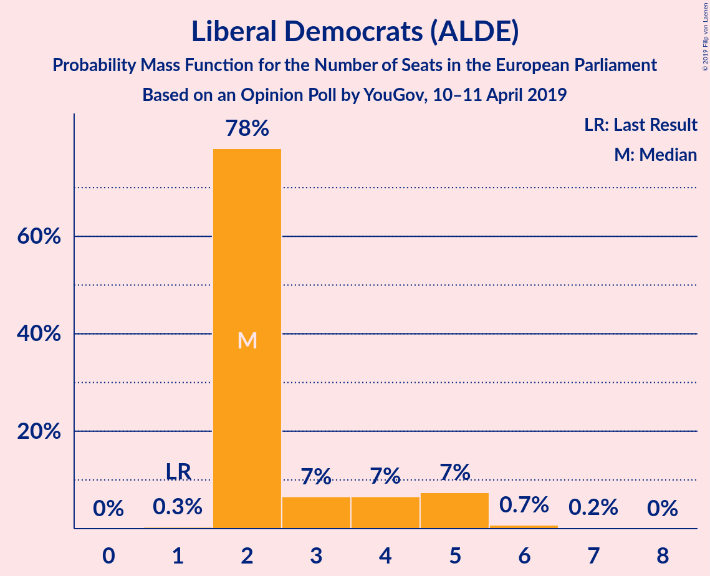

| Number of Seats | Probability | Accumulated | Special Marks |
|:---------------:|:-----------:|:-----------:|:-------------:|
| 1 | 0.3% | 100% | Last Result |
| 2 | 78% | 99.6% | Median |
| 3 | 7% | 22% |  |
| 4 | 7% | 15% |  |
| 5 | 7% | 8% |  |
| 6 | 0.7% | 1.0% |  |
| 7 | 0.2% | 0.2% |  |
| 8 | 0% | 0% |  |

### Green Party (Greens/EFA)

*For a full overview of the results for this party, see the [Green Party (Greens/EFA)](party-greenpartygreensefa.html) page.*

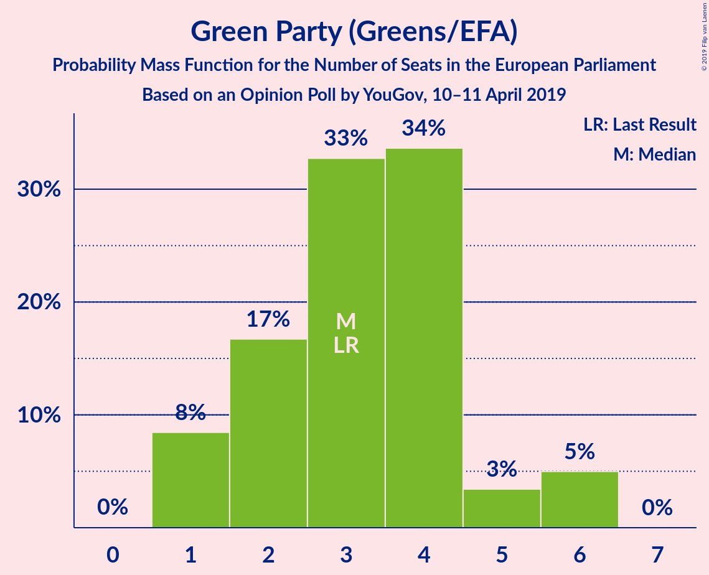

| Number of Seats | Probability | Accumulated | Special Marks |
|:---------------:|:-----------:|:-----------:|:-------------:|
| 1 | 8% | 100% |  |
| 2 | 17% | 92% |  |
| 3 | 33% | 75% | Last Result, Median |
| 4 | 34% | 42% |  |
| 5 | 3% | 8% |  |
| 6 | 5% | 5% |  |
| 7 | 0% | 0% |  |

### Change UK (EPP)

*For a full overview of the results for this party, see the [Change UK (EPP)](party-changeukepp.html) page.*

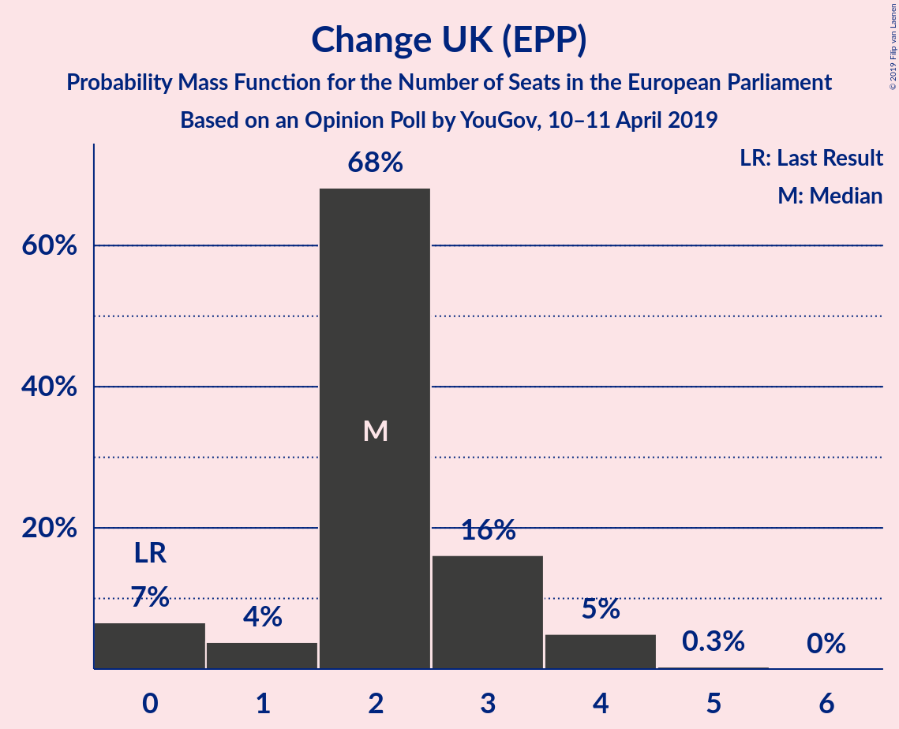

| Number of Seats | Probability | Accumulated | Special Marks |
|:---------------:|:-----------:|:-----------:|:-------------:|
| 0 | 7% | 100% | Last Result |
| 1 | 4% | 93% |  |
| 2 | 68% | 90% | Median |
| 3 | 16% | 21% |  |
| 4 | 5% | 5% |  |
| 5 | 0.3% | 0.3% |  |
| 6 | 0% | 0% |  |

### Scottish National Party (Greens/EFA)

*For a full overview of the results for this party, see the [Scottish National Party (Greens/EFA)](party-scottishnationalpartygreensefa.html) page.*

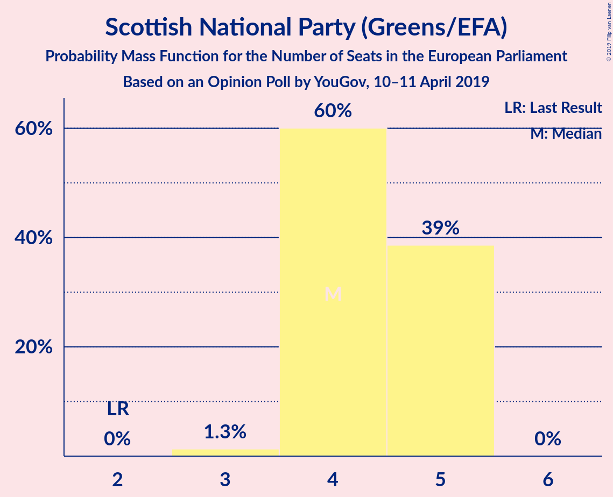

| Number of Seats | Probability | Accumulated | Special Marks |
|:---------------:|:-----------:|:-----------:|:-------------:|
| 2 | 0% | 100% | Last Result |
| 3 | 1.3% | 100% |  |
| 4 | 60% | 98.7% | Median |
| 5 | 39% | 39% |  |
| 6 | 0% | 0% |  |

### Plaid Cymru (Greens/EFA)

*For a full overview of the results for this party, see the [Plaid Cymru (Greens/EFA)](party-plaidcymrugreensefa.html) page.*

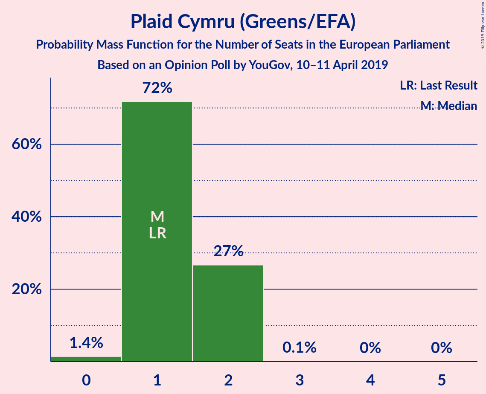

| Number of Seats | Probability | Accumulated | Special Marks |
|:---------------:|:-----------:|:-----------:|:-------------:|
| 0 | 1.4% | 100% |  |
| 1 | 72% | 98.6% | Last Result, Median |
| 2 | 27% | 27% |  |
| 3 | 0.1% | 0.1% |  |
| 4 | 0% | 0% |  |

## Coalitions

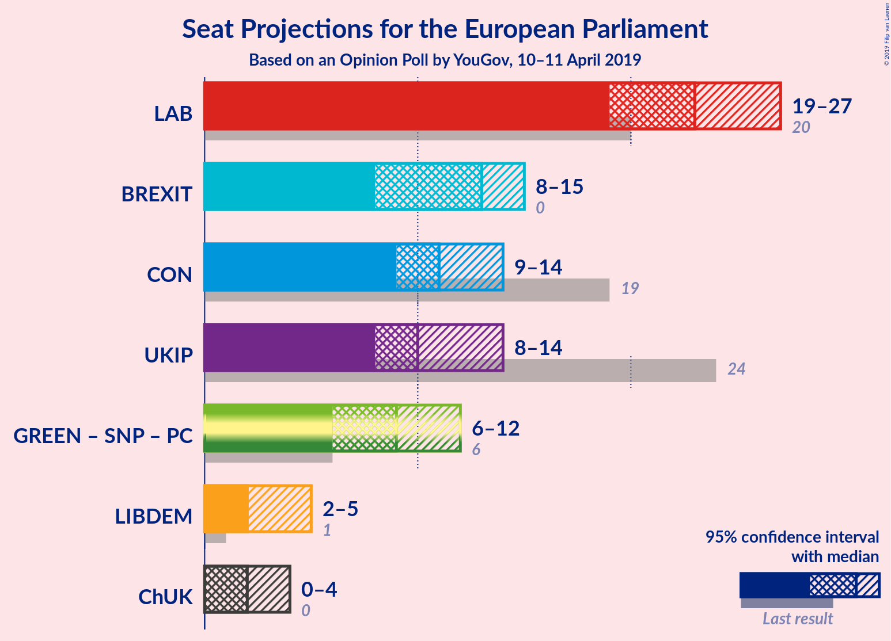

### Confidence Intervals

| Coalition | Last Result | Median | Majority? | 80% Confidence Interval | 90% Confidence Interval | 95% Confidence Interval | 99% Confidence Interval |
|:---------:|:-----------:|:------:|:---------:|:-----------------------:|:-----------------------:|:-----------------------:|:-----------------------:|
| Labour Party (S&D) | 20 | 23 | 0% | 19–26 | 19–26 | 19–27 | 18–27 |
| Brexit Party (EFDD) | 0 | 13 | 0% | 9–15 | 9–15 | 8–15 | 8–16 |
| Conservative Party (ECR) | 19 | 11 | 0% | 10–13 | 9–14 | 9–14 | 9–16 |
| UK Independence Party (EAPN) | 24 | 10 | 0% | 8–13 | 8–13 | 8–14 | 8–15 |
| Green Party (Greens/EFA) – Scottish National Party (Greens/EFA) – Plaid Cymru (Greens/EFA) | 6 | 9 | 0% | 7–11 | 6–11 | 6–12 | 6–12 |
| Liberal Democrats (ALDE) | 1 | 2 | 0% | 2–4 | 2–5 | 2–5 | 2–6 |
| Change UK (EPP) | 0 | 2 | 0% | 1–3 | 0–4 | 0–4 | 0–4 |

### Labour Party (S&D)

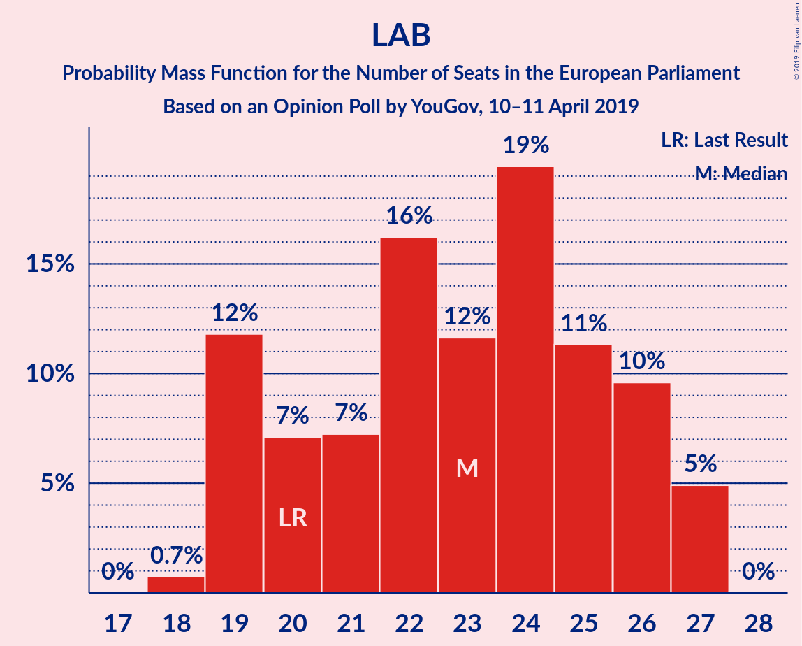

| Number of Seats | Probability | Accumulated | Special Marks |
|:---------------:|:-----------:|:-----------:|:-------------:|
| 18 | 0.7% | 100% |  |
| 19 | 12% | 99.3% |  |
| 20 | 7% | 87% | Last Result |
| 21 | 7% | 80% |  |
| 22 | 16% | 73% |  |
| 23 | 12% | 57% | Median |
| 24 | 19% | 45% |  |
| 25 | 11% | 26% |  |
| 26 | 10% | 15% |  |
| 27 | 5% | 5% |  |
| 28 | 0% | 0% |  |

### Brexit Party (EFDD)

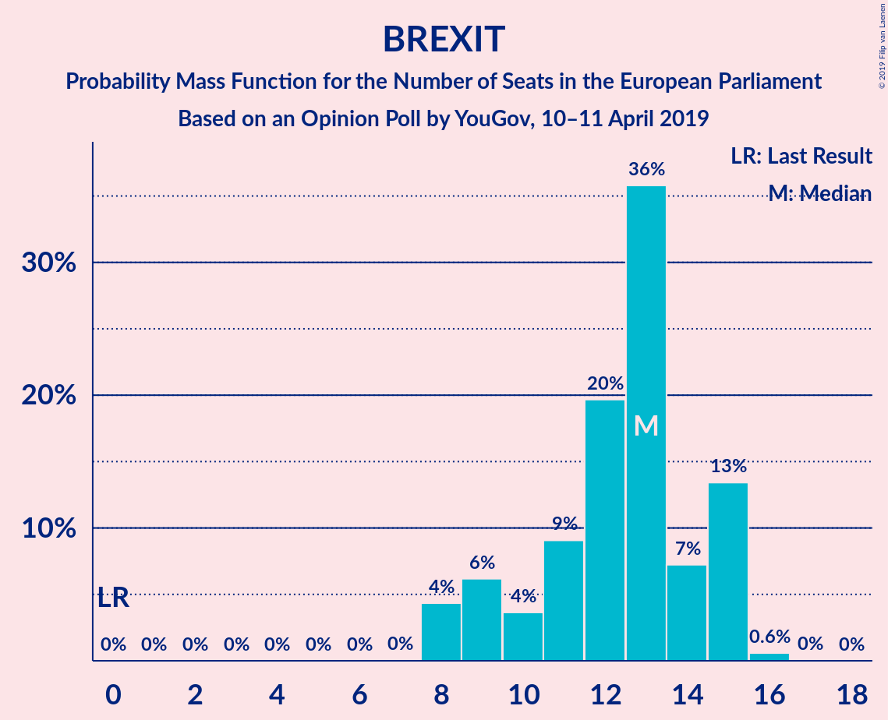

| Number of Seats | Probability | Accumulated | Special Marks |
|:---------------:|:-----------:|:-----------:|:-------------:|
| 0 | 0% | 100% | Last Result |
| 1 | 0% | 100% |  |
| 2 | 0% | 100% |  |
| 3 | 0% | 100% |  |
| 4 | 0% | 100% |  |
| 5 | 0% | 100% |  |
| 6 | 0% | 100% |  |
| 7 | 0% | 100% |  |
| 8 | 4% | 100% |  |
| 9 | 6% | 96% |  |
| 10 | 4% | 89% |  |
| 11 | 9% | 86% |  |
| 12 | 20% | 77% |  |
| 13 | 36% | 57% | Median |
| 14 | 7% | 21% |  |
| 15 | 13% | 14% |  |
| 16 | 0.6% | 0.6% |  |
| 17 | 0% | 0% |  |

### Conservative Party (ECR)

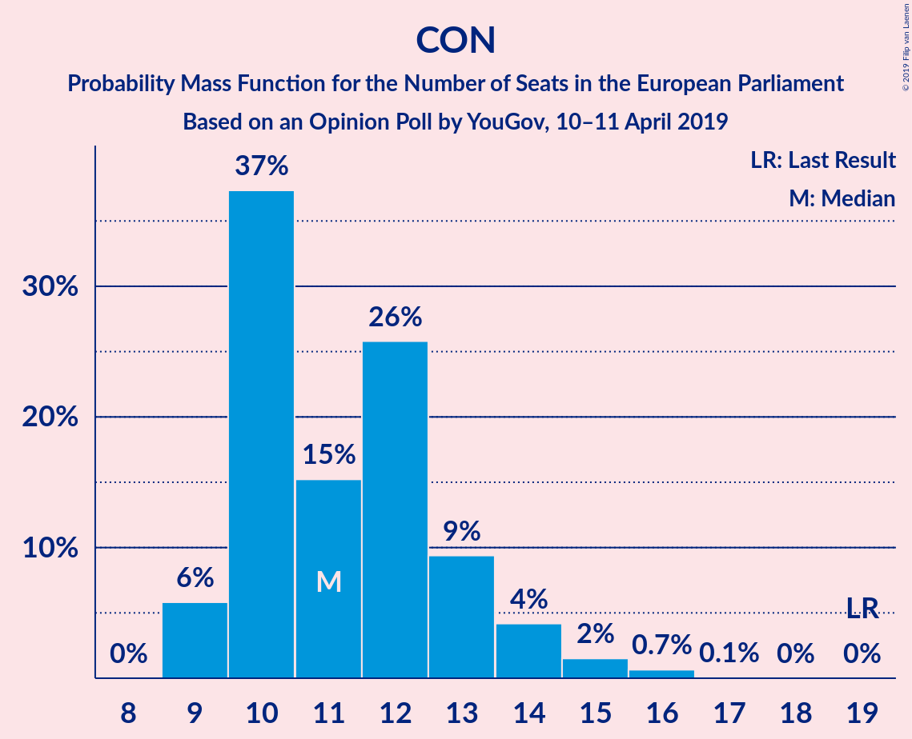

| Number of Seats | Probability | Accumulated | Special Marks |
|:---------------:|:-----------:|:-----------:|:-------------:|
| 9 | 6% | 100% |  |
| 10 | 37% | 94% |  |
| 11 | 15% | 57% | Median |
| 12 | 26% | 42% |  |
| 13 | 9% | 16% |  |
| 14 | 4% | 6% |  |
| 15 | 2% | 2% |  |
| 16 | 0.7% | 0.7% |  |
| 17 | 0.1% | 0.1% |  |
| 18 | 0% | 0% |  |
| 19 | 0% | 0% | Last Result |

### UK Independence Party (EAPN)

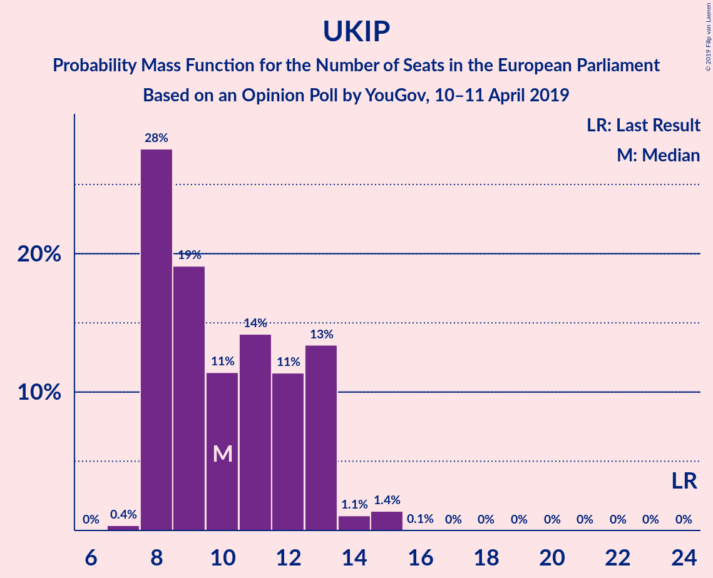

| Number of Seats | Probability | Accumulated | Special Marks |
|:---------------:|:-----------:|:-----------:|:-------------:|
| 7 | 0.4% | 100% |  |
| 8 | 28% | 99.6% |  |
| 9 | 19% | 72% |  |
| 10 | 11% | 53% | Median |
| 11 | 14% | 42% |  |
| 12 | 11% | 27% |  |
| 13 | 13% | 16% |  |
| 14 | 1.1% | 3% |  |
| 15 | 1.4% | 1.5% |  |
| 16 | 0.1% | 0.1% |  |
| 17 | 0% | 0% |  |
| 18 | 0% | 0% |  |
| 19 | 0% | 0% |  |
| 20 | 0% | 0% |  |
| 21 | 0% | 0% |  |
| 22 | 0% | 0% |  |
| 23 | 0% | 0% |  |
| 24 | 0% | 0% | Last Result |

### Green Party (Greens/EFA) – Scottish National Party (Greens/EFA) – Plaid Cymru (Greens/EFA)

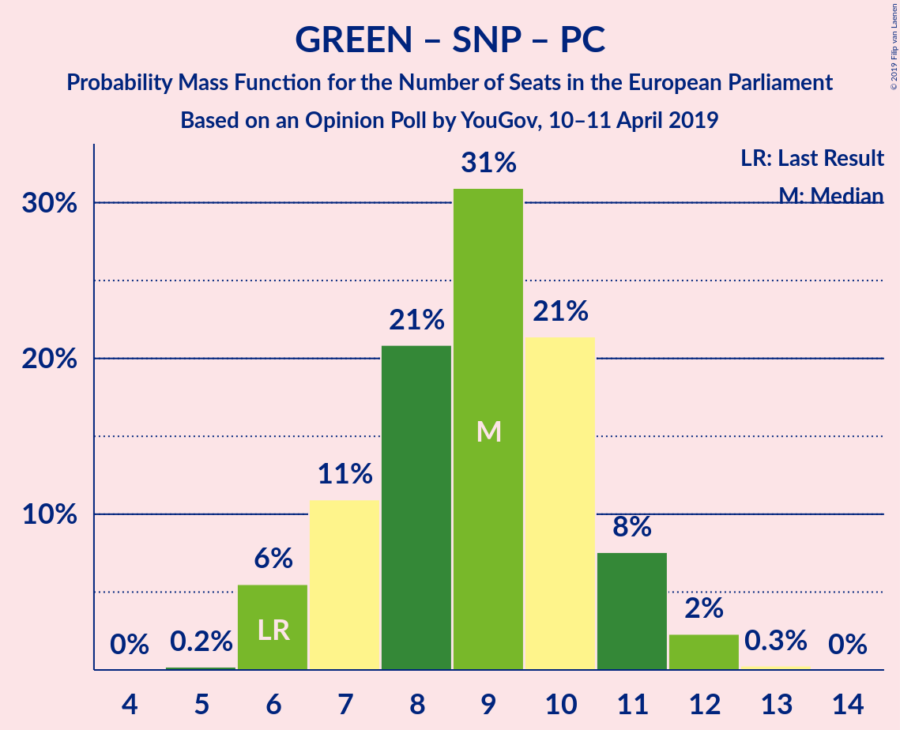

| Number of Seats | Probability | Accumulated | Special Marks |
|:---------------:|:-----------:|:-----------:|:-------------:|
| 5 | 0.2% | 100% |  |
| 6 | 6% | 99.8% | Last Result |
| 7 | 11% | 94% |  |
| 8 | 21% | 83% | Median |
| 9 | 31% | 62% |  |
| 10 | 21% | 32% |  |
| 11 | 8% | 10% |  |
| 12 | 2% | 3% |  |
| 13 | 0.3% | 0.3% |  |
| 14 | 0% | 0% |  |

### Liberal Democrats (ALDE)

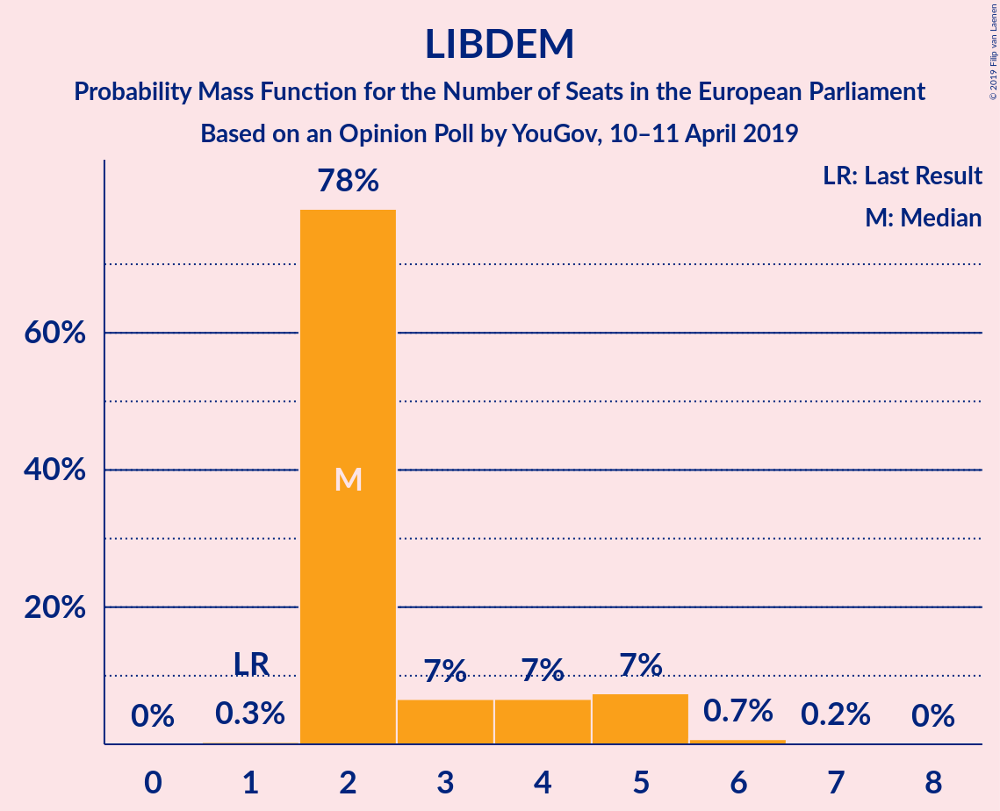

| Number of Seats | Probability | Accumulated | Special Marks |
|:---------------:|:-----------:|:-----------:|:-------------:|
| 1 | 0.3% | 100% | Last Result |
| 2 | 78% | 99.6% | Median |
| 3 | 7% | 22% |  |
| 4 | 7% | 15% |  |
| 5 | 7% | 8% |  |
| 6 | 0.7% | 1.0% |  |
| 7 | 0.2% | 0.2% |  |
| 8 | 0% | 0% |  |

### Change UK (EPP)

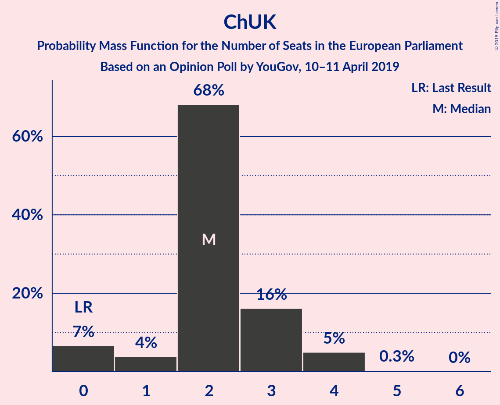

| Number of Seats | Probability | Accumulated | Special Marks |
|:---------------:|:-----------:|:-----------:|:-------------:|
| 0 | 7% | 100% | Last Result |
| 1 | 4% | 93% |  |
| 2 | 68% | 90% | Median |
| 3 | 16% | 21% |  |
| 4 | 5% | 5% |  |
| 5 | 0.3% | 0.3% |  |
| 6 | 0% | 0% |  |

## Technical Information

### Opinion Poll

+ **Polling firm:** YouGov
+ **Commissioner(s):** —
+ **Fieldwork period:** 10–11 April 2019

### Calculations

+ **Sample size:** 1843
+ **Simulations done:** 1,048,576
+ **Error estimate:** 1.54%

