# Opinion Poll by ComRes for Brexit Express, 16 April 2019

<a href="#voting-intentions">Voting Intentions</a> | <a href="#seats">Seats</a> | <a href="#coalitions">Coalitions</a> | <a href="#technical-information">Technical Information</a>

## Voting Intentions

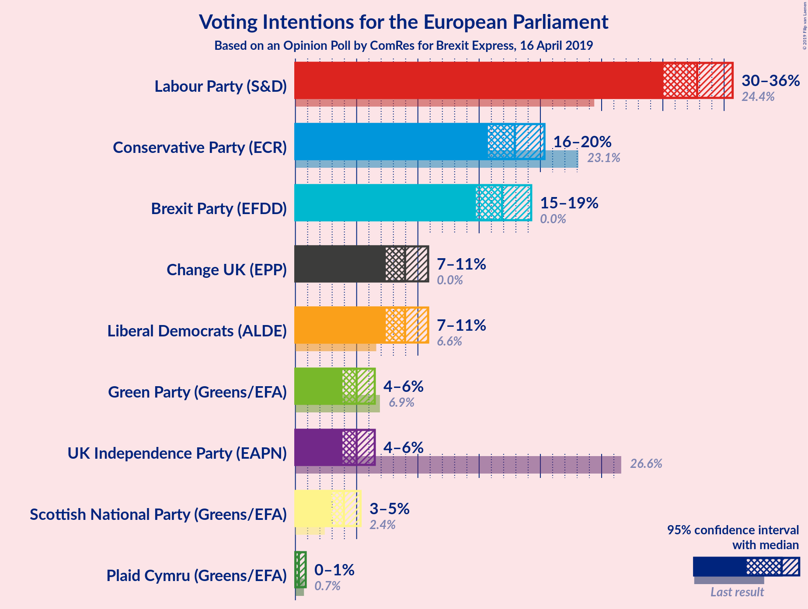

### Confidence Intervals

| Party | Last Result | Poll Result | 80% Confidence Interval | 90% Confidence Interval | 95% Confidence Interval | 99% Confidence Interval |
|:-----:|:-----------:|:-----------:|:-----------------------:|:-----------------------:|:-----------------------:|:-----------------------:|
| Labour Party (S&D) | 24.4% | 32.8% | 31.0–34.7% |30.5–35.2% |30.0–35.7% |29.2–36.6% |
| Conservative Party (ECR) | 23.1% | 17.9% | 16.5–19.5% |16.1–20.0% |15.7–20.3% |15.0–21.1% |
| Brexit Party (EFDD) | 0.0% | 16.9% | 15.5–18.4% |15.1–18.9% |14.7–19.3% |14.1–20.0% |
| Liberal Democrats (ALDE) | 6.6% | 9.0% | 7.9–10.2% |7.6–10.5% |7.4–10.8% |6.9–11.4% |
| Change UK (EPP) | 0.0% | 9.0% | 7.9–10.2% |7.6–10.5% |7.4–10.8% |6.9–11.4% |
| UK Independence Party (EAPN) | 26.6% | 5.0% | 4.2–6.0% |4.0–6.2% |3.8–6.5% |3.5–7.0% |
| Green Party (Greens/EFA) | 6.9% | 5.0% | 4.2–6.0% |4.0–6.2% |3.8–6.5% |3.5–7.0% |
| Scottish National Party (Greens/EFA) | 2.4% | 4.0% | 3.3–4.8% |3.1–5.1% |2.9–5.3% |2.7–5.8% |
| Plaid Cymru (Greens/EFA) | 0.7% | 0.3% | 0.2–0.6% |0.1–0.7% |0.1–0.8% |0.1–1.0% |

*Note:* The poll result column reflects the actual value used in the calculations. Published results may vary slightly, and in addition be rounded to fewer digits.

## Seats

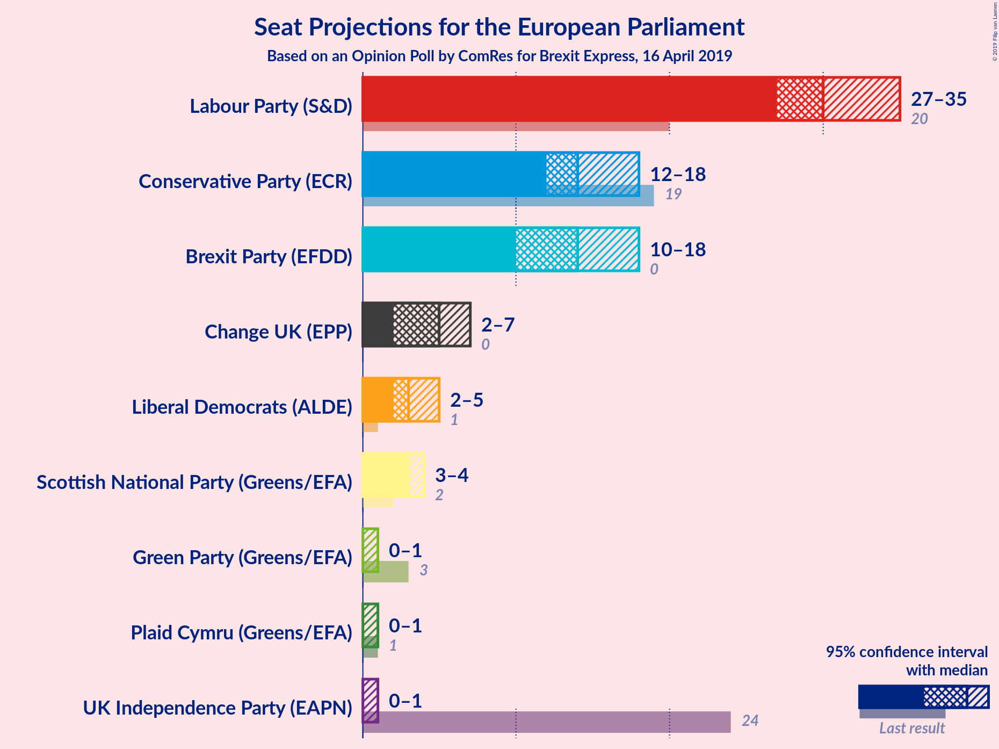

### Confidence Intervals

| Party | Last Result | Median | 80% Confidence Interval | 90% Confidence Interval | 95% Confidence Interval | 99% Confidence Interval |
|:-----:|:-----------:|:------:|:-----------------------:|:-----------------------:|:-----------------------:|:-----------------------:|
| <a href="#labour-party-(s&d)">Labour Party (S&D)</a> | 20 | 30 | 27–34 |27–34 |27–35 |27–36 |
| <a href="#conservative-party-(ecr)">Conservative Party (ECR)</a> | 19 | 14 | 12–16 |12–18 |12–18 |10–19 |
| <a href="#brexit-party-(efdd)">Brexit Party (EFDD)</a> | 0 | 14 | 11–17 |11–18 |10–18 |10–19 |
| <a href="#liberal-democrats-(alde)">Liberal Democrats (ALDE)</a> | 1 | 3 | 3–4 |2–5 |2–5 |2–7 |
| <a href="#change-uk-(epp)">Change UK (EPP)</a> | 0 | 5 | 2–5 |2–6 |2–7 |2–7 |
| <a href="#uk-independence-party-(eapn)">UK Independence Party (EAPN)</a> | 24 | 0 | 0–1 |0–1 |0–1 |0–1 |
| <a href="#green-party-(greens/efa)">Green Party (Greens/EFA)</a> | 3 | 0 | 0–1 |0–1 |0–1 |0–2 |
| <a href="#scottish-national-party-(greens/efa)">Scottish National Party (Greens/EFA)</a> | 2 | 3 | 3–4 |3–4 |3–4 |2–4 |
| <a href="#plaid-cymru-(greens/efa)">Plaid Cymru (Greens/EFA)</a> | 1 | 0 | 0–1 |0–1 |0–1 |0–1 |

### Labour Party (S&D)

*For a full overview of the results for this party, see the [Labour Party (S&D)](party-labourpartysd.html) page.*

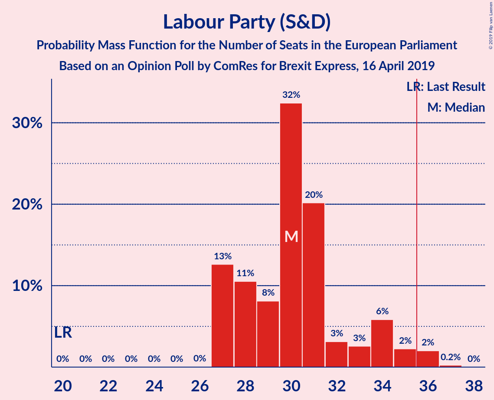

| Number of Seats | Probability | Accumulated | Special Marks |
|:---------------:|:-----------:|:-----------:|:-------------:|
| 20 | 0% | 100% | Last Result |
| 21 | 0% | 100% |  |
| 22 | 0% | 100% |  |
| 23 | 0% | 100% |  |
| 24 | 0% | 100% |  |
| 25 | 0% | 100% |  |
| 26 | 0% | 100% |  |
| 27 | 13% | 99.9% |  |
| 28 | 11% | 87% |  |
| 29 | 8% | 77% |  |
| 30 | 32% | 69% | Median |
| 31 | 20% | 36% |  |
| 32 | 3% | 16% |  |
| 33 | 3% | 13% |  |
| 34 | 6% | 10% |  |
| 35 | 2% | 5% |  |
| 36 | 2% | 2% | Majority |
| 37 | 0.2% | 0.3% |  |
| 38 | 0% | 0% |  |

### Conservative Party (ECR)

*For a full overview of the results for this party, see the [Conservative Party (ECR)](party-conservativepartyecr.html) page.*

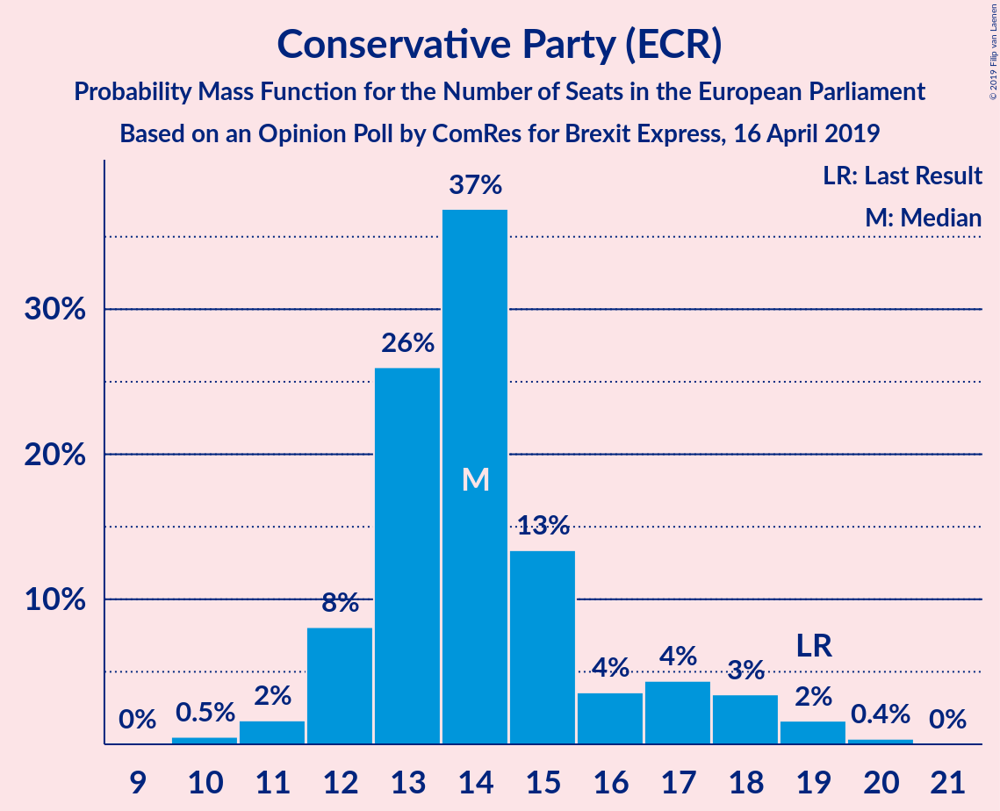

| Number of Seats | Probability | Accumulated | Special Marks |
|:---------------:|:-----------:|:-----------:|:-------------:|
| 10 | 0.5% | 100% |  |
| 11 | 2% | 99.5% |  |
| 12 | 8% | 98% |  |
| 13 | 26% | 90% |  |
| 14 | 37% | 64% | Median |
| 15 | 13% | 27% |  |
| 16 | 4% | 13% |  |
| 17 | 4% | 10% |  |
| 18 | 3% | 5% |  |
| 19 | 2% | 2% | Last Result |
| 20 | 0.4% | 0.4% |  |
| 21 | 0% | 0% |  |

### Brexit Party (EFDD)

*For a full overview of the results for this party, see the [Brexit Party (EFDD)](party-brexitpartyefdd.html) page.*

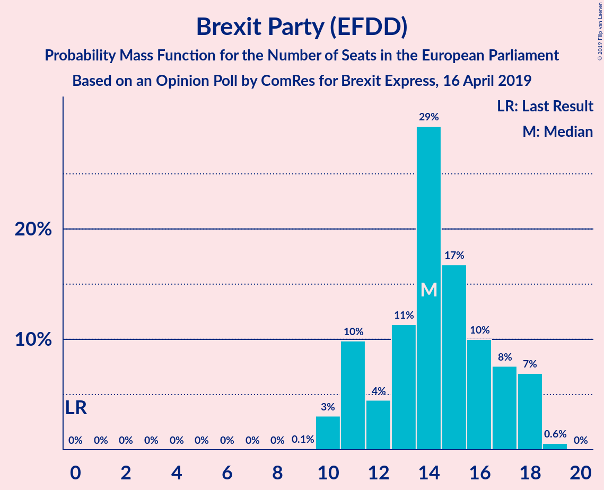

| Number of Seats | Probability | Accumulated | Special Marks |
|:---------------:|:-----------:|:-----------:|:-------------:|
| 0 | 0% | 100% | Last Result |
| 1 | 0% | 100% |  |
| 2 | 0% | 100% |  |
| 3 | 0% | 100% |  |
| 4 | 0% | 100% |  |
| 5 | 0% | 100% |  |
| 6 | 0% | 100% |  |
| 7 | 0% | 100% |  |
| 8 | 0% | 100% |  |
| 9 | 0.1% | 100% |  |
| 10 | 3% | 99.9% |  |
| 11 | 10% | 97% |  |
| 12 | 4% | 87% |  |
| 13 | 11% | 82% |  |
| 14 | 29% | 71% | Median |
| 15 | 17% | 42% |  |
| 16 | 10% | 25% |  |
| 17 | 8% | 15% |  |
| 18 | 7% | 8% |  |
| 19 | 0.6% | 0.6% |  |
| 20 | 0% | 0% |  |

### Liberal Democrats (ALDE)

*For a full overview of the results for this party, see the [Liberal Democrats (ALDE)](party-liberaldemocratsalde.html) page.*

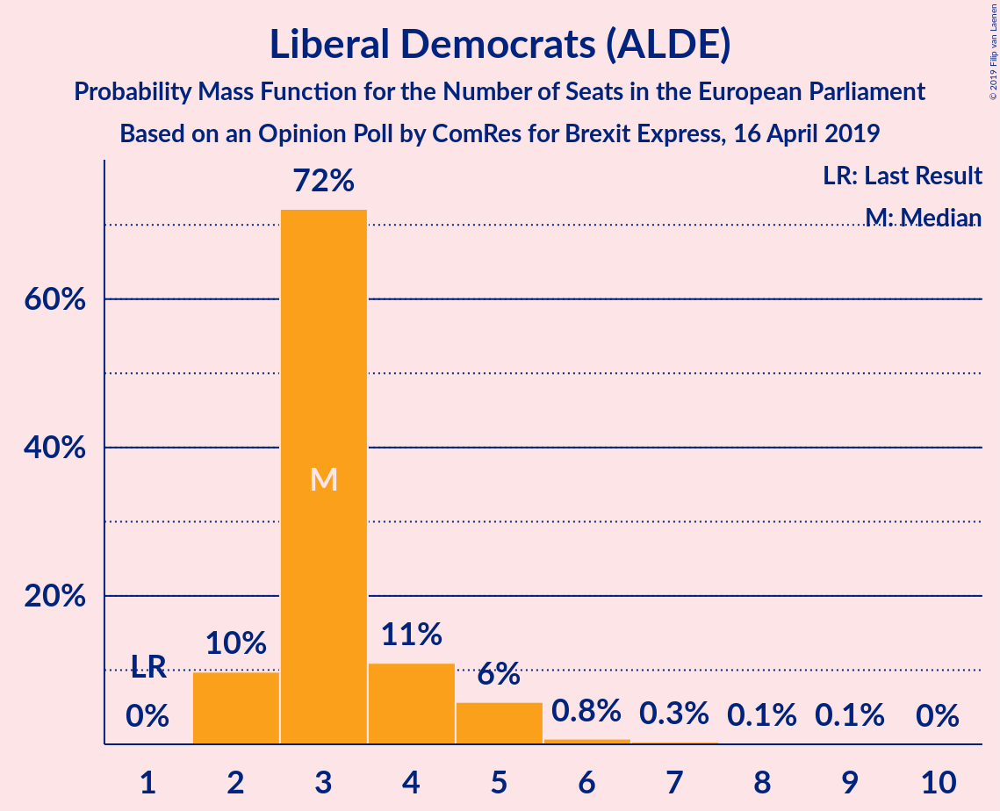

| Number of Seats | Probability | Accumulated | Special Marks |
|:---------------:|:-----------:|:-----------:|:-------------:|
| 1 | 0% | 100% | Last Result |
| 2 | 10% | 100% |  |
| 3 | 72% | 90% | Median |
| 4 | 11% | 18% |  |
| 5 | 6% | 7% |  |
| 6 | 0.8% | 1.4% |  |
| 7 | 0.3% | 0.6% |  |
| 8 | 0.1% | 0.3% |  |
| 9 | 0.1% | 0.1% |  |
| 10 | 0% | 0% |  |

### Change UK (EPP)

*For a full overview of the results for this party, see the [Change UK (EPP)](party-changeukepp.html) page.*

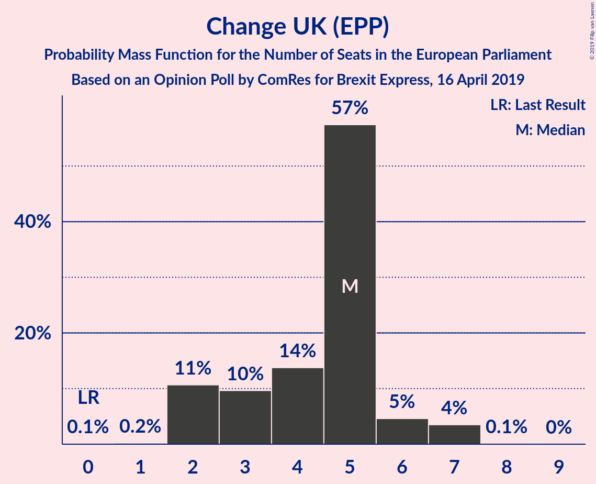

| Number of Seats | Probability | Accumulated | Special Marks |
|:---------------:|:-----------:|:-----------:|:-------------:|
| 0 | 0.1% | 100% | Last Result |
| 1 | 0.2% | 99.9% |  |
| 2 | 11% | 99.7% |  |
| 3 | 10% | 89% |  |
| 4 | 14% | 79% |  |
| 5 | 57% | 66% | Median |
| 6 | 5% | 8% |  |
| 7 | 4% | 4% |  |
| 8 | 0.1% | 0.1% |  |
| 9 | 0% | 0% |  |

### UK Independence Party (EAPN)

*For a full overview of the results for this party, see the [UK Independence Party (EAPN)](party-ukindependencepartyeapn.html) page.*

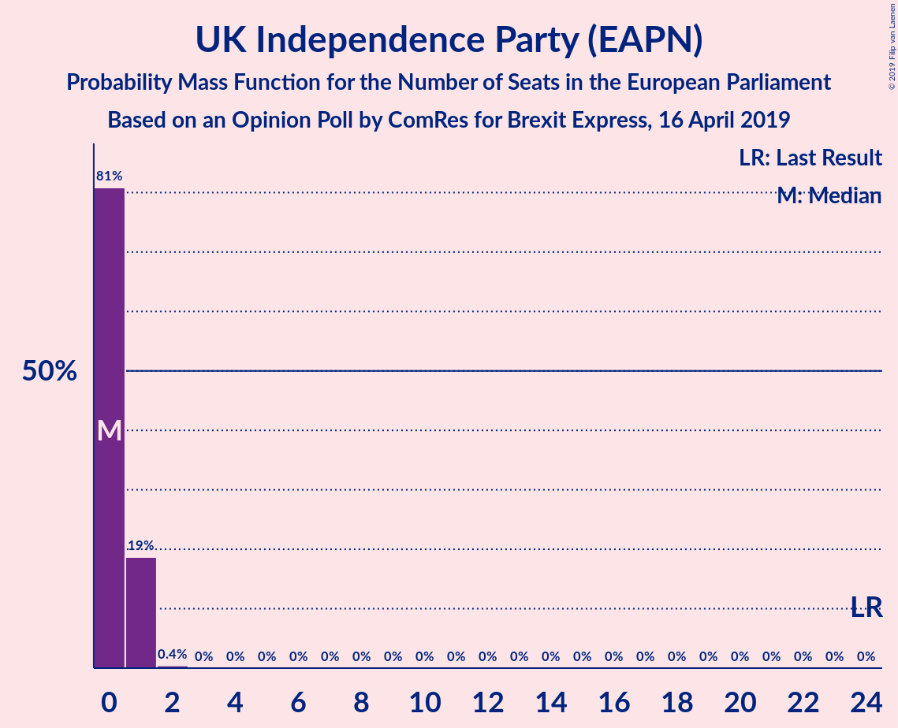

| Number of Seats | Probability | Accumulated | Special Marks |
|:---------------:|:-----------:|:-----------:|:-------------:|
| 0 | 81% | 100% | Median |
| 1 | 19% | 19% |  |
| 2 | 0.4% | 0.5% |  |
| 3 | 0% | 0% |  |
| 4 | 0% | 0% |  |
| 5 | 0% | 0% |  |
| 6 | 0% | 0% |  |
| 7 | 0% | 0% |  |
| 8 | 0% | 0% |  |
| 9 | 0% | 0% |  |
| 10 | 0% | 0% |  |
| 11 | 0% | 0% |  |
| 12 | 0% | 0% |  |
| 13 | 0% | 0% |  |
| 14 | 0% | 0% |  |
| 15 | 0% | 0% |  |
| 16 | 0% | 0% |  |
| 17 | 0% | 0% |  |
| 18 | 0% | 0% |  |
| 19 | 0% | 0% |  |
| 20 | 0% | 0% |  |
| 21 | 0% | 0% |  |
| 22 | 0% | 0% |  |
| 23 | 0% | 0% |  |
| 24 | 0% | 0% | Last Result |

### Green Party (Greens/EFA)

*For a full overview of the results for this party, see the [Green Party (Greens/EFA)](party-greenpartygreensefa.html) page.*

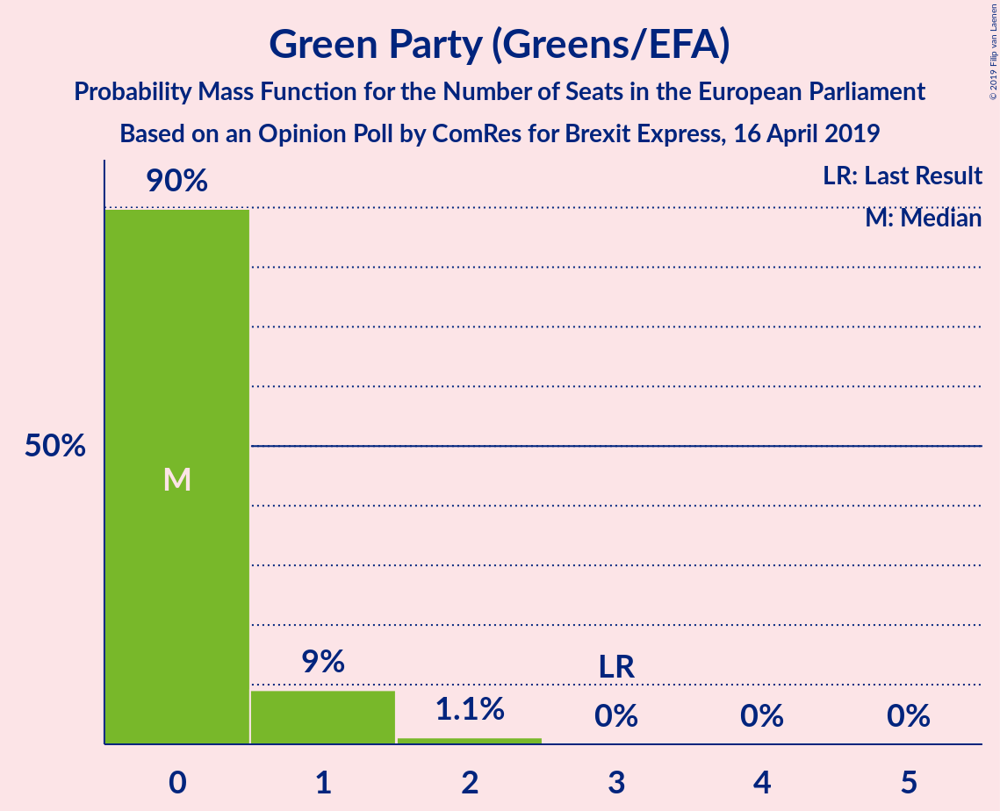

| Number of Seats | Probability | Accumulated | Special Marks |
|:---------------:|:-----------:|:-----------:|:-------------:|
| 0 | 90% | 100% | Median |
| 1 | 9% | 10% |  |
| 2 | 1.1% | 1.2% |  |
| 3 | 0% | 0% | Last Result |

### Scottish National Party (Greens/EFA)

*For a full overview of the results for this party, see the [Scottish National Party (Greens/EFA)](party-scottishnationalpartygreensefa.html) page.*

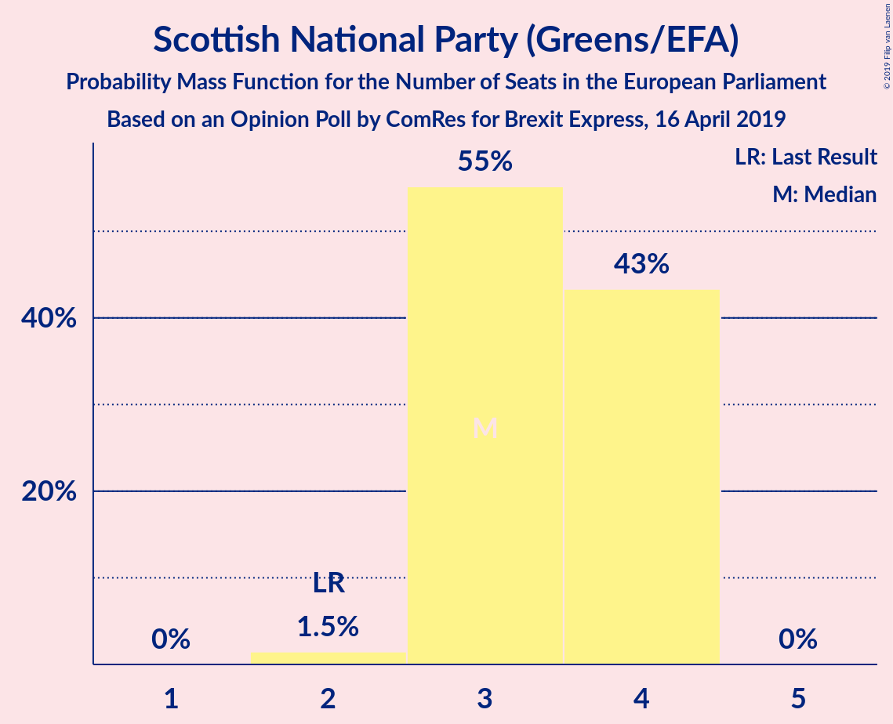

| Number of Seats | Probability | Accumulated | Special Marks |
|:---------------:|:-----------:|:-----------:|:-------------:|
| 2 | 1.5% | 100% | Last Result |
| 3 | 55% | 98.5% | Median |
| 4 | 43% | 43% |  |
| 5 | 0% | 0% |  |

### Plaid Cymru (Greens/EFA)

*For a full overview of the results for this party, see the [Plaid Cymru (Greens/EFA)](party-plaidcymrugreensefa.html) page.*

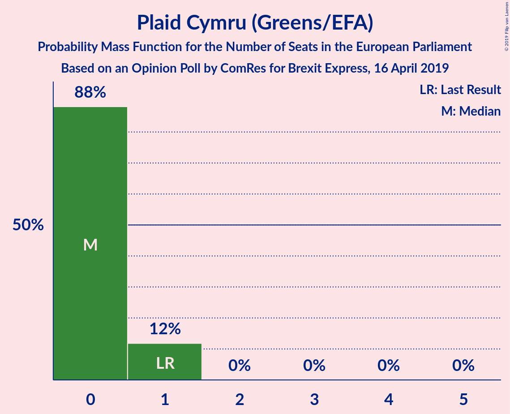

| Number of Seats | Probability | Accumulated | Special Marks |
|:---------------:|:-----------:|:-----------:|:-------------:|
| 0 | 88% | 100% | Median |
| 1 | 12% | 12% | Last Result |
| 2 | 0% | 0% |  |

## Coalitions

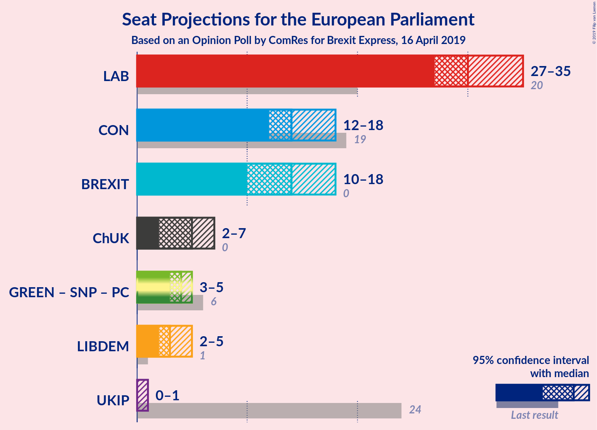

### Confidence Intervals

| Coalition | Last Result | Median | Majority? | 80% Confidence Interval | 90% Confidence Interval | 95% Confidence Interval | 99% Confidence Interval |
|:---------:|:-----------:|:------:|:---------:|:-----------------------:|:-----------------------:|:-----------------------:|:-----------------------:|
| Labour Party (S&D) | 20 | 30 | 2% | 27–34 | 27–34 | 27–35 | 27–36 |
| Conservative Party (ECR) | 19 | 14 | 0% | 12–16 | 12–18 | 12–18 | 10–19 |
| Brexit Party (EFDD) | 0 | 14 | 0% | 11–17 | 11–18 | 10–18 | 10–19 |
| Change UK (EPP) | 0 | 5 | 0% | 2–5 | 2–6 | 2–7 | 2–7 |
| Green Party (Greens/EFA) – Scottish National Party (Greens/EFA) – Plaid Cymru (Greens/EFA) | 6 | 4 | 0% | 3–4 | 3–5 | 3–5 | 2–6 |
| Liberal Democrats (ALDE) | 1 | 3 | 0% | 3–4 | 2–5 | 2–5 | 2–7 |
| UK Independence Party (EAPN) | 24 | 0 | 0% | 0–1 | 0–1 | 0–1 | 0–1 |

### Labour Party (S&D)

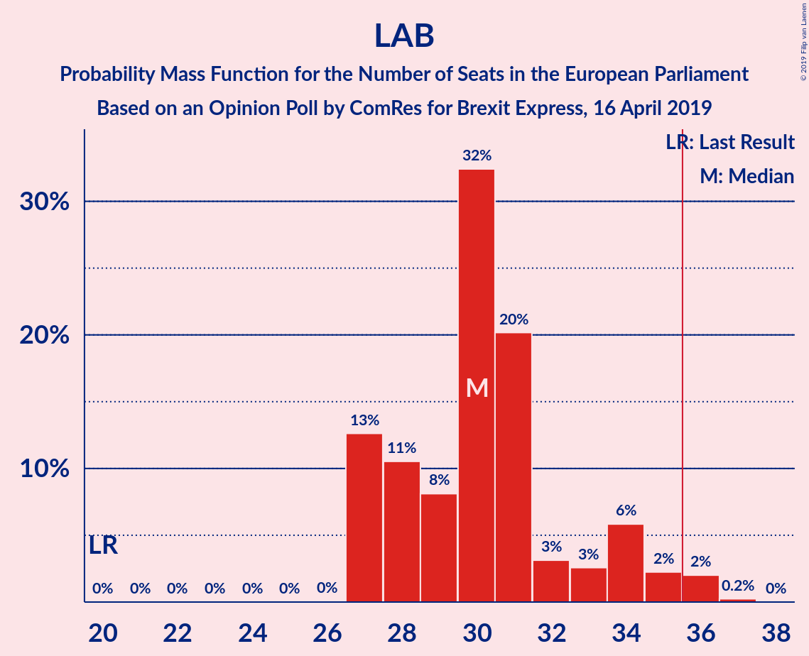

| Number of Seats | Probability | Accumulated | Special Marks |
|:---------------:|:-----------:|:-----------:|:-------------:|
| 20 | 0% | 100% | Last Result |
| 21 | 0% | 100% |  |
| 22 | 0% | 100% |  |
| 23 | 0% | 100% |  |
| 24 | 0% | 100% |  |
| 25 | 0% | 100% |  |
| 26 | 0% | 100% |  |
| 27 | 13% | 99.9% |  |
| 28 | 11% | 87% |  |
| 29 | 8% | 77% |  |
| 30 | 32% | 69% | Median |
| 31 | 20% | 36% |  |
| 32 | 3% | 16% |  |
| 33 | 3% | 13% |  |
| 34 | 6% | 10% |  |
| 35 | 2% | 5% |  |
| 36 | 2% | 2% | Majority |
| 37 | 0.2% | 0.3% |  |
| 38 | 0% | 0% |  |

### Conservative Party (ECR)

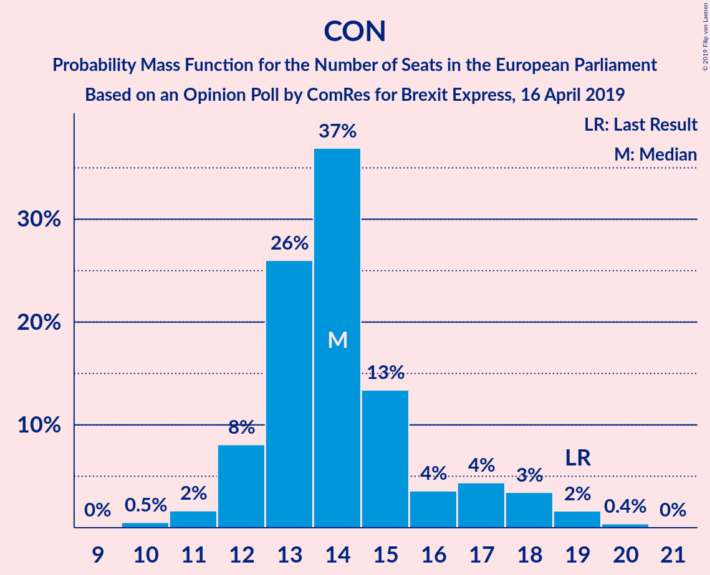

| Number of Seats | Probability | Accumulated | Special Marks |
|:---------------:|:-----------:|:-----------:|:-------------:|
| 10 | 0.5% | 100% |  |
| 11 | 2% | 99.5% |  |
| 12 | 8% | 98% |  |
| 13 | 26% | 90% |  |
| 14 | 37% | 64% | Median |
| 15 | 13% | 27% |  |
| 16 | 4% | 13% |  |
| 17 | 4% | 10% |  |
| 18 | 3% | 5% |  |
| 19 | 2% | 2% | Last Result |
| 20 | 0.4% | 0.4% |  |
| 21 | 0% | 0% |  |

### Brexit Party (EFDD)

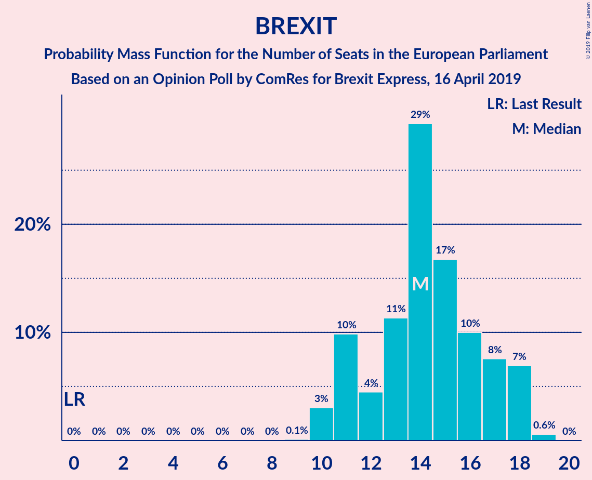

| Number of Seats | Probability | Accumulated | Special Marks |
|:---------------:|:-----------:|:-----------:|:-------------:|
| 0 | 0% | 100% | Last Result |
| 1 | 0% | 100% |  |
| 2 | 0% | 100% |  |
| 3 | 0% | 100% |  |
| 4 | 0% | 100% |  |
| 5 | 0% | 100% |  |
| 6 | 0% | 100% |  |
| 7 | 0% | 100% |  |
| 8 | 0% | 100% |  |
| 9 | 0.1% | 100% |  |
| 10 | 3% | 99.9% |  |
| 11 | 10% | 97% |  |
| 12 | 4% | 87% |  |
| 13 | 11% | 82% |  |
| 14 | 29% | 71% | Median |
| 15 | 17% | 42% |  |
| 16 | 10% | 25% |  |
| 17 | 8% | 15% |  |
| 18 | 7% | 8% |  |
| 19 | 0.6% | 0.6% |  |
| 20 | 0% | 0% |  |

### Change UK (EPP)

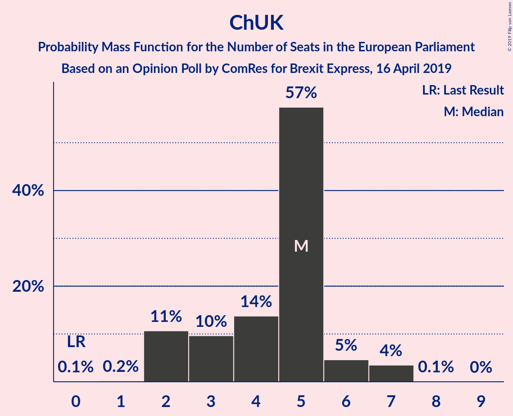

| Number of Seats | Probability | Accumulated | Special Marks |
|:---------------:|:-----------:|:-----------:|:-------------:|
| 0 | 0.1% | 100% | Last Result |
| 1 | 0.2% | 99.9% |  |
| 2 | 11% | 99.7% |  |
| 3 | 10% | 89% |  |
| 4 | 14% | 79% |  |
| 5 | 57% | 66% | Median |
| 6 | 5% | 8% |  |
| 7 | 4% | 4% |  |
| 8 | 0.1% | 0.1% |  |
| 9 | 0% | 0% |  |

### Green Party (Greens/EFA) – Scottish National Party (Greens/EFA) – Plaid Cymru (Greens/EFA)

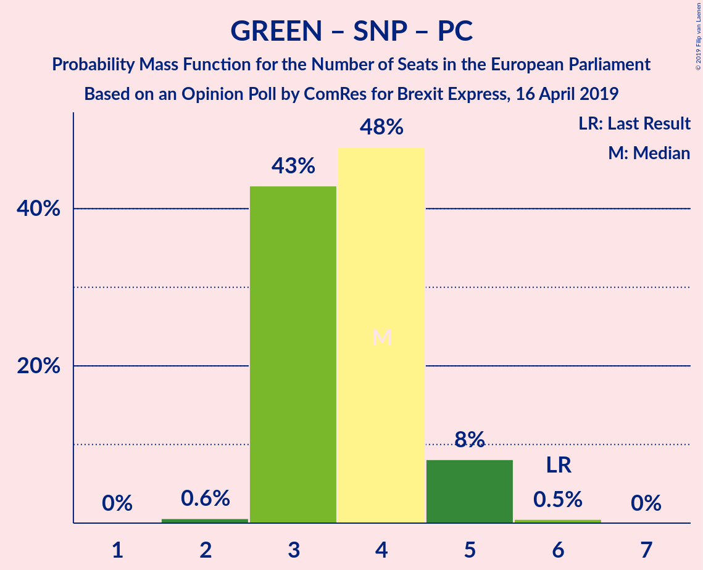

| Number of Seats | Probability | Accumulated | Special Marks |
|:---------------:|:-----------:|:-----------:|:-------------:|
| 2 | 0.6% | 100% |  |
| 3 | 43% | 99.4% | Median |
| 4 | 48% | 56% |  |
| 5 | 8% | 9% |  |
| 6 | 0.5% | 0.5% | Last Result |
| 7 | 0% | 0% |  |

### Liberal Democrats (ALDE)

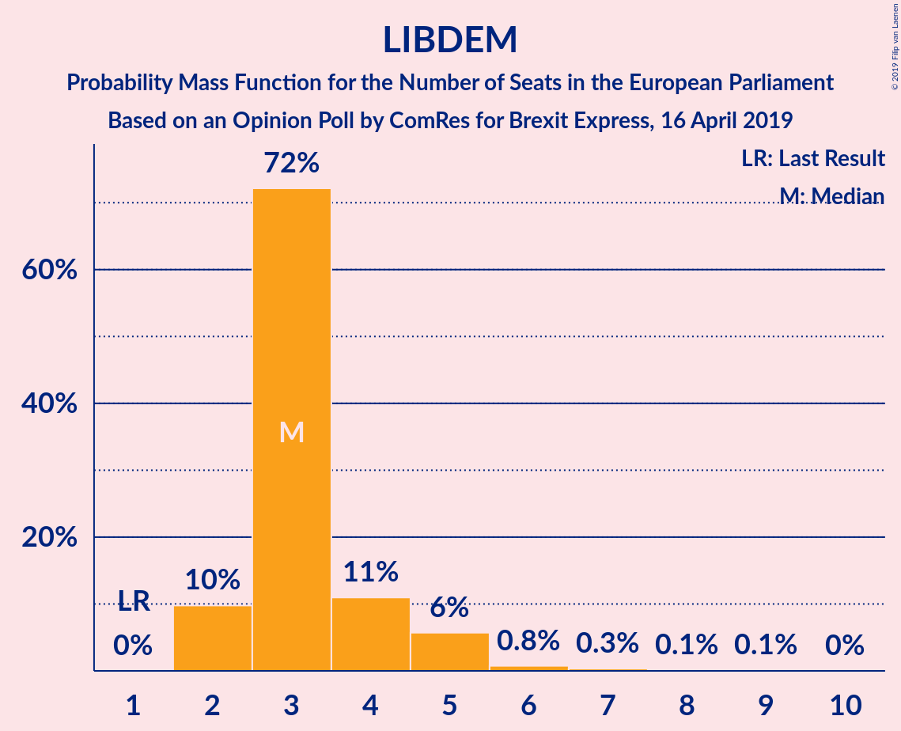

| Number of Seats | Probability | Accumulated | Special Marks |
|:---------------:|:-----------:|:-----------:|:-------------:|
| 1 | 0% | 100% | Last Result |
| 2 | 10% | 100% |  |
| 3 | 72% | 90% | Median |
| 4 | 11% | 18% |  |
| 5 | 6% | 7% |  |
| 6 | 0.8% | 1.4% |  |
| 7 | 0.3% | 0.6% |  |
| 8 | 0.1% | 0.3% |  |
| 9 | 0.1% | 0.1% |  |
| 10 | 0% | 0% |  |

### UK Independence Party (EAPN)

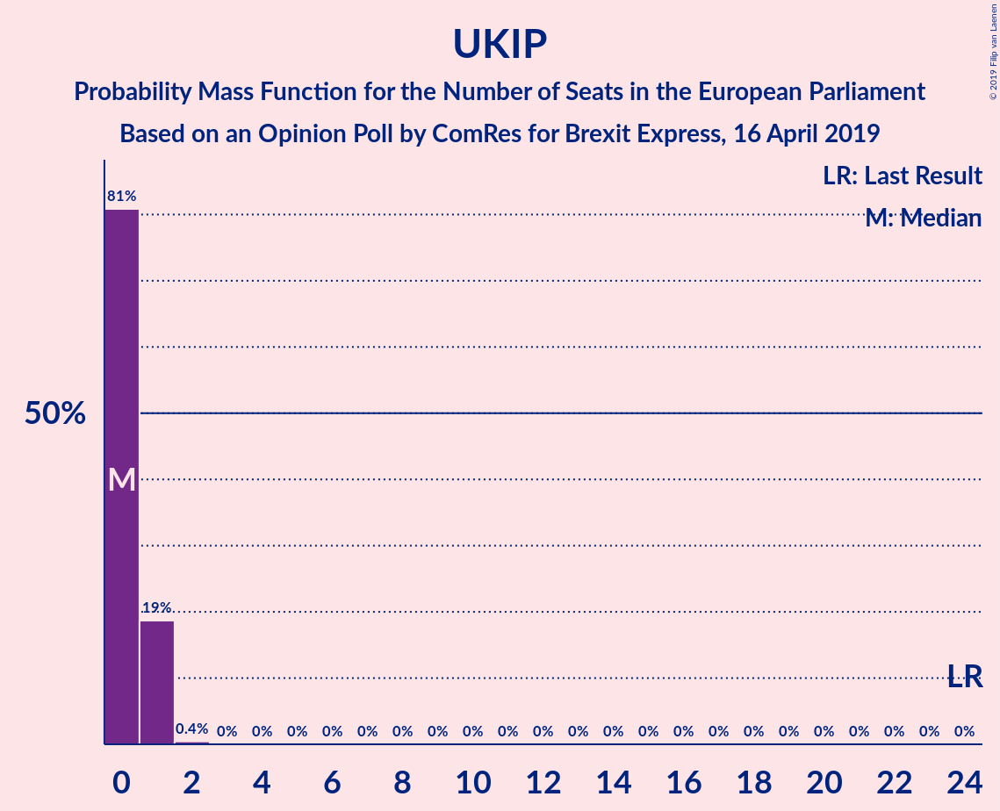

| Number of Seats | Probability | Accumulated | Special Marks |
|:---------------:|:-----------:|:-----------:|:-------------:|
| 0 | 81% | 100% | Median |
| 1 | 19% | 19% |  |
| 2 | 0.4% | 0.5% |  |
| 3 | 0% | 0% |  |
| 4 | 0% | 0% |  |
| 5 | 0% | 0% |  |
| 6 | 0% | 0% |  |
| 7 | 0% | 0% |  |
| 8 | 0% | 0% |  |
| 9 | 0% | 0% |  |
| 10 | 0% | 0% |  |
| 11 | 0% | 0% |  |
| 12 | 0% | 0% |  |
| 13 | 0% | 0% |  |
| 14 | 0% | 0% |  |
| 15 | 0% | 0% |  |
| 16 | 0% | 0% |  |
| 17 | 0% | 0% |  |
| 18 | 0% | 0% |  |
| 19 | 0% | 0% |  |
| 20 | 0% | 0% |  |
| 21 | 0% | 0% |  |
| 22 | 0% | 0% |  |
| 23 | 0% | 0% |  |
| 24 | 0% | 0% | Last Result |

## Technical Information

### Opinion Poll

+ **Polling firm:** ComRes
+ **Commissioner(s):** Brexit Express
+ **Fieldwork period:** 16 April 2019

### Calculations

+ **Sample size:** 1061
+ **Simulations done:** 1,048,576
+ **Error estimate:** 1.89%

