# Opinion Poll by YouGov for The Times, 16–17 April 2019

<a href="#voting-intentions">Voting Intentions</a> | <a href="#seats">Seats</a> | <a href="#coalitions">Coalitions</a> | <a href="#technical-information">Technical Information</a>

## Voting Intentions

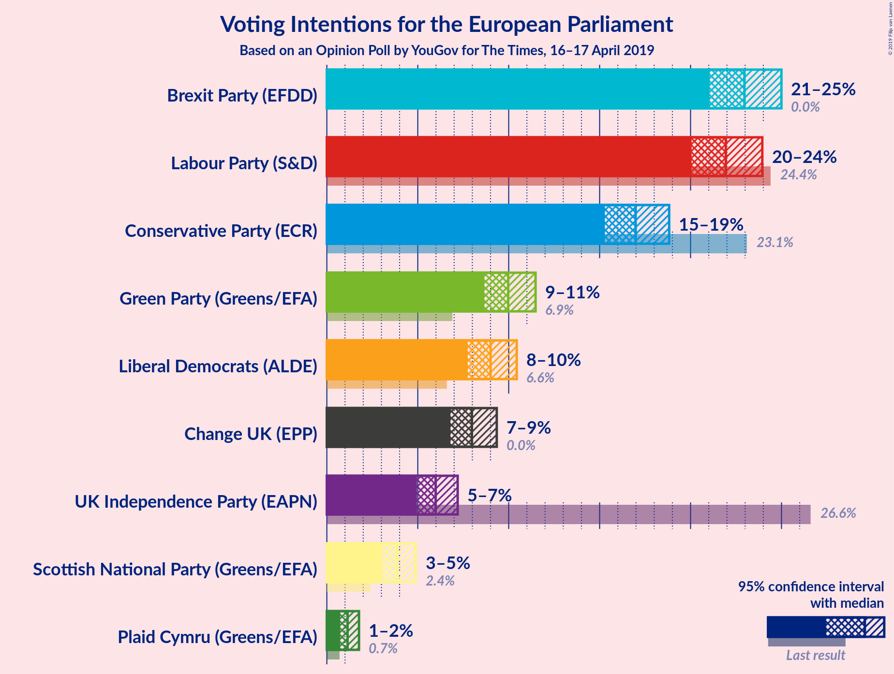

### Confidence Intervals

| Party | Last Result | Poll Result | 80% Confidence Interval | 90% Confidence Interval | 95% Confidence Interval | 99% Confidence Interval |
|:-----:|:-----------:|:-----------:|:-----------------------:|:-----------------------:|:-----------------------:|:-----------------------:|
| Brexit Party (EFDD) | 0.0% | 23.0% | 21.7–24.3% |21.4–24.7% |21.0–25.0% |20.5–25.6% |
| Labour Party (S&D) | 24.4% | 21.9% | 20.7–23.2% |20.4–23.6% |20.1–23.9% |19.5–24.6% |
| Conservative Party (ECR) | 23.1% | 17.0% | 15.9–18.2% |15.6–18.5% |15.3–18.8% |14.8–19.4% |
| Green Party (Greens/EFA) | 6.9% | 10.0% | 9.1–11.0% |8.9–11.2% |8.7–11.5% |8.2–11.9% |
| Liberal Democrats (ALDE) | 6.6% | 9.0% | 8.2–9.9% |7.9–10.2% |7.7–10.4% |7.4–10.9% |
| Change UK (EPP) | 0.0% | 8.0% | 7.2–8.9% |7.0–9.1% |6.8–9.3% |6.4–9.8% |
| UK Independence Party (EAPN) | 26.6% | 6.0% | 5.3–6.8% |5.1–7.0% |5.0–7.2% |4.7–7.6% |
| Scottish National Party (Greens/EFA) | 2.4% | 3.9% | 3.3–4.5% |3.2–4.7% |3.1–4.9% |2.8–5.2% |
| Plaid Cymru (Greens/EFA) | 0.7% | 1.1% | 0.9–1.5% |0.8–1.7% |0.7–1.8% |0.6–2.0% |

*Note:* The poll result column reflects the actual value used in the calculations. Published results may vary slightly, and in addition be rounded to fewer digits.

## Seats

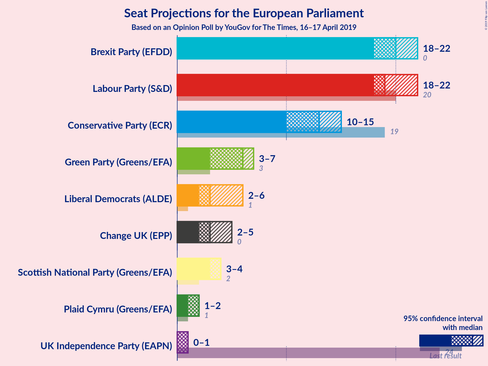

### Confidence Intervals

| Party | Last Result | Median | 80% Confidence Interval | 90% Confidence Interval | 95% Confidence Interval | 99% Confidence Interval |
|:-----:|:-----------:|:------:|:-----------------------:|:-----------------------:|:-----------------------:|:-----------------------:|
| <a href="#brexit-party-(efdd)">Brexit Party (EFDD)</a> | 0 | 20 | 18–21 |18–22 |18–22 |18–23 |
| <a href="#labour-party-(s&d)">Labour Party (S&D)</a> | 20 | 19 | 19–21 |18–21 |18–22 |17–23 |
| <a href="#conservative-party-(ecr)">Conservative Party (ECR)</a> | 19 | 13 | 11–14 |11–15 |10–15 |9–17 |
| <a href="#green-party-(greens/efa)">Green Party (Greens/EFA)</a> | 3 | 6 | 4–6 |4–7 |3–7 |3–7 |
| <a href="#liberal-democrats-(alde)">Liberal Democrats (ALDE)</a> | 1 | 3 | 2–5 |2–5 |2–6 |2–7 |
| <a href="#change-uk-(epp)">Change UK (EPP)</a> | 0 | 3 | 2–4 |2–5 |2–5 |1–6 |
| <a href="#uk-independence-party-(eapn)">UK Independence Party (EAPN)</a> | 24 | 1 | 0–1 |0–1 |0–1 |0–2 |
| <a href="#scottish-national-party-(greens/efa)">Scottish National Party (Greens/EFA)</a> | 2 | 4 | 3–4 |3–4 |3–4 |3–5 |
| <a href="#plaid-cymru-(greens/efa)">Plaid Cymru (Greens/EFA)</a> | 1 | 2 | 1–2 |1–2 |1–2 |1–2 |

### Brexit Party (EFDD)

*For a full overview of the results for this party, see the [Brexit Party (EFDD)](party-brexitpartyefdd.html) page.*

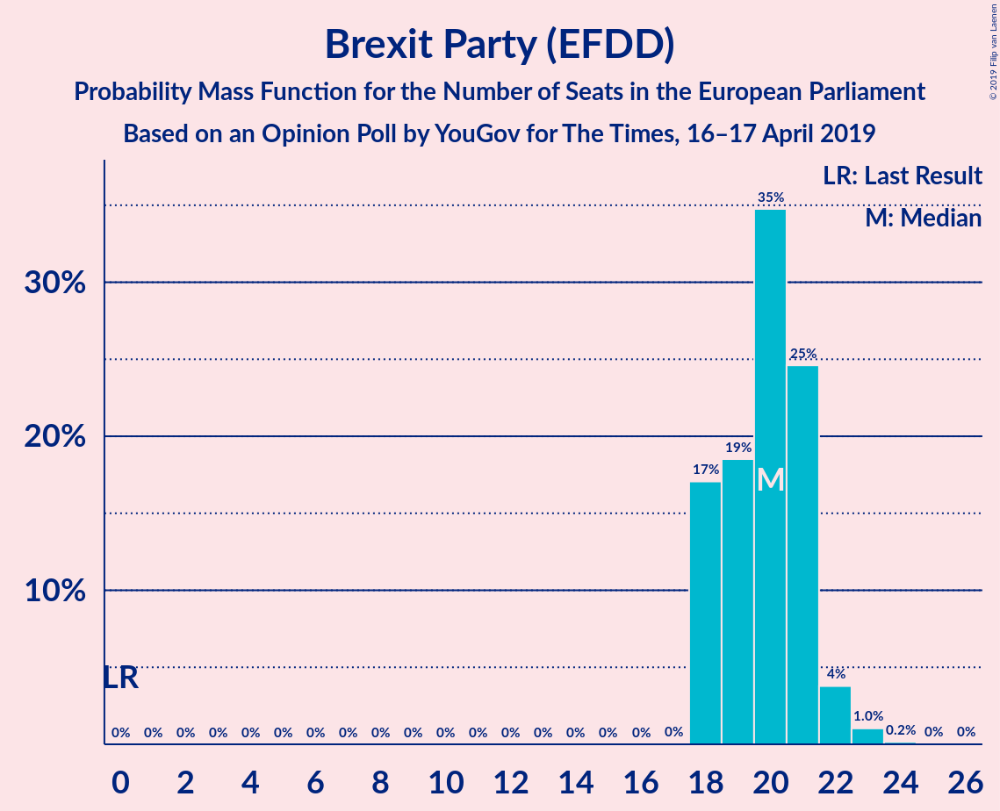

| Number of Seats | Probability | Accumulated | Special Marks |
|:---------------:|:-----------:|:-----------:|:-------------:|
| 0 | 0% | 100% | Last Result |
| 1 | 0% | 100% |  |
| 2 | 0% | 100% |  |
| 3 | 0% | 100% |  |
| 4 | 0% | 100% |  |
| 5 | 0% | 100% |  |
| 6 | 0% | 100% |  |
| 7 | 0% | 100% |  |
| 8 | 0% | 100% |  |
| 9 | 0% | 100% |  |
| 10 | 0% | 100% |  |
| 11 | 0% | 100% |  |
| 12 | 0% | 100% |  |
| 13 | 0% | 100% |  |
| 14 | 0% | 100% |  |
| 15 | 0% | 100% |  |
| 16 | 0% | 100% |  |
| 17 | 0% | 100% |  |
| 18 | 17% | 100% |  |
| 19 | 19% | 83% |  |
| 20 | 35% | 64% | Median |
| 21 | 25% | 30% |  |
| 22 | 4% | 5% |  |
| 23 | 1.0% | 1.2% |  |
| 24 | 0.2% | 0.2% |  |
| 25 | 0% | 0.1% |  |
| 26 | 0% | 0% |  |

### Labour Party (S&D)

*For a full overview of the results for this party, see the [Labour Party (S&D)](party-labourpartysd.html) page.*

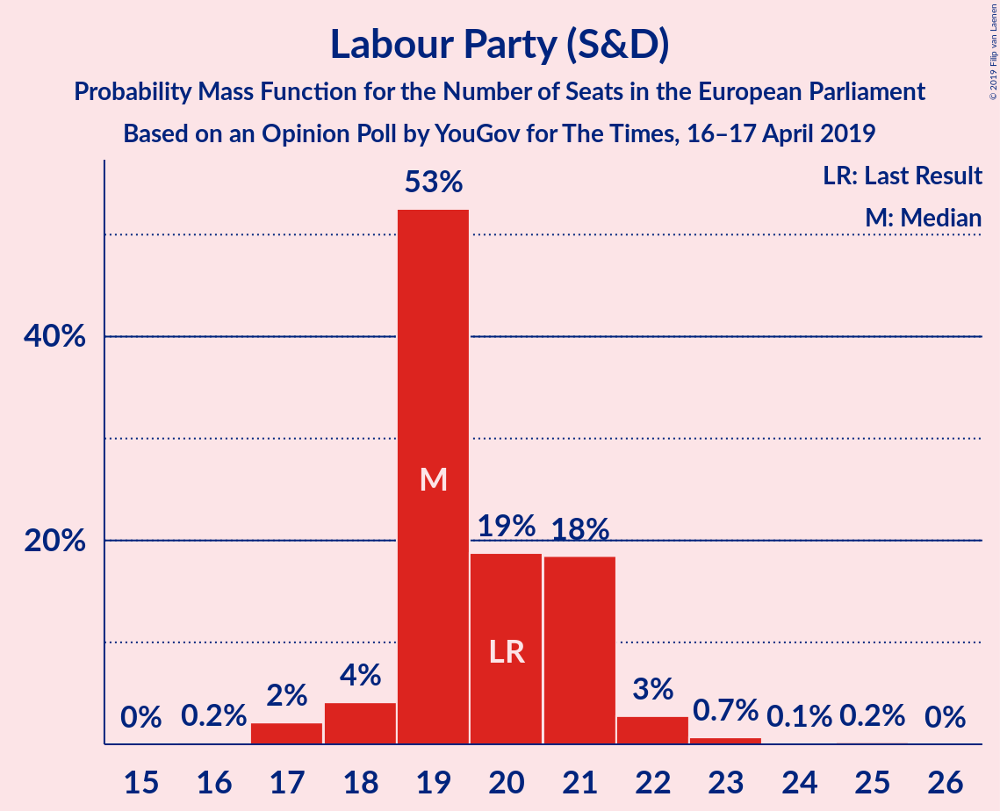

| Number of Seats | Probability | Accumulated | Special Marks |
|:---------------:|:-----------:|:-----------:|:-------------:|
| 16 | 0.2% | 100% |  |
| 17 | 2% | 99.8% |  |
| 18 | 4% | 98% |  |
| 19 | 53% | 94% | Median |
| 20 | 19% | 41% | Last Result |
| 21 | 18% | 22% |  |
| 22 | 3% | 4% |  |
| 23 | 0.7% | 1.0% |  |
| 24 | 0.1% | 0.3% |  |
| 25 | 0.2% | 0.2% |  |
| 26 | 0% | 0% |  |

### Conservative Party (ECR)

*For a full overview of the results for this party, see the [Conservative Party (ECR)](party-conservativepartyecr.html) page.*

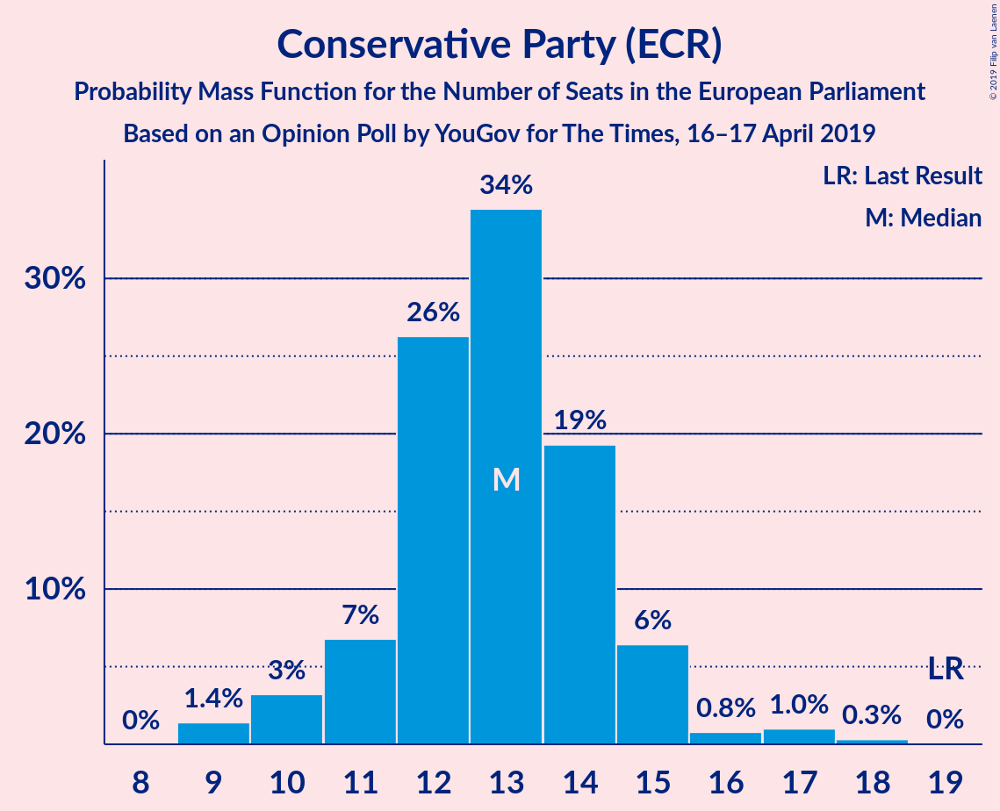

| Number of Seats | Probability | Accumulated | Special Marks |
|:---------------:|:-----------:|:-----------:|:-------------:|
| 9 | 1.4% | 100% |  |
| 10 | 3% | 98.6% |  |
| 11 | 7% | 95% |  |
| 12 | 26% | 89% |  |
| 13 | 34% | 62% | Median |
| 14 | 19% | 28% |  |
| 15 | 6% | 9% |  |
| 16 | 0.8% | 2% |  |
| 17 | 1.0% | 1.3% |  |
| 18 | 0.3% | 0.3% |  |
| 19 | 0% | 0% | Last Result |

### Green Party (Greens/EFA)

*For a full overview of the results for this party, see the [Green Party (Greens/EFA)](party-greenpartygreensefa.html) page.*

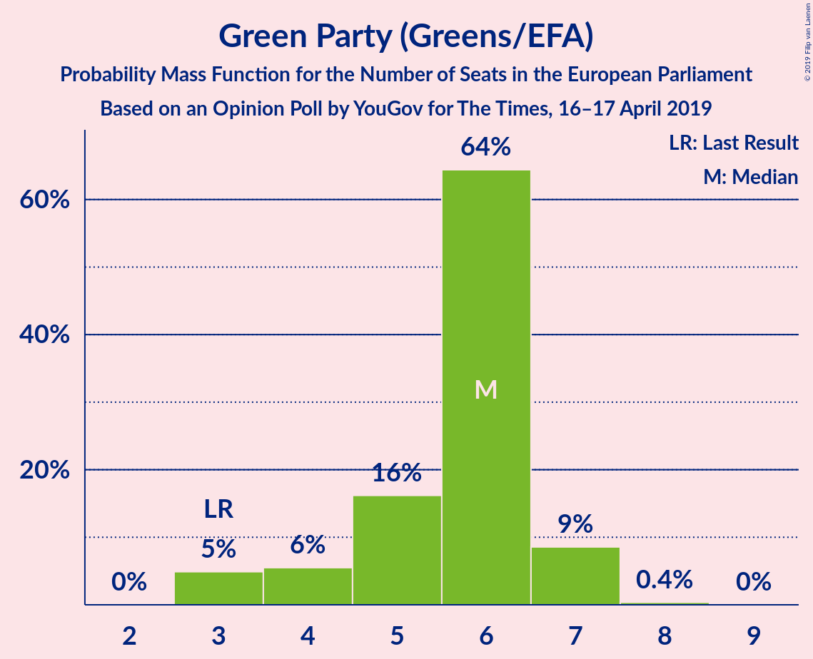

| Number of Seats | Probability | Accumulated | Special Marks |
|:---------------:|:-----------:|:-----------:|:-------------:|
| 3 | 5% | 100% | Last Result |
| 4 | 6% | 95% |  |
| 5 | 16% | 90% |  |
| 6 | 64% | 73% | Median |
| 7 | 9% | 9% |  |
| 8 | 0.4% | 0.4% |  |
| 9 | 0% | 0% |  |

### Liberal Democrats (ALDE)

*For a full overview of the results for this party, see the [Liberal Democrats (ALDE)](party-liberaldemocratsalde.html) page.*

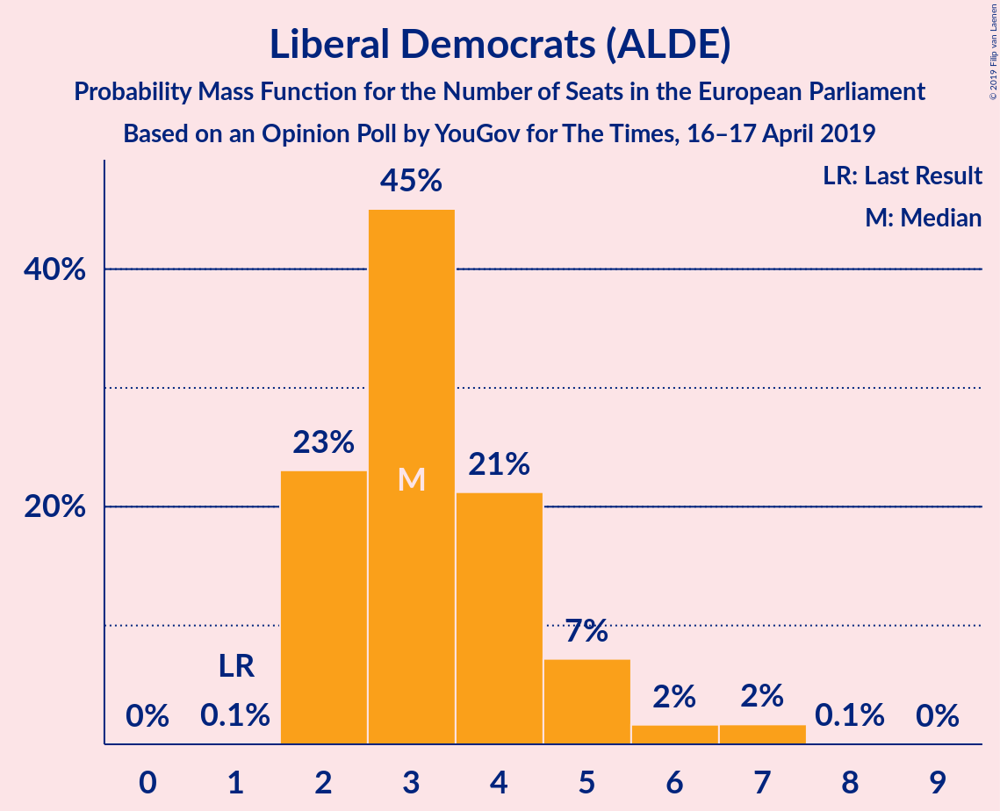

| Number of Seats | Probability | Accumulated | Special Marks |
|:---------------:|:-----------:|:-----------:|:-------------:|
| 1 | 0.1% | 100% | Last Result |
| 2 | 23% | 99.9% |  |
| 3 | 45% | 77% | Median |
| 4 | 21% | 32% |  |
| 5 | 7% | 11% |  |
| 6 | 2% | 3% |  |
| 7 | 2% | 2% |  |
| 8 | 0.1% | 0.1% |  |
| 9 | 0% | 0% |  |

### Change UK (EPP)

*For a full overview of the results for this party, see the [Change UK (EPP)](party-changeukepp.html) page.*

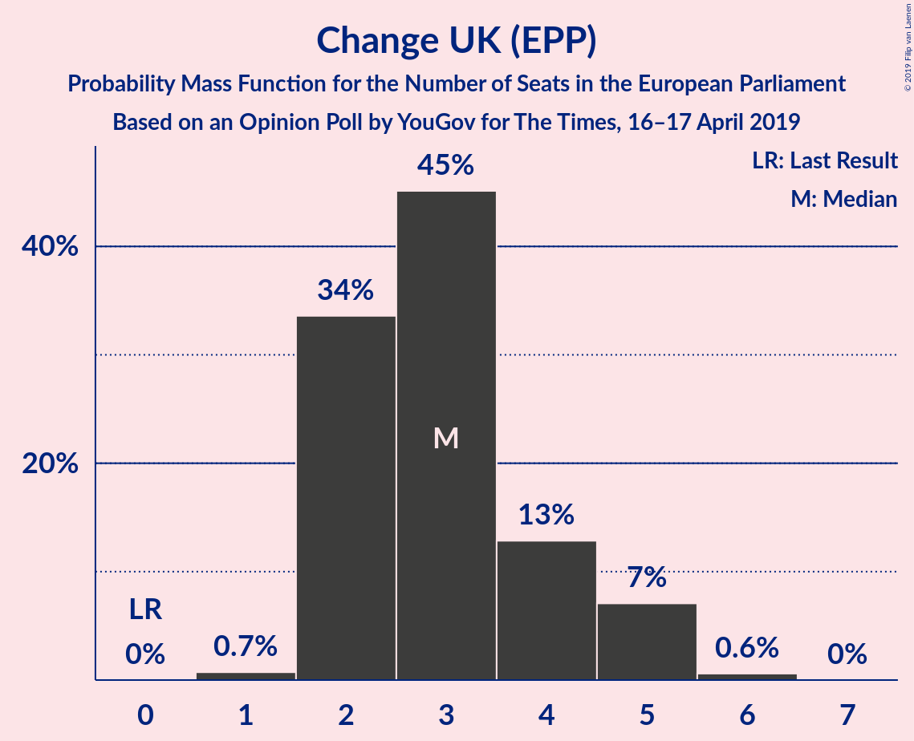

| Number of Seats | Probability | Accumulated | Special Marks |
|:---------------:|:-----------:|:-----------:|:-------------:|
| 0 | 0% | 100% | Last Result |
| 1 | 0.7% | 100% |  |
| 2 | 34% | 99.3% |  |
| 3 | 45% | 66% | Median |
| 4 | 13% | 21% |  |
| 5 | 7% | 8% |  |
| 6 | 0.6% | 0.6% |  |
| 7 | 0% | 0% |  |

### UK Independence Party (EAPN)

*For a full overview of the results for this party, see the [UK Independence Party (EAPN)](party-ukindependencepartyeapn.html) page.*

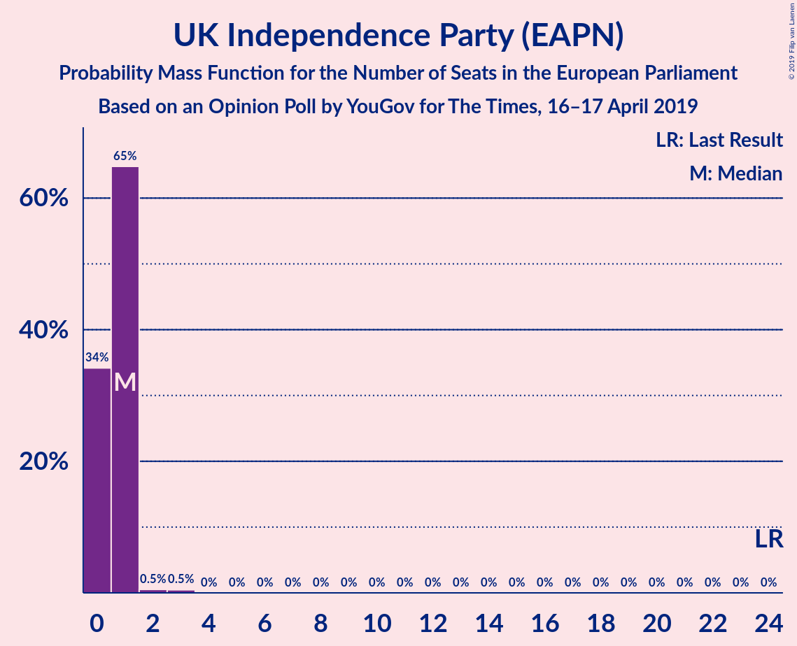

| Number of Seats | Probability | Accumulated | Special Marks |
|:---------------:|:-----------:|:-----------:|:-------------:|
| 0 | 34% | 100% |  |
| 1 | 65% | 66% | Median |
| 2 | 0.5% | 1.0% |  |
| 3 | 0.5% | 0.5% |  |
| 4 | 0% | 0% |  |
| 5 | 0% | 0% |  |
| 6 | 0% | 0% |  |
| 7 | 0% | 0% |  |
| 8 | 0% | 0% |  |
| 9 | 0% | 0% |  |
| 10 | 0% | 0% |  |
| 11 | 0% | 0% |  |
| 12 | 0% | 0% |  |
| 13 | 0% | 0% |  |
| 14 | 0% | 0% |  |
| 15 | 0% | 0% |  |
| 16 | 0% | 0% |  |
| 17 | 0% | 0% |  |
| 18 | 0% | 0% |  |
| 19 | 0% | 0% |  |
| 20 | 0% | 0% |  |
| 21 | 0% | 0% |  |
| 22 | 0% | 0% |  |
| 23 | 0% | 0% |  |
| 24 | 0% | 0% | Last Result |

### Scottish National Party (Greens/EFA)

*For a full overview of the results for this party, see the [Scottish National Party (Greens/EFA)](party-scottishnationalpartygreensefa.html) page.*

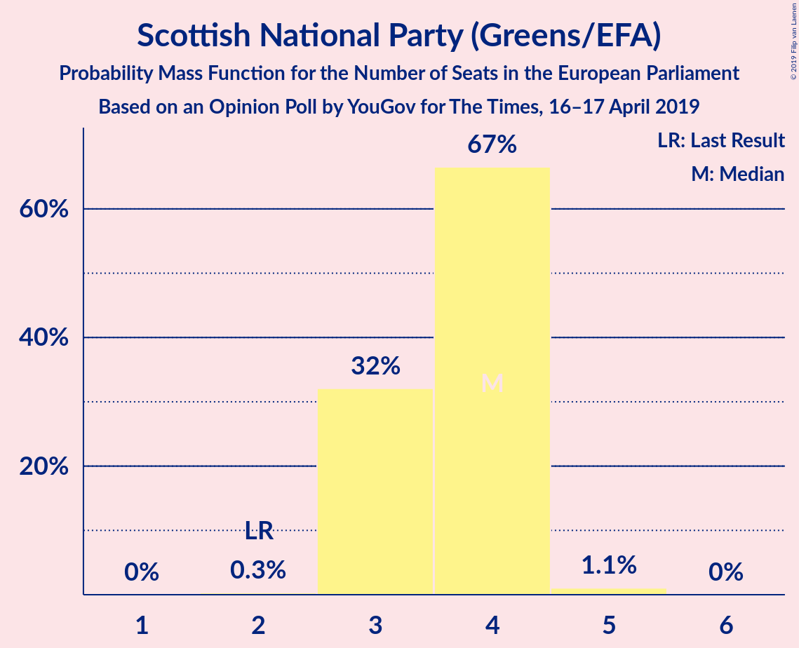

| Number of Seats | Probability | Accumulated | Special Marks |
|:---------------:|:-----------:|:-----------:|:-------------:|
| 2 | 0.3% | 100% | Last Result |
| 3 | 32% | 99.7% |  |
| 4 | 67% | 68% | Median |
| 5 | 1.1% | 1.1% |  |
| 6 | 0% | 0% |  |

### Plaid Cymru (Greens/EFA)

*For a full overview of the results for this party, see the [Plaid Cymru (Greens/EFA)](party-plaidcymrugreensefa.html) page.*

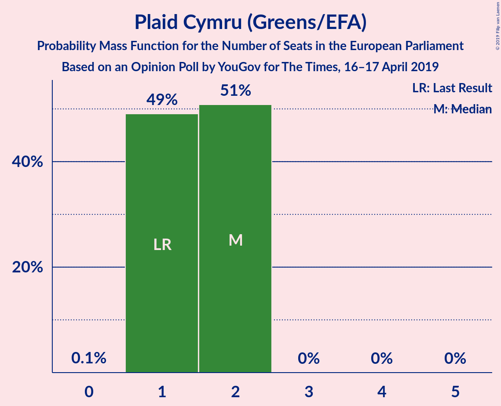

| Number of Seats | Probability | Accumulated | Special Marks |
|:---------------:|:-----------:|:-----------:|:-------------:|
| 0 | 0.1% | 100% |  |
| 1 | 49% | 99.9% | Last Result |
| 2 | 51% | 51% | Median |
| 3 | 0% | 0% |  |

## Coalitions

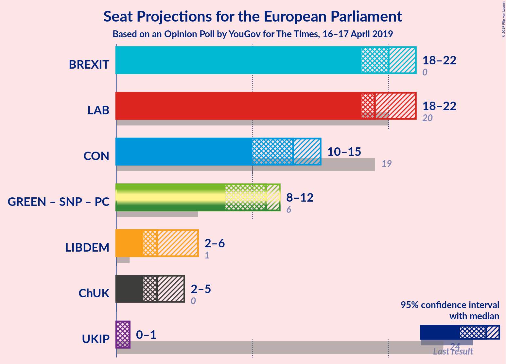

### Confidence Intervals

| Coalition | Last Result | Median | Majority? | 80% Confidence Interval | 90% Confidence Interval | 95% Confidence Interval | 99% Confidence Interval |
|:---------:|:-----------:|:------:|:---------:|:-----------------------:|:-----------------------:|:-----------------------:|:-----------------------:|
| Brexit Party (EFDD) | 0 | 20 | 0% | 18–21 | 18–22 | 18–22 | 18–23 |
| Labour Party (S&D) | 20 | 19 | 0% | 19–21 | 18–21 | 18–22 | 17–23 |
| Conservative Party (ECR) | 19 | 13 | 0% | 11–14 | 11–15 | 10–15 | 9–17 |
| Green Party (Greens/EFA) – Scottish National Party (Greens/EFA) – Plaid Cymru (Greens/EFA) | 6 | 11 | 0% | 9–12 | 8–12 | 8–12 | 7–13 |
| Liberal Democrats (ALDE) | 1 | 3 | 0% | 2–5 | 2–5 | 2–6 | 2–7 |
| Change UK (EPP) | 0 | 3 | 0% | 2–4 | 2–5 | 2–5 | 1–6 |
| UK Independence Party (EAPN) | 24 | 1 | 0% | 0–1 | 0–1 | 0–1 | 0–2 |

### Brexit Party (EFDD)

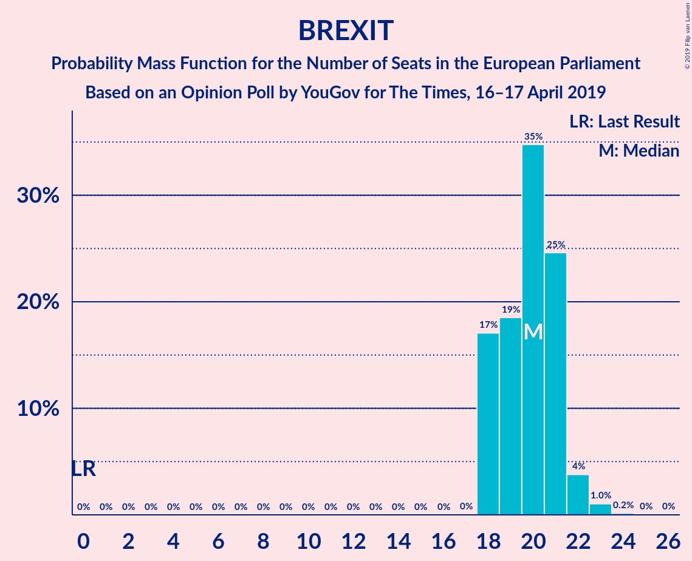

| Number of Seats | Probability | Accumulated | Special Marks |
|:---------------:|:-----------:|:-----------:|:-------------:|
| 0 | 0% | 100% | Last Result |
| 1 | 0% | 100% |  |
| 2 | 0% | 100% |  |
| 3 | 0% | 100% |  |
| 4 | 0% | 100% |  |
| 5 | 0% | 100% |  |
| 6 | 0% | 100% |  |
| 7 | 0% | 100% |  |
| 8 | 0% | 100% |  |
| 9 | 0% | 100% |  |
| 10 | 0% | 100% |  |
| 11 | 0% | 100% |  |
| 12 | 0% | 100% |  |
| 13 | 0% | 100% |  |
| 14 | 0% | 100% |  |
| 15 | 0% | 100% |  |
| 16 | 0% | 100% |  |
| 17 | 0% | 100% |  |
| 18 | 17% | 100% |  |
| 19 | 19% | 83% |  |
| 20 | 35% | 64% | Median |
| 21 | 25% | 30% |  |
| 22 | 4% | 5% |  |
| 23 | 1.0% | 1.2% |  |
| 24 | 0.2% | 0.2% |  |
| 25 | 0% | 0.1% |  |
| 26 | 0% | 0% |  |

### Labour Party (S&D)

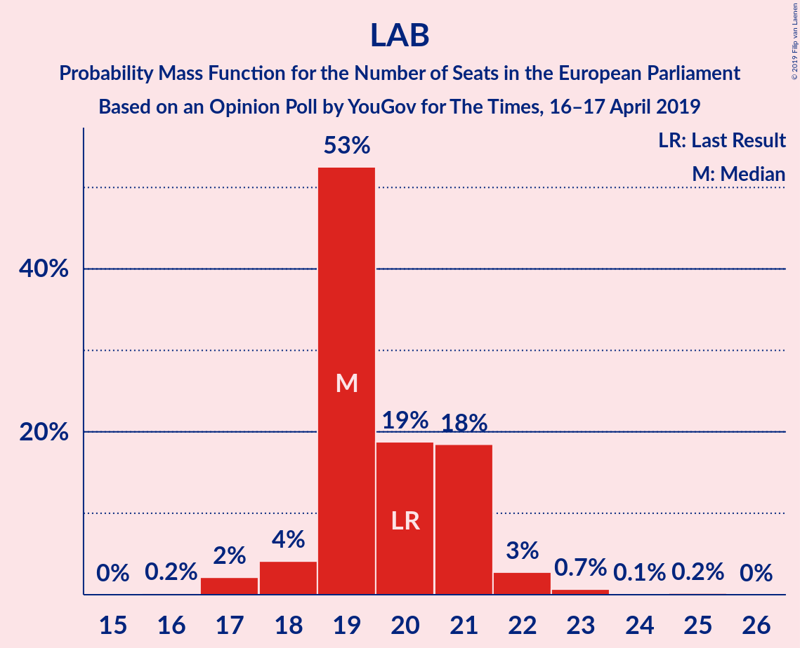

| Number of Seats | Probability | Accumulated | Special Marks |
|:---------------:|:-----------:|:-----------:|:-------------:|
| 16 | 0.2% | 100% |  |
| 17 | 2% | 99.8% |  |
| 18 | 4% | 98% |  |
| 19 | 53% | 94% | Median |
| 20 | 19% | 41% | Last Result |
| 21 | 18% | 22% |  |
| 22 | 3% | 4% |  |
| 23 | 0.7% | 1.0% |  |
| 24 | 0.1% | 0.3% |  |
| 25 | 0.2% | 0.2% |  |
| 26 | 0% | 0% |  |

### Conservative Party (ECR)

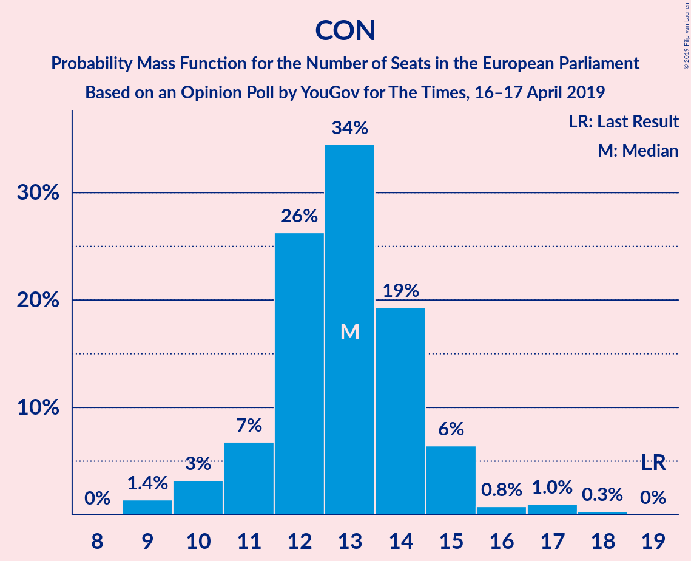

| Number of Seats | Probability | Accumulated | Special Marks |
|:---------------:|:-----------:|:-----------:|:-------------:|
| 9 | 1.4% | 100% |  |
| 10 | 3% | 98.6% |  |
| 11 | 7% | 95% |  |
| 12 | 26% | 89% |  |
| 13 | 34% | 62% | Median |
| 14 | 19% | 28% |  |
| 15 | 6% | 9% |  |
| 16 | 0.8% | 2% |  |
| 17 | 1.0% | 1.3% |  |
| 18 | 0.3% | 0.3% |  |
| 19 | 0% | 0% | Last Result |

### Green Party (Greens/EFA) – Scottish National Party (Greens/EFA) – Plaid Cymru (Greens/EFA)

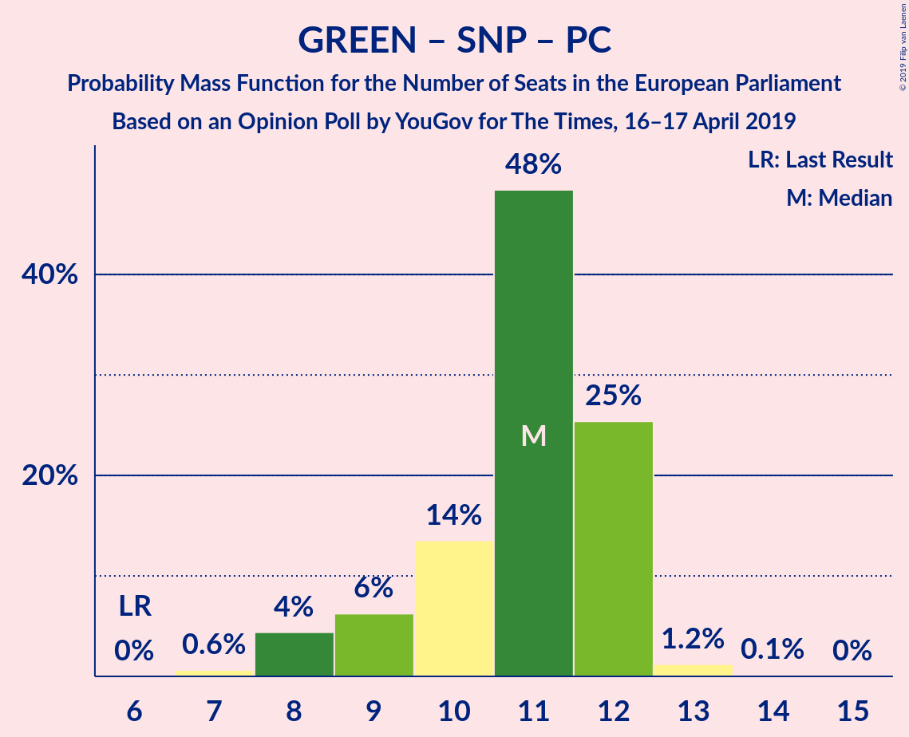

| Number of Seats | Probability | Accumulated | Special Marks |
|:---------------:|:-----------:|:-----------:|:-------------:|
| 6 | 0% | 100% | Last Result |
| 7 | 0.6% | 100% |  |
| 8 | 4% | 99.3% |  |
| 9 | 6% | 95% |  |
| 10 | 14% | 89% |  |
| 11 | 48% | 75% |  |
| 12 | 25% | 27% | Median |
| 13 | 1.2% | 1.4% |  |
| 14 | 0.1% | 0.1% |  |
| 15 | 0% | 0% |  |

### Liberal Democrats (ALDE)

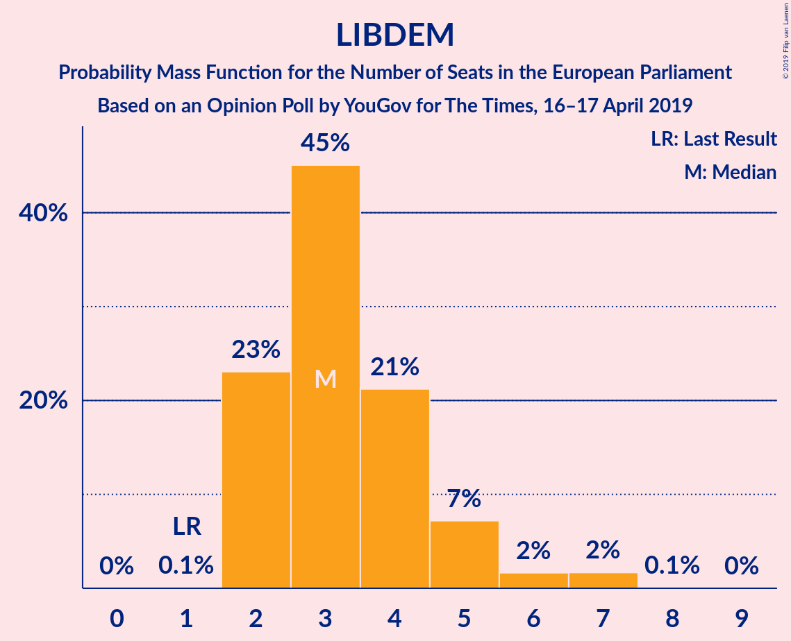

| Number of Seats | Probability | Accumulated | Special Marks |
|:---------------:|:-----------:|:-----------:|:-------------:|
| 1 | 0.1% | 100% | Last Result |
| 2 | 23% | 99.9% |  |
| 3 | 45% | 77% | Median |
| 4 | 21% | 32% |  |
| 5 | 7% | 11% |  |
| 6 | 2% | 3% |  |
| 7 | 2% | 2% |  |
| 8 | 0.1% | 0.1% |  |
| 9 | 0% | 0% |  |

### Change UK (EPP)

| Number of Seats | Probability | Accumulated | Special Marks |
|:---------------:|:-----------:|:-----------:|:-------------:|
| 0 | 0% | 100% | Last Result |
| 1 | 0.7% | 100% |  |
| 2 | 34% | 99.3% |  |
| 3 | 45% | 66% | Median |
| 4 | 13% | 21% |  |
| 5 | 7% | 8% |  |
| 6 | 0.6% | 0.6% |  |
| 7 | 0% | 0% |  |

### UK Independence Party (EAPN)

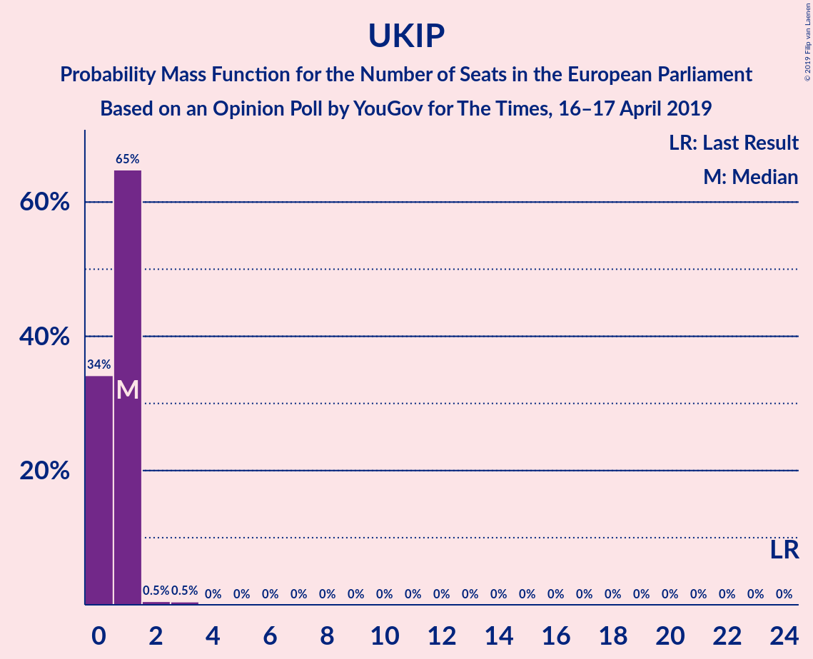

| Number of Seats | Probability | Accumulated | Special Marks |
|:---------------:|:-----------:|:-----------:|:-------------:|
| 0 | 34% | 100% |  |
| 1 | 65% | 66% | Median |
| 2 | 0.5% | 1.0% |  |
| 3 | 0.5% | 0.5% |  |
| 4 | 0% | 0% |  |
| 5 | 0% | 0% |  |
| 6 | 0% | 0% |  |
| 7 | 0% | 0% |  |
| 8 | 0% | 0% |  |
| 9 | 0% | 0% |  |
| 10 | 0% | 0% |  |
| 11 | 0% | 0% |  |
| 12 | 0% | 0% |  |
| 13 | 0% | 0% |  |
| 14 | 0% | 0% |  |
| 15 | 0% | 0% |  |
| 16 | 0% | 0% |  |
| 17 | 0% | 0% |  |
| 18 | 0% | 0% |  |
| 19 | 0% | 0% |  |
| 20 | 0% | 0% |  |
| 21 | 0% | 0% |  |
| 22 | 0% | 0% |  |
| 23 | 0% | 0% |  |
| 24 | 0% | 0% | Last Result |

## Technical Information

### Opinion Poll

+ **Polling firm:** YouGov
+ **Commissioner(s):** The Times
+ **Fieldwork period:** 16–17 April 2019

### Calculations

+ **Sample size:** 1755
+ **Simulations done:** 1,048,576
+ **Error estimate:** 2.27%

