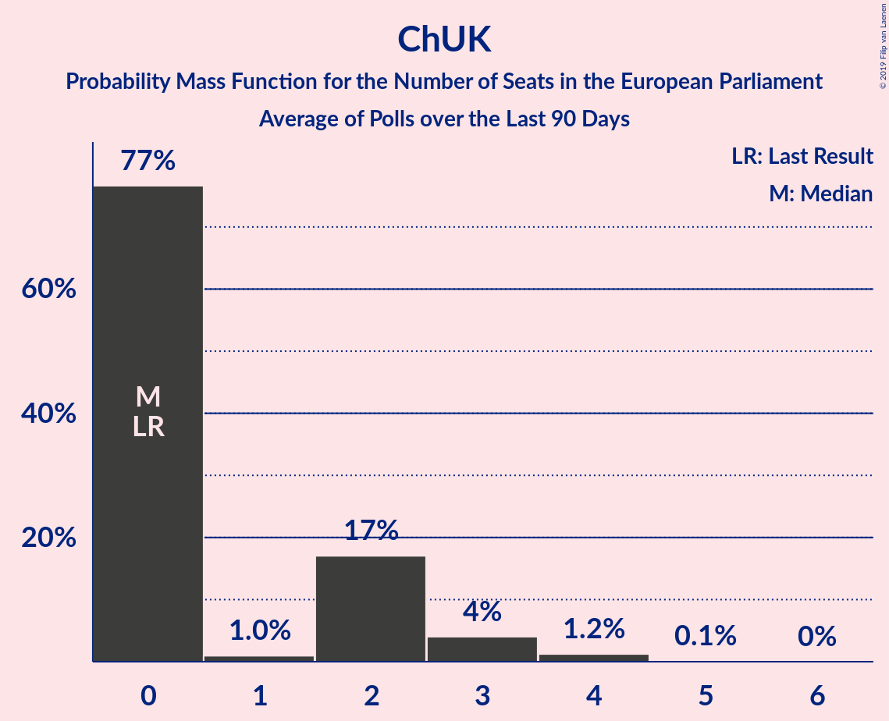

# Poll Average

<a href="#voting-intentions">Voting Intentions</a> | <a href="#seats">Seats</a> | <a href="#coalitions">Coalitions</a> | <a href="#technical-information">Technical Information</a>

## Summary

The table below lists the polls on which the average is based. They are the most recent polls (less than 90 days old) registered and analyzed so far.

| Period     | Polling firm/Commissioner(s) | UKIP | LAB | CON | GREEN | LIBDEM | SNP | PC | BREXIT | ChUK |
|:----------:|:----------------------------:|:--:|:--:|:--:|:--:|:--:|:--:|:--:|:--:|:--:|
| 22 May 2014 | General Election | 26.6%   24 | 24.4%   20 | 23.1%   19 | 6.9%   3 | 6.6%   1 | 2.4%   2 | 0.7%   1 | 0.0%   0 | 0.0%   0 |
| N/A | Poll Average | 12–16%   7–13 | 23–31%   24–29 | 15–18%   9–15 | 5–9%   0–4 | 7–11%   2–8 | 4–7%   4–5 | 1–2%   0–2 | 11–17%   7–13 | 3–8%   0–2 |
| [9–12 April 2019](2019-04-12-Opinium.html) | Opinium | 12–15%   7–11 | 27–31%   25–29 | 15–19%   9–15 | 5–7%   0–3 | 9–11%   5–8 | 5–7%   4–5 | 1–2%   0–2 | 11–14%   7–11 | 3–5%   0 |
| [10–11 April 2019](2019-04-11-YouGov.html) | YouGov | 13–16%   8–13 | 22–26%   24–25 | 15–18%   10 | 7–9%   2–4 | 7–9%   2 | 4–6%   4–5 | 1–2%   2 | 14–17%   10–13 | 6–8%   2 |
| [5–8 April 2019](2019-04-08-HanburyStrategy.html) | Hanbury Strategy | N/A   N/A | N/A   N/A | N/A   N/A | N/A   N/A | N/A   N/A | N/A   N/A | N/A   N/A | N/A   N/A | N/A   N/A |
| [10–17 January 2019](2019-01-17-NumberCruncherPolitics.html) | Number Cruncher Politics   Politico | N/A   N/A | N/A   N/A | N/A   N/A | N/A   N/A | N/A   N/A | N/A   N/A | N/A   N/A | N/A   N/A | N/A   N/A |
| 22 May 2014 | General Election | 26.6%   24 | 24.4%   20 | 23.1%   19 | 6.9%   3 | 6.6%   1 | 2.4%   2 | 0.7%   1 | 0.0%   0 | 0.0%   0 |

Only polls for which at least the sample size has been published are included in the table above.

**Legend:**
+ **Top half of each row:** Voting intentions (95% confidence interval)
+ **Bottom half of each row:** Seat projections for the European Parliament (95% confidence interval)
+ **UKIP:** UK Independence Party (EAPN)
+ **LAB:** Labour Party (S&D)
+ **CON:** Conservative Party (ECR)
+ **GREEN:** Green Party (Greens/EFA)
+ **LIBDEM:** Liberal Democrats (ALDE)
+ **SNP:** Scottish National Party (Greens/EFA)
+ **PC:** Plaid Cymru (Greens/EFA)
+ **BREXIT:** Brexit Party (EFDD)
+ **ChUK:** Change UK (EPP)
+ **N/A (single party):** Party not included the published results
+ **N/A (entire row):** Calculation for this opinion poll not started yet

## Voting Intentions

### Confidence Intervals

| Party | Last Result | Median | 80% Confidence Interval | 90% Confidence Interval | 95% Confidence Interval | 99% Confidence Interval |
|:-----:|:-----------:|:------:|:-----------------------:|:-----------------------:|:-----------------------:|:-----------------------:|
| <a href="#uk-independence-party-(eapn)">UK Independence Party (EAPN)</a> | 26.6% | 13.6% | 12.4–14.9% |12.1–15.3% | 11.8–15.6% | 11.3–16.1% |
| <a href="#labour-party-(s&d)">Labour Party (S&D)</a> | 24.4% | 26.7% | 23.4–29.9% |23.0–30.3% | 22.7–30.7% | 22.0–31.4% |
| <a href="#conservative-party-(ecr)">Conservative Party (ECR)</a> | 23.1% | 16.6% | 15.4–17.8% |15.1–18.2% | 14.8–18.5% | 14.3–19.0% |
| <a href="#green-party-(greens/efa)">Green Party (Greens/EFA)</a> | 6.9% | 7.0% | 5.6–8.7% |5.4–9.0% | 5.2–9.2% | 4.9–9.7% |
| <a href="#liberal-democrats-(alde)">Liberal Democrats (ALDE)</a> | 6.6% | 9.1% | 7.6–10.6% |7.3–10.9% | 7.1–11.2% | 6.7–11.7% |
| <a href="#scottish-national-party-(greens/efa)">Scottish National Party (Greens/EFA)</a> | 2.4% | 5.5% | 4.7–6.5% |4.4–6.7% | 4.3–6.9% | 4.0–7.3% |
| <a href="#plaid-cymru-(greens/efa)">Plaid Cymru (Greens/EFA)</a> | 0.7% | 1.0% | 0.8–1.4% |0.7–1.5% | 0.7–1.6% | 0.6–1.8% |
| <a href="#brexit-party-(efdd)">Brexit Party (EFDD)</a> | 0.0% | 13.5% | 11.4–15.9% |11.1–16.3% | 10.9–16.6% | 10.4–17.2% |
| <a href="#change-uk-(epp)">Change UK (EPP)</a> | 0.0% | 5.4% | 3.7–7.6% |3.5–7.9% | 3.3–8.1% | 3.1–8.6% |

### UK Independence Party (EAPN)

*For a full overview of the results for this party, see the [UK Independence Party (EAPN)](party-ukindependencepartyeapn.html) page.*

| Voting Intentions | Probability | Accumulated | Special Marks |
|:-----------------:|:-----------:|:-----------:|:-------------:|
| 9.5–10.5% | 0% | 100% |  |
| 10.5–11.5% | 1.1% | 100% |  |
| 11.5–12.5% | 13% | 98.9% |  |
| 12.5–13.5% | 35% | 86% |  |
| 13.5–14.5% | 34% | 52% | Median |
| 14.5–15.5% | 15% | 18% |  |
| 15.5–16.5% | 2% | 3% |  |
| 16.5–17.5% | 0.1% | 0.1% |  |
| 17.5–18.5% | 0% | 0% |  |
| 18.5–19.5% | 0% | 0% |  |
| 19.5–20.5% | 0% | 0% |  |
| 20.5–21.5% | 0% | 0% |  |
| 21.5–22.5% | 0% | 0% |  |
| 22.5–23.5% | 0% | 0% |  |
| 23.5–24.5% | 0% | 0% |  |
| 24.5–25.5% | 0% | 0% |  |
| 25.5–26.5% | 0% | 0% |  |
| 26.5–27.5% | 0% | 0% | Last Result |

### Labour Party (S&D)

*For a full overview of the results for this party, see the [Labour Party (S&D)](party-labourpartysd.html) page.*

| Voting Intentions | Probability | Accumulated | Special Marks |
|:-----------------:|:-----------:|:-----------:|:-------------:|
| 19.5–20.5% | 0% | 100% |  |
| 20.5–21.5% | 0.1% | 100% |  |
| 21.5–22.5% | 2% | 99.9% |  |
| 22.5–23.5% | 10% | 98% |  |
| 23.5–24.5% | 19% | 88% | Last Result |
| 24.5–25.5% | 14% | 69% |  |
| 25.5–26.5% | 5% | 55% |  |
| 26.5–27.5% | 4% | 50% | Median |
| 27.5–28.5% | 13% | 46% |  |
| 28.5–29.5% | 19% | 34% |  |
| 29.5–30.5% | 12% | 15% |  |
| 30.5–31.5% | 3% | 3% |  |
| 31.5–32.5% | 0.3% | 0.3% |  |
| 32.5–33.5% | 0% | 0% |  |

### Conservative Party (ECR)

*For a full overview of the results for this party, see the [Conservative Party (ECR)](party-conservativepartyecr.html) page.*

| Voting Intentions | Probability | Accumulated | Special Marks |
|:-----------------:|:-----------:|:-----------:|:-------------:|
| 12.5–13.5% | 0% | 100% |  |
| 13.5–14.5% | 1.3% | 100% |  |
| 14.5–15.5% | 12% | 98.7% |  |
| 15.5–16.5% | 35% | 87% |  |
| 16.5–17.5% | 36% | 52% | Median |
| 17.5–18.5% | 14% | 16% |  |
| 18.5–19.5% | 2% | 2% |  |
| 19.5–20.5% | 0.1% | 0.1% |  |
| 20.5–21.5% | 0% | 0% |  |
| 21.5–22.5% | 0% | 0% |  |
| 22.5–23.5% | 0% | 0% | Last Result |

### Green Party (Greens/EFA)

*For a full overview of the results for this party, see the [Green Party (Greens/EFA)](party-greenpartygreensefa.html) page.*

| Voting Intentions | Probability | Accumulated | Special Marks |
|:-----------------:|:-----------:|:-----------:|:-------------:|
| 3.5–4.5% | 0.1% | 100% |  |
| 4.5–5.5% | 9% | 99.9% |  |
| 5.5–6.5% | 33% | 91% |  |
| 6.5–7.5% | 16% | 58% | Last Result, Median |
| 7.5–8.5% | 29% | 41% |  |
| 8.5–9.5% | 12% | 13% |  |
| 9.5–10.5% | 0.8% | 0.8% |  |
| 10.5–11.5% | 0% | 0% |  |

### Liberal Democrats (ALDE)

*For a full overview of the results for this party, see the [Liberal Democrats (ALDE)](party-liberaldemocratsalde.html) page.*

| Voting Intentions | Probability | Accumulated | Special Marks |
|:-----------------:|:-----------:|:-----------:|:-------------:|
| 4.5–5.5% | 0% | 100% |  |
| 5.5–6.5% | 0.2% | 100% |  |
| 6.5–7.5% | 9% | 99.8% | Last Result |
| 7.5–8.5% | 29% | 91% |  |
| 8.5–9.5% | 23% | 62% | Median |
| 9.5–10.5% | 28% | 39% |  |
| 10.5–11.5% | 11% | 11% |  |
| 11.5–12.5% | 0.8% | 0.8% |  |
| 12.5–13.5% | 0% | 0% |  |

### Scottish National Party (Greens/EFA)

*For a full overview of the results for this party, see the [Scottish National Party (Greens/EFA)](party-scottishnationalpartygreensefa.html) page.*

| Voting Intentions | Probability | Accumulated | Special Marks |
|:-----------------:|:-----------:|:-----------:|:-------------:|
| 1.5–2.5% | 0% | 100% | Last Result |
| 2.5–3.5% | 0% | 100% |  |
| 3.5–4.5% | 7% | 100% |  |
| 4.5–5.5% | 43% | 93% |  |
| 5.5–6.5% | 42% | 50% | Median |
| 6.5–7.5% | 8% | 8% |  |
| 7.5–8.5% | 0.2% | 0.2% |  |
| 8.5–9.5% | 0% | 0% |  |

### Plaid Cymru (Greens/EFA)

*For a full overview of the results for this party, see the [Plaid Cymru (Greens/EFA)](party-plaidcymrugreensefa.html) page.*

| Voting Intentions | Probability | Accumulated | Special Marks |
|:-----------------:|:-----------:|:-----------:|:-------------:|
| 0.0–0.5% | 0.4% | 100% |  |
| 0.5–1.5% | 97% | 99.6% | Last Result, Median |
| 1.5–2.5% | 3% | 3% |  |
| 2.5–3.5% | 0% | 0% |  |

### Brexit Party (EFDD)

*For a full overview of the results for this party, see the [Brexit Party (EFDD)](party-brexitpartyefdd.html) page.*

| Voting Intentions | Probability | Accumulated | Special Marks |
|:-----------------:|:-----------:|:-----------:|:-------------:|
| 0.0–0.5% | 0% | 100% | Last Result |
| 0.5–1.5% | 0% | 100% |  |
| 1.5–2.5% | 0% | 100% |  |
| 2.5–3.5% | 0% | 100% |  |
| 3.5–4.5% | 0% | 100% |  |
| 4.5–5.5% | 0% | 100% |  |
| 5.5–6.5% | 0% | 100% |  |
| 6.5–7.5% | 0% | 100% |  |
| 7.5–8.5% | 0% | 100% |  |
| 8.5–9.5% | 0% | 100% |  |
| 9.5–10.5% | 0.8% | 100% |  |
| 10.5–11.5% | 12% | 99.2% |  |
| 11.5–12.5% | 25% | 87% |  |
| 12.5–13.5% | 12% | 62% |  |
| 13.5–14.5% | 11% | 50% | Median |
| 14.5–15.5% | 22% | 38% |  |
| 15.5–16.5% | 14% | 16% |  |
| 16.5–17.5% | 2% | 3% |  |
| 17.5–18.5% | 0.2% | 0.2% |  |
| 18.5–19.5% | 0% | 0% |  |

### Change UK (EPP)

*For a full overview of the results for this party, see the [Change UK (EPP)](party-changeukepp.html) page.*

| Voting Intentions | Probability | Accumulated | Special Marks |
|:-----------------:|:-----------:|:-----------:|:-------------:|
| 0.0–0.5% | 0% | 100% | Last Result |
| 0.5–1.5% | 0% | 100% |  |
| 1.5–2.5% | 0% | 100% |  |
| 2.5–3.5% | 7% | 100% |  |
| 3.5–4.5% | 37% | 93% |  |
| 4.5–5.5% | 6% | 56% | Median |
| 5.5–6.5% | 9% | 50% |  |
| 6.5–7.5% | 30% | 41% |  |
| 7.5–8.5% | 11% | 11% |  |
| 8.5–9.5% | 0.5% | 0.5% |  |
| 9.5–10.5% | 0% | 0% |  |

## Seats

### Confidence Intervals

| Party | Last Result | Median | 80% Confidence Interval | 90% Confidence Interval | 95% Confidence Interval | 99% Confidence Interval |
|:-----:|:-----------:|:------:|:-----------------------:|:-----------------------:|:-----------------------:|:-----------------------:|
| <a href="#uk-independence-party-(eapn)">UK Independence Party (EAPN)</a> | 24 | 8 | 8–13 |8–13 | 7–13 | 7–13 |
| <a href="#labour-party-(s&d)">Labour Party (S&D)</a> | 20 | 25 | 24–29 |24–29 | 24–29 | 24–29 |
| <a href="#conservative-party-(ecr)">Conservative Party (ECR)</a> | 19 | 10 | 10–14 |9–15 | 9–15 | 9–16 |
| <a href="#green-party-(greens/efa)">Green Party (Greens/EFA)</a> | 3 | 2 | 0–4 |0–4 | 0–4 | 0–4 |
| <a href="#liberal-democrats-(alde)">Liberal Democrats (ALDE)</a> | 1 | 2 | 2–6 |2–6 | 2–8 | 2–8 |
| <a href="#scottish-national-party-(greens/efa)">Scottish National Party (Greens/EFA)</a> | 2 | 4 | 4–5 |4–5 | 4–5 | 4–5 |
| <a href="#plaid-cymru-(greens/efa)">Plaid Cymru (Greens/EFA)</a> | 1 | 2 | 1–2 |0–2 | 0–2 | 0–2 |
| <a href="#brexit-party-(efdd)">Brexit Party (EFDD)</a> | 0 | 10 | 8–13 |7–13 | 7–13 | 7–13 |
| <a href="#change-uk-(epp)">Change UK (EPP)</a> | 0 | 1 | 0–2 |0–2 | 0–2 | 0–2 |

### UK Independence Party (EAPN)

*For a full overview of the results for this party, see the [UK Independence Party (EAPN)](party-ukindependencepartyeapn.html) page.*

| Number of Seats | Probability | Accumulated | Special Marks |
|:---------------:|:-----------:|:-----------:|:-------------:|
| 7 | 4% | 100% |  |
| 8 | 50% | 96% | Median |
| 9 | 4% | 46% |  |
| 10 | 3% | 42% |  |
| 11 | 13% | 40% |  |
| 12 | 0.1% | 27% |  |
| 13 | 26% | 27% |  |
| 14 | 0% | 0% |  |
| 15 | 0% | 0% |  |
| 16 | 0% | 0% |  |
| 17 | 0% | 0% |  |
| 18 | 0% | 0% |  |
| 19 | 0% | 0% |  |
| 20 | 0% | 0% |  |
| 21 | 0% | 0% |  |
| 22 | 0% | 0% |  |
| 23 | 0% | 0% |  |
| 24 | 0% | 0% | Last Result |

### Labour Party (S&D)

*For a full overview of the results for this party, see the [Labour Party (S&D)](party-labourpartysd.html) page.*

| Number of Seats | Probability | Accumulated | Special Marks |
|:---------------:|:-----------:|:-----------:|:-------------:|
| 20 | 0% | 100% | Last Result |
| 21 | 0% | 100% |  |
| 22 | 0% | 100% |  |
| 23 | 0.1% | 100% |  |
| 24 | 23% | 99.9% |  |
| 25 | 29% | 77% | Median |
| 26 | 0.6% | 48% |  |
| 27 | 0.5% | 47% |  |
| 28 | 34% | 46% |  |
| 29 | 12% | 12% |  |
| 30 | 0.1% | 0.1% |  |
| 31 | 0% | 0% |  |

### Conservative Party (ECR)

*For a full overview of the results for this party, see the [Conservative Party (ECR)](party-conservativepartyecr.html) page.*

| Number of Seats | Probability | Accumulated | Special Marks |
|:---------------:|:-----------:|:-----------:|:-------------:|
| 9 | 7% | 100% |  |
| 10 | 50% | 93% | Median |
| 11 | 5% | 43% |  |
| 12 | 25% | 38% |  |
| 13 | 3% | 13% |  |
| 14 | 5% | 10% |  |
| 15 | 4% | 5% |  |
| 16 | 0.8% | 0.8% |  |
| 17 | 0% | 0% |  |
| 18 | 0% | 0% |  |
| 19 | 0% | 0% | Last Result |

### Green Party (Greens/EFA)

*For a full overview of the results for this party, see the [Green Party (Greens/EFA)](party-greenpartygreensefa.html) page.*

| Number of Seats | Probability | Accumulated | Special Marks |
|:---------------:|:-----------:|:-----------:|:-------------:|
| 0 | 30% | 100% |  |
| 1 | 10% | 70% |  |
| 2 | 34% | 61% | Median |
| 3 | 4% | 27% | Last Result |
| 4 | 23% | 23% |  |
| 5 | 0% | 0% |  |

### Liberal Democrats (ALDE)

*For a full overview of the results for this party, see the [Liberal Democrats (ALDE)](party-liberaldemocratsalde.html) page.*

| Number of Seats | Probability | Accumulated | Special Marks |
|:---------------:|:-----------:|:-----------:|:-------------:|
| 1 | 0% | 100% | Last Result |
| 2 | 50% | 100% | Median |
| 3 | 0.1% | 50% |  |
| 4 | 0% | 50% |  |
| 5 | 10% | 50% |  |
| 6 | 37% | 40% |  |
| 7 | 0% | 3% |  |
| 8 | 3% | 3% |  |
| 9 | 0.3% | 0.3% |  |
| 10 | 0% | 0% |  |

### Scottish National Party (Greens/EFA)

*For a full overview of the results for this party, see the [Scottish National Party (Greens/EFA)](party-scottishnationalpartygreensefa.html) page.*

| Number of Seats | Probability | Accumulated | Special Marks |
|:---------------:|:-----------:|:-----------:|:-------------:|
| 2 | 0% | 100% | Last Result |
| 3 | 0.1% | 100% |  |
| 4 | 66% | 99.9% | Median |
| 5 | 34% | 34% |  |
| 6 | 0% | 0% |  |

### Plaid Cymru (Greens/EFA)

*For a full overview of the results for this party, see the [Plaid Cymru (Greens/EFA)](party-plaidcymrugreensefa.html) page.*

| Number of Seats | Probability | Accumulated | Special Marks |
|:---------------:|:-----------:|:-----------:|:-------------:|
| 0 | 9% | 100% |  |
| 1 | 39% | 91% | Last Result |
| 2 | 52% | 53% | Median |
| 3 | 0.1% | 0.1% |  |
| 4 | 0% | 0% |  |

### Brexit Party (EFDD)

*For a full overview of the results for this party, see the [Brexit Party (EFDD)](party-brexitpartyefdd.html) page.*

| Number of Seats | Probability | Accumulated | Special Marks |
|:---------------:|:-----------:|:-----------:|:-------------:|
| 0 | 0% | 100% | Last Result |
| 1 | 0% | 100% |  |
| 2 | 0% | 100% |  |
| 3 | 0% | 100% |  |
| 4 | 0% | 100% |  |
| 5 | 0% | 100% |  |
| 6 | 0% | 100% |  |
| 7 | 7% | 100% |  |
| 8 | 17% | 93% |  |
| 9 | 0.1% | 76% |  |
| 10 | 31% | 76% | Median |
| 11 | 21% | 44% |  |
| 12 | 0% | 23% |  |
| 13 | 23% | 23% |  |
| 14 | 0% | 0% |  |

### Change UK (EPP)

*For a full overview of the results for this party, see the [Change UK (EPP)](party-changeukepp.html) page.*

| Number of Seats | Probability | Accumulated | Special Marks |
|:---------------:|:-----------:|:-----------:|:-------------:|
| 0 | 50% | 100% | Last Result |
| 1 | 0.5% | 50% | Median |
| 2 | 50% | 50% |  |
| 3 | 0% | 0% |  |

## Coalitions

### Confidence Intervals

| Coalition | Last Result | Median | Majority? | 80% Confidence Interval | 90% Confidence Interval | 95% Confidence Interval | 99% Confidence Interval |
|:---------:|:-----------:|:------:|:---------:|:-----------------------:|:-----------------------:|:-----------------------:|:-----------------------:|
| Labour Party (S&D) | 20 | 25 | 0% | 24–29 | 24–29 | 24–29 | 24–29 |
| Conservative Party (ECR) | 19 | 10 | 0% | 10–14 | 9–15 | 9–15 | 9–16 |
| Brexit Party (EFDD) | 0 | 10 | 0% | 8–13 | 7–13 | 7–13 | 7–13 |
| UK Independence Party (EAPN) | 24 | 8 | 0% | 8–13 | 8–13 | 7–13 | 7–13 |
| Green Party (Greens/EFA) – Scottish National Party (Greens/EFA) – Plaid Cymru (Greens/EFA) | 6 | 8 | 0% | 5–11 | 5–11 | 4–11 | 4–11 |
| Liberal Democrats (ALDE) | 1 | 2 | 0% | 2–6 | 2–6 | 2–8 | 2–8 |
| Change UK (EPP) | 0 | 1 | 0% | 0–2 | 0–2 | 0–2 | 0–2 |

### Labour Party (S&D)

| Number of Seats | Probability | Accumulated | Special Marks |
|:---------------:|:-----------:|:-----------:|:-------------:|
| 20 | 0% | 100% | Last Result |
| 21 | 0% | 100% |  |
| 22 | 0% | 100% |  |
| 23 | 0.1% | 100% |  |
| 24 | 23% | 99.9% |  |
| 25 | 29% | 77% | Median |
| 26 | 0.6% | 48% |  |
| 27 | 0.5% | 47% |  |
| 28 | 34% | 46% |  |
| 29 | 12% | 12% |  |
| 30 | 0.1% | 0.1% |  |
| 31 | 0% | 0% |  |

### Conservative Party (ECR)

| Number of Seats | Probability | Accumulated | Special Marks |
|:---------------:|:-----------:|:-----------:|:-------------:|
| 9 | 7% | 100% |  |
| 10 | 50% | 93% | Median |
| 11 | 5% | 43% |  |
| 12 | 25% | 38% |  |
| 13 | 3% | 13% |  |
| 14 | 5% | 10% |  |
| 15 | 4% | 5% |  |
| 16 | 0.8% | 0.8% |  |
| 17 | 0% | 0% |  |
| 18 | 0% | 0% |  |
| 19 | 0% | 0% | Last Result |

### Brexit Party (EFDD)

| Number of Seats | Probability | Accumulated | Special Marks |
|:---------------:|:-----------:|:-----------:|:-------------:|
| 0 | 0% | 100% | Last Result |
| 1 | 0% | 100% |  |
| 2 | 0% | 100% |  |
| 3 | 0% | 100% |  |
| 4 | 0% | 100% |  |
| 5 | 0% | 100% |  |
| 6 | 0% | 100% |  |
| 7 | 7% | 100% |  |
| 8 | 17% | 93% |  |
| 9 | 0.1% | 76% |  |
| 10 | 31% | 76% | Median |
| 11 | 21% | 44% |  |
| 12 | 0% | 23% |  |
| 13 | 23% | 23% |  |
| 14 | 0% | 0% |  |

### UK Independence Party (EAPN)

| Number of Seats | Probability | Accumulated | Special Marks |
|:---------------:|:-----------:|:-----------:|:-------------:|
| 7 | 4% | 100% |  |
| 8 | 50% | 96% | Median |
| 9 | 4% | 46% |  |
| 10 | 3% | 42% |  |
| 11 | 13% | 40% |  |
| 12 | 0.1% | 27% |  |
| 13 | 26% | 27% |  |
| 14 | 0% | 0% |  |
| 15 | 0% | 0% |  |
| 16 | 0% | 0% |  |
| 17 | 0% | 0% |  |
| 18 | 0% | 0% |  |
| 19 | 0% | 0% |  |
| 20 | 0% | 0% |  |
| 21 | 0% | 0% |  |
| 22 | 0% | 0% |  |
| 23 | 0% | 0% |  |
| 24 | 0% | 0% | Last Result |

### Green Party (Greens/EFA) – Scottish National Party (Greens/EFA) – Plaid Cymru (Greens/EFA)

| Number of Seats | Probability | Accumulated | Special Marks |
|:---------------:|:-----------:|:-----------:|:-------------:|
| 4 | 5% | 100% |  |
| 5 | 22% | 95% |  |
| 6 | 6% | 74% | Last Result |
| 7 | 14% | 67% |  |
| 8 | 30% | 54% | Median |
| 9 | 0.1% | 23% |  |
| 10 | 0% | 23% |  |
| 11 | 23% | 23% |  |
| 12 | 0% | 0% |  |

### Liberal Democrats (ALDE)

| Number of Seats | Probability | Accumulated | Special Marks |
|:---------------:|:-----------:|:-----------:|:-------------:|
| 1 | 0% | 100% | Last Result |
| 2 | 50% | 100% | Median |
| 3 | 0.1% | 50% |  |
| 4 | 0% | 50% |  |
| 5 | 10% | 50% |  |
| 6 | 37% | 40% |  |
| 7 | 0% | 3% |  |
| 8 | 3% | 3% |  |
| 9 | 0.3% | 0.3% |  |
| 10 | 0% | 0% |  |

### Change UK (EPP)

| Number of Seats | Probability | Accumulated | Special Marks |
|:---------------:|:-----------:|:-----------:|:-------------:|
| 0 | 50% | 100% | Last Result |
| 1 | 0.5% | 50% | Median |
| 2 | 50% | 50% |  |
| 3 | 0% | 0% |  |

## Technical Information

+ **Number of polls included in this average:** 4
+ **Lowest number of simulations done in a poll included in this average:** 0
+ **Total number of simulations done in the polls included in this average:** 2,048
+ **Error estimate:** 2.07%
