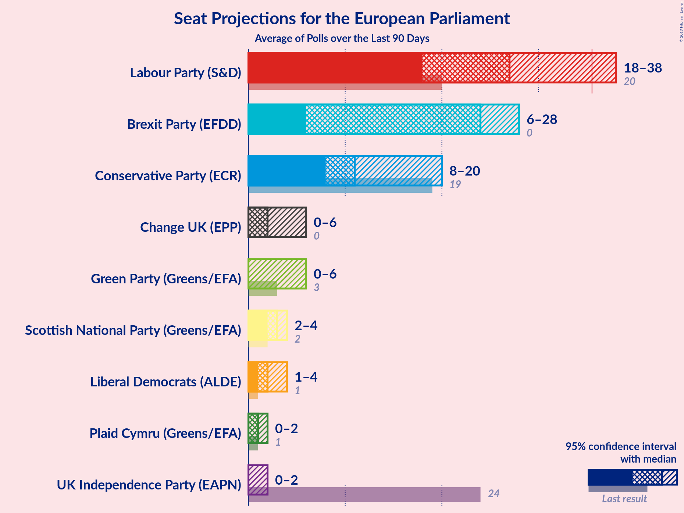
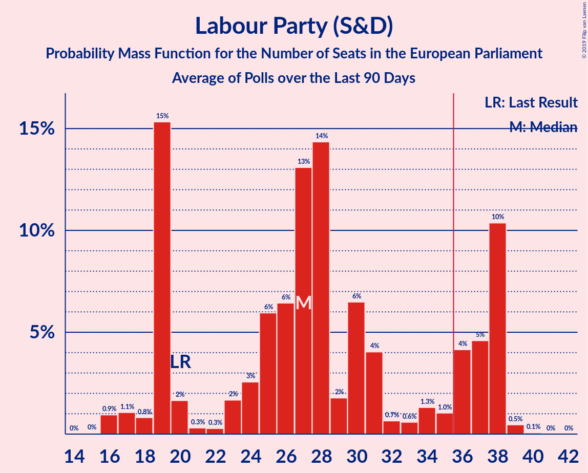
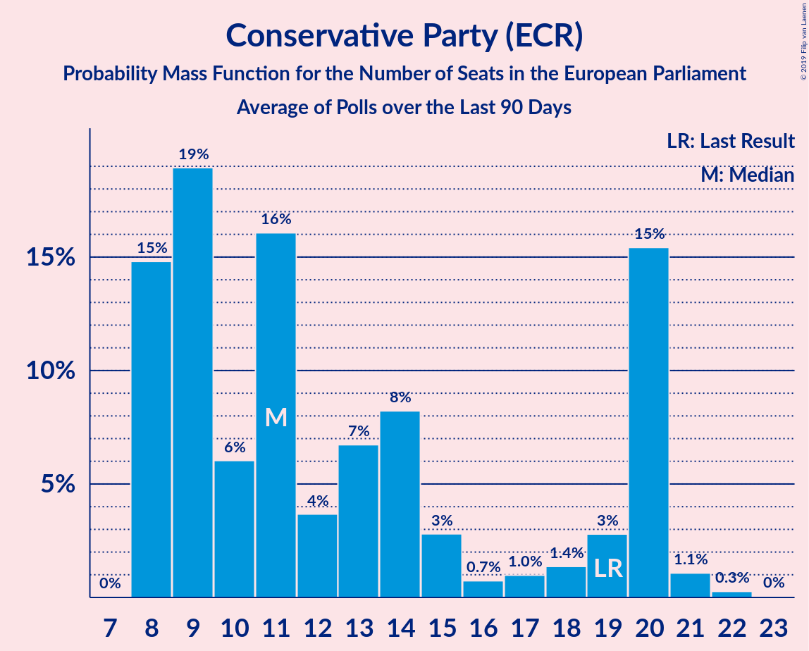
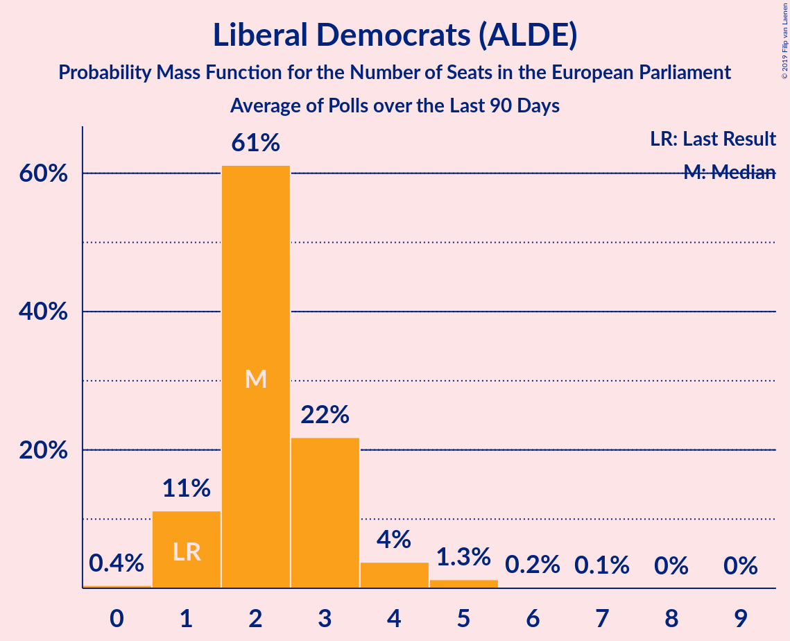
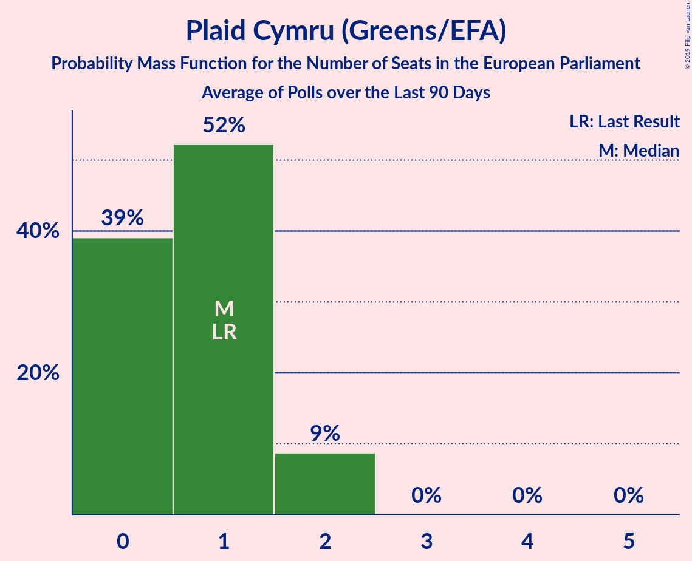
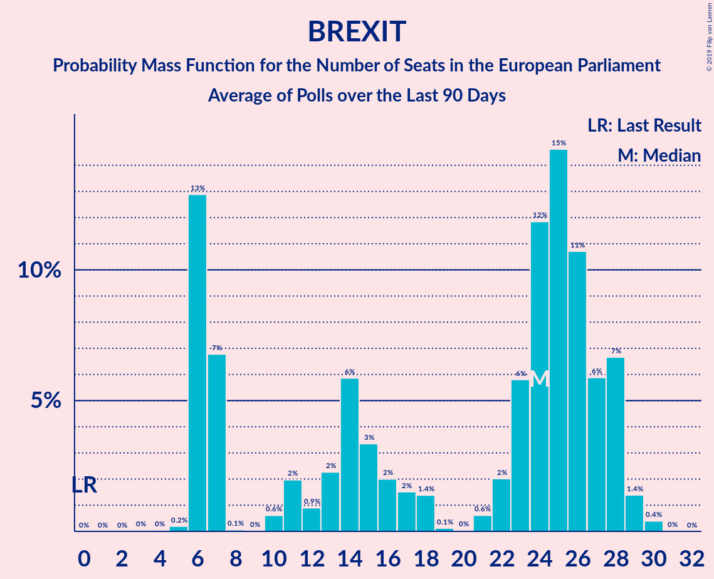
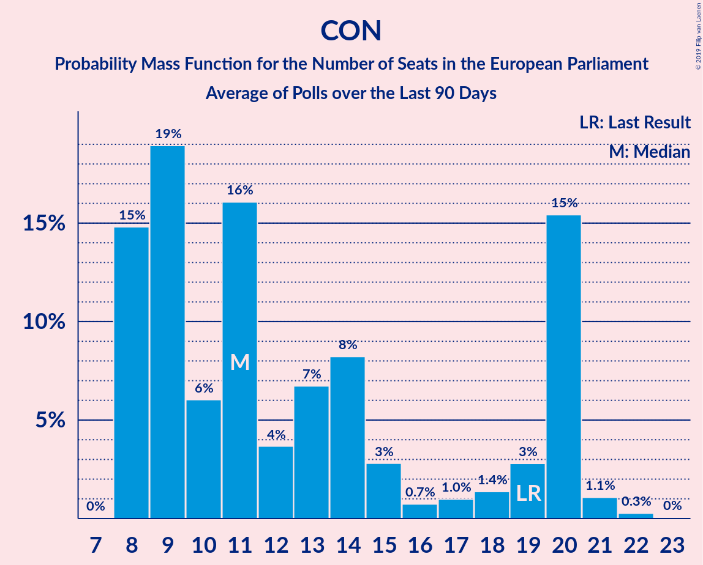
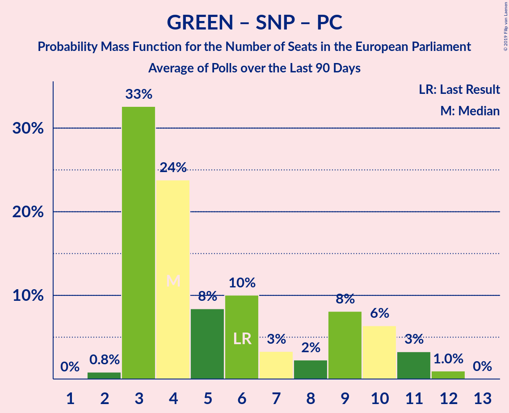
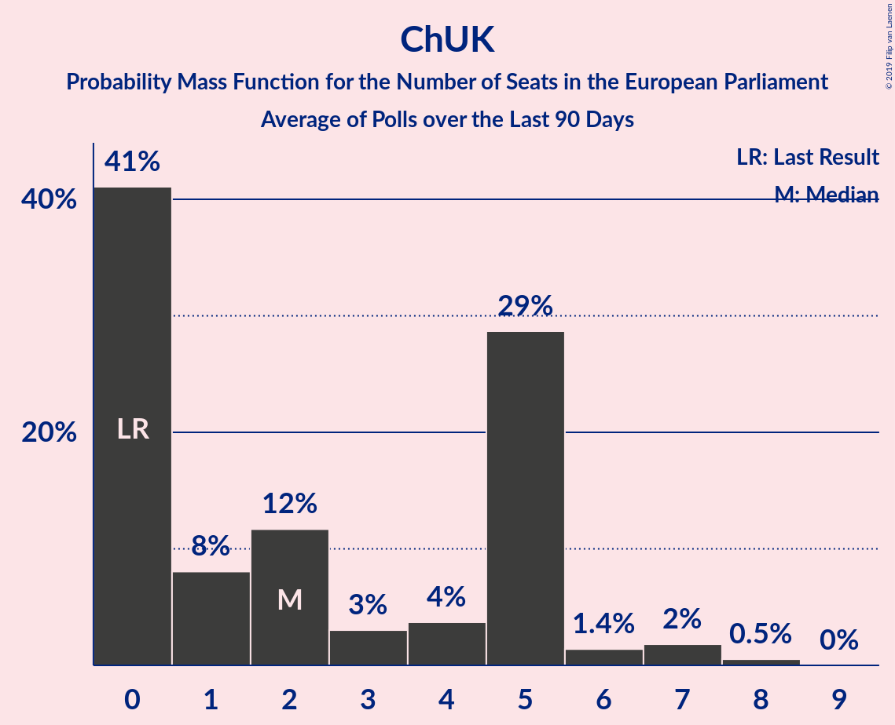
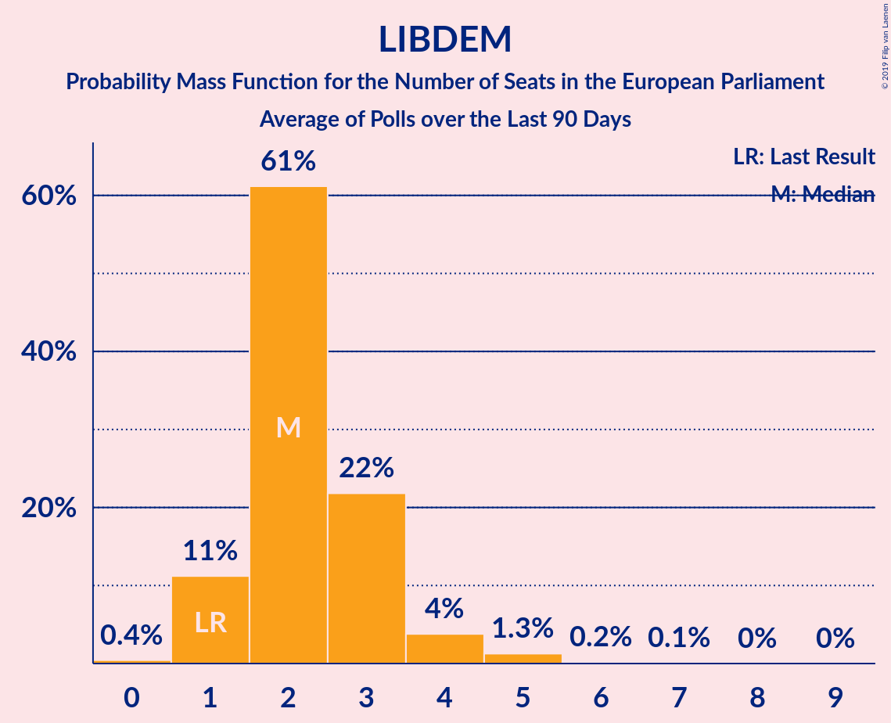

# Poll Average

<a href="#voting-intentions">Voting Intentions</a> | <a href="#seats">Seats</a> | <a href="#coalitions">Coalitions</a> | <a href="#technical-information">Technical Information</a>

## Summary

The table below lists the polls on which the average is based. They are the most recent polls (less than 90 days old) registered and analyzed so far.

| Period     | Polling firm/Commissioner(s) | UKIP | LAB | CON | GREEN | LIBDEM | SNP | PC | BREXIT | ChUK |
|:----------:|:----------------------------:|:--:|:--:|:--:|:--:|:--:|:--:|:--:|:--:|:--:|
| 22 May 2014 | General Election | 26.6%   24 | 24.4%   20 | 23.1%   19 | 6.9%   3 | 6.6%   1 | 2.4%   2 | 0.7%   1 | 0.0%   0 | 0.0%   0 |
| N/A | Poll Average | 2–8%   0–2 | 21–40%   23–38 | 12–24%   8–20 | 3–10%   0–1 | 6–10%   1–4 | 3–6%   2–4 | 0–2%   0–2 | 9–30%   6–27 | 3–11%   0–5 |
| [17–25 April 2019](2019-04-25-Survation.html) | Survation | 6–8%   0–3 | 25–29%   23–28 | 14–18%   9–14 | 3–5%   0 | 7–9%   2–4 | 2–4%   2–3 | 1–2%   1–2 | 25–29%   22–27 | 3–5%   0 |
| [23–25 April 2019](2019-04-25-Opinium.html) | Opinium | 2–4%   0 | 25–31%   23–28 | 12–16%   8–11 | 5–8%   0–3 | 6–9%   1–4 | 4–6%   3–5 | 1–2%   0–2 | 25–31%   22–28 | 6–9%   0–3 |
| [23–24 April 2019](2019-04-24-YouGov.html) | YouGov | 4–6%   N/A | 21–23%   N/A | 12–14%   N/A | 9–11%   N/A | 6–8%   N/A | 3–4%   N/A | 1%   N/A | 27–29%   N/A | 9–11%   N/A |
| [16 April 2019](2019-04-16-ComRes.html) | ComRes   Brexit Express | 4–6%   0–1 | 30–36%   27–35 | 16–20%   12–18 | 4–6%   0–1 | 7–11%   2–5 | 3–5%   3–4 | 0–1%   0–1 | 15–19%   10–18 | 7–11%   2–7 |
| [5–8 April 2019](2019-04-08-HanburyStrategy.html) | Hanbury Strategy   Open Europe | 6–8%   1–2 | 36–40%   35–39 | 21–25%   18–21 | 3–5%   0 | 7–9%   2–3 | 3–5%   2–3 | 0–1%   0 | 9–12%   6–7 | 3–5%   0 |
| 22 May 2014 | General Election | 26.6%   24 | 24.4%   20 | 23.1%   19 | 6.9%   3 | 6.6%   1 | 2.4%   2 | 0.7%   1 | 0.0%   0 | 0.0%   0 |

Only polls for which at least the sample size has been published are included in the table above.

**Legend:**
+ **Top half of each row:** Voting intentions (95% confidence interval)
+ **Bottom half of each row:** Seat projections for the European Parliament (95% confidence interval)
+ **UKIP:** UK Independence Party (EAPN)
+ **LAB:** Labour Party (S&D)
+ **CON:** Conservative Party (ECR)
+ **GREEN:** Green Party (Greens/EFA)
+ **LIBDEM:** Liberal Democrats (ALDE)
+ **SNP:** Scottish National Party (Greens/EFA)
+ **PC:** Plaid Cymru (Greens/EFA)
+ **BREXIT:** Brexit Party (EFDD)
+ **ChUK:** Change UK (EPP)
+ **N/A (single party):** Party not included the published results
+ **N/A (entire row):** Calculation for this opinion poll not started yet

## Voting Intentions

### Confidence Intervals

| Party | Last Result | Median | 80% Confidence Interval | 90% Confidence Interval | 95% Confidence Interval | 99% Confidence Interval |
|:-----:|:-----------:|:------:|:-----------------------:|:-----------------------:|:-----------------------:|:-----------------------:|
| <a href="#uk-independence-party-(eapn)">UK Independence Party (EAPN)</a> | 26.6% | 5.3% | 3.1–7.4% |2.7–7.7% | 2.5–7.9% | 2.1–8.4% |
| <a href="#labour-party-(s&d)">Labour Party (S&D)</a> | 24.4% | 28.3% | 22.0–38.3% |21.7–39.0% | 21.4–39.6% | 20.9–40.5% |
| <a href="#conservative-party-(ecr)">Conservative Party (ECR)</a> | 23.1% | 15.9% | 12.9–23.2% |12.6–23.8% | 12.4–24.3% | 11.9–25.0% |
| <a href="#green-party-(greens/efa)">Green Party (Greens/EFA)</a> | 6.9% | 5.0% | 3.7–10.0% |3.5–10.3% | 3.4–10.5% | 3.1–10.8% |
| <a href="#liberal-democrats-(alde)">Liberal Democrats (ALDE)</a> | 6.6% | 7.8% | 6.7–9.2% |6.4–9.6% | 6.2–10.1% | 5.6–10.8% |
| <a href="#scottish-national-party-(greens/efa)">Scottish National Party (Greens/EFA)</a> | 2.4% | 4.0% | 2.9–5.1% |2.7–5.5% | 2.6–5.9% | 2.3–6.5% |
| <a href="#plaid-cymru-(greens/efa)">Plaid Cymru (Greens/EFA)</a> | 0.7% | 0.9% | 0.2–1.3% |0.2–1.4% | 0.1–1.5% | 0.1–1.8% |
| <a href="#brexit-party-(efdd)">Brexit Party (EFDD)</a> | 0.0% | 26.4% | 10.1–28.7% |9.7–29.2% | 9.4–29.7% | 8.9–30.9% |
| <a href="#change-uk-(epp)">Change UK (EPP)</a> | 0.0% | 7.1% | 3.7–10.1% |3.5–10.4% | 3.4–10.6% | 3.1–11.0% |

### UK Independence Party (EAPN)

*For a full overview of the results for this party, see the [UK Independence Party (EAPN)](party-ukindependencepartyeapn.html) page.*

| Voting Intentions | Probability | Accumulated | Special Marks |
|:-----------------:|:-----------:|:-----------:|:-------------:|
| 0.5–1.5% | 0% | 100% |  |
| 1.5–2.5% | 3% | 100% |  |
| 2.5–3.5% | 13% | 97% |  |
| 3.5–4.5% | 10% | 84% |  |
| 4.5–5.5% | 29% | 74% | Median |
| 5.5–6.5% | 13% | 46% |  |
| 6.5–7.5% | 25% | 32% |  |
| 7.5–8.5% | 7% | 8% |  |
| 8.5–9.5% | 0.3% | 0.3% |  |
| 9.5–10.5% | 0% | 0% |  |
| 10.5–11.5% | 0% | 0% |  |
| 11.5–12.5% | 0% | 0% |  |
| 12.5–13.5% | 0% | 0% |  |
| 13.5–14.5% | 0% | 0% |  |
| 14.5–15.5% | 0% | 0% |  |
| 15.5–16.5% | 0% | 0% |  |
| 16.5–17.5% | 0% | 0% |  |
| 17.5–18.5% | 0% | 0% |  |
| 18.5–19.5% | 0% | 0% |  |
| 19.5–20.5% | 0% | 0% |  |
| 20.5–21.5% | 0% | 0% |  |
| 21.5–22.5% | 0% | 0% |  |
| 22.5–23.5% | 0% | 0% |  |
| 23.5–24.5% | 0% | 0% |  |
| 24.5–25.5% | 0% | 0% |  |
| 25.5–26.5% | 0% | 0% |  |
| 26.5–27.5% | 0% | 0% | Last Result |

### Labour Party (S&D)

*For a full overview of the results for this party, see the [Labour Party (S&D)](party-labourpartysd.html) page.*

| Voting Intentions | Probability | Accumulated | Special Marks |
|:-----------------:|:-----------:|:-----------:|:-------------:|
| 19.5–20.5% | 0.1% | 100% |  |
| 20.5–21.5% | 4% | 99.9% |  |
| 21.5–22.5% | 13% | 96% |  |
| 22.5–23.5% | 3% | 84% |  |
| 23.5–24.5% | 0.4% | 80% | Last Result |
| 24.5–25.5% | 3% | 80% |  |
| 25.5–26.5% | 8% | 77% |  |
| 26.5–27.5% | 12% | 69% |  |
| 27.5–28.5% | 9% | 57% | Median |
| 28.5–29.5% | 5% | 48% |  |
| 29.5–30.5% | 3% | 43% |  |
| 30.5–31.5% | 3% | 40% |  |
| 31.5–32.5% | 5% | 36% |  |
| 32.5–33.5% | 5% | 31% |  |
| 33.5–34.5% | 4% | 26% |  |
| 34.5–35.5% | 2% | 22% |  |
| 35.5–36.5% | 1.4% | 21% |  |
| 36.5–37.5% | 4% | 19% |  |
| 37.5–38.5% | 7% | 15% |  |
| 38.5–39.5% | 6% | 8% |  |
| 39.5–40.5% | 2% | 3% |  |
| 40.5–41.5% | 0.4% | 0.4% |  |
| 41.5–42.5% | 0% | 0% |  |

### Conservative Party (ECR)

*For a full overview of the results for this party, see the [Conservative Party (ECR)](party-conservativepartyecr.html) page.*

| Voting Intentions | Probability | Accumulated | Special Marks |
|:-----------------:|:-----------:|:-----------:|:-------------:|
| 9.5–10.5% | 0% | 100% |  |
| 10.5–11.5% | 0.2% | 100% |  |
| 11.5–12.5% | 4% | 99.8% |  |
| 12.5–13.5% | 20% | 96% |  |
| 13.5–14.5% | 11% | 76% |  |
| 14.5–15.5% | 11% | 65% |  |
| 15.5–16.5% | 12% | 55% | Median |
| 16.5–17.5% | 9% | 42% |  |
| 17.5–18.5% | 7% | 33% |  |
| 18.5–19.5% | 4% | 26% |  |
| 19.5–20.5% | 2% | 22% |  |
| 20.5–21.5% | 1.1% | 20% |  |
| 21.5–22.5% | 4% | 19% |  |
| 22.5–23.5% | 8% | 15% | Last Result |
| 23.5–24.5% | 5% | 7% |  |
| 24.5–25.5% | 1.3% | 1.5% |  |
| 25.5–26.5% | 0.1% | 0.1% |  |
| 26.5–27.5% | 0% | 0% |  |

### Green Party (Greens/EFA)

*For a full overview of the results for this party, see the [Green Party (Greens/EFA)](party-greenpartygreensefa.html) page.*

| Voting Intentions | Probability | Accumulated | Special Marks |
|:-----------------:|:-----------:|:-----------:|:-------------:|
| 1.5–2.5% | 0% | 100% |  |
| 2.5–3.5% | 5% | 100% |  |
| 3.5–4.5% | 34% | 95% |  |
| 4.5–5.5% | 21% | 60% | Median |
| 5.5–6.5% | 14% | 40% |  |
| 6.5–7.5% | 5% | 25% | Last Result |
| 7.5–8.5% | 0.5% | 21% |  |
| 8.5–9.5% | 3% | 20% |  |
| 9.5–10.5% | 16% | 17% |  |
| 10.5–11.5% | 2% | 2% |  |
| 11.5–12.5% | 0% | 0% |  |

### Liberal Democrats (ALDE)

*For a full overview of the results for this party, see the [Liberal Democrats (ALDE)](party-liberaldemocratsalde.html) page.*

| Voting Intentions | Probability | Accumulated | Special Marks |
|:-----------------:|:-----------:|:-----------:|:-------------:|
| 3.5–4.5% | 0% | 100% |  |
| 4.5–5.5% | 0.4% | 100% |  |
| 5.5–6.5% | 6% | 99.6% |  |
| 6.5–7.5% | 36% | 93% | Last Result |
| 7.5–8.5% | 35% | 57% | Median |
| 8.5–9.5% | 17% | 22% |  |
| 9.5–10.5% | 5% | 6% |  |
| 10.5–11.5% | 0.9% | 0.9% |  |
| 11.5–12.5% | 0.1% | 0.1% |  |
| 12.5–13.5% | 0% | 0% |  |

### Scottish National Party (Greens/EFA)

*For a full overview of the results for this party, see the [Scottish National Party (Greens/EFA)](party-scottishnationalpartygreensefa.html) page.*

| Voting Intentions | Probability | Accumulated | Special Marks |
|:-----------------:|:-----------:|:-----------:|:-------------:|
| 0.5–1.5% | 0% | 100% |  |
| 1.5–2.5% | 2% | 100% | Last Result |
| 2.5–3.5% | 25% | 98% |  |
| 3.5–4.5% | 51% | 73% | Median |
| 4.5–5.5% | 17% | 22% |  |
| 5.5–6.5% | 5% | 5% |  |
| 6.5–7.5% | 0.4% | 0.4% |  |
| 7.5–8.5% | 0% | 0% |  |

### Plaid Cymru (Greens/EFA)

*For a full overview of the results for this party, see the [Plaid Cymru (Greens/EFA)](party-plaidcymrugreensefa.html) page.*

| Voting Intentions | Probability | Accumulated | Special Marks |
|:-----------------:|:-----------:|:-----------:|:-------------:|
| 0.0–0.5% | 37% | 100% |  |
| 0.5–1.5% | 61% | 63% | Last Result, Median |
| 1.5–2.5% | 2% | 2% |  |
| 2.5–3.5% | 0% | 0% |  |

### Brexit Party (EFDD)

*For a full overview of the results for this party, see the [Brexit Party (EFDD)](party-brexitpartyefdd.html) page.*

| Voting Intentions | Probability | Accumulated | Special Marks |
|:-----------------:|:-----------:|:-----------:|:-------------:|
| 0.0–0.5% | 0% | 100% | Last Result |
| 0.5–1.5% | 0% | 100% |  |
| 1.5–2.5% | 0% | 100% |  |
| 2.5–3.5% | 0% | 100% |  |
| 3.5–4.5% | 0% | 100% |  |
| 4.5–5.5% | 0% | 100% |  |
| 5.5–6.5% | 0% | 100% |  |
| 6.5–7.5% | 0% | 100% |  |
| 7.5–8.5% | 0.1% | 100% |  |
| 8.5–9.5% | 4% | 99.9% |  |
| 9.5–10.5% | 11% | 96% |  |
| 10.5–11.5% | 5% | 85% |  |
| 11.5–12.5% | 0.4% | 80% |  |
| 12.5–13.5% | 0% | 80% |  |
| 13.5–14.5% | 0.3% | 80% |  |
| 14.5–15.5% | 2% | 80% |  |
| 15.5–16.5% | 5% | 78% |  |
| 16.5–17.5% | 7% | 72% |  |
| 17.5–18.5% | 4% | 66% |  |
| 18.5–19.5% | 1.4% | 62% |  |
| 19.5–20.5% | 0.2% | 60% |  |
| 20.5–21.5% | 0% | 60% |  |
| 21.5–22.5% | 0% | 60% |  |
| 22.5–23.5% | 0% | 60% |  |
| 23.5–24.5% | 0.3% | 60% |  |
| 24.5–25.5% | 3% | 60% |  |
| 25.5–26.5% | 9% | 57% | Median |
| 26.5–27.5% | 16% | 48% |  |
| 27.5–28.5% | 20% | 32% |  |
| 28.5–29.5% | 9% | 12% |  |
| 29.5–30.5% | 2% | 3% |  |
| 30.5–31.5% | 0.7% | 0.8% |  |
| 31.5–32.5% | 0.1% | 0.1% |  |
| 32.5–33.5% | 0% | 0% |  |

### Change UK (EPP)

*For a full overview of the results for this party, see the [Change UK (EPP)](party-changeukepp.html) page.*

| Voting Intentions | Probability | Accumulated | Special Marks |
|:-----------------:|:-----------:|:-----------:|:-------------:|
| 0.0–0.5% | 0% | 100% | Last Result |
| 0.5–1.5% | 0% | 100% |  |
| 1.5–2.5% | 0% | 100% |  |
| 2.5–3.5% | 5% | 100% |  |
| 3.5–4.5% | 30% | 95% |  |
| 4.5–5.5% | 5% | 65% |  |
| 5.5–6.5% | 5% | 60% |  |
| 6.5–7.5% | 10% | 55% | Median |
| 7.5–8.5% | 10% | 45% |  |
| 8.5–9.5% | 12% | 35% |  |
| 9.5–10.5% | 20% | 23% |  |
| 10.5–11.5% | 3% | 3% |  |
| 11.5–12.5% | 0.1% | 0.1% |  |
| 12.5–13.5% | 0% | 0% |  |

## Seats

### Confidence Intervals

| Party | Last Result | Median | 80% Confidence Interval | 90% Confidence Interval | 95% Confidence Interval | 99% Confidence Interval |
|:-----:|:-----------:|:------:|:-----------------------:|:-----------------------:|:-----------------------:|:-----------------------:|
| <a href="#uk-independence-party-(eapn)">UK Independence Party (EAPN)</a> | 24 | 1 | 0–2 |0–2 | 0–2 | 0–3 |
| <a href="#labour-party-(s&d)">Labour Party (S&D)</a> | 20 | 28 | 25–38 |24–38 | 23–38 | 22–39 |
| <a href="#conservative-party-(ecr)">Conservative Party (ECR)</a> | 19 | 13 | 9–20 |8–20 | 8–20 | 8–21 |
| <a href="#green-party-(greens/efa)">Green Party (Greens/EFA)</a> | 3 | 0 | 0–1 |0–1 | 0–1 | 0–3 |
| <a href="#liberal-democrats-(alde)">Liberal Democrats (ALDE)</a> | 1 | 2 | 2–3 |2–4 | 1–4 | 0–5 |
| <a href="#scottish-national-party-(greens/efa)">Scottish National Party (Greens/EFA)</a> | 2 | 3 | 3–4 |2–4 | 2–4 | 2–5 |
| <a href="#plaid-cymru-(greens/efa)">Plaid Cymru (Greens/EFA)</a> | 1 | 1 | 0–1 |0–2 | 0–2 | 0–2 |
| <a href="#brexit-party-(efdd)">Brexit Party (EFDD)</a> | 0 | 19 | 6–26 |6–27 | 6–27 | 6–28 |
| <a href="#change-uk-(epp)">Change UK (EPP)</a> | 0 | 0 | 0–5 |0–5 | 0–5 | 0–7 |

### UK Independence Party (EAPN)

*For a full overview of the results for this party, see the [UK Independence Party (EAPN)](party-ukindependencepartyeapn.html) page.*

| Number of Seats | Probability | Accumulated | Special Marks |
|:---------------:|:-----------:|:-----------:|:-------------:|
| 0 | 46% | 100% |  |
| 1 | 36% | 54% | Median |
| 2 | 17% | 18% |  |
| 3 | 0.9% | 1.1% |  |
| 4 | 0.2% | 0.3% |  |
| 5 | 0% | 0.1% |  |
| 6 | 0% | 0% |  |
| 7 | 0% | 0% |  |
| 8 | 0% | 0% |  |
| 9 | 0% | 0% |  |
| 10 | 0% | 0% |  |
| 11 | 0% | 0% |  |
| 12 | 0% | 0% |  |
| 13 | 0% | 0% |  |
| 14 | 0% | 0% |  |
| 15 | 0% | 0% |  |
| 16 | 0% | 0% |  |
| 17 | 0% | 0% |  |
| 18 | 0% | 0% |  |
| 19 | 0% | 0% |  |
| 20 | 0% | 0% |  |
| 21 | 0% | 0% |  |
| 22 | 0% | 0% |  |
| 23 | 0% | 0% |  |
| 24 | 0% | 0% | Last Result |

### Labour Party (S&D)

*For a full overview of the results for this party, see the [Labour Party (S&D)](party-labourpartysd.html) page.*

| Number of Seats | Probability | Accumulated | Special Marks |
|:---------------:|:-----------:|:-----------:|:-------------:|
| 20 | 0% | 100% | Last Result |
| 21 | 0.1% | 99.9% |  |
| 22 | 0.3% | 99.8% |  |
| 23 | 2% | 99.5% |  |
| 24 | 3% | 97% |  |
| 25 | 7% | 94% |  |
| 26 | 8% | 87% |  |
| 27 | 16% | 79% |  |
| 28 | 18% | 62% | Median |
| 29 | 2% | 44% |  |
| 30 | 8% | 42% |  |
| 31 | 5% | 34% |  |
| 32 | 0.8% | 29% |  |
| 33 | 0.7% | 28% |  |
| 34 | 2% | 27% |  |
| 35 | 1.3% | 26% |  |
| 36 | 5% | 25% | Majority |
| 37 | 6% | 19% |  |
| 38 | 13% | 14% |  |
| 39 | 0.6% | 0.7% |  |
| 40 | 0.1% | 0.1% |  |
| 41 | 0% | 0% |  |

### Conservative Party (ECR)

*For a full overview of the results for this party, see the [Conservative Party (ECR)](party-conservativepartyecr.html) page.*

| Number of Seats | Probability | Accumulated | Special Marks |
|:---------------:|:-----------:|:-----------:|:-------------:|
| 8 | 6% | 100% |  |
| 9 | 12% | 94% |  |
| 10 | 7% | 83% |  |
| 11 | 20% | 75% |  |
| 12 | 5% | 55% |  |
| 13 | 8% | 51% | Median |
| 14 | 10% | 42% |  |
| 15 | 4% | 32% |  |
| 16 | 0.9% | 28% |  |
| 17 | 1.2% | 27% |  |
| 18 | 2% | 26% |  |
| 19 | 3% | 25% | Last Result |
| 20 | 19% | 21% |  |
| 21 | 1.3% | 2% |  |
| 22 | 0.3% | 0.4% |  |
| 23 | 0.1% | 0.1% |  |
| 24 | 0% | 0% |  |

### Green Party (Greens/EFA)

*For a full overview of the results for this party, see the [Green Party (Greens/EFA)](party-greenpartygreensefa.html) page.*

| Number of Seats | Probability | Accumulated | Special Marks |
|:---------------:|:-----------:|:-----------:|:-------------:|
| 0 | 80% | 100% | Median |
| 1 | 17% | 20% |  |
| 2 | 2% | 2% |  |
| 3 | 0.6% | 0.8% | Last Result |
| 4 | 0.2% | 0.2% |  |
| 5 | 0% | 0% |  |

### Liberal Democrats (ALDE)

*For a full overview of the results for this party, see the [Liberal Democrats (ALDE)](party-liberaldemocratsalde.html) page.*

| Number of Seats | Probability | Accumulated | Special Marks |
|:---------------:|:-----------:|:-----------:|:-------------:|
| 0 | 0.5% | 100% |  |
| 1 | 2% | 99.5% | Last Result |
| 2 | 63% | 97% | Median |
| 3 | 27% | 34% |  |
| 4 | 5% | 7% |  |
| 5 | 2% | 2% |  |
| 6 | 0.2% | 0.4% |  |
| 7 | 0.1% | 0.2% |  |
| 8 | 0% | 0.1% |  |
| 9 | 0% | 0% |  |

### Scottish National Party (Greens/EFA)

*For a full overview of the results for this party, see the [Scottish National Party (Greens/EFA)](party-scottishnationalpartygreensefa.html) page.*

| Number of Seats | Probability | Accumulated | Special Marks |
|:---------------:|:-----------:|:-----------:|:-------------:|
| 2 | 7% | 100% | Last Result |
| 3 | 57% | 93% | Median |
| 4 | 33% | 36% |  |
| 5 | 2% | 2% |  |
| 6 | 0% | 0% |  |

### Plaid Cymru (Greens/EFA)

*For a full overview of the results for this party, see the [Plaid Cymru (Greens/EFA)](party-plaidcymrugreensefa.html) page.*

| Number of Seats | Probability | Accumulated | Special Marks |
|:---------------:|:-----------:|:-----------:|:-------------:|
| 0 | 49% | 100% |  |
| 1 | 45% | 51% | Last Result, Median |
| 2 | 6% | 6% |  |
| 3 | 0% | 0% |  |

### Brexit Party (EFDD)

*For a full overview of the results for this party, see the [Brexit Party (EFDD)](party-brexitpartyefdd.html) page.*

| Number of Seats | Probability | Accumulated | Special Marks |
|:---------------:|:-----------:|:-----------:|:-------------:|
| 0 | 0% | 100% | Last Result |
| 1 | 0% | 100% |  |
| 2 | 0% | 100% |  |
| 3 | 0% | 100% |  |
| 4 | 0.1% | 100% |  |
| 5 | 0.2% | 99.9% |  |
| 6 | 16% | 99.7% |  |
| 7 | 8% | 84% |  |
| 8 | 0.1% | 75% |  |
| 9 | 0% | 75% |  |
| 10 | 0.8% | 75% |  |
| 11 | 2% | 74% |  |
| 12 | 1.1% | 72% |  |
| 13 | 3% | 71% |  |
| 14 | 7% | 68% |  |
| 15 | 4% | 60% |  |
| 16 | 2% | 56% |  |
| 17 | 2% | 54% |  |
| 18 | 2% | 52% |  |
| 19 | 0.2% | 50% | Median |
| 20 | 0% | 50% |  |
| 21 | 0.8% | 50% |  |
| 22 | 2% | 49% |  |
| 23 | 6% | 47% |  |
| 24 | 13% | 41% |  |
| 25 | 11% | 28% |  |
| 26 | 9% | 16% |  |
| 27 | 5% | 7% |  |
| 28 | 2% | 2% |  |
| 29 | 0.2% | 0.4% |  |
| 30 | 0.1% | 0.1% |  |
| 31 | 0% | 0% |  |

### Change UK (EPP)

*For a full overview of the results for this party, see the [Change UK (EPP)](party-changeukepp.html) page.*

| Number of Seats | Probability | Accumulated | Special Marks |
|:---------------:|:-----------:|:-----------:|:-------------:|
| 0 | 51% | 100% | Last Result, Median |
| 1 | 10% | 49% |  |
| 2 | 15% | 39% |  |
| 3 | 4% | 24% |  |
| 4 | 4% | 20% |  |
| 5 | 15% | 17% |  |
| 6 | 1.2% | 2% |  |
| 7 | 0.9% | 0.9% |  |
| 8 | 0% | 0% |  |

## Coalitions

### Confidence Intervals

| Coalition | Last Result | Median | Majority? | 80% Confidence Interval | 90% Confidence Interval | 95% Confidence Interval | 99% Confidence Interval |
|:---------:|:-----------:|:------:|:---------:|:-----------------------:|:-----------------------:|:-----------------------:|:-----------------------:|
| Labour Party (S&D) | 20 | 28 | 25% | 25–38 | 24–38 | 23–38 | 22–39 |
| Brexit Party (EFDD) | 0 | 19 | 0% | 6–26 | 6–27 | 6–27 | 6–28 |
| Conservative Party (ECR) | 19 | 13 | 0% | 9–20 | 8–20 | 8–20 | 8–21 |
| Green Party (Greens/EFA) – Scottish National Party (Greens/EFA) – Plaid Cymru (Greens/EFA) | 6 | 4 | 0% | 3–6 | 3–7 | 3–7 | 2–8 |
| Change UK (EPP) | 0 | 0 | 0% | 0–5 | 0–5 | 0–5 | 0–7 |
| Liberal Democrats (ALDE) | 1 | 2 | 0% | 2–3 | 2–4 | 1–4 | 0–5 |
| UK Independence Party (EAPN) | 24 | 1 | 0% | 0–2 | 0–2 | 0–2 | 0–3 |

### Labour Party (S&D)

| Number of Seats | Probability | Accumulated | Special Marks |
|:---------------:|:-----------:|:-----------:|:-------------:|
| 20 | 0% | 100% | Last Result |
| 21 | 0.1% | 99.9% |  |
| 22 | 0.3% | 99.8% |  |
| 23 | 2% | 99.5% |  |
| 24 | 3% | 97% |  |
| 25 | 7% | 94% |  |
| 26 | 8% | 87% |  |
| 27 | 16% | 79% |  |
| 28 | 18% | 62% | Median |
| 29 | 2% | 44% |  |
| 30 | 8% | 42% |  |
| 31 | 5% | 34% |  |
| 32 | 0.8% | 29% |  |
| 33 | 0.7% | 28% |  |
| 34 | 2% | 27% |  |
| 35 | 1.3% | 26% |  |
| 36 | 5% | 25% | Majority |
| 37 | 6% | 19% |  |
| 38 | 13% | 14% |  |
| 39 | 0.6% | 0.7% |  |
| 40 | 0.1% | 0.1% |  |
| 41 | 0% | 0% |  |

### Brexit Party (EFDD)

| Number of Seats | Probability | Accumulated | Special Marks |
|:---------------:|:-----------:|:-----------:|:-------------:|
| 0 | 0% | 100% | Last Result |
| 1 | 0% | 100% |  |
| 2 | 0% | 100% |  |
| 3 | 0% | 100% |  |
| 4 | 0.1% | 100% |  |
| 5 | 0.2% | 99.9% |  |
| 6 | 16% | 99.7% |  |
| 7 | 8% | 84% |  |
| 8 | 0.1% | 75% |  |
| 9 | 0% | 75% |  |
| 10 | 0.8% | 75% |  |
| 11 | 2% | 74% |  |
| 12 | 1.1% | 72% |  |
| 13 | 3% | 71% |  |
| 14 | 7% | 68% |  |
| 15 | 4% | 60% |  |
| 16 | 2% | 56% |  |
| 17 | 2% | 54% |  |
| 18 | 2% | 52% |  |
| 19 | 0.2% | 50% | Median |
| 20 | 0% | 50% |  |
| 21 | 0.8% | 50% |  |
| 22 | 2% | 49% |  |
| 23 | 6% | 47% |  |
| 24 | 13% | 41% |  |
| 25 | 11% | 28% |  |
| 26 | 9% | 16% |  |
| 27 | 5% | 7% |  |
| 28 | 2% | 2% |  |
| 29 | 0.2% | 0.4% |  |
| 30 | 0.1% | 0.1% |  |
| 31 | 0% | 0% |  |

### Conservative Party (ECR)

| Number of Seats | Probability | Accumulated | Special Marks |
|:---------------:|:-----------:|:-----------:|:-------------:|
| 8 | 6% | 100% |  |
| 9 | 12% | 94% |  |
| 10 | 7% | 83% |  |
| 11 | 20% | 75% |  |
| 12 | 5% | 55% |  |
| 13 | 8% | 51% | Median |
| 14 | 10% | 42% |  |
| 15 | 4% | 32% |  |
| 16 | 0.9% | 28% |  |
| 17 | 1.2% | 27% |  |
| 18 | 2% | 26% |  |
| 19 | 3% | 25% | Last Result |
| 20 | 19% | 21% |  |
| 21 | 1.3% | 2% |  |
| 22 | 0.3% | 0.4% |  |
| 23 | 0.1% | 0.1% |  |
| 24 | 0% | 0% |  |

### Green Party (Greens/EFA) – Scottish National Party (Greens/EFA) – Plaid Cymru (Greens/EFA)

| Number of Seats | Probability | Accumulated | Special Marks |
|:---------------:|:-----------:|:-----------:|:-------------:|
| 2 | 1.0% | 100% |  |
| 3 | 41% | 99.0% |  |
| 4 | 30% | 58% | Median |
| 5 | 11% | 28% |  |
| 6 | 13% | 18% | Last Result |
| 7 | 4% | 5% |  |
| 8 | 0.9% | 1.3% |  |
| 9 | 0.3% | 0.4% |  |
| 10 | 0% | 0% |  |

### Change UK (EPP)

| Number of Seats | Probability | Accumulated | Special Marks |
|:---------------:|:-----------:|:-----------:|:-------------:|
| 0 | 51% | 100% | Last Result, Median |
| 1 | 10% | 49% |  |
| 2 | 15% | 39% |  |
| 3 | 4% | 24% |  |
| 4 | 4% | 20% |  |
| 5 | 15% | 17% |  |
| 6 | 1.2% | 2% |  |
| 7 | 0.9% | 0.9% |  |
| 8 | 0% | 0% |  |

### Liberal Democrats (ALDE)

| Number of Seats | Probability | Accumulated | Special Marks |
|:---------------:|:-----------:|:-----------:|:-------------:|
| 0 | 0.5% | 100% |  |
| 1 | 2% | 99.5% | Last Result |
| 2 | 63% | 97% | Median |
| 3 | 27% | 34% |  |
| 4 | 5% | 7% |  |
| 5 | 2% | 2% |  |
| 6 | 0.2% | 0.4% |  |
| 7 | 0.1% | 0.2% |  |
| 8 | 0% | 0.1% |  |
| 9 | 0% | 0% |  |

### UK Independence Party (EAPN)

| Number of Seats | Probability | Accumulated | Special Marks |
|:---------------:|:-----------:|:-----------:|:-------------:|
| 0 | 46% | 100% |  |
| 1 | 36% | 54% | Median |
| 2 | 17% | 18% |  |
| 3 | 0.9% | 1.1% |  |
| 4 | 0.2% | 0.3% |  |
| 5 | 0% | 0.1% |  |
| 6 | 0% | 0% |  |
| 7 | 0% | 0% |  |
| 8 | 0% | 0% |  |
| 9 | 0% | 0% |  |
| 10 | 0% | 0% |  |
| 11 | 0% | 0% |  |
| 12 | 0% | 0% |  |
| 13 | 0% | 0% |  |
| 14 | 0% | 0% |  |
| 15 | 0% | 0% |  |
| 16 | 0% | 0% |  |
| 17 | 0% | 0% |  |
| 18 | 0% | 0% |  |
| 19 | 0% | 0% |  |
| 20 | 0% | 0% |  |
| 21 | 0% | 0% |  |
| 22 | 0% | 0% |  |
| 23 | 0% | 0% |  |
| 24 | 0% | 0% | Last Result |

## Technical Information

+ **Number of polls included in this average:** 5
+ **Lowest number of simulations done in a poll included in this average:** 0
+ **Total number of simulations done in the polls included in this average:** 4,194,304
+ **Error estimate:** 1.89%
