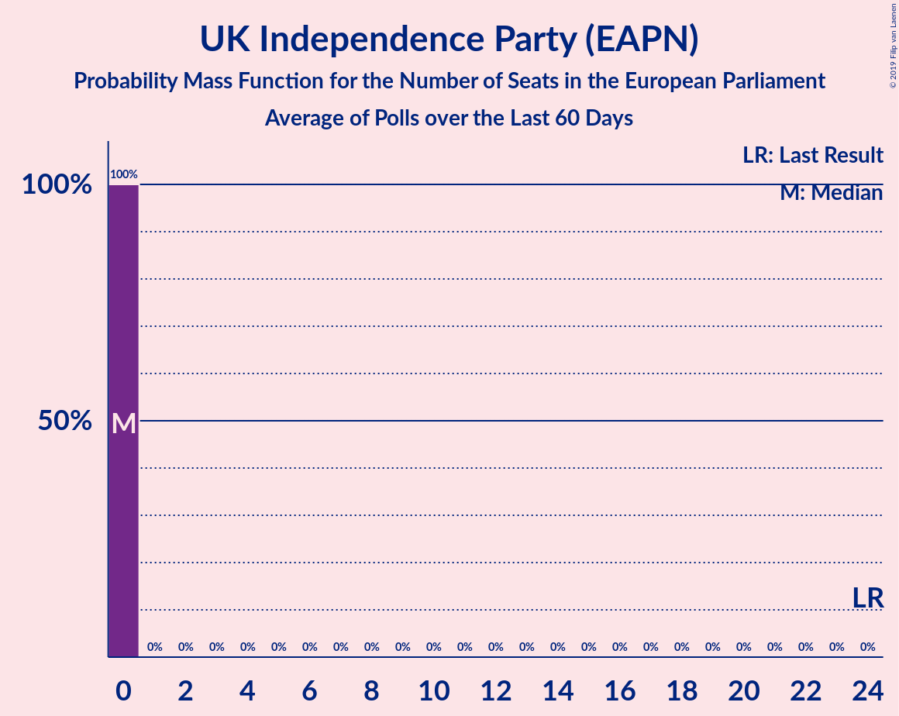
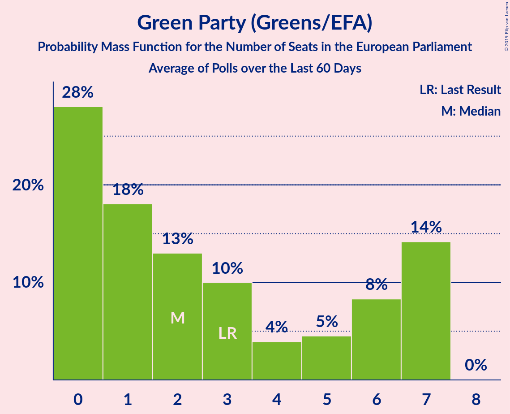
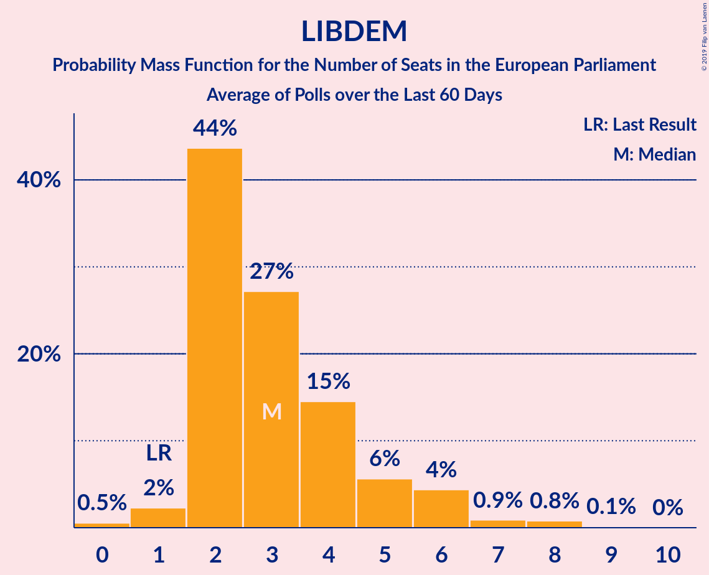
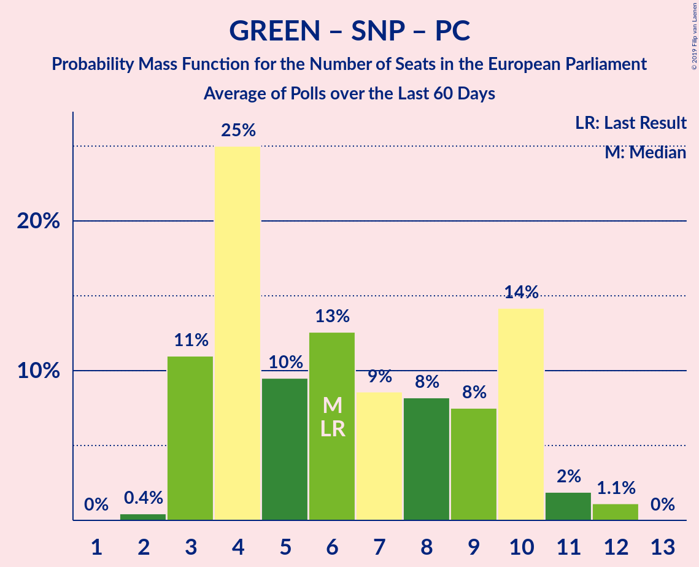

# Poll Average

<a href="#voting-intentions">Voting Intentions</a> | <a href="#seats">Seats</a> | <a href="#coalitions">Coalitions</a> | <a href="#technical-information">Technical Information</a>

## Summary

The table below lists the polls on which the average is based. They are the most recent polls (less than 90 days old) registered and analyzed so far.

| Period     | Polling firm/Commissioner(s) | UKIP | LAB | CON | GREEN | LIBDEM | SNP | PC | BREXIT | ChUK |
|:----------:|:----------------------------:|:--:|:--:|:--:|:--:|:--:|:--:|:--:|:--:|:--:|
| 22 May 2014 | General Election | 26.6%   24 | 24.4%   20 | 23.1%   19 | 6.9%   3 | 6.6%   1 | 2.4%   2 | 0.7%   1 | 0.0%   0 | 0.0%   0 |
| N/A | Poll Average | 2–4%   0 | 14–26%   11–23 | 9–16%   3–11 | 5–11%   0–7 | 11–20%   6–16 | 2–5%   2–4 | 0–1%   0–2 | 25–36%   20–35 | 2–7%   0–1 |
| [12–16 May 2019](2019-05-16-YouGov.html) | YouGov | 3%   0 | 14–16%   11–12 | 8–10%   3–4 | 9–11%   5–7 | 15–17%   11–12 | N/A   N/A | N/A   N/A | 34–36%   33–35 | 5–6%   0–1 |
| [9–13 May 2019](2019-05-13-HanburyStrategy.html) | Hanbury Strategy | 2–4%   0 | 23–27%   19–22 | 11–14%   8–9 | 5–7%   0 | 12–15%   9 | 3–5%   3–4 | 0–1%   0–1 | 28–32%   26–29 | 5–7%   0–1 |
| [10–12 May 2019](2019-05-12-ComRes.html) | ComRes | 2–4%   0 | 23–27%   21–25 | 13–17%   9–11 | 6–8%   0–3 | 12–15%   8–10 | 2–4%   2–3 | 0–1%   0 | 25–29%   21–27 | 5–7%   0–2 |
| [8–10 May 2019](2019-05-10-Opinium.html) | Opinium   The Observer | 3–5%   0 | 19–23%   15–18 | 10–12%   5–8 | 7–9%   1–3 | 11–13%   5–9 | 3–5%   3–4 | 1–2%   1 | 32–36%   30–34 | 2–4%   0 |
| [7–10 May 2019](2019-05-10-BMGResearch.html) | BMG Research | 2–4%   0 | 20–24%   15–20 | 10–14%   6–9 | 9–12%   3–7 | 17–21%   11–16 | 2–4%   2–4 | 1–2%   0–2 | 24–28%   20–25 | 2–4%   0 |
| [8–9 May 2019](2019-05-09-Survation.html) | Survation   Good Morning Britain | N/A   N/A | N/A   N/A | N/A   N/A | N/A   N/A | N/A   N/A | N/A   N/A | N/A   N/A | N/A   N/A | N/A   N/A |
| 22 May 2014 | General Election | 26.6%   24 | 24.4%   20 | 23.1%   19 | 6.9%   3 | 6.6%   1 | 2.4%   2 | 0.7%   1 | 0.0%   0 | 0.0%   0 |

Only polls for which at least the sample size has been published are included in the table above.

**Legend:**
+ **Top half of each row:** Voting intentions (95% confidence interval)
+ **Bottom half of each row:** Seat projections for the European Parliament (95% confidence interval)
+ **UKIP:** UK Independence Party (EAPN)
+ **LAB:** Labour Party (S&D)
+ **CON:** Conservative Party (ECR)
+ **GREEN:** Green Party (Greens/EFA)
+ **LIBDEM:** Liberal Democrats (ALDE)
+ **SNP:** Scottish National Party (Greens/EFA)
+ **PC:** Plaid Cymru (Greens/EFA)
+ **BREXIT:** Brexit Party (EFDD)
+ **ChUK:** Change UK (EPP)
+ **N/A (single party):** Party not included the published results
+ **N/A (entire row):** Calculation for this opinion poll not started yet

## Voting Intentions

### Confidence Intervals

| Party | Last Result | Median | 80% Confidence Interval | 90% Confidence Interval | 95% Confidence Interval | 99% Confidence Interval |
|:-----:|:-----------:|:------:|:-----------------------:|:-----------------------:|:-----------------------:|:-----------------------:|
| <a href="#uk-independence-party-(eapn)">UK Independence Party (EAPN)</a> | 26.6% | 3.1% | 2.6–4.1% |2.5–4.3% | 2.4–4.5% | 2.2–4.9% |
| <a href="#labour-party-(s&d)">Labour Party (S&D)</a> | 24.4% | 22.2% | 15.0–25.5% |14.7–25.9% | 14.5–26.3% | 14.2–27.0% |
| <a href="#conservative-party-(ecr)">Conservative Party (ECR)</a> | 23.1% | 12.0% | 9.0–15.0% |8.8–15.5% | 8.6–15.9% | 8.4–16.6% |
| <a href="#green-party-(greens/efa)">Green Party (Greens/EFA)</a> | 6.9% | 8.1% | 5.9–10.4% |5.6–10.6% | 5.3–11.0% | 4.9–11.6% |
| <a href="#liberal-democrats-(alde)">Liberal Democrats (ALDE)</a> | 6.6% | 14.0% | 11.9–19.0% |11.5–19.7% | 11.2–20.2% | 10.6–21.1% |
| <a href="#scottish-national-party-(greens/efa)">Scottish National Party (Greens/EFA)</a> | 2.4% | 3.6% | 2.8–4.4% |2.6–4.6% | 2.5–4.8% | 2.2–5.1% |
| <a href="#plaid-cymru-(greens/efa)">Plaid Cymru (Greens/EFA)</a> | 0.7% | 0.6% | 0.2–1.2% |0.2–1.3% | 0.1–1.4% | 0.1–1.6% |
| <a href="#brexit-party-(efdd)">Brexit Party (EFDD)</a> | 0.0% | 29.6% | 25.7–35.2% |25.2–35.5% | 24.7–35.8% | 23.9–36.3% |
| <a href="#change-uk-(epp)">Change UK (EPP)</a> | 0.0% | 5.0% | 2.8–6.3% |2.6–6.6% | 2.4–6.8% | 2.2–7.2% |

### UK Independence Party (EAPN)

*For a full overview of the results for this party, see the [UK Independence Party (EAPN)](party-ukindependencepartyeapn.html) page.*

| Voting Intentions | Probability | Accumulated | Special Marks |
|:-----------------:|:-----------:|:-----------:|:-------------:|
| 0.5–1.5% | 0% | 100% |  |
| 1.5–2.5% | 7% | 100% |  |
| 2.5–3.5% | 70% | 93% | Median |
| 3.5–4.5% | 21% | 24% |  |
| 4.5–5.5% | 2% | 2% |  |
| 5.5–6.5% | 0% | 0% |  |
| 6.5–7.5% | 0% | 0% |  |
| 7.5–8.5% | 0% | 0% |  |
| 8.5–9.5% | 0% | 0% |  |
| 9.5–10.5% | 0% | 0% |  |
| 10.5–11.5% | 0% | 0% |  |
| 11.5–12.5% | 0% | 0% |  |
| 12.5–13.5% | 0% | 0% |  |
| 13.5–14.5% | 0% | 0% |  |
| 14.5–15.5% | 0% | 0% |  |
| 15.5–16.5% | 0% | 0% |  |
| 16.5–17.5% | 0% | 0% |  |
| 17.5–18.5% | 0% | 0% |  |
| 18.5–19.5% | 0% | 0% |  |
| 19.5–20.5% | 0% | 0% |  |
| 20.5–21.5% | 0% | 0% |  |
| 21.5–22.5% | 0% | 0% |  |
| 22.5–23.5% | 0% | 0% |  |
| 23.5–24.5% | 0% | 0% |  |
| 24.5–25.5% | 0% | 0% |  |
| 25.5–26.5% | 0% | 0% |  |
| 26.5–27.5% | 0% | 0% | Last Result |

### Labour Party (S&D)

*For a full overview of the results for this party, see the [Labour Party (S&D)](party-labourpartysd.html) page.*

| Voting Intentions | Probability | Accumulated | Special Marks |
|:-----------------:|:-----------:|:-----------:|:-------------:|
| 12.5–13.5% | 0% | 100% |  |
| 13.5–14.5% | 3% | 100% |  |
| 14.5–15.5% | 15% | 97% |  |
| 15.5–16.5% | 2% | 82% |  |
| 16.5–17.5% | 0% | 80% |  |
| 17.5–18.5% | 0.1% | 80% |  |
| 18.5–19.5% | 1.1% | 80% |  |
| 19.5–20.5% | 6% | 79% |  |
| 20.5–21.5% | 13% | 73% |  |
| 21.5–22.5% | 12% | 59% | Median |
| 22.5–23.5% | 9% | 47% |  |
| 23.5–24.5% | 13% | 38% | Last Result |
| 24.5–25.5% | 15% | 24% |  |
| 25.5–26.5% | 8% | 9% |  |
| 26.5–27.5% | 1.5% | 2% |  |
| 27.5–28.5% | 0.1% | 0.1% |  |
| 28.5–29.5% | 0% | 0% |  |

### Conservative Party (ECR)

*For a full overview of the results for this party, see the [Conservative Party (ECR)](party-conservativepartyecr.html) page.*

| Voting Intentions | Probability | Accumulated | Special Marks |
|:-----------------:|:-----------:|:-----------:|:-------------:|
| 6.5–7.5% | 0% | 100% |  |
| 7.5–8.5% | 2% | 100% |  |
| 8.5–9.5% | 18% | 98% |  |
| 9.5–10.5% | 6% | 81% |  |
| 10.5–11.5% | 16% | 74% |  |
| 11.5–12.5% | 19% | 58% | Median |
| 12.5–13.5% | 15% | 39% |  |
| 13.5–14.5% | 9% | 24% |  |
| 14.5–15.5% | 10% | 14% |  |
| 15.5–16.5% | 4% | 5% |  |
| 16.5–17.5% | 0.5% | 0.5% |  |
| 17.5–18.5% | 0% | 0% |  |
| 18.5–19.5% | 0% | 0% |  |
| 19.5–20.5% | 0% | 0% |  |
| 20.5–21.5% | 0% | 0% |  |
| 21.5–22.5% | 0% | 0% |  |
| 22.5–23.5% | 0% | 0% | Last Result |

### Green Party (Greens/EFA)

*For a full overview of the results for this party, see the [Green Party (Greens/EFA)](party-greenpartygreensefa.html) page.*

| Voting Intentions | Probability | Accumulated | Special Marks |
|:-----------------:|:-----------:|:-----------:|:-------------:|
| 3.5–4.5% | 0% | 100% |  |
| 4.5–5.5% | 5% | 100% |  |
| 5.5–6.5% | 17% | 95% |  |
| 6.5–7.5% | 19% | 78% | Last Result |
| 7.5–8.5% | 16% | 59% | Median |
| 8.5–9.5% | 11% | 44% |  |
| 9.5–10.5% | 27% | 33% |  |
| 10.5–11.5% | 6% | 6% |  |
| 11.5–12.5% | 0.5% | 0.6% |  |
| 12.5–13.5% | 0% | 0% |  |

### Liberal Democrats (ALDE)

*For a full overview of the results for this party, see the [Liberal Democrats (ALDE)](party-liberaldemocratsalde.html) page.*

| Voting Intentions | Probability | Accumulated | Special Marks |
|:-----------------:|:-----------:|:-----------:|:-------------:|
| 6.5–7.5% | 0% | 100% | Last Result |
| 7.5–8.5% | 0% | 100% |  |
| 8.5–9.5% | 0% | 100% |  |
| 9.5–10.5% | 0.4% | 100% |  |
| 10.5–11.5% | 5% | 99.6% |  |
| 11.5–12.5% | 16% | 94% |  |
| 12.5–13.5% | 20% | 78% |  |
| 13.5–14.5% | 14% | 58% | Median |
| 14.5–15.5% | 6% | 44% |  |
| 15.5–16.5% | 15% | 38% |  |
| 16.5–17.5% | 3% | 22% |  |
| 17.5–18.5% | 5% | 19% |  |
| 18.5–19.5% | 8% | 14% |  |
| 19.5–20.5% | 5% | 6% |  |
| 20.5–21.5% | 1.2% | 1.4% |  |
| 21.5–22.5% | 0.1% | 0.1% |  |
| 22.5–23.5% | 0% | 0% |  |

### Scottish National Party (Greens/EFA)

*For a full overview of the results for this party, see the [Scottish National Party (Greens/EFA)](party-scottishnationalpartygreensefa.html) page.*

| Voting Intentions | Probability | Accumulated | Special Marks |
|:-----------------:|:-----------:|:-----------:|:-------------:|
| 0.5–1.5% | 0% | 100% |  |
| 1.5–2.5% | 4% | 100% | Last Result |
| 2.5–3.5% | 46% | 96% |  |
| 3.5–4.5% | 45% | 50% | Median |
| 4.5–5.5% | 6% | 6% |  |
| 5.5–6.5% | 0% | 0% |  |
| 6.5–7.5% | 0% | 0% |  |

### Plaid Cymru (Greens/EFA)

*For a full overview of the results for this party, see the [Plaid Cymru (Greens/EFA)](party-plaidcymrugreensefa.html) page.*

| Voting Intentions | Probability | Accumulated | Special Marks |
|:-----------------:|:-----------:|:-----------:|:-------------:|
| 0.0–0.5% | 49% | 100% |  |
| 0.5–1.5% | 50% | 51% | Last Result, Median |
| 1.5–2.5% | 1.0% | 1.0% |  |
| 2.5–3.5% | 0% | 0% |  |

### Brexit Party (EFDD)

*For a full overview of the results for this party, see the [Brexit Party (EFDD)](party-brexitpartyefdd.html) page.*

| Voting Intentions | Probability | Accumulated | Special Marks |
|:-----------------:|:-----------:|:-----------:|:-------------:|
| 0.0–0.5% | 0% | 100% | Last Result |
| 0.5–1.5% | 0% | 100% |  |
| 1.5–2.5% | 0% | 100% |  |
| 2.5–3.5% | 0% | 100% |  |
| 3.5–4.5% | 0% | 100% |  |
| 4.5–5.5% | 0% | 100% |  |
| 5.5–6.5% | 0% | 100% |  |
| 6.5–7.5% | 0% | 100% |  |
| 7.5–8.5% | 0% | 100% |  |
| 8.5–9.5% | 0% | 100% |  |
| 9.5–10.5% | 0% | 100% |  |
| 10.5–11.5% | 0% | 100% |  |
| 11.5–12.5% | 0% | 100% |  |
| 12.5–13.5% | 0% | 100% |  |
| 13.5–14.5% | 0% | 100% |  |
| 14.5–15.5% | 0% | 100% |  |
| 15.5–16.5% | 0% | 100% |  |
| 16.5–17.5% | 0% | 100% |  |
| 17.5–18.5% | 0% | 100% |  |
| 18.5–19.5% | 0% | 100% |  |
| 19.5–20.5% | 0% | 100% |  |
| 20.5–21.5% | 0% | 100% |  |
| 21.5–22.5% | 0% | 100% |  |
| 22.5–23.5% | 0.2% | 100% |  |
| 23.5–24.5% | 2% | 99.8% |  |
| 24.5–25.5% | 6% | 98% |  |
| 25.5–26.5% | 12% | 92% |  |
| 26.5–27.5% | 13% | 80% |  |
| 27.5–28.5% | 8% | 67% |  |
| 28.5–29.5% | 8% | 58% |  |
| 29.5–30.5% | 7% | 50% | Median |
| 30.5–31.5% | 3% | 43% |  |
| 31.5–32.5% | 2% | 40% |  |
| 32.5–33.5% | 5% | 38% |  |
| 33.5–34.5% | 11% | 33% |  |
| 34.5–35.5% | 17% | 22% |  |
| 35.5–36.5% | 5% | 5% |  |
| 36.5–37.5% | 0.2% | 0.2% |  |
| 37.5–38.5% | 0% | 0% |  |

### Change UK (EPP)

*For a full overview of the results for this party, see the [Change UK (EPP)](party-changeukepp.html) page.*

| Voting Intentions | Probability | Accumulated | Special Marks |
|:-----------------:|:-----------:|:-----------:|:-------------:|
| 0.0–0.5% | 0% | 100% | Last Result |
| 0.5–1.5% | 0% | 100% |  |
| 1.5–2.5% | 4% | 100% |  |
| 2.5–3.5% | 31% | 96% |  |
| 3.5–4.5% | 5% | 64% |  |
| 4.5–5.5% | 27% | 59% | Median |
| 5.5–6.5% | 26% | 32% |  |
| 6.5–7.5% | 5% | 6% |  |
| 7.5–8.5% | 0.1% | 0.1% |  |
| 8.5–9.5% | 0% | 0% |  |

## Seats

### Confidence Intervals

| Party | Last Result | Median | 80% Confidence Interval | 90% Confidence Interval | 95% Confidence Interval | 99% Confidence Interval |
|:-----:|:-----------:|:------:|:-----------------------:|:-----------------------:|:-----------------------:|:-----------------------:|
| <a href="#uk-independence-party-(eapn)">UK Independence Party (EAPN)</a> | 24 | 0 | 0 |0 | 0 | 0 |
| <a href="#labour-party-(s&d)">Labour Party (S&D)</a> | 20 | 17 | 11–22 |11–23 | 11–23 | 11–25 |
| <a href="#conservative-party-(ecr)">Conservative Party (ECR)</a> | 19 | 8 | 4–10 |4–10 | 3–11 | 3–11 |
| <a href="#green-party-(greens/efa)">Green Party (Greens/EFA)</a> | 3 | 2 | 0–7 |0–7 | 0–7 | 0–7 |
| <a href="#liberal-democrats-(alde)">Liberal Democrats (ALDE)</a> | 1 | 9 | 7–14 |7–14 | 6–16 | 5–16 |
| <a href="#scottish-national-party-(greens/efa)">Scottish National Party (Greens/EFA)</a> | 2 | 3 | 2–4 |2–4 | 2–4 | 2–4 |
| <a href="#plaid-cymru-(greens/efa)">Plaid Cymru (Greens/EFA)</a> | 1 | 0 | 0–1 |0–2 | 0–2 | 0–2 |
| <a href="#brexit-party-(efdd)">Brexit Party (EFDD)</a> | 0 | 26 | 21–33 |21–34 | 20–35 | 20–35 |
| <a href="#change-uk-(epp)">Change UK (EPP)</a> | 0 | 0 | 0–1 |0–1 | 0–1 | 0–2 |

### UK Independence Party (EAPN)

*For a full overview of the results for this party, see the [UK Independence Party (EAPN)](party-ukindependencepartyeapn.html) page.*

| Number of Seats | Probability | Accumulated | Special Marks |
|:---------------:|:-----------:|:-----------:|:-------------:|
| 0 | 100% | 100% | Median |
| 1 | 0% | 0% |  |
| 2 | 0% | 0% |  |
| 3 | 0% | 0% |  |
| 4 | 0% | 0% |  |
| 5 | 0% | 0% |  |
| 6 | 0% | 0% |  |
| 7 | 0% | 0% |  |
| 8 | 0% | 0% |  |
| 9 | 0% | 0% |  |
| 10 | 0% | 0% |  |
| 11 | 0% | 0% |  |
| 12 | 0% | 0% |  |
| 13 | 0% | 0% |  |
| 14 | 0% | 0% |  |
| 15 | 0% | 0% |  |
| 16 | 0% | 0% |  |
| 17 | 0% | 0% |  |
| 18 | 0% | 0% |  |
| 19 | 0% | 0% |  |
| 20 | 0% | 0% |  |
| 21 | 0% | 0% |  |
| 22 | 0% | 0% |  |
| 23 | 0% | 0% |  |
| 24 | 0% | 0% | Last Result |

### Labour Party (S&D)

*For a full overview of the results for this party, see the [Labour Party (S&D)](party-labourpartysd.html) page.*

| Number of Seats | Probability | Accumulated | Special Marks |
|:---------------:|:-----------:|:-----------:|:-------------:|
| 11 | 15% | 100% |  |
| 12 | 5% | 85% |  |
| 13 | 0.3% | 80% |  |
| 14 | 0.2% | 80% |  |
| 15 | 1.2% | 80% |  |
| 16 | 10% | 79% |  |
| 17 | 19% | 69% | Median |
| 18 | 7% | 50% |  |
| 19 | 2% | 43% |  |
| 20 | 1.3% | 40% | Last Result |
| 21 | 1.1% | 39% |  |
| 22 | 30% | 38% |  |
| 23 | 6% | 8% |  |
| 24 | 1.1% | 2% |  |
| 25 | 1.0% | 1.2% |  |
| 26 | 0.1% | 0.2% |  |
| 27 | 0.1% | 0.1% |  |
| 28 | 0% | 0% |  |

### Conservative Party (ECR)

*For a full overview of the results for this party, see the [Conservative Party (ECR)](party-conservativepartyecr.html) page.*

| Number of Seats | Probability | Accumulated | Special Marks |
|:---------------:|:-----------:|:-----------:|:-------------:|
| 2 | 0% | 100% |  |
| 3 | 3% | 99.9% |  |
| 4 | 17% | 97% |  |
| 5 | 1.0% | 80% |  |
| 6 | 4% | 79% |  |
| 7 | 8% | 75% |  |
| 8 | 22% | 67% | Median |
| 9 | 31% | 45% |  |
| 10 | 10% | 13% |  |
| 11 | 3% | 3% |  |
| 12 | 0.2% | 0.2% |  |
| 13 | 0% | 0.1% |  |
| 14 | 0% | 0% |  |
| 15 | 0% | 0% |  |
| 16 | 0% | 0% |  |
| 17 | 0% | 0% |  |
| 18 | 0% | 0% |  |
| 19 | 0% | 0% | Last Result |

### Green Party (Greens/EFA)

*For a full overview of the results for this party, see the [Green Party (Greens/EFA)](party-greenpartygreensefa.html) page.*

| Number of Seats | Probability | Accumulated | Special Marks |
|:---------------:|:-----------:|:-----------:|:-------------:|
| 0 | 21% | 100% |  |
| 1 | 14% | 79% |  |
| 2 | 16% | 65% | Median |
| 3 | 12% | 49% | Last Result |
| 4 | 5% | 37% |  |
| 5 | 5% | 32% |  |
| 6 | 10% | 27% |  |
| 7 | 17% | 17% |  |
| 8 | 0% | 0% |  |

### Liberal Democrats (ALDE)

*For a full overview of the results for this party, see the [Liberal Democrats (ALDE)](party-liberaldemocratsalde.html) page.*

| Number of Seats | Probability | Accumulated | Special Marks |
|:---------------:|:-----------:|:-----------:|:-------------:|
| 1 | 0% | 100% | Last Result |
| 2 | 0% | 100% |  |
| 3 | 0% | 100% |  |
| 4 | 0% | 100% |  |
| 5 | 1.1% | 100% |  |
| 6 | 3% | 98.9% |  |
| 7 | 7% | 96% |  |
| 8 | 9% | 89% |  |
| 9 | 37% | 81% | Median |
| 10 | 4% | 44% |  |
| 11 | 3% | 40% |  |
| 12 | 22% | 37% |  |
| 13 | 5% | 15% |  |
| 14 | 5% | 10% |  |
| 15 | 1.0% | 5% |  |
| 16 | 3% | 4% |  |
| 17 | 0.4% | 0.5% |  |
| 18 | 0.1% | 0.1% |  |
| 19 | 0% | 0% |  |

### Scottish National Party (Greens/EFA)

*For a full overview of the results for this party, see the [Scottish National Party (Greens/EFA)](party-scottishnationalpartygreensefa.html) page.*

| Number of Seats | Probability | Accumulated | Special Marks |
|:---------------:|:-----------:|:-----------:|:-------------:|
| 2 | 10% | 100% | Last Result |
| 3 | 78% | 90% | Median |
| 4 | 12% | 12% |  |
| 5 | 0% | 0% |  |

### Plaid Cymru (Greens/EFA)

*For a full overview of the results for this party, see the [Plaid Cymru (Greens/EFA)](party-plaidcymrugreensefa.html) page.*

| Number of Seats | Probability | Accumulated | Special Marks |
|:---------------:|:-----------:|:-----------:|:-------------:|
| 0 | 50% | 100% | Median |
| 1 | 45% | 50% | Last Result |
| 2 | 5% | 5% |  |
| 3 | 0% | 0% |  |

### Brexit Party (EFDD)

*For a full overview of the results for this party, see the [Brexit Party (EFDD)](party-brexitpartyefdd.html) page.*

| Number of Seats | Probability | Accumulated | Special Marks |
|:---------------:|:-----------:|:-----------:|:-------------:|
| 0 | 0% | 100% | Last Result |
| 1 | 0% | 100% |  |
| 2 | 0% | 100% |  |
| 3 | 0% | 100% |  |
| 4 | 0% | 100% |  |
| 5 | 0% | 100% |  |
| 6 | 0% | 100% |  |
| 7 | 0% | 100% |  |
| 8 | 0% | 100% |  |
| 9 | 0% | 100% |  |
| 10 | 0% | 100% |  |
| 11 | 0% | 100% |  |
| 12 | 0% | 100% |  |
| 13 | 0% | 100% |  |
| 14 | 0% | 100% |  |
| 15 | 0% | 100% |  |
| 16 | 0% | 100% |  |
| 17 | 0% | 100% |  |
| 18 | 0% | 100% |  |
| 19 | 0.4% | 100% |  |
| 20 | 4% | 99.6% |  |
| 21 | 6% | 96% |  |
| 22 | 7% | 90% |  |
| 23 | 6% | 83% |  |
| 24 | 5% | 77% |  |
| 25 | 8% | 71% |  |
| 26 | 21% | 63% | Median |
| 27 | 0.7% | 42% |  |
| 28 | 0.3% | 41% |  |
| 29 | 0.9% | 41% |  |
| 30 | 2% | 40% |  |
| 31 | 7% | 39% |  |
| 32 | 8% | 32% |  |
| 33 | 14% | 23% |  |
| 34 | 7% | 10% |  |
| 35 | 2% | 3% |  |
| 36 | 0.1% | 0.1% | Majority |
| 37 | 0% | 0% |  |

### Change UK (EPP)

*For a full overview of the results for this party, see the [Change UK (EPP)](party-changeukepp.html) page.*

| Number of Seats | Probability | Accumulated | Special Marks |
|:---------------:|:-----------:|:-----------:|:-------------:|
| 0 | 74% | 100% | Last Result, Median |
| 1 | 25% | 26% |  |
| 2 | 1.5% | 1.5% |  |
| 3 | 0% | 0% |  |

## Coalitions

### Confidence Intervals

| Coalition | Last Result | Median | Majority? | 80% Confidence Interval | 90% Confidence Interval | 95% Confidence Interval | 99% Confidence Interval |
|:---------:|:-----------:|:------:|:---------:|:-----------------------:|:-----------------------:|:-----------------------:|:-----------------------:|
| Brexit Party (EFDD) | 0 | 26 | 0.1% | 21–33 | 21–34 | 20–35 | 20–35 |
| Labour Party (S&D) | 20 | 17 | 0% | 11–22 | 11–23 | 11–23 | 11–25 |
| Liberal Democrats (ALDE) | 1 | 9 | 0% | 7–14 | 7–14 | 6–16 | 5–16 |
| Conservative Party (ECR) | 19 | 8 | 0% | 4–10 | 4–10 | 3–11 | 3–11 |
| Green Party (Greens/EFA) – Scottish National Party (Greens/EFA) – Plaid Cymru (Greens/EFA) | 6 | 6 | 0% | 3–10 | 3–10 | 3–11 | 2–12 |
| Change UK (EPP) | 0 | 0 | 0% | 0–1 | 0–1 | 0–1 | 0–2 |
| UK Independence Party (EAPN) | 24 | 0 | 0% | 0 | 0 | 0 | 0 |

### Brexit Party (EFDD)

| Number of Seats | Probability | Accumulated | Special Marks |
|:---------------:|:-----------:|:-----------:|:-------------:|
| 0 | 0% | 100% | Last Result |
| 1 | 0% | 100% |  |
| 2 | 0% | 100% |  |
| 3 | 0% | 100% |  |
| 4 | 0% | 100% |  |
| 5 | 0% | 100% |  |
| 6 | 0% | 100% |  |
| 7 | 0% | 100% |  |
| 8 | 0% | 100% |  |
| 9 | 0% | 100% |  |
| 10 | 0% | 100% |  |
| 11 | 0% | 100% |  |
| 12 | 0% | 100% |  |
| 13 | 0% | 100% |  |
| 14 | 0% | 100% |  |
| 15 | 0% | 100% |  |
| 16 | 0% | 100% |  |
| 17 | 0% | 100% |  |
| 18 | 0% | 100% |  |
| 19 | 0.4% | 100% |  |
| 20 | 4% | 99.6% |  |
| 21 | 6% | 96% |  |
| 22 | 7% | 90% |  |
| 23 | 6% | 83% |  |
| 24 | 5% | 77% |  |
| 25 | 8% | 71% |  |
| 26 | 21% | 63% | Median |
| 27 | 0.7% | 42% |  |
| 28 | 0.3% | 41% |  |
| 29 | 0.9% | 41% |  |
| 30 | 2% | 40% |  |
| 31 | 7% | 39% |  |
| 32 | 8% | 32% |  |
| 33 | 14% | 23% |  |
| 34 | 7% | 10% |  |
| 35 | 2% | 3% |  |
| 36 | 0.1% | 0.1% | Majority |
| 37 | 0% | 0% |  |

### Labour Party (S&D)

| Number of Seats | Probability | Accumulated | Special Marks |
|:---------------:|:-----------:|:-----------:|:-------------:|
| 11 | 15% | 100% |  |
| 12 | 5% | 85% |  |
| 13 | 0.3% | 80% |  |
| 14 | 0.2% | 80% |  |
| 15 | 1.2% | 80% |  |
| 16 | 10% | 79% |  |
| 17 | 19% | 69% | Median |
| 18 | 7% | 50% |  |
| 19 | 2% | 43% |  |
| 20 | 1.3% | 40% | Last Result |
| 21 | 1.1% | 39% |  |
| 22 | 30% | 38% |  |
| 23 | 6% | 8% |  |
| 24 | 1.1% | 2% |  |
| 25 | 1.0% | 1.2% |  |
| 26 | 0.1% | 0.2% |  |
| 27 | 0.1% | 0.1% |  |
| 28 | 0% | 0% |  |

### Liberal Democrats (ALDE)

| Number of Seats | Probability | Accumulated | Special Marks |
|:---------------:|:-----------:|:-----------:|:-------------:|
| 1 | 0% | 100% | Last Result |
| 2 | 0% | 100% |  |
| 3 | 0% | 100% |  |
| 4 | 0% | 100% |  |
| 5 | 1.1% | 100% |  |
| 6 | 3% | 98.9% |  |
| 7 | 7% | 96% |  |
| 8 | 9% | 89% |  |
| 9 | 37% | 81% | Median |
| 10 | 4% | 44% |  |
| 11 | 3% | 40% |  |
| 12 | 22% | 37% |  |
| 13 | 5% | 15% |  |
| 14 | 5% | 10% |  |
| 15 | 1.0% | 5% |  |
| 16 | 3% | 4% |  |
| 17 | 0.4% | 0.5% |  |
| 18 | 0.1% | 0.1% |  |
| 19 | 0% | 0% |  |

### Conservative Party (ECR)

| Number of Seats | Probability | Accumulated | Special Marks |
|:---------------:|:-----------:|:-----------:|:-------------:|
| 2 | 0% | 100% |  |
| 3 | 3% | 99.9% |  |
| 4 | 17% | 97% |  |
| 5 | 1.0% | 80% |  |
| 6 | 4% | 79% |  |
| 7 | 8% | 75% |  |
| 8 | 22% | 67% | Median |
| 9 | 31% | 45% |  |
| 10 | 10% | 13% |  |
| 11 | 3% | 3% |  |
| 12 | 0.2% | 0.2% |  |
| 13 | 0% | 0.1% |  |
| 14 | 0% | 0% |  |
| 15 | 0% | 0% |  |
| 16 | 0% | 0% |  |
| 17 | 0% | 0% |  |
| 18 | 0% | 0% |  |
| 19 | 0% | 0% | Last Result |

### Green Party (Greens/EFA) – Scottish National Party (Greens/EFA) – Plaid Cymru (Greens/EFA)

| Number of Seats | Probability | Accumulated | Special Marks |
|:---------------:|:-----------:|:-----------:|:-------------:|
| 2 | 0.5% | 100% |  |
| 3 | 22% | 99.5% |  |
| 4 | 12% | 77% |  |
| 5 | 3% | 65% | Median |
| 6 | 13% | 62% | Last Result |
| 7 | 10% | 50% |  |
| 8 | 10% | 39% |  |
| 9 | 9% | 30% |  |
| 10 | 17% | 21% |  |
| 11 | 2% | 4% |  |
| 12 | 1.3% | 1.4% |  |
| 13 | 0% | 0% |  |

### Change UK (EPP)

| Number of Seats | Probability | Accumulated | Special Marks |
|:---------------:|:-----------:|:-----------:|:-------------:|
| 0 | 74% | 100% | Last Result, Median |
| 1 | 25% | 26% |  |
| 2 | 1.5% | 1.5% |  |
| 3 | 0% | 0% |  |

### UK Independence Party (EAPN)

| Number of Seats | Probability | Accumulated | Special Marks |
|:---------------:|:-----------:|:-----------:|:-------------:|
| 0 | 100% | 100% | Median |
| 1 | 0% | 0% |  |
| 2 | 0% | 0% |  |
| 3 | 0% | 0% |  |
| 4 | 0% | 0% |  |
| 5 | 0% | 0% |  |
| 6 | 0% | 0% |  |
| 7 | 0% | 0% |  |
| 8 | 0% | 0% |  |
| 9 | 0% | 0% |  |
| 10 | 0% | 0% |  |
| 11 | 0% | 0% |  |
| 12 | 0% | 0% |  |
| 13 | 0% | 0% |  |
| 14 | 0% | 0% |  |
| 15 | 0% | 0% |  |
| 16 | 0% | 0% |  |
| 17 | 0% | 0% |  |
| 18 | 0% | 0% |  |
| 19 | 0% | 0% |  |
| 20 | 0% | 0% |  |
| 21 | 0% | 0% |  |
| 22 | 0% | 0% |  |
| 23 | 0% | 0% |  |
| 24 | 0% | 0% | Last Result |

## Technical Information

+ **Number of polls included in this average:** 6
+ **Lowest number of simulations done in a poll included in this average:** 0
+ **Total number of simulations done in the polls included in this average:** 4,195,328
+ **Error estimate:** 3.92%
