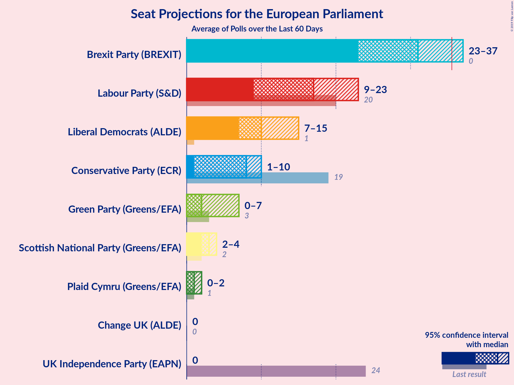

# Poll Average

<a href="#voting-intentions">Voting Intentions</a> | <a href="#seats">Seats</a> | <a href="#coalitions">Coalitions</a> | <a href="#technical-information">Technical Information</a>

## Summary

The table below lists the polls on which the average is based. They are the most recent polls (less than 60 days old) registered and analyzed so far.

| Period     | Polling firm/Commissioner(s) | UKIP | LAB | CON | GREEN | LIBDEM | SNP | PC | BREXIT | ChUK |
|:----------:|:----------------------------:|:--:|:--:|:--:|:--:|:--:|:--:|:--:|:--:|:--:|
| 22 May 2014 | General Election | 26.6%   24 | 24.4%   20 | 23.1%   19 | 6.9%   3 | 6.6%   1 | 2.4%   2 | 0.7%   1 | 0.0%   0 | 0.0%   0 |
| N/A | Poll Average | 2–4%   0 | 12–26%   9–23 | 7–16%   1–10 | 4–12%   0–7 | 12–20%   7–15 | 2–5%   2–4 | 0–2%   0–2 | 26–39%   23–37 | 2–6%   0 |
| [20–22 May 2019](2019-05-22-IpsosMORI.html) | Ipsos MORI | 2–4%   0 | 13–17%   10–14 | 8–10%   1–5 | 8–11%   3–7 | 18–22%   12–19 | 2–4%   2–3 | 0–1%   0–1 | 32–37%   29–35 | 2–4%   0 |
| [20–22 May 2019](2019-05-22-BMGResearch.html) | BMG Research   The Independent | 1–3%   0 | 16–20%   12–16 | 10–14%   6–9 | 7–9%   1–3 | 15–19%   9–12 | 2–4%   2–3 | 1–2%   1–2 | 32–37%   29–34 | 3–5%   0 |
| [19–21 May 2019](2019-05-21-YouGov.html) | YouGov   The Times | 2–4%   0 | 12–14%   8–12 | 6–8%   1 | 11–13%   6–9 | 18–20%   12–15 | 2–4%   2–3 | 1%   1–2 | 35–38%   33–37 | 3–5%   0 |
| [14–21 May 2019](2019-05-21-Panelbase.html) | Panelbase   The Sunday Times | 2–4%   0 | 23–27%   19–24 | 11–13%   6–8 | 6–8%   0–2 | 14–17%   9–11 | 3–5%   3–4 | N/A   N/A | 28–32%   25–30 | 2–4%   0 |
| [18–21 May 2019](2019-05-21-NumberCruncherPolitics.html) | Number Cruncher Politics | 1–3%   0 | 16–21%   12–17 | 13–17%   8–11 | 5–9%   0–3 | 14–18%   9–12 | 3–5%   3–4 | 1–2%   0–2 | 30–35%   26–33 | 3–5%   0 |
| [14–21 May 2019](2019-05-21-Kantar.html) | Kantar | 3–5%   0 | 22–26%   20–23 | 12–14%   8–10 | 7–9%   1–4 | 14–17%   9–11 | 2–4%   2–3 | 0–1%   0 | 25–29%   23–27 | 4–6%   0 |
| [17–20 May 2019](2019-05-20-Opinium.html) | Opinium   The Times | 1–3%   0 | 15–19%   12–15 | 10–14%   6–10 | 6–9%   0–4 | 13–17%   8–13 | N/A   N/A | N/A   N/A | 35–41%   32–38 | 2–4%   0 |
| [17 May 2019](2019-05-17-Survation.html) | Survation   Daily Mail | 2–4%   0 | 22–27%   18–25 | 11–15%   6–9 | 3–6%   0 | 11–15%   5–9 | 3–6%   2–5 | 1–2%   0–2 | 28–34%   25–32 | 2–4%   0 |
| [13–17 May 2019](2019-05-17-ComRes.html) | ComRes   Electoral Calculus | 3–4%   0 | 21–24%   17–20 | 8–10%   2–6 | 6–8%   1–2 | 13–16%   9–11 | 3–4%   2–3 | 1%   1 | 32–34%   30–33 | 5–6%   0 |
| [9–13 May 2019](2019-05-13-HanburyStrategy.html) | Hanbury Strategy | 2–4%   0 | 23–27%   19–24 | 11–14%   8–9 | 5–7%   0–1 | 12–15%   9–10 | 3–5%   3–4 | 0–1%   0 | 28–32%   25–29 | 5–7%   0–1 |
| 22 May 2014 | General Election | 26.6%   24 | 24.4%   20 | 23.1%   19 | 6.9%   3 | 6.6%   1 | 2.4%   2 | 0.7%   1 | 0.0%   0 | 0.0%   0 |

Only polls for which at least the sample size has been published are included in the table above.

**Legend:**
+ **Top half of each row:** Voting intentions (95% confidence interval)
+ **Bottom half of each row:** Seat projections for the European Parliament (95% confidence interval)
+ **UKIP:** UK Independence Party (EAPN)
+ **LAB:** Labour Party (S&D)
+ **CON:** Conservative Party (ECR)
+ **GREEN:** Green Party (Greens/EFA)
+ **LIBDEM:** Liberal Democrats (ALDE)
+ **SNP:** Scottish National Party (Greens/EFA)
+ **PC:** Plaid Cymru (Greens/EFA)
+ **BREXIT:** Brexit Party (BREXIT)
+ **ChUK:** Change UK (ALDE)
+ **N/A (single party):** Party not included the published results
+ **N/A (entire row):** Calculation for this opinion poll not started yet

## Voting Intentions

### Confidence Intervals

| Party | Last Result | Median | 80% Confidence Interval | 90% Confidence Interval | 95% Confidence Interval | 99% Confidence Interval |
|:-----:|:-----------:|:------:|:-----------------------:|:-----------------------:|:-----------------------:|:-----------------------:|
| <a href="#uk-independence-party-(eapn)">UK Independence Party (EAPN)</a> | 26.6% | 2.9% | 1.9–3.8% |1.7–4.1% | 1.5–4.3% | 1.3–4.7% |
| <a href="#labour-party-(s&d)">Labour Party (S&D)</a> | 24.4% | 21.3% | 13.6–25.3% |12.9–25.9% | 12.5–26.3% | 12.0–27.3% |
| <a href="#conservative-party-(ecr)">Conservative Party (ECR)</a> | 23.1% | 12.0% | 7.7–14.0% |6.9–14.9% | 6.7–15.6% | 6.3–16.7% |
| <a href="#green-party-(greens/efa)">Green Party (Greens/EFA)</a> | 6.9% | 7.4% | 5.1–11.1% |4.2–11.9% | 3.8–12.2% | 3.2–12.8% |
| <a href="#liberal-democrats-(alde)">Liberal Democrats (ALDE)</a> | 6.6% | 15.2% | 13.2–19.2% |12.4–19.9% | 11.7–20.5% | 10.8–21.5% |
| <a href="#scottish-national-party-(greens/efa)">Scottish National Party (Greens/EFA)</a> | 2.4% | 3.4% | 2.7–4.4% |2.6–4.7% | 2.4–4.9% | 2.2–5.5% |
| <a href="#plaid-cymru-(greens/efa)">Plaid Cymru (Greens/EFA)</a> | 0.7% | 0.9% | 0.2–1.3% |0.2–1.4% | 0.1–1.6% | 0.1–1.9% |
| <a href="#brexit-party-(brexit)">Brexit Party (BREXIT)</a> | 0.0% | 32.8% | 28.1–37.2% |26.9–38.1% | 26.3–39.0% | 25.5–40.5% |
| <a href="#change-uk-(alde)">Change UK (ALDE)</a> | 0.0% | 3.9% | 2.8–5.6% |2.6–6.0% | 2.4–6.3% | 2.1–6.8% |

### UK Independence Party (EAPN)

*For a full overview of the results for this party, see the [UK Independence Party (EAPN)](party-ukindependencepartyeapn.html) page.*

| Voting Intentions | Probability | Accumulated | Special Marks |
|:-----------------:|:-----------:|:-----------:|:-------------:|
| 0.0–0.5% | 0% | 100% |  |
| 0.5–1.5% | 3% | 100% |  |
| 1.5–2.5% | 28% | 97% |  |
| 2.5–3.5% | 54% | 69% | Median |
| 3.5–4.5% | 14% | 15% |  |
| 4.5–5.5% | 1.1% | 1.1% |  |
| 5.5–6.5% | 0% | 0% |  |
| 6.5–7.5% | 0% | 0% |  |
| 7.5–8.5% | 0% | 0% |  |
| 8.5–9.5% | 0% | 0% |  |
| 9.5–10.5% | 0% | 0% |  |
| 10.5–11.5% | 0% | 0% |  |
| 11.5–12.5% | 0% | 0% |  |
| 12.5–13.5% | 0% | 0% |  |
| 13.5–14.5% | 0% | 0% |  |
| 14.5–15.5% | 0% | 0% |  |
| 15.5–16.5% | 0% | 0% |  |
| 16.5–17.5% | 0% | 0% |  |
| 17.5–18.5% | 0% | 0% |  |
| 18.5–19.5% | 0% | 0% |  |
| 19.5–20.5% | 0% | 0% |  |
| 20.5–21.5% | 0% | 0% |  |
| 21.5–22.5% | 0% | 0% |  |
| 22.5–23.5% | 0% | 0% |  |
| 23.5–24.5% | 0% | 0% |  |
| 24.5–25.5% | 0% | 0% |  |
| 25.5–26.5% | 0% | 0% |  |
| 26.5–27.5% | 0% | 0% | Last Result |

### Labour Party (S&D)

*For a full overview of the results for this party, see the [Labour Party (S&D)](party-labourpartysd.html) page.*

| Voting Intentions | Probability | Accumulated | Special Marks |
|:-----------------:|:-----------:|:-----------:|:-------------:|
| 10.5–11.5% | 0.1% | 100% |  |
| 11.5–12.5% | 3% | 99.9% |  |
| 12.5–13.5% | 7% | 97% |  |
| 13.5–14.5% | 4% | 90% |  |
| 14.5–15.5% | 5% | 86% |  |
| 15.5–16.5% | 5% | 81% |  |
| 16.5–17.5% | 8% | 76% |  |
| 17.5–18.5% | 9% | 68% |  |
| 18.5–19.5% | 6% | 59% |  |
| 19.5–20.5% | 2% | 53% |  |
| 20.5–21.5% | 1.1% | 51% | Median |
| 21.5–22.5% | 5% | 50% |  |
| 22.5–23.5% | 11% | 45% |  |
| 23.5–24.5% | 14% | 34% | Last Result |
| 24.5–25.5% | 12% | 20% |  |
| 25.5–26.5% | 6% | 8% |  |
| 26.5–27.5% | 2% | 2% |  |
| 27.5–28.5% | 0.2% | 0.3% |  |
| 28.5–29.5% | 0% | 0% |  |

### Conservative Party (ECR)

*For a full overview of the results for this party, see the [Conservative Party (ECR)](party-conservativepartyecr.html) page.*

| Voting Intentions | Probability | Accumulated | Special Marks |
|:-----------------:|:-----------:|:-----------:|:-------------:|
| 4.5–5.5% | 0% | 100% |  |
| 5.5–6.5% | 2% | 100% |  |
| 6.5–7.5% | 8% | 98% |  |
| 7.5–8.5% | 4% | 91% |  |
| 8.5–9.5% | 12% | 87% |  |
| 9.5–10.5% | 6% | 75% |  |
| 10.5–11.5% | 10% | 69% |  |
| 11.5–12.5% | 23% | 59% | Median |
| 12.5–13.5% | 21% | 36% |  |
| 13.5–14.5% | 9% | 15% |  |
| 14.5–15.5% | 4% | 6% |  |
| 15.5–16.5% | 2% | 3% |  |
| 16.5–17.5% | 0.5% | 0.6% |  |
| 17.5–18.5% | 0.1% | 0.1% |  |
| 18.5–19.5% | 0% | 0% |  |
| 19.5–20.5% | 0% | 0% |  |
| 20.5–21.5% | 0% | 0% |  |
| 21.5–22.5% | 0% | 0% |  |
| 22.5–23.5% | 0% | 0% | Last Result |

### Green Party (Greens/EFA)

*For a full overview of the results for this party, see the [Green Party (Greens/EFA)](party-greenpartygreensefa.html) page.*

| Voting Intentions | Probability | Accumulated | Special Marks |
|:-----------------:|:-----------:|:-----------:|:-------------:|
| 1.5–2.5% | 0% | 100% |  |
| 2.5–3.5% | 2% | 100% |  |
| 3.5–4.5% | 6% | 98% |  |
| 4.5–5.5% | 5% | 93% |  |
| 5.5–6.5% | 14% | 87% |  |
| 6.5–7.5% | 28% | 73% | Last Result, Median |
| 7.5–8.5% | 20% | 44% |  |
| 8.5–9.5% | 7% | 24% |  |
| 9.5–10.5% | 5% | 17% |  |
| 10.5–11.5% | 4% | 12% |  |
| 11.5–12.5% | 7% | 8% |  |
| 12.5–13.5% | 1.1% | 1.1% |  |
| 13.5–14.5% | 0% | 0% |  |

### Liberal Democrats (ALDE)

*For a full overview of the results for this party, see the [Liberal Democrats (ALDE)](party-liberaldemocratsalde.html) page.*

| Voting Intentions | Probability | Accumulated | Special Marks |
|:-----------------:|:-----------:|:-----------:|:-------------:|
| 6.5–7.5% | 0% | 100% | Last Result |
| 7.5–8.5% | 0% | 100% |  |
| 8.5–9.5% | 0% | 100% |  |
| 9.5–10.5% | 0.3% | 100% |  |
| 10.5–11.5% | 2% | 99.7% |  |
| 11.5–12.5% | 4% | 98% |  |
| 12.5–13.5% | 8% | 94% |  |
| 13.5–14.5% | 20% | 86% |  |
| 14.5–15.5% | 22% | 66% | Median |
| 15.5–16.5% | 14% | 44% |  |
| 16.5–17.5% | 7% | 30% |  |
| 17.5–18.5% | 7% | 23% |  |
| 18.5–19.5% | 9% | 16% |  |
| 19.5–20.5% | 5% | 7% |  |
| 20.5–21.5% | 2% | 2% |  |
| 21.5–22.5% | 0.4% | 0.5% |  |
| 22.5–23.5% | 0% | 0% |  |
| 23.5–24.5% | 0% | 0% |  |

### Scottish National Party (Greens/EFA)

*For a full overview of the results for this party, see the [Scottish National Party (Greens/EFA)](party-scottishnationalpartygreensefa.html) page.*

| Voting Intentions | Probability | Accumulated | Special Marks |
|:-----------------:|:-----------:|:-----------:|:-------------:|
| 0.5–1.5% | 0% | 100% |  |
| 1.5–2.5% | 4% | 100% | Last Result |
| 2.5–3.5% | 54% | 96% | Median |
| 3.5–4.5% | 34% | 41% |  |
| 4.5–5.5% | 7% | 7% |  |
| 5.5–6.5% | 0.4% | 0.4% |  |
| 6.5–7.5% | 0% | 0% |  |

### Plaid Cymru (Greens/EFA)

*For a full overview of the results for this party, see the [Plaid Cymru (Greens/EFA)](party-plaidcymrugreensefa.html) page.*

| Voting Intentions | Probability | Accumulated | Special Marks |
|:-----------------:|:-----------:|:-----------:|:-------------:|
| 0.0–0.5% | 36% | 100% |  |
| 0.5–1.5% | 61% | 64% | Last Result, Median |
| 1.5–2.5% | 3% | 3% |  |
| 2.5–3.5% | 0% | 0% |  |

### Brexit Party (BREXIT)

*For a full overview of the results for this party, see the [Brexit Party (BREXIT)](party-brexitpartybrexit.html) page.*

| Voting Intentions | Probability | Accumulated | Special Marks |
|:-----------------:|:-----------:|:-----------:|:-------------:|
| 0.0–0.5% | 0% | 100% | Last Result |
| 0.5–1.5% | 0% | 100% |  |
| 1.5–2.5% | 0% | 100% |  |
| 2.5–3.5% | 0% | 100% |  |
| 3.5–4.5% | 0% | 100% |  |
| 4.5–5.5% | 0% | 100% |  |
| 5.5–6.5% | 0% | 100% |  |
| 6.5–7.5% | 0% | 100% |  |
| 7.5–8.5% | 0% | 100% |  |
| 8.5–9.5% | 0% | 100% |  |
| 9.5–10.5% | 0% | 100% |  |
| 10.5–11.5% | 0% | 100% |  |
| 11.5–12.5% | 0% | 100% |  |
| 12.5–13.5% | 0% | 100% |  |
| 13.5–14.5% | 0% | 100% |  |
| 14.5–15.5% | 0% | 100% |  |
| 15.5–16.5% | 0% | 100% |  |
| 16.5–17.5% | 0% | 100% |  |
| 17.5–18.5% | 0% | 100% |  |
| 18.5–19.5% | 0% | 100% |  |
| 19.5–20.5% | 0% | 100% |  |
| 20.5–21.5% | 0% | 100% |  |
| 21.5–22.5% | 0% | 100% |  |
| 22.5–23.5% | 0% | 100% |  |
| 23.5–24.5% | 0% | 100% |  |
| 24.5–25.5% | 0.6% | 100% |  |
| 25.5–26.5% | 3% | 99.4% |  |
| 26.5–27.5% | 4% | 97% |  |
| 27.5–28.5% | 5% | 92% |  |
| 28.5–29.5% | 8% | 88% |  |
| 29.5–30.5% | 10% | 80% |  |
| 30.5–31.5% | 9% | 70% |  |
| 31.5–32.5% | 9% | 61% |  |
| 32.5–33.5% | 11% | 52% | Median |
| 33.5–34.5% | 10% | 41% |  |
| 34.5–35.5% | 8% | 31% |  |
| 35.5–36.5% | 8% | 23% |  |
| 36.5–37.5% | 7% | 15% |  |
| 37.5–38.5% | 4% | 8% |  |
| 38.5–39.5% | 2% | 4% |  |
| 39.5–40.5% | 1.1% | 2% |  |
| 40.5–41.5% | 0.4% | 0.5% |  |
| 41.5–42.5% | 0.1% | 0.1% |  |
| 42.5–43.5% | 0% | 0% |  |

### Change UK (ALDE)

*For a full overview of the results for this party, see the [Change UK (ALDE)](party-changeukalde.html) page.*

| Voting Intentions | Probability | Accumulated | Special Marks |
|:-----------------:|:-----------:|:-----------:|:-------------:|
| 0.0–0.5% | 0% | 100% | Last Result |
| 0.5–1.5% | 0% | 100% |  |
| 1.5–2.5% | 5% | 100% |  |
| 2.5–3.5% | 34% | 95% |  |
| 3.5–4.5% | 30% | 61% | Median |
| 4.5–5.5% | 21% | 32% |  |
| 5.5–6.5% | 9% | 11% |  |
| 6.5–7.5% | 1.2% | 1.3% |  |
| 7.5–8.5% | 0% | 0% |  |

## Seats

### Confidence Intervals

| Party | Last Result | Median | 80% Confidence Interval | 90% Confidence Interval | 95% Confidence Interval | 99% Confidence Interval |
|:-----:|:-----------:|:------:|:-----------------------:|:-----------------------:|:-----------------------:|:-----------------------:|
| <a href="#uk-independence-party-(eapn)">UK Independence Party (EAPN)</a> | 24 | 0 | 0 |0 | 0 | 0 |
| <a href="#labour-party-(s&d)">Labour Party (S&D)</a> | 20 | 17 | 11–22 |10–23 | 9–23 | 9–24 |
| <a href="#conservative-party-(ecr)">Conservative Party (ECR)</a> | 19 | 8 | 1–9 |1–9 | 1–10 | 1–11 |
| <a href="#green-party-(greens/efa)">Green Party (Greens/EFA)</a> | 3 | 2 | 0–6 |0–7 | 0–7 | 0–8 |
| <a href="#liberal-democrats-(alde)">Liberal Democrats (ALDE)</a> | 1 | 10 | 9–13 |8–14 | 7–15 | 5–17 |
| <a href="#scottish-national-party-(greens/efa)">Scottish National Party (Greens/EFA)</a> | 2 | 3 | 2–4 |2–4 | 2–4 | 2–4 |
| <a href="#plaid-cymru-(greens/efa)">Plaid Cymru (Greens/EFA)</a> | 1 | 1 | 0–1 |0–1 | 0–2 | 0–2 |
| <a href="#brexit-party-(brexit)">Brexit Party (BREXIT)</a> | 0 | 31 | 25–35 |24–36 | 23–37 | 23–38 |
| <a href="#change-uk-(alde)">Change UK (ALDE)</a> | 0 | 0 | 0 |0 | 0 | 0–1 |

### UK Independence Party (EAPN)

*For a full overview of the results for this party, see the [UK Independence Party (EAPN)](party-ukindependencepartyeapn.html) page.*

| Number of Seats | Probability | Accumulated | Special Marks |
|:---------------:|:-----------:|:-----------:|:-------------:|
| 0 | 100% | 100% | Median |
| 1 | 0% | 0% |  |
| 2 | 0% | 0% |  |
| 3 | 0% | 0% |  |
| 4 | 0% | 0% |  |
| 5 | 0% | 0% |  |
| 6 | 0% | 0% |  |
| 7 | 0% | 0% |  |
| 8 | 0% | 0% |  |
| 9 | 0% | 0% |  |
| 10 | 0% | 0% |  |
| 11 | 0% | 0% |  |
| 12 | 0% | 0% |  |
| 13 | 0% | 0% |  |
| 14 | 0% | 0% |  |
| 15 | 0% | 0% |  |
| 16 | 0% | 0% |  |
| 17 | 0% | 0% |  |
| 18 | 0% | 0% |  |
| 19 | 0% | 0% |  |
| 20 | 0% | 0% |  |
| 21 | 0% | 0% |  |
| 22 | 0% | 0% |  |
| 23 | 0% | 0% |  |
| 24 | 0% | 0% | Last Result |

### Labour Party (S&D)

*For a full overview of the results for this party, see the [Labour Party (S&D)](party-labourpartysd.html) page.*

| Number of Seats | Probability | Accumulated | Special Marks |
|:---------------:|:-----------:|:-----------:|:-------------:|
| 7 | 0.1% | 100% |  |
| 8 | 0.4% | 99.9% |  |
| 9 | 2% | 99.5% |  |
| 10 | 4% | 97% |  |
| 11 | 8% | 94% |  |
| 12 | 9% | 86% |  |
| 13 | 9% | 77% |  |
| 14 | 8% | 67% |  |
| 15 | 5% | 60% |  |
| 16 | 4% | 54% |  |
| 17 | 3% | 50% | Median |
| 18 | 6% | 47% |  |
| 19 | 5% | 41% |  |
| 20 | 6% | 36% | Last Result |
| 21 | 11% | 30% |  |
| 22 | 13% | 20% |  |
| 23 | 5% | 7% |  |
| 24 | 1.0% | 1.4% |  |
| 25 | 0.2% | 0.4% |  |
| 26 | 0.1% | 0.2% |  |
| 27 | 0% | 0% |  |

### Conservative Party (ECR)

*For a full overview of the results for this party, see the [Conservative Party (ECR)](party-conservativepartyecr.html) page.*

| Number of Seats | Probability | Accumulated | Special Marks |
|:---------------:|:-----------:|:-----------:|:-------------:|
| 1 | 11% | 100% |  |
| 2 | 1.0% | 89% |  |
| 3 | 4% | 88% |  |
| 4 | 11% | 85% |  |
| 5 | 3% | 73% |  |
| 6 | 9% | 71% |  |
| 7 | 6% | 61% |  |
| 8 | 34% | 55% | Median |
| 9 | 18% | 21% |  |
| 10 | 3% | 4% |  |
| 11 | 0.7% | 0.9% |  |
| 12 | 0.2% | 0.3% |  |
| 13 | 0.1% | 0.1% |  |
| 14 | 0% | 0% |  |
| 15 | 0% | 0% |  |
| 16 | 0% | 0% |  |
| 17 | 0% | 0% |  |
| 18 | 0% | 0% |  |
| 19 | 0% | 0% | Last Result |

### Green Party (Greens/EFA)

*For a full overview of the results for this party, see the [Green Party (Greens/EFA)](party-greenpartygreensefa.html) page.*

| Number of Seats | Probability | Accumulated | Special Marks |
|:---------------:|:-----------:|:-----------:|:-------------:|
| 0 | 24% | 100% |  |
| 1 | 22% | 76% |  |
| 2 | 25% | 54% | Median |
| 3 | 9% | 29% | Last Result |
| 4 | 5% | 20% |  |
| 5 | 0.6% | 15% |  |
| 6 | 7% | 14% |  |
| 7 | 6% | 8% |  |
| 8 | 1.0% | 1.5% |  |
| 9 | 0.4% | 0.5% |  |
| 10 | 0.1% | 0.1% |  |
| 11 | 0% | 0% |  |

### Liberal Democrats (ALDE)

*For a full overview of the results for this party, see the [Liberal Democrats (ALDE)](party-liberaldemocratsalde.html) page.*

| Number of Seats | Probability | Accumulated | Special Marks |
|:---------------:|:-----------:|:-----------:|:-------------:|
| 1 | 0% | 100% | Last Result |
| 2 | 0% | 100% |  |
| 3 | 0% | 100% |  |
| 4 | 0% | 100% |  |
| 5 | 0.6% | 99.9% |  |
| 6 | 1.0% | 99.3% |  |
| 7 | 1.1% | 98% |  |
| 8 | 3% | 97% |  |
| 9 | 28% | 95% |  |
| 10 | 20% | 66% | Median |
| 11 | 19% | 46% |  |
| 12 | 12% | 27% |  |
| 13 | 7% | 16% |  |
| 14 | 4% | 8% |  |
| 15 | 3% | 4% |  |
| 16 | 0.5% | 1.3% |  |
| 17 | 0.4% | 0.8% |  |
| 18 | 0.2% | 0.5% |  |
| 19 | 0.2% | 0.3% |  |
| 20 | 0% | 0% |  |

### Scottish National Party (Greens/EFA)

*For a full overview of the results for this party, see the [Scottish National Party (Greens/EFA)](party-scottishnationalpartygreensefa.html) page.*

| Number of Seats | Probability | Accumulated | Special Marks |
|:---------------:|:-----------:|:-----------:|:-------------:|
| 2 | 14% | 100% | Last Result |
| 3 | 71% | 86% | Median |
| 4 | 14% | 15% |  |
| 5 | 0.3% | 0.3% |  |
| 6 | 0% | 0% |  |

### Plaid Cymru (Greens/EFA)

*For a full overview of the results for this party, see the [Plaid Cymru (Greens/EFA)](party-plaidcymrugreensefa.html) page.*

| Number of Seats | Probability | Accumulated | Special Marks |
|:---------------:|:-----------:|:-----------:|:-------------:|
| 0 | 37% | 100% |  |
| 1 | 58% | 63% | Last Result, Median |
| 2 | 5% | 5% |  |
| 3 | 0% | 0% |  |

### Brexit Party (BREXIT)

*For a full overview of the results for this party, see the [Brexit Party (BREXIT)](party-brexitpartybrexit.html) page.*

| Number of Seats | Probability | Accumulated | Special Marks |
|:---------------:|:-----------:|:-----------:|:-------------:|
| 0 | 0% | 100% | Last Result |
| 1 | 0% | 100% |  |
| 2 | 0% | 100% |  |
| 3 | 0% | 100% |  |
| 4 | 0% | 100% |  |
| 5 | 0% | 100% |  |
| 6 | 0% | 100% |  |
| 7 | 0% | 100% |  |
| 8 | 0% | 100% |  |
| 9 | 0% | 100% |  |
| 10 | 0% | 100% |  |
| 11 | 0% | 100% |  |
| 12 | 0% | 100% |  |
| 13 | 0% | 100% |  |
| 14 | 0% | 100% |  |
| 15 | 0% | 100% |  |
| 16 | 0% | 100% |  |
| 17 | 0% | 100% |  |
| 18 | 0% | 100% |  |
| 19 | 0% | 100% |  |
| 20 | 0% | 100% |  |
| 21 | 0% | 100% |  |
| 22 | 0.1% | 99.9% |  |
| 23 | 4% | 99.9% |  |
| 24 | 4% | 96% |  |
| 25 | 3% | 92% |  |
| 26 | 6% | 89% |  |
| 27 | 10% | 83% |  |
| 28 | 6% | 73% |  |
| 29 | 8% | 66% |  |
| 30 | 5% | 59% |  |
| 31 | 6% | 54% | Median |
| 32 | 10% | 48% |  |
| 33 | 11% | 38% |  |
| 34 | 6% | 27% |  |
| 35 | 13% | 21% |  |
| 36 | 4% | 7% | Majority |
| 37 | 2% | 3% |  |
| 38 | 0.6% | 0.8% |  |
| 39 | 0.2% | 0.2% |  |
| 40 | 0% | 0% |  |

### Change UK (ALDE)

*For a full overview of the results for this party, see the [Change UK (ALDE)](party-changeukalde.html) page.*

| Number of Seats | Probability | Accumulated | Special Marks |
|:---------------:|:-----------:|:-----------:|:-------------:|
| 0 | 98% | 100% | Last Result, Median |
| 1 | 2% | 2% |  |
| 2 | 0% | 0% |  |

## Coalitions

### Confidence Intervals

| Coalition | Last Result | Median | Majority? | 80% Confidence Interval | 90% Confidence Interval | 95% Confidence Interval | 99% Confidence Interval |
|:---------:|:-----------:|:------:|:---------:|:-----------------------:|:-----------------------:|:-----------------------:|:-----------------------:|
| Brexit Party (BREXIT) | 0 | 31 | 7% | 25–35 | 24–36 | 23–37 | 23–38 |
| Labour Party (S&D) | 20 | 17 | 0% | 11–22 | 10–23 | 9–23 | 9–24 |
| Liberal Democrats (ALDE) – Change UK (ALDE) | 1 | 10 | 0% | 9–13 | 8–14 | 7–15 | 5–17 |
| Green Party (Greens/EFA) – Scottish National Party (Greens/EFA) – Plaid Cymru (Greens/EFA) | 6 | 5 | 0% | 3–10 | 3–10 | 2–10 | 2–12 |
| Conservative Party (ECR) | 19 | 8 | 0% | 1–9 | 1–9 | 1–10 | 1–11 |
| UK Independence Party (EAPN) | 24 | 0 | 0% | 0 | 0 | 0 | 0 |

### Brexit Party (BREXIT)

| Number of Seats | Probability | Accumulated | Special Marks |
|:---------------:|:-----------:|:-----------:|:-------------:|
| 0 | 0% | 100% | Last Result |
| 1 | 0% | 100% |  |
| 2 | 0% | 100% |  |
| 3 | 0% | 100% |  |
| 4 | 0% | 100% |  |
| 5 | 0% | 100% |  |
| 6 | 0% | 100% |  |
| 7 | 0% | 100% |  |
| 8 | 0% | 100% |  |
| 9 | 0% | 100% |  |
| 10 | 0% | 100% |  |
| 11 | 0% | 100% |  |
| 12 | 0% | 100% |  |
| 13 | 0% | 100% |  |
| 14 | 0% | 100% |  |
| 15 | 0% | 100% |  |
| 16 | 0% | 100% |  |
| 17 | 0% | 100% |  |
| 18 | 0% | 100% |  |
| 19 | 0% | 100% |  |
| 20 | 0% | 100% |  |
| 21 | 0% | 100% |  |
| 22 | 0.1% | 99.9% |  |
| 23 | 4% | 99.9% |  |
| 24 | 4% | 96% |  |
| 25 | 3% | 92% |  |
| 26 | 6% | 89% |  |
| 27 | 10% | 83% |  |
| 28 | 6% | 73% |  |
| 29 | 8% | 66% |  |
| 30 | 5% | 59% |  |
| 31 | 6% | 54% | Median |
| 32 | 10% | 48% |  |
| 33 | 11% | 38% |  |
| 34 | 6% | 27% |  |
| 35 | 13% | 21% |  |
| 36 | 4% | 7% | Majority |
| 37 | 2% | 3% |  |
| 38 | 0.6% | 0.8% |  |
| 39 | 0.2% | 0.2% |  |
| 40 | 0% | 0% |  |

### Labour Party (S&D)

| Number of Seats | Probability | Accumulated | Special Marks |
|:---------------:|:-----------:|:-----------:|:-------------:|
| 7 | 0.1% | 100% |  |
| 8 | 0.4% | 99.9% |  |
| 9 | 2% | 99.5% |  |
| 10 | 4% | 97% |  |
| 11 | 8% | 94% |  |
| 12 | 9% | 86% |  |
| 13 | 9% | 77% |  |
| 14 | 8% | 67% |  |
| 15 | 5% | 60% |  |
| 16 | 4% | 54% |  |
| 17 | 3% | 50% | Median |
| 18 | 6% | 47% |  |
| 19 | 5% | 41% |  |
| 20 | 6% | 36% | Last Result |
| 21 | 11% | 30% |  |
| 22 | 13% | 20% |  |
| 23 | 5% | 7% |  |
| 24 | 1.0% | 1.4% |  |
| 25 | 0.2% | 0.4% |  |
| 26 | 0.1% | 0.2% |  |
| 27 | 0% | 0% |  |

### Liberal Democrats (ALDE) – Change UK (ALDE)

| Number of Seats | Probability | Accumulated | Special Marks |
|:---------------:|:-----------:|:-----------:|:-------------:|
| 1 | 0% | 100% | Last Result |
| 2 | 0% | 100% |  |
| 3 | 0% | 100% |  |
| 4 | 0% | 100% |  |
| 5 | 0.6% | 99.9% |  |
| 6 | 1.0% | 99.3% |  |
| 7 | 1.1% | 98% |  |
| 8 | 3% | 97% |  |
| 9 | 27% | 95% |  |
| 10 | 22% | 68% | Median |
| 11 | 19% | 47% |  |
| 12 | 12% | 28% |  |
| 13 | 7% | 16% |  |
| 14 | 4% | 8% |  |
| 15 | 3% | 4% |  |
| 16 | 0.5% | 1.3% |  |
| 17 | 0.4% | 0.8% |  |
| 18 | 0.2% | 0.5% |  |
| 19 | 0.2% | 0.3% |  |
| 20 | 0% | 0% |  |

### Green Party (Greens/EFA) – Scottish National Party (Greens/EFA) – Plaid Cymru (Greens/EFA)

| Number of Seats | Probability | Accumulated | Special Marks |
|:---------------:|:-----------:|:-----------:|:-------------:|
| 2 | 3% | 100% |  |
| 3 | 8% | 97% |  |
| 4 | 25% | 89% |  |
| 5 | 19% | 65% |  |
| 6 | 22% | 46% | Last Result, Median |
| 7 | 8% | 24% |  |
| 8 | 2% | 16% |  |
| 9 | 4% | 15% |  |
| 10 | 8% | 10% |  |
| 11 | 2% | 2% |  |
| 12 | 0.4% | 0.6% |  |
| 13 | 0.2% | 0.2% |  |
| 14 | 0% | 0% |  |

### Conservative Party (ECR)

| Number of Seats | Probability | Accumulated | Special Marks |
|:---------------:|:-----------:|:-----------:|:-------------:|
| 1 | 11% | 100% |  |
| 2 | 1.0% | 89% |  |
| 3 | 4% | 88% |  |
| 4 | 11% | 85% |  |
| 5 | 3% | 73% |  |
| 6 | 9% | 71% |  |
| 7 | 6% | 61% |  |
| 8 | 34% | 55% | Median |
| 9 | 18% | 21% |  |
| 10 | 3% | 4% |  |
| 11 | 0.7% | 0.9% |  |
| 12 | 0.2% | 0.3% |  |
| 13 | 0.1% | 0.1% |  |
| 14 | 0% | 0% |  |
| 15 | 0% | 0% |  |
| 16 | 0% | 0% |  |
| 17 | 0% | 0% |  |
| 18 | 0% | 0% |  |
| 19 | 0% | 0% | Last Result |

### UK Independence Party (EAPN)

| Number of Seats | Probability | Accumulated | Special Marks |
|:---------------:|:-----------:|:-----------:|:-------------:|
| 0 | 100% | 100% | Median |
| 1 | 0% | 0% |  |
| 2 | 0% | 0% |  |
| 3 | 0% | 0% |  |
| 4 | 0% | 0% |  |
| 5 | 0% | 0% |  |
| 6 | 0% | 0% |  |
| 7 | 0% | 0% |  |
| 8 | 0% | 0% |  |
| 9 | 0% | 0% |  |
| 10 | 0% | 0% |  |
| 11 | 0% | 0% |  |
| 12 | 0% | 0% |  |
| 13 | 0% | 0% |  |
| 14 | 0% | 0% |  |
| 15 | 0% | 0% |  |
| 16 | 0% | 0% |  |
| 17 | 0% | 0% |  |
| 18 | 0% | 0% |  |
| 19 | 0% | 0% |  |
| 20 | 0% | 0% |  |
| 21 | 0% | 0% |  |
| 22 | 0% | 0% |  |
| 23 | 0% | 0% |  |
| 24 | 0% | 0% | Last Result |

## Technical Information

+ **Number of polls included in this average:** 10
+ **Lowest number of simulations done in a poll included in this average:** 131,072
+ **Total number of simulations done in the polls included in this average:** 9,568,256
+ **Error estimate:** 2.04%
