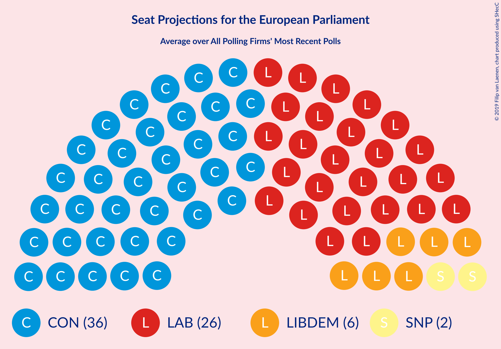

# Poll Average

<a href="#voting-intentions">Voting Intentions</a> | <a href="#seats">Seats</a> | <a href="#coalitions">Coalitions</a> | <a href="#technical-information">Technical Information</a>

## Summary

The table below lists the polls on which the average is based. They are the most recent polls (less than 90 days old) registered and analyzed so far.

| Period     | Polling firm/Commissioner(s) | BREXIT | LIBDEM | LAB | GREEN | CON | SNP | PC | ChUK | UKIP |
|:----------:|:----------------------------:|:--:|:--:|:--:|:--:|:--:|:--:|:--:|:--:|:--:|
| 23 May 2019 | General Election | 30.5%   29 | 19.6%   16 | 13.7%   10 | 11.8%   7 | 8.8%   4 | 3.5%   3 | 1.0%   1 | 3.3%   0 | 3.2%   0 |
| N/A | Poll Average | 7–17%   1–12 | 14–24%   8–19 | 21–31%   15–25 | 2–8%   0–2 | 26–40%   22–34 | 2–6%   1–3 | 0–2%   0–2 | 0–1%   0 | 0–2%   0 |
| [14–15 October 2019](2019-10-15-YouGov.html) | YouGov   The Times | 10–13%   6–9 | 16–20%   9–15 | 20–24%   15–20 | 4–6%   0 | 35–40%   27–33 | 3–5%   2–3 | 1–2%   0–2 | 0–1%   0 | 1–2%   0 |
| [10–15 October 2019](2019-10-15-KantarPublic.html) | Kantar Public | 7–10%   1–6 | 16–20%   10–14 | 23–28%   18–23 | 2–4%   0 | 36–42%   30–35 | 2–4%   1–2 | 1–2%   0–2 | 0–1%   0 | 1–2%   0 |
| [9–11 October 2019](2019-10-11-Panelbase.html) | Panelbase   The Sunday Times | 11–14%   6–8 | 16–19%   9–13 | 28–32%   21–25 | 2–4%   0 | 31–35%   23–28 | 3–5%   2–3 | N/A   N/A | N/A   N/A | 0–1%   0 |
| [9–10 October 2019](2019-10-10-ComRes.html) | ComRes   Daily Express | 11–13%   6–8 | 16–20%   9–13 | 25–29%   20–24 | 3–5%   0 | 31–35%   23–28 | 3–5%   2–3 | N/A   N/A | N/A   N/A | N/A   N/A |
| [3–4 October 2019](2019-10-04-Opinium.html) | Opinium   The Observer | 11–14%   6–10 | 14–17%   7–10 | 21–25%   16–20 | 3–5%   0 | 36–41%   31–35 | 4–6%   2–4 | 0–1%   0 | 0–1%   0 | 1–2%   0 |
| [1–4 October 2019](2019-10-04-BMGResearch.html) | BMG Research   The Independent | 10–13%   5–7 | 18–22%   12–16 | 24–28%   18–24 | 6–8%   0–2 | 29–34%   23–26 | 2–4%   1–3 | 1–2%   0–2 | N/A   N/A | 0–1%   0 |
| [25 September 2019](2019-09-25-Survation.html) | Survation   Daily Mail | 14–18%   8–14 | 20–25%   13–19 | 21–27%   16–21 | 2–4%   0 | 24–30%   19–24 | 3–5%   2–3 | N/A   N/A | N/A   N/A | N/A   N/A |
| [13–16 September 2019](2019-09-16-IpsosMORI.html) | Ipsos MORI   Evening Standard | 8–12%   2–7 | 21–26%   14–19 | 22–27%   15–21 | 3–5%   0 | 30–36%   24–30 | 2–4%   1–3 | 0–2%   0–2 | 0–1%   0 | 0–1%   0 |
| 23 May 2019 | General Election | 30.5%   29 | 19.6%   16 | 13.7%   10 | 11.8%   7 | 8.8%   4 | 3.5%   3 | 1.0%   1 | 3.3%   0 | 3.2%   0 |

Only polls for which at least the sample size has been published are included in the table above.

**Legend:**
+ **Top half of each row:** Voting intentions (95% confidence interval)
+ **Bottom half of each row:** Seat projections for the European Parliament (95% confidence interval)
+ **BREXIT:** Brexit Party (NI)
+ **LIBDEM:** Liberal Democrats (RE)
+ **LAB:** Labour Party (S&D)
+ **GREEN:** Green Party (Greens/EFA)
+ **CON:** Conservative Party (ECR)
+ **SNP:** Scottish National Party (Greens/EFA)
+ **PC:** Plaid Cymru (Greens/EFA)
+ **ChUK:** Change UK (RE)
+ **UKIP:** UK Independence Party (ID)
+ **N/A (single party):** Party not included the published results
+ **N/A (entire row):** Calculation for this opinion poll not started yet

## Voting Intentions

### Confidence Intervals

| Party | Last Result | Median | 80% Confidence Interval | 90% Confidence Interval | 95% Confidence Interval | 99% Confidence Interval |
|:-----:|:-----------:|:------:|:-----------------------:|:-----------------------:|:-----------------------:|:-----------------------:|
| <a href="#brexit-party-(ni)">Brexit Party (NI)</a> | 30.5% | 11.5% | 8.6–15.1% |7.9–16.4% | 7.4–17.1% | 6.8–18.2% |
| <a href="#liberal-democrats-(re)">Liberal Democrats (RE)</a> | 19.6% | 18.5% | 15.7–23.0% |15.0–23.8% | 14.5–24.5% | 13.8–25.6% |
| <a href="#labour-party-(s&d)">Labour Party (S&D)</a> | 13.7% | 24.9% | 22.2–29.4% |21.6–30.4% | 21.1–31.0% | 20.3–32.0% |
| <a href="#green-party-(greens/efa)">Green Party (Greens/EFA)</a> | 11.8% | 3.9% | 2.8–6.6% |2.6–7.3% | 2.4–7.7% | 2.1–8.3% |
| <a href="#conservative-party-(ecr)">Conservative Party (ECR)</a> | 8.8% | 33.7% | 28.2–39.1% |26.7–39.8% | 25.9–40.4% | 24.6–41.6% |
| <a href="#scottish-national-party-(greens/efa)">Scottish National Party (Greens/EFA)</a> | 3.5% | 3.8% | 2.8–5.0% |2.6–5.3% | 2.4–5.6% | 2.2–6.0% |
| <a href="#change-uk-(re)">Change UK (RE)</a> | 3.3% | 0.3% | 0.2–0.6% |0.1–0.6% | 0.1–0.7% | 0.1–0.9% |
| <a href="#uk-independence-party-(id)">UK Independence Party (ID)</a> | 3.2% | 0.7% | 0.2–1.3% |0.2–1.4% | 0.1–1.5% | 0.1–1.8% |
| <a href="#plaid-cymru-(greens/efa)">Plaid Cymru (Greens/EFA)</a> | 1.0% | 0.9% | 0.3–1.4% |0.2–1.5% | 0.2–1.6% | 0.1–1.9% |

### Brexit Party (NI)

*For a full overview of the results for this party, see the [Brexit Party (NI)](party-brexitpartyni.html) page.*

| Voting Intentions | Probability | Accumulated | Special Marks |
|:-----------------:|:-----------:|:-----------:|:-------------:|
| 4.5–5.5% | 0% | 100% |  |
| 5.5–6.5% | 0.3% | 100% |  |
| 6.5–7.5% | 3% | 99.7% |  |
| 7.5–8.5% | 6% | 97% |  |
| 8.5–9.5% | 7% | 90% |  |
| 9.5–10.5% | 11% | 84% |  |
| 10.5–11.5% | 23% | 72% |  |
| 11.5–12.5% | 26% | 49% | Median |
| 12.5–13.5% | 10% | 24% |  |
| 13.5–14.5% | 2% | 13% |  |
| 14.5–15.5% | 3% | 11% |  |
| 15.5–16.5% | 4% | 8% |  |
| 16.5–17.5% | 3% | 4% |  |
| 17.5–18.5% | 1.1% | 1.3% |  |
| 18.5–19.5% | 0.2% | 0.2% |  |
| 19.5–20.5% | 0% | 0% |  |
| 20.5–21.5% | 0% | 0% |  |
| 21.5–22.5% | 0% | 0% |  |
| 22.5–23.5% | 0% | 0% |  |
| 23.5–24.5% | 0% | 0% |  |
| 24.5–25.5% | 0% | 0% |  |
| 25.5–26.5% | 0% | 0% |  |
| 26.5–27.5% | 0% | 0% |  |
| 27.5–28.5% | 0% | 0% |  |
| 28.5–29.5% | 0% | 0% |  |
| 29.5–30.5% | 0% | 0% |  |
| 30.5–31.5% | 0% | 0% | Last Result |

### Liberal Democrats (RE)

*For a full overview of the results for this party, see the [Liberal Democrats (RE)](party-liberaldemocratsre.html) page.*

| Voting Intentions | Probability | Accumulated | Special Marks |
|:-----------------:|:-----------:|:-----------:|:-------------:|
| 11.5–12.5% | 0% | 100% |  |
| 12.5–13.5% | 0.2% | 100% |  |
| 13.5–14.5% | 2% | 99.8% |  |
| 14.5–15.5% | 6% | 97% |  |
| 15.5–16.5% | 8% | 91% |  |
| 16.5–17.5% | 15% | 83% |  |
| 17.5–18.5% | 19% | 68% | Median |
| 18.5–19.5% | 13% | 49% |  |
| 19.5–20.5% | 8% | 36% | Last Result |
| 20.5–21.5% | 7% | 28% |  |
| 21.5–22.5% | 7% | 20% |  |
| 22.5–23.5% | 6% | 13% |  |
| 23.5–24.5% | 4% | 6% |  |
| 24.5–25.5% | 2% | 2% |  |
| 25.5–26.5% | 0.5% | 0.6% |  |
| 26.5–27.5% | 0.1% | 0.1% |  |
| 27.5–28.5% | 0% | 0% |  |

### Labour Party (S&D)

*For a full overview of the results for this party, see the [Labour Party (S&D)](party-labourpartysd.html) page.*

| Voting Intentions | Probability | Accumulated | Special Marks |
|:-----------------:|:-----------:|:-----------:|:-------------:|
| 13.5–14.5% | 0% | 100% | Last Result |
| 14.5–15.5% | 0% | 100% |  |
| 15.5–16.5% | 0% | 100% |  |
| 16.5–17.5% | 0% | 100% |  |
| 17.5–18.5% | 0% | 100% |  |
| 18.5–19.5% | 0.1% | 100% |  |
| 19.5–20.5% | 0.8% | 99.9% |  |
| 20.5–21.5% | 4% | 99.2% |  |
| 21.5–22.5% | 10% | 95% |  |
| 22.5–23.5% | 15% | 86% |  |
| 23.5–24.5% | 16% | 71% |  |
| 24.5–25.5% | 14% | 55% | Median |
| 25.5–26.5% | 13% | 41% |  |
| 26.5–27.5% | 10% | 28% |  |
| 27.5–28.5% | 5% | 18% |  |
| 28.5–29.5% | 4% | 13% |  |
| 29.5–30.5% | 5% | 9% |  |
| 30.5–31.5% | 3% | 4% |  |
| 31.5–32.5% | 1.0% | 1.1% |  |
| 32.5–33.5% | 0.1% | 0.1% |  |
| 33.5–34.5% | 0% | 0% |  |

### Green Party (Greens/EFA)

*For a full overview of the results for this party, see the [Green Party (Greens/EFA)](party-greenpartygreensefa.html) page.*

| Voting Intentions | Probability | Accumulated | Special Marks |
|:-----------------:|:-----------:|:-----------:|:-------------:|
| 0.5–1.5% | 0% | 100% |  |
| 1.5–2.5% | 5% | 100% |  |
| 2.5–3.5% | 32% | 95% |  |
| 3.5–4.5% | 34% | 63% | Median |
| 4.5–5.5% | 14% | 29% |  |
| 5.5–6.5% | 5% | 15% |  |
| 6.5–7.5% | 7% | 10% |  |
| 7.5–8.5% | 3% | 3% |  |
| 8.5–9.5% | 0.2% | 0.2% |  |
| 9.5–10.5% | 0% | 0% |  |
| 10.5–11.5% | 0% | 0% |  |
| 11.5–12.5% | 0% | 0% | Last Result |

### Conservative Party (ECR)

*For a full overview of the results for this party, see the [Conservative Party (ECR)](party-conservativepartyecr.html) page.*

| Voting Intentions | Probability | Accumulated | Special Marks |
|:-----------------:|:-----------:|:-----------:|:-------------:|
| 8.5–9.5% | 0% | 100% | Last Result |
| 9.5–10.5% | 0% | 100% |  |
| 10.5–11.5% | 0% | 100% |  |
| 11.5–12.5% | 0% | 100% |  |
| 12.5–13.5% | 0% | 100% |  |
| 13.5–14.5% | 0% | 100% |  |
| 14.5–15.5% | 0% | 100% |  |
| 15.5–16.5% | 0% | 100% |  |
| 16.5–17.5% | 0% | 100% |  |
| 17.5–18.5% | 0% | 100% |  |
| 18.5–19.5% | 0% | 100% |  |
| 19.5–20.5% | 0% | 100% |  |
| 20.5–21.5% | 0% | 100% |  |
| 21.5–22.5% | 0% | 100% |  |
| 22.5–23.5% | 0.1% | 100% |  |
| 23.5–24.5% | 0.4% | 99.9% |  |
| 24.5–25.5% | 1.3% | 99.6% |  |
| 25.5–26.5% | 3% | 98% |  |
| 26.5–27.5% | 4% | 95% |  |
| 27.5–28.5% | 3% | 92% |  |
| 28.5–29.5% | 2% | 89% |  |
| 29.5–30.5% | 4% | 87% |  |
| 30.5–31.5% | 7% | 83% |  |
| 31.5–32.5% | 11% | 76% |  |
| 32.5–33.5% | 14% | 65% |  |
| 33.5–34.5% | 10% | 51% | Median |
| 34.5–35.5% | 4% | 42% |  |
| 35.5–36.5% | 4% | 37% |  |
| 36.5–37.5% | 8% | 33% |  |
| 37.5–38.5% | 10% | 25% |  |
| 38.5–39.5% | 9% | 15% |  |
| 39.5–40.5% | 5% | 7% |  |
| 40.5–41.5% | 2% | 2% |  |
| 41.5–42.5% | 0.4% | 0.5% |  |
| 42.5–43.5% | 0.1% | 0.1% |  |
| 43.5–44.5% | 0% | 0% |  |

### Scottish National Party (Greens/EFA)

*For a full overview of the results for this party, see the [Scottish National Party (Greens/EFA)](party-scottishnationalpartygreensefa.html) page.*

| Voting Intentions | Probability | Accumulated | Special Marks |
|:-----------------:|:-----------:|:-----------:|:-------------:|
| 0.5–1.5% | 0% | 100% |  |
| 1.5–2.5% | 4% | 100% |  |
| 2.5–3.5% | 33% | 96% |  |
| 3.5–4.5% | 44% | 63% | Last Result, Median |
| 4.5–5.5% | 16% | 19% |  |
| 5.5–6.5% | 3% | 3% |  |
| 6.5–7.5% | 0% | 0% |  |
| 7.5–8.5% | 0% | 0% |  |

### Change UK (RE)

*For a full overview of the results for this party, see the [Change UK (RE)](party-changeukre.html) page.*

| Voting Intentions | Probability | Accumulated | Special Marks |
|:-----------------:|:-----------:|:-----------:|:-------------:|
| 0.0–0.5% | 90% | 100% | Median |
| 0.5–1.5% | 10% | 10% |  |
| 1.5–2.5% | 0% | 0% |  |
| 2.5–3.5% | 0% | 0% | Last Result |

### UK Independence Party (ID)

*For a full overview of the results for this party, see the [UK Independence Party (ID)](party-ukindependencepartyid.html) page.*

| Voting Intentions | Probability | Accumulated | Special Marks |
|:-----------------:|:-----------:|:-----------:|:-------------:|
| 0.0–0.5% | 45% | 100% |  |
| 0.5–1.5% | 53% | 55% | Median |
| 1.5–2.5% | 2% | 2% |  |
| 2.5–3.5% | 0% | 0% | Last Result |

### Plaid Cymru (Greens/EFA)

*For a full overview of the results for this party, see the [Plaid Cymru (Greens/EFA)](party-plaidcymrugreensefa.html) page.*

| Voting Intentions | Probability | Accumulated | Special Marks |
|:-----------------:|:-----------:|:-----------:|:-------------:|
| 0.0–0.5% | 21% | 100% |  |
| 0.5–1.5% | 75% | 79% | Last Result, Median |
| 1.5–2.5% | 4% | 4% |  |
| 2.5–3.5% | 0% | 0% |  |

## Seats

### Confidence Intervals

| Party | Last Result | Median | 80% Confidence Interval | 90% Confidence Interval | 95% Confidence Interval | 99% Confidence Interval |
|:-----:|:-----------:|:------:|:-----------------------:|:-----------------------:|:-----------------------:|:-----------------------:|
| <a href="#brexit-party-(ni)">Brexit Party (NI)</a> | 29 | 7 | 1–10 |1–10 | 1–12 | 1–14 |
| <a href="#liberal-democrats-(re)">Liberal Democrats (RE)</a> | 16 | 13 | 9–17 |9–18 | 8–19 | 7–19 |
| <a href="#labour-party-(s&d)">Labour Party (S&D)</a> | 10 | 19 | 16–23 |15–24 | 15–25 | 15–25 |
| <a href="#green-party-(greens/efa)">Green Party (Greens/EFA)</a> | 7 | 0 | 0 |0–2 | 0–2 | 0–2 |
| <a href="#conservative-party-(ecr)">Conservative Party (ECR)</a> | 4 | 27 | 24–33 |23–34 | 22–34 | 19–35 |
| <a href="#scottish-national-party-(greens/efa)">Scottish National Party (Greens/EFA)</a> | 3 | 2 | 2–3 |2–3 | 1–3 | 1–3 |
| <a href="#change-uk-(re)">Change UK (RE)</a> | 0 | 0 | 0 |0 | 0 | 0 |
| <a href="#uk-independence-party-(id)">UK Independence Party (ID)</a> | 0 | 0 | 0 |0 | 0 | 0 |
| <a href="#plaid-cymru-(greens/efa)">Plaid Cymru (Greens/EFA)</a> | 1 | 1 | 0–1 |0–2 | 0–2 | 0–2 |

### Brexit Party (NI)

*For a full overview of the results for this party, see the [Brexit Party (NI)](party-brexitpartyni.html) page.*

| Number of Seats | Probability | Accumulated | Special Marks |
|:---------------:|:-----------:|:-----------:|:-------------:|
| 0 | 0.1% | 100% |  |
| 1 | 11% | 99.9% |  |
| 2 | 0.5% | 89% |  |
| 3 | 0.5% | 88% |  |
| 4 | 1.5% | 88% |  |
| 5 | 2% | 86% |  |
| 6 | 26% | 84% |  |
| 7 | 30% | 58% | Median |
| 8 | 12% | 28% |  |
| 9 | 5% | 16% |  |
| 10 | 7% | 11% |  |
| 11 | 1.4% | 4% |  |
| 12 | 2% | 3% |  |
| 13 | 0.8% | 1.4% |  |
| 14 | 0.3% | 0.6% |  |
| 15 | 0.2% | 0.3% |  |
| 16 | 0.1% | 0.1% |  |
| 17 | 0% | 0% |  |
| 18 | 0% | 0% |  |
| 19 | 0% | 0% |  |
| 20 | 0% | 0% |  |
| 21 | 0% | 0% |  |
| 22 | 0% | 0% |  |
| 23 | 0% | 0% |  |
| 24 | 0% | 0% |  |
| 25 | 0% | 0% |  |
| 26 | 0% | 0% |  |
| 27 | 0% | 0% |  |
| 28 | 0% | 0% |  |
| 29 | 0% | 0% | Last Result |

### Liberal Democrats (RE)

*For a full overview of the results for this party, see the [Liberal Democrats (RE)](party-liberaldemocratsre.html) page.*

| Number of Seats | Probability | Accumulated | Special Marks |
|:---------------:|:-----------:|:-----------:|:-------------:|
| 6 | 0.4% | 100% |  |
| 7 | 0.2% | 99.6% |  |
| 8 | 4% | 99.4% |  |
| 9 | 12% | 95% |  |
| 10 | 10% | 83% |  |
| 11 | 8% | 74% |  |
| 12 | 6% | 66% |  |
| 13 | 25% | 60% | Median |
| 14 | 10% | 35% |  |
| 15 | 7% | 25% |  |
| 16 | 7% | 18% | Last Result |
| 17 | 3% | 11% |  |
| 18 | 3% | 8% |  |
| 19 | 4% | 5% |  |
| 20 | 0.3% | 0.5% |  |
| 21 | 0.2% | 0.2% |  |
| 22 | 0% | 0% |  |

### Labour Party (S&D)

*For a full overview of the results for this party, see the [Labour Party (S&D)](party-labourpartysd.html) page.*

| Number of Seats | Probability | Accumulated | Special Marks |
|:---------------:|:-----------:|:-----------:|:-------------:|
| 10 | 0% | 100% | Last Result |
| 11 | 0% | 100% |  |
| 12 | 0% | 100% |  |
| 13 | 0% | 100% |  |
| 14 | 0% | 100% |  |
| 15 | 6% | 100% |  |
| 16 | 10% | 94% |  |
| 17 | 10% | 83% |  |
| 18 | 11% | 73% |  |
| 19 | 18% | 62% | Median |
| 20 | 8% | 44% |  |
| 21 | 12% | 36% |  |
| 22 | 7% | 23% |  |
| 23 | 11% | 16% |  |
| 24 | 2% | 5% |  |
| 25 | 3% | 3% |  |
| 26 | 0.1% | 0.3% |  |
| 27 | 0.2% | 0.2% |  |
| 28 | 0% | 0% |  |

### Green Party (Greens/EFA)

*For a full overview of the results for this party, see the [Green Party (Greens/EFA)](party-greenpartygreensefa.html) page.*

| Number of Seats | Probability | Accumulated | Special Marks |
|:---------------:|:-----------:|:-----------:|:-------------:|
| 0 | 90% | 100% | Median |
| 1 | 5% | 10% |  |
| 2 | 5% | 5% |  |
| 3 | 0% | 0% |  |
| 4 | 0% | 0% |  |
| 5 | 0% | 0% |  |
| 6 | 0% | 0% |  |
| 7 | 0% | 0% | Last Result |

### Conservative Party (ECR)

*For a full overview of the results for this party, see the [Conservative Party (ECR)](party-conservativepartyecr.html) page.*

| Number of Seats | Probability | Accumulated | Special Marks |
|:---------------:|:-----------:|:-----------:|:-------------:|
| 4 | 0% | 100% | Last Result |
| 5 | 0% | 100% |  |
| 6 | 0% | 100% |  |
| 7 | 0% | 100% |  |
| 8 | 0% | 100% |  |
| 9 | 0% | 100% |  |
| 10 | 0% | 100% |  |
| 11 | 0% | 100% |  |
| 12 | 0% | 100% |  |
| 13 | 0% | 100% |  |
| 14 | 0% | 100% |  |
| 15 | 0% | 100% |  |
| 16 | 0% | 100% |  |
| 17 | 0% | 100% |  |
| 18 | 0.1% | 99.9% |  |
| 19 | 0.4% | 99.9% |  |
| 20 | 0.6% | 99.5% |  |
| 21 | 0.9% | 98.9% |  |
| 22 | 2% | 98% |  |
| 23 | 4% | 95% |  |
| 24 | 18% | 91% |  |
| 25 | 11% | 73% |  |
| 26 | 7% | 62% |  |
| 27 | 10% | 56% | Median |
| 28 | 5% | 46% |  |
| 29 | 5% | 40% |  |
| 30 | 6% | 35% |  |
| 31 | 2% | 29% |  |
| 32 | 9% | 27% |  |
| 33 | 8% | 18% |  |
| 34 | 8% | 10% |  |
| 35 | 1.2% | 2% |  |
| 36 | 0.2% | 0.3% | Majority |
| 37 | 0.1% | 0.1% |  |
| 38 | 0.1% | 0.1% |  |
| 39 | 0% | 0% |  |

### Scottish National Party (Greens/EFA)

*For a full overview of the results for this party, see the [Scottish National Party (Greens/EFA)](party-scottishnationalpartygreensefa.html) page.*

| Number of Seats | Probability | Accumulated | Special Marks |
|:---------------:|:-----------:|:-----------:|:-------------:|
| 1 | 4% | 100% |  |
| 2 | 54% | 96% | Median |
| 3 | 41% | 41% | Last Result |
| 4 | 0.5% | 0.5% |  |
| 5 | 0% | 0% |  |

### Change UK (RE)

*For a full overview of the results for this party, see the [Change UK (RE)](party-changeukre.html) page.*

| Number of Seats | Probability | Accumulated | Special Marks |
|:---------------:|:-----------:|:-----------:|:-------------:|
| 0 | 100% | 100% | Last Result, Median |

### UK Independence Party (ID)

*For a full overview of the results for this party, see the [UK Independence Party (ID)](party-ukindependencepartyid.html) page.*

| Number of Seats | Probability | Accumulated | Special Marks |
|:---------------:|:-----------:|:-----------:|:-------------:|
| 0 | 100% | 100% | Last Result, Median |

### Plaid Cymru (Greens/EFA)

*For a full overview of the results for this party, see the [Plaid Cymru (Greens/EFA)](party-plaidcymrugreensefa.html) page.*

| Number of Seats | Probability | Accumulated | Special Marks |
|:---------------:|:-----------:|:-----------:|:-------------:|
| 0 | 25% | 100% |  |
| 1 | 67% | 75% | Last Result, Median |
| 2 | 8% | 8% |  |
| 3 | 0% | 0% |  |

## Coalitions

### Confidence Intervals

| Coalition | Last Result | Median | Majority? | 80% Confidence Interval | 90% Confidence Interval | 95% Confidence Interval | 99% Confidence Interval |
|:---------:|:-----------:|:------:|:---------:|:-----------------------:|:-----------------------:|:-----------------------:|:-----------------------:|
| Conservative Party (ECR) | 4 | 27 | 0.3% | 24–33 | 23–34 | 22–34 | 19–35 |
| Labour Party (S&D) | 10 | 19 | 0% | 16–23 | 15–24 | 15–25 | 15–25 |
| Liberal Democrats (RE) – Change UK (RE) | 16 | 13 | 0% | 9–17 | 9–18 | 8–19 | 7–19 |
| Brexit Party (NI) | 29 | 7 | 0% | 1–10 | 1–10 | 1–12 | 1–14 |
| Green Party (Greens/EFA) – Scottish National Party (Greens/EFA) – Plaid Cymru (Greens/EFA) | 11 | 3 | 0% | 3–4 | 2–5 | 2–5 | 2–6 |
| UK Independence Party (ID) | 0 | 0 | 0% | 0 | 0 | 0 | 0 |

### Conservative Party (ECR)

| Number of Seats | Probability | Accumulated | Special Marks |
|:---------------:|:-----------:|:-----------:|:-------------:|
| 4 | 0% | 100% | Last Result |
| 5 | 0% | 100% |  |
| 6 | 0% | 100% |  |
| 7 | 0% | 100% |  |
| 8 | 0% | 100% |  |
| 9 | 0% | 100% |  |
| 10 | 0% | 100% |  |
| 11 | 0% | 100% |  |
| 12 | 0% | 100% |  |
| 13 | 0% | 100% |  |
| 14 | 0% | 100% |  |
| 15 | 0% | 100% |  |
| 16 | 0% | 100% |  |
| 17 | 0% | 100% |  |
| 18 | 0.1% | 99.9% |  |
| 19 | 0.4% | 99.9% |  |
| 20 | 0.6% | 99.5% |  |
| 21 | 0.9% | 98.9% |  |
| 22 | 2% | 98% |  |
| 23 | 4% | 95% |  |
| 24 | 18% | 91% |  |
| 25 | 11% | 73% |  |
| 26 | 7% | 62% |  |
| 27 | 10% | 56% | Median |
| 28 | 5% | 46% |  |
| 29 | 5% | 40% |  |
| 30 | 6% | 35% |  |
| 31 | 2% | 29% |  |
| 32 | 9% | 27% |  |
| 33 | 8% | 18% |  |
| 34 | 8% | 10% |  |
| 35 | 1.2% | 2% |  |
| 36 | 0.2% | 0.3% | Majority |
| 37 | 0.1% | 0.1% |  |
| 38 | 0.1% | 0.1% |  |
| 39 | 0% | 0% |  |

### Labour Party (S&D)

| Number of Seats | Probability | Accumulated | Special Marks |
|:---------------:|:-----------:|:-----------:|:-------------:|
| 10 | 0% | 100% | Last Result |
| 11 | 0% | 100% |  |
| 12 | 0% | 100% |  |
| 13 | 0% | 100% |  |
| 14 | 0% | 100% |  |
| 15 | 6% | 100% |  |
| 16 | 10% | 94% |  |
| 17 | 10% | 83% |  |
| 18 | 11% | 73% |  |
| 19 | 18% | 62% | Median |
| 20 | 8% | 44% |  |
| 21 | 12% | 36% |  |
| 22 | 7% | 23% |  |
| 23 | 11% | 16% |  |
| 24 | 2% | 5% |  |
| 25 | 3% | 3% |  |
| 26 | 0.1% | 0.3% |  |
| 27 | 0.2% | 0.2% |  |
| 28 | 0% | 0% |  |

### Liberal Democrats (RE) – Change UK (RE)

| Number of Seats | Probability | Accumulated | Special Marks |
|:---------------:|:-----------:|:-----------:|:-------------:|
| 6 | 0.4% | 100% |  |
| 7 | 0.2% | 99.6% |  |
| 8 | 4% | 99.4% |  |
| 9 | 12% | 95% |  |
| 10 | 10% | 83% |  |
| 11 | 8% | 74% |  |
| 12 | 6% | 66% |  |
| 13 | 25% | 60% | Median |
| 14 | 10% | 35% |  |
| 15 | 7% | 25% |  |
| 16 | 7% | 18% | Last Result |
| 17 | 3% | 11% |  |
| 18 | 3% | 8% |  |
| 19 | 4% | 5% |  |
| 20 | 0.3% | 0.5% |  |
| 21 | 0.2% | 0.2% |  |
| 22 | 0% | 0% |  |

### Brexit Party (NI)

| Number of Seats | Probability | Accumulated | Special Marks |
|:---------------:|:-----------:|:-----------:|:-------------:|
| 0 | 0.1% | 100% |  |
| 1 | 11% | 99.9% |  |
| 2 | 0.5% | 89% |  |
| 3 | 0.5% | 88% |  |
| 4 | 1.5% | 88% |  |
| 5 | 2% | 86% |  |
| 6 | 26% | 84% |  |
| 7 | 30% | 58% | Median |
| 8 | 12% | 28% |  |
| 9 | 5% | 16% |  |
| 10 | 7% | 11% |  |
| 11 | 1.4% | 4% |  |
| 12 | 2% | 3% |  |
| 13 | 0.8% | 1.4% |  |
| 14 | 0.3% | 0.6% |  |
| 15 | 0.2% | 0.3% |  |
| 16 | 0.1% | 0.1% |  |
| 17 | 0% | 0% |  |
| 18 | 0% | 0% |  |
| 19 | 0% | 0% |  |
| 20 | 0% | 0% |  |
| 21 | 0% | 0% |  |
| 22 | 0% | 0% |  |
| 23 | 0% | 0% |  |
| 24 | 0% | 0% |  |
| 25 | 0% | 0% |  |
| 26 | 0% | 0% |  |
| 27 | 0% | 0% |  |
| 28 | 0% | 0% |  |
| 29 | 0% | 0% | Last Result |

### Green Party (Greens/EFA) – Scottish National Party (Greens/EFA) – Plaid Cymru (Greens/EFA)

| Number of Seats | Probability | Accumulated | Special Marks |
|:---------------:|:-----------:|:-----------:|:-------------:|
| 1 | 0.4% | 100% |  |
| 2 | 5% | 99.6% |  |
| 3 | 54% | 95% | Median |
| 4 | 35% | 40% |  |
| 5 | 4% | 6% |  |
| 6 | 2% | 2% |  |
| 7 | 0% | 0% |  |
| 8 | 0% | 0% |  |
| 9 | 0% | 0% |  |
| 10 | 0% | 0% |  |
| 11 | 0% | 0% | Last Result |

### UK Independence Party (ID)

| Number of Seats | Probability | Accumulated | Special Marks |
|:---------------:|:-----------:|:-----------:|:-------------:|
| 0 | 100% | 100% | Last Result, Median |

## Technical Information

+ **Number of polls included in this average:** 8
+ **Lowest number of simulations done in a poll included in this average:** 131,072
+ **Total number of simulations done in the polls included in this average:** 3,801,088
+ **Error estimate:** 3.90%
