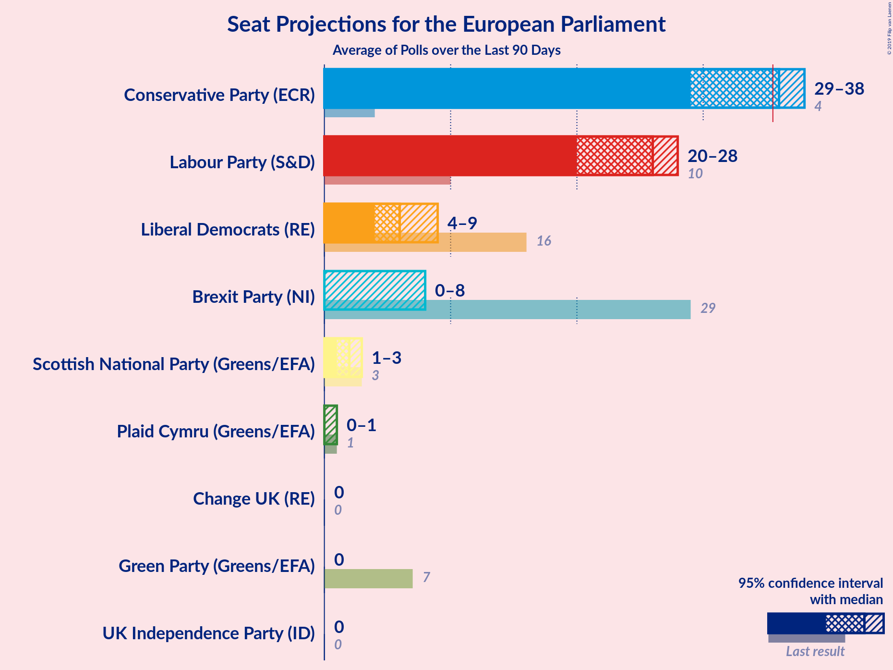
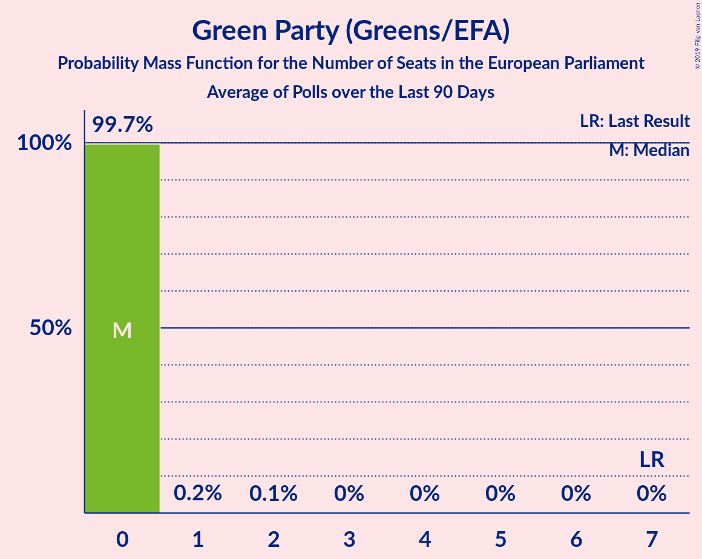
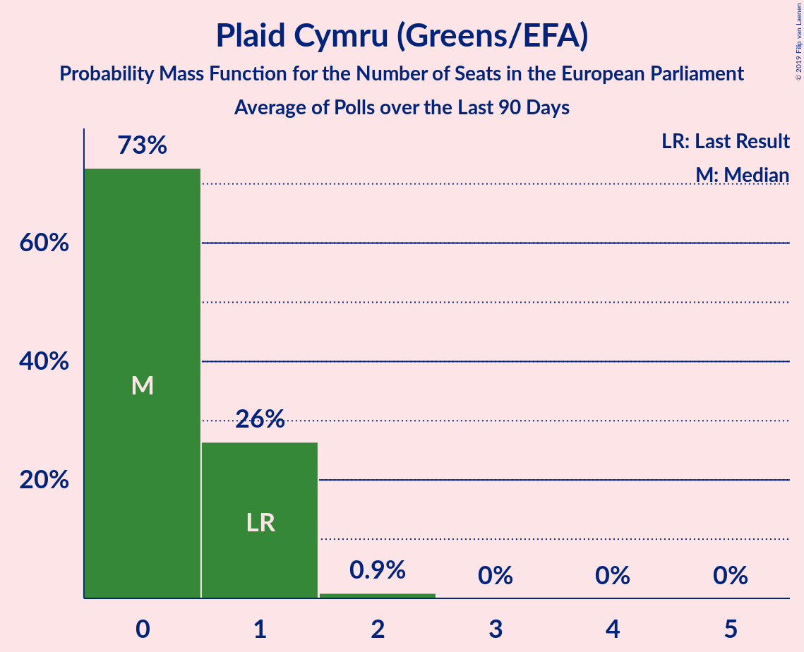

# Poll Average

<a href="#voting-intentions">Voting Intentions</a> | <a href="#seats">Seats</a> | <a href="#coalitions">Coalitions</a> | <a href="#technical-information">Technical Information</a>

## Summary

The table below lists the polls on which the average is based. They are the most recent polls (less than 90 days old) registered and analyzed so far.

| Period     | Polling firm/Commissioner(s) | BREXIT | LIBDEM | LAB | GREEN | CON | SNP | PC | ChUK | UKIP |
|:----------:|:----------------------------:|:--:|:--:|:--:|:--:|:--:|:--:|:--:|:--:|:--:|
| 23 May 2019 | General Election | 30.5%   29 | 19.6%   16 | 13.7%   10 | 11.8%   7 | 8.8%   4 | 3.5%   3 | 1.0%   1 | 3.3%   0 | 3.2%   0 |
| N/A | Poll Average | 7–14%   1–9 | 15–22%   10–17 | 21–30%   16–24 | 2–8%   0–2 | 30–40%   24–35 | 2–5%   1–3 | 1–2%   0–2 | 0–1%   0 | 0–2%   0 |
| [20–21 October 2019](2019-10-21-YouGov.html) | YouGov   The Times | 9–12%   6–8 | 17–21%   10–16 | 20–24%   15–18 | 6–8%   0–2 | 34–39%   27–32 | 2–4%   1–3 | 1–2%   0–2 | 0–1%   0 | 1–2%   0 |
| [18–21 October 2019](2019-10-21-Deltapoll.html) | Deltapoll | 10–12%   6 | 17–21%   12–15 | 22–26%   16–17 | 2–4%   0 | 35–39%   30–32 | 3–5%   2 | 1–2%   1 | N/A   N/A | 1–2%   0 |
| [17–18 October 2019](2019-10-18-Survation.html) | Survation   Daily Mail | 11–15%   7–10 | 19–24%   13–19 | 21–27%   15–21 | 1–3%   0 | 29–35%   24–29 | 3–5%   2–3 | N/A   N/A | N/A   N/A | N/A   N/A |
| [17–18 October 2019](2019-10-18-Panelbase.html) | Panelbase | 9–13%   7 | 15–20%   11–12 | 25–30%   18–21 | 2–4%   0 | 34–40%   26–31 | 3–5%   2–3 | N/A   N/A | N/A   N/A | 0–1%   0 |
| [15–17 October 2019](2019-10-17-Opinium.html) | Opinium   The Observer | 11–13%   6–7 | 14–17%   10–11 | 22–26%   17–18 | 3–5%   0 | 34–39%   32 | 3–5%   2–3 | 1–2%   1 | 0–1%   0 | 1–3%   0 |
| [16–17 October 2019](2019-10-17-ComRes.html) | ComRes   Britain Elects | 11–13%   6–8 | 16–20%   9–13 | 27–31%   21–24 | 3–5%   0 | 31–35%   24–28 | N/A   N/A | N/A   N/A | N/A   N/A | N/A   N/A |
| [10–15 October 2019](2019-10-15-KantarPublic.html) | Kantar Public | 7–10%   1–6 | 16–20%   9–14 | 23–28%   16–23 | 2–4%   0 | 37–42%   30–38 | 2–4%   1–2 | 1–2%   0–2 | 0–1%   0 | 1–2%   0 |
| [1–4 October 2019](2019-10-04-BMGResearch.html) | BMG Research   The Independent | 10–13%   5–7 | 18–22%   12–16 | 24–28%   18–24 | 6–8%   0–2 | 29–34%   23–26 | 2–4%   1–3 | 1–2%   0–2 | N/A   N/A | 0–1%   0 |
| 23 May 2019 | General Election | 30.5%   29 | 19.6%   16 | 13.7%   10 | 11.8%   7 | 8.8%   4 | 3.5%   3 | 1.0%   1 | 3.3%   0 | 3.2%   0 |

Only polls for which at least the sample size has been published are included in the table above.

**Legend:**
+ **Top half of each row:** Voting intentions (95% confidence interval)
+ **Bottom half of each row:** Seat projections for the European Parliament (95% confidence interval)
+ **BREXIT:** Brexit Party (NI)
+ **LIBDEM:** Liberal Democrats (RE)
+ **LAB:** Labour Party (S&D)
+ **GREEN:** Green Party (Greens/EFA)
+ **CON:** Conservative Party (ECR)
+ **SNP:** Scottish National Party (Greens/EFA)
+ **PC:** Plaid Cymru (Greens/EFA)
+ **ChUK:** Change UK (RE)
+ **UKIP:** UK Independence Party (ID)
+ **N/A (single party):** Party not included the published results
+ **N/A (entire row):** Calculation for this opinion poll not started yet

## Voting Intentions

### Confidence Intervals

| Party | Last Result | Median | 80% Confidence Interval | 90% Confidence Interval | 95% Confidence Interval | 99% Confidence Interval |
|:-----:|:-----------:|:------:|:-----------------------:|:-----------------------:|:-----------------------:|:-----------------------:|
| <a href="#brexit-party-(ni)">Brexit Party (NI)</a> | 30.5% | 11.3% | 8.7–12.9% |7.9–13.5% | 7.4–14.0% | 6.8–14.9% |
| <a href="#liberal-democrats-(re)">Liberal Democrats (RE)</a> | 19.6% | 18.5% | 16.1–20.9% |15.5–21.6% | 15.1–22.2% | 14.4–23.3% |
| <a href="#labour-party-(s&d)">Labour Party (S&D)</a> | 13.7% | 24.9% | 22.1–28.7% |21.4–29.5% | 20.8–30.0% | 20.0–30.9% |
| <a href="#green-party-(greens/efa)">Green Party (Greens/EFA)</a> | 11.8% | 3.7% | 2.3–7.2% |2.0–7.6% | 1.8–7.9% | 1.4–8.4% |
| <a href="#conservative-party-(ecr)">Conservative Party (ECR)</a> | 8.8% | 35.8% | 31.2–38.8% |30.4–39.7% | 29.9–40.5% | 28.9–41.8% |
| <a href="#scottish-national-party-(greens/efa)">Scottish National Party (Greens/EFA)</a> | 3.5% | 3.6% | 2.7–4.5% |2.5–4.8% | 2.4–5.1% | 2.1–5.6% |
| <a href="#change-uk-(re)">Change UK (RE)</a> | 3.3% | 0.3% | 0.1–0.5% |0.1–0.6% | 0.1–0.6% | 0.1–0.8% |
| <a href="#uk-independence-party-(id)">UK Independence Party (ID)</a> | 3.2% | 0.9% | 0.3–2.0% |0.2–2.2% | 0.1–2.4% | 0.1–2.7% |
| <a href="#plaid-cymru-(greens/efa)">Plaid Cymru (Greens/EFA)</a> | 1.0% | 1.0% | 0.8–1.4% |0.7–1.5% | 0.6–1.6% | 0.5–1.9% |

### Brexit Party (NI)

*For a full overview of the results for this party, see the [Brexit Party (NI)](party-brexitpartyni.html) page.*

| Voting Intentions | Probability | Accumulated | Special Marks |
|:-----------------:|:-----------:|:-----------:|:-------------:|
| 4.5–5.5% | 0% | 100% |  |
| 5.5–6.5% | 0.3% | 100% |  |
| 6.5–7.5% | 3% | 99.7% |  |
| 7.5–8.5% | 6% | 97% |  |
| 8.5–9.5% | 4% | 91% |  |
| 9.5–10.5% | 13% | 87% |  |
| 10.5–11.5% | 31% | 73% | Median |
| 11.5–12.5% | 27% | 42% |  |
| 12.5–13.5% | 11% | 16% |  |
| 13.5–14.5% | 3% | 4% |  |
| 14.5–15.5% | 0.9% | 1.0% |  |
| 15.5–16.5% | 0.1% | 0.1% |  |
| 16.5–17.5% | 0% | 0% |  |
| 17.5–18.5% | 0% | 0% |  |
| 18.5–19.5% | 0% | 0% |  |
| 19.5–20.5% | 0% | 0% |  |
| 20.5–21.5% | 0% | 0% |  |
| 21.5–22.5% | 0% | 0% |  |
| 22.5–23.5% | 0% | 0% |  |
| 23.5–24.5% | 0% | 0% |  |
| 24.5–25.5% | 0% | 0% |  |
| 25.5–26.5% | 0% | 0% |  |
| 26.5–27.5% | 0% | 0% |  |
| 27.5–28.5% | 0% | 0% |  |
| 28.5–29.5% | 0% | 0% |  |
| 29.5–30.5% | 0% | 0% |  |
| 30.5–31.5% | 0% | 0% | Last Result |

### Liberal Democrats (RE)

*For a full overview of the results for this party, see the [Liberal Democrats (RE)](party-liberaldemocratsre.html) page.*

| Voting Intentions | Probability | Accumulated | Special Marks |
|:-----------------:|:-----------:|:-----------:|:-------------:|
| 12.5–13.5% | 0% | 100% |  |
| 13.5–14.5% | 0.8% | 100% |  |
| 14.5–15.5% | 5% | 99.2% |  |
| 15.5–16.5% | 9% | 94% |  |
| 16.5–17.5% | 14% | 85% |  |
| 17.5–18.5% | 22% | 71% |  |
| 18.5–19.5% | 22% | 50% | Median |
| 19.5–20.5% | 14% | 28% | Last Result |
| 20.5–21.5% | 8% | 13% |  |
| 21.5–22.5% | 4% | 5% |  |
| 22.5–23.5% | 1.2% | 2% |  |
| 23.5–24.5% | 0.3% | 0.3% |  |
| 24.5–25.5% | 0% | 0% |  |
| 25.5–26.5% | 0% | 0% |  |

### Labour Party (S&D)

*For a full overview of the results for this party, see the [Labour Party (S&D)](party-labourpartysd.html) page.*

| Voting Intentions | Probability | Accumulated | Special Marks |
|:-----------------:|:-----------:|:-----------:|:-------------:|
| 13.5–14.5% | 0% | 100% | Last Result |
| 14.5–15.5% | 0% | 100% |  |
| 15.5–16.5% | 0% | 100% |  |
| 16.5–17.5% | 0% | 100% |  |
| 17.5–18.5% | 0% | 100% |  |
| 18.5–19.5% | 0.2% | 100% |  |
| 19.5–20.5% | 1.4% | 99.8% |  |
| 20.5–21.5% | 5% | 98% |  |
| 21.5–22.5% | 8% | 94% |  |
| 22.5–23.5% | 13% | 86% |  |
| 23.5–24.5% | 17% | 73% |  |
| 24.5–25.5% | 15% | 55% | Median |
| 25.5–26.5% | 12% | 40% |  |
| 26.5–27.5% | 9% | 28% |  |
| 27.5–28.5% | 8% | 19% |  |
| 28.5–29.5% | 7% | 11% |  |
| 29.5–30.5% | 3% | 4% |  |
| 30.5–31.5% | 0.9% | 1.0% |  |
| 31.5–32.5% | 0.1% | 0.1% |  |
| 32.5–33.5% | 0% | 0% |  |

### Green Party (Greens/EFA)

*For a full overview of the results for this party, see the [Green Party (Greens/EFA)](party-greenpartygreensefa.html) page.*

| Voting Intentions | Probability | Accumulated | Special Marks |
|:-----------------:|:-----------:|:-----------:|:-------------:|
| 0.0–0.5% | 0% | 100% |  |
| 0.5–1.5% | 1.1% | 100% |  |
| 1.5–2.5% | 14% | 98.9% |  |
| 2.5–3.5% | 32% | 85% |  |
| 3.5–4.5% | 25% | 53% | Median |
| 4.5–5.5% | 3% | 28% |  |
| 5.5–6.5% | 6% | 25% |  |
| 6.5–7.5% | 14% | 19% |  |
| 7.5–8.5% | 5% | 5% |  |
| 8.5–9.5% | 0.3% | 0.3% |  |
| 9.5–10.5% | 0% | 0% |  |
| 10.5–11.5% | 0% | 0% |  |
| 11.5–12.5% | 0% | 0% | Last Result |

### Conservative Party (ECR)

*For a full overview of the results for this party, see the [Conservative Party (ECR)](party-conservativepartyecr.html) page.*

| Voting Intentions | Probability | Accumulated | Special Marks |
|:-----------------:|:-----------:|:-----------:|:-------------:|
| 8.5–9.5% | 0% | 100% | Last Result |
| 9.5–10.5% | 0% | 100% |  |
| 10.5–11.5% | 0% | 100% |  |
| 11.5–12.5% | 0% | 100% |  |
| 12.5–13.5% | 0% | 100% |  |
| 13.5–14.5% | 0% | 100% |  |
| 14.5–15.5% | 0% | 100% |  |
| 15.5–16.5% | 0% | 100% |  |
| 16.5–17.5% | 0% | 100% |  |
| 17.5–18.5% | 0% | 100% |  |
| 18.5–19.5% | 0% | 100% |  |
| 19.5–20.5% | 0% | 100% |  |
| 20.5–21.5% | 0% | 100% |  |
| 21.5–22.5% | 0% | 100% |  |
| 22.5–23.5% | 0% | 100% |  |
| 23.5–24.5% | 0% | 100% |  |
| 24.5–25.5% | 0% | 100% |  |
| 25.5–26.5% | 0% | 100% |  |
| 26.5–27.5% | 0% | 100% |  |
| 27.5–28.5% | 0.2% | 100% |  |
| 28.5–29.5% | 1.3% | 99.8% |  |
| 29.5–30.5% | 4% | 98% |  |
| 30.5–31.5% | 8% | 94% |  |
| 31.5–32.5% | 10% | 87% |  |
| 32.5–33.5% | 9% | 77% |  |
| 33.5–34.5% | 6% | 68% |  |
| 34.5–35.5% | 8% | 62% |  |
| 35.5–36.5% | 15% | 53% | Median |
| 36.5–37.5% | 16% | 38% |  |
| 37.5–38.5% | 10% | 22% |  |
| 38.5–39.5% | 6% | 12% |  |
| 39.5–40.5% | 3% | 6% |  |
| 40.5–41.5% | 2% | 2% |  |
| 41.5–42.5% | 0.6% | 0.7% |  |
| 42.5–43.5% | 0.1% | 0.1% |  |
| 43.5–44.5% | 0% | 0% |  |

### Scottish National Party (Greens/EFA)

*For a full overview of the results for this party, see the [Scottish National Party (Greens/EFA)](party-scottishnationalpartygreensefa.html) page.*

| Voting Intentions | Probability | Accumulated | Special Marks |
|:-----------------:|:-----------:|:-----------:|:-------------:|
| 0.5–1.5% | 0% | 100% |  |
| 1.5–2.5% | 5% | 100% |  |
| 2.5–3.5% | 41% | 95% |  |
| 3.5–4.5% | 44% | 54% | Last Result, Median |
| 4.5–5.5% | 9% | 10% |  |
| 5.5–6.5% | 0.5% | 0.5% |  |
| 6.5–7.5% | 0% | 0% |  |

### Change UK (RE)

*For a full overview of the results for this party, see the [Change UK (RE)](party-changeukre.html) page.*

| Voting Intentions | Probability | Accumulated | Special Marks |
|:-----------------:|:-----------:|:-----------:|:-------------:|
| 0.0–0.5% | 94% | 100% | Median |
| 0.5–1.5% | 6% | 6% |  |
| 1.5–2.5% | 0% | 0% |  |
| 2.5–3.5% | 0% | 0% | Last Result |

### UK Independence Party (ID)

*For a full overview of the results for this party, see the [UK Independence Party (ID)](party-ukindependencepartyid.html) page.*

| Voting Intentions | Probability | Accumulated | Special Marks |
|:-----------------:|:-----------:|:-----------:|:-------------:|
| 0.0–0.5% | 29% | 100% |  |
| 0.5–1.5% | 53% | 71% | Median |
| 1.5–2.5% | 17% | 18% |  |
| 2.5–3.5% | 1.1% | 1.1% | Last Result |
| 3.5–4.5% | 0% | 0% |  |

### Plaid Cymru (Greens/EFA)

*For a full overview of the results for this party, see the [Plaid Cymru (Greens/EFA)](party-plaidcymrugreensefa.html) page.*

| Voting Intentions | Probability | Accumulated | Special Marks |
|:-----------------:|:-----------:|:-----------:|:-------------:|
| 0.0–0.5% | 0.9% | 100% |  |
| 0.5–1.5% | 95% | 99.1% | Last Result, Median |
| 1.5–2.5% | 4% | 4% |  |
| 2.5–3.5% | 0% | 0% |  |

## Seats

### Confidence Intervals

| Party | Last Result | Median | 80% Confidence Interval | 90% Confidence Interval | 95% Confidence Interval | 99% Confidence Interval |
|:-----:|:-----------:|:------:|:-----------------------:|:-----------------------:|:-----------------------:|:-----------------------:|
| <a href="#brexit-party-(ni)">Brexit Party (NI)</a> | 29 | 7 | 4–7 |1–8 | 1–9 | 1–10 |
| <a href="#liberal-democrats-(re)">Liberal Democrats (RE)</a> | 16 | 12 | 10–15 |10–16 | 10–17 | 9–19 |
| <a href="#labour-party-(s&d)">Labour Party (S&D)</a> | 10 | 19 | 16–22 |16–23 | 16–24 | 15–24 |
| <a href="#green-party-(greens/efa)">Green Party (Greens/EFA)</a> | 7 | 0 | 0–2 |0–2 | 0–2 | 0–2 |
| <a href="#conservative-party-(ecr)">Conservative Party (ECR)</a> | 4 | 29 | 24–32 |24–34 | 24–35 | 23–37 |
| <a href="#scottish-national-party-(greens/efa)">Scottish National Party (Greens/EFA)</a> | 3 | 2 | 2–3 |1–3 | 1–3 | 1–3 |
| <a href="#change-uk-(re)">Change UK (RE)</a> | 0 | 0 | 0 |0 | 0 | 0 |
| <a href="#uk-independence-party-(id)">UK Independence Party (ID)</a> | 0 | 0 | 0 |0 | 0 | 0 |
| <a href="#plaid-cymru-(greens/efa)">Plaid Cymru (Greens/EFA)</a> | 1 | 1 | 1–2 |1–2 | 0–2 | 0–2 |

### Brexit Party (NI)

*For a full overview of the results for this party, see the [Brexit Party (NI)](party-brexitpartyni.html) page.*

| Number of Seats | Probability | Accumulated | Special Marks |
|:---------------:|:-----------:|:-----------:|:-------------:|
| 0 | 0.2% | 100% |  |
| 1 | 6% | 99.8% |  |
| 2 | 1.1% | 93% |  |
| 3 | 1.2% | 92% |  |
| 4 | 1.1% | 91% |  |
| 5 | 2% | 90% |  |
| 6 | 36% | 88% |  |
| 7 | 42% | 52% | Median |
| 8 | 6% | 10% |  |
| 9 | 2% | 4% |  |
| 10 | 2% | 2% |  |
| 11 | 0% | 0% |  |
| 12 | 0% | 0% |  |
| 13 | 0% | 0% |  |
| 14 | 0% | 0% |  |
| 15 | 0% | 0% |  |
| 16 | 0% | 0% |  |
| 17 | 0% | 0% |  |
| 18 | 0% | 0% |  |
| 19 | 0% | 0% |  |
| 20 | 0% | 0% |  |
| 21 | 0% | 0% |  |
| 22 | 0% | 0% |  |
| 23 | 0% | 0% |  |
| 24 | 0% | 0% |  |
| 25 | 0% | 0% |  |
| 26 | 0% | 0% |  |
| 27 | 0% | 0% |  |
| 28 | 0% | 0% |  |
| 29 | 0% | 0% | Last Result |

### Liberal Democrats (RE)

*For a full overview of the results for this party, see the [Liberal Democrats (RE)](party-liberaldemocratsre.html) page.*

| Number of Seats | Probability | Accumulated | Special Marks |
|:---------------:|:-----------:|:-----------:|:-------------:|
| 7 | 0.1% | 100% |  |
| 8 | 0.2% | 99.9% |  |
| 9 | 0.8% | 99.7% |  |
| 10 | 14% | 98.9% |  |
| 11 | 11% | 85% |  |
| 12 | 26% | 74% | Median |
| 13 | 17% | 48% |  |
| 14 | 10% | 31% |  |
| 15 | 14% | 22% |  |
| 16 | 4% | 7% | Last Result |
| 17 | 1.2% | 3% |  |
| 18 | 1.1% | 2% |  |
| 19 | 0.6% | 0.6% |  |
| 20 | 0% | 0% |  |

### Labour Party (S&D)

*For a full overview of the results for this party, see the [Labour Party (S&D)](party-labourpartysd.html) page.*

| Number of Seats | Probability | Accumulated | Special Marks |
|:---------------:|:-----------:|:-----------:|:-------------:|
| 10 | 0% | 100% | Last Result |
| 11 | 0% | 100% |  |
| 12 | 0% | 100% |  |
| 13 | 0% | 100% |  |
| 14 | 0% | 100% |  |
| 15 | 1.3% | 100% |  |
| 16 | 19% | 98.7% |  |
| 17 | 12% | 79% |  |
| 18 | 13% | 67% |  |
| 19 | 13% | 54% | Median |
| 20 | 6% | 41% |  |
| 21 | 22% | 36% |  |
| 22 | 6% | 14% |  |
| 23 | 5% | 7% |  |
| 24 | 2% | 3% |  |
| 25 | 0.4% | 0.4% |  |
| 26 | 0% | 0% |  |

### Green Party (Greens/EFA)

*For a full overview of the results for this party, see the [Green Party (Greens/EFA)](party-greenpartygreensefa.html) page.*

| Number of Seats | Probability | Accumulated | Special Marks |
|:---------------:|:-----------:|:-----------:|:-------------:|
| 0 | 83% | 100% | Median |
| 1 | 5% | 17% |  |
| 2 | 11% | 11% |  |
| 3 | 0% | 0% |  |
| 4 | 0% | 0% |  |
| 5 | 0% | 0% |  |
| 6 | 0% | 0% |  |
| 7 | 0% | 0% | Last Result |

### Conservative Party (ECR)

*For a full overview of the results for this party, see the [Conservative Party (ECR)](party-conservativepartyecr.html) page.*

| Number of Seats | Probability | Accumulated | Special Marks |
|:---------------:|:-----------:|:-----------:|:-------------:|
| 4 | 0% | 100% | Last Result |
| 5 | 0% | 100% |  |
| 6 | 0% | 100% |  |
| 7 | 0% | 100% |  |
| 8 | 0% | 100% |  |
| 9 | 0% | 100% |  |
| 10 | 0% | 100% |  |
| 11 | 0% | 100% |  |
| 12 | 0% | 100% |  |
| 13 | 0% | 100% |  |
| 14 | 0% | 100% |  |
| 15 | 0% | 100% |  |
| 16 | 0% | 100% |  |
| 17 | 0% | 100% |  |
| 18 | 0% | 100% |  |
| 19 | 0% | 100% |  |
| 20 | 0% | 100% |  |
| 21 | 0% | 100% |  |
| 22 | 0% | 100% |  |
| 23 | 1.0% | 100% |  |
| 24 | 13% | 99.0% |  |
| 25 | 11% | 86% |  |
| 26 | 17% | 75% |  |
| 27 | 5% | 58% |  |
| 28 | 3% | 53% |  |
| 29 | 2% | 50% | Median |
| 30 | 10% | 48% |  |
| 31 | 7% | 38% |  |
| 32 | 23% | 31% |  |
| 33 | 2% | 8% |  |
| 34 | 3% | 6% |  |
| 35 | 2% | 3% |  |
| 36 | 0.9% | 1.4% | Majority |
| 37 | 0.2% | 0.5% |  |
| 38 | 0.3% | 0.3% |  |
| 39 | 0% | 0% |  |

### Scottish National Party (Greens/EFA)

*For a full overview of the results for this party, see the [Scottish National Party (Greens/EFA)](party-scottishnationalpartygreensefa.html) page.*

| Number of Seats | Probability | Accumulated | Special Marks |
|:---------------:|:-----------:|:-----------:|:-------------:|
| 1 | 7% | 100% |  |
| 2 | 65% | 93% | Median |
| 3 | 28% | 28% | Last Result |
| 4 | 0.1% | 0.1% |  |
| 5 | 0% | 0% |  |

### Change UK (RE)

*For a full overview of the results for this party, see the [Change UK (RE)](party-changeukre.html) page.*

| Number of Seats | Probability | Accumulated | Special Marks |
|:---------------:|:-----------:|:-----------:|:-------------:|
| 0 | 100% | 100% | Last Result, Median |

### UK Independence Party (ID)

*For a full overview of the results for this party, see the [UK Independence Party (ID)](party-ukindependencepartyid.html) page.*

| Number of Seats | Probability | Accumulated | Special Marks |
|:---------------:|:-----------:|:-----------:|:-------------:|
| 0 | 100% | 100% | Last Result, Median |

### Plaid Cymru (Greens/EFA)

*For a full overview of the results for this party, see the [Plaid Cymru (Greens/EFA)](party-plaidcymrugreensefa.html) page.*

| Number of Seats | Probability | Accumulated | Special Marks |
|:---------------:|:-----------:|:-----------:|:-------------:|
| 0 | 3% | 100% |  |
| 1 | 85% | 97% | Last Result, Median |
| 2 | 11% | 11% |  |
| 3 | 0% | 0% |  |

## Coalitions

### Confidence Intervals

| Coalition | Last Result | Median | Majority? | 80% Confidence Interval | 90% Confidence Interval | 95% Confidence Interval | 99% Confidence Interval |
|:---------:|:-----------:|:------:|:---------:|:-----------------------:|:-----------------------:|:-----------------------:|:-----------------------:|
| Conservative Party (ECR) | 4 | 29 | 1.4% | 24–32 | 24–34 | 24–35 | 23–37 |
| Labour Party (S&D) | 10 | 19 | 0% | 16–22 | 16–23 | 16–24 | 15–24 |
| Liberal Democrats (RE) – Change UK (RE) | 16 | 12 | 0% | 10–15 | 10–16 | 10–17 | 9–19 |
| Brexit Party (NI) | 29 | 7 | 0% | 4–7 | 1–8 | 1–9 | 1–10 |
| Green Party (Greens/EFA) – Scottish National Party (Greens/EFA) – Plaid Cymru (Greens/EFA) | 11 | 3 | 0% | 3–5 | 3–5 | 2–5 | 2–6 |
| UK Independence Party (ID) | 0 | 0 | 0% | 0 | 0 | 0 | 0 |

### Conservative Party (ECR)

| Number of Seats | Probability | Accumulated | Special Marks |
|:---------------:|:-----------:|:-----------:|:-------------:|
| 4 | 0% | 100% | Last Result |
| 5 | 0% | 100% |  |
| 6 | 0% | 100% |  |
| 7 | 0% | 100% |  |
| 8 | 0% | 100% |  |
| 9 | 0% | 100% |  |
| 10 | 0% | 100% |  |
| 11 | 0% | 100% |  |
| 12 | 0% | 100% |  |
| 13 | 0% | 100% |  |
| 14 | 0% | 100% |  |
| 15 | 0% | 100% |  |
| 16 | 0% | 100% |  |
| 17 | 0% | 100% |  |
| 18 | 0% | 100% |  |
| 19 | 0% | 100% |  |
| 20 | 0% | 100% |  |
| 21 | 0% | 100% |  |
| 22 | 0% | 100% |  |
| 23 | 1.0% | 100% |  |
| 24 | 13% | 99.0% |  |
| 25 | 11% | 86% |  |
| 26 | 17% | 75% |  |
| 27 | 5% | 58% |  |
| 28 | 3% | 53% |  |
| 29 | 2% | 50% | Median |
| 30 | 10% | 48% |  |
| 31 | 7% | 38% |  |
| 32 | 23% | 31% |  |
| 33 | 2% | 8% |  |
| 34 | 3% | 6% |  |
| 35 | 2% | 3% |  |
| 36 | 0.9% | 1.4% | Majority |
| 37 | 0.2% | 0.5% |  |
| 38 | 0.3% | 0.3% |  |
| 39 | 0% | 0% |  |

### Labour Party (S&D)

| Number of Seats | Probability | Accumulated | Special Marks |
|:---------------:|:-----------:|:-----------:|:-------------:|
| 10 | 0% | 100% | Last Result |
| 11 | 0% | 100% |  |
| 12 | 0% | 100% |  |
| 13 | 0% | 100% |  |
| 14 | 0% | 100% |  |
| 15 | 1.3% | 100% |  |
| 16 | 19% | 98.7% |  |
| 17 | 12% | 79% |  |
| 18 | 13% | 67% |  |
| 19 | 13% | 54% | Median |
| 20 | 6% | 41% |  |
| 21 | 22% | 36% |  |
| 22 | 6% | 14% |  |
| 23 | 5% | 7% |  |
| 24 | 2% | 3% |  |
| 25 | 0.4% | 0.4% |  |
| 26 | 0% | 0% |  |

### Liberal Democrats (RE) – Change UK (RE)

| Number of Seats | Probability | Accumulated | Special Marks |
|:---------------:|:-----------:|:-----------:|:-------------:|
| 7 | 0.1% | 100% |  |
| 8 | 0.2% | 99.9% |  |
| 9 | 0.8% | 99.7% |  |
| 10 | 14% | 98.9% |  |
| 11 | 11% | 85% |  |
| 12 | 26% | 74% | Median |
| 13 | 17% | 48% |  |
| 14 | 10% | 31% |  |
| 15 | 14% | 22% |  |
| 16 | 4% | 7% | Last Result |
| 17 | 1.2% | 3% |  |
| 18 | 1.1% | 2% |  |
| 19 | 0.6% | 0.6% |  |
| 20 | 0% | 0% |  |

### Brexit Party (NI)

| Number of Seats | Probability | Accumulated | Special Marks |
|:---------------:|:-----------:|:-----------:|:-------------:|
| 0 | 0.2% | 100% |  |
| 1 | 6% | 99.8% |  |
| 2 | 1.1% | 93% |  |
| 3 | 1.2% | 92% |  |
| 4 | 1.1% | 91% |  |
| 5 | 2% | 90% |  |
| 6 | 36% | 88% |  |
| 7 | 42% | 52% | Median |
| 8 | 6% | 10% |  |
| 9 | 2% | 4% |  |
| 10 | 2% | 2% |  |
| 11 | 0% | 0% |  |
| 12 | 0% | 0% |  |
| 13 | 0% | 0% |  |
| 14 | 0% | 0% |  |
| 15 | 0% | 0% |  |
| 16 | 0% | 0% |  |
| 17 | 0% | 0% |  |
| 18 | 0% | 0% |  |
| 19 | 0% | 0% |  |
| 20 | 0% | 0% |  |
| 21 | 0% | 0% |  |
| 22 | 0% | 0% |  |
| 23 | 0% | 0% |  |
| 24 | 0% | 0% |  |
| 25 | 0% | 0% |  |
| 26 | 0% | 0% |  |
| 27 | 0% | 0% |  |
| 28 | 0% | 0% |  |
| 29 | 0% | 0% | Last Result |

### Green Party (Greens/EFA) – Scottish National Party (Greens/EFA) – Plaid Cymru (Greens/EFA)

| Number of Seats | Probability | Accumulated | Special Marks |
|:---------------:|:-----------:|:-----------:|:-------------:|
| 1 | 0.4% | 100% |  |
| 2 | 4% | 99.6% |  |
| 3 | 53% | 96% | Median |
| 4 | 32% | 43% |  |
| 5 | 9% | 11% |  |
| 6 | 2% | 2% |  |
| 7 | 0% | 0% |  |
| 8 | 0% | 0% |  |
| 9 | 0% | 0% |  |
| 10 | 0% | 0% |  |
| 11 | 0% | 0% | Last Result |

### UK Independence Party (ID)

| Number of Seats | Probability | Accumulated | Special Marks |
|:---------------:|:-----------:|:-----------:|:-------------:|
| 0 | 100% | 100% | Last Result, Median |

## Technical Information

+ **Number of polls included in this average:** 8
+ **Lowest number of simulations done in a poll included in this average:** 1,024
+ **Total number of simulations done in the polls included in this average:** 658,432
+ **Error estimate:** 2.62%
