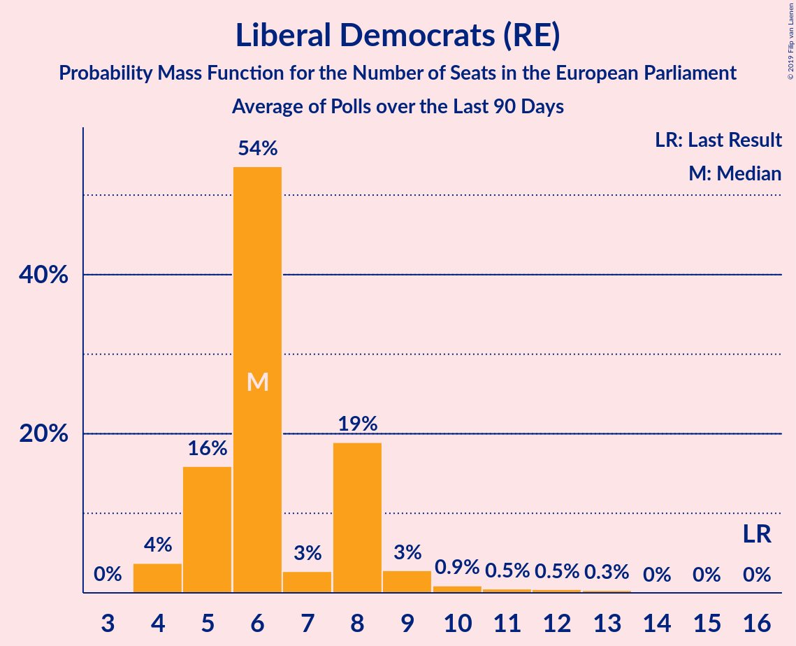
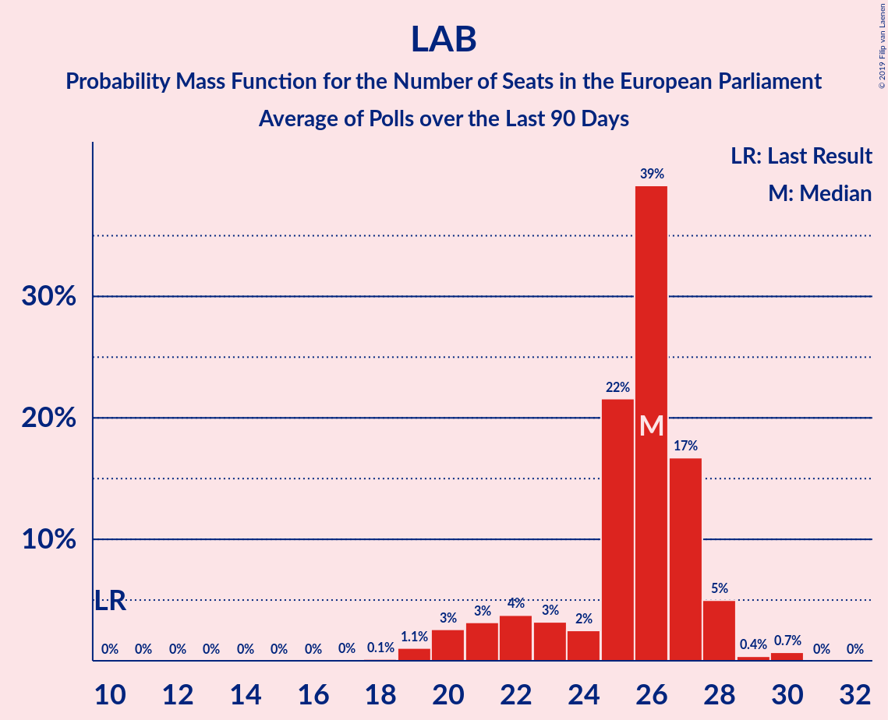

# Poll Average

<a href="#voting-intentions">Voting Intentions</a> | <a href="#seats">Seats</a> | <a href="#coalitions">Coalitions</a> | <a href="#technical-information">Technical Information</a>

## Summary

The table below lists the polls on which the average is based. They are the most recent polls (less than 90 days old) registered and analyzed so far.

| Period     | Polling firm/Commissioner(s) | BREXIT | LIBDEM | LAB | GREEN | CON | SNP | PC | ChUK | UKIP |
|:----------:|:----------------------------:|:--:|:--:|:--:|:--:|:--:|:--:|:--:|:--:|:--:|
| 23 May 2019 | General Election | 30.5%   29 | 19.6%   16 | 13.7%   10 | 11.8%   7 | 8.8%   4 | 3.5%   3 | 1.0%   1 | 3.3%   0 | 3.2%   0 |
| N/A | Poll Average | 2–13%   0–9 | 12–18%   6–12 | 25–33%   19–26 | 2–5%   0 | 35–47%   28–39 | 2–6%   1–3 | 0–2%   0–2 | N/A   N/A | N/A   N/A |
| [21–23 November 2019](2019-11-23-Deltapoll.html) | Deltapoll | N/A   N/A | N/A   N/A | N/A   N/A | N/A   N/A | N/A   N/A | N/A   N/A | N/A   N/A | N/A   N/A | N/A   N/A |
| [21–22 November 2019](2019-11-22-YouGov.html) | YouGov   The Sunday Times | N/A   N/A | N/A   N/A | N/A   N/A | N/A   N/A | N/A   N/A | N/A   N/A | N/A   N/A | N/A   N/A | N/A   N/A |
| [20–22 November 2019](2019-11-22-Panelbase.html) | Panelbase | N/A   N/A | N/A   N/A | N/A   N/A | N/A   N/A | N/A   N/A | N/A   N/A | N/A   N/A | N/A   N/A | N/A   N/A |
| [20–22 November 2019](2019-11-22-Opinium.html) | Opinium   The Observer | N/A   N/A | N/A   N/A | N/A   N/A | N/A   N/A | N/A   N/A | N/A   N/A | N/A   N/A | N/A   N/A | N/A   N/A |
| [20–21 November 2019](2019-11-21-ComRes.html) | ComRes   The Sunday Express | N/A   N/A | N/A   N/A | N/A   N/A | N/A   N/A | N/A   N/A | N/A   N/A | N/A   N/A | N/A   N/A | N/A   N/A |
| [19–21 November 2019](2019-11-21-BMGResearch.html) | BMG Research | N/A   N/A | N/A   N/A | N/A   N/A | N/A   N/A | N/A   N/A | N/A   N/A | N/A   N/A | N/A   N/A | N/A   N/A |
| [15–19 November 2019](2019-11-19-IpsosMORI.html) | Ipsos MORI   Evening Standard | 2–4%   0 | 14–18%   6–13 | 25–31%   19–25 | 2–4%   0 | 41–47%   33–39 | 3–5%   2–3 | 1–2%   0–2 | N/A   N/A | N/A   N/A |
| [14–18 November 2019](2019-11-18-KantarPublic.html) | Kantar Public | 1–3%   0 | 14–18%   7–13 | 25–30%   17–24 | 2–4%   0 | 42–48%   34–40 | 3–5%   2–3 | 1–2%   0–2 | N/A   N/A | N/A   N/A |
| [15–18 November 2019](2019-11-18-ICMResearch.html) | ICM Research | 4–6%   0 | 12–15%   5–8 | 30–34%   25–27 | 2–4%   0 | 40–44%   34–38 | 2–4%   1–2 | 0–1%   0 | N/A   N/A | N/A   N/A |
| [14–16 November 2019](2019-11-16-Survation.html) | Survation | 4–7%   0–1 | 11–15%   6–8 | 26–31%   20–26 | 2–4%   0 | 39–45%   33–39 | 2–4%   1–2 | 1–2%   0–2 | N/A   N/A | N/A   N/A |
| [30–31 October 2019](2019-10-31-ORB.html) | ORB   The Telegraph | 11–13%   6–9 | 13–16%   6–9 | 26–30%   20–26 | 3–5%   0 | 34–38%   27–32 | 4–6%   2–3 | 0–1%   0 | N/A   N/A | N/A   N/A |
| 23 May 2019 | General Election | 30.5%   29 | 19.6%   16 | 13.7%   10 | 11.8%   7 | 8.8%   4 | 3.5%   3 | 1.0%   1 | 3.3%   0 | 3.2%   0 |

Only polls for which at least the sample size has been published are included in the table above.

**Legend:**
+ **Top half of each row:** Voting intentions (95% confidence interval)
+ **Bottom half of each row:** Seat projections for the European Parliament (95% confidence interval)
+ **BREXIT:** Brexit Party (NI)
+ **LIBDEM:** Liberal Democrats (RE)
+ **LAB:** Labour Party (S&D)
+ **GREEN:** Green Party (Greens/EFA)
+ **CON:** Conservative Party (ECR)
+ **SNP:** Scottish National Party (Greens/EFA)
+ **PC:** Plaid Cymru (Greens/EFA)
+ **ChUK:** Change UK (RE)
+ **UKIP:** UK Independence Party (ID)
+ **N/A (single party):** Party not included the published results
+ **N/A (entire row):** Calculation for this opinion poll not started yet

## Voting Intentions

### Confidence Intervals

| Party | Last Result | Median | 80% Confidence Interval | 90% Confidence Interval | 95% Confidence Interval | 99% Confidence Interval |
|:-----:|:-----------:|:------:|:-----------------------:|:-----------------------:|:-----------------------:|:-----------------------:|
| <a href="#brexit-party-(ni)">Brexit Party (NI)</a> | 30.5% | 4.7% | 2.1–12.0% |1.8–12.5% | 1.7–12.8% | 1.4–13.4% |
| <a href="#liberal-democrats-(re)">Liberal Democrats (RE)</a> | 19.6% | 14.3% | 12.5–16.8% |12.1–17.3% | 11.8–17.7% | 11.1–18.5% |
| <a href="#labour-party-(s&d)">Labour Party (S&D)</a> | 13.7% | 28.3% | 26.3–32.0% |25.8–32.7% | 25.3–33.2% | 24.5–34.0% |
| <a href="#green-party-(greens/efa)">Green Party (Greens/EFA)</a> | 11.8% | 3.2% | 2.5–4.1% |2.4–4.4% | 2.2–4.6% | 2.0–5.0% |
| <a href="#conservative-party-(ecr)">Conservative Party (ECR)</a> | 8.8% | 42.6% | 35.9–45.6% |35.2–46.3% | 34.7–46.9% | 33.8–47.9% |
| <a href="#scottish-national-party-(greens/efa)">Scottish National Party (Greens/EFA)</a> | 3.5% | 3.8% | 2.8–5.1% |2.6–5.4% | 2.4–5.6% | 2.1–6.0% |
| <a href="#change-uk-(re)">Change UK (RE)</a> | 3.3% | N/A | N/A |N/A | N/A | N/A |
| <a href="#uk-independence-party-(id)">UK Independence Party (ID)</a> | 3.2% | N/A | N/A |N/A | N/A | N/A |
| <a href="#plaid-cymru-(greens/efa)">Plaid Cymru (Greens/EFA)</a> | 1.0% | 0.8% | 0.2–1.4% |0.2–1.5% | 0.1–1.7% | 0.1–2.0% |

### Brexit Party (NI)

*For a full overview of the results for this party, see the [Brexit Party (NI)](party-brexitpartyni.html) page.*

| Voting Intentions | Probability | Accumulated | Special Marks |
|:-----------------:|:-----------:|:-----------:|:-------------:|
| 0.0–0.5% | 0% | 100% |  |
| 0.5–1.5% | 2% | 100% |  |
| 1.5–2.5% | 18% | 98% |  |
| 2.5–3.5% | 17% | 80% |  |
| 3.5–4.5% | 11% | 64% |  |
| 4.5–5.5% | 24% | 53% | Median |
| 5.5–6.5% | 8% | 28% |  |
| 6.5–7.5% | 0.6% | 21% |  |
| 7.5–8.5% | 0% | 20% |  |
| 8.5–9.5% | 0% | 20% |  |
| 9.5–10.5% | 0.4% | 20% |  |
| 10.5–11.5% | 5% | 20% |  |
| 11.5–12.5% | 10% | 14% |  |
| 12.5–13.5% | 4% | 4% |  |
| 13.5–14.5% | 0.3% | 0.4% |  |
| 14.5–15.5% | 0% | 0% |  |
| 15.5–16.5% | 0% | 0% |  |
| 16.5–17.5% | 0% | 0% |  |
| 17.5–18.5% | 0% | 0% |  |
| 18.5–19.5% | 0% | 0% |  |
| 19.5–20.5% | 0% | 0% |  |
| 20.5–21.5% | 0% | 0% |  |
| 21.5–22.5% | 0% | 0% |  |
| 22.5–23.5% | 0% | 0% |  |
| 23.5–24.5% | 0% | 0% |  |
| 24.5–25.5% | 0% | 0% |  |
| 25.5–26.5% | 0% | 0% |  |
| 26.5–27.5% | 0% | 0% |  |
| 27.5–28.5% | 0% | 0% |  |
| 28.5–29.5% | 0% | 0% |  |
| 29.5–30.5% | 0% | 0% |  |
| 30.5–31.5% | 0% | 0% | Last Result |

### Liberal Democrats (RE)

*For a full overview of the results for this party, see the [Liberal Democrats (RE)](party-liberaldemocratsre.html) page.*

| Voting Intentions | Probability | Accumulated | Special Marks |
|:-----------------:|:-----------:|:-----------:|:-------------:|
| 8.5–9.5% | 0% | 100% |  |
| 9.5–10.5% | 0.1% | 100% |  |
| 10.5–11.5% | 1.4% | 99.9% |  |
| 11.5–12.5% | 10% | 98.5% |  |
| 12.5–13.5% | 23% | 89% |  |
| 13.5–14.5% | 22% | 66% | Median |
| 14.5–15.5% | 16% | 44% |  |
| 15.5–16.5% | 15% | 28% |  |
| 16.5–17.5% | 9% | 12% |  |
| 17.5–18.5% | 3% | 3% |  |
| 18.5–19.5% | 0.4% | 0.5% |  |
| 19.5–20.5% | 0% | 0% | Last Result |

### Labour Party (S&D)

*For a full overview of the results for this party, see the [Labour Party (S&D)](party-labourpartysd.html) page.*

| Voting Intentions | Probability | Accumulated | Special Marks |
|:-----------------:|:-----------:|:-----------:|:-------------:|
| 13.5–14.5% | 0% | 100% | Last Result |
| 14.5–15.5% | 0% | 100% |  |
| 15.5–16.5% | 0% | 100% |  |
| 16.5–17.5% | 0% | 100% |  |
| 17.5–18.5% | 0% | 100% |  |
| 18.5–19.5% | 0% | 100% |  |
| 19.5–20.5% | 0% | 100% |  |
| 20.5–21.5% | 0% | 100% |  |
| 21.5–22.5% | 0% | 100% |  |
| 22.5–23.5% | 0.1% | 100% |  |
| 23.5–24.5% | 0.6% | 99.9% |  |
| 24.5–25.5% | 3% | 99.4% |  |
| 25.5–26.5% | 10% | 97% |  |
| 26.5–27.5% | 20% | 87% |  |
| 27.5–28.5% | 23% | 67% | Median |
| 28.5–29.5% | 16% | 44% |  |
| 29.5–30.5% | 8% | 28% |  |
| 30.5–31.5% | 7% | 20% |  |
| 31.5–32.5% | 8% | 13% |  |
| 32.5–33.5% | 4% | 6% |  |
| 33.5–34.5% | 1.2% | 1.3% |  |
| 34.5–35.5% | 0.1% | 0.1% |  |
| 35.5–36.5% | 0% | 0% |  |

### Green Party (Greens/EFA)

*For a full overview of the results for this party, see the [Green Party (Greens/EFA)](party-greenpartygreensefa.html) page.*

| Voting Intentions | Probability | Accumulated | Special Marks |
|:-----------------:|:-----------:|:-----------:|:-------------:|
| 0.5–1.5% | 0% | 100% |  |
| 1.5–2.5% | 10% | 100% |  |
| 2.5–3.5% | 59% | 90% | Median |
| 3.5–4.5% | 28% | 31% |  |
| 4.5–5.5% | 3% | 3% |  |
| 5.5–6.5% | 0% | 0% |  |
| 6.5–7.5% | 0% | 0% |  |
| 7.5–8.5% | 0% | 0% |  |
| 8.5–9.5% | 0% | 0% |  |
| 9.5–10.5% | 0% | 0% |  |
| 10.5–11.5% | 0% | 0% |  |
| 11.5–12.5% | 0% | 0% | Last Result |

### Conservative Party (ECR)

*For a full overview of the results for this party, see the [Conservative Party (ECR)](party-conservativepartyecr.html) page.*

| Voting Intentions | Probability | Accumulated | Special Marks |
|:-----------------:|:-----------:|:-----------:|:-------------:|
| 8.5–9.5% | 0% | 100% | Last Result |
| 9.5–10.5% | 0% | 100% |  |
| 10.5–11.5% | 0% | 100% |  |
| 11.5–12.5% | 0% | 100% |  |
| 12.5–13.5% | 0% | 100% |  |
| 13.5–14.5% | 0% | 100% |  |
| 14.5–15.5% | 0% | 100% |  |
| 15.5–16.5% | 0% | 100% |  |
| 16.5–17.5% | 0% | 100% |  |
| 17.5–18.5% | 0% | 100% |  |
| 18.5–19.5% | 0% | 100% |  |
| 19.5–20.5% | 0% | 100% |  |
| 20.5–21.5% | 0% | 100% |  |
| 21.5–22.5% | 0% | 100% |  |
| 22.5–23.5% | 0% | 100% |  |
| 23.5–24.5% | 0% | 100% |  |
| 24.5–25.5% | 0% | 100% |  |
| 25.5–26.5% | 0% | 100% |  |
| 26.5–27.5% | 0% | 100% |  |
| 27.5–28.5% | 0% | 100% |  |
| 28.5–29.5% | 0% | 100% |  |
| 29.5–30.5% | 0% | 100% |  |
| 30.5–31.5% | 0% | 100% |  |
| 31.5–32.5% | 0% | 100% |  |
| 32.5–33.5% | 0.2% | 100% |  |
| 33.5–34.5% | 2% | 99.8% |  |
| 34.5–35.5% | 5% | 98% |  |
| 35.5–36.5% | 7% | 93% |  |
| 36.5–37.5% | 4% | 85% |  |
| 37.5–38.5% | 1.2% | 81% |  |
| 38.5–39.5% | 1.0% | 80% |  |
| 39.5–40.5% | 4% | 79% |  |
| 40.5–41.5% | 10% | 75% |  |
| 41.5–42.5% | 15% | 65% |  |
| 42.5–43.5% | 15% | 50% | Median |
| 43.5–44.5% | 14% | 35% |  |
| 44.5–45.5% | 11% | 21% |  |
| 45.5–46.5% | 7% | 10% |  |
| 46.5–47.5% | 3% | 4% |  |
| 47.5–48.5% | 0.8% | 0.9% |  |
| 48.5–49.5% | 0.1% | 0.2% |  |
| 49.5–50.5% | 0% | 0% |  |

### Scottish National Party (Greens/EFA)

*For a full overview of the results for this party, see the [Scottish National Party (Greens/EFA)](party-scottishnationalpartygreensefa.html) page.*

| Voting Intentions | Probability | Accumulated | Special Marks |
|:-----------------:|:-----------:|:-----------:|:-------------:|
| 0.5–1.5% | 0% | 100% |  |
| 1.5–2.5% | 5% | 100% |  |
| 2.5–3.5% | 37% | 95% |  |
| 3.5–4.5% | 34% | 59% | Last Result, Median |
| 4.5–5.5% | 22% | 25% |  |
| 5.5–6.5% | 3% | 3% |  |
| 6.5–7.5% | 0% | 0% |  |
| 7.5–8.5% | 0% | 0% |  |

### Plaid Cymru (Greens/EFA)

*For a full overview of the results for this party, see the [Plaid Cymru (Greens/EFA)](party-plaidcymrugreensefa.html) page.*

| Voting Intentions | Probability | Accumulated | Special Marks |
|:-----------------:|:-----------:|:-----------:|:-------------:|
| 0.0–0.5% | 40% | 100% |  |
| 0.5–1.5% | 55% | 60% | Last Result, Median |
| 1.5–2.5% | 5% | 5% |  |
| 2.5–3.5% | 0% | 0% |  |

## Seats

### Confidence Intervals

| Party | Last Result | Median | 80% Confidence Interval | 90% Confidence Interval | 95% Confidence Interval | 99% Confidence Interval |
|:-----:|:-----------:|:------:|:-----------------------:|:-----------------------:|:-----------------------:|:-----------------------:|
| <a href="#brexit-party-(ni)">Brexit Party (NI)</a> | 29 | 0 | 0–7 |0–8 | 0–9 | 0–9 |
| <a href="#liberal-democrats-(re)">Liberal Democrats (RE)</a> | 16 | 8 | 6–9 |6–11 | 6–12 | 5–13 |
| <a href="#labour-party-(s&d)">Labour Party (S&D)</a> | 10 | 23 | 20–26 |19–26 | 19–26 | 17–27 |
| <a href="#green-party-(greens/efa)">Green Party (Greens/EFA)</a> | 7 | 0 | 0 |0 | 0 | 0 |
| <a href="#conservative-party-(ecr)">Conservative Party (ECR)</a> | 4 | 36 | 30–38 |29–39 | 28–39 | 27–41 |
| <a href="#scottish-national-party-(greens/efa)">Scottish National Party (Greens/EFA)</a> | 3 | 2 | 2–3 |2–3 | 1–3 | 1–3 |
| <a href="#change-uk-(re)">Change UK (RE)</a> | 0 | N/A | N/A |N/A | N/A | N/A |
| <a href="#uk-independence-party-(id)">UK Independence Party (ID)</a> | 0 | N/A | N/A |N/A | N/A | N/A |
| <a href="#plaid-cymru-(greens/efa)">Plaid Cymru (Greens/EFA)</a> | 1 | 1 | 0–1 |0–1 | 0–2 | 0–2 |

### Brexit Party (NI)

*For a full overview of the results for this party, see the [Brexit Party (NI)](party-brexitpartyni.html) page.*

| Number of Seats | Probability | Accumulated | Special Marks |
|:---------------:|:-----------:|:-----------:|:-------------:|
| 0 | 79% | 100% | Median |
| 1 | 1.2% | 21% |  |
| 2 | 0% | 20% |  |
| 3 | 0% | 20% |  |
| 4 | 0% | 20% |  |
| 5 | 0.4% | 20% |  |
| 6 | 4% | 20% |  |
| 7 | 9% | 16% |  |
| 8 | 4% | 7% |  |
| 9 | 3% | 3% |  |
| 10 | 0% | 0% |  |
| 11 | 0% | 0% |  |
| 12 | 0% | 0% |  |
| 13 | 0% | 0% |  |
| 14 | 0% | 0% |  |
| 15 | 0% | 0% |  |
| 16 | 0% | 0% |  |
| 17 | 0% | 0% |  |
| 18 | 0% | 0% |  |
| 19 | 0% | 0% |  |
| 20 | 0% | 0% |  |
| 21 | 0% | 0% |  |
| 22 | 0% | 0% |  |
| 23 | 0% | 0% |  |
| 24 | 0% | 0% |  |
| 25 | 0% | 0% |  |
| 26 | 0% | 0% |  |
| 27 | 0% | 0% |  |
| 28 | 0% | 0% |  |
| 29 | 0% | 0% | Last Result |

### Liberal Democrats (RE)

*For a full overview of the results for this party, see the [Liberal Democrats (RE)](party-liberaldemocratsre.html) page.*

| Number of Seats | Probability | Accumulated | Special Marks |
|:---------------:|:-----------:|:-----------:|:-------------:|
| 4 | 0.2% | 100% |  |
| 5 | 2% | 99.8% |  |
| 6 | 42% | 98% |  |
| 7 | 2% | 56% |  |
| 8 | 35% | 54% | Median |
| 9 | 10% | 20% |  |
| 10 | 3% | 9% |  |
| 11 | 2% | 6% |  |
| 12 | 2% | 4% |  |
| 13 | 2% | 2% |  |
| 14 | 0% | 0% |  |
| 15 | 0% | 0% |  |
| 16 | 0% | 0% | Last Result |

### Labour Party (S&D)

*For a full overview of the results for this party, see the [Labour Party (S&D)](party-labourpartysd.html) page.*

| Number of Seats | Probability | Accumulated | Special Marks |
|:---------------:|:-----------:|:-----------:|:-------------:|
| 10 | 0% | 100% | Last Result |
| 11 | 0% | 100% |  |
| 12 | 0% | 100% |  |
| 13 | 0% | 100% |  |
| 14 | 0% | 100% |  |
| 15 | 0% | 100% |  |
| 16 | 0.1% | 100% |  |
| 17 | 0.5% | 99.9% |  |
| 18 | 1.3% | 99.4% |  |
| 19 | 6% | 98% |  |
| 20 | 15% | 92% |  |
| 21 | 9% | 77% |  |
| 22 | 10% | 68% |  |
| 23 | 9% | 58% | Median |
| 24 | 8% | 49% |  |
| 25 | 22% | 41% |  |
| 26 | 16% | 18% |  |
| 27 | 2% | 2% |  |
| 28 | 0.1% | 0.1% |  |
| 29 | 0% | 0% |  |

### Green Party (Greens/EFA)

*For a full overview of the results for this party, see the [Green Party (Greens/EFA)](party-greenpartygreensefa.html) page.*

| Number of Seats | Probability | Accumulated | Special Marks |
|:---------------:|:-----------:|:-----------:|:-------------:|
| 0 | 100% | 100% | Median |
| 1 | 0% | 0% |  |
| 2 | 0% | 0% |  |
| 3 | 0% | 0% |  |
| 4 | 0% | 0% |  |
| 5 | 0% | 0% |  |
| 6 | 0% | 0% |  |
| 7 | 0% | 0% | Last Result |

### Conservative Party (ECR)

*For a full overview of the results for this party, see the [Conservative Party (ECR)](party-conservativepartyecr.html) page.*

| Number of Seats | Probability | Accumulated | Special Marks |
|:---------------:|:-----------:|:-----------:|:-------------:|
| 4 | 0% | 100% | Last Result |
| 5 | 0% | 100% |  |
| 6 | 0% | 100% |  |
| 7 | 0% | 100% |  |
| 8 | 0% | 100% |  |
| 9 | 0% | 100% |  |
| 10 | 0% | 100% |  |
| 11 | 0% | 100% |  |
| 12 | 0% | 100% |  |
| 13 | 0% | 100% |  |
| 14 | 0% | 100% |  |
| 15 | 0% | 100% |  |
| 16 | 0% | 100% |  |
| 17 | 0% | 100% |  |
| 18 | 0% | 100% |  |
| 19 | 0% | 100% |  |
| 20 | 0% | 100% |  |
| 21 | 0% | 100% |  |
| 22 | 0% | 100% |  |
| 23 | 0% | 100% |  |
| 24 | 0% | 100% |  |
| 25 | 0% | 100% |  |
| 26 | 0.1% | 100% |  |
| 27 | 0.6% | 99.9% |  |
| 28 | 2% | 99.3% |  |
| 29 | 5% | 97% |  |
| 30 | 8% | 92% |  |
| 31 | 3% | 84% |  |
| 32 | 2% | 81% |  |
| 33 | 2% | 80% |  |
| 34 | 5% | 78% |  |
| 35 | 5% | 73% |  |
| 36 | 24% | 69% | Median, Majority |
| 37 | 22% | 45% |  |
| 38 | 15% | 23% |  |
| 39 | 6% | 8% |  |
| 40 | 1.2% | 2% |  |
| 41 | 0.4% | 0.6% |  |
| 42 | 0.2% | 0.2% |  |
| 43 | 0% | 0% |  |

### Scottish National Party (Greens/EFA)

*For a full overview of the results for this party, see the [Scottish National Party (Greens/EFA)](party-scottishnationalpartygreensefa.html) page.*

| Number of Seats | Probability | Accumulated | Special Marks |
|:---------------:|:-----------:|:-----------:|:-------------:|
| 1 | 4% | 100% |  |
| 2 | 75% | 96% | Median |
| 3 | 20% | 20% | Last Result |
| 4 | 0% | 0% |  |

### Plaid Cymru (Greens/EFA)

*For a full overview of the results for this party, see the [Plaid Cymru (Greens/EFA)](party-plaidcymrugreensefa.html) page.*

| Number of Seats | Probability | Accumulated | Special Marks |
|:---------------:|:-----------:|:-----------:|:-------------:|
| 0 | 48% | 100% |  |
| 1 | 49% | 52% | Last Result, Median |
| 2 | 4% | 4% |  |
| 3 | 0% | 0% |  |

## Coalitions

### Confidence Intervals

| Coalition | Last Result | Median | Majority? | 80% Confidence Interval | 90% Confidence Interval | 95% Confidence Interval | 99% Confidence Interval |
|:---------:|:-----------:|:------:|:---------:|:-----------------------:|:-----------------------:|:-----------------------:|:-----------------------:|
| Conservative Party (ECR) | 4 | 36 | 69% | 30–38 | 29–39 | 28–39 | 27–41 |
| Labour Party (S&D) | 10 | 23 | 0% | 20–26 | 19–26 | 19–26 | 17–27 |
| Liberal Democrats (RE) – Change UK (RE) | 16 | 8 | 0% | 6–9 | 6–11 | 6–12 | 5–13 |
| Brexit Party (NI) | 29 | 0 | 0% | 0–7 | 0–8 | 0–9 | 0–9 |
| Green Party (Greens/EFA) – Scottish National Party (Greens/EFA) – Plaid Cymru (Greens/EFA) | 11 | 3 | 0% | 2–3 | 2–4 | 1–4 | 1–4 |
| UK Independence Party (ID) | 0 | 0 | 0% | 0 | 0 | 0 | 0 |

### Conservative Party (ECR)

| Number of Seats | Probability | Accumulated | Special Marks |
|:---------------:|:-----------:|:-----------:|:-------------:|
| 4 | 0% | 100% | Last Result |
| 5 | 0% | 100% |  |
| 6 | 0% | 100% |  |
| 7 | 0% | 100% |  |
| 8 | 0% | 100% |  |
| 9 | 0% | 100% |  |
| 10 | 0% | 100% |  |
| 11 | 0% | 100% |  |
| 12 | 0% | 100% |  |
| 13 | 0% | 100% |  |
| 14 | 0% | 100% |  |
| 15 | 0% | 100% |  |
| 16 | 0% | 100% |  |
| 17 | 0% | 100% |  |
| 18 | 0% | 100% |  |
| 19 | 0% | 100% |  |
| 20 | 0% | 100% |  |
| 21 | 0% | 100% |  |
| 22 | 0% | 100% |  |
| 23 | 0% | 100% |  |
| 24 | 0% | 100% |  |
| 25 | 0% | 100% |  |
| 26 | 0.1% | 100% |  |
| 27 | 0.6% | 99.9% |  |
| 28 | 2% | 99.3% |  |
| 29 | 5% | 97% |  |
| 30 | 8% | 92% |  |
| 31 | 3% | 84% |  |
| 32 | 2% | 81% |  |
| 33 | 2% | 80% |  |
| 34 | 5% | 78% |  |
| 35 | 5% | 73% |  |
| 36 | 24% | 69% | Median, Majority |
| 37 | 22% | 45% |  |
| 38 | 15% | 23% |  |
| 39 | 6% | 8% |  |
| 40 | 1.2% | 2% |  |
| 41 | 0.4% | 0.6% |  |
| 42 | 0.2% | 0.2% |  |
| 43 | 0% | 0% |  |

### Labour Party (S&D)

| Number of Seats | Probability | Accumulated | Special Marks |
|:---------------:|:-----------:|:-----------:|:-------------:|
| 10 | 0% | 100% | Last Result |
| 11 | 0% | 100% |  |
| 12 | 0% | 100% |  |
| 13 | 0% | 100% |  |
| 14 | 0% | 100% |  |
| 15 | 0% | 100% |  |
| 16 | 0.1% | 100% |  |
| 17 | 0.5% | 99.9% |  |
| 18 | 1.3% | 99.4% |  |
| 19 | 6% | 98% |  |
| 20 | 15% | 92% |  |
| 21 | 9% | 77% |  |
| 22 | 10% | 68% |  |
| 23 | 9% | 58% | Median |
| 24 | 8% | 49% |  |
| 25 | 22% | 41% |  |
| 26 | 16% | 18% |  |
| 27 | 2% | 2% |  |
| 28 | 0.1% | 0.1% |  |
| 29 | 0% | 0% |  |

### Liberal Democrats (RE) – Change UK (RE)

| Number of Seats | Probability | Accumulated | Special Marks |
|:---------------:|:-----------:|:-----------:|:-------------:|
| 4 | 0.2% | 100% |  |
| 5 | 2% | 99.8% |  |
| 6 | 42% | 98% |  |
| 7 | 2% | 56% |  |
| 8 | 35% | 54% | Median |
| 9 | 10% | 20% |  |
| 10 | 3% | 9% |  |
| 11 | 2% | 6% |  |
| 12 | 2% | 4% |  |
| 13 | 2% | 2% |  |
| 14 | 0% | 0% |  |
| 15 | 0% | 0% |  |
| 16 | 0% | 0% | Last Result |

### Brexit Party (NI)

| Number of Seats | Probability | Accumulated | Special Marks |
|:---------------:|:-----------:|:-----------:|:-------------:|
| 0 | 79% | 100% | Median |
| 1 | 1.2% | 21% |  |
| 2 | 0% | 20% |  |
| 3 | 0% | 20% |  |
| 4 | 0% | 20% |  |
| 5 | 0.4% | 20% |  |
| 6 | 4% | 20% |  |
| 7 | 9% | 16% |  |
| 8 | 4% | 7% |  |
| 9 | 3% | 3% |  |
| 10 | 0% | 0% |  |
| 11 | 0% | 0% |  |
| 12 | 0% | 0% |  |
| 13 | 0% | 0% |  |
| 14 | 0% | 0% |  |
| 15 | 0% | 0% |  |
| 16 | 0% | 0% |  |
| 17 | 0% | 0% |  |
| 18 | 0% | 0% |  |
| 19 | 0% | 0% |  |
| 20 | 0% | 0% |  |
| 21 | 0% | 0% |  |
| 22 | 0% | 0% |  |
| 23 | 0% | 0% |  |
| 24 | 0% | 0% |  |
| 25 | 0% | 0% |  |
| 26 | 0% | 0% |  |
| 27 | 0% | 0% |  |
| 28 | 0% | 0% |  |
| 29 | 0% | 0% | Last Result |

### Green Party (Greens/EFA) – Scottish National Party (Greens/EFA) – Plaid Cymru (Greens/EFA)

| Number of Seats | Probability | Accumulated | Special Marks |
|:---------------:|:-----------:|:-----------:|:-------------:|
| 1 | 3% | 100% |  |
| 2 | 29% | 97% |  |
| 3 | 62% | 68% | Median |
| 4 | 6% | 6% |  |
| 5 | 0.1% | 0.1% |  |
| 6 | 0% | 0% |  |
| 7 | 0% | 0% |  |
| 8 | 0% | 0% |  |
| 9 | 0% | 0% |  |
| 10 | 0% | 0% |  |
| 11 | 0% | 0% | Last Result |

### UK Independence Party (ID)

| Number of Seats | Probability | Accumulated | Special Marks |
|:---------------:|:-----------:|:-----------:|:-------------:|
| 0 | 100% | 100% | Last Result, Median |

## Technical Information

+ **Number of polls included in this average:** 11
+ **Lowest number of simulations done in a poll included in this average:** 0
+ **Total number of simulations done in the polls included in this average:** 655,360
+ **Error estimate:** 3.22%
