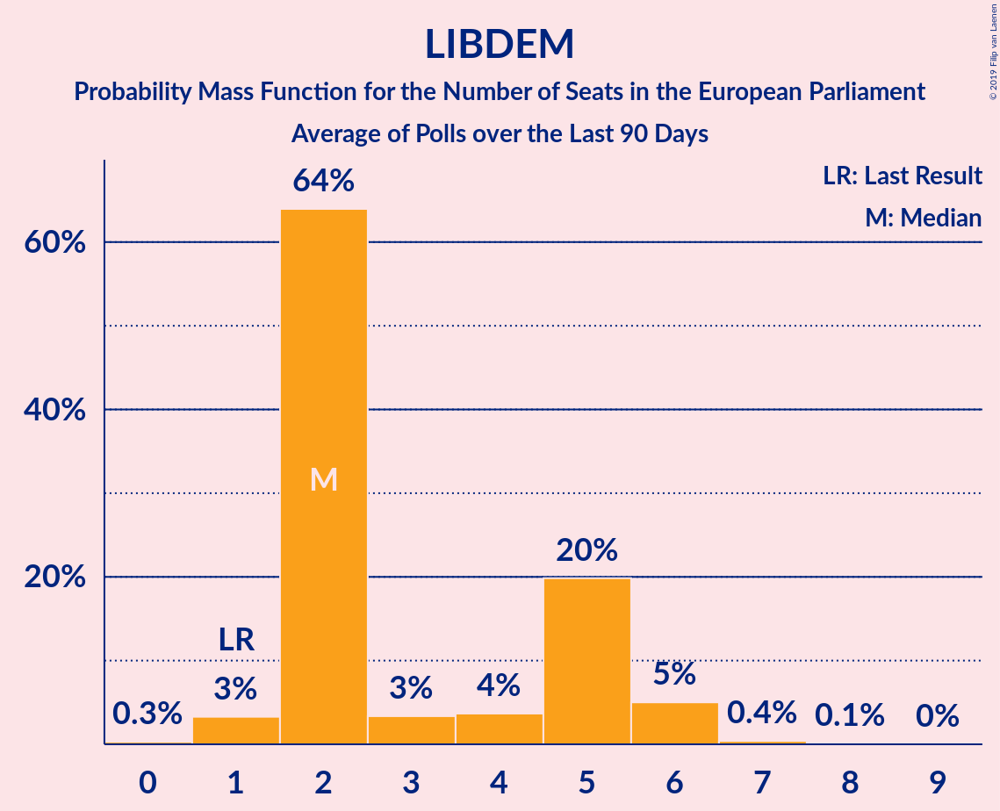
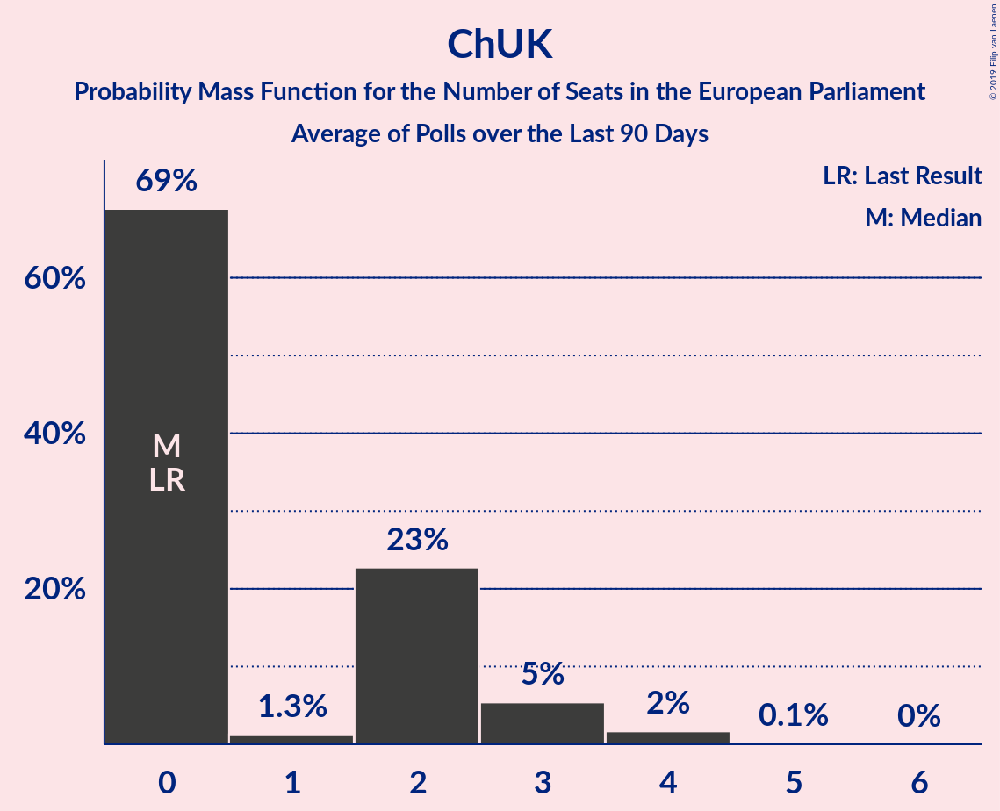

# Poll Average

<a href="#voting-intentions">Voting Intentions</a> | <a href="#seats">Seats</a> | <a href="#coalitions">Coalitions</a> | <a href="#technical-information">Technical Information</a>

## Summary

The table below lists the polls on which the average is based. They are the most recent polls (less than 90 days old) registered and analyzed so far.

| Period     | Polling firm/Commissioner(s) | UKIP | LAB | CON | GREEN | LIBDEM | SNP | PC | BREXIT | ChUK |
|:----------:|:----------------------------:|:--:|:--:|:--:|:--:|:--:|:--:|:--:|:--:|:--:|
| 22 May 2014 | General Election | 26.6%   24 | 24.4%   20 | 23.1%   19 | 6.9%   3 | 6.6%   1 | 2.4%   2 | 0.7%   1 | 0.0%   0 | 0.0%   0 |
| N/A | Poll Average | 6–15%   1–13 | 23–40%   19–38 | 15–38%   10–32 | 4–9%   0–4 | 7–11%   1–6 | 2–7%   2–5 | 0–2%   0–2 | 9–16%   6–15 | 3–8%   0–3 |
| [9–12 April 2019](2019-04-12-Opinium.html) | Opinium   The Observer | 12–15%   7–12 | 27–31%   26–30 | 15–19%   11–16 | 5–7%   0–2 | 9–11%   4–6 | 5–7%   4–5 | 1–2%   1–2 | 11–14%   7–11 | 3–5%   0 |
| [10–11 April 2019](2019-04-11-YouGov.html) | YouGov   The Times | 13–16%   8–14 | 22–26%   19–27 | 15–18%   9–14 | 7–9%   1–6 | 7–9%   2–5 | 4–6%   4–5 | 1–2%   1–2 | 14–17%   8–15 | 6–8%   0–4 |
| [5–8 April 2019](2019-04-08-HanburyStrategy.html) | Hanbury Strategy   Open Europe | 6–8%   1–2 | 36–40%   35–39 | 21–25%   18–21 | 3–5%   0 | 7–9%   2–3 | 3–5%   2–3 | 0–1%   0 | 9–12%   6–7 | 3–5%   0 |
| [10–17 January 2019](2019-01-17-NumberCruncherPolitics.html) | Number Cruncher Politics   Politico | 8–12%   2–7 | 34–40%   28–33 | 33–39%   27–32 | 4–6%   0 | 6–10%   1–2 | 2–4%   1–3 | 1–2%   0–1 | N/A   N/A | N/A   N/A |
| 22 May 2014 | General Election | 26.6%   24 | 24.4%   20 | 23.1%   19 | 6.9%   3 | 6.6%   1 | 2.4%   2 | 0.7%   1 | 0.0%   0 | 0.0%   0 |

Only polls for which at least the sample size has been published are included in the table above.

**Legend:**
+ **Top half of each row:** Voting intentions (95% confidence interval)
+ **Bottom half of each row:** Seat projections for the European Parliament (95% confidence interval)
+ **UKIP:** UK Independence Party (EAPN)
+ **LAB:** Labour Party (S&D)
+ **CON:** Conservative Party (ECR)
+ **GREEN:** Green Party (Greens/EFA)
+ **LIBDEM:** Liberal Democrats (ALDE)
+ **SNP:** Scottish National Party (Greens/EFA)
+ **PC:** Plaid Cymru (Greens/EFA)
+ **BREXIT:** Brexit Party (EFDD)
+ **ChUK:** Change UK (EPP)
+ **N/A (single party):** Party not included the published results
+ **N/A (entire row):** Calculation for this opinion poll not started yet

## Voting Intentions

### Confidence Intervals

| Party | Last Result | Median | 80% Confidence Interval | 90% Confidence Interval | 95% Confidence Interval | 99% Confidence Interval |
|:-----:|:-----------:|:------:|:-----------------------:|:-----------------------:|:-----------------------:|:-----------------------:|
| <a href="#uk-independence-party-(eapn)">UK Independence Party (EAPN)</a> | 26.6% | 11.8% | 6.9–14.5% |6.6–14.9% | 6.4–15.3% | 6.0–15.9% |
| <a href="#labour-party-(s&d)">Labour Party (S&D)</a> | 24.4% | 32.3% | 24.0–38.9% |23.4–39.4% | 23.0–39.9% | 22.3–40.7% |
| <a href="#conservative-party-(ecr)">Conservative Party (ECR)</a> | 23.1% | 20.0% | 15.8–36.3% |15.4–37.2% | 15.1–37.9% | 14.5–39.0% |
| <a href="#green-party-(greens/efa)">Green Party (Greens/EFA)</a> | 6.9% | 5.6% | 3.9–8.3% |3.7–8.7% | 3.5–9.0% | 3.2–9.5% |
| <a href="#liberal-democrats-(alde)">Liberal Democrats (ALDE)</a> | 6.6% | 8.4% | 7.3–10.2% |7.0–10.6% | 6.8–10.9% | 6.3–11.5% |
| <a href="#scottish-national-party-(greens/efa)">Scottish National Party (Greens/EFA)</a> | 2.4% | 4.6% | 2.9–6.2% |2.6–6.5% | 2.4–6.7% | 2.1–7.2% |
| <a href="#plaid-cymru-(greens/efa)">Plaid Cymru (Greens/EFA)</a> | 0.7% | 0.9% | 0.3–1.3% |0.2–1.5% | 0.2–1.6% | 0.1–1.9% |
| <a href="#brexit-party-(efdd)">Brexit Party (EFDD)</a> | 0.0% | 12.0% | 9.8–15.6% |9.4–16.0% | 9.2–16.4% | 8.7–17.0% |
| <a href="#change-uk-(epp)">Change UK (EPP)</a> | 0.0% | 4.4% | 3.6–7.4% |3.5–7.7% | 3.3–8.0% | 3.1–8.5% |

### UK Independence Party (EAPN)

*For a full overview of the results for this party, see the [UK Independence Party (EAPN)](party-ukindependencepartyeapn.html) page.*

| Voting Intentions | Probability | Accumulated | Special Marks |
|:-----------------:|:-----------:|:-----------:|:-------------:|
| 4.5–5.5% | 0.1% | 100% |  |
| 5.5–6.5% | 4% | 99.9% |  |
| 6.5–7.5% | 15% | 96% |  |
| 7.5–8.5% | 6% | 80% |  |
| 8.5–9.5% | 6% | 74% |  |
| 9.5–10.5% | 10% | 68% |  |
| 10.5–11.5% | 7% | 58% |  |
| 11.5–12.5% | 8% | 51% | Median |
| 12.5–13.5% | 17% | 43% |  |
| 13.5–14.5% | 17% | 26% |  |
| 14.5–15.5% | 7% | 9% |  |
| 15.5–16.5% | 1.2% | 1.3% |  |
| 16.5–17.5% | 0.1% | 0.1% |  |
| 17.5–18.5% | 0% | 0% |  |
| 18.5–19.5% | 0% | 0% |  |
| 19.5–20.5% | 0% | 0% |  |
| 20.5–21.5% | 0% | 0% |  |
| 21.5–22.5% | 0% | 0% |  |
| 22.5–23.5% | 0% | 0% |  |
| 23.5–24.5% | 0% | 0% |  |
| 24.5–25.5% | 0% | 0% |  |
| 25.5–26.5% | 0% | 0% |  |
| 26.5–27.5% | 0% | 0% | Last Result |

### Labour Party (S&D)

*For a full overview of the results for this party, see the [Labour Party (S&D)](party-labourpartysd.html) page.*

| Voting Intentions | Probability | Accumulated | Special Marks |
|:-----------------:|:-----------:|:-----------:|:-------------:|
| 20.5–21.5% | 0.1% | 100% |  |
| 21.5–22.5% | 0.9% | 99.9% |  |
| 22.5–23.5% | 5% | 99.0% |  |
| 23.5–24.5% | 9% | 94% | Last Result |
| 24.5–25.5% | 7% | 85% |  |
| 25.5–26.5% | 2% | 78% |  |
| 26.5–27.5% | 2% | 75% |  |
| 27.5–28.5% | 6% | 73% |  |
| 28.5–29.5% | 10% | 67% |  |
| 29.5–30.5% | 6% | 57% |  |
| 30.5–31.5% | 2% | 52% |  |
| 31.5–32.5% | 0.2% | 50% | Median |
| 32.5–33.5% | 0.3% | 50% |  |
| 33.5–34.5% | 1.1% | 50% |  |
| 34.5–35.5% | 3% | 49% |  |
| 35.5–36.5% | 7% | 45% |  |
| 36.5–37.5% | 11% | 39% |  |
| 37.5–38.5% | 13% | 27% |  |
| 38.5–39.5% | 10% | 14% |  |
| 39.5–40.5% | 3% | 4% |  |
| 40.5–41.5% | 0.7% | 0.7% |  |
| 41.5–42.5% | 0.1% | 0.1% |  |
| 42.5–43.5% | 0% | 0% |  |

### Conservative Party (ECR)

*For a full overview of the results for this party, see the [Conservative Party (ECR)](party-conservativepartyecr.html) page.*

| Voting Intentions | Probability | Accumulated | Special Marks |
|:-----------------:|:-----------:|:-----------:|:-------------:|
| 12.5–13.5% | 0% | 100% |  |
| 13.5–14.5% | 0.6% | 100% |  |
| 14.5–15.5% | 6% | 99.4% |  |
| 15.5–16.5% | 17% | 94% |  |
| 16.5–17.5% | 18% | 76% |  |
| 17.5–18.5% | 7% | 58% |  |
| 18.5–19.5% | 1.0% | 51% |  |
| 19.5–20.5% | 0.1% | 50% | Median |
| 20.5–21.5% | 1.0% | 50% |  |
| 21.5–22.5% | 5% | 49% |  |
| 22.5–23.5% | 10% | 44% | Last Result |
| 23.5–24.5% | 7% | 34% |  |
| 24.5–25.5% | 2% | 27% |  |
| 25.5–26.5% | 0.2% | 25% |  |
| 26.5–27.5% | 0% | 25% |  |
| 27.5–28.5% | 0% | 25% |  |
| 28.5–29.5% | 0% | 25% |  |
| 29.5–30.5% | 0% | 25% |  |
| 30.5–31.5% | 0% | 25% |  |
| 31.5–32.5% | 0.2% | 25% |  |
| 32.5–33.5% | 1.0% | 25% |  |
| 33.5–34.5% | 3% | 24% |  |
| 34.5–35.5% | 5% | 21% |  |
| 35.5–36.5% | 7% | 15% |  |
| 36.5–37.5% | 5% | 9% |  |
| 37.5–38.5% | 2% | 4% |  |
| 38.5–39.5% | 0.8% | 1.1% |  |
| 39.5–40.5% | 0.2% | 0.2% |  |
| 40.5–41.5% | 0% | 0% |  |

### Green Party (Greens/EFA)

*For a full overview of the results for this party, see the [Green Party (Greens/EFA)](party-greenpartygreensefa.html) page.*

| Voting Intentions | Probability | Accumulated | Special Marks |
|:-----------------:|:-----------:|:-----------:|:-------------:|
| 1.5–2.5% | 0% | 100% |  |
| 2.5–3.5% | 3% | 100% |  |
| 3.5–4.5% | 25% | 97% |  |
| 4.5–5.5% | 22% | 73% |  |
| 5.5–6.5% | 22% | 51% | Median |
| 6.5–7.5% | 9% | 29% | Last Result |
| 7.5–8.5% | 14% | 21% |  |
| 8.5–9.5% | 6% | 6% |  |
| 9.5–10.5% | 0.4% | 0.4% |  |
| 10.5–11.5% | 0% | 0% |  |

### Liberal Democrats (ALDE)

*For a full overview of the results for this party, see the [Liberal Democrats (ALDE)](party-liberaldemocratsalde.html) page.*

| Voting Intentions | Probability | Accumulated | Special Marks |
|:-----------------:|:-----------:|:-----------:|:-------------:|
| 4.5–5.5% | 0% | 100% |  |
| 5.5–6.5% | 1.0% | 100% |  |
| 6.5–7.5% | 15% | 99.0% | Last Result |
| 7.5–8.5% | 40% | 84% | Median |
| 8.5–9.5% | 22% | 43% |  |
| 9.5–10.5% | 15% | 21% |  |
| 10.5–11.5% | 5% | 6% |  |
| 11.5–12.5% | 0.4% | 0.4% |  |
| 12.5–13.5% | 0% | 0% |  |

### Scottish National Party (Greens/EFA)

*For a full overview of the results for this party, see the [Scottish National Party (Greens/EFA)](party-scottishnationalpartygreensefa.html) page.*

| Voting Intentions | Probability | Accumulated | Special Marks |
|:-----------------:|:-----------:|:-----------:|:-------------:|
| 0.5–1.5% | 0% | 100% |  |
| 1.5–2.5% | 4% | 100% | Last Result |
| 2.5–3.5% | 19% | 96% |  |
| 3.5–4.5% | 27% | 77% |  |
| 4.5–5.5% | 25% | 50% | Median |
| 5.5–6.5% | 21% | 25% |  |
| 6.5–7.5% | 4% | 4% |  |
| 7.5–8.5% | 0.1% | 0.1% |  |
| 8.5–9.5% | 0% | 0% |  |

### Plaid Cymru (Greens/EFA)

*For a full overview of the results for this party, see the [Plaid Cymru (Greens/EFA)](party-plaidcymrugreensefa.html) page.*

| Voting Intentions | Probability | Accumulated | Special Marks |
|:-----------------:|:-----------:|:-----------:|:-------------:|
| 0.0–0.5% | 25% | 100% |  |
| 0.5–1.5% | 72% | 75% | Last Result, Median |
| 1.5–2.5% | 3% | 3% |  |
| 2.5–3.5% | 0% | 0% |  |

### Brexit Party (EFDD)

*For a full overview of the results for this party, see the [Brexit Party (EFDD)](party-brexitpartyefdd.html) page.*

| Voting Intentions | Probability | Accumulated | Special Marks |
|:-----------------:|:-----------:|:-----------:|:-------------:|
| 0.0–0.5% | 0% | 100% | Last Result |
| 0.5–1.5% | 0% | 100% |  |
| 1.5–2.5% | 0% | 100% |  |
| 2.5–3.5% | 0% | 100% |  |
| 3.5–4.5% | 0% | 100% |  |
| 4.5–5.5% | 0% | 100% |  |
| 5.5–6.5% | 0% | 100% |  |
| 6.5–7.5% | 0% | 100% |  |
| 7.5–8.5% | 0.2% | 100% |  |
| 8.5–9.5% | 6% | 99.8% |  |
| 9.5–10.5% | 18% | 94% |  |
| 10.5–11.5% | 16% | 75% |  |
| 11.5–12.5% | 18% | 59% | Median |
| 12.5–13.5% | 8% | 41% |  |
| 13.5–14.5% | 8% | 33% |  |
| 14.5–15.5% | 15% | 26% |  |
| 15.5–16.5% | 9% | 11% |  |
| 16.5–17.5% | 2% | 2% |  |
| 17.5–18.5% | 0.1% | 0.1% |  |
| 18.5–19.5% | 0% | 0% |  |

### Change UK (EPP)

*For a full overview of the results for this party, see the [Change UK (EPP)](party-changeukepp.html) page.*

| Voting Intentions | Probability | Accumulated | Special Marks |
|:-----------------:|:-----------:|:-----------:|:-------------:|
| 0.0–0.5% | 0% | 100% | Last Result |
| 0.5–1.5% | 0% | 100% |  |
| 1.5–2.5% | 0% | 100% |  |
| 2.5–3.5% | 8% | 100% |  |
| 3.5–4.5% | 50% | 92% | Median |
| 4.5–5.5% | 9% | 42% |  |
| 5.5–6.5% | 6% | 33% |  |
| 6.5–7.5% | 20% | 27% |  |
| 7.5–8.5% | 7% | 8% |  |
| 8.5–9.5% | 0.3% | 0.3% |  |
| 9.5–10.5% | 0% | 0% |  |

## Seats

### Confidence Intervals

| Party | Last Result | Median | 80% Confidence Interval | 90% Confidence Interval | 95% Confidence Interval | 99% Confidence Interval |
|:-----:|:-----------:|:------:|:-----------------------:|:-----------------------:|:-----------------------:|:-----------------------:|
| <a href="#uk-independence-party-(eapn)">UK Independence Party (EAPN)</a> | 24 | 7 | 1–11 |1–12 | 1–13 | 1–14 |
| <a href="#labour-party-(s&d)">Labour Party (S&D)</a> | 20 | 28 | 22–38 |21–38 | 19–38 | 19–39 |
| <a href="#conservative-party-(ecr)">Conservative Party (ECR)</a> | 19 | 17 | 10–31 |10–31 | 10–32 | 9–32 |
| <a href="#green-party-(greens/efa)">Green Party (Greens/EFA)</a> | 3 | 0 | 0–4 |0–4 | 0–4 | 0–6 |
| <a href="#liberal-democrats-(alde)">Liberal Democrats (ALDE)</a> | 1 | 2 | 2–5 |2–6 | 1–6 | 1–7 |
| <a href="#scottish-national-party-(greens/efa)">Scottish National Party (Greens/EFA)</a> | 2 | 3 | 2–5 |2–5 | 2–5 | 1–5 |
| <a href="#plaid-cymru-(greens/efa)">Plaid Cymru (Greens/EFA)</a> | 1 | 1 | 0–2 |0–2 | 0–2 | 0–2 |
| <a href="#brexit-party-(efdd)">Brexit Party (EFDD)</a> | 0 | 8 | 6–13 |6–14 | 6–15 | 6–15 |
| <a href="#change-uk-(epp)">Change UK (EPP)</a> | 0 | 0 | 0–2 |0–3 | 0–3 | 0–4 |

### UK Independence Party (EAPN)

*For a full overview of the results for this party, see the [UK Independence Party (EAPN)](party-ukindependencepartyeapn.html) page.*

| Number of Seats | Probability | Accumulated | Special Marks |
|:---------------:|:-----------:|:-----------:|:-------------:|
| 1 | 14% | 100% |  |
| 2 | 12% | 86% |  |
| 3 | 3% | 73% |  |
| 4 | 3% | 70% |  |
| 5 | 3% | 67% |  |
| 6 | 9% | 64% |  |
| 7 | 7% | 55% | Median |
| 8 | 17% | 48% |  |
| 9 | 7% | 31% |  |
| 10 | 7% | 24% |  |
| 11 | 9% | 17% |  |
| 12 | 4% | 8% |  |
| 13 | 4% | 4% |  |
| 14 | 0.3% | 0.6% |  |
| 15 | 0.3% | 0.4% |  |
| 16 | 0% | 0% |  |
| 17 | 0% | 0% |  |
| 18 | 0% | 0% |  |
| 19 | 0% | 0% |  |
| 20 | 0% | 0% |  |
| 21 | 0% | 0% |  |
| 22 | 0% | 0% |  |
| 23 | 0% | 0% |  |
| 24 | 0% | 0% | Last Result |

### Labour Party (S&D)

*For a full overview of the results for this party, see the [Labour Party (S&D)](party-labourpartysd.html) page.*

| Number of Seats | Probability | Accumulated | Special Marks |
|:---------------:|:-----------:|:-----------:|:-------------:|
| 18 | 0.2% | 100% |  |
| 19 | 3% | 99.8% |  |
| 20 | 2% | 97% | Last Result |
| 21 | 2% | 95% |  |
| 22 | 4% | 93% |  |
| 23 | 3% | 89% |  |
| 24 | 5% | 86% |  |
| 25 | 3% | 81% |  |
| 26 | 4% | 78% |  |
| 27 | 8% | 74% |  |
| 28 | 17% | 67% | Median |
| 29 | 11% | 50% |  |
| 30 | 7% | 39% |  |
| 31 | 3% | 32% |  |
| 32 | 2% | 29% |  |
| 33 | 1.4% | 27% |  |
| 34 | 0.4% | 26% |  |
| 35 | 1.1% | 25% |  |
| 36 | 5% | 24% | Majority |
| 37 | 6% | 19% |  |
| 38 | 13% | 14% |  |
| 39 | 0.6% | 0.6% |  |
| 40 | 0.1% | 0.1% |  |
| 41 | 0% | 0% |  |

### Conservative Party (ECR)

*For a full overview of the results for this party, see the [Conservative Party (ECR)](party-conservativepartyecr.html) page.*

| Number of Seats | Probability | Accumulated | Special Marks |
|:---------------:|:-----------:|:-----------:|:-------------:|
| 9 | 2% | 100% |  |
| 10 | 10% | 98% |  |
| 11 | 6% | 89% |  |
| 12 | 10% | 83% |  |
| 13 | 8% | 73% |  |
| 14 | 8% | 64% |  |
| 15 | 5% | 56% |  |
| 16 | 0.9% | 51% |  |
| 17 | 0.2% | 50% | Median |
| 18 | 0.9% | 50% |  |
| 19 | 3% | 49% | Last Result |
| 20 | 19% | 46% |  |
| 21 | 1.3% | 27% |  |
| 22 | 0.3% | 25% |  |
| 23 | 0.1% | 25% |  |
| 24 | 0% | 25% |  |
| 25 | 0% | 25% |  |
| 26 | 0.1% | 25% |  |
| 27 | 2% | 25% |  |
| 28 | 3% | 22% |  |
| 29 | 3% | 20% |  |
| 30 | 5% | 17% |  |
| 31 | 7% | 12% |  |
| 32 | 4% | 5% |  |
| 33 | 0.3% | 0.4% |  |
| 34 | 0.1% | 0.1% |  |
| 35 | 0% | 0% |  |

### Green Party (Greens/EFA)

*For a full overview of the results for this party, see the [Green Party (Greens/EFA)](party-greenpartygreensefa.html) page.*

| Number of Seats | Probability | Accumulated | Special Marks |
|:---------------:|:-----------:|:-----------:|:-------------:|
| 0 | 58% | 100% | Median |
| 1 | 18% | 42% |  |
| 2 | 5% | 24% |  |
| 3 | 9% | 19% | Last Result |
| 4 | 8% | 11% |  |
| 5 | 0.9% | 2% |  |
| 6 | 1.2% | 1.2% |  |
| 7 | 0% | 0% |  |

### Liberal Democrats (ALDE)

*For a full overview of the results for this party, see the [Liberal Democrats (ALDE)](party-liberaldemocratsalde.html) page.*

| Number of Seats | Probability | Accumulated | Special Marks |
|:---------------:|:-----------:|:-----------:|:-------------:|
| 0 | 0.3% | 100% |  |
| 1 | 3% | 99.7% | Last Result |
| 2 | 64% | 97% | Median |
| 3 | 3% | 32% |  |
| 4 | 4% | 29% |  |
| 5 | 20% | 25% |  |
| 6 | 5% | 6% |  |
| 7 | 0.4% | 0.6% |  |
| 8 | 0.1% | 0.2% |  |
| 9 | 0% | 0% |  |

### Scottish National Party (Greens/EFA)

*For a full overview of the results for this party, see the [Scottish National Party (Greens/EFA)](party-scottishnationalpartygreensefa.html) page.*

| Number of Seats | Probability | Accumulated | Special Marks |
|:---------------:|:-----------:|:-----------:|:-------------:|
| 1 | 0.7% | 100% |  |
| 2 | 18% | 99.3% | Last Result |
| 3 | 32% | 82% | Median |
| 4 | 28% | 50% |  |
| 5 | 21% | 21% |  |
| 6 | 0% | 0% |  |

### Plaid Cymru (Greens/EFA)

*For a full overview of the results for this party, see the [Plaid Cymru (Greens/EFA)](party-plaidcymrugreensefa.html) page.*

| Number of Seats | Probability | Accumulated | Special Marks |
|:---------------:|:-----------:|:-----------:|:-------------:|
| 0 | 27% | 100% |  |
| 1 | 59% | 73% | Last Result, Median |
| 2 | 14% | 14% |  |
| 3 | 0% | 0% |  |

### Brexit Party (EFDD)

*For a full overview of the results for this party, see the [Brexit Party (EFDD)](party-brexitpartyefdd.html) page.*

| Number of Seats | Probability | Accumulated | Special Marks |
|:---------------:|:-----------:|:-----------:|:-------------:|
| 0 | 0% | 100% | Last Result |
| 1 | 0% | 100% |  |
| 2 | 0% | 100% |  |
| 3 | 0.1% | 100% |  |
| 4 | 0.1% | 99.9% |  |
| 5 | 0.3% | 99.9% |  |
| 6 | 21% | 99.5% |  |
| 7 | 27% | 78% |  |
| 8 | 14% | 51% | Median |
| 9 | 4% | 37% |  |
| 10 | 2% | 32% |  |
| 11 | 4% | 30% |  |
| 12 | 7% | 26% |  |
| 13 | 12% | 19% |  |
| 14 | 2% | 7% |  |
| 15 | 4% | 5% |  |
| 16 | 0.2% | 0.2% |  |
| 17 | 0% | 0% |  |

### Change UK (EPP)

*For a full overview of the results for this party, see the [Change UK (EPP)](party-changeukepp.html) page.*

| Number of Seats | Probability | Accumulated | Special Marks |
|:---------------:|:-----------:|:-----------:|:-------------:|
| 0 | 69% | 100% | Last Result, Median |
| 1 | 1.3% | 31% |  |
| 2 | 23% | 30% |  |
| 3 | 5% | 7% |  |
| 4 | 2% | 2% |  |
| 5 | 0.1% | 0.1% |  |
| 6 | 0% | 0% |  |

## Coalitions

### Confidence Intervals

| Coalition | Last Result | Median | Majority? | 80% Confidence Interval | 90% Confidence Interval | 95% Confidence Interval | 99% Confidence Interval |
|:---------:|:-----------:|:------:|:---------:|:-----------------------:|:-----------------------:|:-----------------------:|:-----------------------:|
| Labour Party (S&D) | 20 | 28 | 24% | 22–38 | 21–38 | 19–38 | 19–39 |
| Conservative Party (ECR) | 19 | 17 | 0% | 10–31 | 10–31 | 10–32 | 9–32 |
| Brexit Party (EFDD) | 0 | 7 | 0% | 0–13 | 0–14 | 0–15 | 0–15 |
| UK Independence Party (EAPN) | 24 | 7 | 0% | 1–11 | 1–12 | 1–13 | 1–14 |
| Green Party (Greens/EFA) – Scottish National Party (Greens/EFA) – Plaid Cymru (Greens/EFA) | 6 | 5 | 0% | 3–9 | 3–10 | 2–11 | 2–12 |
| Liberal Democrats (ALDE) | 1 | 2 | 0% | 2–5 | 2–6 | 1–6 | 1–7 |
| Change UK (EPP) | 0 | 0 | 0% | 0–2 | 0–3 | 0–3 | 0–4 |

### Labour Party (S&D)

| Number of Seats | Probability | Accumulated | Special Marks |
|:---------------:|:-----------:|:-----------:|:-------------:|
| 18 | 0.2% | 100% |  |
| 19 | 3% | 99.8% |  |
| 20 | 2% | 97% | Last Result |
| 21 | 2% | 95% |  |
| 22 | 4% | 93% |  |
| 23 | 3% | 89% |  |
| 24 | 5% | 86% |  |
| 25 | 3% | 81% |  |
| 26 | 4% | 78% |  |
| 27 | 8% | 74% |  |
| 28 | 17% | 67% | Median |
| 29 | 11% | 50% |  |
| 30 | 7% | 39% |  |
| 31 | 3% | 32% |  |
| 32 | 2% | 29% |  |
| 33 | 1.4% | 27% |  |
| 34 | 0.4% | 26% |  |
| 35 | 1.1% | 25% |  |
| 36 | 5% | 24% | Majority |
| 37 | 6% | 19% |  |
| 38 | 13% | 14% |  |
| 39 | 0.6% | 0.6% |  |
| 40 | 0.1% | 0.1% |  |
| 41 | 0% | 0% |  |

### Conservative Party (ECR)

| Number of Seats | Probability | Accumulated | Special Marks |
|:---------------:|:-----------:|:-----------:|:-------------:|
| 9 | 2% | 100% |  |
| 10 | 10% | 98% |  |
| 11 | 6% | 89% |  |
| 12 | 10% | 83% |  |
| 13 | 8% | 73% |  |
| 14 | 8% | 64% |  |
| 15 | 5% | 56% |  |
| 16 | 0.9% | 51% |  |
| 17 | 0.2% | 50% | Median |
| 18 | 0.9% | 50% |  |
| 19 | 3% | 49% | Last Result |
| 20 | 19% | 46% |  |
| 21 | 1.3% | 27% |  |
| 22 | 0.3% | 25% |  |
| 23 | 0.1% | 25% |  |
| 24 | 0% | 25% |  |
| 25 | 0% | 25% |  |
| 26 | 0.1% | 25% |  |
| 27 | 2% | 25% |  |
| 28 | 3% | 22% |  |
| 29 | 3% | 20% |  |
| 30 | 5% | 17% |  |
| 31 | 7% | 12% |  |
| 32 | 4% | 5% |  |
| 33 | 0.3% | 0.4% |  |
| 34 | 0.1% | 0.1% |  |
| 35 | 0% | 0% |  |

### Brexit Party (EFDD)

| Number of Seats | Probability | Accumulated | Special Marks |
|:---------------:|:-----------:|:-----------:|:-------------:|
| 0 | 25% | 100% | Last Result |
| 1 | 0% | 75% |  |
| 2 | 0% | 75% |  |
| 3 | 0% | 75% |  |
| 4 | 0.1% | 75% |  |
| 5 | 0.2% | 75% |  |
| 6 | 16% | 75% |  |
| 7 | 20% | 59% |  |
| 8 | 11% | 38% | Median |
| 9 | 3% | 27% |  |
| 10 | 2% | 24% |  |
| 11 | 3% | 23% |  |
| 12 | 5% | 19% |  |
| 13 | 9% | 14% |  |
| 14 | 2% | 5% |  |
| 15 | 3% | 4% |  |
| 16 | 0.1% | 0.2% |  |
| 17 | 0% | 0% |  |

### UK Independence Party (EAPN)

| Number of Seats | Probability | Accumulated | Special Marks |
|:---------------:|:-----------:|:-----------:|:-------------:|
| 1 | 14% | 100% |  |
| 2 | 12% | 86% |  |
| 3 | 3% | 73% |  |
| 4 | 3% | 70% |  |
| 5 | 3% | 67% |  |
| 6 | 9% | 64% |  |
| 7 | 7% | 55% | Median |
| 8 | 17% | 48% |  |
| 9 | 7% | 31% |  |
| 10 | 7% | 24% |  |
| 11 | 9% | 17% |  |
| 12 | 4% | 8% |  |
| 13 | 4% | 4% |  |
| 14 | 0.3% | 0.6% |  |
| 15 | 0.3% | 0.4% |  |
| 16 | 0% | 0% |  |
| 17 | 0% | 0% |  |
| 18 | 0% | 0% |  |
| 19 | 0% | 0% |  |
| 20 | 0% | 0% |  |
| 21 | 0% | 0% |  |
| 22 | 0% | 0% |  |
| 23 | 0% | 0% |  |
| 24 | 0% | 0% | Last Result |

### Green Party (Greens/EFA) – Scottish National Party (Greens/EFA) – Plaid Cymru (Greens/EFA)

| Number of Seats | Probability | Accumulated | Special Marks |
|:---------------:|:-----------:|:-----------:|:-------------:|
| 2 | 2% | 100% |  |
| 3 | 40% | 97% |  |
| 4 | 8% | 58% | Median |
| 5 | 4% | 50% |  |
| 6 | 11% | 46% | Last Result |
| 7 | 11% | 35% |  |
| 8 | 8% | 24% |  |
| 9 | 8% | 16% |  |
| 10 | 5% | 8% |  |
| 11 | 2% | 3% |  |
| 12 | 0.6% | 0.6% |  |
| 13 | 0.1% | 0.1% |  |
| 14 | 0% | 0% |  |

### Liberal Democrats (ALDE)

| Number of Seats | Probability | Accumulated | Special Marks |
|:---------------:|:-----------:|:-----------:|:-------------:|
| 0 | 0.3% | 100% |  |
| 1 | 3% | 99.7% | Last Result |
| 2 | 64% | 97% | Median |
| 3 | 3% | 32% |  |
| 4 | 4% | 29% |  |
| 5 | 20% | 25% |  |
| 6 | 5% | 6% |  |
| 7 | 0.4% | 0.6% |  |
| 8 | 0.1% | 0.2% |  |
| 9 | 0% | 0% |  |

### Change UK (EPP)

| Number of Seats | Probability | Accumulated | Special Marks |
|:---------------:|:-----------:|:-----------:|:-------------:|
| 0 | 77% | 100% | Last Result, Median |
| 1 | 1.0% | 23% |  |
| 2 | 17% | 22% |  |
| 3 | 4% | 5% |  |
| 4 | 1.2% | 1.3% |  |
| 5 | 0.1% | 0.1% |  |
| 6 | 0% | 0% |  |

## Technical Information

+ **Number of polls included in this average:** 4
+ **Lowest number of simulations done in a poll included in this average:** 1,048,576
+ **Total number of simulations done in the polls included in this average:** 4,194,304
+ **Error estimate:** 1.54%
