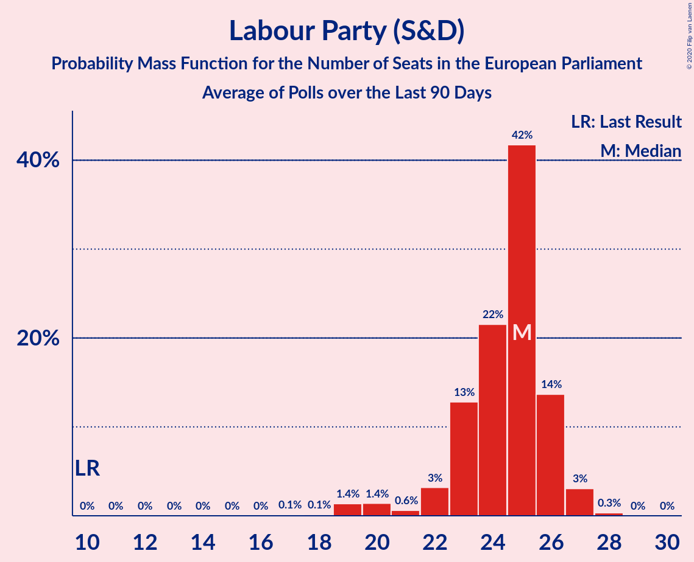

# Poll Average

<a href="#voting-intentions">Voting Intentions</a> | <a href="#seats">Seats</a> | <a href="#coalitions">Coalitions</a> | <a href="#technical-information">Technical Information</a>

## Summary

The table below lists the polls on which the average is based. They are the most recent polls (less than 90 days old) registered and analyzed so far.

| Period     | Polling firm/Commissioner(s) | BREXIT | LIBDEM | LAB | GREEN | CON | SNP | PC | ChUK | UKIP |
|:----------:|:----------------------------:|:--:|:--:|:--:|:--:|:--:|:--:|:--:|:--:|:--:|
| 23 May 2019 | General Election | 30.5%   29 | 19.6%   16 | 13.7%   10 | 11.8%   7 | 8.8%   4 | 3.5%   3 | 1.0%   1 | 3.3%   0 | 3.2%   0 |
| N/A | Poll Average | 2–12%   0–8 | 12–19%   4–13 | 26–35%   20–28 | 2–6%   0 | 35–48%   29–39 | 2–6%   1–3 | 0–2%   0–1 | 0–1%   0 | 0–1%   0 |
| [25–26 November 2019](2019-11-26-YouGov.html) | YouGov   The Times and Sky News | 3–5%   0 | 12–15%   5–8 | 30–35%   25–27 | 1–3%   0 | 41–46%   35–37 | 3–5%   2–3 | 0–1%   0 | N/A   N/A | N/A   N/A |
| [25–26 November 2019](2019-11-26-ComRes.html) | ComRes   Daily Telegraph | 4–6%   0 | 12–15%   5–8 | 32–36%   26–28 | 1–3%   0 | 39–44%   31–36 | 2–4%   1–2 | N/A   N/A | N/A   N/A | N/A   N/A |
| [21–25 November 2019](2019-11-25-KantarPublic.html) | Kantar Public | 2–4%   0 | 12–16%   5–8 | 29–35%   24–27 | 3–5%   0 | 40–46%   33–37 | 3–5%   2–3 | 0–1%   0–1 | N/A   N/A | N/A   N/A |
| [22–25 November 2019](2019-11-25-ICMResearch.html) | ICM Research | 3–5%   0 | 12–15%   5–8 | 32–36%   26–29 | 2–4%   0 | 39–43%   31–36 | 2–4%   1–2 | 1–2%   0–1 | N/A   N/A | 0–1%   0 |
| [20–23 November 2019](2019-11-23-Survation.html) | Survation   Good Morning Britain | 4–6%   0–1 | 13–17%   6–12 | 27–32%   21–26 | 2–4%   0 | 37–43%   31–38 | 2–4%   1–2 | 1–2%   0–2 | N/A   N/A | N/A   N/A |
| [21–23 November 2019](2019-11-23-Deltapoll.html) | Deltapoll   The Mail on Sunday | 2–4%   0 | 14–18%   6–11 | 28–33%   21–26 | 2–4%   0 | 41–46%   33–38 | 3–5%   2 | 0–1%   0 | N/A   N/A | N/A   N/A |
| [20–22 November 2019](2019-11-22-Panelbase.html) | Panelbase | 2–4%   0 | 13–16%   6–8 | 30–34%   25–26 | 2–4%   0 | 40–44%   33–37 | 2–4%   1–2 | 1–2%   0–1 | N/A   N/A | N/A   N/A |
| [20–22 November 2019](2019-11-22-Opinium.html) | Opinium   The Observer | 2–4%   0 | 11–14%   4–7 | 26–30%   20–25 | 2–4%   0 | 45–49%   37–42 | 4–6%   2–3 | 0–1%   0 | 0–1%   0 | 0–1%   0 |
| [19–21 November 2019](2019-11-21-BMGResearch.html) | BMG Research | 2–4%   0 | 17–20%   8–14 | 26–31%   20–25 | 4–6%   0 | 39–44%   31–38 | 1–3%   1–2 | 0–1%   0 | N/A   N/A | N/A   N/A |
| [15–19 November 2019](2019-11-19-IpsosMORI.html) | Ipsos MORI   Evening Standard | 2–4%   0 | 14–18%   6–13 | 25–31%   19–25 | 2–4%   0 | 41–47%   33–39 | 3–5%   2–3 | 1–2%   0–2 | N/A   N/A | N/A   N/A |
| [30–31 October 2019](2019-10-31-ORB.html) | ORB   The Telegraph | 11–13%   6–9 | 13–16%   6–9 | 26–30%   20–26 | 3–5%   0 | 34–38%   27–32 | 4–6%   2–3 | 0–1%   0 | N/A   N/A | N/A   N/A |
| 23 May 2019 | General Election | 30.5%   29 | 19.6%   16 | 13.7%   10 | 11.8%   7 | 8.8%   4 | 3.5%   3 | 1.0%   1 | 3.3%   0 | 3.2%   0 |

Only polls for which at least the sample size has been published are included in the table above.

**Legend:**
+ **Top half of each row:** Voting intentions (95% confidence interval)
+ **Bottom half of each row:** Seat projections for the European Parliament (95% confidence interval)
+ **BREXIT:** Brexit Party (NI)
+ **LIBDEM:** Liberal Democrats (RE)
+ **LAB:** Labour Party (S&D)
+ **GREEN:** Green Party (Greens/EFA)
+ **CON:** Conservative Party (ECR)
+ **SNP:** Scottish National Party (Greens/EFA)
+ **PC:** Plaid Cymru (Greens/EFA)
+ **ChUK:** Change UK (RE)
+ **UKIP:** UK Independence Party (ID)
+ **N/A (single party):** Party not included the published results
+ **N/A (entire row):** Calculation for this opinion poll not started yet

## Voting Intentions

### Confidence Intervals

| Party | Last Result | Median | 80% Confidence Interval | 90% Confidence Interval | 95% Confidence Interval | 99% Confidence Interval |
|:-----:|:-----------:|:------:|:-----------------------:|:-----------------------:|:-----------------------:|:-----------------------:|
| <a href="#brexit-party-(ni)">Brexit Party (NI)</a> | 30.5% | 3.6% | 2.7–6.1% |2.5–11.9% | 2.4–12.4% | 2.1–13.2% |
| <a href="#liberal-democrats-(re)">Liberal Democrats (RE)</a> | 19.6% | 14.0% | 12.3–17.3% |11.8–18.3% | 11.5–19.0% | 10.9–19.9% |
| <a href="#labour-party-(s&d)">Labour Party (S&D)</a> | 13.7% | 30.4% | 27.4–34.2% |26.9–34.9% | 26.5–35.4% | 25.6–36.3% |
| <a href="#green-party-(greens/efa)">Green Party (Greens/EFA)</a> | 11.8% | 3.1% | 2.1–4.7% |1.9–5.2% | 1.7–5.5% | 1.5–6.1% |
| <a href="#conservative-party-(ecr)">Conservative Party (ECR)</a> | 8.8% | 42.2% | 38.3–45.7% |36.0–47.1% | 35.3–47.8% | 34.2–48.9% |
| <a href="#scottish-national-party-(greens/efa)">Scottish National Party (Greens/EFA)</a> | 3.5% | 3.7% | 2.4–5.1% |2.1–5.4% | 1.9–5.6% | 1.6–6.0% |
| <a href="#change-uk-(re)">Change UK (RE)</a> | 3.3% | 0.3% | 0.2–0.5% |0.1–0.5% | 0.1–0.6% | 0.1–0.7% |
| <a href="#uk-independence-party-(id)">UK Independence Party (ID)</a> | 3.2% | 0.3% | 0.2–0.5% |0.1–0.5% | 0.1–0.6% | 0.1–0.7% |
| <a href="#plaid-cymru-(greens/efa)">Plaid Cymru (Greens/EFA)</a> | 1.0% | 0.4% | 0.2–1.2% |0.1–1.4% | 0.1–1.5% | 0.1–1.8% |

### Brexit Party (NI)

*For a full overview of the results for this party, see the [Brexit Party (NI)](party-brexitpartyni.html) page.*

| Voting Intentions | Probability | Accumulated | Special Marks |
|:-----------------:|:-----------:|:-----------:|:-------------:|
| 0.5–1.5% | 0% | 100% |  |
| 1.5–2.5% | 6% | 100% |  |
| 2.5–3.5% | 43% | 94% |  |
| 3.5–4.5% | 24% | 51% | Median |
| 4.5–5.5% | 14% | 27% |  |
| 5.5–6.5% | 4% | 13% |  |
| 6.5–7.5% | 0.2% | 9% |  |
| 7.5–8.5% | 0% | 9% |  |
| 8.5–9.5% | 0% | 9% |  |
| 9.5–10.5% | 0.2% | 9% |  |
| 10.5–11.5% | 2% | 9% |  |
| 11.5–12.5% | 5% | 7% |  |
| 12.5–13.5% | 2% | 2% |  |
| 13.5–14.5% | 0.2% | 0.2% |  |
| 14.5–15.5% | 0% | 0% |  |
| 15.5–16.5% | 0% | 0% |  |
| 16.5–17.5% | 0% | 0% |  |
| 17.5–18.5% | 0% | 0% |  |
| 18.5–19.5% | 0% | 0% |  |
| 19.5–20.5% | 0% | 0% |  |
| 20.5–21.5% | 0% | 0% |  |
| 21.5–22.5% | 0% | 0% |  |
| 22.5–23.5% | 0% | 0% |  |
| 23.5–24.5% | 0% | 0% |  |
| 24.5–25.5% | 0% | 0% |  |
| 25.5–26.5% | 0% | 0% |  |
| 26.5–27.5% | 0% | 0% |  |
| 27.5–28.5% | 0% | 0% |  |
| 28.5–29.5% | 0% | 0% |  |
| 29.5–30.5% | 0% | 0% |  |
| 30.5–31.5% | 0% | 0% | Last Result |

### Liberal Democrats (RE)

*For a full overview of the results for this party, see the [Liberal Democrats (RE)](party-liberaldemocratsre.html) page.*

| Voting Intentions | Probability | Accumulated | Special Marks |
|:-----------------:|:-----------:|:-----------:|:-------------:|
| 8.5–9.5% | 0% | 100% |  |
| 9.5–10.5% | 0.1% | 100% |  |
| 10.5–11.5% | 3% | 99.9% |  |
| 11.5–12.5% | 12% | 97% |  |
| 12.5–13.5% | 23% | 85% |  |
| 13.5–14.5% | 23% | 62% | Median |
| 14.5–15.5% | 14% | 39% |  |
| 15.5–16.5% | 10% | 25% |  |
| 16.5–17.5% | 6% | 15% |  |
| 17.5–18.5% | 5% | 9% |  |
| 18.5–19.5% | 3% | 4% |  |
| 19.5–20.5% | 0.9% | 1.0% | Last Result |
| 20.5–21.5% | 0.1% | 0.1% |  |
| 21.5–22.5% | 0% | 0% |  |

### Labour Party (S&D)

*For a full overview of the results for this party, see the [Labour Party (S&D)](party-labourpartysd.html) page.*

| Voting Intentions | Probability | Accumulated | Special Marks |
|:-----------------:|:-----------:|:-----------:|:-------------:|
| 13.5–14.5% | 0% | 100% | Last Result |
| 14.5–15.5% | 0% | 100% |  |
| 15.5–16.5% | 0% | 100% |  |
| 16.5–17.5% | 0% | 100% |  |
| 17.5–18.5% | 0% | 100% |  |
| 18.5–19.5% | 0% | 100% |  |
| 19.5–20.5% | 0% | 100% |  |
| 20.5–21.5% | 0% | 100% |  |
| 21.5–22.5% | 0% | 100% |  |
| 22.5–23.5% | 0% | 100% |  |
| 23.5–24.5% | 0% | 100% |  |
| 24.5–25.5% | 0.4% | 100% |  |
| 25.5–26.5% | 3% | 99.6% |  |
| 26.5–27.5% | 9% | 97% |  |
| 27.5–28.5% | 15% | 88% |  |
| 28.5–29.5% | 14% | 73% |  |
| 29.5–30.5% | 11% | 59% | Median |
| 30.5–31.5% | 11% | 49% |  |
| 31.5–32.5% | 12% | 38% |  |
| 32.5–33.5% | 11% | 26% |  |
| 33.5–34.5% | 9% | 16% |  |
| 34.5–35.5% | 5% | 7% |  |
| 35.5–36.5% | 2% | 2% |  |
| 36.5–37.5% | 0.2% | 0.3% |  |
| 37.5–38.5% | 0% | 0% |  |

### Green Party (Greens/EFA)

*For a full overview of the results for this party, see the [Green Party (Greens/EFA)](party-greenpartygreensefa.html) page.*

| Voting Intentions | Probability | Accumulated | Special Marks |
|:-----------------:|:-----------:|:-----------:|:-------------:|
| 0.0–0.5% | 0% | 100% |  |
| 0.5–1.5% | 0.9% | 100% |  |
| 1.5–2.5% | 22% | 99.1% |  |
| 2.5–3.5% | 45% | 77% | Median |
| 3.5–4.5% | 21% | 32% |  |
| 4.5–5.5% | 9% | 11% |  |
| 5.5–6.5% | 2% | 2% |  |
| 6.5–7.5% | 0.1% | 0.1% |  |
| 7.5–8.5% | 0% | 0% |  |
| 8.5–9.5% | 0% | 0% |  |
| 9.5–10.5% | 0% | 0% |  |
| 10.5–11.5% | 0% | 0% |  |
| 11.5–12.5% | 0% | 0% | Last Result |

### Conservative Party (ECR)

*For a full overview of the results for this party, see the [Conservative Party (ECR)](party-conservativepartyecr.html) page.*

| Voting Intentions | Probability | Accumulated | Special Marks |
|:-----------------:|:-----------:|:-----------:|:-------------:|
| 8.5–9.5% | 0% | 100% | Last Result |
| 9.5–10.5% | 0% | 100% |  |
| 10.5–11.5% | 0% | 100% |  |
| 11.5–12.5% | 0% | 100% |  |
| 12.5–13.5% | 0% | 100% |  |
| 13.5–14.5% | 0% | 100% |  |
| 14.5–15.5% | 0% | 100% |  |
| 15.5–16.5% | 0% | 100% |  |
| 16.5–17.5% | 0% | 100% |  |
| 17.5–18.5% | 0% | 100% |  |
| 18.5–19.5% | 0% | 100% |  |
| 19.5–20.5% | 0% | 100% |  |
| 20.5–21.5% | 0% | 100% |  |
| 21.5–22.5% | 0% | 100% |  |
| 22.5–23.5% | 0% | 100% |  |
| 23.5–24.5% | 0% | 100% |  |
| 24.5–25.5% | 0% | 100% |  |
| 25.5–26.5% | 0% | 100% |  |
| 26.5–27.5% | 0% | 100% |  |
| 27.5–28.5% | 0% | 100% |  |
| 28.5–29.5% | 0% | 100% |  |
| 29.5–30.5% | 0% | 100% |  |
| 30.5–31.5% | 0% | 100% |  |
| 31.5–32.5% | 0% | 100% |  |
| 32.5–33.5% | 0.1% | 100% |  |
| 33.5–34.5% | 0.8% | 99.9% |  |
| 34.5–35.5% | 2% | 99.1% |  |
| 35.5–36.5% | 3% | 97% |  |
| 36.5–37.5% | 2% | 93% |  |
| 37.5–38.5% | 2% | 91% |  |
| 38.5–39.5% | 4% | 89% |  |
| 39.5–40.5% | 9% | 86% |  |
| 40.5–41.5% | 16% | 77% |  |
| 41.5–42.5% | 19% | 61% | Median |
| 42.5–43.5% | 16% | 42% |  |
| 43.5–44.5% | 10% | 27% |  |
| 44.5–45.5% | 6% | 16% |  |
| 45.5–46.5% | 4% | 11% |  |
| 46.5–47.5% | 4% | 7% |  |
| 47.5–48.5% | 2% | 3% |  |
| 48.5–49.5% | 0.8% | 0.9% |  |
| 49.5–50.5% | 0.1% | 0.1% |  |
| 50.5–51.5% | 0% | 0% |  |

### Scottish National Party (Greens/EFA)

*For a full overview of the results for this party, see the [Scottish National Party (Greens/EFA)](party-scottishnationalpartygreensefa.html) page.*

| Voting Intentions | Probability | Accumulated | Special Marks |
|:-----------------:|:-----------:|:-----------:|:-------------:|
| 0.0–0.5% | 0% | 100% |  |
| 0.5–1.5% | 0.4% | 100% |  |
| 1.5–2.5% | 11% | 99.6% |  |
| 2.5–3.5% | 35% | 88% |  |
| 3.5–4.5% | 31% | 53% | Last Result, Median |
| 4.5–5.5% | 19% | 22% |  |
| 5.5–6.5% | 3% | 3% |  |
| 6.5–7.5% | 0% | 0% |  |
| 7.5–8.5% | 0% | 0% |  |

### Change UK (RE)

*For a full overview of the results for this party, see the [Change UK (RE)](party-changeukre.html) page.*

| Voting Intentions | Probability | Accumulated | Special Marks |
|:-----------------:|:-----------:|:-----------:|:-------------:|
| 0.0–0.5% | 96% | 100% | Median |
| 0.5–1.5% | 4% | 4% |  |
| 1.5–2.5% | 0% | 0% |  |
| 2.5–3.5% | 0% | 0% | Last Result |

### UK Independence Party (ID)

*For a full overview of the results for this party, see the [UK Independence Party (ID)](party-ukindependencepartyid.html) page.*

| Voting Intentions | Probability | Accumulated | Special Marks |
|:-----------------:|:-----------:|:-----------:|:-------------:|
| 0.0–0.5% | 96% | 100% | Median |
| 0.5–1.5% | 4% | 4% |  |
| 1.5–2.5% | 0% | 0% |  |
| 2.5–3.5% | 0% | 0% | Last Result |

### Plaid Cymru (Greens/EFA)

*For a full overview of the results for this party, see the [Plaid Cymru (Greens/EFA)](party-plaidcymrugreensefa.html) page.*

| Voting Intentions | Probability | Accumulated | Special Marks |
|:-----------------:|:-----------:|:-----------:|:-------------:|
| 0.0–0.5% | 57% | 100% | Median |
| 0.5–1.5% | 41% | 43% | Last Result |
| 1.5–2.5% | 2% | 2% |  |
| 2.5–3.5% | 0% | 0% |  |

## Seats

### Confidence Intervals

| Party | Last Result | Median | 80% Confidence Interval | 90% Confidence Interval | 95% Confidence Interval | 99% Confidence Interval |
|:-----:|:-----------:|:------:|:-----------------------:|:-----------------------:|:-----------------------:|:-----------------------:|
| <a href="#brexit-party-(ni)">Brexit Party (NI)</a> | 29 | 0 | 0 |0–7 | 0–8 | 0–9 |
| <a href="#liberal-democrats-(re)">Liberal Democrats (RE)</a> | 16 | 6 | 5–11 |5–13 | 4–13 | 4–14 |
| <a href="#labour-party-(s&d)">Labour Party (S&D)</a> | 10 | 25 | 21–26 |20–27 | 20–28 | 19–29 |
| <a href="#green-party-(greens/efa)">Green Party (Greens/EFA)</a> | 7 | 0 | 0 |0 | 0 | 0 |
| <a href="#conservative-party-(ecr)">Conservative Party (ECR)</a> | 4 | 35 | 31–38 |30–39 | 29–39 | 28–41 |
| <a href="#scottish-national-party-(greens/efa)">Scottish National Party (Greens/EFA)</a> | 3 | 2 | 1–3 |1–3 | 1–3 | 1–3 |
| <a href="#change-uk-(re)">Change UK (RE)</a> | 0 | 0 | 0 |0 | 0 | 0 |
| <a href="#uk-independence-party-(id)">UK Independence Party (ID)</a> | 0 | 0 | 0 |0 | 0 | 0 |
| <a href="#plaid-cymru-(greens/efa)">Plaid Cymru (Greens/EFA)</a> | 1 | 0 | 0–1 |0–1 | 0–1 | 0–2 |

### Brexit Party (NI)

*For a full overview of the results for this party, see the [Brexit Party (NI)](party-brexitpartyni.html) page.*

| Number of Seats | Probability | Accumulated | Special Marks |
|:---------------:|:-----------:|:-----------:|:-------------:|
| 0 | 90% | 100% | Median |
| 1 | 0.4% | 10% |  |
| 2 | 0% | 9% |  |
| 3 | 0% | 9% |  |
| 4 | 0% | 9% |  |
| 5 | 0.1% | 9% |  |
| 6 | 2% | 9% |  |
| 7 | 4% | 7% |  |
| 8 | 2% | 3% |  |
| 9 | 2% | 2% |  |
| 10 | 0% | 0% |  |
| 11 | 0% | 0% |  |
| 12 | 0% | 0% |  |
| 13 | 0% | 0% |  |
| 14 | 0% | 0% |  |
| 15 | 0% | 0% |  |
| 16 | 0% | 0% |  |
| 17 | 0% | 0% |  |
| 18 | 0% | 0% |  |
| 19 | 0% | 0% |  |
| 20 | 0% | 0% |  |
| 21 | 0% | 0% |  |
| 22 | 0% | 0% |  |
| 23 | 0% | 0% |  |
| 24 | 0% | 0% |  |
| 25 | 0% | 0% |  |
| 26 | 0% | 0% |  |
| 27 | 0% | 0% |  |
| 28 | 0% | 0% |  |
| 29 | 0% | 0% | Last Result |

### Liberal Democrats (RE)

*For a full overview of the results for this party, see the [Liberal Democrats (RE)](party-liberaldemocratsre.html) page.*

| Number of Seats | Probability | Accumulated | Special Marks |
|:---------------:|:-----------:|:-----------:|:-------------:|
| 4 | 3% | 100% |  |
| 5 | 7% | 97% |  |
| 6 | 43% | 90% | Median |
| 7 | 2% | 47% |  |
| 8 | 28% | 45% |  |
| 9 | 4% | 17% |  |
| 10 | 2% | 13% |  |
| 11 | 2% | 10% |  |
| 12 | 1.5% | 8% |  |
| 13 | 6% | 7% |  |
| 14 | 1.3% | 1.3% |  |
| 15 | 0% | 0% |  |
| 16 | 0% | 0% | Last Result |

### Labour Party (S&D)

*For a full overview of the results for this party, see the [Labour Party (S&D)](party-labourpartysd.html) page.*

| Number of Seats | Probability | Accumulated | Special Marks |
|:---------------:|:-----------:|:-----------:|:-------------:|
| 10 | 0% | 100% | Last Result |
| 11 | 0% | 100% |  |
| 12 | 0% | 100% |  |
| 13 | 0% | 100% |  |
| 14 | 0% | 100% |  |
| 15 | 0% | 100% |  |
| 16 | 0% | 100% |  |
| 17 | 0.1% | 100% |  |
| 18 | 0.1% | 99.9% |  |
| 19 | 1.4% | 99.8% |  |
| 20 | 7% | 98% |  |
| 21 | 5% | 92% |  |
| 22 | 5% | 87% |  |
| 23 | 8% | 82% |  |
| 24 | 7% | 74% |  |
| 25 | 23% | 67% | Median |
| 26 | 34% | 43% |  |
| 27 | 6% | 9% |  |
| 28 | 2% | 3% |  |
| 29 | 0.3% | 0.6% |  |
| 30 | 0.3% | 0.3% |  |
| 31 | 0% | 0% |  |

### Green Party (Greens/EFA)

*For a full overview of the results for this party, see the [Green Party (Greens/EFA)](party-greenpartygreensefa.html) page.*

| Number of Seats | Probability | Accumulated | Special Marks |
|:---------------:|:-----------:|:-----------:|:-------------:|
| 0 | 100% | 100% | Median |
| 1 | 0% | 0% |  |
| 2 | 0% | 0% |  |
| 3 | 0% | 0% |  |
| 4 | 0% | 0% |  |
| 5 | 0% | 0% |  |
| 6 | 0% | 0% |  |
| 7 | 0% | 0% | Last Result |

### Conservative Party (ECR)

*For a full overview of the results for this party, see the [Conservative Party (ECR)](party-conservativepartyecr.html) page.*

| Number of Seats | Probability | Accumulated | Special Marks |
|:---------------:|:-----------:|:-----------:|:-------------:|
| 4 | 0% | 100% | Last Result |
| 5 | 0% | 100% |  |
| 6 | 0% | 100% |  |
| 7 | 0% | 100% |  |
| 8 | 0% | 100% |  |
| 9 | 0% | 100% |  |
| 10 | 0% | 100% |  |
| 11 | 0% | 100% |  |
| 12 | 0% | 100% |  |
| 13 | 0% | 100% |  |
| 14 | 0% | 100% |  |
| 15 | 0% | 100% |  |
| 16 | 0% | 100% |  |
| 17 | 0% | 100% |  |
| 18 | 0% | 100% |  |
| 19 | 0% | 100% |  |
| 20 | 0% | 100% |  |
| 21 | 0% | 100% |  |
| 22 | 0% | 100% |  |
| 23 | 0% | 100% |  |
| 24 | 0% | 100% |  |
| 25 | 0% | 100% |  |
| 26 | 0% | 100% |  |
| 27 | 0.4% | 100% |  |
| 28 | 1.1% | 99.5% |  |
| 29 | 3% | 98% |  |
| 30 | 3% | 96% |  |
| 31 | 2% | 92% |  |
| 32 | 3% | 90% |  |
| 33 | 9% | 87% |  |
| 34 | 10% | 77% |  |
| 35 | 23% | 67% | Median |
| 36 | 19% | 44% | Majority |
| 37 | 14% | 26% |  |
| 38 | 6% | 12% |  |
| 39 | 5% | 7% |  |
| 40 | 0.7% | 1.3% |  |
| 41 | 0.2% | 0.5% |  |
| 42 | 0.3% | 0.3% |  |
| 43 | 0% | 0.1% |  |
| 44 | 0% | 0% |  |

### Scottish National Party (Greens/EFA)

*For a full overview of the results for this party, see the [Scottish National Party (Greens/EFA)](party-scottishnationalpartygreensefa.html) page.*

| Number of Seats | Probability | Accumulated | Special Marks |
|:---------------:|:-----------:|:-----------:|:-------------:|
| 1 | 12% | 100% |  |
| 2 | 76% | 88% | Median |
| 3 | 12% | 12% | Last Result |
| 4 | 0% | 0% |  |

### Change UK (RE)

*For a full overview of the results for this party, see the [Change UK (RE)](party-changeukre.html) page.*

| Number of Seats | Probability | Accumulated | Special Marks |
|:---------------:|:-----------:|:-----------:|:-------------:|
| 0 | 100% | 100% | Last Result, Median |

### UK Independence Party (ID)

*For a full overview of the results for this party, see the [UK Independence Party (ID)](party-ukindependencepartyid.html) page.*

| Number of Seats | Probability | Accumulated | Special Marks |
|:---------------:|:-----------:|:-----------:|:-------------:|
| 0 | 100% | 100% | Last Result, Median |

### Plaid Cymru (Greens/EFA)

*For a full overview of the results for this party, see the [Plaid Cymru (Greens/EFA)](party-plaidcymrugreensefa.html) page.*

| Number of Seats | Probability | Accumulated | Special Marks |
|:---------------:|:-----------:|:-----------:|:-------------:|
| 0 | 64% | 100% | Median |
| 1 | 35% | 36% | Last Result |
| 2 | 1.3% | 1.3% |  |
| 3 | 0% | 0% |  |

## Coalitions

### Confidence Intervals

| Coalition | Last Result | Median | Majority? | 80% Confidence Interval | 90% Confidence Interval | 95% Confidence Interval | 99% Confidence Interval |
|:---------:|:-----------:|:------:|:---------:|:-----------------------:|:-----------------------:|:-----------------------:|:-----------------------:|
| Conservative Party (ECR) | 4 | 35 | 44% | 31–38 | 30–39 | 29–39 | 28–41 |
| Labour Party (S&D) | 10 | 25 | 0% | 21–26 | 20–27 | 20–28 | 19–29 |
| Liberal Democrats (RE) – Change UK (RE) | 16 | 6 | 0% | 5–11 | 5–13 | 4–13 | 4–14 |
| Brexit Party (NI) | 29 | 0 | 0% | 0 | 0–7 | 0–8 | 0–9 |
| Green Party (Greens/EFA) – Scottish National Party (Greens/EFA) – Plaid Cymru (Greens/EFA) | 11 | 3 | 0% | 2–3 | 1–3 | 1–3 | 1–4 |
| UK Independence Party (ID) | 0 | 0 | 0% | 0 | 0 | 0 | 0 |

### Conservative Party (ECR)

| Number of Seats | Probability | Accumulated | Special Marks |
|:---------------:|:-----------:|:-----------:|:-------------:|
| 4 | 0% | 100% | Last Result |
| 5 | 0% | 100% |  |
| 6 | 0% | 100% |  |
| 7 | 0% | 100% |  |
| 8 | 0% | 100% |  |
| 9 | 0% | 100% |  |
| 10 | 0% | 100% |  |
| 11 | 0% | 100% |  |
| 12 | 0% | 100% |  |
| 13 | 0% | 100% |  |
| 14 | 0% | 100% |  |
| 15 | 0% | 100% |  |
| 16 | 0% | 100% |  |
| 17 | 0% | 100% |  |
| 18 | 0% | 100% |  |
| 19 | 0% | 100% |  |
| 20 | 0% | 100% |  |
| 21 | 0% | 100% |  |
| 22 | 0% | 100% |  |
| 23 | 0% | 100% |  |
| 24 | 0% | 100% |  |
| 25 | 0% | 100% |  |
| 26 | 0% | 100% |  |
| 27 | 0.4% | 100% |  |
| 28 | 1.1% | 99.5% |  |
| 29 | 3% | 98% |  |
| 30 | 3% | 96% |  |
| 31 | 2% | 92% |  |
| 32 | 3% | 90% |  |
| 33 | 9% | 87% |  |
| 34 | 10% | 77% |  |
| 35 | 23% | 67% | Median |
| 36 | 19% | 44% | Majority |
| 37 | 14% | 26% |  |
| 38 | 6% | 12% |  |
| 39 | 5% | 7% |  |
| 40 | 0.7% | 1.3% |  |
| 41 | 0.2% | 0.5% |  |
| 42 | 0.3% | 0.3% |  |
| 43 | 0% | 0.1% |  |
| 44 | 0% | 0% |  |

### Labour Party (S&D)

| Number of Seats | Probability | Accumulated | Special Marks |
|:---------------:|:-----------:|:-----------:|:-------------:|
| 10 | 0% | 100% | Last Result |
| 11 | 0% | 100% |  |
| 12 | 0% | 100% |  |
| 13 | 0% | 100% |  |
| 14 | 0% | 100% |  |
| 15 | 0% | 100% |  |
| 16 | 0% | 100% |  |
| 17 | 0.1% | 100% |  |
| 18 | 0.1% | 99.9% |  |
| 19 | 1.4% | 99.8% |  |
| 20 | 7% | 98% |  |
| 21 | 5% | 92% |  |
| 22 | 5% | 87% |  |
| 23 | 8% | 82% |  |
| 24 | 7% | 74% |  |
| 25 | 23% | 67% | Median |
| 26 | 34% | 43% |  |
| 27 | 6% | 9% |  |
| 28 | 2% | 3% |  |
| 29 | 0.3% | 0.6% |  |
| 30 | 0.3% | 0.3% |  |
| 31 | 0% | 0% |  |

### Liberal Democrats (RE) – Change UK (RE)

| Number of Seats | Probability | Accumulated | Special Marks |
|:---------------:|:-----------:|:-----------:|:-------------:|
| 4 | 3% | 100% |  |
| 5 | 7% | 97% |  |
| 6 | 43% | 90% | Median |
| 7 | 2% | 47% |  |
| 8 | 28% | 45% |  |
| 9 | 4% | 17% |  |
| 10 | 2% | 13% |  |
| 11 | 2% | 10% |  |
| 12 | 1.5% | 8% |  |
| 13 | 6% | 7% |  |
| 14 | 1.3% | 1.3% |  |
| 15 | 0% | 0% |  |
| 16 | 0% | 0% | Last Result |

### Brexit Party (NI)

| Number of Seats | Probability | Accumulated | Special Marks |
|:---------------:|:-----------:|:-----------:|:-------------:|
| 0 | 90% | 100% | Median |
| 1 | 0.4% | 10% |  |
| 2 | 0% | 9% |  |
| 3 | 0% | 9% |  |
| 4 | 0% | 9% |  |
| 5 | 0.1% | 9% |  |
| 6 | 2% | 9% |  |
| 7 | 4% | 7% |  |
| 8 | 2% | 3% |  |
| 9 | 2% | 2% |  |
| 10 | 0% | 0% |  |
| 11 | 0% | 0% |  |
| 12 | 0% | 0% |  |
| 13 | 0% | 0% |  |
| 14 | 0% | 0% |  |
| 15 | 0% | 0% |  |
| 16 | 0% | 0% |  |
| 17 | 0% | 0% |  |
| 18 | 0% | 0% |  |
| 19 | 0% | 0% |  |
| 20 | 0% | 0% |  |
| 21 | 0% | 0% |  |
| 22 | 0% | 0% |  |
| 23 | 0% | 0% |  |
| 24 | 0% | 0% |  |
| 25 | 0% | 0% |  |
| 26 | 0% | 0% |  |
| 27 | 0% | 0% |  |
| 28 | 0% | 0% |  |
| 29 | 0% | 0% | Last Result |

### Green Party (Greens/EFA) – Scottish National Party (Greens/EFA) – Plaid Cymru (Greens/EFA)

| Number of Seats | Probability | Accumulated | Special Marks |
|:---------------:|:-----------:|:-----------:|:-------------:|
| 1 | 8% | 100% |  |
| 2 | 41% | 92% | Median |
| 3 | 49% | 50% |  |
| 4 | 2% | 2% |  |
| 5 | 0% | 0% |  |
| 6 | 0% | 0% |  |
| 7 | 0% | 0% |  |
| 8 | 0% | 0% |  |
| 9 | 0% | 0% |  |
| 10 | 0% | 0% |  |
| 11 | 0% | 0% | Last Result |

### UK Independence Party (ID)

| Number of Seats | Probability | Accumulated | Special Marks |
|:---------------:|:-----------:|:-----------:|:-------------:|
| 0 | 100% | 100% | Last Result, Median |

## Technical Information

+ **Number of polls included in this average:** 11
+ **Lowest number of simulations done in a poll included in this average:** 524,288
+ **Total number of simulations done in the polls included in this average:** 5,767,168
+ **Error estimate:** 1.78%
