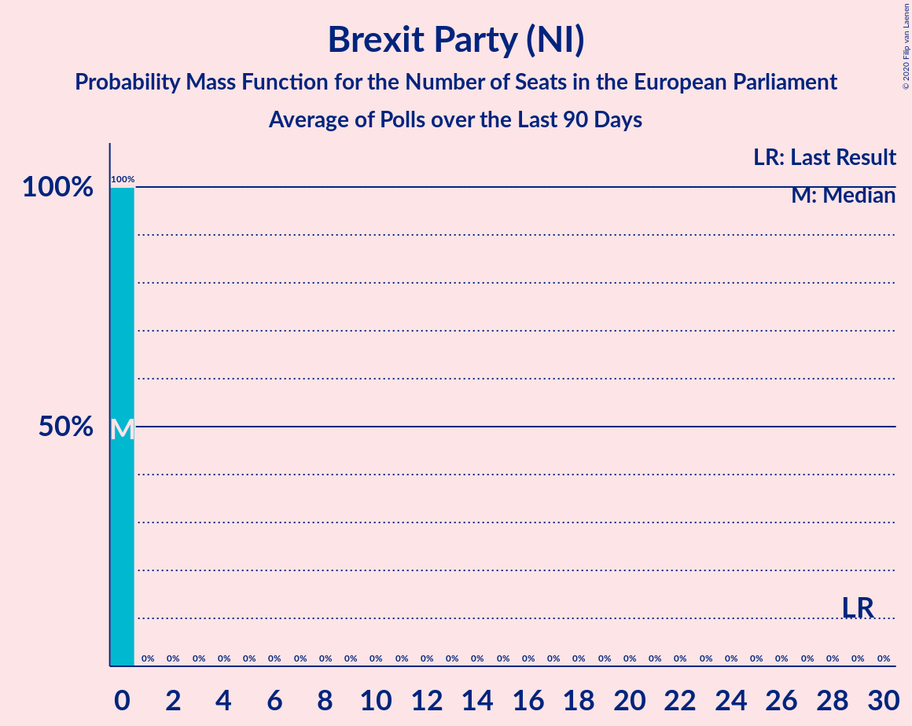

# Poll Average

<a href="#voting-intentions">Voting Intentions</a> | <a href="#seats">Seats</a> | <a href="#coalitions">Coalitions</a> | <a href="#technical-information">Technical Information</a>

## Summary

The table below lists the polls on which the average is based. They are the most recent polls (less than 90 days old) registered and analyzed so far.

| Period     | Polling firm/Commissioner(s) | BREXIT | LIBDEM | LAB | GREEN | CON | SNP | PC | ChUK | UKIP |
|:----------:|:----------------------------:|:--:|:--:|:--:|:--:|:--:|:--:|:--:|:--:|:--:|
| 23 May 2019 | General Election | 30.5%   29 | 19.6%   16 | 13.7%   10 | 11.8%   7 | 8.8%   4 | 3.5%   3 | 1.0%   1 | 3.3%   0 | 3.2%   0 |
| N/A | Poll Average | 4–11%   0–6 | 14–18%   6–13 | 26–32%   20–26 | 1–8%   0–2 | 34–43%   27–38 | 2–5%   1–3 | 0–2%   0–2 | 0–2%   0 | 0–2%   0 |
| [13–14 November 2019](2019-11-14-Panelbase.html) | Panelbase | N/A   N/A | N/A   N/A | N/A   N/A | N/A   N/A | N/A   N/A | N/A   N/A | N/A   N/A | N/A   N/A | N/A   N/A |
| [11–12 November 2019](2019-11-12-YouGov.html) | YouGov   The Times and Sky News | 3–5%   0 | 13–17%   6–10 | 26–30%   20–26 | 3–5%   0 | 40–44%   33–39 | 2–4%   1–2 | 1–2%   0–1 | N/A   N/A | N/A   N/A |
| [11–12 November 2019](2019-11-12-ComRes.html) | ComRes   Daily Telegraph | 6–8%   0–2 | 14–17%   8–13 | 28–32%   22–26 | 2–4%   0 | 37–41%   31–37 | 3–5%   2–3 | 0–1%   0 | 0–1%   0 | 0–1%   0 |
| [7–11 November 2019](2019-11-11-KantarPublic.html) | Kantar Public | 7–11%   1–6 | 15–19%   8–13 | 25–30%   19–25 | 2–4%   0 | 34–40%   28–34 | 2–4%   1–2 | 1–2%   1–2 | 1–2%   0 | 1–2%   0 |
| [8–11 November 2019](2019-11-11-ICMResearch.html) | ICM Research | 7–9%   1–3 | 13–16%   7–9 | 29–33%   25–27 | 2–4%   0 | 36–41%   30–33 | 2–4%   1–2 | 1–2%   0–1 | N/A   N/A | 1–2%   0 |
| [6–9 November 2019](2019-11-09-Deltapoll.html) | Deltapoll   The Mail on Sunday | 5–7%   0–1 | 14–18%   6–13 | 27–32%   21–26 | 1–3%   0 | 39–44%   31–37 | 2–4%   1–2 | 0–1%   0 | N/A   N/A | 1–2%   0 |
| [6–8 November 2019](2019-11-08-Survation.html) | Survation | 9–11%   3–6 | 15–19%   8–13 | 27–31%   21–26 | 1–2%   0 | 33–37%   26–30 | 3–5%   2–3 | 1–2%   1 | N/A   N/A | N/A   N/A |
| [6–8 November 2019](2019-11-08-Opinium.html) | Opinium   The Observer | 5–7%   0–1 | 14–17%   6–8 | 27–31%   22–26 | 1–3%   0 | 39–43%   32–37 | 4–6%   2–3 | 1–2%   0–1 | 0–1%   0 | 0–1%   0 |
| [5–8 November 2019](2019-11-08-BMGResearch.html) | BMG Research   The Independent | 8–10%   1–5 | 14–18%   8–13 | 26–31%   21–26 | 6–8%   0–2 | 34–39%   31–33 | 1–3%   1–2 | 0–1%   0 | 0–1%   0 | 0–1%   0 |
| [30–31 October 2019](2019-10-31-ORB.html) | ORB   The Telegraph | N/A   N/A | N/A   N/A | N/A   N/A | N/A   N/A | N/A   N/A | N/A   N/A | N/A   N/A | N/A   N/A | N/A   N/A |
| [25–28 October 2019](2019-10-28-IpsosMORI.html) | Ipsos MORI | N/A   N/A | N/A   N/A | N/A   N/A | N/A   N/A | N/A   N/A | N/A   N/A | N/A   N/A | N/A   N/A | N/A   N/A |
| 23 May 2019 | General Election | 30.5%   29 | 19.6%   16 | 13.7%   10 | 11.8%   7 | 8.8%   4 | 3.5%   3 | 1.0%   1 | 3.3%   0 | 3.2%   0 |

Only polls for which at least the sample size has been published are included in the table above.

**Legend:**
+ **Top half of each row:** Voting intentions (95% confidence interval)
+ **Bottom half of each row:** Seat projections for the European Parliament (95% confidence interval)
+ **BREXIT:** Brexit Party (NI)
+ **LIBDEM:** Liberal Democrats (RE)
+ **LAB:** Labour Party (S&D)
+ **GREEN:** Green Party (Greens/EFA)
+ **CON:** Conservative Party (ECR)
+ **SNP:** Scottish National Party (Greens/EFA)
+ **PC:** Plaid Cymru (Greens/EFA)
+ **ChUK:** Change UK (RE)
+ **UKIP:** UK Independence Party (ID)
+ **N/A (single party):** Party not included the published results
+ **N/A (entire row):** Calculation for this opinion poll not started yet

## Voting Intentions

### Confidence Intervals

| Party | Last Result | Median | 80% Confidence Interval | 90% Confidence Interval | 95% Confidence Interval | 99% Confidence Interval |
|:-----:|:-----------:|:------:|:-----------------------:|:-----------------------:|:-----------------------:|:-----------------------:|
| <a href="#brexit-party-(ni)">Brexit Party (NI)</a> | 30.5% | 7.4% | 4.5–9.9% |3.9–10.4% | 3.7–10.7% | 3.3–11.3% |
| <a href="#liberal-democrats-(re)">Liberal Democrats (RE)</a> | 19.6% | 15.8% | 14.3–17.5% |14.0–17.9% | 13.7–18.3% | 13.2–19.1% |
| <a href="#labour-party-(s&d)">Labour Party (S&D)</a> | 13.7% | 29.0% | 27.0–30.8% |26.4–31.3% | 25.8–31.7% | 24.8–32.5% |
| <a href="#green-party-(greens/efa)">Green Party (Greens/EFA)</a> | 11.8% | 2.8% | 1.2–6.4% |1.0–7.1% | 0.8–7.5% | 0.7–8.2% |
| <a href="#conservative-party-(ecr)">Conservative Party (ECR)</a> | 8.8% | 39.0% | 35.2–42.3% |34.5–42.9% | 34.0–43.4% | 33.1–44.3% |
| <a href="#scottish-national-party-(greens/efa)">Scottish National Party (Greens/EFA)</a> | 3.5% | 3.3% | 2.2–4.8% |1.9–5.2% | 1.7–5.4% | 1.5–5.9% |
| <a href="#change-uk-(re)">Change UK (RE)</a> | 3.3% | 0.3% | 0.2–1.2% |0.1–1.4% | 0.1–1.5% | 0.1–1.8% |
| <a href="#uk-independence-party-(id)">UK Independence Party (ID)</a> | 3.2% | 0.6% | 0.2–1.3% |0.2–1.4% | 0.1–1.5% | 0.1–1.8% |
| <a href="#plaid-cymru-(greens/efa)">Plaid Cymru (Greens/EFA)</a> | 1.0% | 0.8% | 0.2–1.3% |0.2–1.4% | 0.1–1.5% | 0.1–1.8% |

### Brexit Party (NI)

*For a full overview of the results for this party, see the [Brexit Party (NI)](party-brexitpartyni.html) page.*

| Voting Intentions | Probability | Accumulated | Special Marks |
|:-----------------:|:-----------:|:-----------:|:-------------:|
| 1.5–2.5% | 0% | 100% |  |
| 2.5–3.5% | 2% | 100% |  |
| 3.5–4.5% | 9% | 98% |  |
| 4.5–5.5% | 6% | 89% |  |
| 5.5–6.5% | 19% | 83% |  |
| 6.5–7.5% | 16% | 64% | Median |
| 7.5–8.5% | 16% | 48% |  |
| 8.5–9.5% | 17% | 32% |  |
| 9.5–10.5% | 12% | 16% |  |
| 10.5–11.5% | 3% | 4% |  |
| 11.5–12.5% | 0.2% | 0.2% |  |
| 12.5–13.5% | 0% | 0% |  |
| 13.5–14.5% | 0% | 0% |  |
| 14.5–15.5% | 0% | 0% |  |
| 15.5–16.5% | 0% | 0% |  |
| 16.5–17.5% | 0% | 0% |  |
| 17.5–18.5% | 0% | 0% |  |
| 18.5–19.5% | 0% | 0% |  |
| 19.5–20.5% | 0% | 0% |  |
| 20.5–21.5% | 0% | 0% |  |
| 21.5–22.5% | 0% | 0% |  |
| 22.5–23.5% | 0% | 0% |  |
| 23.5–24.5% | 0% | 0% |  |
| 24.5–25.5% | 0% | 0% |  |
| 25.5–26.5% | 0% | 0% |  |
| 26.5–27.5% | 0% | 0% |  |
| 27.5–28.5% | 0% | 0% |  |
| 28.5–29.5% | 0% | 0% |  |
| 29.5–30.5% | 0% | 0% |  |
| 30.5–31.5% | 0% | 0% | Last Result |

### Liberal Democrats (RE)

*For a full overview of the results for this party, see the [Liberal Democrats (RE)](party-liberaldemocratsre.html) page.*

| Voting Intentions | Probability | Accumulated | Special Marks |
|:-----------------:|:-----------:|:-----------:|:-------------:|
| 11.5–12.5% | 0% | 100% |  |
| 12.5–13.5% | 2% | 100% |  |
| 13.5–14.5% | 12% | 98% |  |
| 14.5–15.5% | 29% | 86% |  |
| 15.5–16.5% | 30% | 57% | Median |
| 16.5–17.5% | 19% | 28% |  |
| 17.5–18.5% | 7% | 9% |  |
| 18.5–19.5% | 1.5% | 2% |  |
| 19.5–20.5% | 0.2% | 0.2% | Last Result |
| 20.5–21.5% | 0% | 0% |  |

### Labour Party (S&D)

*For a full overview of the results for this party, see the [Labour Party (S&D)](party-labourpartysd.html) page.*

| Voting Intentions | Probability | Accumulated | Special Marks |
|:-----------------:|:-----------:|:-----------:|:-------------:|
| 13.5–14.5% | 0% | 100% | Last Result |
| 14.5–15.5% | 0% | 100% |  |
| 15.5–16.5% | 0% | 100% |  |
| 16.5–17.5% | 0% | 100% |  |
| 17.5–18.5% | 0% | 100% |  |
| 18.5–19.5% | 0% | 100% |  |
| 19.5–20.5% | 0% | 100% |  |
| 20.5–21.5% | 0% | 100% |  |
| 21.5–22.5% | 0% | 100% |  |
| 22.5–23.5% | 0% | 100% |  |
| 23.5–24.5% | 0.3% | 100% |  |
| 24.5–25.5% | 1.4% | 99.7% |  |
| 25.5–26.5% | 4% | 98% |  |
| 26.5–27.5% | 11% | 94% |  |
| 27.5–28.5% | 21% | 83% |  |
| 28.5–29.5% | 28% | 62% | Median |
| 29.5–30.5% | 21% | 34% |  |
| 30.5–31.5% | 10% | 13% |  |
| 31.5–32.5% | 3% | 3% |  |
| 32.5–33.5% | 0.4% | 0.5% |  |
| 33.5–34.5% | 0% | 0% |  |

### Green Party (Greens/EFA)

*For a full overview of the results for this party, see the [Green Party (Greens/EFA)](party-greenpartygreensefa.html) page.*

| Voting Intentions | Probability | Accumulated | Special Marks |
|:-----------------:|:-----------:|:-----------:|:-------------:|
| 0.0–0.5% | 0.1% | 100% |  |
| 0.5–1.5% | 14% | 99.9% |  |
| 1.5–2.5% | 26% | 86% |  |
| 2.5–3.5% | 33% | 60% | Median |
| 3.5–4.5% | 13% | 27% |  |
| 4.5–5.5% | 2% | 15% |  |
| 5.5–6.5% | 3% | 12% |  |
| 6.5–7.5% | 7% | 9% |  |
| 7.5–8.5% | 2% | 2% |  |
| 8.5–9.5% | 0.1% | 0.1% |  |
| 9.5–10.5% | 0% | 0% |  |
| 10.5–11.5% | 0% | 0% |  |
| 11.5–12.5% | 0% | 0% | Last Result |

### Conservative Party (ECR)

*For a full overview of the results for this party, see the [Conservative Party (ECR)](party-conservativepartyecr.html) page.*

| Voting Intentions | Probability | Accumulated | Special Marks |
|:-----------------:|:-----------:|:-----------:|:-------------:|
| 8.5–9.5% | 0% | 100% | Last Result |
| 9.5–10.5% | 0% | 100% |  |
| 10.5–11.5% | 0% | 100% |  |
| 11.5–12.5% | 0% | 100% |  |
| 12.5–13.5% | 0% | 100% |  |
| 13.5–14.5% | 0% | 100% |  |
| 14.5–15.5% | 0% | 100% |  |
| 15.5–16.5% | 0% | 100% |  |
| 16.5–17.5% | 0% | 100% |  |
| 17.5–18.5% | 0% | 100% |  |
| 18.5–19.5% | 0% | 100% |  |
| 19.5–20.5% | 0% | 100% |  |
| 20.5–21.5% | 0% | 100% |  |
| 21.5–22.5% | 0% | 100% |  |
| 22.5–23.5% | 0% | 100% |  |
| 23.5–24.5% | 0% | 100% |  |
| 24.5–25.5% | 0% | 100% |  |
| 25.5–26.5% | 0% | 100% |  |
| 26.5–27.5% | 0% | 100% |  |
| 27.5–28.5% | 0% | 100% |  |
| 28.5–29.5% | 0% | 100% |  |
| 29.5–30.5% | 0% | 100% |  |
| 30.5–31.5% | 0% | 100% |  |
| 31.5–32.5% | 0.1% | 100% |  |
| 32.5–33.5% | 1.0% | 99.9% |  |
| 33.5–34.5% | 4% | 98.8% |  |
| 34.5–35.5% | 8% | 95% |  |
| 35.5–36.5% | 10% | 87% |  |
| 36.5–37.5% | 10% | 77% |  |
| 37.5–38.5% | 11% | 67% |  |
| 38.5–39.5% | 12% | 55% | Median |
| 39.5–40.5% | 12% | 43% |  |
| 40.5–41.5% | 13% | 31% |  |
| 41.5–42.5% | 11% | 18% |  |
| 42.5–43.5% | 5% | 7% |  |
| 43.5–44.5% | 2% | 2% |  |
| 44.5–45.5% | 0.3% | 0.3% |  |
| 45.5–46.5% | 0% | 0% |  |

### Scottish National Party (Greens/EFA)

*For a full overview of the results for this party, see the [Scottish National Party (Greens/EFA)](party-scottishnationalpartygreensefa.html) page.*

| Voting Intentions | Probability | Accumulated | Special Marks |
|:-----------------:|:-----------:|:-----------:|:-------------:|
| 0.0–0.5% | 0% | 100% |  |
| 0.5–1.5% | 0.9% | 100% |  |
| 1.5–2.5% | 16% | 99.1% |  |
| 2.5–3.5% | 43% | 83% | Median |
| 3.5–4.5% | 27% | 40% | Last Result |
| 4.5–5.5% | 11% | 13% |  |
| 5.5–6.5% | 2% | 2% |  |
| 6.5–7.5% | 0% | 0% |  |

### Change UK (RE)

*For a full overview of the results for this party, see the [Change UK (RE)](party-changeukre.html) page.*

| Voting Intentions | Probability | Accumulated | Special Marks |
|:-----------------:|:-----------:|:-----------:|:-------------:|
| 0.0–0.5% | 71% | 100% | Median |
| 0.5–1.5% | 26% | 29% |  |
| 1.5–2.5% | 2% | 2% |  |
| 2.5–3.5% | 0% | 0% | Last Result |

### UK Independence Party (ID)

*For a full overview of the results for this party, see the [UK Independence Party (ID)](party-ukindependencepartyid.html) page.*

| Voting Intentions | Probability | Accumulated | Special Marks |
|:-----------------:|:-----------:|:-----------:|:-------------:|
| 0.0–0.5% | 48% | 100% |  |
| 0.5–1.5% | 50% | 52% | Median |
| 1.5–2.5% | 2% | 2% |  |
| 2.5–3.5% | 0% | 0% | Last Result |

### Plaid Cymru (Greens/EFA)

*For a full overview of the results for this party, see the [Plaid Cymru (Greens/EFA)](party-plaidcymrugreensefa.html) page.*

| Voting Intentions | Probability | Accumulated | Special Marks |
|:-----------------:|:-----------:|:-----------:|:-------------:|
| 0.0–0.5% | 35% | 100% |  |
| 0.5–1.5% | 62% | 65% | Last Result, Median |
| 1.5–2.5% | 2% | 2% |  |
| 2.5–3.5% | 0% | 0% |  |

## Seats

### Confidence Intervals

| Party | Last Result | Median | 80% Confidence Interval | 90% Confidence Interval | 95% Confidence Interval | 99% Confidence Interval |
|:-----:|:-----------:|:------:|:-----------------------:|:-----------------------:|:-----------------------:|:-----------------------:|
| <a href="#brexit-party-(ni)">Brexit Party (NI)</a> | 29 | 1 | 0–6 |0–6 | 0–6 | 0–6 |
| <a href="#liberal-democrats-(re)">Liberal Democrats (RE)</a> | 16 | 8 | 8–11 |7–12 | 6–13 | 6–13 |
| <a href="#labour-party-(s&d)">Labour Party (S&D)</a> | 10 | 24 | 21–26 |20–26 | 20–26 | 19–26 |
| <a href="#green-party-(greens/efa)">Green Party (Greens/EFA)</a> | 7 | 0 | 0 |0–2 | 0–2 | 0–2 |
| <a href="#conservative-party-(ecr)">Conservative Party (ECR)</a> | 4 | 33 | 29–37 |28–37 | 27–38 | 26–39 |
| <a href="#scottish-national-party-(greens/efa)">Scottish National Party (Greens/EFA)</a> | 3 | 2 | 1–2 |1–3 | 1–3 | 1–3 |
| <a href="#change-uk-(re)">Change UK (RE)</a> | 0 | 0 | 0 |0 | 0 | 0 |
| <a href="#uk-independence-party-(id)">UK Independence Party (ID)</a> | 0 | 0 | 0 |0 | 0 | 0 |
| <a href="#plaid-cymru-(greens/efa)">Plaid Cymru (Greens/EFA)</a> | 1 | 1 | 0–1 |0–2 | 0–2 | 0–2 |

### Brexit Party (NI)

*For a full overview of the results for this party, see the [Brexit Party (NI)](party-brexitpartyni.html) page.*

| Number of Seats | Probability | Accumulated | Special Marks |
|:---------------:|:-----------:|:-----------:|:-------------:|
| 0 | 33% | 100% |  |
| 1 | 22% | 67% | Median |
| 2 | 12% | 45% |  |
| 3 | 11% | 32% |  |
| 4 | 1.2% | 21% |  |
| 5 | 9% | 20% |  |
| 6 | 10% | 11% |  |
| 7 | 0.5% | 0.5% |  |
| 8 | 0% | 0% |  |
| 9 | 0% | 0% |  |
| 10 | 0% | 0% |  |
| 11 | 0% | 0% |  |
| 12 | 0% | 0% |  |
| 13 | 0% | 0% |  |
| 14 | 0% | 0% |  |
| 15 | 0% | 0% |  |
| 16 | 0% | 0% |  |
| 17 | 0% | 0% |  |
| 18 | 0% | 0% |  |
| 19 | 0% | 0% |  |
| 20 | 0% | 0% |  |
| 21 | 0% | 0% |  |
| 22 | 0% | 0% |  |
| 23 | 0% | 0% |  |
| 24 | 0% | 0% |  |
| 25 | 0% | 0% |  |
| 26 | 0% | 0% |  |
| 27 | 0% | 0% |  |
| 28 | 0% | 0% |  |
| 29 | 0% | 0% | Last Result |

### Liberal Democrats (RE)

*For a full overview of the results for this party, see the [Liberal Democrats (RE)](party-liberaldemocratsre.html) page.*

| Number of Seats | Probability | Accumulated | Special Marks |
|:---------------:|:-----------:|:-----------:|:-------------:|
| 6 | 3% | 100% |  |
| 7 | 4% | 97% |  |
| 8 | 54% | 94% | Median |
| 9 | 10% | 40% |  |
| 10 | 10% | 29% |  |
| 11 | 12% | 19% |  |
| 12 | 4% | 7% |  |
| 13 | 3% | 4% |  |
| 14 | 0.2% | 0.2% |  |
| 15 | 0% | 0% |  |
| 16 | 0% | 0% | Last Result |

### Labour Party (S&D)

*For a full overview of the results for this party, see the [Labour Party (S&D)](party-labourpartysd.html) page.*

| Number of Seats | Probability | Accumulated | Special Marks |
|:---------------:|:-----------:|:-----------:|:-------------:|
| 10 | 0% | 100% | Last Result |
| 11 | 0% | 100% |  |
| 12 | 0% | 100% |  |
| 13 | 0% | 100% |  |
| 14 | 0% | 100% |  |
| 15 | 0% | 100% |  |
| 16 | 0% | 100% |  |
| 17 | 0% | 100% |  |
| 18 | 0.2% | 100% |  |
| 19 | 2% | 99.8% |  |
| 20 | 6% | 98% |  |
| 21 | 9% | 92% |  |
| 22 | 10% | 82% |  |
| 23 | 13% | 72% |  |
| 24 | 14% | 60% | Median |
| 25 | 21% | 46% |  |
| 26 | 24% | 25% |  |
| 27 | 0.2% | 0.5% |  |
| 28 | 0.3% | 0.3% |  |
| 29 | 0% | 0% |  |

### Green Party (Greens/EFA)

*For a full overview of the results for this party, see the [Green Party (Greens/EFA)](party-greenpartygreensefa.html) page.*

| Number of Seats | Probability | Accumulated | Special Marks |
|:---------------:|:-----------:|:-----------:|:-------------:|
| 0 | 92% | 100% | Median |
| 1 | 0.8% | 8% |  |
| 2 | 7% | 7% |  |
| 3 | 0% | 0% |  |
| 4 | 0% | 0% |  |
| 5 | 0% | 0% |  |
| 6 | 0% | 0% |  |
| 7 | 0% | 0% | Last Result |

### Conservative Party (ECR)

*For a full overview of the results for this party, see the [Conservative Party (ECR)](party-conservativepartyecr.html) page.*

| Number of Seats | Probability | Accumulated | Special Marks |
|:---------------:|:-----------:|:-----------:|:-------------:|
| 4 | 0% | 100% | Last Result |
| 5 | 0% | 100% |  |
| 6 | 0% | 100% |  |
| 7 | 0% | 100% |  |
| 8 | 0% | 100% |  |
| 9 | 0% | 100% |  |
| 10 | 0% | 100% |  |
| 11 | 0% | 100% |  |
| 12 | 0% | 100% |  |
| 13 | 0% | 100% |  |
| 14 | 0% | 100% |  |
| 15 | 0% | 100% |  |
| 16 | 0% | 100% |  |
| 17 | 0% | 100% |  |
| 18 | 0% | 100% |  |
| 19 | 0% | 100% |  |
| 20 | 0% | 100% |  |
| 21 | 0% | 100% |  |
| 22 | 0% | 100% |  |
| 23 | 0% | 100% |  |
| 24 | 0% | 100% |  |
| 25 | 0.2% | 99.9% |  |
| 26 | 1.2% | 99.7% |  |
| 27 | 3% | 98.5% |  |
| 28 | 4% | 95% |  |
| 29 | 3% | 91% |  |
| 30 | 8% | 88% |  |
| 31 | 10% | 80% |  |
| 32 | 14% | 69% |  |
| 33 | 23% | 55% | Median |
| 34 | 7% | 32% |  |
| 35 | 9% | 25% |  |
| 36 | 5% | 16% | Majority |
| 37 | 7% | 11% |  |
| 38 | 2% | 5% |  |
| 39 | 2% | 2% |  |
| 40 | 0.1% | 0.1% |  |
| 41 | 0% | 0% |  |

### Scottish National Party (Greens/EFA)

*For a full overview of the results for this party, see the [Scottish National Party (Greens/EFA)](party-scottishnationalpartygreensefa.html) page.*

| Number of Seats | Probability | Accumulated | Special Marks |
|:---------------:|:-----------:|:-----------:|:-------------:|
| 1 | 17% | 100% |  |
| 2 | 76% | 83% | Median |
| 3 | 6% | 6% | Last Result |
| 4 | 0% | 0% |  |

### Change UK (RE)

*For a full overview of the results for this party, see the [Change UK (RE)](party-changeukre.html) page.*

| Number of Seats | Probability | Accumulated | Special Marks |
|:---------------:|:-----------:|:-----------:|:-------------:|
| 0 | 100% | 100% | Last Result, Median |

### UK Independence Party (ID)

*For a full overview of the results for this party, see the [UK Independence Party (ID)](party-ukindependencepartyid.html) page.*

| Number of Seats | Probability | Accumulated | Special Marks |
|:---------------:|:-----------:|:-----------:|:-------------:|
| 0 | 100% | 100% | Last Result, Median |

### Plaid Cymru (Greens/EFA)

*For a full overview of the results for this party, see the [Plaid Cymru (Greens/EFA)](party-plaidcymrugreensefa.html) page.*

| Number of Seats | Probability | Accumulated | Special Marks |
|:---------------:|:-----------:|:-----------:|:-------------:|
| 0 | 38% | 100% |  |
| 1 | 56% | 62% | Last Result, Median |
| 2 | 6% | 6% |  |
| 3 | 0% | 0% |  |

## Coalitions

### Confidence Intervals

| Coalition | Last Result | Median | Majority? | 80% Confidence Interval | 90% Confidence Interval | 95% Confidence Interval | 99% Confidence Interval |
|:---------:|:-----------:|:------:|:---------:|:-----------------------:|:-----------------------:|:-----------------------:|:-----------------------:|
| Conservative Party (ECR) | 4 | 33 | 16% | 29–37 | 28–37 | 27–38 | 26–39 |
| Labour Party (S&D) | 10 | 24 | 0% | 21–26 | 20–26 | 20–26 | 19–26 |
| Liberal Democrats (RE) – Change UK (RE) | 16 | 8 | 0% | 8–11 | 7–12 | 6–13 | 6–13 |
| Brexit Party (NI) | 29 | 1 | 0% | 0–6 | 0–6 | 0–6 | 0–6 |
| Green Party (Greens/EFA) – Scottish National Party (Greens/EFA) – Plaid Cymru (Greens/EFA) | 11 | 3 | 0% | 2–4 | 1–4 | 1–4 | 1–4 |
| UK Independence Party (ID) | 0 | 0 | 0% | 0 | 0 | 0 | 0 |

### Conservative Party (ECR)

| Number of Seats | Probability | Accumulated | Special Marks |
|:---------------:|:-----------:|:-----------:|:-------------:|
| 4 | 0% | 100% | Last Result |
| 5 | 0% | 100% |  |
| 6 | 0% | 100% |  |
| 7 | 0% | 100% |  |
| 8 | 0% | 100% |  |
| 9 | 0% | 100% |  |
| 10 | 0% | 100% |  |
| 11 | 0% | 100% |  |
| 12 | 0% | 100% |  |
| 13 | 0% | 100% |  |
| 14 | 0% | 100% |  |
| 15 | 0% | 100% |  |
| 16 | 0% | 100% |  |
| 17 | 0% | 100% |  |
| 18 | 0% | 100% |  |
| 19 | 0% | 100% |  |
| 20 | 0% | 100% |  |
| 21 | 0% | 100% |  |
| 22 | 0% | 100% |  |
| 23 | 0% | 100% |  |
| 24 | 0% | 100% |  |
| 25 | 0.2% | 99.9% |  |
| 26 | 1.2% | 99.7% |  |
| 27 | 3% | 98.5% |  |
| 28 | 4% | 95% |  |
| 29 | 3% | 91% |  |
| 30 | 8% | 88% |  |
| 31 | 10% | 80% |  |
| 32 | 14% | 69% |  |
| 33 | 23% | 55% | Median |
| 34 | 7% | 32% |  |
| 35 | 9% | 25% |  |
| 36 | 5% | 16% | Majority |
| 37 | 7% | 11% |  |
| 38 | 2% | 5% |  |
| 39 | 2% | 2% |  |
| 40 | 0.1% | 0.1% |  |
| 41 | 0% | 0% |  |

### Labour Party (S&D)

| Number of Seats | Probability | Accumulated | Special Marks |
|:---------------:|:-----------:|:-----------:|:-------------:|
| 10 | 0% | 100% | Last Result |
| 11 | 0% | 100% |  |
| 12 | 0% | 100% |  |
| 13 | 0% | 100% |  |
| 14 | 0% | 100% |  |
| 15 | 0% | 100% |  |
| 16 | 0% | 100% |  |
| 17 | 0% | 100% |  |
| 18 | 0.2% | 100% |  |
| 19 | 2% | 99.8% |  |
| 20 | 6% | 98% |  |
| 21 | 9% | 92% |  |
| 22 | 10% | 82% |  |
| 23 | 13% | 72% |  |
| 24 | 14% | 60% | Median |
| 25 | 21% | 46% |  |
| 26 | 24% | 25% |  |
| 27 | 0.2% | 0.5% |  |
| 28 | 0.3% | 0.3% |  |
| 29 | 0% | 0% |  |

### Liberal Democrats (RE) – Change UK (RE)

| Number of Seats | Probability | Accumulated | Special Marks |
|:---------------:|:-----------:|:-----------:|:-------------:|
| 6 | 3% | 100% |  |
| 7 | 4% | 97% |  |
| 8 | 54% | 94% | Median |
| 9 | 10% | 40% |  |
| 10 | 10% | 29% |  |
| 11 | 12% | 19% |  |
| 12 | 4% | 7% |  |
| 13 | 3% | 4% |  |
| 14 | 0.2% | 0.2% |  |
| 15 | 0% | 0% |  |
| 16 | 0% | 0% | Last Result |

### Brexit Party (NI)

| Number of Seats | Probability | Accumulated | Special Marks |
|:---------------:|:-----------:|:-----------:|:-------------:|
| 0 | 33% | 100% |  |
| 1 | 22% | 67% | Median |
| 2 | 12% | 45% |  |
| 3 | 11% | 32% |  |
| 4 | 1.2% | 21% |  |
| 5 | 9% | 20% |  |
| 6 | 10% | 11% |  |
| 7 | 0.5% | 0.5% |  |
| 8 | 0% | 0% |  |
| 9 | 0% | 0% |  |
| 10 | 0% | 0% |  |
| 11 | 0% | 0% |  |
| 12 | 0% | 0% |  |
| 13 | 0% | 0% |  |
| 14 | 0% | 0% |  |
| 15 | 0% | 0% |  |
| 16 | 0% | 0% |  |
| 17 | 0% | 0% |  |
| 18 | 0% | 0% |  |
| 19 | 0% | 0% |  |
| 20 | 0% | 0% |  |
| 21 | 0% | 0% |  |
| 22 | 0% | 0% |  |
| 23 | 0% | 0% |  |
| 24 | 0% | 0% |  |
| 25 | 0% | 0% |  |
| 26 | 0% | 0% |  |
| 27 | 0% | 0% |  |
| 28 | 0% | 0% |  |
| 29 | 0% | 0% | Last Result |

### Green Party (Greens/EFA) – Scottish National Party (Greens/EFA) – Plaid Cymru (Greens/EFA)

| Number of Seats | Probability | Accumulated | Special Marks |
|:---------------:|:-----------:|:-----------:|:-------------:|
| 1 | 5% | 100% |  |
| 2 | 29% | 95% |  |
| 3 | 54% | 66% | Median |
| 4 | 12% | 12% |  |
| 5 | 0.1% | 0.1% |  |
| 6 | 0% | 0% |  |
| 7 | 0% | 0% |  |
| 8 | 0% | 0% |  |
| 9 | 0% | 0% |  |
| 10 | 0% | 0% |  |
| 11 | 0% | 0% | Last Result |

### UK Independence Party (ID)

| Number of Seats | Probability | Accumulated | Special Marks |
|:---------------:|:-----------:|:-----------:|:-------------:|
| 0 | 100% | 100% | Last Result, Median |

## Technical Information

+ **Number of polls included in this average:** 11
+ **Lowest number of simulations done in a poll included in this average:** 0
+ **Total number of simulations done in the polls included in this average:** 950,272
+ **Error estimate:** 2.76%
