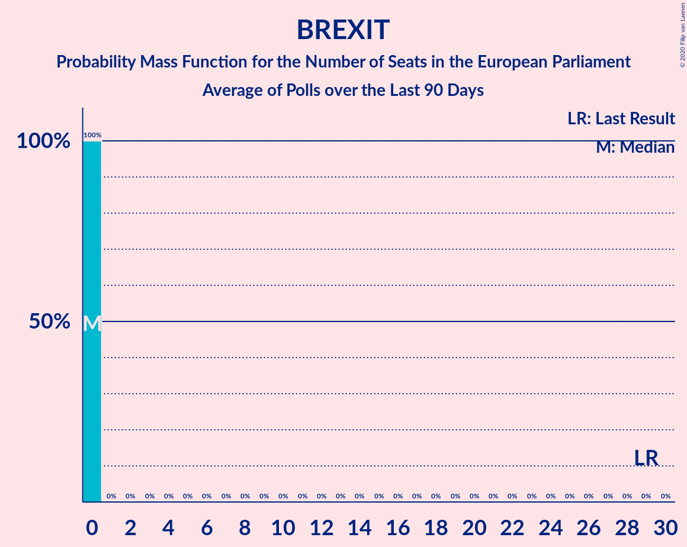

# Poll Average

<a href="#voting-intentions">Voting Intentions</a> | <a href="#seats">Seats</a> | <a href="#coalitions">Coalitions</a> | <a href="#technical-information">Technical Information</a>

## Summary

The table below lists the polls on which the average is based. They are the most recent polls (less than 90 days old) registered and analyzed so far.

| Period     | Polling firm/Commissioner(s) | UKIP | LAB | CON | GREEN | LIBDEM | SNP | PC | BREXIT | ChUK |
|:----------:|:----------------------------:|:--:|:--:|:--:|:--:|:--:|:--:|:--:|:--:|:--:|
| 23 May 2019 | General Election | 26.6%   24 | 24.4%   20 | 23.1%   19 | 6.9%   3 | 6.6%   1 | 2.4%   2 | 0.7%   1 | 0.0%   0 | 0.0%   0 |
| N/A | Poll Average | 0–2%   0 | 17–28%   12–23 | 19–28%   15–24 | 4–10%   0–5 | 15–24%   9–18 | 2–5%   2–3 | 1–2%   0–2 | 11–24%   7–19 | 0–2%   0 |
| [2–3 July 2019](2019-07-03-YouGov.html) | YouGov   The Times | 0–1%   0 | 16–20%   9–16 | 22–26%   17–21 | 8–10%   0–6 | 18–22%   11–15 | 3–5%   3 | 1–2%   0–1 | 21–25%   16–18 | 0–1%   0 |
| [21–25 June 2019](2019-06-25-IpsosMORI.html) | Ipsos MORI | 1–2%   0 | 22–27%   15–23 | 24–29%   19–24 | 7–10%   0–6 | 20–25%   12–22 | 3–5%   2–3 | 1–2%   0–2 | 10–14%   6–10 | 0–1%   0 |
| [19–20 June 2019](2019-06-20-Survation.html) | Survation   Daily Mail on Sunday | 1–2%   0 | 24–28%   17–21 | 22–26%   16–22 | 5–7%   0–2 | 16–20%   10–14 | 2–4%   2–3 | 1–2%   1 | 18–22%   14–18 | 1–2%   0 |
| [19–20 June 2019](2019-06-20-Opinium.html) | Opinium   The Observer | 1–3%   0 | 24–28%   20–23 | 18–22%   13–16 | 5–7%   0–2 | 14–18%   9–13 | 3–5%   3–4 | 1–2%   0–1 | 21–25%   18–21 | 1–2%   0 |
| [7–9 June 2019](2019-06-09-ComRes.html) | ComRes   Daily Telegraph | 1–2%   0 | 25–29%   18–22 | 21–25%   15–19 | 4–6%   0 | 15–19%   9–14 | 2–4%   2–3 | 1–2%   1 | 20–24%   17–19 | 1–2%   0 |
| [4–7 June 2019](2019-06-07-BMGResearch.html) | BMG Research   The Independent | 1–2%   0 | 25–29%   17–23 | 24–28%   16–22 | N/A   N/A | 15–19%   8–13 | N/A   N/A | N/A   N/A | 16–20%   10–14 | N/A   N/A |
| 23 May 2019 | General Election | 26.6%   24 | 24.4%   20 | 23.1%   19 | 6.9%   3 | 6.6%   1 | 2.4%   2 | 0.7%   1 | 0.0%   0 | 0.0%   0 |

Only polls for which at least the sample size has been published are included in the table above.

**Legend:**
+ **Top half of each row:** Voting intentions (95% confidence interval)
+ **Bottom half of each row:** Seat projections for the European Parliament (95% confidence interval)
+ **UKIP:** UK Independence Party (ID)
+ **LAB:** Labour Party (S&D)
+ **CON:** Conservative Party (ECR)
+ **GREEN:** Green Party (Greens/EFA)
+ **LIBDEM:** Liberal Democrats (RE)
+ **SNP:** Scottish National Party (Greens/EFA)
+ **PC:** Plaid Cymru (Greens/EFA)
+ **BREXIT:** Brexit Party (NI)
+ **ChUK:** Change UK (RE)
+ **N/A (single party):** Party not included the published results
+ **N/A (entire row):** Calculation for this opinion poll not started yet

## Voting Intentions

### Confidence Intervals

| Party | Last Result | Median | 80% Confidence Interval | 90% Confidence Interval | 95% Confidence Interval | 99% Confidence Interval |
|:-----:|:-----------:|:------:|:-----------------------:|:-----------------------:|:-----------------------:|:-----------------------:|
| <a href="#uk-independence-party-(id)">UK Independence Party (ID)</a> | 26.6% | 1.0% | 0.3–2.0% |0.2–2.2% | 0.2–2.4% | 0.1–2.7% |
| <a href="#labour-party-(s&d)">Labour Party (S&D)</a> | 24.4% | 25.7% | 18.1–27.6% |17.4–28.1% | 16.9–28.5% | 16.2–29.3% |
| <a href="#conservative-party-(ecr)">Conservative Party (ECR)</a> | 23.1% | 23.9% | 20.2–26.8% |19.6–27.5% | 19.1–28.1% | 18.4–29.1% |
| <a href="#green-party-(greens/efa)">Green Party (Greens/EFA)</a> | 6.9% | 6.4% | 4.9–9.2% |4.7–9.6% | 4.4–10.0% | 4.1–10.6% |
| <a href="#liberal-democrats-(re)">Liberal Democrats (RE)</a> | 6.6% | 17.7% | 15.8–22.1% |15.4–23.1% | 15.1–23.7% | 14.5–24.9% |
| <a href="#scottish-national-party-(greens/efa)">Scottish National Party (Greens/EFA)</a> | 2.4% | 3.6% | 2.8–4.5% |2.6–4.8% | 2.5–5.0% | 2.2–5.5% |
| <a href="#plaid-cymru-(greens/efa)">Plaid Cymru (Greens/EFA)</a> | 0.7% | 1.0% | 0.8–1.4% |0.7–1.5% | 0.6–1.6% | 0.5–1.9% |
| <a href="#brexit-party-(ni)">Brexit Party (NI)</a> | 0.0% | 20.8% | 12.5–23.5% |11.7–24.0% | 11.2–24.4% | 10.4–25.2% |
| <a href="#change-uk-(re)">Change UK (RE)</a> | 0.0% | 0.8% | 0.2–1.3% |0.2–1.4% | 0.1–1.5% | 0.1–1.7% |

### UK Independence Party (ID)

*For a full overview of the results for this party, see the [UK Independence Party (ID)](party-ukindependencepartyid.html) page.*

| Voting Intentions | Probability | Accumulated | Special Marks |
|:-----------------:|:-----------:|:-----------:|:-------------:|
| 0.0–0.5% | 16% | 100% |  |
| 0.5–1.5% | 65% | 84% | Median |
| 1.5–2.5% | 18% | 19% |  |
| 2.5–3.5% | 1.0% | 1.0% |  |
| 3.5–4.5% | 0% | 0% |  |
| 4.5–5.5% | 0% | 0% |  |
| 5.5–6.5% | 0% | 0% |  |
| 6.5–7.5% | 0% | 0% |  |
| 7.5–8.5% | 0% | 0% |  |
| 8.5–9.5% | 0% | 0% |  |
| 9.5–10.5% | 0% | 0% |  |
| 10.5–11.5% | 0% | 0% |  |
| 11.5–12.5% | 0% | 0% |  |
| 12.5–13.5% | 0% | 0% |  |
| 13.5–14.5% | 0% | 0% |  |
| 14.5–15.5% | 0% | 0% |  |
| 15.5–16.5% | 0% | 0% |  |
| 16.5–17.5% | 0% | 0% |  |
| 17.5–18.5% | 0% | 0% |  |
| 18.5–19.5% | 0% | 0% |  |
| 19.5–20.5% | 0% | 0% |  |
| 20.5–21.5% | 0% | 0% |  |
| 21.5–22.5% | 0% | 0% |  |
| 22.5–23.5% | 0% | 0% |  |
| 23.5–24.5% | 0% | 0% |  |
| 24.5–25.5% | 0% | 0% |  |
| 25.5–26.5% | 0% | 0% |  |
| 26.5–27.5% | 0% | 0% | Last Result |

### Labour Party (S&D)

*For a full overview of the results for this party, see the [Labour Party (S&D)](party-labourpartysd.html) page.*

| Voting Intentions | Probability | Accumulated | Special Marks |
|:-----------------:|:-----------:|:-----------:|:-------------:|
| 13.5–14.5% | 0% | 100% |  |
| 14.5–15.5% | 0.1% | 100% |  |
| 15.5–16.5% | 1.1% | 99.9% |  |
| 16.5–17.5% | 5% | 98.8% |  |
| 17.5–18.5% | 7% | 94% |  |
| 18.5–19.5% | 3% | 88% |  |
| 19.5–20.5% | 0.7% | 84% |  |
| 20.5–21.5% | 0.3% | 83% |  |
| 21.5–22.5% | 1.1% | 83% |  |
| 22.5–23.5% | 3% | 82% |  |
| 23.5–24.5% | 8% | 79% | Last Result |
| 24.5–25.5% | 17% | 71% |  |
| 25.5–26.5% | 25% | 54% | Median |
| 26.5–27.5% | 19% | 30% |  |
| 27.5–28.5% | 8% | 10% |  |
| 28.5–29.5% | 2% | 2% |  |
| 29.5–30.5% | 0.3% | 0.3% |  |
| 30.5–31.5% | 0% | 0% |  |

### Conservative Party (ECR)

*For a full overview of the results for this party, see the [Conservative Party (ECR)](party-conservativepartyecr.html) page.*

| Voting Intentions | Probability | Accumulated | Special Marks |
|:-----------------:|:-----------:|:-----------:|:-------------:|
| 16.5–17.5% | 0% | 100% |  |
| 17.5–18.5% | 0.7% | 100% |  |
| 18.5–19.5% | 4% | 99.2% |  |
| 19.5–20.5% | 7% | 95% |  |
| 20.5–21.5% | 6% | 88% |  |
| 21.5–22.5% | 9% | 82% |  |
| 22.5–23.5% | 17% | 73% | Last Result |
| 23.5–24.5% | 18% | 57% | Median |
| 24.5–25.5% | 14% | 39% |  |
| 25.5–26.5% | 12% | 25% |  |
| 26.5–27.5% | 8% | 13% |  |
| 27.5–28.5% | 4% | 5% |  |
| 28.5–29.5% | 1.0% | 1.2% |  |
| 29.5–30.5% | 0.2% | 0.2% |  |
| 30.5–31.5% | 0% | 0% |  |

### Green Party (Greens/EFA)

*For a full overview of the results for this party, see the [Green Party (Greens/EFA)](party-greenpartygreensefa.html) page.*

| Voting Intentions | Probability | Accumulated | Special Marks |
|:-----------------:|:-----------:|:-----------:|:-------------:|
| 2.5–3.5% | 0% | 100% |  |
| 3.5–4.5% | 4% | 100% |  |
| 4.5–5.5% | 21% | 96% |  |
| 5.5–6.5% | 29% | 75% | Median |
| 6.5–7.5% | 11% | 46% | Last Result |
| 7.5–8.5% | 14% | 36% |  |
| 8.5–9.5% | 16% | 22% |  |
| 9.5–10.5% | 5% | 6% |  |
| 10.5–11.5% | 0.5% | 0.5% |  |
| 11.5–12.5% | 0% | 0% |  |

### Liberal Democrats (RE)

*For a full overview of the results for this party, see the [Liberal Democrats (RE)](party-liberaldemocratsre.html) page.*

| Voting Intentions | Probability | Accumulated | Special Marks |
|:-----------------:|:-----------:|:-----------:|:-------------:|
| 6.5–7.5% | 0% | 100% | Last Result |
| 7.5–8.5% | 0% | 100% |  |
| 8.5–9.5% | 0% | 100% |  |
| 9.5–10.5% | 0% | 100% |  |
| 10.5–11.5% | 0% | 100% |  |
| 11.5–12.5% | 0% | 100% |  |
| 12.5–13.5% | 0% | 100% |  |
| 13.5–14.5% | 0.7% | 100% |  |
| 14.5–15.5% | 6% | 99.3% |  |
| 15.5–16.5% | 18% | 93% |  |
| 16.5–17.5% | 23% | 75% |  |
| 17.5–18.5% | 16% | 52% | Median |
| 18.5–19.5% | 9% | 37% |  |
| 19.5–20.5% | 8% | 28% |  |
| 20.5–21.5% | 7% | 20% |  |
| 21.5–22.5% | 6% | 13% |  |
| 22.5–23.5% | 4% | 7% |  |
| 23.5–24.5% | 2% | 3% |  |
| 24.5–25.5% | 0.7% | 0.8% |  |
| 25.5–26.5% | 0.1% | 0.1% |  |
| 26.5–27.5% | 0% | 0% |  |

### Scottish National Party (Greens/EFA)

*For a full overview of the results for this party, see the [Scottish National Party (Greens/EFA)](party-scottishnationalpartygreensefa.html) page.*

| Voting Intentions | Probability | Accumulated | Special Marks |
|:-----------------:|:-----------:|:-----------:|:-------------:|
| 0.5–1.5% | 0% | 100% |  |
| 1.5–2.5% | 4% | 100% | Last Result |
| 2.5–3.5% | 42% | 96% |  |
| 3.5–4.5% | 44% | 54% | Median |
| 4.5–5.5% | 10% | 10% |  |
| 5.5–6.5% | 0.4% | 0.4% |  |
| 6.5–7.5% | 0% | 0% |  |

### Plaid Cymru (Greens/EFA)

*For a full overview of the results for this party, see the [Plaid Cymru (Greens/EFA)](party-plaidcymrugreensefa.html) page.*

| Voting Intentions | Probability | Accumulated | Special Marks |
|:-----------------:|:-----------:|:-----------:|:-------------:|
| 0.0–0.5% | 0.8% | 100% |  |
| 0.5–1.5% | 95% | 99.2% | Last Result, Median |
| 1.5–2.5% | 4% | 4% |  |
| 2.5–3.5% | 0% | 0% |  |

### Brexit Party (NI)

*For a full overview of the results for this party, see the [Brexit Party (NI)](party-brexitpartyni.html) page.*

| Voting Intentions | Probability | Accumulated | Special Marks |
|:-----------------:|:-----------:|:-----------:|:-------------:|
| 0.0–0.5% | 0% | 100% | Last Result |
| 0.5–1.5% | 0% | 100% |  |
| 1.5–2.5% | 0% | 100% |  |
| 2.5–3.5% | 0% | 100% |  |
| 3.5–4.5% | 0% | 100% |  |
| 4.5–5.5% | 0% | 100% |  |
| 5.5–6.5% | 0% | 100% |  |
| 6.5–7.5% | 0% | 100% |  |
| 7.5–8.5% | 0% | 100% |  |
| 8.5–9.5% | 0% | 100% |  |
| 9.5–10.5% | 0.7% | 100% |  |
| 10.5–11.5% | 3% | 99.3% |  |
| 11.5–12.5% | 6% | 96% |  |
| 12.5–13.5% | 5% | 90% |  |
| 13.5–14.5% | 1.5% | 85% |  |
| 14.5–15.5% | 0.3% | 84% |  |
| 15.5–16.5% | 0.9% | 83% |  |
| 16.5–17.5% | 4% | 82% |  |
| 17.5–18.5% | 8% | 78% |  |
| 18.5–19.5% | 9% | 71% |  |
| 19.5–20.5% | 9% | 61% |  |
| 20.5–21.5% | 11% | 52% | Median |
| 21.5–22.5% | 16% | 41% |  |
| 22.5–23.5% | 16% | 25% |  |
| 23.5–24.5% | 8% | 10% |  |
| 24.5–25.5% | 2% | 2% |  |
| 25.5–26.5% | 0.2% | 0.2% |  |
| 26.5–27.5% | 0% | 0% |  |

### Change UK (RE)

*For a full overview of the results for this party, see the [Change UK (RE)](party-changeukre.html) page.*

| Voting Intentions | Probability | Accumulated | Special Marks |
|:-----------------:|:-----------:|:-----------:|:-------------:|
| 0.0–0.5% | 36% | 100% | Last Result |
| 0.5–1.5% | 63% | 64% | Median |
| 1.5–2.5% | 1.2% | 1.2% |  |
| 2.5–3.5% | 0% | 0% |  |

## Seats

### Confidence Intervals

| Party | Last Result | Median | 80% Confidence Interval | 90% Confidence Interval | 95% Confidence Interval | 99% Confidence Interval |
|:-----:|:-----------:|:------:|:-----------------------:|:-----------------------:|:-----------------------:|:-----------------------:|
| <a href="#uk-independence-party-(id)">UK Independence Party (ID)</a> | 24 | 0 | 0 |0 | 0 | 0 |
| <a href="#labour-party-(s&d)">Labour Party (S&D)</a> | 20 | 19 | 15–22 |14–22 | 12–23 | 10–24 |
| <a href="#conservative-party-(ecr)">Conservative Party (ECR)</a> | 19 | 19 | 15–22 |15–23 | 15–24 | 13–24 |
| <a href="#green-party-(greens/efa)">Green Party (Greens/EFA)</a> | 3 | 1 | 0–3 |0–4 | 0–5 | 0–6 |
| <a href="#liberal-democrats-(re)">Liberal Democrats (RE)</a> | 1 | 12 | 10–15 |9–18 | 9–18 | 8–22 |
| <a href="#scottish-national-party-(greens/efa)">Scottish National Party (Greens/EFA)</a> | 2 | 3 | 2–3 |2–3 | 2–3 | 2–4 |
| <a href="#plaid-cymru-(greens/efa)">Plaid Cymru (Greens/EFA)</a> | 1 | 1 | 1 |0–2 | 0–2 | 0–2 |
| <a href="#brexit-party-(ni)">Brexit Party (NI)</a> | 0 | 17 | 8–18 |7–19 | 7–19 | 6–21 |
| <a href="#change-uk-(re)">Change UK (RE)</a> | 0 | 0 | 0 |0 | 0 | 0 |

### UK Independence Party (ID)

*For a full overview of the results for this party, see the [UK Independence Party (ID)](party-ukindependencepartyid.html) page.*

| Number of Seats | Probability | Accumulated | Special Marks |
|:---------------:|:-----------:|:-----------:|:-------------:|
| 0 | 100% | 100% | Median |
| 1 | 0% | 0% |  |
| 2 | 0% | 0% |  |
| 3 | 0% | 0% |  |
| 4 | 0% | 0% |  |
| 5 | 0% | 0% |  |
| 6 | 0% | 0% |  |
| 7 | 0% | 0% |  |
| 8 | 0% | 0% |  |
| 9 | 0% | 0% |  |
| 10 | 0% | 0% |  |
| 11 | 0% | 0% |  |
| 12 | 0% | 0% |  |
| 13 | 0% | 0% |  |
| 14 | 0% | 0% |  |
| 15 | 0% | 0% |  |
| 16 | 0% | 0% |  |
| 17 | 0% | 0% |  |
| 18 | 0% | 0% |  |
| 19 | 0% | 0% |  |
| 20 | 0% | 0% |  |
| 21 | 0% | 0% |  |
| 22 | 0% | 0% |  |
| 23 | 0% | 0% |  |
| 24 | 0% | 0% | Last Result |

### Labour Party (S&D)

*For a full overview of the results for this party, see the [Labour Party (S&D)](party-labourpartysd.html) page.*

| Number of Seats | Probability | Accumulated | Special Marks |
|:---------------:|:-----------:|:-----------:|:-------------:|
| 9 | 0.5% | 100% |  |
| 10 | 0.2% | 99.5% |  |
| 11 | 0.1% | 99.4% |  |
| 12 | 2% | 99.3% |  |
| 13 | 0.6% | 97% |  |
| 14 | 4% | 96% |  |
| 15 | 7% | 92% |  |
| 16 | 6% | 85% |  |
| 17 | 11% | 79% |  |
| 18 | 7% | 68% |  |
| 19 | 12% | 61% | Median |
| 20 | 28% | 49% | Last Result |
| 21 | 10% | 20% |  |
| 22 | 7% | 10% |  |
| 23 | 2% | 3% |  |
| 24 | 0.7% | 0.8% |  |
| 25 | 0.1% | 0.1% |  |
| 26 | 0% | 0% |  |

### Conservative Party (ECR)

*For a full overview of the results for this party, see the [Conservative Party (ECR)](party-conservativepartyecr.html) page.*

| Number of Seats | Probability | Accumulated | Special Marks |
|:---------------:|:-----------:|:-----------:|:-------------:|
| 12 | 0.3% | 100% |  |
| 13 | 1.2% | 99.6% |  |
| 14 | 0.5% | 98% |  |
| 15 | 12% | 98% |  |
| 16 | 20% | 86% |  |
| 17 | 10% | 67% |  |
| 18 | 6% | 57% |  |
| 19 | 8% | 51% | Last Result, Median |
| 20 | 18% | 43% |  |
| 21 | 10% | 25% |  |
| 22 | 7% | 15% |  |
| 23 | 5% | 9% |  |
| 24 | 4% | 4% |  |
| 25 | 0% | 0% |  |

### Green Party (Greens/EFA)

*For a full overview of the results for this party, see the [Green Party (Greens/EFA)](party-greenpartygreensefa.html) page.*

| Number of Seats | Probability | Accumulated | Special Marks |
|:---------------:|:-----------:|:-----------:|:-------------:|
| 0 | 50% | 100% |  |
| 1 | 13% | 50% | Median |
| 2 | 23% | 37% |  |
| 3 | 8% | 13% | Last Result |
| 4 | 0.7% | 6% |  |
| 5 | 3% | 5% |  |
| 6 | 2% | 2% |  |
| 7 | 0.2% | 0.2% |  |
| 8 | 0% | 0% |  |

### Liberal Democrats (RE)

*For a full overview of the results for this party, see the [Liberal Democrats (RE)](party-liberaldemocratsre.html) page.*

| Number of Seats | Probability | Accumulated | Special Marks |
|:---------------:|:-----------:|:-----------:|:-------------:|
| 1 | 0% | 100% | Last Result |
| 2 | 0% | 100% |  |
| 3 | 0% | 100% |  |
| 4 | 0% | 100% |  |
| 5 | 0% | 100% |  |
| 6 | 0% | 100% |  |
| 7 | 0.2% | 100% |  |
| 8 | 2% | 99.8% |  |
| 9 | 7% | 98% |  |
| 10 | 11% | 91% |  |
| 11 | 13% | 80% |  |
| 12 | 18% | 67% | Median |
| 13 | 27% | 49% |  |
| 14 | 7% | 22% |  |
| 15 | 6% | 15% |  |
| 16 | 0.8% | 10% |  |
| 17 | 3% | 9% |  |
| 18 | 4% | 6% |  |
| 19 | 1.0% | 2% |  |
| 20 | 0.4% | 1.2% |  |
| 21 | 0.1% | 0.8% |  |
| 22 | 0.7% | 0.7% |  |
| 23 | 0% | 0% |  |

### Scottish National Party (Greens/EFA)

*For a full overview of the results for this party, see the [Scottish National Party (Greens/EFA)](party-scottishnationalpartygreensefa.html) page.*

| Number of Seats | Probability | Accumulated | Special Marks |
|:---------------:|:-----------:|:-----------:|:-------------:|
| 2 | 46% | 100% | Last Result |
| 3 | 53% | 54% | Median |
| 4 | 0.9% | 0.9% |  |
| 5 | 0% | 0% |  |

### Plaid Cymru (Greens/EFA)

*For a full overview of the results for this party, see the [Plaid Cymru (Greens/EFA)](party-plaidcymrugreensefa.html) page.*

| Number of Seats | Probability | Accumulated | Special Marks |
|:---------------:|:-----------:|:-----------:|:-------------:|
| 0 | 5% | 100% |  |
| 1 | 86% | 95% | Last Result, Median |
| 2 | 9% | 9% |  |
| 3 | 0% | 0% |  |

### Brexit Party (NI)

*For a full overview of the results for this party, see the [Brexit Party (NI)](party-brexitpartyni.html) page.*

| Number of Seats | Probability | Accumulated | Special Marks |
|:---------------:|:-----------:|:-----------:|:-------------:|
| 0 | 0% | 100% | Last Result |
| 1 | 0% | 100% |  |
| 2 | 0% | 100% |  |
| 3 | 0% | 100% |  |
| 4 | 0.1% | 100% |  |
| 5 | 0.3% | 99.9% |  |
| 6 | 0.6% | 99.6% |  |
| 7 | 8% | 99.0% |  |
| 8 | 6% | 91% |  |
| 9 | 0.7% | 85% |  |
| 10 | 3% | 84% |  |
| 11 | 8% | 81% |  |
| 12 | 5% | 74% |  |
| 13 | 1.4% | 69% |  |
| 14 | 2% | 67% |  |
| 15 | 1.3% | 65% |  |
| 16 | 5% | 64% |  |
| 17 | 32% | 59% | Median |
| 18 | 18% | 28% |  |
| 19 | 8% | 9% |  |
| 20 | 0.8% | 2% |  |
| 21 | 0.7% | 0.8% |  |
| 22 | 0% | 0% |  |

### Change UK (RE)

*For a full overview of the results for this party, see the [Change UK (RE)](party-changeukre.html) page.*

| Number of Seats | Probability | Accumulated | Special Marks |
|:---------------:|:-----------:|:-----------:|:-------------:|
| 0 | 100% | 100% | Last Result, Median |

## Coalitions

### Confidence Intervals

| Coalition | Last Result | Median | Majority? | 80% Confidence Interval | 90% Confidence Interval | 95% Confidence Interval | 99% Confidence Interval |
|:---------:|:-----------:|:------:|:---------:|:-----------------------:|:-----------------------:|:-----------------------:|:-----------------------:|
| Conservative Party (ECR) | 19 | 19 | 0% | 15–22 | 15–23 | 15–24 | 13–24 |
| Labour Party (S&D) | 20 | 19 | 0% | 15–22 | 14–22 | 12–23 | 10–24 |
| Brexit Party (NI) | 0 | 17 | 0% | 8–18 | 7–19 | 7–19 | 6–21 |
| Liberal Democrats (RE) – Change UK (RE) | 1 | 12 | 0% | 10–15 | 9–18 | 9–18 | 8–22 |
| Green Party (Greens/EFA) – Scottish National Party (Greens/EFA) – Plaid Cymru (Greens/EFA) | 6 | 5 | 0% | 3–10 | 3–10 | 3–10 | 3–11 |
| UK Independence Party (ID) | 24 | 0 | 0% | 0 | 0 | 0 | 0 |

### Conservative Party (ECR)

| Number of Seats | Probability | Accumulated | Special Marks |
|:---------------:|:-----------:|:-----------:|:-------------:|
| 12 | 0.3% | 100% |  |
| 13 | 1.2% | 99.6% |  |
| 14 | 0.5% | 98% |  |
| 15 | 12% | 98% |  |
| 16 | 20% | 86% |  |
| 17 | 10% | 67% |  |
| 18 | 6% | 57% |  |
| 19 | 8% | 51% | Last Result, Median |
| 20 | 18% | 43% |  |
| 21 | 10% | 25% |  |
| 22 | 7% | 15% |  |
| 23 | 5% | 9% |  |
| 24 | 4% | 4% |  |
| 25 | 0% | 0% |  |

### Labour Party (S&D)

| Number of Seats | Probability | Accumulated | Special Marks |
|:---------------:|:-----------:|:-----------:|:-------------:|
| 9 | 0.5% | 100% |  |
| 10 | 0.2% | 99.5% |  |
| 11 | 0.1% | 99.4% |  |
| 12 | 2% | 99.3% |  |
| 13 | 0.6% | 97% |  |
| 14 | 4% | 96% |  |
| 15 | 7% | 92% |  |
| 16 | 6% | 85% |  |
| 17 | 11% | 79% |  |
| 18 | 7% | 68% |  |
| 19 | 12% | 61% | Median |
| 20 | 28% | 49% | Last Result |
| 21 | 10% | 20% |  |
| 22 | 7% | 10% |  |
| 23 | 2% | 3% |  |
| 24 | 0.7% | 0.8% |  |
| 25 | 0.1% | 0.1% |  |
| 26 | 0% | 0% |  |

### Brexit Party (NI)

| Number of Seats | Probability | Accumulated | Special Marks |
|:---------------:|:-----------:|:-----------:|:-------------:|
| 0 | 0% | 100% | Last Result |
| 1 | 0% | 100% |  |
| 2 | 0% | 100% |  |
| 3 | 0% | 100% |  |
| 4 | 0.1% | 100% |  |
| 5 | 0.3% | 99.9% |  |
| 6 | 0.6% | 99.6% |  |
| 7 | 8% | 99.0% |  |
| 8 | 6% | 91% |  |
| 9 | 0.7% | 85% |  |
| 10 | 3% | 84% |  |
| 11 | 8% | 81% |  |
| 12 | 5% | 74% |  |
| 13 | 1.4% | 69% |  |
| 14 | 2% | 67% |  |
| 15 | 1.3% | 65% |  |
| 16 | 5% | 64% |  |
| 17 | 32% | 59% | Median |
| 18 | 18% | 28% |  |
| 19 | 8% | 9% |  |
| 20 | 0.8% | 2% |  |
| 21 | 0.7% | 0.8% |  |
| 22 | 0% | 0% |  |

### Liberal Democrats (RE) – Change UK (RE)

| Number of Seats | Probability | Accumulated | Special Marks |
|:---------------:|:-----------:|:-----------:|:-------------:|
| 1 | 0% | 100% | Last Result |
| 2 | 0% | 100% |  |
| 3 | 0% | 100% |  |
| 4 | 0% | 100% |  |
| 5 | 0% | 100% |  |
| 6 | 0% | 100% |  |
| 7 | 0.2% | 100% |  |
| 8 | 2% | 99.8% |  |
| 9 | 7% | 98% |  |
| 10 | 11% | 91% |  |
| 11 | 13% | 80% |  |
| 12 | 18% | 67% | Median |
| 13 | 27% | 49% |  |
| 14 | 7% | 22% |  |
| 15 | 6% | 15% |  |
| 16 | 0.8% | 10% |  |
| 17 | 3% | 9% |  |
| 18 | 4% | 6% |  |
| 19 | 1.0% | 2% |  |
| 20 | 0.4% | 1.2% |  |
| 21 | 0.1% | 0.8% |  |
| 22 | 0.7% | 0.7% |  |
| 23 | 0% | 0% |  |

### Green Party (Greens/EFA) – Scottish National Party (Greens/EFA) – Plaid Cymru (Greens/EFA)

| Number of Seats | Probability | Accumulated | Special Marks |
|:---------------:|:-----------:|:-----------:|:-------------:|
| 2 | 0.2% | 100% |  |
| 3 | 23% | 99.8% |  |
| 4 | 24% | 77% |  |
| 5 | 11% | 52% | Median |
| 6 | 11% | 41% | Last Result |
| 7 | 8% | 30% |  |
| 8 | 1.1% | 21% |  |
| 9 | 3% | 20% |  |
| 10 | 16% | 17% |  |
| 11 | 2% | 2% |  |
| 12 | 0% | 0% |  |

### UK Independence Party (ID)

| Number of Seats | Probability | Accumulated | Special Marks |
|:---------------:|:-----------:|:-----------:|:-------------:|
| 0 | 100% | 100% | Median |
| 1 | 0% | 0% |  |
| 2 | 0% | 0% |  |
| 3 | 0% | 0% |  |
| 4 | 0% | 0% |  |
| 5 | 0% | 0% |  |
| 6 | 0% | 0% |  |
| 7 | 0% | 0% |  |
| 8 | 0% | 0% |  |
| 9 | 0% | 0% |  |
| 10 | 0% | 0% |  |
| 11 | 0% | 0% |  |
| 12 | 0% | 0% |  |
| 13 | 0% | 0% |  |
| 14 | 0% | 0% |  |
| 15 | 0% | 0% |  |
| 16 | 0% | 0% |  |
| 17 | 0% | 0% |  |
| 18 | 0% | 0% |  |
| 19 | 0% | 0% |  |
| 20 | 0% | 0% |  |
| 21 | 0% | 0% |  |
| 22 | 0% | 0% |  |
| 23 | 0% | 0% |  |
| 24 | 0% | 0% | Last Result |

## Technical Information

+ **Number of polls included in this average:** 6
+ **Lowest number of simulations done in a poll included in this average:** 131,072
+ **Total number of simulations done in the polls included in this average:** 786,432
+ **Error estimate:** 2.19%
