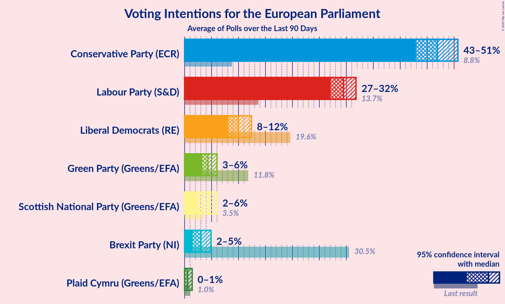
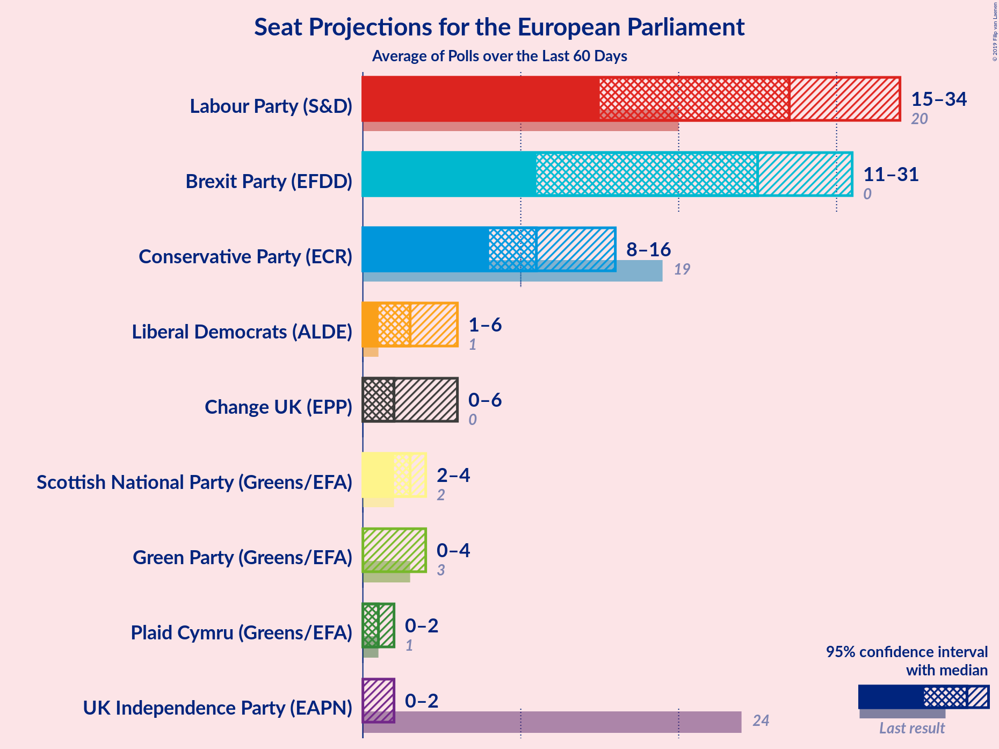
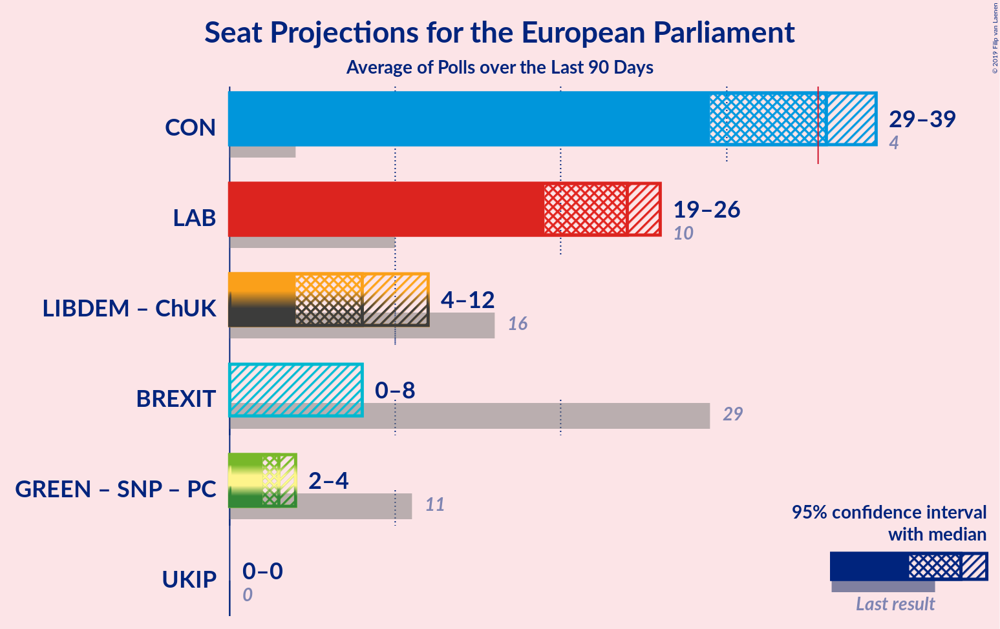

# Overview

The table below lists the most recent polls (less than 90 days old) registered and analyzed so far.

| Period     | Polling firm/Commissioner(s) | BREXIT | LIBDEM | LAB | GREEN | CON | SNP | PC | ChUK | UKIP |
|:----------:|:----------------------------:|:--:|:--:|:--:|:--:|:--:|:--:|:--:|:--:|:--:|
| 23 May 2019 | General Election | 30.5%   29 | 19.6%   16 | 13.7%   10 | 11.8%   7 | 8.8%   4 | 3.5%   3 | 1.0%   1 | 3.3%   0 | 3.2%   0 |
| N/A | [Poll Average](average.html) | 11–24%   7–19 | 14–24%   8–19 | 17–28%   12–22 | 4–10%   0–5 | 21–28%   15–24 | 2–6%   2–4 | 1–2%   0–2 | 0–2%   0 | 0–2%   0 |
| [3–5 July 2019](2019-07-05-Opinium.html) | Opinium   The Observer | 20–24%   17–19 | 13–16%   8–11 | 23–27%   16–21 | 7–9%   1–4 | 21–25%   15–21 | 4–6%   3–4 | 1–2%   1 | 1–2%   0 | 1–2%   0 |
| [2–3 July 2019](2019-07-03-YouGov.html) | YouGov   The Times | 21–25%   16–18 | 18–22%   11–16 | 16–20%   10–16 | 8–10%   1–6 | 22–26%   14–21 | 3–5%   2–3 | 1–2%   0–1 | 0–1%   0 | 0–1%   0 |
| [21–25 June 2019](2019-06-25-IpsosMORI.html) | Ipsos MORI | 10–14%   6–9 | 20–25%   12–21 | 22–27%   15–22 | 7–10%   1–5 | 24–29%   18–24 | 3–5%   2–3 | 1–2%   0–2 | 0–1%   0 | 1–2%   0 |
| [19–20 June 2019](2019-06-20-Survation.html) | Survation   Daily Mail on Sunday | 18–22%   14–17 | 16–20%   11–14 | 24–28%   17–21 | 5–7%   0–1 | 22–26%   15–22 | 2–4%   2–3 | 1–2%   1 | 1–2%   0 | 1–2%   0 |
| [7–9 June 2019](2019-06-09-ComRes.html) | ComRes   Daily Telegraph | 20–24%   17–19 | 15–19%   9–14 | 25–29%   18–22 | 4–6%   0 | 21–25%   15–19 | 2–4%   2–3 | 1–2%   1 | 1–2%   0 | 1–2%   0 |
| [4–7 June 2019](2019-06-07-BMGResearch.html) | BMG Research   The Independent | 16–20%   10–14 | 15–19%   8–13 | 25–29%   17–23 | N/A   N/A | 24–28%   16–22 | N/A   N/A | N/A   N/A | N/A   N/A | 1–2%   0 |
| 23 May 2019 | General Election | 30.5%   29 | 19.6%   16 | 13.7%   10 | 11.8%   7 | 8.8%   4 | 3.5%   3 | 1.0%   1 | 3.3%   0 | 3.2%   0 |

Only polls for which at least the sample size has been published are included in the table above.

**Legend:**
+ **Top half of each row:** Voting intentions (95% confidence interval)
+ **Bottom half of each row:** Seat projections for the European Parliament (95% confidence interval)
+ **BREXIT:** Brexit Party (NI)
+ **LIBDEM:** Liberal Democrats (RE)
+ **LAB:** Labour Party (S&D)
+ **GREEN:** Green Party (Greens/EFA)
+ **CON:** Conservative Party (ECR)
+ **SNP:** Scottish National Party (Greens/EFA)
+ **PC:** Plaid Cymru (Greens/EFA)
+ **ChUK:** Change UK (RE)
+ **UKIP:** UK Independence Party (ID)
+ **N/A (single party):** Party not included the published results
+ **N/A (entire row):** Calculation for this opinion poll not started yet

