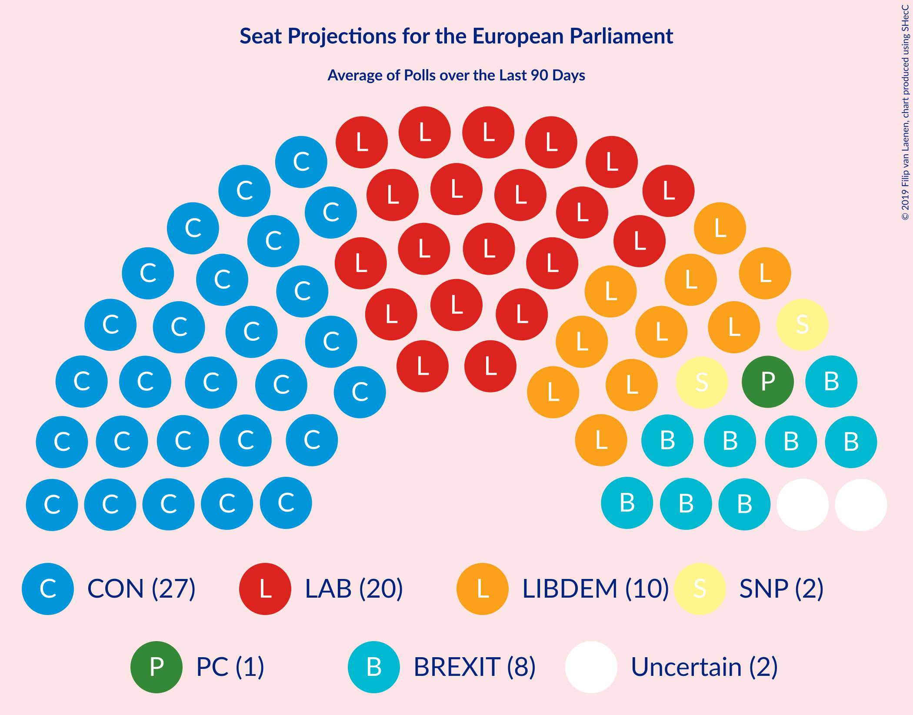

# Overview

The table below lists the most recent polls (less than 90 days old) registered and analyzed so far.

| Period     | Polling firm/Commissioner(s) | BREXIT | LIBDEM | LAB | GREEN | CON | SNP | PC | ChUK | UKIP |
|:----------:|:----------------------------:|:--:|:--:|:--:|:--:|:--:|:--:|:--:|:--:|:--:|
| 23 May 2019 | General Election | 30.5%   29 | 19.6%   16 | 13.7%   10 | 11.8%   7 | 8.8%   4 | 3.5%   3 | 1.0%   1 | 3.3%   0 | 3.2%   0 |
| N/A | [Poll Average](average.html) | 4–12%   0–8 | 10–21%   4–14 | 23–33%   16–27 | 2–5%   0 | 35–46%   28–39 | 2–5%   1–3 | 0–2%   0–2 | 0–2%   0 | 0–2%   0 |
| [18–19 November 2019](2019-11-19-YouGov.html) | YouGov   The Times | 3–5%   0 | 13–17%   6–9 | 28–32%   23–26 | 3–5%   0 | 40–44%   33–37 | 3–5%   2–3 | 0–1%   0 | N/A   N/A | N/A   N/A |
| [15–18 November 2019](2019-11-18-ICMResearch.html) | ICM Research | 4–6%   0 | 12–15%   5–8 | 30–34%   25–27 | 2–4%   0 | 40–44%   34–38 | 2–4%   1–2 | 0–1%   0 | N/A   N/A | N/A   N/A |
| [14–16 November 2019](2019-11-16-Survation.html) | Survation | 4–7%   0–1 | 11–15%   6–8 | 26–31%   20–26 | 2–4%   0 | 39–45%   33–39 | 2–4%   1–2 | 1–2%   0–2 | N/A   N/A | N/A   N/A |
| [10–16 November 2019](2019-11-16-Deltapoll.html) | Deltapoll   The Mail on Sunday | 5–7%   0–1 | 10–13%   4–6 | 28–32%   23–27 | 2–4%   0 | 43–48%   35–40 | 2–4%   1–2 | N/A   N/A | N/A   N/A | N/A   N/A |
| [13–15 November 2019](2019-11-15-Opinium.html) | Opinium   The Observer | 5–7%   N/A | 12–16%   N/A | 26–30%   N/A | 2–4%   N/A | 42–46%   N/A | 3–5%   N/A | 0–2%   N/A | 0–1%   N/A | 0–1%   N/A |
| [9–15 November 2019](2019-11-15-BMGResearch.html) | BMG Research | N/A   N/A | N/A   N/A | N/A   N/A | N/A   N/A | N/A   N/A | N/A   N/A | N/A   N/A | N/A   N/A | N/A   N/A |
| [13–14 November 2019](2019-11-14-Panelbase.html) | Panelbase | 4–7%   0 | 13–17%   6–10 | 27–33%   21–26 | 1–3%   0 | 40–46%   32–38 | 3–5%   2–3 | N/A   N/A | N/A   N/A | 0–1%   0 |
| [13–14 November 2019](2019-11-14-ComRes.html) | ComRes   The Sunday Telegraph | N/A   N/A | N/A   N/A | N/A   N/A | N/A   N/A | N/A   N/A | N/A   N/A | N/A   N/A | N/A   N/A | N/A   N/A |
| [7–11 November 2019](2019-11-11-KantarPublic.html) | Kantar Public | 7–11%   1–6 | 15–19%   8–13 | 25–30%   19–25 | 2–4%   0 | 34–40%   28–34 | 2–4%   1–2 | 1–2%   1–2 | 1–2%   0 | 1–2%   0 |
| [30–31 October 2019](2019-10-31-ORB.html) | ORB   The Telegraph | 11–13%   6–9 | 13–16%   6–9 | 26–30%   20–26 | 3–5%   0 | 34–38%   27–32 | 4–6%   2–3 | 0–1%   0 | N/A   N/A | N/A   N/A |
| [25–28 October 2019](2019-10-28-IpsosMORI.html) | Ipsos MORI | 6–9%   0–2 | 18–22%   11–17 | 21–27%   15–20 | 2–4%   0 | 38–44%   32–38 | 2–4%   1–2 | 1–2%   0–2 | 0–1%   0 | 0–1%   0 |
| 23 May 2019 | General Election | 30.5%   29 | 19.6%   16 | 13.7%   10 | 11.8%   7 | 8.8%   4 | 3.5%   3 | 1.0%   1 | 3.3%   0 | 3.2%   0 |

Only polls for which at least the sample size has been published are included in the table above.

**Legend:**
+ **Top half of each row:** Voting intentions (95% confidence interval)
+ **Bottom half of each row:** Seat projections for the European Parliament (95% confidence interval)
+ **BREXIT:** Brexit Party (NI)
+ **LIBDEM:** Liberal Democrats (RE)
+ **LAB:** Labour Party (S&D)
+ **GREEN:** Green Party (Greens/EFA)
+ **CON:** Conservative Party (ECR)
+ **SNP:** Scottish National Party (Greens/EFA)
+ **PC:** Plaid Cymru (Greens/EFA)
+ **ChUK:** Change UK (RE)
+ **UKIP:** UK Independence Party (ID)
+ **N/A (single party):** Party not included the published results
+ **N/A (entire row):** Calculation for this opinion poll not started yet

