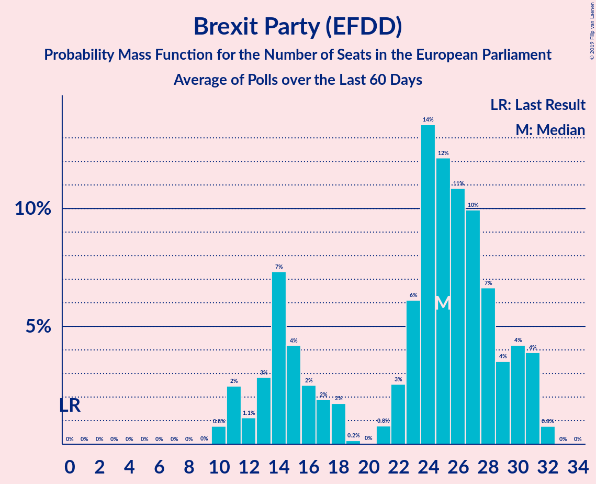

# Brexit Party (EFDD)

<a href="#voting-intentions">Voting Intentions</a> | <a href="#seats">Seats</a>

## Voting Intentions

Last result: **0.0%** (General Election of 22 May 2014)

### Confidence Intervals

| Period     | Polling firm/Commissioner(s) | Median | 80% Confidence Interval | 90% Confidence Interval | 95% Confidence Interval | 99% Confidence Interval |
|:----------:|:----------------:|:-----------:|:-----------------------:|:-----------------------:|:-----------------------:|:-----------------------:|
| N/A | [Poll Average](average.html) | 26.4% | 10.1–30.0% | 9.7–30.6% | 9.4–31.1% | 8.9–32.0% |
| [12–16 May 2019](2019-05-16-YouGov.html) | YouGov | 35.0% | 34.3–35.7% | 34.1–35.9% | 33.9–36.1% | 33.5–36.5% |
| [10–12 May 2019](2019-05-12-ComRes.html) | ComRes | 26.9% | 25.7–28.2% | 25.3–28.6% | 25.0–28.9% | 24.4–29.5% |
| [8–10 May 2019](2019-05-10-Opinium.html) | Opinium   The Observer | 34.0% | 32.6–35.4% | 32.3–35.8% | 31.9–36.1% | 31.3–36.8% |
| [7–10 May 2019](2019-05-10-BMGResearch.html) | BMG Research | 26.0% | 24.6–27.5% | 24.2–27.9% | 23.9–28.3% | 23.2–29.0% |
| [8–9 May 2019](2019-05-09-YouGov.html) | YouGov   The Times | 33.7% | 32.4–35.0% | 32.0–35.4% | 31.7–35.7% | 31.1–36.3% |
| [8–9 May 2019](2019-05-09-Survation.html) | Survation   Good Morning Britain | 30.0% | N/A | N/A | N/A | N/A |
| [9 May 2019](2019-05-09-ComRes.html) | ComRes   Brexit Express | 26.9% | 25.7–28.2% | 25.3–28.6% | 25.1–28.9% | 24.5–29.6% |
| [3–7 May 2019](2019-05-07-Opinium.html) | Opinium | 28.7% | 27.4–30.0% | 27.1–30.4% | 26.7–30.7% | 26.2–31.4% |
| [1–7 May 2019](2019-05-07-ComRes.html) | ComRes   Remain United | 28.0% | N/A | N/A | N/A | N/A |
| [29–30 April 2019](2019-04-30-YouGov.html) | YouGov   The Times | 29.7% | 28.3–31.2% | 27.9–31.6% | 27.5–32.0% | 26.8–32.7% |
| [23–26 April 2019](2019-04-26-YouGov.html) | YouGov   Hope Not Hate | 27.7% | 26.9–28.5% | 26.7–28.7% | 26.5–28.9% | 26.2–29.3% |
| [17–25 April 2019](2019-04-25-Survation.html) | Survation | 26.7% | 25.5–28.0% | 25.1–28.4% | 24.8–28.7% | 24.2–29.3% |
| [23–25 April 2019](2019-04-25-Opinium.html) | Opinium   The Observer | 28.0% | 26.3–29.9% | 25.8–30.4% | 25.4–30.9% | 24.5–31.8% |
| [23–24 April 2019](2019-04-24-YouGov.html) | YouGov | 28.0% | 27.2–28.8% | 27.0–29.0% | 26.8–29.2% | 26.4–29.6% |
| [16–17 April 2019](2019-04-17-YouGov.html) | YouGov   The Times | 23.0% | 21.7–24.3% | 21.4–24.7% | 21.0–25.0% | 20.5–25.6% |
| [15–16 April 2019](2019-04-16-YouGov.html) | YouGov   People’s Vote | 26.7% | 25.4–28.1% | 25.1–28.5% | 24.8–28.8% | 24.2–29.5% |
| [16 April 2019](2019-04-16-ComRes.html) | ComRes   Brexit Express | 16.9% | 15.5–18.4% | 15.1–18.9% | 14.7–19.3% | 14.1–20.0% |
| [9–12 April 2019](2019-04-12-Opinium.html) | Opinium   The Observer | 12.0% | 11.1–13.0% | 10.9–13.3% | 10.7–13.5% | 10.2–14.0% |
| [10–11 April 2019](2019-04-11-YouGov.html) | YouGov   The Times | 15.1% | 14.1–16.3% | 13.8–16.6% | 13.6–16.9% | 13.1–17.4% |
| [5–8 April 2019](2019-04-08-HanburyStrategy.html) | Hanbury Strategy   Open Europe | 10.1% | 9.3–11.0% | 9.1–11.3% | 8.9–11.5% | 8.5–12.0% |
| [28–30 March 2019](2019-03-30-Opinium.html) | Opinium   The Observer | 0.0% | N/A | N/A | N/A | N/A |
| [12–15 March 2019](2019-03-15-Opinium.html) | Opinium   The Observer | 0.0% | N/A | N/A | N/A | N/A |
| [10–17 January 2019](2019-01-17-NumberCruncherPolitics.html) | Number Cruncher Politics   Politico | 0.0% | N/A | N/A | N/A | N/A |

### Probability Mass Function

The following table shows the probability mass function per percentage block of voting intentions for the [poll average](average.html) for Brexit Party (EFDD).

| Voting Intentions | Probability | Accumulated | Special Marks |
|:-----------------:|:-----------:|:-----------:|:-------------:|
| 0.0–0.5% | 0% | 100% | Last Result |
| 0.5–1.5% | 0% | 100% |  |
| 1.5–2.5% | 0% | 100% |  |
| 2.5–3.5% | 0% | 100% |  |
| 3.5–4.5% | 0% | 100% |  |
| 4.5–5.5% | 0% | 100% |  |
| 5.5–6.5% | 0% | 100% |  |
| 6.5–7.5% | 0% | 100% |  |
| 7.5–8.5% | 0.1% | 100% |  |
| 8.5–9.5% | 4% | 99.9% |  |
| 9.5–10.5% | 11% | 96% |  |
| 10.5–11.5% | 5% | 85% |  |
| 11.5–12.5% | 0.4% | 80% |  |
| 12.5–13.5% | 0% | 80% |  |
| 13.5–14.5% | 0.3% | 80% |  |
| 14.5–15.5% | 2% | 80% |  |
| 15.5–16.5% | 5% | 78% |  |
| 16.5–17.5% | 7% | 72% |  |
| 17.5–18.5% | 4% | 66% |  |
| 18.5–19.5% | 1.4% | 62% |  |
| 19.5–20.5% | 0.2% | 60% |  |
| 20.5–21.5% | 0% | 60% |  |
| 21.5–22.5% | 0% | 60% |  |
| 22.5–23.5% | 0% | 60% |  |
| 23.5–24.5% | 0.3% | 60% |  |
| 24.5–25.5% | 3% | 60% |  |
| 25.5–26.5% | 8% | 57% | Median |
| 26.5–27.5% | 12% | 49% |  |
| 27.5–28.5% | 11% | 36% |  |
| 28.5–29.5% | 11% | 25% |  |
| 29.5–30.5% | 9% | 14% |  |
| 30.5–31.5% | 4% | 5% |  |
| 31.5–32.5% | 1.1% | 1.2% |  |
| 32.5–33.5% | 0.1% | 0.2% |  |
| 33.5–34.5% | 0% | 0% |  |

## Seats

Last result: **0** seats (General Election of 22 May 2014)

### Confidence Intervals

| Period     | Polling firm/Commissioner(s) | Median | 80% Confidence Interval | 90% Confidence Interval | 95% Confidence Interval | 99% Confidence Interval |
|:----------:|:----------------:|:------:|:-----------------------:|:-----------------------:|:-----------------------:|:-----------------------:|
| N/A | [Poll Average](average.html) | 24 | 6–28 | 6–30 | 6–31 | 6–32 |
| [12–16 May 2019](2019-05-16-YouGov.html) | YouGov | 33 | 33–35 | 33–35 | 33–35 | 32–35 |
| [10–12 May 2019](2019-05-12-ComRes.html) | ComRes | 25 | 22–26 | 22–26 | 21–27 | 21–28 |
| [8–10 May 2019](2019-05-10-Opinium.html) | Opinium   The Observer | 32 | 31–33 | 30–34 | 30–34 | 29–35 |
| [7–10 May 2019](2019-05-10-BMGResearch.html) | BMG Research | 22 | 20–24 | 20–24 | 20–24 | 19–27 |
| [8–9 May 2019](2019-05-09-YouGov.html) | YouGov   The Times | 32 | 31–33 | 30–33 | 30–34 | 30–34 |
| [8–9 May 2019](2019-05-09-Survation.html) | Survation   Good Morning Britain |  |  |  |  |  |
| [9 May 2019](2019-05-09-ComRes.html) | ComRes   Brexit Express | 23 | 22–26 | 21–27 | 21–27 | 20–28 |
| [3–7 May 2019](2019-05-07-Opinium.html) | Opinium | 25 | 24–27 | 24–27 | 23–28 | 22–29 |
| [1–7 May 2019](2019-05-07-ComRes.html) | ComRes   Remain United |  |  |  |  |  |
| [29–30 April 2019](2019-04-30-YouGov.html) | YouGov   The Times | 28 | 26–31 | 25–31 | 24–32 | 23–32 |
| [23–26 April 2019](2019-04-26-YouGov.html) | YouGov   Hope Not Hate | 26 | 24–28 | 24–29 | 23–30 | 22–30 |
| [17–25 April 2019](2019-04-25-Survation.html) | Survation | 24 | 23–26 | 22–27 | 22–27 | 21–28 |
| [23–25 April 2019](2019-04-25-Opinium.html) | Opinium   The Observer | 26 | 23–27 | 22–28 | 22–28 | 21–29 |
| [23–24 April 2019](2019-04-24-YouGov.html) | YouGov | 26 | 24–28 | 23–29 | 23–29 | 23–30 |
| [16–17 April 2019](2019-04-17-YouGov.html) | YouGov   The Times | 20 | 18–21 | 18–22 | 18–22 | 18–23 |
| [15–16 April 2019](2019-04-16-YouGov.html) | YouGov   People’s Vote | 24 | 22–27 | 22–28 | 21–29 | 21–31 |
| [16 April 2019](2019-04-16-ComRes.html) | ComRes   Brexit Express | 14 | 11–17 | 11–18 | 10–18 | 10–19 |
| [9–12 April 2019](2019-04-12-Opinium.html) | Opinium   The Observer | 8 | 7–9 | 7–10 | 7–11 | 7–11 |
| [10–11 April 2019](2019-04-11-YouGov.html) | YouGov   The Times | 13 | 9–15 | 9–15 | 8–15 | 8–16 |
| [5–8 April 2019](2019-04-08-HanburyStrategy.html) | Hanbury Strategy   Open Europe | 6 | 6–7 | 6–7 | 6–7 | 5–7 |
| [28–30 March 2019](2019-03-30-Opinium.html) | Opinium   The Observer |  |  |  |  |  |
| [12–15 March 2019](2019-03-15-Opinium.html) | Opinium   The Observer |  |  |  |  |  |
| [10–17 January 2019](2019-01-17-NumberCruncherPolitics.html) | Number Cruncher Politics   Politico |  |  |  |  |  |

### Probability Mass Function

The following table shows the probability mass function per seat for the [poll average](average.html) for Brexit Party (EFDD).

| Number of Seats | Probability | Accumulated | Special Marks |
|:---------------:|:-----------:|:-----------:|:-------------:|
| 0 | 0% | 100% | Last Result |
| 1 | 0% | 100% |  |
| 2 | 0% | 100% |  |
| 3 | 0% | 100% |  |
| 4 | 0% | 100% |  |
| 5 | 0.2% | 99.9% |  |
| 6 | 13% | 99.7% |  |
| 7 | 7% | 87% |  |
| 8 | 0.1% | 80% |  |
| 9 | 0% | 80% |  |
| 10 | 0.6% | 80% |  |
| 11 | 2% | 79% |  |
| 12 | 0.9% | 77% |  |
| 13 | 2% | 76% |  |
| 14 | 6% | 74% |  |
| 15 | 3% | 68% |  |
| 16 | 2% | 65% |  |
| 17 | 2% | 63% |  |
| 18 | 1.4% | 62% |  |
| 19 | 0.1% | 60% |  |
| 20 | 0% | 60% |  |
| 21 | 0.6% | 60% |  |
| 22 | 2% | 59% |  |
| 23 | 5% | 57% |  |
| 24 | 11% | 52% | Median |
| 25 | 10% | 42% |  |
| 26 | 9% | 32% |  |
| 27 | 8% | 23% |  |
| 28 | 5% | 15% |  |
| 29 | 3% | 10% |  |
| 30 | 3% | 7% |  |
| 31 | 3% | 4% |  |
| 32 | 0.6% | 0.6% |  |
| 33 | 0% | 0% |  |

