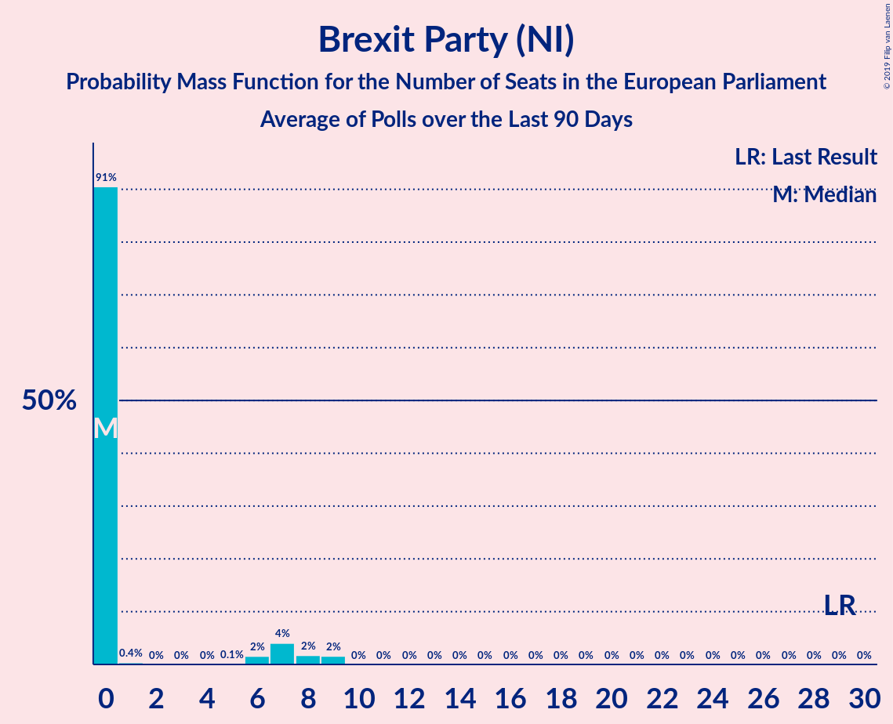

# Brexit Party (NI)

<a href="#voting-intentions">Voting Intentions</a> | <a href="#seats">Seats</a>

## Voting Intentions

Last result: **0.0%** (General Election of 23 May 2019)

### Confidence Intervals

| Period     | Polling firm/Commissioner(s) | Median | 80% Confidence Interval | 90% Confidence Interval | 95% Confidence Interval | 99% Confidence Interval |
|:----------:|:----------------:|:-----------:|:-----------------------:|:-----------------------:|:-----------------------:|:-----------------------:|
| N/A | [Poll Average](average.html) | 20.8% | 12.5–23.5% | 11.7–24.0% | 11.2–24.4% | 10.4–25.2% |
| [2–3 July 2019](2019-07-03-YouGov.html) | YouGov   The Times | 22.9% | 21.6–24.3% | 21.2–24.6% | 20.9–25.0% | 20.3–25.7% |
| [24–25 June 2019](2019-06-25-YouGov.html) | YouGov   The Times | 22.0% | N/A | N/A | N/A | N/A |
| [21–25 June 2019](2019-06-25-IpsosMORI.html) | Ipsos MORI | 12.2% | 11.0–13.6% | 10.6–14.0% | 10.3–14.3% | 9.8–15.0% |
| [19–20 June 2019](2019-06-20-Survation.html) | Survation   Daily Mail on Sunday | 19.8% | 18.7–21.0% | 18.4–21.3% | 18.1–21.6% | 17.6–22.2% |
| [19–20 June 2019](2019-06-20-Opinium.html) | Opinium   The Observer | 23.0% | 21.8–24.2% | 21.5–24.6% | 21.2–24.9% | 20.7–25.5% |
| [13–14 June 2019](2019-06-14-YouGov.html) | YouGov   The Sunday Times | 24.1% | N/A | N/A | N/A | N/A |
| [9–10 June 2019](2019-06-10-YouGov.html) | YouGov   The Times | 26.2% | N/A | N/A | N/A | N/A |
| [7–9 June 2019](2019-06-09-ComRes.html) | ComRes   Daily Telegraph | 21.8% | 20.6–23.0% | 20.3–23.3% | 20.0–23.6% | 19.5–24.2% |
| [4–7 June 2019](2019-06-07-BMGResearch.html) | BMG Research   The Independent | 18.0% | 16.8–19.3% | 16.5–19.7% | 16.2–20.0% | 15.6–20.7% |
| [4–6 June 2019](2019-06-06-YouGov.html) | YouGov   The Times | 25.9% | N/A | N/A | N/A | N/A |
| [28–30 May 2019](2019-05-30-Opinium.html) | Opinium   The Observer | 26.0% | N/A | N/A | N/A | N/A |
| [29–30 May 2019](2019-05-30-Deltapoll.html) | Deltapoll   The Mail on Sunday | 23.5% | N/A | N/A | N/A | N/A |
| [28–29 May 2019](2019-05-29-YouGov.html) | YouGov   The Times | 22.0% | N/A | N/A | N/A | N/A |

### Probability Mass Function

The following table shows the probability mass function per percentage block of voting intentions for the [poll average](average.html) for Brexit Party (NI).

| Voting Intentions | Probability | Accumulated | Special Marks |
|:-----------------:|:-----------:|:-----------:|:-------------:|
| 0.0–0.5% | 0% | 100% | Last Result |
| 0.5–1.5% | 0% | 100% |  |
| 1.5–2.5% | 0% | 100% |  |
| 2.5–3.5% | 0% | 100% |  |
| 3.5–4.5% | 0% | 100% |  |
| 4.5–5.5% | 0% | 100% |  |
| 5.5–6.5% | 0% | 100% |  |
| 6.5–7.5% | 0% | 100% |  |
| 7.5–8.5% | 0% | 100% |  |
| 8.5–9.5% | 0% | 100% |  |
| 9.5–10.5% | 0.7% | 100% |  |
| 10.5–11.5% | 3% | 99.3% |  |
| 11.5–12.5% | 6% | 96% |  |
| 12.5–13.5% | 5% | 90% |  |
| 13.5–14.5% | 1.5% | 85% |  |
| 14.5–15.5% | 0.3% | 84% |  |
| 15.5–16.5% | 0.9% | 83% |  |
| 16.5–17.5% | 4% | 82% |  |
| 17.5–18.5% | 8% | 78% |  |
| 18.5–19.5% | 9% | 71% |  |
| 19.5–20.5% | 9% | 61% |  |
| 20.5–21.5% | 11% | 52% | Median |
| 21.5–22.5% | 16% | 41% |  |
| 22.5–23.5% | 16% | 25% |  |
| 23.5–24.5% | 8% | 10% |  |
| 24.5–25.5% | 2% | 2% |  |
| 25.5–26.5% | 0.2% | 0.2% |  |
| 26.5–27.5% | 0% | 0% |  |

## Seats

Last result: **0** seats (General Election of 23 May 2019)

### Confidence Intervals

| Period     | Polling firm/Commissioner(s) | Median | 80% Confidence Interval | 90% Confidence Interval | 95% Confidence Interval | 99% Confidence Interval |
|:----------:|:----------------:|:------:|:-----------------------:|:-----------------------:|:-----------------------:|:-----------------------:|
| N/A | [Poll Average](average.html) | 17 | 8–18 | 7–19 | 7–19 | 6–21 |
| [2–3 July 2019](2019-07-03-YouGov.html) | YouGov   The Times | 17 | 16–18 | 16–18 | 16–18 | 16–20 |
| [24–25 June 2019](2019-06-25-YouGov.html) | YouGov   The Times |  |  |  |  |  |
| [21–25 June 2019](2019-06-25-IpsosMORI.html) | Ipsos MORI | 7 | 7–8 | 6–9 | 6–10 | 4–11 |
| [19–20 June 2019](2019-06-20-Survation.html) | Survation   Daily Mail on Sunday | 17 | 15–17 | 14–17 | 14–18 | 11–18 |
| [19–20 June 2019](2019-06-20-Opinium.html) | Opinium   The Observer | 18 | 18–19 | 18–20 | 18–21 | 17–21 |
| [13–14 June 2019](2019-06-14-YouGov.html) | YouGov   The Sunday Times |  |  |  |  |  |
| [9–10 June 2019](2019-06-10-YouGov.html) | YouGov   The Times |  |  |  |  |  |
| [7–9 June 2019](2019-06-09-ComRes.html) | ComRes   Daily Telegraph | 18 | 17–19 | 17–19 | 17–19 | 16–20 |
| [4–7 June 2019](2019-06-07-BMGResearch.html) | BMG Research   The Independent | 11 | 10–13 | 10–13 | 10–14 | 9–15 |
| [4–6 June 2019](2019-06-06-YouGov.html) | YouGov   The Times |  |  |  |  |  |
| [28–30 May 2019](2019-05-30-Opinium.html) | Opinium   The Observer |  |  |  |  |  |
| [29–30 May 2019](2019-05-30-Deltapoll.html) | Deltapoll   The Mail on Sunday |  |  |  |  |  |
| [28–29 May 2019](2019-05-29-YouGov.html) | YouGov   The Times |  |  |  |  |  |

### Probability Mass Function

The following table shows the probability mass function per seat for the [poll average](average.html) for Brexit Party (NI).

| Number of Seats | Probability | Accumulated | Special Marks |
|:---------------:|:-----------:|:-----------:|:-------------:|
| 0 | 0% | 100% | Last Result |
| 1 | 0% | 100% |  |
| 2 | 0% | 100% |  |
| 3 | 0% | 100% |  |
| 4 | 0.1% | 100% |  |
| 5 | 0.3% | 99.9% |  |
| 6 | 0.6% | 99.6% |  |
| 7 | 8% | 99.0% |  |
| 8 | 6% | 91% |  |
| 9 | 0.7% | 85% |  |
| 10 | 3% | 84% |  |
| 11 | 8% | 81% |  |
| 12 | 5% | 74% |  |
| 13 | 1.4% | 69% |  |
| 14 | 2% | 67% |  |
| 15 | 1.3% | 65% |  |
| 16 | 5% | 64% |  |
| 17 | 32% | 59% | Median |
| 18 | 18% | 28% |  |
| 19 | 8% | 9% |  |
| 20 | 0.8% | 2% |  |
| 21 | 0.7% | 0.8% |  |
| 22 | 0% | 0% |  |

