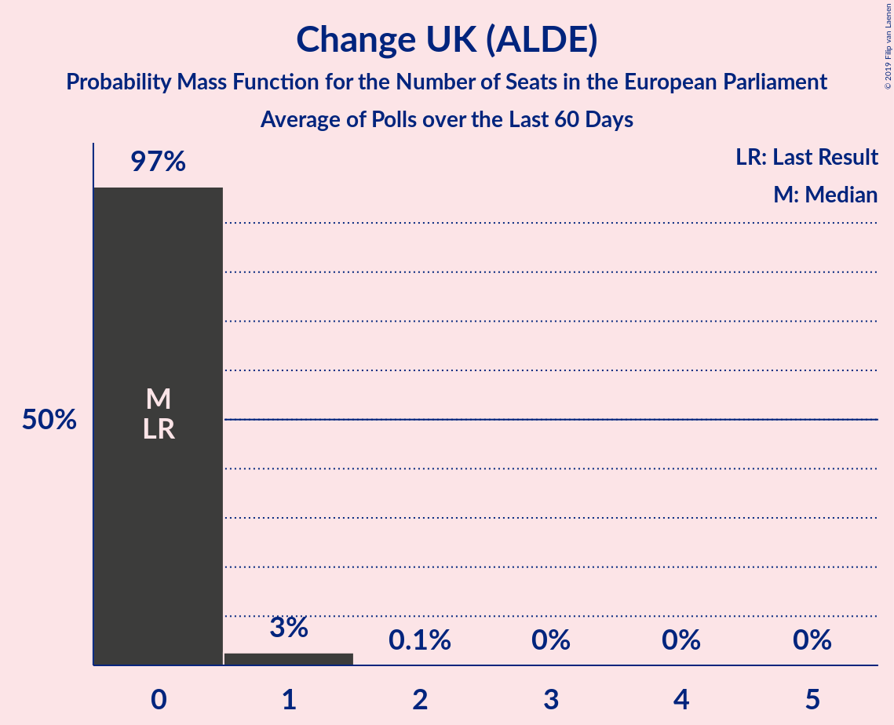

# Change UK (ALDE)

<a href="#voting-intentions">Voting Intentions</a> | <a href="#seats">Seats</a>

## Voting Intentions

Last result: **0.0%** (General Election of 22 May 2014)

### Confidence Intervals

| Period     | Polling firm/Commissioner(s) | Median | 80% Confidence Interval | 90% Confidence Interval | 95% Confidence Interval | 99% Confidence Interval |
|:----------:|:----------------:|:-----------:|:-----------------------:|:-----------------------:|:-----------------------:|:-----------------------:|
| N/A | [Poll Average](average.html) | 4.0% | 3.0–6.1% | 2.7–6.4% | 2.5–6.6% | 2.2–7.1% |
| [20–22 May 2019](2019-05-22-BMGResearch.html) | BMG Research   The Independent | 3.9% | 3.4–4.6% | 3.2–4.8% | 3.1–5.0% | 2.8–5.4% |
| [19–21 May 2019](2019-05-21-YouGov.html) | YouGov   The Times | 4.0% | 3.6–4.4% | 3.5–4.5% | 3.4–4.6% | 3.2–4.8% |
| [14–21 May 2019](2019-05-21-Panelbase.html) | Panelbase   The Sunday Times | 3.0% | N/A | N/A | N/A | N/A |
| [18–21 May 2019](2019-05-21-NumberCruncherPolitics.html) | Number Cruncher Politics | 3.9% | N/A | N/A | N/A | N/A |
| [14–21 May 2019](2019-05-21-Kantar.html) | Kantar | 5.0% | N/A | N/A | N/A | N/A |
| [17–20 May 2019](2019-05-20-Opinium.html) | Opinium   The Times | 3.0% | N/A | N/A | N/A | N/A |
| [8–17 May 2019](2019-05-17-YouGov.html) | YouGov   Best For Britain | 4.0% | 3.7–4.3% | 3.7–4.4% | 3.6–4.4% | 3.5–4.6% |
| [17 May 2019](2019-05-17-Survation.html) | Survation   Daily Mail | 3.1% | 2.5–3.9% | 2.3–4.2% | 2.2–4.4% | 1.9–4.8% |
| [13–17 May 2019](2019-05-17-ComRes.html) | ComRes   Electoral Calculus | 5.1% | N/A | N/A | N/A | N/A |
| [12–16 May 2019](2019-05-16-YouGov.html) | YouGov   The Times | 5.0% | 4.7–5.4% | 4.6–5.5% | 4.5–5.5% | 4.4–5.7% |
| [14–16 May 2019](2019-05-16-Opinium.html) | Opinium   The Observer | 3.0% | 2.5–3.5% | 2.4–3.7% | 2.3–3.8% | 2.1–4.1% |
| [15–16 May 2019](2019-05-16-ComRes.html) | ComRes   Sunday Express and Mirror | 4.0% | 3.5–4.6% | 3.4–4.8% | 3.2–5.0% | 3.0–5.3% |
| [9–13 May 2019](2019-05-13-HanburyStrategy.html) | Hanbury Strategy | 5.9% | 5.3–6.6% | 5.1–6.8% | 4.9–7.0% | 4.7–7.4% |
| [10–12 May 2019](2019-05-12-ComRes.html) | ComRes   Daily Telegraph | 6.0% | 5.3–6.7% | 5.2–6.9% | 5.0–7.1% | 4.7–7.5% |
| [8–10 May 2019](2019-05-10-Opinium.html) | Opinium   The Observer | 3.0% | 2.6–3.6% | 2.4–3.7% | 2.3–3.8% | 2.1–4.1% |
| [7–10 May 2019](2019-05-10-BMGResearch.html) | BMG Research | 3.0% | 2.5–3.6% | 2.4–3.8% | 2.2–4.0% | 2.0–4.3% |
| [8–9 May 2019](2019-05-09-YouGov.html) | YouGov   The Times | 5.0% | 4.4–5.6% | 4.3–5.8% | 4.1–6.0% | 3.9–6.3% |
| [8–9 May 2019](2019-05-09-Survation.html) | Survation   Good Morning Britain | 4.0% | 3.4–4.8% | 3.2–5.0% | 3.0–5.2% | 2.8–5.6% |
| [9 May 2019](2019-05-09-ComRes.html) | ComRes   Brexit Express | 6.0% | 5.4–6.7% | 5.2–6.9% | 5.0–7.1% | 4.8–7.5% |
| [3–7 May 2019](2019-05-07-Opinium.html) | Opinium | 2.0% | 1.6–2.5% | 1.6–2.6% | 1.5–2.7% | 1.3–3.0% |
| [1–7 May 2019](2019-05-07-ComRes.html) | ComRes   Remain United | 8.0% | 7.5–8.6% | 7.3–8.7% | 7.2–8.9% | 7.0–9.2% |
| [29–30 April 2019](2019-04-30-YouGov.html) | YouGov   The Times | 8.9% | 8.0–9.9% | 7.8–10.2% | 7.6–10.4% | 7.2–10.9% |
| [23–26 April 2019](2019-04-26-YouGov.html) | YouGov   Hope Not Hate | 9.9% | 9.4–10.5% | 9.3–10.6% | 9.1–10.7% | 8.9–11.0% |
| [17–25 April 2019](2019-04-25-Survation.html) | Survation | 4.0% | 3.4–4.6% | 3.3–4.8% | 3.2–4.9% | 3.0–5.2% |
| [23–25 April 2019](2019-04-25-Opinium.html) | Opinium   The Observer | 7.0% | 6.1–8.2% | 5.8–8.5% | 5.6–8.8% | 5.2–9.3% |
| [23–24 April 2019](2019-04-24-YouGov.html) | YouGov | 10.0% | 9.5–10.5% | 9.3–10.7% | 9.2–10.8% | 9.0–11.1% |
| [16–17 April 2019](2019-04-17-YouGov.html) | YouGov   The Times | 8.0% | 7.2–8.9% | 7.0–9.1% | 6.8–9.3% | 6.4–9.8% |
| [15–16 April 2019](2019-04-16-YouGov.html) | YouGov   People’s Vote | 5.9% | 5.3–6.7% | 5.1–6.9% | 4.9–7.1% | 4.6–7.5% |
| [16 April 2019](2019-04-16-ComRes.html) | ComRes   Brexit Express | 9.0% | 7.9–10.2% | 7.6–10.5% | 7.4–10.8% | 6.9–11.4% |
| [9–12 April 2019](2019-04-12-Opinium.html) | Opinium   The Observer | 4.0% | 3.5–4.6% | 3.3–4.8% | 3.2–4.9% | 3.0–5.3% |
| [10–11 April 2019](2019-04-11-YouGov.html) | YouGov   The Times | 7.1% | 6.3–7.9% | 6.1–8.1% | 6.0–8.3% | 5.6–8.7% |
| [5–8 April 2019](2019-04-08-HanburyStrategy.html) | Hanbury Strategy   Open Europe | 4.0% | 3.5–4.7% | 3.4–4.9% | 3.3–5.0% | 3.0–5.3% |
| [28–30 March 2019](2019-03-30-Opinium.html) | Opinium   The Observer | 0.0% | N/A | N/A | N/A | N/A |
| [12–15 March 2019](2019-03-15-Opinium.html) | Opinium   The Observer | 0.0% | N/A | N/A | N/A | N/A |
| [10–17 January 2019](2019-01-17-NumberCruncherPolitics.html) | Number Cruncher Politics   Politico | 0.0% | N/A | N/A | N/A | N/A |

### Probability Mass Function

The following table shows the probability mass function per percentage block of voting intentions for the [poll average](average.html) for Change UK (ALDE).

| Voting Intentions | Probability | Accumulated | Special Marks |
|:-----------------:|:-----------:|:-----------:|:-------------:|
| 0.0–0.5% | 0% | 100% | Last Result |
| 0.5–1.5% | 0% | 100% |  |
| 1.5–2.5% | 3% | 100% |  |
| 2.5–3.5% | 23% | 97% |  |
| 3.5–4.5% | 45% | 75% | Median |
| 4.5–5.5% | 10% | 29% |  |
| 5.5–6.5% | 16% | 19% |  |
| 6.5–7.5% | 3% | 3% |  |
| 7.5–8.5% | 0.1% | 0.1% |  |
| 8.5–9.5% | 0% | 0% |  |

## Seats

Last result: **0** seats (General Election of 22 May 2014)

### Confidence Intervals

| Period     | Polling firm/Commissioner(s) | Median | 80% Confidence Interval | 90% Confidence Interval | 95% Confidence Interval | 99% Confidence Interval |
|:----------:|:----------------:|:------:|:-----------------------:|:-----------------------:|:-----------------------:|:-----------------------:|
| N/A | [Poll Average](average.html) | 0 | 0 | 0–1 | 0–1 | 0–1 |
| [20–22 May 2019](2019-05-22-BMGResearch.html) | BMG Research   The Independent | 0 | 0 | 0 | 0 | 0 |
| [19–21 May 2019](2019-05-21-YouGov.html) | YouGov   The Times | 0 | 0 | 0 | 0 | 0 |
| [14–21 May 2019](2019-05-21-Panelbase.html) | Panelbase   The Sunday Times |  |  |  |  |  |
| [18–21 May 2019](2019-05-21-NumberCruncherPolitics.html) | Number Cruncher Politics |  |  |  |  |  |
| [14–21 May 2019](2019-05-21-Kantar.html) | Kantar |  |  |  |  |  |
| [17–20 May 2019](2019-05-20-Opinium.html) | Opinium   The Times |  |  |  |  |  |
| [8–17 May 2019](2019-05-17-YouGov.html) | YouGov   Best For Britain | 0 | 0 | 0 | 0 | 0 |
| [17 May 2019](2019-05-17-Survation.html) | Survation   Daily Mail | 0 | 0 | 0 | 0 | 0 |
| [13–17 May 2019](2019-05-17-ComRes.html) | ComRes   Electoral Calculus |  |  |  |  |  |
| [12–16 May 2019](2019-05-16-YouGov.html) | YouGov   The Times | 0 | 0 | 0 | 0–1 | 0–1 |
| [14–16 May 2019](2019-05-16-Opinium.html) | Opinium   The Observer | 0 | 0 | 0 | 0 | 0 |
| [15–16 May 2019](2019-05-16-ComRes.html) | ComRes   Sunday Express and Mirror | 0 | 0 | 0 | 0 | 0 |
| [9–13 May 2019](2019-05-13-HanburyStrategy.html) | Hanbury Strategy | 0 | 0–1 | 0–1 | 0–1 | 0–1 |
| [10–12 May 2019](2019-05-12-ComRes.html) | ComRes   Daily Telegraph | 0 | 0–1 | 0–2 | 0–2 | 0–2 |
| [8–10 May 2019](2019-05-10-Opinium.html) | Opinium   The Observer | 0 | 0 | 0 | 0 | 0 |
| [7–10 May 2019](2019-05-10-BMGResearch.html) | BMG Research | 0 | 0 | 0 | 0 | 0 |
| [8–9 May 2019](2019-05-09-YouGov.html) | YouGov   The Times | 0 | 0–1 | 0–1 | 0–1 | 0–1 |
| [8–9 May 2019](2019-05-09-Survation.html) | Survation   Good Morning Britain | 0 | 0 | 0 | 0 | 0 |
| [9 May 2019](2019-05-09-ComRes.html) | ComRes   Brexit Express | 0 | 0–1 | 0–2 | 0–2 | 0–2 |
| [3–7 May 2019](2019-05-07-Opinium.html) | Opinium | 0 | 0 | 0 | 0 | 0 |
| [1–7 May 2019](2019-05-07-ComRes.html) | ComRes   Remain United | 2 | 2–3 | 2–3 | 2–3 | 1–4 |
| [29–30 April 2019](2019-04-30-YouGov.html) | YouGov   The Times | 4 | 2–5 | 2–5 | 2–6 | 2–7 |
| [23–26 April 2019](2019-04-26-YouGov.html) | YouGov   Hope Not Hate | 5 | 5–7 | 4–7 | 4–8 | 4–8 |
| [17–25 April 2019](2019-04-25-Survation.html) | Survation | 0 | 0 | 0 | 0 | 0 |
| [23–25 April 2019](2019-04-25-Opinium.html) | Opinium   The Observer | 2 | 1–2 | 0–3 | 0–3 | 0–5 |
| [23–24 April 2019](2019-04-24-YouGov.html) | YouGov | 5 | 5–6 | 5–7 | 4–8 | 4–8 |
| [16–17 April 2019](2019-04-17-YouGov.html) | YouGov   The Times | 3 | 2–4 | 2–5 | 2–5 | 1–6 |
| [15–16 April 2019](2019-04-16-YouGov.html) | YouGov   People’s Vote | 1 | 0–1 | 0–2 | 0–2 | 0–3 |
| [16 April 2019](2019-04-16-ComRes.html) | ComRes   Brexit Express | 5 | 2–5 | 2–6 | 2–7 | 2–7 |
| [9–12 April 2019](2019-04-12-Opinium.html) | Opinium   The Observer | 0 | 0 | 0 | 0 | 0 |
| [10–11 April 2019](2019-04-11-YouGov.html) | YouGov   The Times | 2 | 1–3 | 0–4 | 0–4 | 0–4 |
| [5–8 April 2019](2019-04-08-HanburyStrategy.html) | Hanbury Strategy   Open Europe | 0 | 0 | 0 | 0 | 0 |
| [28–30 March 2019](2019-03-30-Opinium.html) | Opinium   The Observer |  |  |  |  |  |
| [12–15 March 2019](2019-03-15-Opinium.html) | Opinium   The Observer |  |  |  |  |  |
| [10–17 January 2019](2019-01-17-NumberCruncherPolitics.html) | Number Cruncher Politics   Politico |  |  |  |  |  |

### Probability Mass Function

The following table shows the probability mass function per seat for the [poll average](average.html) for Change UK (ALDE).

| Number of Seats | Probability | Accumulated | Special Marks |
|:---------------:|:-----------:|:-----------:|:-------------:|
| 0 | 95% | 100% | Last Result, Median |
| 1 | 5% | 5% |  |
| 2 | 0.1% | 0.1% |  |
| 3 | 0% | 0% |  |

