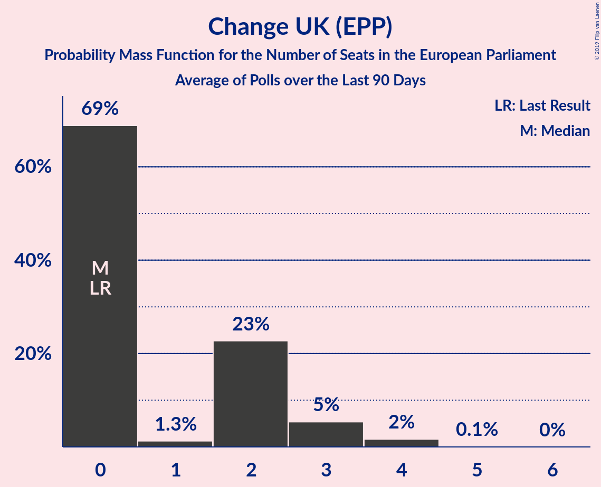

# Change UK (EPP)

<a href="#voting-intentions">Voting Intentions</a> | <a href="#seats">Seats</a>

## Voting Intentions

Last result: **0.0%** (General Election of 22 May 2014)

### Confidence Intervals

| Period     | Polling firm/Commissioner(s) | Median | 80% Confidence Interval | 90% Confidence Interval | 95% Confidence Interval | 99% Confidence Interval |
|:----------:|:----------------:|:-----------:|:-----------------------:|:-----------------------:|:-----------------------:|:-----------------------:|
| N/A | [Poll Average](average.html) | 4.4% | 3.6–7.4% | 3.5–7.7% | 3.3–8.0% | 3.1–8.5% |
| [9–12 April 2019](2019-04-12-Opinium.html) | Opinium | 4.0% | 3.5–4.6% | 3.3–4.8% | 3.2–4.9% | 3.0–5.3% |
| [10–11 April 2019](2019-04-11-YouGov.html) | YouGov | 7.1% | 6.3–7.9% | 6.1–8.1% | 6.0–8.3% | 5.6–8.7% |
| [5–8 April 2019](2019-04-08-HanburyStrategy.html) | Hanbury Strategy | 4.0% | 3.5–4.7% | 3.4–4.9% | 3.3–5.0% | 3.0–5.3% |
| [28–30 March 2019](2019-03-30-Opinium.html) | Opinium   The Observer | 0.0% | N/A | N/A | N/A | N/A |
| [12–15 March 2019](2019-03-15-Opinium.html) | Opinium   The Observer | 0.0% | N/A | N/A | N/A | N/A |
| [10–17 January 2019](2019-01-17-NumberCruncherPolitics.html) | Number Cruncher Politics   Politico | 0.0% | N/A | N/A | N/A | N/A |

### Probability Mass Function

The following table shows the probability mass function per percentage block of voting intentions for the [poll average](average.html) for Change UK (EPP).

| Voting Intentions | Probability | Accumulated | Special Marks |
|:-----------------:|:-----------:|:-----------:|:-------------:|
| 0.0–0.5% | 0% | 100% | Last Result |
| 0.5–1.5% | 0% | 100% |  |
| 1.5–2.5% | 0% | 100% |  |
| 2.5–3.5% | 8% | 100% |  |
| 3.5–4.5% | 50% | 92% | Median |
| 4.5–5.5% | 9% | 42% |  |
| 5.5–6.5% | 6% | 33% |  |
| 6.5–7.5% | 20% | 27% |  |
| 7.5–8.5% | 7% | 8% |  |
| 8.5–9.5% | 0.3% | 0.3% |  |
| 9.5–10.5% | 0% | 0% |  |

## Seats

Last result: **0** seats (General Election of 22 May 2014)

### Confidence Intervals

| Period     | Polling firm/Commissioner(s) | Median | 80% Confidence Interval | 90% Confidence Interval | 95% Confidence Interval | 99% Confidence Interval |
|:----------:|:----------------:|:------:|:-----------------------:|:-----------------------:|:-----------------------:|:-----------------------:|
| N/A | [Poll Average](average.html) | 0 | 0–2 | 0–3 | 0–3 | 0–4 |
| [9–12 April 2019](2019-04-12-Opinium.html) | Opinium | 0 | 0 | 0 | 0 | 0 |
| [10–11 April 2019](2019-04-11-YouGov.html) | YouGov | 2 | 1–3 | 0–4 | 0–4 | 0–4 |
| [5–8 April 2019](2019-04-08-HanburyStrategy.html) | Hanbury Strategy | 0 | 0 | 0 | 0 | 0 |
| [28–30 March 2019](2019-03-30-Opinium.html) | Opinium   The Observer |  |  |  |  |  |
| [12–15 March 2019](2019-03-15-Opinium.html) | Opinium   The Observer |  |  |  |  |  |
| [10–17 January 2019](2019-01-17-NumberCruncherPolitics.html) | Number Cruncher Politics   Politico |  |  |  |  |  |

### Probability Mass Function

The following table shows the probability mass function per seat for the [poll average](average.html) for Change UK (EPP).

| Number of Seats | Probability | Accumulated | Special Marks |
|:---------------:|:-----------:|:-----------:|:-------------:|
| 0 | 69% | 100% | Last Result, Median |
| 1 | 1.3% | 31% |  |
| 2 | 23% | 30% |  |
| 3 | 5% | 7% |  |
| 4 | 2% | 2% |  |
| 5 | 0.1% | 0.1% |  |
| 6 | 0% | 0% |  |

