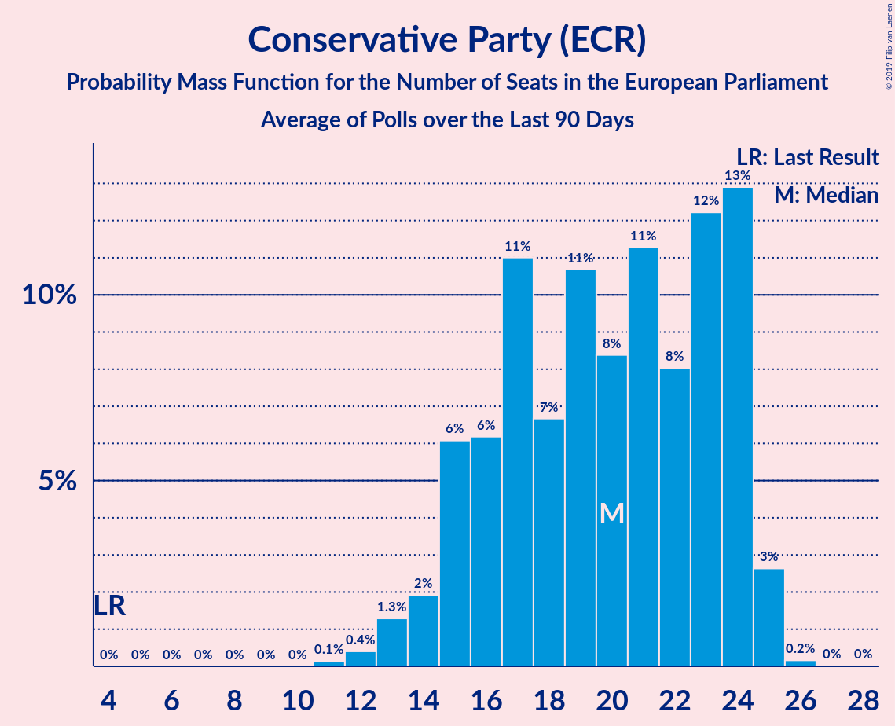

# Conservative Party (ECR)

<a href="#voting-intentions">Voting Intentions</a> | <a href="#seats">Seats</a>

## Voting Intentions

Last result: **8.8%** (General Election of 23 May 2019)

### Confidence Intervals

| Period     | Polling firm/Commissioner(s) | Median | 80% Confidence Interval | 90% Confidence Interval | 95% Confidence Interval | 99% Confidence Interval |
|:----------:|:----------------:|:-----------:|:-----------------------:|:-----------------------:|:-----------------------:|:-----------------------:|
| N/A | [Poll Average](average.html) | 43.4% | 40.9–45.4% | 40.3–46.0% | 39.8–46.4% | 38.8–47.1% |
| [10–11 December 2019](2019-12-11-Survation.html) | Survation | 45.0% | 43.7–46.3% | 43.3–46.7% | 43.0–47.0% | 42.4–47.6% |
| [10–11 December 2019](2019-12-11-Panelbase.html) | Panelbase | 43.0% | 41.9–44.1% | 41.6–44.5% | 41.3–44.7% | 40.8–45.3% |
| [10–11 December 2019](2019-12-11-Opinium.html) | Opinium | 45.3% | 44.2–46.5% | 43.8–46.8% | 43.5–47.1% | 43.0–47.7% |
| [9–11 December 2019](2019-12-11-KantarPublic.html) | Kantar Public | 43.9% | 42.7–45.1% | 42.4–45.5% | 42.1–45.8% | 41.5–46.3% |
| [9–11 December 2019](2019-12-11-IpsosMORI.html) | Ipsos MORI   Evening Standard | 44.0% | 42.7–45.4% | 42.3–45.8% | 41.9–46.1% | 41.3–46.7% |
| [9–11 December 2019](2019-12-11-Deltapoll.html) | Deltapoll | 44.3% | 42.8–45.8% | 42.4–46.3% | 42.1–46.6% | 41.4–47.4% |
| [6–11 December 2019](2019-12-11-BMGResearch.html) | BMG Research | 41.0% | 39.5–42.6% | 39.0–43.0% | 38.7–43.4% | 37.9–44.2% |
| [8–10 December 2019](2019-12-10-NumberCruncherPolitics.html) | Number Cruncher Politics   Bloomberg | 43.0% | 41.0–45.0% | 40.5–45.6% | 40.0–46.1% | 39.0–47.1% |
| [9–10 December 2019](2019-12-10-ComRes.html) | ComRes   Daily Telegraph | 41.0% | 39.6–42.4% | 39.2–42.8% | 38.9–43.1% | 38.2–43.8% |
| [6–9 December 2019](2019-12-09-ICMResearch.html) | ICM Research | 42.2% | 40.8–43.7% | 40.4–44.0% | 40.1–44.4% | 39.4–45.1% |
| [5–8 December 2019](2019-12-08-Qriously.html) | Qriously | 43.4% | 42.1–44.8% | 41.7–45.2% | 41.4–45.5% | 40.7–46.2% |
| [6–8 December 2019](2019-12-08-ComRes.html) | ComRes   Remain United | 42.5% | 41.7–43.3% | 41.4–43.5% | 41.2–43.7% | 40.8–44.1% |
| [5–7 December 2019](2019-12-07-Survation.html) | Survation   Good Morning Britain | 44.6% | 42.6–46.6% | 42.0–47.2% | 41.5–47.6% | 40.6–48.6% |
| [5–7 December 2019](2019-12-07-Deltapoll.html) | Deltapoll   The Mail on Sunday | 44.4% | 42.7–46.0% | 42.3–46.5% | 41.9–46.9% | 41.1–47.6% |
| [5–6 December 2019](2019-12-06-YouGov.html) | YouGov   The Sunday Times | 42.9% | 41.4–44.5% | 40.9–44.9% | 40.6–45.3% | 39.8–46.1% |
| [4–6 December 2019](2019-12-06-Panelbase.html) | Panelbase | 42.9% | 41.5–44.3% | 41.1–44.7% | 40.8–45.1% | 40.1–45.7% |
| [4–6 December 2019](2019-12-06-Opinium.html) | Opinium   The Observer | 45.9% | 44.5–47.3% | 44.1–47.8% | 43.7–48.1% | 43.0–48.8% |
| [4–6 December 2019](2019-12-06-BMGResearch.html) | BMG Research   The Independent | 41.1% | 39.5–42.7% | 39.1–43.2% | 38.7–43.6% | 37.9–44.4% |
| [4–5 December 2019](2019-12-05-ComRes.html) | ComRes   The Sunday Telegraph | 41.0% | 39.6–42.4% | 39.2–42.8% | 38.9–43.2% | 38.2–43.8% |
| [2–4 December 2019](2019-12-04-IpsosMORI.html) | Ipsos MORI   Evening Standard | 44.0% | 42.4–45.6% | 41.9–46.1% | 41.5–46.5% | 40.8–47.3% |
| [2–3 December 2019](2019-12-03-YouGov.html) | YouGov   The Times and Sky News | 41.5% | 40.0–43.0% | 39.5–43.5% | 39.2–43.9% | 38.4–44.6% |
| [2–3 December 2019](2019-12-03-ComRes.html) | ComRes   Daily Telegraph | 42.0% | 40.6–43.4% | 40.2–43.8% | 39.9–44.2% | 39.2–44.8% |
| [28 November–2 December 2019](2019-12-02-KantarPublic.html) | Kantar Public | 43.5% | 41.6–45.5% | 41.1–46.0% | 40.6–46.5% | 39.7–47.4% |
| [29 November–2 December 2019](2019-12-02-ICMResearch.html) | ICM Research | 42.3% | 40.9–43.8% | 40.5–44.2% | 40.2–44.5% | 39.5–45.2% |
| [26–30 November 2019](2019-11-30-Survation.html) | Survation   Good Morning Britain | 42.0% | 40.0–43.9% | 39.5–44.5% | 39.0–45.0% | 38.1–45.9% |
| [28–30 November 2019](2019-11-30-Deltapoll.html) | Deltapoll   The Mail on Sunday | 45.1% | 43.5–46.7% | 43.0–47.2% | 42.6–47.6% | 41.8–48.4% |
| [28–29 November 2019](2019-11-29-YouGov.html) | YouGov   The Sunday Times | 42.9% | 41.4–44.5% | 40.9–44.9% | 40.6–45.3% | 39.8–46.1% |
| [27–29 November 2019](2019-11-29-Opinium.html) | Opinium   The Observer | 45.4% | 44.0–46.9% | 43.6–47.3% | 43.3–47.6% | 42.6–48.3% |
| [27–28 November 2019](2019-11-28-Panelbase.html) | Panelbase | 41.9% | 40.5–43.3% | 40.1–43.7% | 39.8–44.1% | 39.1–44.7% |
| [27–28 November 2019](2019-11-28-ComRes.html) | ComRes   The Sunday Telegraph | 43.0% | 41.6–44.4% | 41.2–44.8% | 40.9–45.2% | 40.2–45.9% |
| [26–27 November 2019](2019-11-27-BMGResearch.html) | BMG Research   The Independent | 39.1% | 37.6–40.6% | 37.1–41.1% | 36.8–41.5% | 36.0–42.2% |
| [25–26 November 2019](2019-11-26-YouGov.html) | YouGov   The Times and Sky News | 43.3% | 41.8–44.9% | 41.3–45.3% | 41.0–45.7% | 40.2–46.5% |
| [25–26 November 2019](2019-11-26-ComRes.html) | ComRes   Daily Telegraph | 41.4% | 40.0–42.8% | 39.6–43.2% | 39.3–43.6% | 38.6–44.2% |
| [21–25 November 2019](2019-11-25-KantarPublic.html) | Kantar Public | 42.8% | 40.8–44.7% | 40.3–45.2% | 39.8–45.7% | 38.9–46.6% |
| [22–25 November 2019](2019-11-25-ICMResearch.html) | ICM Research | 40.9% | 39.5–42.3% | 39.1–42.8% | 38.8–43.1% | 38.1–43.8% |
| [20–23 November 2019](2019-11-23-Survation.html) | Survation   Good Morning Britain | 40.2% | 38.2–42.2% | 37.7–42.8% | 37.2–43.3% | 36.3–44.2% |
| [21–23 November 2019](2019-11-23-Deltapoll.html) | Deltapoll   The Mail on Sunday | 43.2% | 41.6–44.8% | 41.1–45.3% | 40.7–45.7% | 39.9–46.5% |
| [21–22 November 2019](2019-11-22-YouGov.html) | YouGov   The Sunday Times | 41.9% | 40.4–43.5% | 39.9–43.9% | 39.6–44.3% | 38.8–45.1% |
| [20–22 November 2019](2019-11-22-Panelbase.html) | Panelbase | 42.0% | 40.6–43.4% | 40.2–43.8% | 39.9–44.2% | 39.2–44.9% |
| [20–22 November 2019](2019-11-22-Opinium.html) | Opinium   The Observer | 47.1% | 45.7–48.6% | 45.3–49.0% | 44.9–49.3% | 44.3–50.0% |
| [20–21 November 2019](2019-11-21-ComRes.html) | ComRes   The Sunday Express | 42.0% | 40.6–43.4% | 40.2–43.8% | 39.9–44.2% | 39.2–44.8% |
| [19–21 November 2019](2019-11-21-BMGResearch.html) | BMG Research | 41.7% | 40.2–43.3% | 39.8–43.7% | 39.4–44.1% | 38.6–44.9% |
| [12–20 November 2019](2019-11-20-YouGov.html) | YouGov | 42.6% | 42.0–43.2% | 41.8–43.3% | 41.7–43.5% | 41.4–43.8% |
| [18–19 November 2019](2019-11-19-YouGov.html) | YouGov   The Times | 41.9% | 40.3–43.5% | 39.9–44.0% | 39.5–44.3% | 38.8–45.1% |
| [15–19 November 2019](2019-11-19-IpsosMORI.html) | Ipsos MORI   Evening Standard | 44.0% | 42.1–45.9% | 41.5–46.4% | 41.1–46.9% | 40.2–47.8% |
| [18–19 November 2019](2019-11-19-ComRes.html) | ComRes   Daily Telegraph | 42.0% | 40.5–43.6% | 40.0–44.0% | 39.6–44.4% | 38.9–45.2% |
| [14–18 November 2019](2019-11-18-KantarPublic.html) | Kantar Public | 45.0% | 43.1–46.9% | 42.6–47.4% | 42.2–47.8% | 41.3–48.7% |
| [15–18 November 2019](2019-11-18-ICMResearch.html) | ICM Research | 41.9% | 40.5–43.3% | 40.1–43.7% | 39.8–44.1% | 39.1–44.7% |
| [14–16 November 2019](2019-11-16-Survation.html) | Survation | 42.4% | 40.4–44.4% | 39.8–45.0% | 39.4–45.5% | 38.4–46.4% |
| [10–16 November 2019](2019-11-16-Deltapoll.html) | Deltapoll   The Mail on Sunday | 45.0% | 43.4–46.7% | 42.9–47.1% | 42.5–47.5% | 41.8–48.3% |
| [14–15 November 2019](2019-11-15-YouGov.html) | YouGov   The Sunday Times | 44.4% | 42.9–46.0% | 42.4–46.4% | 42.1–46.8% | 41.3–47.6% |
| [13–15 November 2019](2019-11-15-Opinium.html) | Opinium   The Observer | 43.8% | 42.4–45.3% | 42.0–45.7% | 41.7–46.0% | 41.0–46.7% |
| [9–15 November 2019](2019-11-15-BMGResearch.html) | BMG Research | 37.0% | 35.5–38.6% | 35.0–39.0% | 34.6–39.4% | 33.9–40.1% |
| [13–14 November 2019](2019-11-14-Panelbase.html) | Panelbase | 43.2% | 41.2–45.2% | 40.7–45.8% | 40.2–46.3% | 39.2–47.2% |
| [13–14 November 2019](2019-11-14-ComRes.html) | ComRes   The Sunday Telegraph | 41.0% | 39.6–42.4% | 39.2–42.8% | 38.9–43.1% | 38.2–43.8% |
| [11–12 November 2019](2019-11-12-YouGov.html) | YouGov   The Times and Sky News | 42.0% | 40.4–43.6% | 40.0–44.0% | 39.6–44.4% | 38.9–45.2% |
| [11–12 November 2019](2019-11-12-ComRes.html) | ComRes   Daily Telegraph | 39.3% | 37.9–40.7% | 37.5–41.1% | 37.2–41.5% | 36.5–42.1% |
| [7–11 November 2019](2019-11-11-KantarPublic.html) | Kantar Public | 37.0% | 35.2–38.8% | 34.7–39.4% | 34.3–39.8% | 33.4–40.7% |
| [8–11 November 2019](2019-11-11-ICMResearch.html) | ICM Research | 38.5% | 37.1–39.9% | 36.8–40.3% | 36.4–40.7% | 35.8–41.3% |
| [8–10 November 2019](2019-11-10-ComRes.html) | ComRes   Britain Elects | 36.9% | 35.5–38.3% | 35.1–38.7% | 34.8–39.0% | 34.2–39.7% |
| [6–9 November 2019](2019-11-09-Deltapoll.html) | Deltapoll   The Mail on Sunday | 41.3% | 39.7–43.0% | 39.2–43.4% | 38.9–43.8% | 38.1–44.6% |
| [7–8 November 2019](2019-11-08-YouGov.html) | YouGov   The Sunday Times and Sky News | 38.9% | 37.4–40.5% | 37.0–40.9% | 36.6–41.3% | 35.9–42.0% |
| [6–8 November 2019](2019-11-08-Survation.html) | Survation | 35.0% | 33.7–36.4% | 33.3–36.8% | 33.0–37.1% | 32.3–37.8% |
| [6–8 November 2019](2019-11-08-Panelbase.html) | Panelbase | 39.8% | 37.8–41.7% | 37.3–42.3% | 36.8–42.8% | 35.9–43.7% |
| [6–8 November 2019](2019-11-08-Opinium.html) | Opinium   The Observer | 41.1% | 39.7–42.5% | 39.3–42.9% | 38.9–43.3% | 38.3–43.9% |
| [5–8 November 2019](2019-11-08-BMGResearch.html) | BMG Research   The Independent | 36.6% | 35.1–38.3% | 34.6–38.7% | 34.2–39.1% | 33.5–39.9% |
| [5–6 November 2019](2019-11-06-YouGov.html) | YouGov   The Times and Sky News | 35.8% | 34.3–37.3% | 33.9–37.8% | 33.5–38.1% | 32.8–38.9% |
| [30 October–5 November 2019](2019-11-05-ComRes.html) | ComRes   Remain United | 35.4% | 34.6–36.2% | 34.4–36.4% | 34.2–36.6% | 33.8–37.0% |
| [1–4 November 2019](2019-11-04-YouGov.html) | YouGov   The Times | 37.7% | 36.6–38.8% | 36.3–39.1% | 36.1–39.4% | 35.6–39.9% |
| [1–4 November 2019](2019-11-04-ICMResearch.html) | ICM Research   Reuters | 37.5% | 36.2–38.9% | 35.8–39.3% | 35.4–39.6% | 34.8–40.3% |
| [31 October–2 November 2019](2019-11-02-Deltapoll.html) | Deltapoll   The Mail on Sunday | 39.9% | 38.3–41.6% | 37.9–42.0% | 37.5–42.4% | 36.7–43.2% |
| [30 October–1 November 2019](2019-11-01-YouGov.html) | YouGov   The Sunday Times | 38.8% | 37.4–40.3% | 37.0–40.7% | 36.6–41.1% | 35.9–41.8% |
| [30 October–1 November 2019](2019-11-01-Opinium.html) | Opinium   The Observer | 41.4% | 40.0–42.8% | 39.6–43.2% | 39.2–43.5% | 38.6–44.2% |
| [30–31 October 2019](2019-10-31-Panelbase.html) | Panelbase | 40.0% | 38.0–42.0% | 37.5–42.6% | 37.0–43.0% | 36.1–44.0% |
| [30–31 October 2019](2019-10-31-ORB.html) | ORB   The Telegraph | 35.9% | 34.6–37.3% | 34.2–37.7% | 33.8–38.0% | 33.2–38.7% |
| [30–31 October 2019](2019-10-31-ComRes.html) | ComRes   Sunday Express | 36.1% | 34.6–37.7% | 34.1–38.1% | 33.8–38.5% | 33.0–39.3% |
| [29–30 October 2019](2019-10-30-YouGov.html) | YouGov   The Times | 36.3% | 34.8–37.8% | 34.4–38.2% | 34.1–38.6% | 33.4–39.3% |
| [29–30 October 2019](2019-10-30-Survation.html) | Survation | 34.0% | 32.1–35.9% | 31.6–36.5% | 31.1–36.9% | 30.2–37.9% |
| [17–28 October 2019](2019-10-28-YouGov.html) | YouGov | 35.5% | 34.9–36.0% | 34.7–36.2% | 34.6–36.4% | 34.3–36.6% |
| [25–28 October 2019](2019-10-28-IpsosMORI.html) | Ipsos MORI | 40.8% | 38.9–42.8% | 38.3–43.4% | 37.8–43.9% | 36.9–44.9% |
| [24–25 October 2019](2019-10-25-YouGov.html) | YouGov | 35.8% | 34.3–37.4% | 33.9–37.8% | 33.6–38.2% | 32.8–38.9% |
| [23–25 October 2019](2019-10-25-Opinium.html) | Opinium   The Observer | 40.2% | 38.8–41.6% | 38.4–42.0% | 38.0–42.4% | 37.4–43.0% |
| [20–21 October 2019](2019-10-21-YouGov.html) | YouGov   The Times | 36.5% | 35.0–38.0% | 34.6–38.4% | 34.2–38.8% | 33.5–39.5% |
| [18–21 October 2019](2019-10-21-Deltapoll.html) | Deltapoll | 36.8% | 35.5–38.2% | 35.1–38.6% | 34.8–39.0% | 34.1–39.6% |
| [17–18 October 2019](2019-10-18-Survation.html) | Survation   Daily Mail | 31.5% | 29.7–33.4% | 29.2–34.0% | 28.7–34.4% | 27.9–35.4% |
| [17–18 October 2019](2019-10-18-Panelbase.html) | Panelbase | 36.4% | 34.5–38.4% | 34.0–38.9% | 33.5–39.4% | 32.6–40.4% |
| [15–17 October 2019](2019-10-17-Opinium.html) | Opinium   The Observer | 36.5% | 35.2–37.9% | 34.8–38.3% | 34.4–38.7% | 33.8–39.4% |
| [16–17 October 2019](2019-10-17-ComRes.html) | ComRes   Britain Elects | 32.4% | 31.1–33.8% | 30.7–34.1% | 30.4–34.5% | 29.8–35.1% |
| [14–15 October 2019](2019-10-15-YouGov.html) | YouGov   The Times | 37.2% | 35.7–38.7% | 35.2–39.2% | 34.8–39.6% | 34.1–40.3% |
| [10–15 October 2019](2019-10-15-KantarPublic.html) | Kantar Public | 39.3% | 37.5–41.1% | 37.0–41.6% | 36.5–42.1% | 35.7–43.0% |
| [9–11 October 2019](2019-10-11-Panelbase.html) | Panelbase   The Sunday Times | 33.2% | 31.9–34.6% | 31.5–34.9% | 31.2–35.3% | 30.5–35.9% |
| [9–10 October 2019](2019-10-10-ComRes.html) | ComRes   Daily Express | 32.9% | 31.6–34.3% | 31.2–34.7% | 30.9–35.0% | 30.3–35.7% |
| [8–9 October 2019](2019-10-09-YouGov.html) | YouGov   The Times | 34.5% | 33.0–36.0% | 32.5–36.4% | 32.2–36.8% | 31.5–37.6% |
| [4–6 October 2019](2019-10-06-ComRes.html) | ComRes   Daily Telegraph | 32.4% | 31.0–33.7% | 30.7–34.1% | 30.3–34.4% | 29.7–35.1% |
| [3–4 October 2019](2019-10-04-Opinium.html) | Opinium   The Observer | 38.5% | 37.1–39.9% | 36.7–40.3% | 36.4–40.6% | 35.7–41.3% |
| [1–4 October 2019](2019-10-04-BMGResearch.html) | BMG Research   The Independent | 31.2% | 29.7–32.7% | 29.2–33.2% | 28.9–33.6% | 28.2–34.3% |
| [30 September–1 October 2019](2019-10-01-YouGov.html) | YouGov   The Times | 33.8% | 32.3–35.4% | 31.9–35.8% | 31.6–36.2% | 30.8–36.9% |
| [26–27 September 2019](2019-09-27-YouGov.html) | YouGov   The Sunday Times | 32.8% | 31.4–34.4% | 31.0–34.8% | 30.6–35.2% | 29.9–35.9% |
| [25–27 September 2019](2019-09-27-Opinium.html) | Opinium   The Observer | 35.8% | 34.5–37.2% | 34.1–37.6% | 33.7–38.0% | 33.1–38.6% |
| [24–25 September 2019](2019-09-25-YouGov.html) | YouGov   The Times | 31.7% | 30.2–33.2% | 29.8–33.6% | 29.5–34.0% | 28.8–34.7% |
| [25 September 2019](2019-09-25-Survation.html) | Survation   Daily Mail | 27.0% | 25.3–28.9% | 24.8–29.4% | 24.4–29.8% | 23.5–30.7% |
| [24 September 2019](2019-09-24-ComRes.html) | ComRes   Daily Telegraph | 28.1% | 26.4–30.0% | 25.9–30.5% | 25.5–31.0% | 24.6–31.9% |
| [19–20 September 2019](2019-09-20-YouGov.html) | YouGov   People's Vote | 30.1% | 28.8–31.4% | 28.4–31.8% | 28.1–32.1% | 27.5–32.8% |
| [19–20 September 2019](2019-09-20-Opinium.html) | Opinium   The Observer | 37.2% | 35.8–38.6% | 35.4–39.0% | 35.1–39.3% | 34.4–40.0% |
| [18–19 September 2019](2019-09-19-ComRes.html) | ComRes   Britain Elects | 29.4% | 28.1–30.7% | 27.7–31.1% | 27.4–31.4% | 26.8–32.0% |
| [17–18 September 2019](2019-09-18-YouGov.html) | YouGov   The Times | 31.3% | 29.8–32.8% | 29.4–33.2% | 29.1–33.6% | 28.4–34.3% |
| [13–16 September 2019](2019-09-16-IpsosMORI.html) | Ipsos MORI   Evening Standard | 33.2% | 31.3–35.1% | 30.8–35.7% | 30.3–36.2% | 29.5–37.1% |
| [12–15 September 2019](2019-09-15-ComRes.html) | ComRes   Sunday Express | 28.0% | 26.7–29.3% | 26.4–29.7% | 26.1–30.0% | 25.5–30.6% |
| [11–13 September 2019](2019-09-13-Opinium.html) | Opinium   The Observer | 37.2% | 35.8–38.6% | 35.4–39.0% | 35.1–39.3% | 34.4–40.0% |
| [9–10 September 2019](2019-09-10-YouGov.html) | YouGov   The Times | 31.7% | 30.3–33.2% | 29.9–33.7% | 29.6–34.0% | 28.9–34.7% |
| [5–9 September 2019](2019-09-09-KantarPublic.html) | Kantar Public | 38.0% | 36.2–39.9% | 35.7–40.4% | 35.3–40.9% | 34.4–41.8% |
| [6–8 September 2019](2019-09-08-ComRes.html) | ComRes   Daily Telegraph | 29.9% | 28.6–31.2% | 28.3–31.6% | 27.9–32.0% | 27.3–32.6% |
| [5–7 September 2019](2019-09-07-Deltapoll.html) | Deltapoll   The Sun on Sunday | 30.9% | 29.6–32.3% | 29.3–32.7% | 29.0–33.0% | 28.4–33.6% |
| [5–6 September 2019](2019-09-06-YouGov.html) | YouGov   The Sunday Times | 34.8% | 33.4–36.4% | 33.0–36.8% | 32.6–37.2% | 31.9–37.9% |
| [5–6 September 2019](2019-09-06-Survation.html) | Survation   Daily Mail | 28.7% | 26.9–30.6% | 26.5–31.1% | 26.0–31.6% | 25.2–32.5% |
| [5–6 September 2019](2019-09-06-Panelbase.html) | Panelbase | 31.3% | 29.5–33.2% | 28.9–33.7% | 28.5–34.2% | 27.6–35.1% |
| [4–6 September 2019](2019-09-06-Opinium.html) | Opinium   The Observer | 34.8% | 33.5–36.2% | 33.1–36.6% | 32.8–37.0% | 32.1–37.6% |
| [4–6 September 2019](2019-09-06-ComRes.html) | ComRes   Britain Elects | 31.0% | 29.7–32.4% | 29.3–32.7% | 29.0–33.1% | 28.4–33.7% |
| [3–6 September 2019](2019-09-06-BMGResearch.html) | BMG Research   The Independent | 29.1% | 27.6–30.7% | 27.2–31.1% | 26.9–31.5% | 26.2–32.2% |
| [3–4 September 2019](2019-09-04-HanburyStrategy.html) | Hanbury Strategy | 32.9% | 31.0–34.8% | 30.5–35.4% | 30.0–35.8% | 29.1–36.8% |
| [2–3 September 2019](2019-09-03-YouGov.html) | YouGov   The Times | 34.8% | 33.3–36.4% | 32.9–36.8% | 32.6–37.2% | 31.9–37.9% |
| [29–31 August 2019](2019-08-31-Deltapoll.html) | Deltapoll   The Mail on Sunday | 34.2% | 32.9–35.6% | 32.5–36.0% | 32.2–36.3% | 31.6–37.0% |
| [29–30 August 2019](2019-08-30-Survation.html) | Survation   Daily Mail | 30.6% | 28.8–32.5% | 28.3–33.0% | 27.8–33.5% | 27.0–34.4% |
| [28–29 August 2019](2019-08-29-YouGov.html) | YouGov | 32.5% | 31.1–33.9% | 30.8–34.3% | 30.4–34.7% | 29.8–35.4% |
| [27–28 August 2019](2019-08-28-YouGov.html) | YouGov   The Times | 33.8% | 32.5–35.2% | 32.1–35.6% | 31.8–36.0% | 31.2–36.6% |
| [22–23 August 2019](2019-08-23-YouGov.html) | YouGov   The Sunday Times | 33.5% | 32.1–34.9% | 31.8–35.2% | 31.4–35.6% | 30.8–36.2% |
| [21–23 August 2019](2019-08-23-Opinium.html) | Opinium   The Observer | 31.6% | 30.3–33.0% | 29.9–33.4% | 29.6–33.7% | 29.0–34.4% |
| [20–21 August 2019](2019-08-21-YouGov.html) | YouGov   The Times | 31.8% | 30.4–33.3% | 30.0–33.7% | 29.6–34.1% | 29.0–34.8% |
| [15–19 August 2019](2019-08-19-KantarPublic.html) | Kantar Public | 41.7% | 39.9–43.7% | 39.4–44.2% | 38.9–44.7% | 38.0–45.6% |
| [13–14 August 2019](2019-08-14-YouGov.html) | YouGov   The Times | 29.6% | 28.2–31.1% | 27.8–31.5% | 27.4–31.9% | 26.7–32.6% |
| [7–12 August 2019](2019-08-12-BMGResearch.html) | BMG Research   The Independent | 30.9% | 29.4–32.5% | 29.0–32.9% | 28.7–33.3% | 28.0–34.0% |
| [6–11 August 2019](2019-08-11-Survation.html) | Survation | 28.2% | 27.0–29.5% | 26.6–29.9% | 26.3–30.2% | 25.7–30.9% |
| [9–11 August 2019](2019-08-11-ComRes.html) | ComRes   Daily Telegraph | 30.8% | 29.5–32.2% | 29.2–32.6% | 28.8–32.9% | 28.2–33.5% |
| [8–9 August 2019](2019-08-09-Opinium.html) | Opinium   The Observer | 31.2% | 29.8–32.5% | 29.5–32.9% | 29.2–33.2% | 28.5–33.9% |
| [5–6 August 2019](2019-08-06-YouGov.html) | YouGov   The Times | 30.8% | 29.3–32.3% | 28.9–32.7% | 28.6–33.1% | 27.9–33.8% |
| [29–30 July 2019](2019-07-30-YouGov.html) | YouGov   The Times | 33.3% | 31.9–34.6% | 31.6–35.0% | 31.2–35.3% | 30.6–36.0% |
| [26–30 July 2019](2019-07-30-IpsosMORI.html) | Ipsos MORI | 32.6% | 30.7–34.5% | 30.2–35.1% | 29.7–35.5% | 28.9–36.5% |
| [26–28 July 2019](2019-07-28-ComRes.html) | ComRes   Britain Elects | 28.3% | 27.1–29.7% | 26.7–30.0% | 26.4–30.4% | 25.8–31.0% |
| [25–27 July 2019](2019-07-27-Deltapoll.html) | Deltapoll   The Mail on Sunday | 30.0% | 28.7–31.3% | 28.3–31.7% | 28.0–32.0% | 27.4–32.7% |
| [25–26 July 2019](2019-07-26-YouGov.html) | YouGov   The Sunday Times | 30.8% | 29.4–32.3% | 29.0–32.7% | 28.7–33.1% | 28.0–33.8% |
| [24–26 July 2019](2019-07-26-Opinium.html) | Opinium   The Observer | 29.4% | 28.1–30.7% | 27.7–31.1% | 27.4–31.4% | 26.8–32.0% |
| [24–25 July 2019](2019-07-25-ComRes.html) | ComRes   Sunday Express | 28.1% | 26.9–29.5% | 26.5–29.8% | 26.2–30.1% | 25.6–30.8% |
| [23–24 July 2019](2019-07-24-YouGov.html) | YouGov   The Times | 24.4% | 23.1–25.8% | 22.8–26.2% | 22.5–26.5% | 21.8–27.2% |
| [16–17 July 2019](2019-07-17-YouGov.html) | YouGov   The Times | 25.1% | 23.8–26.5% | 23.4–26.9% | 23.1–27.2% | 22.5–27.9% |
| [15–16 July 2019](2019-07-16-ComRes.html) | ComRes | 24.7% | 23.5–25.9% | 23.1–26.3% | 22.8–26.6% | 22.3–27.2% |
| [10–11 July 2019](2019-07-11-Survation.html) | Survation | 22.7% | 21.1–24.5% | 20.6–25.0% | 20.2–25.4% | 19.5–26.3% |
| [10–11 July 2019](2019-07-11-ComRes.html) | ComRes   The Express | 24.0% | 22.7–25.3% | 22.4–25.7% | 22.1–26.0% | 21.5–26.7% |
| [9–10 July 2019](2019-07-10-YouGov.html) | YouGov   The Times | 23.9% | 22.6–25.3% | 22.2–25.7% | 21.9–26.0% | 21.3–26.7% |
| [5–7 July 2019](2019-07-07-ComRes.html) | ComRes   Daily Telegraph | 25.4% | 24.2–26.7% | 23.8–27.0% | 23.5–27.3% | 22.9–28.0% |
| [3–5 July 2019](2019-07-05-Opinium.html) | Opinium   The Observer | 22.7% | 21.6–24.0% | 21.2–24.3% | 20.9–24.6% | 20.4–25.2% |
| [2–5 July 2019](2019-07-05-BMGResearch.html) | BMG Research   The Independent | 28.2% | 26.7–29.7% | 26.4–30.1% | 26.0–30.5% | 25.3–31.2% |
| [2–3 July 2019](2019-07-03-YouGov.html) | YouGov   The Times | 23.9% | 22.5–25.3% | 22.2–25.7% | 21.8–26.0% | 21.2–26.7% |
| [24–25 June 2019](2019-06-25-YouGov.html) | YouGov   The Times | 22.0% | 20.8–23.2% | 20.5–23.5% | 20.2–23.8% | 19.7–24.4% |
| [21–25 June 2019](2019-06-25-IpsosMORI.html) | Ipsos MORI | 26.4% | 24.7–28.2% | 24.2–28.7% | 23.8–29.1% | 23.0–30.0% |
| [19–20 June 2019](2019-06-20-Survation.html) | Survation   Daily Mail on Sunday | 23.8% | 22.6–25.0% | 22.2–25.4% | 21.9–25.7% | 21.4–26.3% |
| [19–20 June 2019](2019-06-20-Opinium.html) | Opinium   The Observer | 20.0% | 18.9–21.2% | 18.6–21.5% | 18.3–21.8% | 17.8–22.4% |
| [13–14 June 2019](2019-06-14-YouGov.html) | YouGov   The Sunday Times | 21.1% | 19.9–22.4% | 19.5–22.8% | 19.2–23.1% | 18.6–23.8% |
| [9–10 June 2019](2019-06-10-YouGov.html) | YouGov   The Times | 17.2% | 16.0–18.4% | 15.7–18.7% | 15.4–19.0% | 14.9–19.6% |
| [7–9 June 2019](2019-06-09-ComRes.html) | ComRes   Daily Telegraph | 22.8% | 21.6–24.0% | 21.3–24.3% | 21.0–24.6% | 20.4–25.2% |
| [4–7 June 2019](2019-06-07-BMGResearch.html) | BMG Research   The Independent | 25.7% | 24.3–27.2% | 23.9–27.6% | 23.6–28.0% | 22.9–28.7% |
| [4–6 June 2019](2019-06-06-YouGov.html) | YouGov   The Times | 17.9% | 16.7–19.2% | 16.4–19.6% | 16.1–19.9% | 15.6–20.5% |
| [28–30 May 2019](2019-05-30-Opinium.html) | Opinium   The Observer | 17.0% | 16.0–18.1% | 15.7–18.4% | 15.4–18.7% | 14.9–19.3% |
| [29–30 May 2019](2019-05-30-Deltapoll.html) | Deltapoll   The Mail on Sunday | 19.6% | 18.6–20.7% | 18.3–21.0% | 18.1–21.2% | 17.6–21.7% |
| [28–29 May 2019](2019-05-29-YouGov.html) | YouGov   The Times | 18.9% | 17.8–20.2% | 17.5–20.5% | 17.2–20.9% | 16.6–21.5% |

### Probability Mass Function

The following table shows the probability mass function per percentage block of voting intentions for the [poll average](average.html) for Conservative Party (ECR).

| Voting Intentions | Probability | Accumulated | Special Marks |
|:-----------------:|:-----------:|:-----------:|:-------------:|
| 8.5–9.5% | 0% | 100% | Last Result |
| 9.5–10.5% | 0% | 100% |  |
| 10.5–11.5% | 0% | 100% |  |
| 11.5–12.5% | 0% | 100% |  |
| 12.5–13.5% | 0% | 100% |  |
| 13.5–14.5% | 0% | 100% |  |
| 14.5–15.5% | 0% | 100% |  |
| 15.5–16.5% | 0% | 100% |  |
| 16.5–17.5% | 0% | 100% |  |
| 17.5–18.5% | 0% | 100% |  |
| 18.5–19.5% | 0% | 100% |  |
| 19.5–20.5% | 0% | 100% |  |
| 20.5–21.5% | 0% | 100% |  |
| 21.5–22.5% | 0% | 100% |  |
| 22.5–23.5% | 0% | 100% |  |
| 23.5–24.5% | 0% | 100% |  |
| 24.5–25.5% | 0% | 100% |  |
| 25.5–26.5% | 0% | 100% |  |
| 26.5–27.5% | 0% | 100% |  |
| 27.5–28.5% | 0% | 100% |  |
| 28.5–29.5% | 0% | 100% |  |
| 29.5–30.5% | 0% | 100% |  |
| 30.5–31.5% | 0% | 100% |  |
| 31.5–32.5% | 0% | 100% |  |
| 32.5–33.5% | 0% | 100% |  |
| 33.5–34.5% | 0% | 100% |  |
| 34.5–35.5% | 0% | 100% |  |
| 35.5–36.5% | 0% | 100% |  |
| 36.5–37.5% | 0% | 100% |  |
| 37.5–38.5% | 0.2% | 100% |  |
| 38.5–39.5% | 2% | 99.7% |  |
| 39.5–40.5% | 5% | 98% |  |
| 40.5–41.5% | 10% | 93% |  |
| 41.5–42.5% | 16% | 83% |  |
| 42.5–43.5% | 21% | 67% | Median |
| 43.5–44.5% | 22% | 46% |  |
| 44.5–45.5% | 16% | 24% |  |
| 45.5–46.5% | 7% | 9% |  |
| 46.5–47.5% | 2% | 2% |  |
| 47.5–48.5% | 0.2% | 0.2% |  |
| 48.5–49.5% | 0% | 0% |  |

## Seats

Last result: **4** seats (General Election of 23 May 2019)

### Confidence Intervals

| Period     | Polling firm/Commissioner(s) | Median | 80% Confidence Interval | 90% Confidence Interval | 95% Confidence Interval | 99% Confidence Interval |
|:----------:|:----------------:|:------:|:-----------------------:|:-----------------------:|:-----------------------:|:-----------------------:|
| N/A | [Poll Average](average.html) | 36 | 34–37 | 33–38 | 33–38 | 32–38 |
| [10–11 December 2019](2019-12-11-Survation.html) | Survation | 37 | 36–37 | 36–38 | 36–38 | 36–38 |
| [10–11 December 2019](2019-12-11-Panelbase.html) | Panelbase | 36 | 36–37 | 36–37 | 36–37 | 35–38 |
| [10–11 December 2019](2019-12-11-Opinium.html) | Opinium | 36 | 36–38 | 36–38 | 36–38 | 36–38 |
| [9–11 December 2019](2019-12-11-KantarPublic.html) | Kantar Public | 37 | 36–37 | 36–37 | 36–37 | 35–37 |
| [9–11 December 2019](2019-12-11-IpsosMORI.html) | Ipsos MORI   Evening Standard | 35 | 35–36 | 35–37 | 35–37 | 35–37 |
| [9–11 December 2019](2019-12-11-Deltapoll.html) | Deltapoll | 37 | 37–38 | 36–38 | 36–38 | 35–38 |
| [6–11 December 2019](2019-12-11-BMGResearch.html) | BMG Research | 35 | 33–35 | 33–36 | 32–36 | 31–36 |
| [8–10 December 2019](2019-12-10-NumberCruncherPolitics.html) | Number Cruncher Politics   Bloomberg | 35 | 34–37 | 34–37 | 33–38 | 32–39 |
| [9–10 December 2019](2019-12-10-ComRes.html) | ComRes   Daily Telegraph | 34 | 32–35 | 32–35 | 31–35 | 31–36 |
| [6–9 December 2019](2019-12-09-ICMResearch.html) | ICM Research | 36 | 34–36 | 33–37 | 33–37 | 32–37 |
| [5–8 December 2019](2019-12-08-Qriously.html) | Qriously | 37 | 36–38 | 36–38 | 36–39 | 35–40 |
| [6–8 December 2019](2019-12-08-ComRes.html) | ComRes   Remain United | 36 | 35–36 | 35–36 | 35–36 | 35–37 |
| [5–7 December 2019](2019-12-07-Survation.html) | Survation   Good Morning Britain | 37 | 36–39 | 35–40 | 35–40 | 35–41 |
| [5–7 December 2019](2019-12-07-Deltapoll.html) | Deltapoll   The Mail on Sunday | 37 | 36–38 | 36–38 | 36–38 | 35–39 |
| [5–6 December 2019](2019-12-06-YouGov.html) | YouGov   The Sunday Times | 36 | 35–37 | 34–37 | 34–37 | 33–38 |
| [4–6 December 2019](2019-12-06-Panelbase.html) | Panelbase | 35 | 35–36 | 34–36 | 33–36 | 32–37 |
| [4–6 December 2019](2019-12-06-Opinium.html) | Opinium   The Observer | 37 | 37–38 | 36–38 | 36–38 | 36–39 |
| [4–6 December 2019](2019-12-06-BMGResearch.html) | BMG Research   The Independent | 35 | 34–36 | 33–37 | 33–37 | 32–37 |
| [4–5 December 2019](2019-12-05-ComRes.html) | ComRes   The Sunday Telegraph | 35 | 34–35 | 34–35 | 33–36 | 32–36 |
| [2–4 December 2019](2019-12-04-IpsosMORI.html) | Ipsos MORI   Evening Standard | 36 | 35–37 | 35–37 | 34–37 | 33–38 |
| [2–3 December 2019](2019-12-03-YouGov.html) | YouGov   The Times and Sky News | 36 | 35–36 | 34–37 | 34–37 | 33–38 |
| [2–3 December 2019](2019-12-03-ComRes.html) | ComRes   Daily Telegraph | 35 | 35–36 | 35–36 | 34–36 | 33–37 |
| [28 November–2 December 2019](2019-12-02-KantarPublic.html) | Kantar Public | 35 | 33–37 | 33–37 | 33–38 | 32–39 |
| [29 November–2 December 2019](2019-12-02-ICMResearch.html) | ICM Research | 36 | 34–36 | 33–37 | 33–37 | 32–37 |
| [26–30 November 2019](2019-11-30-Survation.html) | Survation   Good Morning Britain | 36 | 35–37 | 34–37 | 34–38 | 32–39 |
| [28–30 November 2019](2019-11-30-Deltapoll.html) | Deltapoll   The Mail on Sunday | 36 | 34–38 | 34–38 | 34–38 | 34–38 |
| [28–29 November 2019](2019-11-29-YouGov.html) | YouGov   The Sunday Times | 36 | 35–36 | 34–37 | 34–37 | 33–37 |
| [27–29 November 2019](2019-11-29-Opinium.html) | Opinium   The Observer | 37 | 37–38 | 36–38 | 36–38 | 36–39 |
| [27–28 November 2019](2019-11-28-Panelbase.html) | Panelbase | 36 | 35–36 | 34–37 | 33–37 | 32–37 |
| [27–28 November 2019](2019-11-28-ComRes.html) | ComRes   The Sunday Telegraph | 35 | 35–36 | 35–36 | 33–36 | 33–37 |
| [26–27 November 2019](2019-11-27-BMGResearch.html) | BMG Research   The Independent | 35 | 32–36 | 32–36 | 31–36 | 30–37 |
| [25–26 November 2019](2019-11-26-YouGov.html) | YouGov   The Times and Sky News | 36 | 36–37 | 35–37 | 34–37 | 34–38 |
| [25–26 November 2019](2019-11-26-ComRes.html) | ComRes   Daily Telegraph | 35 | 33–35 | 32–36 | 31–36 | 31–36 |
| [21–25 November 2019](2019-11-25-KantarPublic.html) | Kantar Public | 36 | 34–37 | 34–37 | 33–37 | 32–38 |
| [22–25 November 2019](2019-11-25-ICMResearch.html) | ICM Research | 35 | 33–36 | 32–36 | 31–36 | 31–37 |
| [20–23 November 2019](2019-11-23-Survation.html) | Survation   Good Morning Britain | 34 | 33–37 | 32–37 | 31–38 | 30–38 |
| [21–23 November 2019](2019-11-23-Deltapoll.html) | Deltapoll   The Mail on Sunday | 35 | 34–37 | 33–37 | 33–37 | 31–38 |
| [21–22 November 2019](2019-11-22-YouGov.html) | YouGov   The Sunday Times | 35 | 33–37 | 33–37 | 32–37 | 31–38 |
| [20–22 November 2019](2019-11-22-Panelbase.html) | Panelbase | 35 | 33–36 | 33–37 | 33–37 | 32–37 |
| [20–22 November 2019](2019-11-22-Opinium.html) | Opinium   The Observer | 39 | 37–40 | 37–41 | 37–42 | 36–43 |
| [20–21 November 2019](2019-11-21-ComRes.html) | ComRes   The Sunday Express | 33 | 33–36 | 33–36 | 33–36 | 32–37 |
| [19–21 November 2019](2019-11-21-BMGResearch.html) | BMG Research | 35 | 32–37 | 31–38 | 31–38 | 30–38 |
| [12–20 November 2019](2019-11-20-YouGov.html) | YouGov | 36 | 34–37 | 34–37 | 34–37 | 34–37 |
| [18–19 November 2019](2019-11-19-YouGov.html) | YouGov   The Times | 35 | 34–37 | 34–37 | 33–37 | 32–38 |
| [15–19 November 2019](2019-11-19-IpsosMORI.html) | Ipsos MORI   Evening Standard | 37 | 34–38 | 33–39 | 33–39 | 31–40 |
| [18–19 November 2019](2019-11-19-ComRes.html) | ComRes   Daily Telegraph | 34 | 33–36 | 33–36 | 32–37 | 31–37 |
| [14–18 November 2019](2019-11-18-KantarPublic.html) | Kantar Public | 38 | 36–39 | 35–40 | 34–41 | 33–42 |
| [15–18 November 2019](2019-11-18-ICMResearch.html) | ICM Research | 36 | 36–37 | 34–37 | 34–38 | 34–38 |
| [14–16 November 2019](2019-11-16-Survation.html) | Survation | 37 | 35–38 | 34–39 | 33–39 | 33–40 |
| [10–16 November 2019](2019-11-16-Deltapoll.html) | Deltapoll   The Mail on Sunday | 37 | 36–39 | 36–39 | 35–40 | 35–40 |
| [14–15 November 2019](2019-11-15-YouGov.html) | YouGov   The Sunday Times | 38 | 37–39 | 37–39 | 35–39 | 35–41 |
| [13–15 November 2019](2019-11-15-Opinium.html) | Opinium   The Observer | 37 | 36–38 | 36–38 | 36–39 | 35–39 |
| [9–15 November 2019](2019-11-15-BMGResearch.html) | BMG Research | 30 | 29–32 | 29–32 | 28–32 | 27–34 |
| [13–14 November 2019](2019-11-14-Panelbase.html) | Panelbase | 36 | 33–37 | 33–38 | 32–38 | 31–39 |
| [13–14 November 2019](2019-11-14-ComRes.html) | ComRes   The Sunday Telegraph | 34 | 33–35 | 32–36 | 32–36 | 31–36 |
| [11–12 November 2019](2019-11-12-YouGov.html) | YouGov   The Times and Sky News | 37 | 34–38 | 33–38 | 33–39 | 32–39 |
| [11–12 November 2019](2019-11-12-ComRes.html) | ComRes   Daily Telegraph | 33 | 31–35 | 31–35 | 30–37 | 30–37 |
| [7–11 November 2019](2019-11-11-KantarPublic.html) | Kantar Public | 31 | 29–33 | 28–33 | 28–34 | 27–36 |
| [8–11 November 2019](2019-11-11-ICMResearch.html) | ICM Research | 32 | 31–33 | 30–33 | 30–34 | 29–35 |
| [8–10 November 2019](2019-11-10-ComRes.html) | ComRes   Britain Elects | 30 | 28–31 | 28–31 | 27–32 | 26–33 |
| [6–9 November 2019](2019-11-09-Deltapoll.html) | Deltapoll   The Mail on Sunday | 35 | 32–37 | 31–37 | 31–38 | 31–38 |
| [7–8 November 2019](2019-11-08-YouGov.html) | YouGov   The Sunday Times and Sky News | 32 | 30–33 | 29–34 | 29–35 | 28–35 |
| [6–8 November 2019](2019-11-08-Survation.html) | Survation | 28 | 26–30 | 26–30 | 26–30 | 25–31 |
| [6–8 November 2019](2019-11-08-Panelbase.html) | Panelbase | 32 | 30–35 | 30–36 | 30–37 | 28–37 |
| [6–8 November 2019](2019-11-08-Opinium.html) | Opinium   The Observer | 33 | 32–36 | 32–36 | 31–37 | 31–38 |
| [5–8 November 2019](2019-11-08-BMGResearch.html) | BMG Research   The Independent | 32 | 30–33 | 30–33 | 29–33 | 28–35 |
| [5–6 November 2019](2019-11-06-YouGov.html) | YouGov   The Times and Sky News | 28 | 27–32 | 27–32 | 27–32 | 27–33 |
| [30 October–5 November 2019](2019-11-05-ComRes.html) | ComRes   Remain United | 30 | 27–30 | 27–30 | 27–30 | 27–30 |
| [1–4 November 2019](2019-11-04-YouGov.html) | YouGov   The Times | 33 | 31–33 | 30–33 | 30–33 | 29–33 |
| [1–4 November 2019](2019-11-04-ICMResearch.html) | ICM Research   Reuters | 32 | 31–32 | 30–33 | 30–33 | 29–34 |
| [31 October–2 November 2019](2019-11-02-Deltapoll.html) | Deltapoll   The Mail on Sunday | 32 | 31–34 | 30–35 | 30–35 | 29–36 |
| [30 October–1 November 2019](2019-11-01-YouGov.html) | YouGov   The Sunday Times | 33 | 30–36 | 29–37 | 29–37 | 29–37 |
| [30 October–1 November 2019](2019-11-01-Opinium.html) | Opinium   The Observer | 35 | 33–36 | 33–36 | 32–37 | 32–37 |
| [30–31 October 2019](2019-10-31-Panelbase.html) | Panelbase | 32 | 31–35 | 31–36 | 30–36 | 29–37 |
| [30–31 October 2019](2019-10-31-ORB.html) | ORB   The Telegraph | 30 | 28–31 | 28–32 | 27–32 | 27–33 |
| [30–31 October 2019](2019-10-31-ComRes.html) | ComRes   Sunday Express | 30 | 29–30 | 28–31 | 28–32 | 26–32 |
| [29–30 October 2019](2019-10-30-YouGov.html) | YouGov   The Times | 31 | 29–31 | 28–32 | 28–32 | 28–33 |
| [29–30 October 2019](2019-10-30-Survation.html) | Survation | 26 | 25–29 | 24–30 | 24–30 | 23–32 |
| [17–28 October 2019](2019-10-28-YouGov.html) | YouGov | 29 | 29–31 | 29–32 | 29–32 | 29–32 |
| [25–28 October 2019](2019-10-28-IpsosMORI.html) | Ipsos MORI | 34 | 33–36 | 33–37 | 31–38 | 30–39 |
| [24–25 October 2019](2019-10-25-YouGov.html) | YouGov | 30 | 29–32 | 28–32 | 28–32 | 26–33 |
| [23–25 October 2019](2019-10-25-Opinium.html) | Opinium   The Observer | 33 | 32–35 | 32–35 | 32–36 | 32–37 |
| [20–21 October 2019](2019-10-21-YouGov.html) | YouGov   The Times | 31 | 29–32 | 29–32 | 28–32 | 27–33 |
| [18–21 October 2019](2019-10-21-Deltapoll.html) | Deltapoll | 31 | 28–32 | 28–32 | 27–32 | 26–33 |
| [17–18 October 2019](2019-10-18-Survation.html) | Survation   Daily Mail | 25 | 24–27 | 24–29 | 24–29 | 23–29 |
| [17–18 October 2019](2019-10-18-Panelbase.html) | Panelbase | 30 | 28–32 | 27–33 | 26–33 | 25–33 |
| [15–17 October 2019](2019-10-17-Opinium.html) | Opinium   The Observer | 33 | 30–33 | 30–33 | 28–33 | 28–33 |
| [16–17 October 2019](2019-10-17-ComRes.html) | ComRes   Britain Elects | 25 | 23–27 | 23–27 | 23–28 | 23–28 |
| [14–15 October 2019](2019-10-15-YouGov.html) | YouGov   The Times | 32 | 30–32 | 29–33 | 28–33 | 27–33 |
| [10–15 October 2019](2019-10-15-KantarPublic.html) | Kantar Public | 34 | 30–35 | 30–36 | 30–36 | 29–38 |
| [9–11 October 2019](2019-10-11-Panelbase.html) | Panelbase   The Sunday Times | 27 | 24–28 | 23–28 | 23–28 | 22–29 |
| [9–10 October 2019](2019-10-10-ComRes.html) | ComRes   Daily Express | 26 | 25–27 | 24–28 | 24–28 | 23–29 |
| [8–9 October 2019](2019-10-09-YouGov.html) | YouGov   The Times | 29 | 27–31 | 26–31 | 25–31 | 24–32 |
| [4–6 October 2019](2019-10-06-ComRes.html) | ComRes   Daily Telegraph | 24 | 24–26 | 24–27 | 24–27 | 23–28 |
| [3–4 October 2019](2019-10-04-Opinium.html) | Opinium   The Observer | 33 | 32–33 | 31–34 | 31–35 | 30–35 |
| [1–4 October 2019](2019-10-04-BMGResearch.html) | BMG Research   The Independent | 24 | 24–26 | 23–26 | 23–27 | 23–28 |
| [30 September–1 October 2019](2019-10-01-YouGov.html) | YouGov   The Times | 27 | 26–30 | 25–30 | 25–30 | 24–30 |
| [26–27 September 2019](2019-09-27-YouGov.html) | YouGov   The Sunday Times | 27 | 24–29 | 24–29 | 24–29 | 24–30 |
| [25–27 September 2019](2019-09-27-Opinium.html) | Opinium   The Observer | 29 | 26–31 | 26–31 | 25–32 | 25–32 |
| [24–25 September 2019](2019-09-25-YouGov.html) | YouGov   The Times | 26 | 24–28 | 24–29 | 24–29 | 24–29 |
| [25 September 2019](2019-09-25-Survation.html) | Survation   Daily Mail | 23 | 21–24 | 20–24 | 19–24 | 18–24 |
| [24 September 2019](2019-09-24-ComRes.html) | ComRes   Daily Telegraph | 20 | 18–22 | 17–23 | 17–23 | 16–23 |
| [19–20 September 2019](2019-09-20-YouGov.html) | YouGov   People's Vote | 24 | 24 | 24–25 | 24–25 | 24–27 |
| [19–20 September 2019](2019-09-20-Opinium.html) | Opinium   The Observer | 32 | 30–33 | 29–33 | 29–33 | 28–34 |
| [18–19 September 2019](2019-09-19-ComRes.html) | ComRes   Britain Elects | 23 | 23–24 | 23–24 | 22–24 | 22–25 |
| [17–18 September 2019](2019-09-18-YouGov.html) | YouGov   The Times | 25 | 24–27 | 24–28 | 24–28 | 24–29 |
| [13–16 September 2019](2019-09-16-IpsosMORI.html) | Ipsos MORI   Evening Standard | 26 | 24–29 | 24–30 | 24–30 | 24–31 |
| [12–15 September 2019](2019-09-15-ComRes.html) | ComRes   Sunday Express | 23 | 22–24 | 22–24 | 22–24 | 21–24 |
| [11–13 September 2019](2019-09-13-Opinium.html) | Opinium   The Observer | 31 | 29–32 | 28–32 | 28–33 | 27–33 |
| [9–10 September 2019](2019-09-10-YouGov.html) | YouGov   The Times | 25 | 24–28 | 24–28 | 24–29 | 24–30 |
| [5–9 September 2019](2019-09-09-KantarPublic.html) | Kantar Public | 34 | 30–35 | 30–35 | 29–35 | 29–36 |
| [6–8 September 2019](2019-09-08-ComRes.html) | ComRes   Daily Telegraph | 25 | 22–25 | 22–26 | 22–27 | 22–28 |
| [5–7 September 2019](2019-09-07-Deltapoll.html) | Deltapoll   The Sun on Sunday | 24 | 23–27 | 23–27 | 23–27 | 22–27 |
| [5–6 September 2019](2019-09-06-YouGov.html) | YouGov   The Sunday Times | 29 | 27–31 | 26–32 | 25–32 | 25–32 |
| [5–6 September 2019](2019-09-06-Survation.html) | Survation   Daily Mail | 24 | 22–25 | 22–25 | 22–27 | 20–28 |
| [5–6 September 2019](2019-09-06-Panelbase.html) | Panelbase | 24 | 23–25 | 23–26 | 22–27 | 22–27 |
| [4–6 September 2019](2019-09-06-Opinium.html) | Opinium   The Observer | 27 | 26–30 | 26–31 | 25–31 | 25–32 |
| [4–6 September 2019](2019-09-06-ComRes.html) | ComRes   Britain Elects | 24 | 23–25 | 23–26 | 23–26 | 23–27 |
| [3–6 September 2019](2019-09-06-BMGResearch.html) | BMG Research   The Independent | 25 | 23–26 | 23–27 | 23–27 | 22–28 |
| [3–4 September 2019](2019-09-04-HanburyStrategy.html) | Hanbury Strategy | 26 | 24–28 | 24–29 | 23–30 | 23–31 |
| [2–3 September 2019](2019-09-03-YouGov.html) | YouGov   The Times | 29 | 27–31 | 26–32 | 26–32 | 24–32 |
| [29–31 August 2019](2019-08-31-Deltapoll.html) | Deltapoll   The Mail on Sunday | 28 | 26–30 | 25–30 | 25–31 | 24–31 |
| [29–30 August 2019](2019-08-30-Survation.html) | Survation   Daily Mail | 24 | 24–25 | 24–27 | 23–28 | 23–29 |
| [28–29 August 2019](2019-08-29-YouGov.html) | YouGov | 27 | 24–28 | 24–29 | 24–29 | 24–30 |
| [27–28 August 2019](2019-08-28-YouGov.html) | YouGov   The Times | 29 | 27–31 | 26–31 | 25–31 | 24–32 |
| [22–23 August 2019](2019-08-23-YouGov.html) | YouGov   The Sunday Times | 28 | 27–29 | 26–29 | 25–29 | 24–30 |
| [21–23 August 2019](2019-08-23-Opinium.html) | Opinium   The Observer | 26 | 25–27 | 24–28 | 24–29 | 23–29 |
| [20–21 August 2019](2019-08-21-YouGov.html) | YouGov   The Times | 26 | 24–28 | 24–29 | 24–29 | 24–30 |
| [15–19 August 2019](2019-08-19-KantarPublic.html) | Kantar Public | 37 | 33–38 | 33–38 | 33–39 | 31–39 |
| [13–14 August 2019](2019-08-14-YouGov.html) | YouGov   The Times | 24 | 24–26 | 23–27 | 23–27 | 23–28 |
| [7–12 August 2019](2019-08-12-BMGResearch.html) | BMG Research   The Independent | 25 | 24–26 | 24–27 | 24–28 | 23–29 |
| [6–11 August 2019](2019-08-11-Survation.html) | Survation | 24 | 23–24 | 23–24 | 23–24 | 22–24 |
| [9–11 August 2019](2019-08-11-ComRes.html) | ComRes   Daily Telegraph | 26 | 25–27 | 24–27 | 24–28 | 23–29 |
| [8–9 August 2019](2019-08-09-Opinium.html) | Opinium   The Observer | 25 | 24–27 | 24–27 | 23–29 | 23–29 |
| [5–6 August 2019](2019-08-06-YouGov.html) | YouGov   The Times | 24 | 24–26 | 24–27 | 24–27 | 23–28 |
| [29–30 July 2019](2019-07-30-YouGov.html) | YouGov   The Times | 28 | 26–29 | 25–30 | 25–30 | 24–32 |
| [26–30 July 2019](2019-07-30-IpsosMORI.html) | Ipsos MORI | 25 | 24–29 | 24–30 | 24–30 | 24–31 |
| [26–28 July 2019](2019-07-28-ComRes.html) | ComRes   Britain Elects | 24 | 22–25 | 22–25 | 22–25 | 21–26 |
| [25–27 July 2019](2019-07-27-Deltapoll.html) | Deltapoll   The Mail on Sunday | 24 | 24–25 | 23–26 | 23–26 | 23–27 |
| [25–26 July 2019](2019-07-26-YouGov.html) | YouGov   The Sunday Times | 24 | 24–26 | 24–27 | 24–27 | 23–28 |
| [24–26 July 2019](2019-07-26-Opinium.html) | Opinium   The Observer | 24 | 23–26 | 23–27 | 22–27 | 22–27 |
| [24–25 July 2019](2019-07-25-ComRes.html) | ComRes   Sunday Express | 23 | 22–24 | 21–24 | 21–25 | 19–25 |
| [23–24 July 2019](2019-07-24-YouGov.html) | YouGov   The Times | 20 | 19–21 | 18–22 | 18–23 | 17–23 |
| [16–17 July 2019](2019-07-17-YouGov.html) | YouGov   The Times | 20 | 19–20 | 19–21 | 19–21 | 17–22 |
| [15–16 July 2019](2019-07-16-ComRes.html) | ComRes | 20 | 17–22 | 17–22 | 16–23 | 16–23 |
| [10–11 July 2019](2019-07-11-Survation.html) | Survation | 16 | 13–18 | 13–19 | 12–20 | 11–21 |
| [10–11 July 2019](2019-07-11-ComRes.html) | ComRes   The Express | 19 | 17–22 | 16–22 | 16–23 | 15–23 |
| [9–10 July 2019](2019-07-10-YouGov.html) | YouGov   The Times | 20 | 18–20 | 17–20 | 16–20 | 15–21 |
| [5–7 July 2019](2019-07-07-ComRes.html) | ComRes   Daily Telegraph | 20 | 18–23 | 17–23 | 16–23 | 16–24 |
| [3–5 July 2019](2019-07-05-Opinium.html) | Opinium   The Observer | 18 | 15–21 | 15–21 | 14–21 | 14–21 |
| [2–5 July 2019](2019-07-05-BMGResearch.html) | BMG Research   The Independent | 24 | 23–25 | 22–25 | 22–25 | 21–26 |
| [2–3 July 2019](2019-07-03-YouGov.html) | YouGov   The Times | 19 | 18–20 | 16–21 | 14–21 | 14–21 |
| [24–25 June 2019](2019-06-25-YouGov.html) | YouGov   The Times | 17 | 14–19 | 14–19 | 13–20 | 12–20 |
| [21–25 June 2019](2019-06-25-IpsosMORI.html) | Ipsos MORI | 23 | 21–24 | 20–24 | 18–24 | 16–24 |
| [19–20 June 2019](2019-06-20-Survation.html) | Survation   Daily Mail on Sunday | 18 | 17–20 | 16–20 | 15–22 | 15–22 |
| [19–20 June 2019](2019-06-20-Opinium.html) | Opinium   The Observer | 15 | 13–16 | 12–16 | 11–16 | 11–17 |
| [13–14 June 2019](2019-06-14-YouGov.html) | YouGov   The Sunday Times | 15 | 14–18 | 13–19 | 13–19 | 12–19 |
| [9–10 June 2019](2019-06-10-YouGov.html) | YouGov   The Times | 10 | 10–12 | 10–12 | 10–13 | 10–13 |
| [7–9 June 2019](2019-06-09-ComRes.html) | ComRes   Daily Telegraph | 17 | 16–19 | 15–20 | 15–21 | 14–22 |
| [4–7 June 2019](2019-06-07-BMGResearch.html) | BMG Research   The Independent | 23 | 19–24 | 18–24 | 18–24 | 17–25 |
| [4–6 June 2019](2019-06-06-YouGov.html) | YouGov   The Times | 11 | 10–13 | 10–13 | 10–13 | 10–15 |
| [28–30 May 2019](2019-05-30-Opinium.html) | Opinium   The Observer | 10 | 10–12 | 10–13 | 10–14 | 9–14 |
| [29–30 May 2019](2019-05-30-Deltapoll.html) | Deltapoll   The Mail on Sunday | 15 | 12–16 | 12–16 | 12–16 | 11–17 |
| [28–29 May 2019](2019-05-29-YouGov.html) | YouGov   The Times | 12 | 11–13 | 11–13 | 11–13 | 10–14 |

### Probability Mass Function

The following table shows the probability mass function per seat for the [poll average](average.html) for Conservative Party (ECR).

| Number of Seats | Probability | Accumulated | Special Marks |
|:---------------:|:-----------:|:-----------:|:-------------:|
| 4 | 0% | 100% | Last Result |
| 5 | 0% | 100% |  |
| 6 | 0% | 100% |  |
| 7 | 0% | 100% |  |
| 8 | 0% | 100% |  |
| 9 | 0% | 100% |  |
| 10 | 0% | 100% |  |
| 11 | 0% | 100% |  |
| 12 | 0% | 100% |  |
| 13 | 0% | 100% |  |
| 14 | 0% | 100% |  |
| 15 | 0% | 100% |  |
| 16 | 0% | 100% |  |
| 17 | 0% | 100% |  |
| 18 | 0% | 100% |  |
| 19 | 0% | 100% |  |
| 20 | 0% | 100% |  |
| 21 | 0% | 100% |  |
| 22 | 0% | 100% |  |
| 23 | 0% | 100% |  |
| 24 | 0% | 100% |  |
| 25 | 0% | 100% |  |
| 26 | 0% | 100% |  |
| 27 | 0% | 100% |  |
| 28 | 0% | 100% |  |
| 29 | 0% | 100% |  |
| 30 | 0% | 100% |  |
| 31 | 0.4% | 100% |  |
| 32 | 2% | 99.6% |  |
| 33 | 4% | 98% |  |
| 34 | 5% | 93% |  |
| 35 | 19% | 88% |  |
| 36 | 34% | 69% | Median, Majority |
| 37 | 30% | 35% |  |
| 38 | 5% | 5% |  |
| 39 | 0.4% | 0.5% |  |
| 40 | 0.1% | 0.1% |  |
| 41 | 0% | 0% |  |

