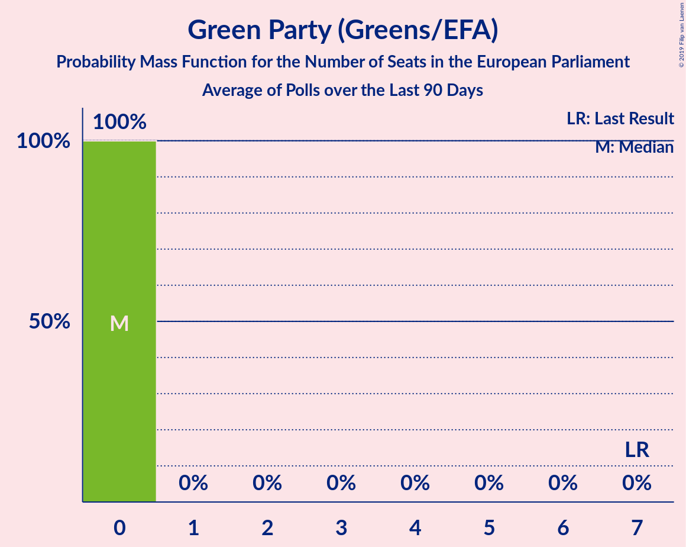

# Green Party (Greens/EFA)

<a href="#voting-intentions">Voting Intentions</a> | <a href="#seats">Seats</a>

## Voting Intentions

Last result: **11.8%** (General Election of 23 May 2019)

### Confidence Intervals

| Period     | Polling firm/Commissioner(s) | Median | 80% Confidence Interval | 90% Confidence Interval | 95% Confidence Interval | 99% Confidence Interval |
|:----------:|:----------------:|:-----------:|:-----------------------:|:-----------------------:|:-----------------------:|:-----------------------:|
| N/A | [Poll Average](average.html) | 5.3% | 3.3–7.4% | 2.8–8.0% | 2.6–8.5% | 2.2–9.3% |
| [6–11 August 2019](2019-08-11-Survation.html) | Survation | 3.0% | N/A | N/A | N/A | N/A |
| [9–11 August 2019](2019-08-11-ComRes.html) | ComRes   Daily Telegraph | 4.0% | N/A | N/A | N/A | N/A |
| [1–10 August 2019](2019-08-10-Opinium.html) | Opinium   Britain Elects | 5.0% | 4.2–6.0% | 4.0–6.2% | 3.8–6.5% | 3.5–7.0% |
| [5–6 August 2019](2019-08-06-YouGov.html) | YouGov   The Times | 6.9% | 6.2–7.8% | 6.0–8.1% | 5.8–8.3% | 5.5–8.7% |
| [29–30 July 2019](2019-07-30-YouGov.html) | YouGov   The Times | 6.2% | 5.6–7.0% | 5.4–7.2% | 5.3–7.4% | 5.0–7.7% |
| [26–30 July 2019](2019-07-30-IpsosMORI.html) | Ipsos MORI | 7.6% | 6.7–8.8% | 6.4–9.2% | 6.2–9.5% | 5.7–10.1% |
| [26–28 July 2019](2019-07-28-ComRes.html) | ComRes   Britain Elects | 5.0% | 4.2–6.0% | 4.0–6.2% | 3.8–6.5% | 3.5–7.0% |
| [25–27 July 2019](2019-07-27-Deltapoll.html) | Deltapoll   The Mail on Sunday | 4.0% | 3.5–4.6% | 3.3–4.8% | 3.2–5.0% | 3.0–5.3% |
| [25–26 July 2019](2019-07-26-YouGov.html) | YouGov   The Sunday Times | 8.0% | 7.2–8.9% | 7.0–9.1% | 6.8–9.3% | 6.4–9.8% |
| [24–26 July 2019](2019-07-26-Opinium.html) | Opinium   The Observer | 4.9% | 4.3–5.6% | 4.2–5.8% | 4.0–5.9% | 3.8–6.3% |
| [24–25 July 2019](2019-07-25-ComRes.html) | ComRes   Sunday Express | 4.0% | 3.5–4.7% | 3.4–4.8% | 3.3–5.0% | 3.0–5.3% |
| [23–24 July 2019](2019-07-24-YouGov.html) | YouGov   The Times | 8.8% | 8.0–9.8% | 7.7–10.0% | 7.5–10.2% | 7.2–10.7% |
| [16–17 July 2019](2019-07-17-YouGov.html) | YouGov   The Times | 8.1% | 7.3–9.0% | 7.1–9.2% | 6.9–9.4% | 6.5–9.9% |
| [15–16 July 2019](2019-07-16-ComRes.html) | ComRes | 5.0% | 4.4–5.6% | 4.2–5.8% | 4.1–6.0% | 3.8–6.3% |
| [10–11 July 2019](2019-07-11-Survation.html) | Survation | 3.0% | 2.4–3.8% | 2.2–4.0% | 2.1–4.2% | 1.8–4.6% |
| [10–11 July 2019](2019-07-11-ComRes.html) | ComRes   The Express | 5.0% | 4.4–5.8% | 4.2–6.0% | 4.1–6.1% | 3.8–6.5% |
| [9–10 July 2019](2019-07-10-YouGov.html) | YouGov   The Times | 9.0% | 8.1–9.9% | 7.9–10.2% | 7.7–10.5% | 7.3–10.9% |
| [5–7 July 2019](2019-07-07-ComRes.html) | ComRes   Daily Telegraph | 5.1% | 4.5–5.8% | 4.3–6.0% | 4.2–6.1% | 3.9–6.5% |
| [3–5 July 2019](2019-07-05-Opinium.html) | Opinium   The Observer | 7.9% | 7.2–8.7% | 7.0–9.0% | 6.8–9.2% | 6.5–9.6% |
| [2–5 July 2019](2019-07-05-BMGResearch.html) | BMG Research   The Independent | 6.1% | 5.3–6.9% | 5.2–7.2% | 5.0–7.4% | 4.6–7.8% |
| [2–3 July 2019](2019-07-03-YouGov.html) | YouGov   The Times | 9.0% | 8.1–10.0% | 7.9–10.2% | 7.7–10.5% | 7.3–11.0% |
| [24–25 June 2019](2019-06-25-YouGov.html) | YouGov   The Times | 10.0% | 9.1–10.9% | 8.9–11.1% | 8.7–11.3% | 8.4–11.8% |
| [21–25 June 2019](2019-06-25-IpsosMORI.html) | Ipsos MORI | 8.1% | 7.1–9.3% | 6.9–9.7% | 6.6–10.0% | 6.2–10.6% |
| [19–20 June 2019](2019-06-20-Survation.html) | Survation   Daily Mail on Sunday | 6.0% | 5.3–6.7% | 5.2–6.9% | 5.0–7.1% | 4.7–7.5% |
| [19–20 June 2019](2019-06-20-Opinium.html) | Opinium   The Observer | 6.0% | 5.4–6.8% | 5.2–7.0% | 5.1–7.2% | 4.8–7.5% |
| [13–14 June 2019](2019-06-14-YouGov.html) | YouGov   The Sunday Times | 9.0% | 8.2–10.0% | 7.9–10.3% | 7.7–10.5% | 7.4–11.0% |
| [9–10 June 2019](2019-06-10-YouGov.html) | YouGov   The Times | 8.0% | 7.3–9.0% | 7.0–9.2% | 6.8–9.4% | 6.5–9.9% |
| [7–9 June 2019](2019-06-09-ComRes.html) | ComRes   Daily Telegraph | 5.0% | 4.4–5.6% | 4.2–5.8% | 4.1–6.0% | 3.8–6.3% |
| [4–7 June 2019](2019-06-07-BMGResearch.html) | BMG Research   The Independent | 0.0% | N/A | N/A | N/A | N/A |
| [4–6 June 2019](2019-06-06-YouGov.html) | YouGov   The Times | 9.0% | 8.1–10.0% | 7.9–10.2% | 7.7–10.5% | 7.3–11.0% |
| [28–30 May 2019](2019-05-30-Opinium.html) | Opinium   The Observer | 11.0% | 10.2–12.0% | 9.9–12.2% | 9.7–12.5% | 9.3–12.9% |
| [29–30 May 2019](2019-05-30-Deltapoll.html) | Deltapoll   The Mail on Sunday | 4.9% | 4.4–5.5% | 4.2–5.7% | 4.1–5.8% | 3.9–6.1% |
| [28–29 May 2019](2019-05-29-YouGov.html) | YouGov   The Times | 8.0% | 7.2–8.9% | 7.0–9.1% | 6.8–9.4% | 6.5–9.8% |

### Probability Mass Function

The following table shows the probability mass function per percentage block of voting intentions for the [poll average](average.html) for Green Party (Greens/EFA).

| Voting Intentions | Probability | Accumulated | Special Marks |
|:-----------------:|:-----------:|:-----------:|:-------------:|
| 0.5–1.5% | 0% | 100% |  |
| 1.5–2.5% | 2% | 100% |  |
| 2.5–3.5% | 11% | 98% |  |
| 3.5–4.5% | 19% | 86% |  |
| 4.5–5.5% | 23% | 67% | Median |
| 5.5–6.5% | 23% | 44% |  |
| 6.5–7.5% | 13% | 21% |  |
| 7.5–8.5% | 6% | 9% |  |
| 8.5–9.5% | 2% | 2% |  |
| 9.5–10.5% | 0.3% | 0.3% |  |
| 10.5–11.5% | 0% | 0% |  |
| 11.5–12.5% | 0% | 0% | Last Result |

## Seats

Last result: **7** seats (General Election of 23 May 2019)

### Confidence Intervals

| Period     | Polling firm/Commissioner(s) | Median | 80% Confidence Interval | 90% Confidence Interval | 95% Confidence Interval | 99% Confidence Interval |
|:----------:|:----------------:|:------:|:-----------------------:|:-----------------------:|:-----------------------:|:-----------------------:|
| N/A | [Poll Average](average.html) | 0 | 0–2 | 0–2 | 0–2 | 0–3 |
| [6–11 August 2019](2019-08-11-Survation.html) | Survation |  |  |  |  |  |
| [9–11 August 2019](2019-08-11-ComRes.html) | ComRes   Daily Telegraph |  |  |  |  |  |
| [1–10 August 2019](2019-08-10-Opinium.html) | Opinium   Britain Elects | 0 | 0 | 0 | 0 | 0 |
| [5–6 August 2019](2019-08-06-YouGov.html) | YouGov   The Times | 2 | 2 | 2 | 2 | 0–2 |
| [29–30 July 2019](2019-07-30-YouGov.html) | YouGov   The Times | 0 | 0–1 | 0–2 | 0–2 | 0–2 |
| [26–30 July 2019](2019-07-30-IpsosMORI.html) | Ipsos MORI | 2 | 1–3 | 0–3 | 0–3 | 0–5 |
| [26–28 July 2019](2019-07-28-ComRes.html) | ComRes   Britain Elects | 0 | 0 | 0–1 | 0–1 | 0–2 |
| [25–27 July 2019](2019-07-27-Deltapoll.html) | Deltapoll   The Mail on Sunday | 0 | 0 | 0 | 0 | 0 |
| [25–26 July 2019](2019-07-26-YouGov.html) | YouGov   The Sunday Times | 2 | 2–3 | 1–4 | 0–4 | 0–4 |
| [24–26 July 2019](2019-07-26-Opinium.html) | Opinium   The Observer | 0 | 0 | 0 | 0 | 0–2 |
| [24–25 July 2019](2019-07-25-ComRes.html) | ComRes   Sunday Express | 0 | 0 | 0 | 0 | 0 |
| [23–24 July 2019](2019-07-24-YouGov.html) | YouGov   The Times | 2 | 2–6 | 2–6 | 2–6 | 2–6 |
| [16–17 July 2019](2019-07-17-YouGov.html) | YouGov   The Times | 2 | 2 | 1–3 | 1–3 | 0–4 |
| [15–16 July 2019](2019-07-16-ComRes.html) | ComRes | 0 | 0 | 0 | 0 | 0–1 |
| [10–11 July 2019](2019-07-11-Survation.html) | Survation | 0 | 0 | 0 | 0 | 0 |
| [10–11 July 2019](2019-07-11-ComRes.html) | ComRes   The Express | 0 | 0 | 0 | 0 | 0–1 |
| [9–10 July 2019](2019-07-10-YouGov.html) | YouGov   The Times | 2 | 2–4 | 2–5 | 2–5 | 1–6 |
| [5–7 July 2019](2019-07-07-ComRes.html) | ComRes   Daily Telegraph | 0 | 0 | 0 | 0 | 0–1 |
| [3–5 July 2019](2019-07-05-Opinium.html) | Opinium   The Observer | 2 | 1–3 | 1–3 | 1–4 | 1–4 |
| [2–5 July 2019](2019-07-05-BMGResearch.html) | BMG Research   The Independent | 0 | 0–2 | 0–2 | 0–2 | 0–2 |
| [2–3 July 2019](2019-07-03-YouGov.html) | YouGov   The Times | 3 | 2–5 | 2–6 | 1–6 | 0–6 |
| [24–25 June 2019](2019-06-25-YouGov.html) | YouGov   The Times | 4 | 3–6 | 2–6 | 2–6 | 2–6 |
| [21–25 June 2019](2019-06-25-IpsosMORI.html) | Ipsos MORI | 2 | 1–2 | 1–4 | 1–5 | 0–6 |
| [19–20 June 2019](2019-06-20-Survation.html) | Survation   Daily Mail on Sunday | 0 | 0–1 | 0–1 | 0–1 | 0–2 |
| [19–20 June 2019](2019-06-20-Opinium.html) | Opinium   The Observer | 0 | 0–2 | 0–2 | 0–2 | 0–2 |
| [13–14 June 2019](2019-06-14-YouGov.html) | YouGov   The Sunday Times | 3 | 2–4 | 2–5 | 2–5 | 1–6 |
| [9–10 June 2019](2019-06-10-YouGov.html) | YouGov   The Times | 2 | 2–3 | 2–3 | 1–4 | 0–4 |
| [7–9 June 2019](2019-06-09-ComRes.html) | ComRes   Daily Telegraph | 0 | 0 | 0 | 0 | 0–1 |
| [4–7 June 2019](2019-06-07-BMGResearch.html) | BMG Research   The Independent |  |  |  |  |  |
| [4–6 June 2019](2019-06-06-YouGov.html) | YouGov   The Times | 4 | 2–5 | 2–5 | 2–6 | 2–6 |
| [28–30 May 2019](2019-05-30-Opinium.html) | Opinium   The Observer | 5 | 5–7 | 5–7 | 5–7 | 4–7 |
| [29–30 May 2019](2019-05-30-Deltapoll.html) | Deltapoll   The Mail on Sunday | 0 | 0 | 0 | 0 | 0–1 |
| [28–29 May 2019](2019-05-29-YouGov.html) | YouGov   The Times | 2 | 2 | 1–2 | 1–3 | 1–4 |

### Probability Mass Function

The following table shows the probability mass function per seat for the [poll average](average.html) for Green Party (Greens/EFA).

| Number of Seats | Probability | Accumulated | Special Marks |
|:---------------:|:-----------:|:-----------:|:-------------:|
| 0 | 78% | 100% | Median |
| 1 | 5% | 22% |  |
| 2 | 15% | 17% |  |
| 3 | 2% | 2% |  |
| 4 | 0.2% | 0.3% |  |
| 5 | 0.1% | 0.1% |  |
| 6 | 0% | 0% |  |
| 7 | 0% | 0% | Last Result |

