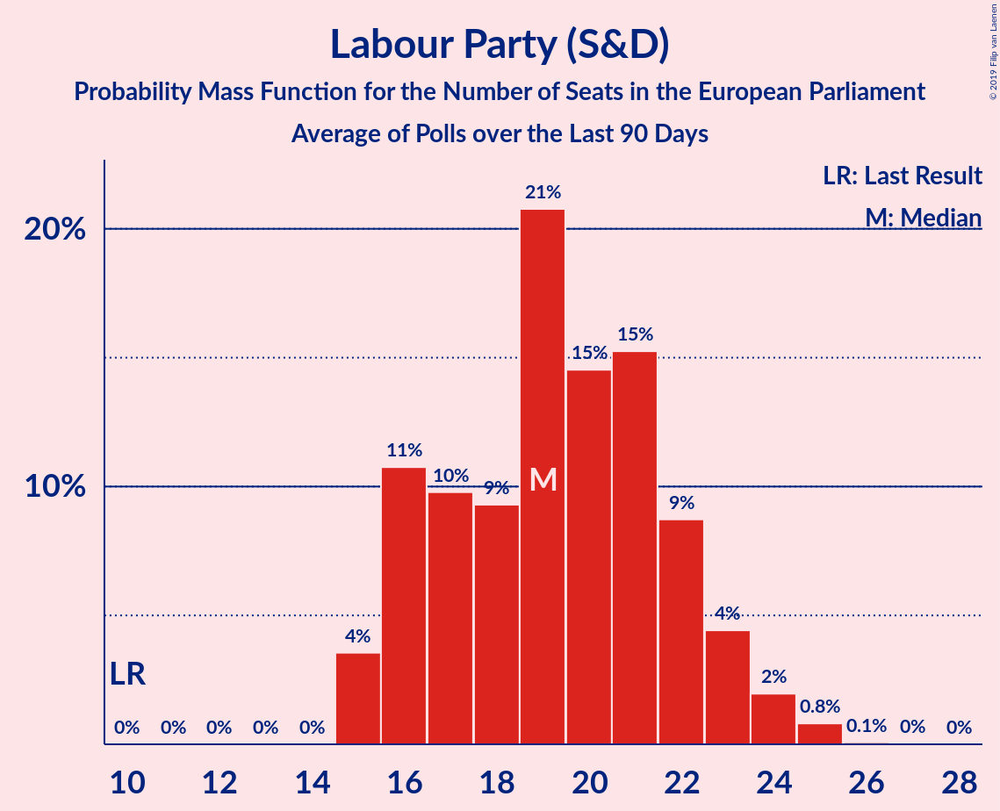

# Labour Party (S&D)

<a href="#voting-intentions">Voting Intentions</a> | <a href="#seats">Seats</a>

## Voting Intentions

Last result: **13.7%** (General Election of 23 May 2019)

### Confidence Intervals

| Period     | Polling firm/Commissioner(s) | Median | 80% Confidence Interval | 90% Confidence Interval | 95% Confidence Interval | 99% Confidence Interval |
|:----------:|:----------------:|:-----------:|:-----------------------:|:-----------------------:|:-----------------------:|:-----------------------:|
| N/A | [Poll Average](average.html) | 26.6% | 22.5–29.6% | 21.9–30.2% | 21.4–30.7% | 20.6–31.7% |
| [12–15 September 2019](2019-09-15-ComRes.html) | ComRes   Sunday Express | 27.0% | 25.7–28.3% | 25.4–28.6% | 25.1–28.9% | 24.5–29.6% |
| [11–13 September 2019](2019-09-13-Opinium.html) | Opinium   The Observer | 25.0% | 23.8–26.3% | 23.5–26.7% | 23.2–27.0% | 22.6–27.6% |
| [9–10 September 2019](2019-09-10-YouGov.html) | YouGov   The Times | 22.9% | 21.6–24.2% | 21.2–24.6% | 20.9–24.9% | 20.3–25.6% |
| [5–9 September 2019](2019-09-09-KantarPublic.html) | Kantar Public | 24.0% | 22.5–25.7% | 22.0–26.2% | 21.6–26.6% | 20.9–27.4% |
| [6–8 September 2019](2019-09-08-ComRes.html) | ComRes   Daily Telegraph | 28.9% | 27.6–30.2% | 27.3–30.6% | 27.0–30.9% | 26.4–31.6% |
| [5–7 September 2019](2019-09-07-Deltapoll.html) | Deltapoll   The Sun on Sunday | 27.9% | 26.7–29.2% | 26.3–29.6% | 26.0–29.9% | 25.4–30.5% |
| [5–6 September 2019](2019-09-06-YouGov.html) | YouGov   The Sunday Times | 20.9% | 19.6–22.2% | 19.3–22.6% | 19.0–22.9% | 18.4–23.5% |
| [5–6 September 2019](2019-09-06-Survation.html) | Survation   Daily Mail | 24.0% | 22.4–25.8% | 21.9–26.3% | 21.5–26.7% | 20.7–27.6% |
| [5–6 September 2019](2019-09-06-Panelbase.html) | Panelbase | 28.3% | 26.6–30.2% | 26.1–30.7% | 25.6–31.2% | 24.8–32.1% |
| [4–6 September 2019](2019-09-06-Opinium.html) | Opinium   The Observer | 24.9% | 23.7–26.2% | 23.3–26.5% | 23.0–26.8% | 22.5–27.5% |
| [4–6 September 2019](2019-09-06-ComRes.html) | ComRes   Britain Elects | 27.0% | 25.7–28.3% | 25.4–28.7% | 25.1–29.0% | 24.5–29.6% |
| [3–6 September 2019](2019-09-06-BMGResearch.html) | BMG Research   The Independent | 27.0% | 25.6–28.5% | 25.1–28.9% | 24.8–29.3% | 24.1–30.0% |
| [3–4 September 2019](2019-09-04-HanburyStrategy.html) | Hanbury Strategy | 25.8% | 24.1–27.7% | 23.6–28.2% | 23.2–28.7% | 22.4–29.5% |
| [2–3 September 2019](2019-09-03-YouGov.html) | YouGov   The Times | 24.9% | 23.5–26.3% | 23.2–26.7% | 22.8–27.1% | 22.2–27.7% |
| [29–31 August 2019](2019-08-31-Deltapoll.html) | Deltapoll   The Mail on Sunday | 23.5% | 22.3–24.7% | 22.0–25.1% | 21.7–25.4% | 21.1–26.0% |
| [29–30 August 2019](2019-08-30-Survation.html) | Survation   Daily Mail | 23.7% | 22.1–25.5% | 21.6–26.0% | 21.2–26.4% | 20.4–27.3% |
| [28–29 August 2019](2019-08-29-YouGov.html) | YouGov | 21.7% | 20.5–23.0% | 20.2–23.3% | 19.9–23.6% | 19.3–24.2% |
| [27–28 August 2019](2019-08-28-YouGov.html) | YouGov   The Times | 21.9% | 20.7–23.1% | 20.4–23.5% | 20.1–23.8% | 19.6–24.3% |
| [22–23 August 2019](2019-08-23-YouGov.html) | YouGov   The Sunday Times | 19.3% | 18.2–20.4% | 17.9–20.8% | 17.6–21.0% | 17.1–21.6% |
| [21–23 August 2019](2019-08-23-Opinium.html) | Opinium   The Observer | 25.7% | 24.5–27.0% | 24.1–27.3% | 23.8–27.6% | 23.2–28.3% |
| [20–21 August 2019](2019-08-21-YouGov.html) | YouGov   The Times | 21.9% | 20.6–23.2% | 20.3–23.6% | 20.0–23.9% | 19.4–24.6% |
| [15–19 August 2019](2019-08-19-KantarPublic.html) | Kantar Public | 27.9% | 26.2–29.6% | 25.8–30.1% | 25.3–30.6% | 24.6–31.4% |
| [13–14 August 2019](2019-08-14-YouGov.html) | YouGov   The Times | 20.7% | 19.5–22.1% | 19.1–22.5% | 18.8–22.8% | 18.2–23.4% |
| [7–12 August 2019](2019-08-12-BMGResearch.html) | BMG Research   The Independent | 24.9% | 23.5–26.4% | 23.2–26.8% | 22.8–27.2% | 22.2–27.9% |
| [6–11 August 2019](2019-08-11-Survation.html) | Survation | 24.2% | 23.0–25.4% | 22.6–25.8% | 22.3–26.1% | 21.8–26.7% |
| [9–11 August 2019](2019-08-11-ComRes.html) | ComRes   Daily Telegraph | 26.9% | 25.6–28.2% | 25.3–28.5% | 25.0–28.8% | 24.4–29.5% |
| [8–9 August 2019](2019-08-09-Opinium.html) | Opinium   The Observer | 28.2% | 26.9–29.5% | 26.5–29.9% | 26.2–30.2% | 25.6–30.8% |
| [5–6 August 2019](2019-08-06-YouGov.html) | YouGov   The Times | 21.8% | 20.5–23.2% | 20.2–23.5% | 19.9–23.9% | 19.3–24.5% |
| [29–30 July 2019](2019-07-30-YouGov.html) | YouGov   The Times | 22.8% | 21.7–24.1% | 21.4–24.4% | 21.1–24.7% | 20.5–25.3% |
| [26–30 July 2019](2019-07-30-IpsosMORI.html) | Ipsos MORI | 22.9% | 21.3–24.7% | 20.8–25.2% | 20.4–25.7% | 19.7–26.5% |
| [26–28 July 2019](2019-07-28-ComRes.html) | ComRes   Britain Elects | 29.3% | 28.1–30.7% | 27.7–31.0% | 27.4–31.4% | 26.8–32.0% |
| [25–27 July 2019](2019-07-27-Deltapoll.html) | Deltapoll   The Mail on Sunday | 25.0% | 23.8–26.3% | 23.4–26.6% | 23.1–26.9% | 22.6–27.6% |
| [25–26 July 2019](2019-07-26-YouGov.html) | YouGov   The Sunday Times | 20.9% | 19.7–22.2% | 19.3–22.6% | 19.0–22.9% | 18.5–23.6% |
| [24–26 July 2019](2019-07-26-Opinium.html) | Opinium   The Observer | 27.4% | 26.1–28.7% | 25.8–29.1% | 25.5–29.4% | 24.9–30.0% |
| [24–25 July 2019](2019-07-25-ComRes.html) | ComRes   Sunday Express | 27.2% | 25.9–28.5% | 25.6–28.8% | 25.3–29.1% | 24.7–29.8% |
| [23–24 July 2019](2019-07-24-YouGov.html) | YouGov   The Times | 18.6% | 17.4–19.9% | 17.1–20.2% | 16.8–20.5% | 16.3–21.1% |
| [16–17 July 2019](2019-07-17-YouGov.html) | YouGov   The Times | 21.1% | 19.9–22.4% | 19.5–22.8% | 19.3–23.1% | 18.7–23.7% |
| [15–16 July 2019](2019-07-16-ComRes.html) | ComRes | 27.7% | 26.4–29.0% | 26.1–29.3% | 25.8–29.7% | 25.2–30.3% |
| [10–11 July 2019](2019-07-11-Survation.html) | Survation | 28.8% | 27.0–30.6% | 26.5–31.2% | 26.0–31.6% | 25.2–32.5% |
| [10–11 July 2019](2019-07-11-ComRes.html) | ComRes   The Express | 28.0% | 26.6–29.4% | 26.3–29.8% | 25.9–30.1% | 25.3–30.8% |
| [9–10 July 2019](2019-07-10-YouGov.html) | YouGov   The Times | 19.9% | 18.7–21.2% | 18.4–21.6% | 18.1–21.9% | 17.5–22.6% |
| [5–7 July 2019](2019-07-07-ComRes.html) | ComRes   Daily Telegraph | 28.4% | 27.1–29.7% | 26.8–30.1% | 26.5–30.4% | 25.9–31.1% |
| [3–5 July 2019](2019-07-05-Opinium.html) | Opinium   The Observer | 24.8% | 23.6–26.1% | 23.2–26.4% | 23.0–26.7% | 22.4–27.3% |
| [2–5 July 2019](2019-07-05-BMGResearch.html) | BMG Research   The Independent | 27.2% | 25.8–28.7% | 25.4–29.1% | 25.0–29.5% | 24.4–30.2% |
| [2–3 July 2019](2019-07-03-YouGov.html) | YouGov   The Times | 17.9% | 16.7–19.2% | 16.4–19.5% | 16.1–19.8% | 15.5–20.5% |
| [24–25 June 2019](2019-06-25-YouGov.html) | YouGov   The Times | 20.0% | 18.9–21.1% | 18.5–21.5% | 18.3–21.7% | 17.8–22.3% |
| [21–25 June 2019](2019-06-25-IpsosMORI.html) | Ipsos MORI | 24.4% | 22.7–26.1% | 22.2–26.6% | 21.8–27.1% | 21.1–27.9% |
| [19–20 June 2019](2019-06-20-Survation.html) | Survation   Daily Mail on Sunday | 25.7% | 24.5–27.0% | 24.2–27.4% | 23.9–27.7% | 23.3–28.3% |
| [19–20 June 2019](2019-06-20-Opinium.html) | Opinium   The Observer | 26.0% | 24.8–27.3% | 24.4–27.6% | 24.1–28.0% | 23.5–28.6% |
| [13–14 June 2019](2019-06-14-YouGov.html) | YouGov   The Sunday Times | 21.1% | 19.9–22.4% | 19.5–22.8% | 19.2–23.1% | 18.6–23.8% |
| [9–10 June 2019](2019-06-10-YouGov.html) | YouGov   The Times | 19.2% | 18.0–20.4% | 17.6–20.8% | 17.3–21.1% | 16.8–21.7% |
| [7–9 June 2019](2019-06-09-ComRes.html) | ComRes   Daily Telegraph | 26.7% | 25.5–28.0% | 25.1–28.4% | 24.8–28.7% | 24.2–29.3% |
| [4–7 June 2019](2019-06-07-BMGResearch.html) | BMG Research   The Independent | 27.0% | 25.5–28.5% | 25.1–28.9% | 24.8–29.3% | 24.1–30.0% |
| [4–6 June 2019](2019-06-06-YouGov.html) | YouGov   The Times | 19.9% | 18.6–21.2% | 18.3–21.6% | 18.0–21.9% | 17.4–22.6% |
| [28–30 May 2019](2019-05-30-Opinium.html) | Opinium   The Observer | 22.0% | 20.8–23.2% | 20.5–23.6% | 20.2–23.9% | 19.7–24.5% |
| [29–30 May 2019](2019-05-30-Deltapoll.html) | Deltapoll   The Mail on Sunday | 25.5% | 24.4–26.6% | 24.1–27.0% | 23.8–27.3% | 23.3–27.8% |
| [28–29 May 2019](2019-05-29-YouGov.html) | YouGov   The Times | 18.9% | 17.8–20.2% | 17.5–20.5% | 17.2–20.9% | 16.6–21.5% |

### Probability Mass Function

The following table shows the probability mass function per percentage block of voting intentions for the [poll average](average.html) for Labour Party (S&D).

| Voting Intentions | Probability | Accumulated | Special Marks |
|:-----------------:|:-----------:|:-----------:|:-------------:|
| 13.5–14.5% | 0% | 100% | Last Result |
| 14.5–15.5% | 0% | 100% |  |
| 15.5–16.5% | 0% | 100% |  |
| 16.5–17.5% | 0% | 100% |  |
| 17.5–18.5% | 0% | 100% |  |
| 18.5–19.5% | 0.1% | 100% |  |
| 19.5–20.5% | 0.4% | 99.9% |  |
| 20.5–21.5% | 3% | 99.5% |  |
| 21.5–22.5% | 8% | 97% |  |
| 22.5–23.5% | 11% | 89% |  |
| 23.5–24.5% | 10% | 79% |  |
| 24.5–25.5% | 9% | 69% |  |
| 25.5–26.5% | 10% | 60% |  |
| 26.5–27.5% | 13% | 50% | Median |
| 27.5–28.5% | 14% | 37% |  |
| 28.5–29.5% | 12% | 23% |  |
| 29.5–30.5% | 7% | 11% |  |
| 30.5–31.5% | 3% | 3% |  |
| 31.5–32.5% | 0.6% | 0.6% |  |
| 32.5–33.5% | 0.1% | 0.1% |  |
| 33.5–34.5% | 0% | 0% |  |

## Seats

Last result: **10** seats (General Election of 23 May 2019)

### Confidence Intervals

| Period     | Polling firm/Commissioner(s) | Median | 80% Confidence Interval | 90% Confidence Interval | 95% Confidence Interval | 99% Confidence Interval |
|:----------:|:----------------:|:------:|:-----------------------:|:-----------------------:|:-----------------------:|:-----------------------:|
| N/A | [Poll Average](average.html) | 21 | 17–25 | 16–26 | 15–27 | 15–27 |
| [12–15 September 2019](2019-09-15-ComRes.html) | ComRes   Sunday Express | 22 | 20–23 | 20–24 | 19–24 | 19–25 |
| [11–13 September 2019](2019-09-13-Opinium.html) | Opinium   The Observer | 20 | 20 | 20 | 20–22 | 16–22 |
| [9–10 September 2019](2019-09-10-YouGov.html) | YouGov   The Times | 18 | 16–20 | 15–20 | 15–21 | 15–21 |
| [5–9 September 2019](2019-09-09-KantarPublic.html) | Kantar Public | 18 | 18 | 18–19 | 18–20 | 18–20 |
| [6–8 September 2019](2019-09-08-ComRes.html) | ComRes   Daily Telegraph | 24 | 24 | 24 | 24 | 24 |
| [5–7 September 2019](2019-09-07-Deltapoll.html) | Deltapoll   The Sun on Sunday | 25 | 20–25 | 20–27 | 20–27 | 20–27 |
| [5–6 September 2019](2019-09-06-YouGov.html) | YouGov   The Sunday Times | 17 | 16–17 | 16–17 | 16–18 | 15–18 |
| [5–6 September 2019](2019-09-06-Survation.html) | Survation   Daily Mail | 17 | 16–22 | 16–22 | 16–23 | 15–24 |
| [5–6 September 2019](2019-09-06-Panelbase.html) | Panelbase | 21 | 21 | 21 | 21 | 19–24 |
| [4–6 September 2019](2019-09-06-Opinium.html) | Opinium   The Observer | 21 | 18–22 | 16–22 | 16–22 | 16–23 |
| [4–6 September 2019](2019-09-06-ComRes.html) | ComRes   Britain Elects | 21 | 21 | 21 | 21–22 | 19–23 |
| [3–6 September 2019](2019-09-06-BMGResearch.html) | BMG Research   The Independent | 21 | 16–22 | 16–22 | 16–22 | 16–24 |
| [3–4 September 2019](2019-09-04-HanburyStrategy.html) | Hanbury Strategy | 20 | 20–22 | 20–22 | 20–22 | 16–25 |
| [2–3 September 2019](2019-09-03-YouGov.html) | YouGov   The Times | 20 | 18–22 | 17–22 | 16–22 | 16–22 |
| [29–31 August 2019](2019-08-31-Deltapoll.html) | Deltapoll   The Mail on Sunday | 18 | 16–20 | 16–20 | 16–21 | 15–21 |
| [29–30 August 2019](2019-08-30-Survation.html) | Survation   Daily Mail | 19 | 16–20 | 16–21 | 15–21 | 15–22 |
| [28–29 August 2019](2019-08-29-YouGov.html) | YouGov | 16 | 15–18 | 15–18 | 15–19 | 15–21 |
| [27–28 August 2019](2019-08-28-YouGov.html) | YouGov   The Times | 16 | 15–18 | 15–19 | 15–20 | 15–20 |
| [22–23 August 2019](2019-08-23-YouGov.html) | YouGov   The Sunday Times | 15 | 15 | 15–16 | 15–16 | 15–16 |
| [21–23 August 2019](2019-08-23-Opinium.html) | Opinium   The Observer | 20 | 19–21 | 19–22 | 19–23 | 18–25 |
| [20–21 August 2019](2019-08-21-YouGov.html) | YouGov   The Times | 16 | 15–19 | 15–20 | 15–21 | 15–21 |
| [15–19 August 2019](2019-08-19-KantarPublic.html) | Kantar Public | 23 | 21–26 | 20–26 | 20–26 | 19–26 |
| [13–14 August 2019](2019-08-14-YouGov.html) | YouGov   The Times | 16 | 15–18 | 15–18 | 15–19 | 15–19 |
| [7–12 August 2019](2019-08-12-BMGResearch.html) | BMG Research   The Independent | 21 | 19–21 | 19–22 | 18–22 | 16–23 |
| [6–11 August 2019](2019-08-11-Survation.html) | Survation | 19 | 17–20 | 17–20 | 17–21 | 16–22 |
| [9–11 August 2019](2019-08-11-ComRes.html) | ComRes   Daily Telegraph | 20 | 20–23 | 20–24 | 20–24 | 20–25 |
| [8–9 August 2019](2019-08-09-Opinium.html) | Opinium   The Observer | 24 | 21–26 | 20–26 | 20–27 | 19–27 |
| [5–6 August 2019](2019-08-06-YouGov.html) | YouGov   The Times | 17 | 15–19 | 15–19 | 15–19 | 15–20 |
| [29–30 July 2019](2019-07-30-YouGov.html) | YouGov   The Times | 18 | 15–20 | 15–21 | 15–21 | 15–22 |
| [26–30 July 2019](2019-07-30-IpsosMORI.html) | Ipsos MORI | 18 | 16–21 | 15–21 | 15–21 | 15–22 |
| [26–28 July 2019](2019-07-28-ComRes.html) | ComRes   Britain Elects | 25 | 23–27 | 22–27 | 22–27 | 20–27 |
| [25–27 July 2019](2019-07-27-Deltapoll.html) | Deltapoll   The Mail on Sunday | 20 | 19–21 | 19–22 | 19–22 | 18–22 |
| [25–26 July 2019](2019-07-26-YouGov.html) | YouGov   The Sunday Times | 15 | 15–17 | 15–18 | 15–18 | 15–19 |
| [24–26 July 2019](2019-07-26-Opinium.html) | Opinium   The Observer | 23 | 20–25 | 19–25 | 19–26 | 19–27 |
| [24–25 July 2019](2019-07-25-ComRes.html) | ComRes   Sunday Express | 20 | 19–22 | 19–22 | 19–23 | 19–24 |
| [23–24 July 2019](2019-07-24-YouGov.html) | YouGov   The Times | 15 | 14–16 | 14–16 | 13–16 | 12–16 |
| [16–17 July 2019](2019-07-17-YouGov.html) | YouGov   The Times | 16 | 15–16 | 15–16 | 15–16 | 15–18 |
| [15–16 July 2019](2019-07-16-ComRes.html) | ComRes | 22 | 20–25 | 20–25 | 20–25 | 19–26 |
| [10–11 July 2019](2019-07-11-Survation.html) | Survation | 22 | 20–25 | 20–26 | 19–27 | 18–28 |
| [10–11 July 2019](2019-07-11-ComRes.html) | ComRes   The Express | 22 | 19–24 | 19–26 | 18–26 | 18–27 |
| [9–10 July 2019](2019-07-10-YouGov.html) | YouGov   The Times | 15 | 15–16 | 15–16 | 14–16 | 12–16 |
| [5–7 July 2019](2019-07-07-ComRes.html) | ComRes   Daily Telegraph | 23 | 20–25 | 20–25 | 20–26 | 19–26 |
| [3–5 July 2019](2019-07-05-Opinium.html) | Opinium   The Observer | 20 | 17–20 | 16–21 | 16–21 | 15–23 |
| [2–5 July 2019](2019-07-05-BMGResearch.html) | BMG Research   The Independent | 21 | 20–24 | 20–24 | 19–24 | 19–25 |
| [2–3 July 2019](2019-07-03-YouGov.html) | YouGov   The Times | 14 | 12–16 | 11–16 | 10–16 | 9–16 |
| [24–25 June 2019](2019-06-25-YouGov.html) | YouGov   The Times | 16 | 15–16 | 14–16 | 14–16 | 12–17 |
| [21–25 June 2019](2019-06-25-IpsosMORI.html) | Ipsos MORI | 18 | 15–21 | 15–22 | 15–22 | 15–24 |
| [19–20 June 2019](2019-06-20-Survation.html) | Survation   Daily Mail on Sunday | 19 | 17–20 | 17–21 | 17–21 | 16–23 |
| [19–20 June 2019](2019-06-20-Opinium.html) | Opinium   The Observer | 21 | 20–23 | 20–24 | 20–24 | 19–25 |
| [13–14 June 2019](2019-06-14-YouGov.html) | YouGov   The Sunday Times | 16 | 16–17 | 16–18 | 16–18 | 15–20 |
| [9–10 June 2019](2019-06-10-YouGov.html) | YouGov   The Times | 16 | 15–16 | 13–16 | 13–16 | 13–16 |
| [7–9 June 2019](2019-06-09-ComRes.html) | ComRes   Daily Telegraph | 20 | 19–22 | 18–22 | 18–23 | 17–24 |
| [4–7 June 2019](2019-06-07-BMGResearch.html) | BMG Research   The Independent | 19 | 17–22 | 17–23 | 17–23 | 16–23 |
| [4–6 June 2019](2019-06-06-YouGov.html) | YouGov   The Times | 16 | 15–17 | 14–17 | 14–17 | 13–18 |
| [28–30 May 2019](2019-05-30-Opinium.html) | Opinium   The Observer | 17 | 16–18 | 15–19 | 15–19 | 15–19 |
| [29–30 May 2019](2019-05-30-Deltapoll.html) | Deltapoll   The Mail on Sunday | 21 | 20–23 | 20–23 | 20–24 | 20–24 |
| [28–29 May 2019](2019-05-29-YouGov.html) | YouGov   The Times | 15 | 15–16 | 15–16 | 14–16 | 13–16 |

### Probability Mass Function

The following table shows the probability mass function per seat for the [poll average](average.html) for Labour Party (S&D).

| Number of Seats | Probability | Accumulated | Special Marks |
|:---------------:|:-----------:|:-----------:|:-------------:|
| 10 | 0% | 100% | Last Result |
| 11 | 0% | 100% |  |
| 12 | 0% | 100% |  |
| 13 | 0% | 100% |  |
| 14 | 0% | 100% |  |
| 15 | 3% | 100% |  |
| 16 | 5% | 97% |  |
| 17 | 5% | 92% |  |
| 18 | 7% | 87% |  |
| 19 | 12% | 80% |  |
| 20 | 13% | 68% |  |
| 21 | 16% | 55% | Median |
| 22 | 9% | 39% |  |
| 23 | 9% | 30% |  |
| 24 | 7% | 22% |  |
| 25 | 6% | 14% |  |
| 26 | 5% | 8% |  |
| 27 | 3% | 3% |  |
| 28 | 0.1% | 0.1% |  |
| 29 | 0% | 0% |  |

