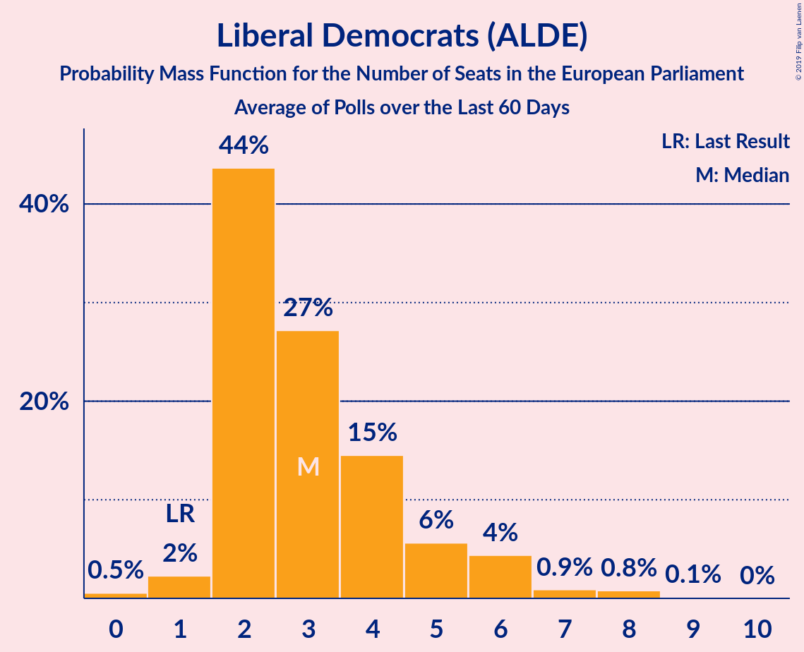

# Liberal Democrats (ALDE)

<a href="#voting-intentions">Voting Intentions</a> | <a href="#seats">Seats</a>

## Voting Intentions

Last result: **6.6%** (General Election of 22 May 2014)

### Confidence Intervals

| Period     | Polling firm/Commissioner(s) | Median | 80% Confidence Interval | 90% Confidence Interval | 95% Confidence Interval | 99% Confidence Interval |
|:----------:|:----------------:|:-----------:|:-----------------------:|:-----------------------:|:-----------------------:|:-----------------------:|
| N/A | [Poll Average](average.html) | 8.4% | 7.3–10.2% | 7.0–10.6% | 6.8–10.9% | 6.3–11.5% |
| [16–17 April 2019](2019-04-17-YouGov.html) | YouGov   The Times | 9.0% | 8.2–9.9% | 7.9–10.2% | 7.7–10.4% | 7.4–10.9% |
| [15–16 April 2019](2019-04-16-YouGov.html) | YouGov   People’s Vote | 8.9% | 8.1–9.8% | 7.9–10.1% | 7.7–10.3% | 7.3–10.7% |
| [16 April 2019](2019-04-16-ComRes.html) | ComRes   Brexit Express | 9.0% | 7.9–10.2% | 7.6–10.5% | 7.4–10.8% | 6.9–11.4% |
| [9–12 April 2019](2019-04-12-Opinium.html) | Opinium   The Observer | 10.0% | 9.2–10.9% | 9.0–11.2% | 8.8–11.4% | 8.4–11.9% |
| [10–11 April 2019](2019-04-11-YouGov.html) | YouGov   The Times | 8.1% | 7.3–9.0% | 7.1–9.2% | 6.9–9.4% | 6.6–9.9% |
| [5–8 April 2019](2019-04-08-HanburyStrategy.html) | Hanbury Strategy   Open Europe | 8.0% | 7.3–8.9% | 7.1–9.1% | 6.9–9.3% | 6.6–9.7% |
| [28–30 March 2019](2019-03-30-Opinium.html) | Opinium   The Observer | 10.0% | 9.2–10.9% | 9.0–11.2% | 8.8–11.4% | 8.4–11.9% |
| [12–15 March 2019](2019-03-15-Opinium.html) | Opinium   The Observer | 10.9% | N/A | N/A | N/A | N/A |
| [10–17 January 2019](2019-01-17-NumberCruncherPolitics.html) | Number Cruncher Politics   Politico | 8.0% | 7.0–9.1% | 6.7–9.5% | 6.5–9.8% | 6.0–10.4% |

### Probability Mass Function

The following table shows the probability mass function per percentage block of voting intentions for the [poll average](average.html) for Liberal Democrats (ALDE).

| Voting Intentions | Probability | Accumulated | Special Marks |
|:-----------------:|:-----------:|:-----------:|:-------------:|
| 4.5–5.5% | 0% | 100% |  |
| 5.5–6.5% | 1.0% | 100% |  |
| 6.5–7.5% | 15% | 99.0% | Last Result |
| 7.5–8.5% | 40% | 84% | Median |
| 8.5–9.5% | 22% | 43% |  |
| 9.5–10.5% | 15% | 21% |  |
| 10.5–11.5% | 5% | 6% |  |
| 11.5–12.5% | 0.4% | 0.4% |  |
| 12.5–13.5% | 0% | 0% |  |

## Seats

Last result: **1** seats (General Election of 22 May 2014)

### Confidence Intervals

| Period     | Polling firm/Commissioner(s) | Median | 80% Confidence Interval | 90% Confidence Interval | 95% Confidence Interval | 99% Confidence Interval |
|:----------:|:----------------:|:------:|:-----------------------:|:-----------------------:|:-----------------------:|:-----------------------:|
| N/A | [Poll Average](average.html) | 2 | 2–5 | 2–6 | 1–6 | 1–7 |
| [16–17 April 2019](2019-04-17-YouGov.html) | YouGov   The Times | 3 | 2–5 | 2–5 | 2–6 | 2–7 |
| [15–16 April 2019](2019-04-16-YouGov.html) | YouGov   People’s Vote | 2 | 2–3 | 2–5 | 2–6 | 2–7 |
| [16 April 2019](2019-04-16-ComRes.html) | ComRes   Brexit Express | 3 | 3–4 | 2–5 | 2–5 | 2–7 |
| [9–12 April 2019](2019-04-12-Opinium.html) | Opinium   The Observer | 5 | 5–6 | 4–6 | 4–6 | 3–8 |
| [10–11 April 2019](2019-04-11-YouGov.html) | YouGov   The Times | 2 | 2–4 | 2–5 | 2–5 | 2–6 |
| [5–8 April 2019](2019-04-08-HanburyStrategy.html) | Hanbury Strategy   Open Europe | 2 | 2 | 2–3 | 2–3 | 2–4 |
| [28–30 March 2019](2019-03-30-Opinium.html) | Opinium   The Observer | 4 | 2–5 | 2–6 | 2–6 | 2–7 |
| [12–15 March 2019](2019-03-15-Opinium.html) | Opinium   The Observer |  |  |  |  |  |
| [10–17 January 2019](2019-01-17-NumberCruncherPolitics.html) | Number Cruncher Politics   Politico | 2 | 1–2 | 1–2 | 1–2 | 0–3 |

### Probability Mass Function

The following table shows the probability mass function per seat for the [poll average](average.html) for Liberal Democrats (ALDE).

| Number of Seats | Probability | Accumulated | Special Marks |
|:---------------:|:-----------:|:-----------:|:-------------:|
| 0 | 0.3% | 100% |  |
| 1 | 3% | 99.7% | Last Result |
| 2 | 64% | 97% | Median |
| 3 | 3% | 32% |  |
| 4 | 4% | 29% |  |
| 5 | 20% | 25% |  |
| 6 | 5% | 6% |  |
| 7 | 0.4% | 0.6% |  |
| 8 | 0.1% | 0.2% |  |
| 9 | 0% | 0% |  |

