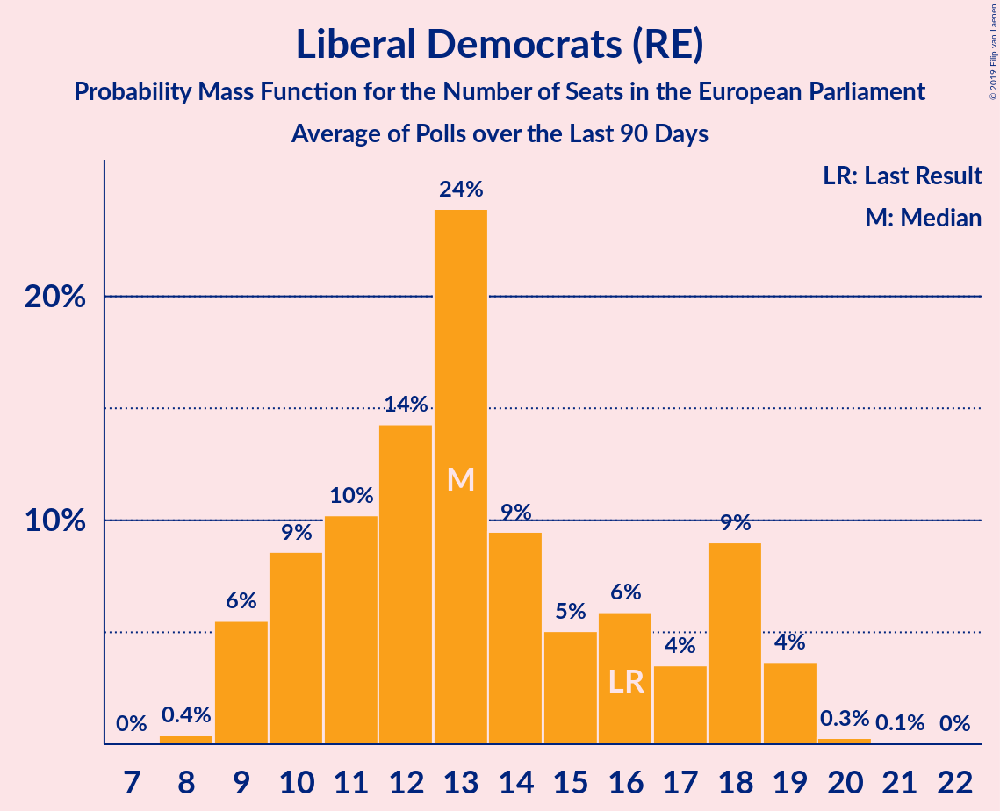

# Liberal Democrats (RE)

<a href="#voting-intentions">Voting Intentions</a> | <a href="#seats">Seats</a>

## Voting Intentions

Last result: **19.6%** (General Election of 23 May 2019)

### Confidence Intervals

| Period     | Polling firm/Commissioner(s) | Median | 80% Confidence Interval | 90% Confidence Interval | 95% Confidence Interval | 99% Confidence Interval |
|:----------:|:----------------:|:-----------:|:-----------------------:|:-----------------------:|:-----------------------:|:-----------------------:|
| N/A | [Poll Average](average.html) | 18.4% | 14.5–22.1% | 14.1–23.1% | 13.8–23.7% | 13.2–24.9% |
| [16–17 July 2019](2019-07-17-YouGov.html) | YouGov   The Times | 20.1% | 18.9–21.4% | 18.6–21.8% | 18.3–22.1% | 17.8–22.7% |
| [10–11 July 2019](2019-07-11-Survation.html) | Survation | 18.8% | 17.3–20.4% | 16.8–20.9% | 16.5–21.3% | 15.8–22.1% |
| [10–11 July 2019](2019-07-11-ComRes.html) | ComRes   The Express | 15.0% | 14.0–16.2% | 13.7–16.5% | 13.4–16.8% | 13.0–17.3% |
| [9–10 July 2019](2019-07-10-YouGov.html) | YouGov   The Times | 18.9% | 17.7–20.2% | 17.4–20.5% | 17.1–20.9% | 16.5–21.5% |
| [5–7 July 2019](2019-07-07-ComRes.html) | ComRes   Daily Telegraph | 16.2% | 15.2–17.3% | 14.9–17.6% | 14.7–17.9% | 14.2–18.4% |
| [3–5 July 2019](2019-07-05-Opinium.html) | Opinium   The Observer | 14.8% | 13.9–15.9% | 13.6–16.2% | 13.4–16.5% | 12.9–17.0% |
| [2–5 July 2019](2019-07-05-BMGResearch.html) | BMG Research   The Independent | 18.1% | 16.9–19.5% | 16.6–19.8% | 16.3–20.2% | 15.7–20.8% |
| [2–3 July 2019](2019-07-03-YouGov.html) | YouGov   The Times | 19.9% | 18.6–21.2% | 18.3–21.6% | 18.0–21.9% | 17.4–22.6% |
| [24–25 June 2019](2019-06-25-YouGov.html) | YouGov   The Times | 18.9% | 17.9–20.1% | 17.6–20.4% | 17.3–20.7% | 16.8–21.3% |
| [21–25 June 2019](2019-06-25-IpsosMORI.html) | Ipsos MORI | 22.3% | 20.7–24.1% | 20.3–24.6% | 19.9–25.0% | 19.2–25.8% |
| [19–20 June 2019](2019-06-20-Survation.html) | Survation   Daily Mail on Sunday | 17.8% | 16.8–18.9% | 16.4–19.3% | 16.2–19.5% | 15.7–20.1% |
| [19–20 June 2019](2019-06-20-Opinium.html) | Opinium   The Observer | 16.0% | 15.0–17.1% | 14.7–17.4% | 14.4–17.6% | 14.0–18.2% |
| [13–14 June 2019](2019-06-14-YouGov.html) | YouGov   The Sunday Times | 19.1% | 17.9–20.4% | 17.5–20.7% | 17.3–21.0% | 16.7–21.7% |
| [9–10 June 2019](2019-06-10-YouGov.html) | YouGov   The Times | 22.2% | 20.9–23.5% | 20.5–23.9% | 20.2–24.2% | 19.6–24.8% |
| [7–9 June 2019](2019-06-09-ComRes.html) | ComRes   Daily Telegraph | 16.8% | 15.8–17.9% | 15.5–18.2% | 15.2–18.5% | 14.8–19.1% |
| [4–7 June 2019](2019-06-07-BMGResearch.html) | BMG Research   The Independent | 17.0% | 15.8–18.3% | 15.5–18.6% | 15.2–18.9% | 14.6–19.6% |
| [4–6 June 2019](2019-06-06-YouGov.html) | YouGov   The Times | 19.9% | 18.6–21.2% | 18.3–21.6% | 18.0–21.9% | 17.4–22.6% |
| [28–30 May 2019](2019-05-30-Opinium.html) | Opinium   The Observer | 16.0% | 15.0–17.1% | 14.7–17.4% | 14.5–17.7% | 14.0–18.2% |
| [29–30 May 2019](2019-05-30-Deltapoll.html) | Deltapoll   The Mail on Sunday | 15.7% | 14.8–16.7% | 14.5–16.9% | 14.3–17.2% | 13.9–17.7% |
| [28–29 May 2019](2019-05-29-YouGov.html) | YouGov   The Times | 23.9% | 22.7–25.3% | 22.3–25.7% | 22.0–26.0% | 21.4–26.6% |

### Probability Mass Function

The following table shows the probability mass function per percentage block of voting intentions for the [poll average](average.html) for Liberal Democrats (RE).

| Voting Intentions | Probability | Accumulated | Special Marks |
|:-----------------:|:-----------:|:-----------:|:-------------:|
| 11.5–12.5% | 0% | 100% |  |
| 12.5–13.5% | 1.3% | 100% |  |
| 13.5–14.5% | 9% | 98.7% |  |
| 14.5–15.5% | 15% | 90% |  |
| 15.5–16.5% | 8% | 75% |  |
| 16.5–17.5% | 7% | 66% |  |
| 17.5–18.5% | 12% | 60% | Median |
| 18.5–19.5% | 14% | 48% |  |
| 19.5–20.5% | 12% | 35% | Last Result |
| 20.5–21.5% | 9% | 23% |  |
| 21.5–22.5% | 6% | 14% |  |
| 22.5–23.5% | 4% | 8% |  |
| 23.5–24.5% | 2% | 3% |  |
| 24.5–25.5% | 0.7% | 0.8% |  |
| 25.5–26.5% | 0.1% | 0.1% |  |
| 26.5–27.5% | 0% | 0% |  |

## Seats

Last result: **16** seats (General Election of 23 May 2019)

### Confidence Intervals

| Period     | Polling firm/Commissioner(s) | Median | 80% Confidence Interval | 90% Confidence Interval | 95% Confidence Interval | 99% Confidence Interval |
|:----------:|:----------------:|:------:|:-----------------------:|:-----------------------:|:-----------------------:|:-----------------------:|
| N/A | [Poll Average](average.html) | 13 | 8–16 | 8–18 | 8–19 | 6–21 |
| [16–17 July 2019](2019-07-17-YouGov.html) | YouGov   The Times | 14 | 13–14 | 13–16 | 13–16 | 13–16 |
| [10–11 July 2019](2019-07-11-Survation.html) | Survation | 13 | 11–14 | 11–14 | 10–14 | 9–15 |
| [10–11 July 2019](2019-07-11-ComRes.html) | ComRes   The Express | 8 | 8–11 | 6–12 | 6–12 | 6–13 |
| [9–10 July 2019](2019-07-10-YouGov.html) | YouGov   The Times | 12 | 10–13 | 10–14 | 10–15 | 10–15 |
| [5–7 July 2019](2019-07-07-ComRes.html) | ComRes   Daily Telegraph | 9 | 8–12 | 8–13 | 8–13 | 6–13 |
| [3–5 July 2019](2019-07-05-Opinium.html) | Opinium   The Observer | 8 | 8–11 | 8–11 | 8–11 | 6–11 |
| [2–5 July 2019](2019-07-05-BMGResearch.html) | BMG Research   The Independent | 14 | 11–14 | 11–14 | 10–14 | 9–15 |
| [2–3 July 2019](2019-07-03-YouGov.html) | YouGov   The Times | 13 | 12–15 | 11–15 | 11–16 | 10–17 |
| [24–25 June 2019](2019-06-25-YouGov.html) | YouGov   The Times | 12 | 10–15 | 10–15 | 10–15 | 10–16 |
| [21–25 June 2019](2019-06-25-IpsosMORI.html) | Ipsos MORI | 16 | 14–20 | 13–21 | 12–21 | 12–22 |
| [19–20 June 2019](2019-06-20-Survation.html) | Survation   Daily Mail on Sunday | 13 | 12–13 | 11–14 | 11–14 | 10–14 |
| [19–20 June 2019](2019-06-20-Opinium.html) | Opinium   The Observer | 10 | 9–13 | 9–13 | 9–13 | 8–14 |
| [13–14 June 2019](2019-06-14-YouGov.html) | YouGov   The Sunday Times | 14 | 11–15 | 11–16 | 10–17 | 10–17 |
| [9–10 June 2019](2019-06-10-YouGov.html) | YouGov   The Times | 18 | 17–18 | 16–18 | 16–18 | 15–19 |
| [7–9 June 2019](2019-06-09-ComRes.html) | ComRes   Daily Telegraph | 13 | 10–13 | 10–13 | 9–14 | 8–14 |
| [4–7 June 2019](2019-06-07-BMGResearch.html) | BMG Research   The Independent | 10 | 8–11 | 8–12 | 8–13 | 7–13 |
| [4–6 June 2019](2019-06-06-YouGov.html) | YouGov   The Times | 16 | 11–18 | 11–18 | 10–18 | 10–18 |
| [28–30 May 2019](2019-05-30-Opinium.html) | Opinium   The Observer | 10 | 9–10 | 9–11 | 9–12 | 8–13 |
| [29–30 May 2019](2019-05-30-Deltapoll.html) | Deltapoll   The Mail on Sunday | 10 | 9–11 | 9–12 | 9–12 | 9–13 |
| [28–29 May 2019](2019-05-29-YouGov.html) | YouGov   The Times | 18 | 17–19 | 17–19 | 17–20 | 16–21 |

### Probability Mass Function

The following table shows the probability mass function per seat for the [poll average](average.html) for Liberal Democrats (RE).

| Number of Seats | Probability | Accumulated | Special Marks |
|:---------------:|:-----------:|:-----------:|:-------------:|
| 6 | 1.2% | 100% |  |
| 7 | 0.5% | 98.8% |  |
| 8 | 17% | 98% |  |
| 9 | 5% | 81% |  |
| 10 | 6% | 76% |  |
| 11 | 7% | 70% |  |
| 12 | 8% | 64% |  |
| 13 | 16% | 56% | Median |
| 14 | 24% | 40% |  |
| 15 | 3% | 16% |  |
| 16 | 5% | 13% | Last Result |
| 17 | 2% | 8% |  |
| 18 | 3% | 6% |  |
| 19 | 2% | 4% |  |
| 20 | 0.9% | 2% |  |
| 21 | 0.8% | 0.9% |  |
| 22 | 0.1% | 0.1% |  |
| 23 | 0% | 0% |  |

