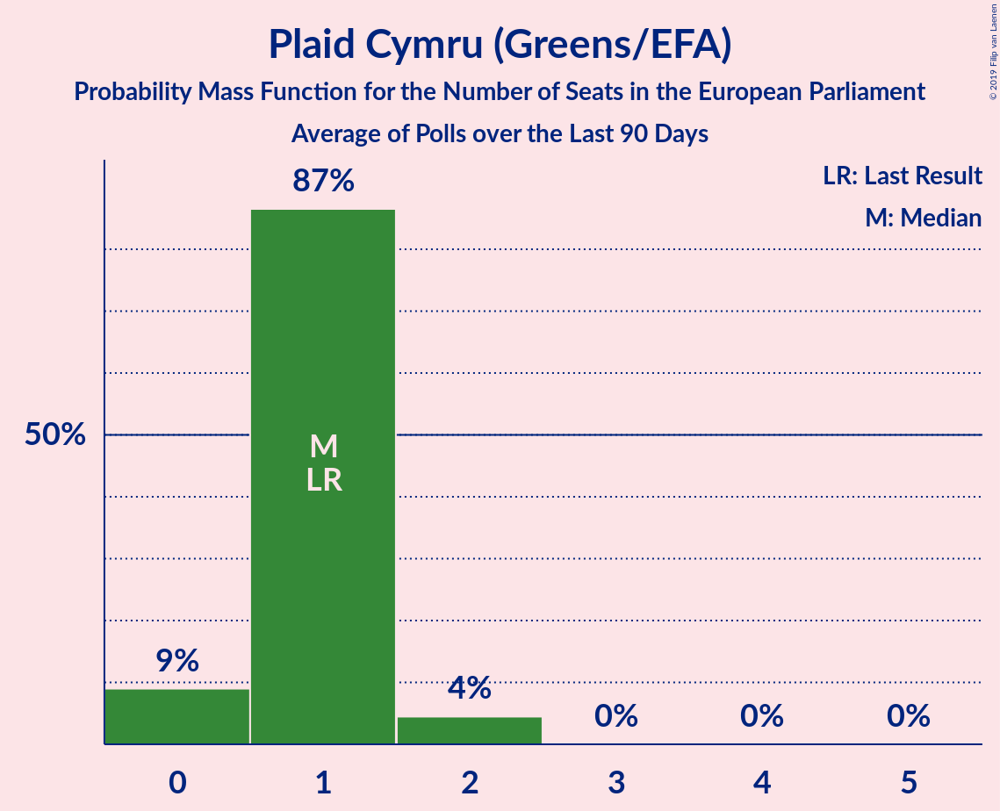

# Plaid Cymru (Greens/EFA)

<a href="#voting-intentions">Voting Intentions</a> | <a href="#seats">Seats</a>

## Voting Intentions

Last result: **1.0%** (General Election of 23 May 2019)

### Confidence Intervals

| Period     | Polling firm/Commissioner(s) | Median | 80% Confidence Interval | 90% Confidence Interval | 95% Confidence Interval | 99% Confidence Interval |
|:----------:|:----------------:|:-----------:|:-----------------------:|:-----------------------:|:-----------------------:|:-----------------------:|
| N/A | [Poll Average](average.html) | 0.3% | 0.2–1.1% | 0.1–1.3% | 0.1–1.4% | 0.1–1.7% |
| [10–11 December 2019](2019-12-11-Survation.html) | Survation | 1.0% | 0.8–1.3% | 0.7–1.4% | 0.7–1.5% | 0.6–1.7% |
| [10–11 December 2019](2019-12-11-Panelbase.html) | Panelbase | 0.3% | 0.2–0.4% | 0.1–0.5% | 0.1–0.5% | 0.1–0.6% |
| [10–11 December 2019](2019-12-11-Opinium.html) | Opinium | 0.3% | 0.2–0.4% | 0.2–0.5% | 0.1–0.5% | 0.1–0.6% |
| [9–11 December 2019](2019-12-11-KantarPublic.html) | Kantar Public | 0.2% | 0.2–0.4% | 0.1–0.5% | 0.1–0.5% | 0.1–0.6% |
| [9–11 December 2019](2019-12-11-IpsosMORI.html) | Ipsos MORI   Evening Standard | 0.0% | N/A | N/A | N/A | N/A |
| [9–11 December 2019](2019-12-11-Deltapoll.html) | Deltapoll | 0.2% | 0.1–0.4% | 0.1–0.5% | 0.1–0.6% | 0.0–0.7% |
| [6–11 December 2019](2019-12-11-BMGResearch.html) | BMG Research | 0.0% | N/A | N/A | N/A | N/A |
| [8–10 December 2019](2019-12-10-NumberCruncherPolitics.html) | Number Cruncher Politics   Bloomberg | 1.0% | 0.7–1.5% | 0.6–1.7% | 0.5–1.8% | 0.4–2.1% |
| [9–10 December 2019](2019-12-10-ComRes.html) | ComRes   Daily Telegraph | 0.0% | N/A | N/A | N/A | N/A |
| [6–9 December 2019](2019-12-09-ICMResearch.html) | ICM Research | 0.2% | 0.2–0.5% | 0.1–0.5% | 0.1–0.6% | 0.1–0.7% |
| [5–8 December 2019](2019-12-08-Qriously.html) | Qriously | 0.0% | N/A | N/A | N/A | N/A |
| [6–8 December 2019](2019-12-08-ComRes.html) | ComRes   Remain United | 0.2% | 0.2–0.4% | 0.2–0.4% | 0.1–0.4% | 0.1–0.5% |
| [5–7 December 2019](2019-12-07-Survation.html) | Survation   Good Morning Britain | 1.0% | 0.7–1.5% | 0.6–1.7% | 0.5–1.8% | 0.4–2.1% |
| [5–7 December 2019](2019-12-07-Deltapoll.html) | Deltapoll   The Mail on Sunday | 0.3% | 0.2–0.5% | 0.1–0.6% | 0.1–0.7% | 0.1–0.8% |
| [5–6 December 2019](2019-12-06-YouGov.html) | YouGov   The Sunday Times | 0.2% | 0.1–0.5% | 0.1–0.5% | 0.1–0.6% | 0.1–0.8% |
| [4–6 December 2019](2019-12-06-Panelbase.html) | Panelbase | 1.0% | 0.7–1.3% | 0.7–1.4% | 0.6–1.5% | 0.5–1.7% |
| [4–6 December 2019](2019-12-06-Opinium.html) | Opinium   The Observer | 0.2% | 0.2–0.5% | 0.1–0.5% | 0.1–0.6% | 0.1–0.7% |
| [4–6 December 2019](2019-12-06-BMGResearch.html) | BMG Research   The Independent | 0.3% | 0.2–0.5% | 0.1–0.6% | 0.1–0.7% | 0.1–0.8% |
| [4–5 December 2019](2019-12-05-ComRes.html) | ComRes   The Sunday Telegraph | 0.0% | N/A | N/A | N/A | N/A |
| [2–4 December 2019](2019-12-04-IpsosMORI.html) | Ipsos MORI   Evening Standard | 1.0% | 0.7–1.4% | 0.6–1.5% | 0.6–1.6% | 0.5–1.8% |
| [2–3 December 2019](2019-12-03-YouGov.html) | YouGov   The Times and Sky News | 0.2% | 0.1–0.5% | 0.1–0.5% | 0.1–0.6% | 0.1–0.7% |
| [2–3 December 2019](2019-12-03-ComRes.html) | ComRes   Daily Telegraph | 0.0% | N/A | N/A | N/A | N/A |
| [28 November–2 December 2019](2019-12-02-KantarPublic.html) | Kantar Public | 1.0% | 0.7–1.5% | 0.6–1.7% | 0.6–1.8% | 0.4–2.1% |
| [29 November–2 December 2019](2019-12-02-ICMResearch.html) | ICM Research | 0.2% | 0.2–0.5% | 0.1–0.5% | 0.1–0.6% | 0.1–0.7% |
| [26–30 November 2019](2019-11-30-Survation.html) | Survation   Good Morning Britain | 1.0% | 0.7–1.6% | 0.6–1.7% | 0.6–1.8% | 0.5–2.1% |
| [28–30 November 2019](2019-11-30-Deltapoll.html) | Deltapoll   The Mail on Sunday | 0.3% | 0.2–0.5% | 0.1–0.6% | 0.1–0.7% | 0.1–0.8% |
| [28–29 November 2019](2019-11-29-YouGov.html) | YouGov   The Sunday Times | 0.2% | 0.1–0.5% | 0.1–0.5% | 0.1–0.6% | 0.1–0.8% |
| [27–29 November 2019](2019-11-29-Opinium.html) | Opinium   The Observer | 0.2% | 0.2–0.5% | 0.1–0.5% | 0.1–0.6% | 0.1–0.7% |
| [27–28 November 2019](2019-11-28-Panelbase.html) | Panelbase | 0.2% | 0.2–0.5% | 0.1–0.5% | 0.1–0.6% | 0.1–0.7% |
| [27–28 November 2019](2019-11-28-ComRes.html) | ComRes   The Sunday Telegraph | 0.0% | N/A | N/A | N/A | N/A |
| [26–27 November 2019](2019-11-27-BMGResearch.html) | BMG Research   The Independent | 0.2% | 0.1–0.5% | 0.1–0.6% | 0.1–0.6% | 0.1–0.8% |
| [25–26 November 2019](2019-11-26-YouGov.html) | YouGov   The Times and Sky News | 0.2% | 0.1–0.5% | 0.1–0.5% | 0.1–0.6% | 0.1–0.8% |
| [25–26 November 2019](2019-11-26-ComRes.html) | ComRes   Daily Telegraph | 0.0% | N/A | N/A | N/A | N/A |
| [21–25 November 2019](2019-11-25-KantarPublic.html) | Kantar Public | 0.3% | 0.2–0.6% | 0.1–0.7% | 0.1–0.8% | 0.1–1.0% |
| [22–25 November 2019](2019-11-25-ICMResearch.html) | ICM Research | 1.0% | 0.8–1.4% | 0.7–1.4% | 0.6–1.5% | 0.5–1.7% |
| [20–23 November 2019](2019-11-23-Survation.html) | Survation   Good Morning Britain | 1.0% | 0.7–1.5% | 0.6–1.7% | 0.5–1.8% | 0.4–2.1% |
| [21–23 November 2019](2019-11-23-Deltapoll.html) | Deltapoll   The Mail on Sunday | 0.3% | 0.2–0.5% | 0.1–0.6% | 0.1–0.7% | 0.1–0.8% |
| [21–22 November 2019](2019-11-22-YouGov.html) | YouGov   The Sunday Times | 0.2% | 0.1–0.5% | 0.1–0.5% | 0.1–0.6% | 0.1–0.8% |
| [20–22 November 2019](2019-11-22-Panelbase.html) | Panelbase | 1.0% | 0.7–1.3% | 0.7–1.4% | 0.6–1.5% | 0.5–1.7% |
| [20–22 November 2019](2019-11-22-Opinium.html) | Opinium   The Observer | 0.2% | 0.2–0.5% | 0.1–0.5% | 0.1–0.6% | 0.1–0.7% |
| [20–21 November 2019](2019-11-21-ComRes.html) | ComRes   The Sunday Express | 0.0% | N/A | N/A | N/A | N/A |
| [19–21 November 2019](2019-11-21-BMGResearch.html) | BMG Research | 0.2% | 0.1–0.5% | 0.1–0.6% | 0.1–0.6% | 0.1–0.8% |
| [12–20 November 2019](2019-11-20-YouGov.html) | YouGov | 1.0% | 0.9–1.1% | 0.8–1.2% | 0.8–1.2% | 0.8–1.3% |
| [18–19 November 2019](2019-11-19-YouGov.html) | YouGov   The Times | 0.2% | 0.1–0.5% | 0.1–0.6% | 0.1–0.6% | 0.1–0.8% |
| [15–19 November 2019](2019-11-19-IpsosMORI.html) | Ipsos MORI   Evening Standard | 1.0% | 0.7–1.5% | 0.6–1.6% | 0.5–1.7% | 0.4–2.0% |
| [18–19 November 2019](2019-11-19-ComRes.html) | ComRes   Daily Telegraph | 0.0% | N/A | N/A | N/A | N/A |
| [14–18 November 2019](2019-11-18-KantarPublic.html) | Kantar Public | 1.0% | 0.7–1.5% | 0.6–1.7% | 0.6–1.8% | 0.5–2.0% |
| [15–18 November 2019](2019-11-18-ICMResearch.html) | ICM Research | 0.2% | 0.2–0.5% | 0.1–0.5% | 0.1–0.6% | 0.1–0.7% |
| [14–16 November 2019](2019-11-16-Survation.html) | Survation | 1.0% | 0.7–1.5% | 0.6–1.7% | 0.5–1.8% | 0.4–2.1% |
| [10–16 November 2019](2019-11-16-Deltapoll.html) | Deltapoll   The Mail on Sunday | 0.0% | N/A | N/A | N/A | N/A |
| [14–15 November 2019](2019-11-15-YouGov.html) | YouGov   The Sunday Times | 0.2% | 0.1–0.5% | 0.1–0.5% | 0.1–0.6% | 0.1–0.8% |
| [13–15 November 2019](2019-11-15-Opinium.html) | Opinium   The Observer | 1.0% | 0.8–1.3% | 0.7–1.4% | 0.6–1.5% | 0.5–1.7% |
| [9–15 November 2019](2019-11-15-BMGResearch.html) | BMG Research | 0.0% | N/A | N/A | N/A | N/A |
| [13–14 November 2019](2019-11-14-Panelbase.html) | Panelbase | 0.0% | N/A | N/A | N/A | N/A |
| [13–14 November 2019](2019-11-14-ComRes.html) | ComRes   The Sunday Telegraph | 0.0% | N/A | N/A | N/A | N/A |
| [11–12 November 2019](2019-11-12-YouGov.html) | YouGov   The Times and Sky News | 1.0% | 0.7–1.4% | 0.7–1.5% | 0.6–1.6% | 0.5–1.8% |
| [11–12 November 2019](2019-11-12-ComRes.html) | ComRes   Daily Telegraph | 0.2% | 0.2–0.5% | 0.1–0.5% | 0.1–0.6% | 0.1–0.7% |
| [7–11 November 2019](2019-11-11-KantarPublic.html) | Kantar Public | 1.0% | 0.7–1.5% | 0.7–1.7% | 0.6–1.8% | 0.5–2.1% |
| [8–11 November 2019](2019-11-11-ICMResearch.html) | ICM Research | 1.0% | 0.7–1.3% | 0.7–1.4% | 0.6–1.5% | 0.5–1.7% |
| [8–10 November 2019](2019-11-10-ComRes.html) | ComRes   Britain Elects | 0.0% | N/A | N/A | N/A | N/A |
| [6–9 November 2019](2019-11-09-Deltapoll.html) | Deltapoll   The Mail on Sunday | 0.3% | 0.2–0.5% | 0.1–0.6% | 0.1–0.7% | 0.1–0.8% |
| [7–8 November 2019](2019-11-08-YouGov.html) | YouGov   The Sunday Times and Sky News | 1.0% | 0.8–1.4% | 0.7–1.5% | 0.6–1.6% | 0.5–1.8% |
| [6–8 November 2019](2019-11-08-Survation.html) | Survation | 1.0% | 0.7–1.3% | 0.7–1.4% | 0.6–1.5% | 0.5–1.7% |
| [6–8 November 2019](2019-11-08-Panelbase.html) | Panelbase | 0.0% | N/A | N/A | N/A | N/A |
| [6–8 November 2019](2019-11-08-Opinium.html) | Opinium   The Observer | 1.0% | 0.8–1.4% | 0.7–1.5% | 0.6–1.5% | 0.5–1.7% |
| [5–8 November 2019](2019-11-08-BMGResearch.html) | BMG Research   The Independent | 0.3% | 0.2–0.5% | 0.1–0.6% | 0.1–0.7% | 0.1–0.8% |
| [5–6 November 2019](2019-11-06-YouGov.html) | YouGov   The Times and Sky News | 1.0% | 0.8–1.4% | 0.7–1.5% | 0.6–1.6% | 0.5–1.8% |
| [30 October–5 November 2019](2019-11-05-ComRes.html) | ComRes   Remain United | 1.0% | 0.8–1.2% | 0.8–1.2% | 0.8–1.3% | 0.7–1.4% |
| [1–4 November 2019](2019-11-04-YouGov.html) | YouGov   The Times | 1.0% | 0.8–1.3% | 0.8–1.3% | 0.7–1.4% | 0.6–1.6% |
| [1–4 November 2019](2019-11-04-ICMResearch.html) | ICM Research   Reuters | 0.2% | 0.2–0.5% | 0.1–0.5% | 0.1–0.6% | 0.1–0.7% |
| [31 October–2 November 2019](2019-11-02-Deltapoll.html) | Deltapoll   The Mail on Sunday | 1.0% | 0.7–1.4% | 0.7–1.5% | 0.6–1.6% | 0.5–1.9% |
| [30 October–1 November 2019](2019-11-01-YouGov.html) | YouGov   The Sunday Times | 1.0% | 0.7–1.4% | 0.7–1.5% | 0.6–1.6% | 0.5–1.8% |
| [30 October–1 November 2019](2019-11-01-Opinium.html) | Opinium   The Observer | 1.0% | 0.8–1.4% | 0.7–1.4% | 0.6–1.5% | 0.5–1.7% |
| [30–31 October 2019](2019-10-31-Panelbase.html) | Panelbase | 1.0% | 0.7–1.5% | 0.6–1.7% | 0.5–1.8% | 0.4–2.1% |
| [30–31 October 2019](2019-10-31-ORB.html) | ORB   The Telegraph | 0.2% | 0.2–0.5% | 0.1–0.5% | 0.1–0.6% | 0.1–0.7% |
| [30–31 October 2019](2019-10-31-ComRes.html) | ComRes   Sunday Express | 0.3% | 0.2–0.5% | 0.1–0.6% | 0.1–0.7% | 0.1–0.8% |
| [29–30 October 2019](2019-10-30-YouGov.html) | YouGov   The Times | 0.2% | 0.1–0.5% | 0.1–0.5% | 0.1–0.6% | 0.1–0.7% |
| [29–30 October 2019](2019-10-30-Survation.html) | Survation | 1.0% | 0.7–1.5% | 0.6–1.7% | 0.5–1.8% | 0.4–2.1% |
| [17–28 October 2019](2019-10-28-YouGov.html) | YouGov | 1.0% | 0.9–1.1% | 0.8–1.2% | 0.8–1.2% | 0.8–1.2% |
| [25–28 October 2019](2019-10-28-IpsosMORI.html) | Ipsos MORI | 1.0% | 0.7–1.5% | 0.6–1.7% | 0.5–1.8% | 0.4–2.1% |
| [24–25 October 2019](2019-10-25-YouGov.html) | YouGov | 1.0% | 0.8–1.4% | 0.7–1.5% | 0.6–1.6% | 0.5–1.8% |
| [23–25 October 2019](2019-10-25-Opinium.html) | Opinium   The Observer | 0.2% | 0.2–0.5% | 0.1–0.5% | 0.1–0.6% | 0.1–0.7% |
| [20–21 October 2019](2019-10-21-YouGov.html) | YouGov   The Times | 1.0% | 0.7–1.4% | 0.7–1.5% | 0.6–1.6% | 0.5–1.8% |
| [18–21 October 2019](2019-10-21-Deltapoll.html) | Deltapoll | 1.0% | 0.8–1.3% | 0.7–1.4% | 0.6–1.5% | 0.5–1.7% |
| [17–18 October 2019](2019-10-18-Survation.html) | Survation   Daily Mail | 1.0% | 0.7–1.5% | 0.6–1.7% | 0.5–1.8% | 0.4–2.1% |
| [17–18 October 2019](2019-10-18-Panelbase.html) | Panelbase | 0.3% | 0.2–0.7% | 0.1–0.8% | 0.1–0.9% | 0.1–1.1% |
| [15–17 October 2019](2019-10-17-Opinium.html) | Opinium   The Observer | 1.0% | 0.8–1.4% | 0.7–1.5% | 0.6–1.5% | 0.5–1.7% |
| [16–17 October 2019](2019-10-17-ComRes.html) | ComRes   Britain Elects | 1.0% | 0.7–1.3% | 0.7–1.4% | 0.6–1.5% | 0.5–1.7% |
| [14–15 October 2019](2019-10-15-YouGov.html) | YouGov   The Times | 1.0% | 0.7–1.4% | 0.7–1.5% | 0.6–1.6% | 0.5–1.8% |
| [10–15 October 2019](2019-10-15-KantarPublic.html) | Kantar Public | 1.0% | 0.7–1.5% | 0.6–1.6% | 0.6–1.8% | 0.5–2.0% |
| [9–11 October 2019](2019-10-11-Panelbase.html) | Panelbase   The Sunday Times | 0.0% | N/A | N/A | N/A | N/A |
| [9–10 October 2019](2019-10-10-ComRes.html) | ComRes   Daily Express | 0.0% | N/A | N/A | N/A | N/A |
| [8–9 October 2019](2019-10-09-YouGov.html) | YouGov   The Times | 1.0% | 0.7–1.4% | 0.7–1.5% | 0.6–1.6% | 0.5–1.8% |
| [4–6 October 2019](2019-10-06-ComRes.html) | ComRes   Daily Telegraph | 1.0% | 0.8–1.4% | 0.7–1.4% | 0.6–1.5% | 0.5–1.7% |
| [3–4 October 2019](2019-10-04-Opinium.html) | Opinium   The Observer | 0.2% | 0.2–0.5% | 0.1–0.5% | 0.1–0.6% | 0.1–0.7% |
| [1–4 October 2019](2019-10-04-BMGResearch.html) | BMG Research   The Independent | 1.0% | 0.7–1.4% | 0.7–1.5% | 0.6–1.6% | 0.5–1.9% |
| [30 September–1 October 2019](2019-10-01-YouGov.html) | YouGov   The Times | 1.0% | 0.7–1.4% | 0.7–1.5% | 0.6–1.6% | 0.5–1.8% |
| [26–27 September 2019](2019-09-27-YouGov.html) | YouGov   The Sunday Times | 1.0% | 0.7–1.4% | 0.7–1.5% | 0.6–1.6% | 0.5–1.8% |
| [25–27 September 2019](2019-09-27-Opinium.html) | Opinium   The Observer | 1.0% | 0.8–1.4% | 0.7–1.4% | 0.6–1.5% | 0.5–1.7% |
| [24–25 September 2019](2019-09-25-YouGov.html) | YouGov   The Times | 1.0% | 0.7–1.4% | 0.7–1.5% | 0.6–1.6% | 0.5–1.8% |
| [25 September 2019](2019-09-25-Survation.html) | Survation   Daily Mail | 0.0% | N/A | N/A | N/A | N/A |
| [24 September 2019](2019-09-24-ComRes.html) | ComRes   Daily Telegraph | 1.1% | 0.8–1.6% | 0.7–1.8% | 0.6–1.9% | 0.5–2.2% |
| [19–20 September 2019](2019-09-20-YouGov.html) | YouGov   People's Vote | 0.2% | 0.2–0.5% | 0.1–0.5% | 0.1–0.6% | 0.1–0.7% |
| [19–20 September 2019](2019-09-20-Opinium.html) | Opinium   The Observer | 1.0% | 0.8–1.4% | 0.7–1.4% | 0.6–1.5% | 0.5–1.7% |
| [18–19 September 2019](2019-09-19-ComRes.html) | ComRes   Britain Elects | 0.2% | 0.2–0.5% | 0.1–0.5% | 0.1–0.6% | 0.1–0.7% |
| [17–18 September 2019](2019-09-18-YouGov.html) | YouGov   The Times | 1.0% | 0.7–1.4% | 0.7–1.5% | 0.6–1.6% | 0.5–1.8% |
| [13–16 September 2019](2019-09-16-IpsosMORI.html) | Ipsos MORI   Evening Standard | 0.9% | 0.6–1.4% | 0.5–1.6% | 0.5–1.7% | 0.4–2.0% |
| [12–15 September 2019](2019-09-15-ComRes.html) | ComRes   Sunday Express | 0.0% | N/A | N/A | N/A | N/A |
| [11–13 September 2019](2019-09-13-Opinium.html) | Opinium   The Observer | 1.0% | 0.8–1.4% | 0.7–1.4% | 0.6–1.5% | 0.5–1.7% |
| [9–10 September 2019](2019-09-10-YouGov.html) | YouGov   The Times | 0.2% | 0.1–0.5% | 0.1–0.5% | 0.1–0.6% | 0.1–0.8% |
| [5–9 September 2019](2019-09-09-KantarPublic.html) | Kantar Public | 1.0% | 0.7–1.4% | 0.6–1.6% | 0.5–1.7% | 0.4–2.0% |
| [6–8 September 2019](2019-09-08-ComRes.html) | ComRes   Daily Telegraph | 1.0% | 0.8–1.3% | 0.7–1.4% | 0.6–1.5% | 0.5–1.7% |
| [5–7 September 2019](2019-09-07-Deltapoll.html) | Deltapoll   The Sun on Sunday | 1.0% | 0.7–1.3% | 0.7–1.4% | 0.6–1.5% | 0.5–1.7% |
| [5–6 September 2019](2019-09-06-YouGov.html) | YouGov   The Sunday Times | 0.2% | 0.1–0.5% | 0.1–0.5% | 0.1–0.6% | 0.1–0.8% |
| [5–6 September 2019](2019-09-06-Survation.html) | Survation   Daily Mail | 1.0% | 0.7–1.5% | 0.6–1.7% | 0.5–1.8% | 0.4–2.1% |
| [5–6 September 2019](2019-09-06-Panelbase.html) | Panelbase | 0.3% | 0.2–0.7% | 0.1–0.8% | 0.1–0.9% | 0.1–1.1% |
| [4–6 September 2019](2019-09-06-Opinium.html) | Opinium   The Observer | 0.2% | 0.2–0.5% | 0.1–0.5% | 0.1–0.6% | 0.1–0.7% |
| [4–6 September 2019](2019-09-06-ComRes.html) | ComRes   Britain Elects | 1.0% | 0.8–1.4% | 0.7–1.4% | 0.6–1.5% | 0.5–1.7% |
| [3–6 September 2019](2019-09-06-BMGResearch.html) | BMG Research   The Independent | 0.3% | 0.2–0.5% | 0.1–0.6% | 0.1–0.7% | 0.1–0.8% |
| [3–4 September 2019](2019-09-04-HanburyStrategy.html) | Hanbury Strategy | 1.0% | 0.7–1.6% | 0.6–1.7% | 0.5–1.8% | 0.4–2.1% |
| [2–3 September 2019](2019-09-03-YouGov.html) | YouGov   The Times | 1.0% | 0.7–1.4% | 0.7–1.5% | 0.6–1.6% | 0.5–1.8% |
| [29–31 August 2019](2019-08-31-Deltapoll.html) | Deltapoll   The Mail on Sunday | 1.0% | 0.7–1.3% | 0.7–1.4% | 0.6–1.5% | 0.5–1.7% |
| [29–30 August 2019](2019-08-30-Survation.html) | Survation   Daily Mail | 1.0% | 0.7–1.5% | 0.6–1.7% | 0.5–1.8% | 0.4–2.1% |
| [28–29 August 2019](2019-08-29-YouGov.html) | YouGov | 1.0% | 0.7–1.3% | 0.7–1.4% | 0.6–1.5% | 0.5–1.7% |
| [27–28 August 2019](2019-08-28-YouGov.html) | YouGov   The Times | 1.0% | 0.8–1.4% | 0.7–1.4% | 0.6–1.5% | 0.5–1.7% |
| [22–23 August 2019](2019-08-23-YouGov.html) | YouGov   The Sunday Times | 1.0% | 0.8–1.3% | 0.7–1.4% | 0.6–1.5% | 0.5–1.7% |
| [21–23 August 2019](2019-08-23-Opinium.html) | Opinium   The Observer | 1.0% | 0.8–1.4% | 0.7–1.4% | 0.6–1.5% | 0.5–1.7% |
| [20–21 August 2019](2019-08-21-YouGov.html) | YouGov   The Times | 1.0% | 0.7–1.4% | 0.7–1.5% | 0.6–1.6% | 0.5–1.8% |
| [15–19 August 2019](2019-08-19-KantarPublic.html) | Kantar Public | 0.3% | 0.2–0.6% | 0.1–0.7% | 0.1–0.8% | 0.0–1.0% |
| [13–14 August 2019](2019-08-14-YouGov.html) | YouGov   The Times | 1.0% | 0.7–1.4% | 0.7–1.5% | 0.6–1.6% | 0.5–1.8% |
| [7–12 August 2019](2019-08-12-BMGResearch.html) | BMG Research   The Independent | 1.0% | 0.7–1.4% | 0.7–1.5% | 0.6–1.6% | 0.5–1.8% |
| [6–11 August 2019](2019-08-11-Survation.html) | Survation | 0.2% | 0.2–0.5% | 0.1–0.5% | 0.1–0.6% | 0.1–0.7% |
| [9–11 August 2019](2019-08-11-ComRes.html) | ComRes   Daily Telegraph | 0.2% | 0.2–0.5% | 0.1–0.5% | 0.1–0.6% | 0.1–0.7% |
| [8–9 August 2019](2019-08-09-Opinium.html) | Opinium   The Observer | 1.0% | 0.8–1.4% | 0.7–1.4% | 0.6–1.5% | 0.5–1.7% |
| [5–6 August 2019](2019-08-06-YouGov.html) | YouGov   The Times | 0.2% | 0.1–0.5% | 0.1–0.6% | 0.1–0.6% | 0.1–0.8% |
| [29–30 July 2019](2019-07-30-YouGov.html) | YouGov   The Times | 1.0% | 0.8–1.4% | 0.7–1.5% | 0.7–1.6% | 0.6–1.7% |
| [26–30 July 2019](2019-07-30-IpsosMORI.html) | Ipsos MORI | 1.0% | 0.7–1.5% | 0.6–1.7% | 0.5–1.8% | 0.4–2.1% |
| [26–28 July 2019](2019-07-28-ComRes.html) | ComRes   Britain Elects | 1.0% | 0.8–1.4% | 0.7–1.4% | 0.6–1.5% | 0.5–1.7% |
| [25–27 July 2019](2019-07-27-Deltapoll.html) | Deltapoll   The Mail on Sunday | 1.0% | 0.8–1.4% | 0.7–1.5% | 0.6–1.5% | 0.5–1.7% |
| [25–26 July 2019](2019-07-26-YouGov.html) | YouGov   The Sunday Times | 1.0% | 0.7–1.4% | 0.7–1.5% | 0.6–1.6% | 0.5–1.8% |
| [24–26 July 2019](2019-07-26-Opinium.html) | Opinium   The Observer | 1.0% | 0.8–1.4% | 0.7–1.4% | 0.6–1.5% | 0.5–1.7% |
| [24–25 July 2019](2019-07-25-ComRes.html) | ComRes   Sunday Express | 1.0% | 0.7–1.3% | 0.7–1.4% | 0.6–1.5% | 0.5–1.7% |
| [23–24 July 2019](2019-07-24-YouGov.html) | YouGov   The Times | 1.0% | 0.7–1.4% | 0.7–1.5% | 0.6–1.6% | 0.5–1.8% |
| [16–17 July 2019](2019-07-17-YouGov.html) | YouGov   The Times | 1.0% | 0.8–1.4% | 0.7–1.5% | 0.6–1.6% | 0.5–1.8% |
| [15–16 July 2019](2019-07-16-ComRes.html) | ComRes | 0.2% | 0.2–0.5% | 0.1–0.5% | 0.1–0.6% | 0.1–0.7% |
| [10–11 July 2019](2019-07-11-Survation.html) | Survation | 1.0% | 0.7–1.5% | 0.6–1.7% | 0.5–1.8% | 0.4–2.1% |
| [10–11 July 2019](2019-07-11-ComRes.html) | ComRes   The Express | 1.0% | 0.8–1.4% | 0.7–1.5% | 0.6–1.6% | 0.5–1.8% |
| [9–10 July 2019](2019-07-10-YouGov.html) | YouGov   The Times | 1.0% | 0.8–1.4% | 0.7–1.5% | 0.6–1.6% | 0.5–1.8% |
| [5–7 July 2019](2019-07-07-ComRes.html) | ComRes   Daily Telegraph | 0.2% | 0.2–0.5% | 0.1–0.5% | 0.1–0.6% | 0.1–0.7% |
| [3–5 July 2019](2019-07-05-Opinium.html) | Opinium   The Observer | 1.0% | 0.8–1.4% | 0.7–1.4% | 0.6–1.5% | 0.5–1.7% |
| [2–5 July 2019](2019-07-05-BMGResearch.html) | BMG Research   The Independent | 1.0% | 0.7–1.4% | 0.7–1.5% | 0.6–1.6% | 0.5–1.8% |
| [2–3 July 2019](2019-07-03-YouGov.html) | YouGov   The Times | 1.0% | 0.7–1.4% | 0.7–1.5% | 0.6–1.6% | 0.5–1.8% |
| [24–25 June 2019](2019-06-25-YouGov.html) | YouGov   The Times | 1.0% | 0.8–1.4% | 0.7–1.5% | 0.7–1.6% | 0.6–1.8% |
| [21–25 June 2019](2019-06-25-IpsosMORI.html) | Ipsos MORI | 1.1% | 0.7–1.6% | 0.7–1.8% | 0.6–1.9% | 0.5–2.2% |
| [19–20 June 2019](2019-06-20-Survation.html) | Survation   Daily Mail on Sunday | 1.0% | 0.8–1.3% | 0.7–1.4% | 0.6–1.5% | 0.5–1.7% |
| [19–20 June 2019](2019-06-20-Opinium.html) | Opinium   The Observer | 1.0% | 0.8–1.4% | 0.7–1.4% | 0.6–1.5% | 0.5–1.7% |
| [13–14 June 2019](2019-06-14-YouGov.html) | YouGov   The Sunday Times | 1.0% | 0.8–1.4% | 0.7–1.5% | 0.6–1.6% | 0.5–1.8% |
| [9–10 June 2019](2019-06-10-YouGov.html) | YouGov   The Times | 1.0% | 0.7–1.4% | 0.7–1.5% | 0.6–1.6% | 0.5–1.8% |
| [7–9 June 2019](2019-06-09-ComRes.html) | ComRes   Daily Telegraph | 1.0% | 0.8–1.3% | 0.7–1.4% | 0.6–1.5% | 0.5–1.7% |
| [4–7 June 2019](2019-06-07-BMGResearch.html) | BMG Research   The Independent | 1.0% | 0.7–1.4% | 0.7–1.5% | 0.6–1.6% | 0.5–1.8% |
| [4–6 June 2019](2019-06-06-YouGov.html) | YouGov   The Times | 0.3% | 0.2–0.5% | 0.1–0.6% | 0.1–0.7% | 0.1–0.8% |
| [28–30 May 2019](2019-05-30-Opinium.html) | Opinium   The Observer | 1.0% | 0.8–1.4% | 0.7–1.4% | 0.6–1.5% | 0.5–1.7% |
| [29–30 May 2019](2019-05-30-Deltapoll.html) | Deltapoll   The Mail on Sunday | 1.0% | 0.8–1.3% | 0.7–1.4% | 0.7–1.5% | 0.6–1.6% |
| [28–29 May 2019](2019-05-29-YouGov.html) | YouGov   The Times | 1.3% | 1.0–1.7% | 0.9–1.8% | 0.9–2.0% | 0.7–2.2% |

### Probability Mass Function

The following table shows the probability mass function per percentage block of voting intentions for the [poll average](average.html) for Plaid Cymru (Greens/EFA).

| Voting Intentions | Probability | Accumulated | Special Marks |
|:-----------------:|:-----------:|:-----------:|:-------------:|
| 0.0–0.5% | 73% | 100% | Median |
| 0.5–1.5% | 25% | 27% | Last Result |
| 1.5–2.5% | 1.2% | 1.2% |  |
| 2.5–3.5% | 0% | 0% |  |

## Seats

Last result: **1** seats (General Election of 23 May 2019)

### Confidence Intervals

| Period     | Polling firm/Commissioner(s) | Median | 80% Confidence Interval | 90% Confidence Interval | 95% Confidence Interval | 99% Confidence Interval |
|:----------:|:----------------:|:------:|:-----------------------:|:-----------------------:|:-----------------------:|:-----------------------:|
| N/A | [Poll Average](average.html) | 0 | 0–1 | 0–1 | 0–1 | 0–1 |
| [10–11 December 2019](2019-12-11-Survation.html) | Survation | 1 | 0–1 | 0–1 | 0–1 | 0–1 |
| [10–11 December 2019](2019-12-11-Panelbase.html) | Panelbase | 0 | 0 | 0 | 0 | 0 |
| [10–11 December 2019](2019-12-11-Opinium.html) | Opinium | 0 | 0 | 0 | 0 | 0 |
| [9–11 December 2019](2019-12-11-KantarPublic.html) | Kantar Public | 0 | 0 | 0 | 0 | 0 |
| [9–11 December 2019](2019-12-11-IpsosMORI.html) | Ipsos MORI   Evening Standard |  |  |  |  |  |
| [9–11 December 2019](2019-12-11-Deltapoll.html) | Deltapoll | 0 | 0 | 0 | 0 | 0 |
| [6–11 December 2019](2019-12-11-BMGResearch.html) | BMG Research |  |  |  |  |  |
| [8–10 December 2019](2019-12-10-NumberCruncherPolitics.html) | Number Cruncher Politics   Bloomberg | 1 | 0–1 | 0–1 | 0–2 | 0–2 |
| [9–10 December 2019](2019-12-10-ComRes.html) | ComRes   Daily Telegraph |  |  |  |  |  |
| [6–9 December 2019](2019-12-09-ICMResearch.html) | ICM Research | 0 | 0 | 0 | 0 | 0 |
| [5–8 December 2019](2019-12-08-Qriously.html) | Qriously |  |  |  |  |  |
| [6–8 December 2019](2019-12-08-ComRes.html) | ComRes   Remain United | 0 | 0 | 0 | 0 | 0 |
| [5–7 December 2019](2019-12-07-Survation.html) | Survation   Good Morning Britain | 1 | 0–1 | 0–1 | 0–2 | 0–2 |
| [5–7 December 2019](2019-12-07-Deltapoll.html) | Deltapoll   The Mail on Sunday | 0 | 0 | 0 | 0 | 0–1 |
| [5–6 December 2019](2019-12-06-YouGov.html) | YouGov   The Sunday Times | 0 | 0 | 0 | 0 | 0 |
| [4–6 December 2019](2019-12-06-Panelbase.html) | Panelbase | 1 | 0–1 | 0–1 | 0–1 | 0–1 |
| [4–6 December 2019](2019-12-06-Opinium.html) | Opinium   The Observer | 0 | 0 | 0 | 0 | 0 |
| [4–6 December 2019](2019-12-06-BMGResearch.html) | BMG Research   The Independent | 0 | 0 | 0 | 0–1 | 0–1 |
| [4–5 December 2019](2019-12-05-ComRes.html) | ComRes   The Sunday Telegraph |  |  |  |  |  |
| [2–4 December 2019](2019-12-04-IpsosMORI.html) | Ipsos MORI   Evening Standard | 1 | 0–1 | 0–1 | 0–1 | 0–2 |
| [2–3 December 2019](2019-12-03-YouGov.html) | YouGov   The Times and Sky News | 0 | 0 | 0 | 0 | 0 |
| [2–3 December 2019](2019-12-03-ComRes.html) | ComRes   Daily Telegraph |  |  |  |  |  |
| [28 November–2 December 2019](2019-12-02-KantarPublic.html) | Kantar Public | 1 | 0–1 | 0–1 | 0–2 | 0–2 |
| [29 November–2 December 2019](2019-12-02-ICMResearch.html) | ICM Research | 0 | 0 | 0 | 0 | 0 |
| [26–30 November 2019](2019-11-30-Survation.html) | Survation   Good Morning Britain | 1 | 0–1 | 0–1 | 0–2 | 0–2 |
| [28–30 November 2019](2019-11-30-Deltapoll.html) | Deltapoll   The Mail on Sunday | 0 | 0 | 0 | 0 | 0 |
| [28–29 November 2019](2019-11-29-YouGov.html) | YouGov   The Sunday Times | 0 | 0 | 0 | 0 | 0 |
| [27–29 November 2019](2019-11-29-Opinium.html) | Opinium   The Observer | 0 | 0 | 0 | 0 | 0 |
| [27–28 November 2019](2019-11-28-Panelbase.html) | Panelbase | 0 | 0 | 0 | 0 | 0 |
| [27–28 November 2019](2019-11-28-ComRes.html) | ComRes   The Sunday Telegraph |  |  |  |  |  |
| [26–27 November 2019](2019-11-27-BMGResearch.html) | BMG Research   The Independent | 0 | 0 | 0 | 0 | 0–1 |
| [25–26 November 2019](2019-11-26-YouGov.html) | YouGov   The Times and Sky News | 0 | 0 | 0 | 0 | 0 |
| [25–26 November 2019](2019-11-26-ComRes.html) | ComRes   Daily Telegraph |  |  |  |  |  |
| [21–25 November 2019](2019-11-25-KantarPublic.html) | Kantar Public | 0 | 0 | 0 | 0–1 | 0–1 |
| [22–25 November 2019](2019-11-25-ICMResearch.html) | ICM Research | 1 | 1 | 0–1 | 0–1 | 0–1 |
| [20–23 November 2019](2019-11-23-Survation.html) | Survation   Good Morning Britain | 1 | 0–1 | 0–2 | 0–2 | 0–2 |
| [21–23 November 2019](2019-11-23-Deltapoll.html) | Deltapoll   The Mail on Sunday | 0 | 0 | 0 | 0 | 0–1 |
| [21–22 November 2019](2019-11-22-YouGov.html) | YouGov   The Sunday Times | 0 | 0 | 0 | 0 | 0 |
| [20–22 November 2019](2019-11-22-Panelbase.html) | Panelbase | 1 | 1 | 0–1 | 0–1 | 0–1 |
| [20–22 November 2019](2019-11-22-Opinium.html) | Opinium   The Observer | 0 | 0 | 0 | 0 | 0–1 |
| [20–21 November 2019](2019-11-21-ComRes.html) | ComRes   The Sunday Express |  |  |  |  |  |
| [19–21 November 2019](2019-11-21-BMGResearch.html) | BMG Research | 0 | 0 | 0 | 0 | 0–1 |
| [12–20 November 2019](2019-11-20-YouGov.html) | YouGov | 1 | 1 | 1 | 1 | 1 |
| [18–19 November 2019](2019-11-19-YouGov.html) | YouGov   The Times | 0 | 0 | 0 | 0 | 0–1 |
| [15–19 November 2019](2019-11-19-IpsosMORI.html) | Ipsos MORI   Evening Standard | 1 | 0–1 | 0–2 | 0–2 | 0–2 |
| [18–19 November 2019](2019-11-19-ComRes.html) | ComRes   Daily Telegraph |  |  |  |  |  |
| [14–18 November 2019](2019-11-18-KantarPublic.html) | Kantar Public | 1 | 0–1 | 0–2 | 0–2 | 0–2 |
| [15–18 November 2019](2019-11-18-ICMResearch.html) | ICM Research | 0 | 0 | 0 | 0 | 0 |
| [14–16 November 2019](2019-11-16-Survation.html) | Survation | 1 | 0–1 | 0–2 | 0–2 | 0–2 |
| [10–16 November 2019](2019-11-16-Deltapoll.html) | Deltapoll   The Mail on Sunday |  |  |  |  |  |
| [14–15 November 2019](2019-11-15-YouGov.html) | YouGov   The Sunday Times | 0 | 0 | 0 | 0 | 0–1 |
| [13–15 November 2019](2019-11-15-Opinium.html) | Opinium   The Observer | 1 | 1 | 1 | 0–1 | 0–2 |
| [9–15 November 2019](2019-11-15-BMGResearch.html) | BMG Research |  |  |  |  |  |
| [13–14 November 2019](2019-11-14-Panelbase.html) | Panelbase |  |  |  |  |  |
| [13–14 November 2019](2019-11-14-ComRes.html) | ComRes   The Sunday Telegraph |  |  |  |  |  |
| [11–12 November 2019](2019-11-12-YouGov.html) | YouGov   The Times and Sky News | 1 | 0–1 | 0–1 | 0–2 | 0–2 |
| [11–12 November 2019](2019-11-12-ComRes.html) | ComRes   Daily Telegraph | 0 | 0 | 0–1 | 0–1 | 0–1 |
| [7–11 November 2019](2019-11-11-KantarPublic.html) | Kantar Public | 1 | 1–2 | 1–2 | 1–2 | 1–2 |
| [8–11 November 2019](2019-11-11-ICMResearch.html) | ICM Research | 1 | 1 | 0–1 | 0–1 | 0–1 |
| [8–10 November 2019](2019-11-10-ComRes.html) | ComRes   Britain Elects |  |  |  |  |  |
| [6–9 November 2019](2019-11-09-Deltapoll.html) | Deltapoll   The Mail on Sunday | 0 | 0 | 0 | 0 | 0–1 |
| [7–8 November 2019](2019-11-08-YouGov.html) | YouGov   The Sunday Times and Sky News | 1 | 1–2 | 1–2 | 0–2 | 0–2 |
| [6–8 November 2019](2019-11-08-Survation.html) | Survation | 1 | 1 | 1 | 1 | 0–2 |
| [6–8 November 2019](2019-11-08-Panelbase.html) | Panelbase |  |  |  |  |  |
| [6–8 November 2019](2019-11-08-Opinium.html) | Opinium   The Observer | 1 | 1 | 0–1 | 0–1 | 0–2 |
| [5–8 November 2019](2019-11-08-BMGResearch.html) | BMG Research   The Independent | 0 | 0 | 0 | 0 | 0–1 |
| [5–6 November 2019](2019-11-06-YouGov.html) | YouGov   The Times and Sky News | 1 | 1 | 1–2 | 1–2 | 0–2 |
| [30 October–5 November 2019](2019-11-05-ComRes.html) | ComRes   Remain United | 1 | 1 | 1 | 1 | 1 |
| [1–4 November 2019](2019-11-04-YouGov.html) | YouGov   The Times | 1 | 1 | 1 | 1 | 0–2 |
| [1–4 November 2019](2019-11-04-ICMResearch.html) | ICM Research   Reuters | 0 | 0 | 0 | 0 | 0 |
| [31 October–2 November 2019](2019-11-02-Deltapoll.html) | Deltapoll   The Mail on Sunday | 1 | 0–1 | 0–2 | 0–2 | 0–2 |
| [30 October–1 November 2019](2019-11-01-YouGov.html) | YouGov   The Sunday Times | 1 | 1 | 1–2 | 0–2 | 0–2 |
| [30 October–1 November 2019](2019-11-01-Opinium.html) | Opinium   The Observer | 1 | 1 | 1 | 0–1 | 0–2 |
| [30–31 October 2019](2019-10-31-Panelbase.html) | Panelbase | 1 | 1 | 0–2 | 0–2 | 0–2 |
| [30–31 October 2019](2019-10-31-ORB.html) | ORB   The Telegraph | 0 | 0 | 0 | 0 | 0–1 |
| [30–31 October 2019](2019-10-31-ComRes.html) | ComRes   Sunday Express | 0 | 0 | 0–1 | 0–1 | 0–1 |
| [29–30 October 2019](2019-10-30-YouGov.html) | YouGov   The Times | 0 | 0 | 0 | 0 | 0–1 |
| [29–30 October 2019](2019-10-30-Survation.html) | Survation | 1 | 1–2 | 0–2 | 0–2 | 0–2 |
| [17–28 October 2019](2019-10-28-YouGov.html) | YouGov | 1 | 1 | 1 | 1 | 1 |
| [25–28 October 2019](2019-10-28-IpsosMORI.html) | Ipsos MORI | 1 | 1–2 | 0–2 | 0–2 | 0–2 |
| [24–25 October 2019](2019-10-25-YouGov.html) | YouGov | 1 | 1–2 | 1–2 | 0–2 | 0–2 |
| [23–25 October 2019](2019-10-25-Opinium.html) | Opinium   The Observer | 0 | 0 | 0 | 0 | 0–1 |
| [20–21 October 2019](2019-10-21-YouGov.html) | YouGov   The Times | 1 | 1–2 | 1–2 | 1–2 | 0–2 |
| [18–21 October 2019](2019-10-21-Deltapoll.html) | Deltapoll | 1 | 1 | 1–2 | 0–2 | 0–2 |
| [17–18 October 2019](2019-10-18-Survation.html) | Survation   Daily Mail | 1 | 1–2 | 0–2 | 0–2 | 0–2 |
| [17–18 October 2019](2019-10-18-Panelbase.html) | Panelbase | 0 | 0 | 0–1 | 0–1 | 0–1 |
| [15–17 October 2019](2019-10-17-Opinium.html) | Opinium   The Observer | 1 | 1 | 1 | 1–2 | 1–2 |
| [16–17 October 2019](2019-10-17-ComRes.html) | ComRes   Britain Elects | 1 | 1 | 1 | 1 | 0–2 |
| [14–15 October 2019](2019-10-15-YouGov.html) | YouGov   The Times | 1 | 1 | 1–2 | 0–2 | 0–2 |
| [10–15 October 2019](2019-10-15-KantarPublic.html) | Kantar Public | 1 | 1–2 | 1–2 | 0–2 | 0–2 |
| [9–11 October 2019](2019-10-11-Panelbase.html) | Panelbase   The Sunday Times |  |  |  |  |  |
| [9–10 October 2019](2019-10-10-ComRes.html) | ComRes   Daily Express |  |  |  |  |  |
| [8–9 October 2019](2019-10-09-YouGov.html) | YouGov   The Times | 1 | 1–2 | 0–2 | 0–2 | 0–2 |
| [4–6 October 2019](2019-10-06-ComRes.html) | ComRes   Daily Telegraph | 1 | 1 | 1 | 1 | 0–2 |
| [3–4 October 2019](2019-10-04-Opinium.html) | Opinium   The Observer | 0 | 0 | 0 | 0 | 0–1 |
| [1–4 October 2019](2019-10-04-BMGResearch.html) | BMG Research   The Independent | 1 | 1 | 1–2 | 0–2 | 0–2 |
| [30 September–1 October 2019](2019-10-01-YouGov.html) | YouGov   The Times | 1 | 1 | 1 | 0–2 | 0–2 |
| [26–27 September 2019](2019-09-27-YouGov.html) | YouGov   The Sunday Times | 1 | 1–2 | 1–2 | 0–2 | 0–2 |
| [25–27 September 2019](2019-09-27-Opinium.html) | Opinium   The Observer | 1 | 1 | 1–2 | 1–2 | 0–2 |
| [24–25 September 2019](2019-09-25-YouGov.html) | YouGov   The Times | 1 | 1 | 0–2 | 0–2 | 0–2 |
| [25 September 2019](2019-09-25-Survation.html) | Survation   Daily Mail |  |  |  |  |  |
| [24 September 2019](2019-09-24-ComRes.html) | ComRes   Daily Telegraph | 1 | 1–2 | 0–2 | 0–2 | 0–2 |
| [19–20 September 2019](2019-09-20-YouGov.html) | YouGov   People's Vote | 0 | 0 | 0 | 0 | 0 |
| [19–20 September 2019](2019-09-20-Opinium.html) | Opinium   The Observer | 1 | 1 | 1–2 | 0–2 | 0–2 |
| [18–19 September 2019](2019-09-19-ComRes.html) | ComRes   Britain Elects | 0 | 0 | 0 | 0 | 0–1 |
| [17–18 September 2019](2019-09-18-YouGov.html) | YouGov   The Times | 1 | 1 | 0–1 | 0–2 | 0–2 |
| [13–16 September 2019](2019-09-16-IpsosMORI.html) | Ipsos MORI   Evening Standard | 1 | 0–1 | 0–1 | 0–2 | 0–2 |
| [12–15 September 2019](2019-09-15-ComRes.html) | ComRes   Sunday Express |  |  |  |  |  |
| [11–13 September 2019](2019-09-13-Opinium.html) | Opinium   The Observer | 1 | 1 | 1–2 | 0–2 | 0–2 |
| [9–10 September 2019](2019-09-10-YouGov.html) | YouGov   The Times | 0 | 0 | 0 | 0–1 | 0–1 |
| [5–9 September 2019](2019-09-09-KantarPublic.html) | Kantar Public | 1 | 1–2 | 1–2 | 1–2 | 1–2 |
| [6–8 September 2019](2019-09-08-ComRes.html) | ComRes   Daily Telegraph | 1 | 1 | 1 | 1 | 0–2 |
| [5–7 September 2019](2019-09-07-Deltapoll.html) | Deltapoll   The Sun on Sunday | 1 | 1 | 1 | 0–2 | 0–2 |
| [5–6 September 2019](2019-09-06-YouGov.html) | YouGov   The Sunday Times | 0 | 0 | 0 | 0 | 0–1 |
| [5–6 September 2019](2019-09-06-Survation.html) | Survation   Daily Mail | 1 | 1 | 0–1 | 0–2 | 0–2 |
| [5–6 September 2019](2019-09-06-Panelbase.html) | Panelbase | 0 | 0 | 0–1 | 0–1 | 0–1 |
| [4–6 September 2019](2019-09-06-Opinium.html) | Opinium   The Observer | 0 | 0 | 0 | 0 | 0–1 |
| [4–6 September 2019](2019-09-06-ComRes.html) | ComRes   Britain Elects | 1 | 1 | 1 | 1 | 0–2 |
| [3–6 September 2019](2019-09-06-BMGResearch.html) | BMG Research   The Independent | 0 | 0 | 0 | 0–1 | 0–1 |
| [3–4 September 2019](2019-09-04-HanburyStrategy.html) | Hanbury Strategy | 1 | 1–2 | 0–2 | 0–2 | 0–2 |
| [2–3 September 2019](2019-09-03-YouGov.html) | YouGov   The Times | 1 | 1 | 1–2 | 0–2 | 0–2 |
| [29–31 August 2019](2019-08-31-Deltapoll.html) | Deltapoll   The Mail on Sunday | 1 | 1–2 | 1–2 | 1–2 | 0–2 |
| [29–30 August 2019](2019-08-30-Survation.html) | Survation   Daily Mail | 1 | 1–2 | 1–2 | 0–2 | 0–2 |
| [28–29 August 2019](2019-08-29-YouGov.html) | YouGov | 1 | 1 | 1–2 | 0–2 | 0–2 |
| [27–28 August 2019](2019-08-28-YouGov.html) | YouGov   The Times | 1 | 1–2 | 1–2 | 1–2 | 0–2 |
| [22–23 August 2019](2019-08-23-YouGov.html) | YouGov   The Sunday Times | 1 | 1 | 1 | 0–2 | 0–2 |
| [21–23 August 2019](2019-08-23-Opinium.html) | Opinium   The Observer | 1 | 1 | 0–1 | 0–1 | 0–2 |
| [20–21 August 2019](2019-08-21-YouGov.html) | YouGov   The Times | 1 | 1 | 1–2 | 1–2 | 0–2 |
| [15–19 August 2019](2019-08-19-KantarPublic.html) | Kantar Public | 0 | 0 | 0–1 | 0–1 | 0–1 |
| [13–14 August 2019](2019-08-14-YouGov.html) | YouGov   The Times | 1 | 1 | 1 | 0–2 | 0–2 |
| [7–12 August 2019](2019-08-12-BMGResearch.html) | BMG Research   The Independent | 1 | 1 | 1–2 | 0–2 | 0–2 |
| [6–11 August 2019](2019-08-11-Survation.html) | Survation | 0 | 0 | 0 | 0 | 0 |
| [9–11 August 2019](2019-08-11-ComRes.html) | ComRes   Daily Telegraph | 0 | 0 | 0 | 0 | 0 |
| [8–9 August 2019](2019-08-09-Opinium.html) | Opinium   The Observer | 1 | 0–1 | 0–1 | 0–1 | 0–2 |
| [5–6 August 2019](2019-08-06-YouGov.html) | YouGov   The Times | 0 | 0 | 0 | 0–1 | 0–1 |
| [29–30 July 2019](2019-07-30-YouGov.html) | YouGov   The Times | 1 | 1–2 | 1–2 | 1–2 | 0–2 |
| [26–30 July 2019](2019-07-30-IpsosMORI.html) | Ipsos MORI | 1 | 1–2 | 0–2 | 0–2 | 0–2 |
| [26–28 July 2019](2019-07-28-ComRes.html) | ComRes   Britain Elects | 1 | 1 | 0–1 | 0–1 | 0–2 |
| [25–27 July 2019](2019-07-27-Deltapoll.html) | Deltapoll   The Mail on Sunday | 1 | 1 | 1 | 0–2 | 0–2 |
| [25–26 July 2019](2019-07-26-YouGov.html) | YouGov   The Sunday Times | 1 | 1–2 | 1–2 | 0–2 | 0–2 |
| [24–26 July 2019](2019-07-26-Opinium.html) | Opinium   The Observer | 1 | 1 | 0–1 | 0–2 | 0–2 |
| [24–25 July 2019](2019-07-25-ComRes.html) | ComRes   Sunday Express | 1 | 1 | 0–1 | 0–1 | 0–2 |
| [23–24 July 2019](2019-07-24-YouGov.html) | YouGov   The Times | 1 | 1 | 0–1 | 0–1 | 0–2 |
| [16–17 July 2019](2019-07-17-YouGov.html) | YouGov   The Times | 1 | 1 | 1 | 0–1 | 0–2 |
| [15–16 July 2019](2019-07-16-ComRes.html) | ComRes | 0 | 0 | 0 | 0 | 0 |
| [10–11 July 2019](2019-07-11-Survation.html) | Survation | 1 | 0–1 | 0–2 | 0–2 | 0–2 |
| [10–11 July 2019](2019-07-11-ComRes.html) | ComRes   The Express | 1 | 0–1 | 0–1 | 0–1 | 0–1 |
| [9–10 July 2019](2019-07-10-YouGov.html) | YouGov   The Times | 1 | 1 | 1 | 1 | 0–2 |
| [5–7 July 2019](2019-07-07-ComRes.html) | ComRes   Daily Telegraph | 0 | 0 | 0 | 0 | 0 |
| [3–5 July 2019](2019-07-05-Opinium.html) | Opinium   The Observer | 1 | 1 | 1 | 1 | 1–2 |
| [2–5 July 2019](2019-07-05-BMGResearch.html) | BMG Research   The Independent | 1 | 0–1 | 0–1 | 0–2 | 0–2 |
| [2–3 July 2019](2019-07-03-YouGov.html) | YouGov   The Times | 1 | 1 | 0–1 | 0–1 | 0–2 |
| [24–25 June 2019](2019-06-25-YouGov.html) | YouGov   The Times | 1 | 1 | 1 | 1–2 | 0–2 |
| [21–25 June 2019](2019-06-25-IpsosMORI.html) | Ipsos MORI | 1 | 1–2 | 0–2 | 0–2 | 0–2 |
| [19–20 June 2019](2019-06-20-Survation.html) | Survation   Daily Mail on Sunday | 1 | 1 | 1 | 1 | 0–1 |
| [19–20 June 2019](2019-06-20-Opinium.html) | Opinium   The Observer | 1 | 0–1 | 0–1 | 0–2 | 0–2 |
| [13–14 June 2019](2019-06-14-YouGov.html) | YouGov   The Sunday Times | 1 | 1 | 1–2 | 0–2 | 0–2 |
| [9–10 June 2019](2019-06-10-YouGov.html) | YouGov   The Times | 1 | 1 | 1–2 | 0–2 | 0–2 |
| [7–9 June 2019](2019-06-09-ComRes.html) | ComRes   Daily Telegraph | 1 | 1 | 1 | 1 | 0–2 |
| [4–7 June 2019](2019-06-07-BMGResearch.html) | BMG Research   The Independent | 1 | 1 | 0–1 | 0–1 | 0–2 |
| [4–6 June 2019](2019-06-06-YouGov.html) | YouGov   The Times | 0 | 0 | 0 | 0–1 | 0–1 |
| [28–30 May 2019](2019-05-30-Opinium.html) | Opinium   The Observer | 1 | 1–2 | 1–2 | 1–2 | 1–2 |
| [29–30 May 2019](2019-05-30-Deltapoll.html) | Deltapoll   The Mail on Sunday | 1 | 1 | 1 | 0–2 | 0–2 |
| [28–29 May 2019](2019-05-29-YouGov.html) | YouGov   The Times | 1 | 1–2 | 1–2 | 1–2 | 1–2 |

### Probability Mass Function

The following table shows the probability mass function per seat for the [poll average](average.html) for Plaid Cymru (Greens/EFA).

| Number of Seats | Probability | Accumulated | Special Marks |
|:---------------:|:-----------:|:-----------:|:-------------:|
| 0 | 79% | 100% | Median |
| 1 | 21% | 21% | Last Result |
| 2 | 0.4% | 0.4% |  |
| 3 | 0% | 0% |  |

